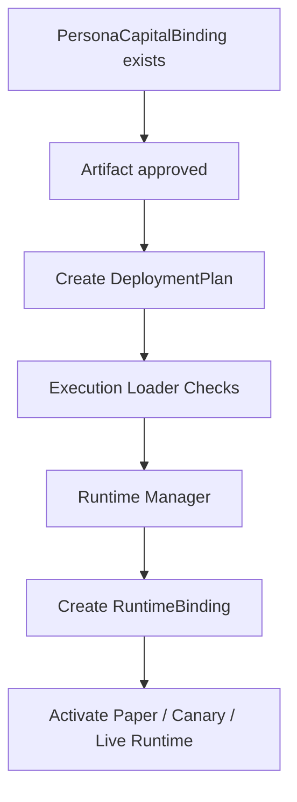

# BINDING_AND_DEPLOYMENT_SEMANTICS.md

Last updated: 2026-04-09
Status: canonical binding and deployment semantics
Tier: L1 Platform Architecture & Policy
Scope: PersonaCapitalBinding, deployment ownership, DeploymentPlan, RuntimeBinding write authority, and multi-persona binding rules
Conflict rule: this document overrides broader deployment wording in architecture/planning docs; stage thresholds and rollback action semantics defer to their dedicated L1 policy files

## 1. 文件目的

本文件定義 Pantheon 中：

- Persona 與 Capital Pool 的 binding 語意
- binding 與 deployment 的差異
- deployment 的 ownership / trigger / write authority
- 多 persona 綁到同一 pool 時的處理原則

> 核心決議：**binding 是治理關聯，不是部署動作。**  
> 真正部署必須走：  
> `ApprovalDecision -> DeploymentPlan -> RuntimeBinding`

---

## 2. 關鍵物件

### 2.1 PersonaCapitalBinding
定義 persona 與 capital pool 之間的合法關聯。

### 2.2 ApprovalDecision
定義某 artifact / strategy / allocation 是否被允許進下一步。

### 2.3 DeploymentPlan
定義如何把 approved artifact 部署到某個 pool / runtime。

### 2.4 RuntimeBinding
定義某 runtime 當前實際正在執行哪個 artifact。

---

## 3. Binding 與 Deployment 的正式區分

### 3.1 三段語義正式拆分

Pantheon 將 binding → deployment → runtime 正式拆為三個獨立物件，語義不可混用：

| 層級 | 物件 | 語義 | 是否需要 artifact |
|---|---|---|---|
| 1. Binding | `PersonaCapitalBinding` | 治理關聯 / 權限上限 | 否 |
| 2. Deployment Plan | `DeploymentPlan` | 治理核准的部署意圖 | 必須有 approved artifact |
| 3. Runtime Binding | `RuntimeBinding` | runtime 實際載入狀態 | 必須有 approved artifact + deployment plan |

**Chicken-and-egg 的正式解法：**

> binding 可以先存在，且不需要 artifact。
> deploy 必須同時依賴 binding + approved artifact。
> runtime binding 只在 deploy 執行成功後才建立。

### 3.2 `allowed_deployment_scope` 語義

`PersonaCapitalBinding.deployment_mode` 正式更名為 `allowed_deployment_scope`。

它表達的是**權限上限**，不是當前部署狀態。

可選值：

- `none`：僅關聯，不可部署
- `paper`：最高可部署到 paper
- `canary`：最高可部署到 canary
- `live`：最高可部署到 live

這與實際部署狀態無關。binding 建立時即使還沒有 artifact，`allowed_deployment_scope` 仍然有意義——它表示這個 persona 在這個 pool 上未來「最多可以做到哪個階段」。

### 3.3 Binding 與 Deployment 的正式區分

| 概念 | Binding | Deployment |
|---|---|---|
| 性質 | 治理 / 權限 / admissibility | 實際執行 |
| owner | Governance + Capital Pool Plane | Governance + Execution Plane |
| 是否直接啟動 runtime | 否 | 是 |
| 是否需要 approved artifact | 不一定 | 必須 |
| 是否可被 UI 直接提出 | 可提出，但需治理寫入 | 可提出，但需治理核准與執行 |

### 3.4 Binding 的意義
binding 表示：

- 這個 persona 對這個 pool 是否有合法關聯
- 可以擔任 advisor / paper owner / live owner 哪種角色
- deployment mode 的上限是什麼
- mandate / budget / 有效期間是什麼

### 3.5 Deployment 的意義
deployment 表示：

- 某個 approved artifact 將被載入某個 pool runtime
- 哪個 mode（paper / canary / live）
- 什麼時間切換
- rollback target 是什麼
- loader checks 是否已通過

---

## 4. Binding 模型

### 4.1 PersonaCapitalBinding 結構
```text
binding_id
persona_id
capital_pool_id
role
allowed_deployment_scope
mandate
budget
effective_from
effective_to
status
```

### 4.2 `role` 語意
- `advisor`
- `paper_owner`
- `live_owner`

role 也決定 deployment ceiling：

- `advisor`：只允許 `allowed_deployment_scope = none`
- `paper_owner`：最高只允許 `allowed_deployment_scope = paper`
- `live_owner`：可允許 `paper` / `canary` / `live`

### 4.3 `allowed_deployment_scope` 語意
- `none`
- `paper`
- `canary`
- `live`

> `allowed_deployment_scope` 表達的是權限上限，不是自動部署結果，也不是當前部署狀態。

---

## 5. 誰可以建立 / 修改 binding

### 正式決議
binding 的 lifecycle 應由 **Governance Plane** 主導。

### 流程
1. Operator Console / Governance Workbench 提交 binding request
2. Governance Plane 檢查：
   - persona lifecycle 是否允許
   - capital pool policy 是否允許
   - role / mode 是否超權
3. 通過後，寫入 Capital Pool Plane 的 Binding Registry

### Owner
- 提案：Operator / Reviewer
- 驗證：Governance Plane
- 寫入保存：Capital Pool Plane

---

## 6. Binding 的行為效果

Binding 生效後會改變：

- 該 persona 對該 pool 的 admissibility
- UI / BFF 中可見的 deployment actions
- Governance 是否允許其 sponsor deployment plan
- capability resolver 可計算出的 effective deploy scope

Binding **不會直接改變**：

- runtime 狀態
- 當前 running artifact
- broker orders
- open positions

---

## 7. Deployment 模型

### 7.1 部署前置條件
真實 deployment 前，必須同時存在：

- 合法 `PersonaCapitalBinding`，且 `allowed_deployment_scope` >= `DeploymentPlan.target_stage`
- `ApprovalDecision`
- `DeploymentPlan`
- loader compatibility pass
- runtime target 可用

### 7.2 DeploymentPlan 結構
```text
plan_id
approval_decision_id
artifact_id
artifact_version
capital_pool_id
current_stage
target_stage
transition_type
runtime_action
runtime_config_ref
rollback.target_artifact_id
rollback.target_version
rollback.action_type
scale.capital_scale_pct
scale.gross_scale_pct
schedule_window
pre_checks[]
post_checks[]
status
```

正式 machine-readable schema 與 planner 實作位於：

- `services/control-plane/governance/deployment_plan.schema.json`
- `services/control-plane/governance/deployment_plan.py`
- `services/control-plane/governance/deployment_plan.contract.md`

### 7.3 RuntimeBinding 結構
```text
binding_id
runtime_id
capital_pool_id
artifact_id
deployment_mode
version
effective_at
status
rollback_parent
```

---

## 8. Deployment 流程



### 說明
- Binding 是必要條件，但不是部署觸發器
- 真正觸發部署的是 `DeploymentPlan`
- Runtime Manager 只消費 `DeploymentPlan`，不監聽 binding 自動部署

---

## 9. 多 persona 綁同一 pool 的規則

### 核心決議
**預設：一個 capital pool = 一個 LEAN runtime。**

在沒有 `PoolSleeve` 模型前：

- 多 persona 可以同時是 `advisor`
- 多 persona 可以同時是 `paper_owner`
- 同一 deployment scope 下，只允許一個 live deployment sponsor

### 正確的多人格共存方式
多人格若要服務同一 pool，應在上游經過：
- judge / aggregator
- committee synthesis
- approved unified artifact

再把該 artifact deploy 到單一 runtime。

---

## 10. 若未來需要 pool sleeve

若未來要支援同池多 sleeve，需新增：

### PoolSleeve
```text
sleeve_id
capital_pool_id
persona_id
artifact_id
budget_pct
risk_budget
status
```

並把：
- pool-level allocator
- sleeve-level attribution
- sleeve-level rollback
一併引入。

> 在未引入 sleeve 前，系統文件應明定「單 pool 單 runtime、單 runtime 單 active artifact」。

---

## 11. `deployment_mode` 與 `allowed_deployment_scope` 的正式語意

### 11.1 `allowed_deployment_scope`（PersonaCapitalBinding）

此欄位定義的是 **權限上限**，不是當前狀態。
它回答：「這個 persona 在這個 pool 上最多可以做到哪個階段？」

| 值 | 意義 |
|---|---|
| `none` | 僅建立治理關聯，不可部署 |
| `paper` | 最高可部署到 paper |
| `canary` | 最高可部署到 canary |
| `live` | 最高可部署到 live |

### 11.2 `deployment_mode`（RuntimeBinding）

此欄位定義的是 **實際部署狀態**，回答：「這個 runtime 目前在哪個階段執行？」

| 值 | 意義 |
|---|---|
| `paper` | 模擬成交，不進真實 broker |
| `canary` | 真實市場，受限資金與曝險 |
| `live` | 完整 live deployment，仍受 risk policy 約束 |

### 11.3 兩者關係

```
allowed_deployment_scope 約束 deployment_mode 的上限
```

例：
- binding 的 `allowed_deployment_scope` = `paper` → 不可部署到 canary 或 live
- binding 的 `allowed_deployment_scope` = `live` → 可部署到 paper、canary 或 live，由 DeploymentPlan 決定

---

## 12. 權限與 veto

### 寫權限
- Binding：Governance Plane 驗證，Capital Pool Plane 存檔
- DeploymentPlan：Governance Plane
- RuntimeBinding：Execution Plane

### Veto 權
- Governance Gate：可 veto binding 升級
- Review Gates：可 veto deployment
- Loader Checks：可 veto runtime loading
- Risk Policy：可 veto 某 pool 的 live / canary admissibility

---

## 13. Sync / Async 邊界

### 同步
- binding request
- binding validation
- deployment plan creation
- deployment approval

### 非同步
- actual deploy
- runtime replace
- runtime restart
- post-deploy checks

### Retry owner
- binding 命令：BFF / caller
- deployment execution：Runtime Manager
- loader compatibility：Execution Plane
- broker handoff：runtime / broker adapter

---

## 14. API 草案

### Binding APIs
- `POST /api/bindings`
- `PATCH /api/bindings/{binding_id}`
- `GET /api/bindings/{binding_id}`
- `GET /api/bindings?capital_pool_id=...`
- `GET /api/bindings?persona_id=...`
- `GET /api/bindings/admissibility?persona_id=...&capital_pool_id=...&target_stage=...`

### Capital Pool Plane canonical service boundary

`CapitalPool` 與 `PersonaCapitalBinding` 的正式 service boundary 由
`services/capital/` 提供。

- pool / binding 的 write path 必須走此 service
- Runtime Manager / Persona Plane / BFF 的治理 read path 應讀取此 service
  提供的 admissibility / live-owner / snapshot surfaces，而不是各自直接改 store

### Deployment APIs
- `POST /api/deployments/plans`
- `GET /api/deployments/plans/{plan_id}`
- `POST /api/deployments/plans/{plan_id}/approve`
- `POST /api/deployments/plans/{plan_id}/reject`

### Runtime APIs
- `POST /api/runtimes/deploy`
- `POST /api/runtimes/{runtime_id}/replace`
- `GET /api/runtime-bindings/{binding_id}`

### 14.1 Governance-API 家族 vs Runtime-Control 邊界（SVC-GOVERNANCE-API 正式決議）

`ApprovalDecision`、`DeploymentPlan` / `DeploymentSaga`、`PersonaCapitalBinding` /
`CapitalPool`、`EvolutionDecision` 由四個獨立的 deployable HTTP service 暴露，合稱
**governance-api family**。這個家族與 **runtime-control plane**（`runtime-manager`）
之間的 service boundary 是顯式的、不可越界。

| Domain object | 正式 service | Container port | 對應 contract |
|---|---|---:|---|
| `ApprovalDecision` | `services/governance/` | `8082` | `services/governance/contract.md` |
| `DeploymentPlan` / `DeploymentSaga` | `services/deployment/` | `8095` | `services/deployment/contract.md` |
| `PersonaCapitalBinding` / `CapitalPool` | `services/capital/` | `8092` | `services/capital/contract.md` |
| `EvolutionDecision` | `services/evolution/` | `8093` | `services/control-plane/governance/evolution_decision.contract.md` |
| `RuntimeBinding` 寫入與 operator command 派遣 | `services/runtime-manager/` | `8081` | `services/execution/runtime-manager/contract.md` |

家族契約的單一摘要文件：`services/control-plane/governance/service_family_contract.md`。
任何 cross-service 邊界調整必須先更新該文件，再更新個別 service 的 contract.md。

### 14.2 Write 邊界

| 寫入動作 | 必須走的 service | 不可越界對象 |
|---|---|---|
| `ApprovalDecision` lifecycle (propose / review / decide / revoke) | `services/governance/` | runtime-manager、deployment、capital、evolution |
| `DeploymentPlan` 建立、status 轉換、`DeploymentSaga` outbox/inbox | `services/deployment/` | runtime-manager、governance、capital |
| `CapitalPool` / `PersonaCapitalBinding` lifecycle、`allowed_deployment_scope` | `services/capital/` | runtime-manager、deployment、evolution |
| `EvolutionDecision` lifecycle (propose / review / approve / execute / followthrough) | `services/evolution/` | runtime-manager、deployment、capital |
| `RuntimeBinding` lifecycle、`deployment_mode`、kill-switch / safe-mode、operator command 派遣 | `services/runtime-manager/` | governance、deployment、capital、evolution |

**核心邊界規則：governance-api 家族 不寫 `RuntimeBinding`，runtime-control plane 不寫 governance objects。**
跨界協作只能透過 outbox event（DEP-002）或 saga reference（`approval_decision_id` /
`plan_id` / `binding_id`）做 read-side 連結。

### 14.3 Read 邊界

| 讀取需求 | 應呼叫的 service | 端點摘要 |
|---|---|---|
| 最近一筆 approved `ApprovalDecision` | `services/governance/` | `GET /api/governance/approvals/latest-approved` |
| 某 plan 的 `DeploymentPlan` / saga / outbox / inbox | `services/deployment/` | `GET /api/deployment/plans/{plan_id}`、`GET /api/deployment/sagas/{saga_id}`、`GET /api/deployment/outbox` |
| pool / binding admissibility | `services/capital/` | `GET /api/bindings/admissibility?persona_id=&capital_pool_id=&target_stage=` |
| evolution decision、boundary、threshold 評估 | `services/evolution/` | `GET /api/evolution/proposals`、`GET /api/evolution/proposals/{decision_id}/boundary` |
| 運行中的 `RuntimeBinding`、kill-switch 狀態、operator command audit | `services/runtime-manager/` | `GET /api/runtime-bindings/{binding_id}`、`GET /api/internal/v1/...` |

BFF (`services/control-plane/bff/`) 的長期合法 read path 必須命中上面這五個 service，
而非 `read_store.py` 的 snapshot/default fallback。Snapshot 路徑只保留作為
`BFF_HA_AND_CONTROL_PLANE_RESILIENCE.md` 定義的 degraded fallback，並由 SVC-SURFACES
完成 BFF rewiring。

### 14.4 Compose 端點與環境變數契約

| 環境變數 | Container 內的 base URL | 對應 service |
|---|---|---|
| `PANTHEON_GOVERNANCE_APPROVAL_API_URL` | `http://governance:8082` | ApprovalDecision |
| `PANTHEON_DEPLOYMENT_API_URL` | `http://deployment:8095` | DeploymentPlan / DeploymentSaga |
| `PANTHEON_CAPITAL_API_URL` | `http://capital:8092` | CapitalPool / PersonaCapitalBinding |
| `PANTHEON_EVOLUTION_API_URL` | `http://evolution:8093` | EvolutionDecision |
| `PANTHEON_INTERNAL_API_URL` / `PANTHEON_RUNTIME_MANAGER_URL` | `http://runtime-manager:8081` | RuntimeBinding writes、operator command |
| `PANTHEON_GOVERNANCE_API_URL` | legacy 別名（目前指向 evolution） | 由 BFF `command_executor.py` 在 evolution proposal 流程沿用，僅供向後相容 |

新的整合工作必須使用 §14.4 的明確命名變數，並由家族 contract（§14.1 列出的單一摘要文件）統一審查；
不要再新增別名以避免回到「single governance URL」的混合語意。

---

## 15. 文件化決議

本文件正式決議：

1. Binding 不是 deployment
2. Binding 不會自動啟動 runtime
3. Runtime Manager 只吃 DeploymentPlan
4. 單 pool 單 runtime、單 runtime 單 active artifact 是預設規則
5. 多 persona 共存必須在上游聚合，而不是 runtime 內部隱式共存
6. `PersonaCapitalBinding.deployment_mode` 正式更名為 `allowed_deployment_scope`，表達權限上限
7. `RuntimeBinding.deployment_mode` 表達實際部署狀態，兩者語義獨立
8. binding 可先於 artifact 存在；deploy 必須同時依賴 binding + approved artifact
9. runtime binding 只在 deploy 執行成功後才建立
10. `services/capital/` 是 `CapitalPool` / `PersonaCapitalBinding` 的 canonical service boundary
11. binding admissibility read path 必須同時考慮 role ceiling、`allowed_deployment_scope`、binding status、與 pool governance status

---

## 16. Governance 與 Execution 層的 Status 對映說明

本平台刻意將 **governance 層** 與 **execution/DB 層** 的 status 語意分開維護，兩者不應混用。

### 16.1 CapitalPool status

| 層級 | 值 | 說明 |
|---|---|---|
| Governance（Python / JSON schema） | `active` | pool 可接受 binding 與 deployment |
| Governance | `suspended` | pool 暫停，禁止新 deployment |
| Governance | `archived` | pool 封存，僅保留歷史 |
| Execution（DB） | `provisioned` | pool 已建立，尚未有 paper binding |
| Execution | `paper_bound` | pool 有 paper deployment |
| Execution | `canary_bound` | pool 有 canary deployment |
| Execution | `live_bound` | pool 有 live deployment |
| Execution | `risk_off` | risk policy 觸發，暫停交易 |
| Execution | `paused` | 人工暫停 |
| Execution | `liquidating` | 清倉中 |
| Execution | `archived` | 同 governance archived |

**設計意圖**：governance 層 status 代表 **治理生命週期**（pool 是否合法、可操作），execution 層 status 代表 **部署狀態追蹤**（runtime 目前在哪個 stage）。兩者有對映關係，但不是一對一。如需同步，由 Capital Pool Plane 負責在 governance 決議生效後更新 DB 狀態。

### 16.2 PersonaCapitalBinding status

| 層級 | 值 | 說明 |
|---|---|---|
| Governance（Python / JSON schema） | `pending` | 待治理核准 |
| Governance | `active` | 合法關聯，可用於 deployment 准入計算 |
| Governance | `suspended` | 暫停，不計入 admissibility |
| Governance | `revoked` | 撤銷，終態 |
| Governance | `expired` | 到期，終態 |
| Execution（DB） | `active` | 對映 governance `active` |
| Execution | `inactive` | 對映 governance `pending` / `suspended` / `revoked` / `expired` |

**設計意圖**：DB 層採用粗粒度 status（`active` / `inactive`）供 runtime-manager 快速查詢。精細生命週期狀態（`pending`、`suspended`、`revoked`、`expired`）由 governance Python 物件維護，並在狀態變更時更新 DB。RUN-001 在查詢 admissibility 時應以 governance 層為準，不直接依賴 DB status 值。

---

## 17. 後續規格拆解（non-blocking，不影響目前 L1 真相）

以下文件屬於後續規格拆解與落地細化，不是本文件目前生效的前置條件。

- `DEPLOYMENT_POLICY_SPEC.md`
- `CAPITAL_POOL_MODEL.md`
- `SERVICE_OWNERSHIP_AND_TRIGGER_MATRIX.md`

---

## 18. 結論

把 binding 與 deployment 拆開，是 Pantheon 能保持清晰治理邊界的關鍵。  
如果兩者混在一起，會導致：

- persona 一綁定就像自動擁有 live 權限
- runtime manager 不知道要監聽誰
- 多 persona 同池共存語意崩壞
- approval / rollback 難以追蹤

因此，本文件將 binding 定義為治理關聯、將 deployment 定義為執行動作，兩者必須透過 `ApprovalDecision -> DeploymentPlan -> RuntimeBinding` 接起來。

---

## 19. RuntimeBinding Write Authority（RUN-001 正式決議）

### 19.1 Write owner

| 物件 | 欄位 | Write Owner |
|---|---|---|
| `RuntimeBinding` | 所有欄位 | Execution Plane（Runtime Manager） |
| `RuntimeBinding.status` | 狀態轉換 | Runtime Manager only |
| `RuntimeBinding.retired_at` | 終態時間戳 | Runtime Manager only |
| Position lineage `current_managed_by_binding_id` | replace / rollback 時更新 | Runtime Manager only |

**不允許**：Governance Plane、Capital Pool Plane、BFF 任何服務直接寫入 `RuntimeBinding`。

### 19.2 RuntimeBinding 必攜帶三個跨物件 reference

每個 `RuntimeBinding` 必須同時攜帶以下三個 reference（RUN-001 acceptance criteria）：

| Reference | 欄位 | 指向 |
|---|---|---|
| Deployment Plan | `plan_id` | `DeploymentPlan.plan_id` |
| Governance Binding | `persona_capital_binding_id` | `PersonaCapitalBinding.binding_id` |
| Execution Stage | `deployment_mode` | 實際執行階段：`paper` / `canary` / `live` / `frozen` |

這三個 reference 讓稽核鏈可以從 `PersonaCapitalBinding → DeploymentPlan → RuntimeBinding` 完整追蹤。

### 19.3 建立 RuntimeBinding 的前置條件

1. `DeploymentPlan` 存在且 `status ∈ {approved, executing}`
2. `PersonaCapitalBinding` 存在且 `status = active`，且 `allowed_deployment_scope >= target_stage`
3. 若 `CapitalPool.single_runtime_enforced = True`，該 pool 不能已有 `active` 的 `RuntimeBinding`
4. Execution loader checks 通過
5. `RuntimeBinding.deployment_mode` 必須等於 `DeploymentPlan.target_stage`

### 19.4 實作 artifacts（RUN-001）

| Artifact | 說明 |
|---|---|
| `services/execution/runtime-manager/runtime_binding.py` | Python platform object — `RuntimeBinding`、`RuntimeBindingStore`、validation |
| `services/execution/runtime-manager/runtime_binding.schema.json` | Machine-readable JSON schema（含 `persona_capital_binding_id`） |
| `services/execution/runtime-manager/contract.md` | Runtime Manager write authority 完整契約 |
| `services/execution/runtime-manager/authority_matrix.md` | Write authority matrix（RUN-001A support slice） |
| `services/execution/runtime-manager/rollback_action_matrix.md` | Rollback action execution matrix（RUN-001A support slice） |
