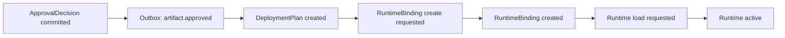

# CROSS_SERVICE_CONSISTENCY_AND_SAGA_POLICY

Last updated: 2026-04-09
Status: canonical cross-service consistency and saga policy for Pantheon deployment plane
Tier: L1 Platform Architecture & Policy
Scope: distributed write consistency model, saga strategy, compensation behavior, and intermediate state handling across deployment and governance services
Conflict rule: this document overrides vague mentions of "distributed transaction" or "rollback" in planning docs; for runtime-level rollback action semantics defer to ROLLBACK_AND_POSITION_SEMANTICS.md

---

## 1. 目的

本文件定義 Pantheon 在跨服務寫入時的一致性模型、saga 策略、補償行為與中間狀態。

目標是回答：

- 是否要用 distributed transaction
- artifact approved 但 deployment/binding 失敗時怎麼辦
- 誰負責 retry
- 中間狀態要不要顯式保存
- 如何保證 audit 與可追蹤性

---

## 2. 結論摘要

### 2.1 Pantheon 不使用 distributed transaction
Pantheon 採：

- **local ACID transaction**
- **outbox / inbox**
- **saga orchestration**
- **compensation**
- **explicit intermediate states**

### 2.2 跨域動作不追求單步原子完成
跨服務流程如：
- approval -> deployment plan -> runtime binding -> runtime deploy

不以 2PC / distributed transaction 保證單步原子，而是用狀態機保證：
- 可恢復
- 可重試
- 可補償
- 可審核

### 2.3 中間狀態必須顯式存在
例如：
- `approved_not_deployed`
- `deployment_failed`
- `binding_pending`
- `runtime_load_failed`

不得假裝操作要嘛成功要嘛不存在。

---

## 3. 適用範圍

適用於下列跨域動作：

- Strategy / Artifact approval -> deployability
- DeploymentPlan creation -> RuntimeBinding creation
- RuntimeBinding creation -> runtime load / activation
- Rollback request -> runtime replace / liquidate / binding supersede
- Freeze decision -> promotion block / deploy block propagation

---

## 4. 一致性模型

## 4.1 單服務內一致性
每個服務在自己的 write boundary 內，必須使用本地 transaction。

例：
- registry-core 寫 `ApprovalDecision`
- runtime-manager 寫 `RuntimeBinding`
- telemetry-svc 寫 `TelemetryEvent`
- capital-pool service 寫 `PersonaCapitalBinding`

## 4.2 跨服務一致性
使用：
- outbox event
- at-least-once delivery
- idempotent consumer
- compensating command

---

## 5. Saga 模型

## 5.1 Orchestration-first
對高價值流程，使用 orchestration 比 choreography 更清楚。

正式建議的 orchestrator：
- `deployment-orchestrator`
- `rollback-orchestrator`

## 5.2 基本 deploy saga

## 5.3 補償路徑
若某步失敗：

- plan 建立失敗 -> 保持 `approved_not_deployed`
- binding 建立失敗 -> `deployment_failed`
- runtime load 失敗 -> `binding_created_but_inactive` + retry / rollback path
- repeated failure -> incident + manual intervention

---

## 6. 典型失敗案例

## 6.1 artifact 已批准，但 binding 建立失敗
狀態：
- artifact = approved
- deployment = failed
- runtime = no binding

系統動作：
- 保留 `ApprovalDecision`
- 建 `DeploymentFailureCase`
- 可自動 retry
- 必要時 operator review

## 6.2 binding 建立成功，但 runtime load 失敗
狀態：
- RuntimeBinding 已存在
- runtime 未 active

系統動作：
- binding 狀態標記 `inactive_failed_load`
- 可 retry load
- 若超過 threshold，binding superseded / aborted

## 6.3 rollback 執行到一半失敗
狀態：
- old binding 仍 active 或 paused
- new binding 未 fully active

系統動作：
- rollback saga 保持 `in_progress`
- runtime-manager 進 safe mode / paused
- 禁止進一步 deploy
- incident 開立

---

## 7. Retry ownership

## 7.1 command issuer
只負責拿到 accepted / rejected。  
不負責跨服務 retry。

## 7.2 orchestrator
負責：
- saga retry
- step timeout handling
- compensation command
- final state closure

## 7.3 consumer
必須 idempotent。  
若事件重播，不可重複造成 side-effect。

---

## 8. 補償規則

## 8.1 deploy saga
- plan 建立後失敗：plan 可標記 aborted
- binding 建立後 load 失敗：binding 標記 failed_inactive
- active 後出現 severe mismatch：進 rollback saga

## 8.2 rollback saga
- replace 失敗：回到 old binding 或進 paused state
- liquidate_then_replace 失敗：優先保證 pause / risk-off，再重試 liquidation path

---

## 9. Outbox / Inbox 原則

每個 write owner service 必須有：
- local transaction + outbox append
- consumer inbox / dedup table
- replayable event id

必備欄位：
- event_id
- aggregate_type
- aggregate_id
- sequence_no
- idempotency_key
- trace_id
- emitted_at

---

## 10. v1 決策

1. 不用 distributed transaction
2. 採 local ACID + outbox/inbox + saga
3. 顯式保存中間狀態
4. orchestrator 負責 retry / compensation
5. consumer 必須 idempotent
6. 失敗不可靜默；必須留 audit / incident 線索

---

## 11. 後續規格拆解（non-blocking，不影響目前 L1 真相）

以下項目屬於後續 saga / consistency 細化，不是本文件目前生效的前置條件。

- deploy saga state machine 詳版
- rollback saga state machine 詳版
- timeout SLA matrix
- compensation command catalogue
- outbox / inbox schema

---

## 12. DEP-002 Implementation Anchor

本文件對應的第一版實作骨架位於：

- `services/control-plane/governance/deployment_saga.contract.md`
- `services/control-plane/governance/deployment_saga.py`

它把本文件的 orchestration-first、outbox/inbox、compensation 邊界收斂成：

- `DeploymentSaga` aggregate
- saga event envelope / outbox record / inbox receipt
- failure point → compensation command 的 owner-scoped matrix
