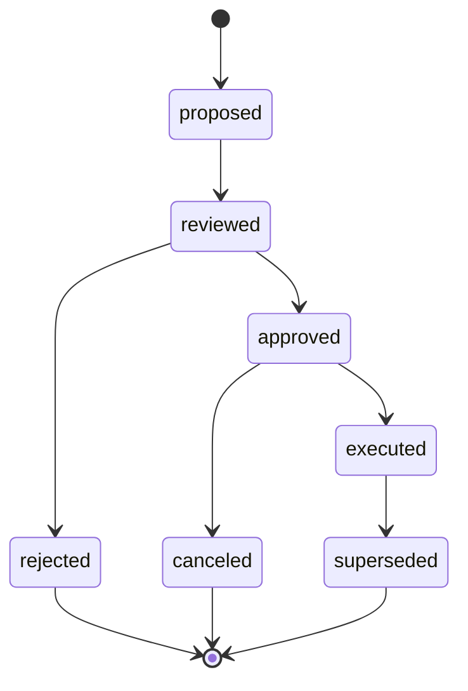

# EVOLUTION_REVIEW_AND_THRESHOLDS.md

Last updated: 2026-04-11
Status: canonical evolution governance policy
Tier: L1 Platform Architecture & Policy
Scope: EvolutionDecision lifecycle, review owners, thresholds, automation boundaries, and allowed actions
Conflict rule: this document overrides broader evolution wording in architecture/planning docs; rollback execution details still defer to the rollback policy document

## 1. 文件目的

本文件定義 Pantheon 在 **Evolution Plane** 中對 `EvolutionDecision` 的正式審核流程、owner、風險分級、threshold、執行權限與回灌機制。

本文件的目的是把原本在系統分析與討論中的模糊點收斂成可實作契約，特別回答以下問題：

- `proposed -> reviewed -> approved -> executed` 中的 `reviewed` 由誰負責
- drift / degradation / correction 等 threshold 如何定義
- `freeze`、`rollback`、`retrain`、`mutate` 等動作如何分層
- 哪些 evolution 可自動執行，哪些必須走人工審核或委員會流程

本文件是 **governance policy**，不是 runtime loader 文件，也不是 research worker 文件。

---

## 2. 適用範圍

本文件適用於下列目標：

- `StrategySpec`
- `AlphaTemplate`
- `CandidateArtifact`
- `AllocationPolicyArtifact`
- `Persona`
- `PersonaCapitalBinding`
- `CapitalPool`（僅限行為層/風險層調整，不取代第三包中的 deployment 與 runtime action）

---

## 3. 核心原則

### 3.1 Evolution 是 governance 動作，不是研究 worker 的副作用

研究 worker 可以提出 `retrain` 建議，drift detector 可以提出 `freeze` 建議，但 **只有 Evolution Controller + Review Owners** 可以把它變成正式 `EvolutionDecision`。

### 3.2 EvolutionDecision 的 owner 分成提案者與核准者

- **提案者**：Evolution Controller（系統）
- **核准者**：依風險等級不同，由 Reviewer、Risk Owner 或 Governance Committee 擔任

### 3.3 Freeze 與 Rollback 不同

- `rollback`：deployment / runtime mitigation，偏 operational action
- `freeze`：governance quarantine，偏 lifecycle state change

### 3.4 所有 threshold 都採「全域預設 + 策略族 / persona / pool override」模式

文件先定 v1 全域預設值；實際生效規則由 `EvolutionPolicy` / `DriftPolicy` / `DeploymentPolicy` 允許逐層 override。

---

## 4. EvolutionDecision 狀態機



### 4.1 狀態說明

- `proposed`：系統或規則引擎提出建議，尚未審核
- `reviewed`：已進入正式 review，owner 已受理
- `approved`：允許執行
- `executed`：動作已實施（或已提交到下游 plane 執行）
- `rejected`：決議不採納
- `canceled`：尚未執行前被取消
- `superseded`：被更新版本決議覆蓋

---

## 5. EvolutionDecision 類型

### 5.1 低風險類型

- `observe`
- `revalidate`
- `retrain`
- `require_more_data`
- `flag_for_review`

### 5.2 中風險類型

- `reduce_budget`
- `tighten_risk_policy`
- `mutate_persona_route_policy`
- `mutate_consult_policy`
- `freeze_paper`
- `freeze_canary`

### 5.3 高風險類型

- `freeze_live_strategy`
- `retire_strategy`
- `retire_alpha_template`
- `split_persona`
- `merge_persona`
- `remove_live_owner_role`
- `restrict_pool_eligibility`
- `force_risk_off`

---

## 6. Reviewed / Approved 的 owner 定義

### 6.1 低風險決議

#### reviewed owner
- `Reviewer on Duty`
- 允許規則先行自動 review，再由 reviewer 追認

#### approved owner
- `Reviewer on Duty`
- 若策略族被標記為「manual-only」，則不得自動批准

### 6.2 中風險決議

#### reviewed owner
- `Reviewer`
- `Risk Owner`

#### approved owner
- `Risk Owner`
- 必要時加 `Operator`

### 6.3 高風險決議

#### reviewed owner
- `Governance Committee`

#### Governance Committee 固定組成（v1）
- `Research Lead`
- `Risk Owner`
- `Operator / Platform Owner`

#### approved owner
- `Governance Committee`
- 任一席次拒絕，則不得自動批准

---

## 7. Threshold v1 預設值

> 以下為 v1 全域預設。最終實施時允許依 strategy family、asset class、pool 進行 override。

### 7.1 Performance degradation threshold

觸發 `proposed`：

- 最近 20 交易日風險調整績效（Sharpe / IR / strategy family 定義指標）低於 paper/canary 基線的 **50%**
- 或 rolling drawdown 超過研究預期區間的 **1.25 倍**
- 或連續 **3 個評估窗**明顯劣於 baseline

### 7.2 Execution drift threshold

觸發 `proposed`：

- realized slippage 較最近 20 交易日基線惡化 **25% 以上**
- order reject rate > **1.0%**
- partial fill / timeout anomaly 連續 **3 個交易日**異常

### 7.3 Feature / label / policy drift threshold

- PSI > **0.20**：warning
- PSI > **0.30**：mandatory review
- label generation mismatch rate > **0.5%**：mandatory review
- policy output deviation 超過 baseline envelope：warning / review（依策略族定義）

### 7.4 Human correction threshold

- 同一 persona 在 **5 個 trainer session 內超過 3 次重大人工修正**
- 同一 strategy 在 **14 天內被連續 reject 2 次以上**

### 7.5 Governance / incident threshold

直接進高風險路徑：

- 任一 `Severity-1` incident
- 同一 artifact 在 **30 天內 2 次 Severity-2 incident**
- execution loader / binding / approval mismatch 未解決

### 7.6 自動 freeze 提議條件

直接產生高風險 `proposed`：

- live artifact 發生 `Severity-1`
- drift + drawdown 同時超標
- rollback 已執行但問題仍持續

---

## 8. EvolutionPolicy / DriftPolicy

### 8.1 EvolutionPolicy

建議 schema：

```yaml
policy_id: default-evolution-policy-v1
scope:
  strategy_family: [equity_cross_sectional, stat_arb, macro_overlay]
  asset_class: [equity, futures, options]
low_risk_actions:
  auto_review_allowed: true
  auto_approve_allowed: false
medium_risk_actions:
  reviewer_required: true
  risk_owner_required: true
high_risk_actions:
  governance_committee_required: true
freeze_rules:
  severity1_auto_propose: true
  repeated_severity2_window_days: 30
  repeated_severity2_count: 2
```

### 8.2 DriftPolicy

建議 schema：

```yaml
policy_id: default-drift-policy-v1
performance:
  window_days: 20
  sharpe_ratio_floor_pct_of_baseline: 0.5
  max_expected_drawdown_multiplier: 1.25
execution:
  slippage_drift_pct: 0.25
  reject_rate_max: 0.01
feature:
  psi_warning: 0.20
  psi_review: 0.30
label:
  mismatch_rate_max: 0.005
human_correction:
  sessions_window: 5
  major_corrections_threshold: 3
```

---

## 9. Freeze / Retrain / Revalidate / Mutate 的語意

### 9.1 `retrain`
重跑模型 / policy / feature pipeline。屬研究面動作。

### 9.2 `revalidate`
不一定重訓，但重新做 rolling / OOS / paper admissibility。屬研究 + governance 交界動作。

### 9.3 `mutate`
小幅調整 persona/strategy 的結構參數，例如：
- route policy
- consult policy
- risk tolerance
- allowed tools

### 9.4 `freeze`
禁止該 strategy / artifact / persona 進一步 promotion 或新 deploy，直到解除。

### 9.5 `retire`
永久退出可用範圍，不再新建 deploy，但保留歷史資料。

---

## 10. Freeze 與 Rollback 的正式區別

| 項目 | Freeze | Rollback |
|---|---|---|
| 類型 | Governance state change | Runtime / deployment action |
| 目的 | 隔離、禁止後續 deploy | 立即止血、替換/停用當前 deploy |
| 發生位置 | Governance / Evolution | Runtime / Deployment |
| 是否必然影響當前 runtime | 不一定 | 一定 |
| 是否可獨立發生 | 可以 | 可以 |

### 實務規則

- `freeze` 可在無當前 runtime 的情況下發生
- `rollback` 可在不 freeze 的情況下發生
- 高風險 incident 通常會同時觸發兩者，但需分別建模

---

## 11. Operational Evolution Routing Boundary

`EvolutionDecision` 的 normal path 必須明確回答四件事：

1. 哪個 threshold / incident 會觸發哪條 action path
2. reviewed / approved owner 是誰
3. cooldown / observation window 從哪裡來
4. 下游到底是哪個 plane 執行，且誰是唯一 write owner

### 11.1 Normal-path action routing matrix

| Action path | Trigger / threshold source | reviewed owner | approved owner | cooldown / observation | Primary execution plane | Authoritative writer | Downstream boundary |
|---|---|---|---|---|---|---|---|
| `freeze` on `paper` / `canary` | §7.3–§7.6 觸發 freeze，且 target stage 為 `paper` 或 `canary` | `Reviewer`, `Risk Owner` | `Risk Owner`（必要時加 `Operator`） | 依 `EVOLUTION_COOLDOWN_AND_CONVERGENCE_POLICY.md` §5.2 的中風險 path | `governance` | Governance Plane 寫 target quarantine / admissibility state | 預設只做 governance quarantine；不自動發 runtime rollback |
| `freeze` on `live` with no active runtime | §7.5–§7.6；target stage 是 `live`，但當前沒有 active runtime 需要止血 | `Governance Committee` | `Governance Committee` | 依 `EVOLUTION_COOLDOWN_AND_CONVERGENCE_POLICY.md` §5.2 的高風險 path | `governance` | Governance Plane 寫 target quarantine / admissibility state | 仍是 high-risk freeze；只是沒有 companion deployment/runtime follow-through |
| `freeze` on `live` with active runtime | §7.5–§7.6；尤其是 Severity-1、repeated Severity-2、unresolved binding/approval mismatch、或 rollback 已執行但問題仍持續 | `Governance Committee` | `Governance Committee` | 依 `EVOLUTION_COOLDOWN_AND_CONVERGENCE_POLICY.md` §5.2 的高風險 path | `governance` 為主，並可伴隨 `deployment` / `runtime` follow-through | Governance Plane 只寫 freeze decision；DeploymentPlan 仍由 Governance/Promotion plane 建立；RuntimeBinding 仍只能由 Runtime Manager 改寫 | 若只需停止新 entries 並保留既有 book，建立 `DeploymentPlan(current_stage -> frozen)`；若 artifact / config 已不安全，則另外走 rollback request |
| `rollback` operational follow-through | 來自 approved evolution decision、active incident、或 postmortem follow-up；threshold 依 §7.5–§7.6，action semantics 依 `ROLLBACK_AND_POSITION_SEMANTICS.md` | 沿用觸發它的 parent review chain；normal path 不建立平行 approval chain | 沿用觸發它的 parent approval chain；fast-path 例外留給 `EVO-005` | rollback 不開新的 evolution cooldown；沿用 parent `EvolutionDecision` 的 cooldown / observation | `runtime` | `Rollback Controller` 決定 rollback request；`Runtime Manager` 是 `RuntimeBinding` / position cutover 的唯一 writer | 必須消費既有 `DeploymentPlan.rollback.action_type`、incident evidence、與 risk / incident policy；不得由 evolution plane 直接改 binding |
| `retrain` / `revalidate` | §7.1、§7.3、§7.4 的 performance / feature / human-correction 訊號 | `Reviewer on Duty` | `Reviewer on Duty`；若 policy 允許可由自動 gate 追認 | 依 `EVOLUTION_COOLDOWN_AND_CONVERGENCE_POLICY.md` §5.2 的低風險 path | `research` | Research workflow / job system 寫 research work item；registry / deployment 寫入仍屬後續 plane | executed 代表 research job / work item 已被受治理地建立，不代表可直接 redeploy |
| redeploy follow-through | retrain / revalidate / revive / freeze-lift 之後，新的 artifact 已重新通過 approval 與 stage gate；threshold 依 `PAPER_CANARY_LIVE_POLICY.md` §5–§7 | 依 target stage 的 deployment reviewer 鏈 | `paper`: review gate；`canary` / `live`: `Reviewer + Risk Owner + Operator` | 不建立新的 evolution cooldown；必須先滿足 parent decision observation，之後再受 deployment stage policy 約束 | `deployment` | Governance / Promotion plane 建立新的 `ApprovalDecision` 與 `DeploymentPlan`；`Runtime Manager` 僅消費 plan | redeploy 不是獨立 `EvolutionDecision.action_type`；它是 approved evolution outcome 的 deployment follow-through，不得形成 shadow runtime command surface |

### 11.2 Freeze-only vs freeze-plus-operational-mitigation

- `freeze` 在沒有 active runtime 時，只有 governance quarantine，沒有 runtime side effect。
- `freeze` 在 `paper` / `canary` 有 active runtime 時，預設仍是 governance quarantine；只有當 reviewer / risk owner 明確要求停止該 runtime 的新 entries，才建立 `DeploymentPlan(current_stage -> frozen)`。
- `freeze` 在 `live` 有 active runtime 時，必須先做 governance quarantine，再依 incident / risk policy 決定 companion operational path：
  - 只需停止新 entries、保留現有 book：走 `DeploymentPlan(current_stage -> frozen, transition_type = freeze, runtime_action = freeze_binding)`。
  - 需要替換 artifact 或把 runtime 切到 fallback：由 `Rollback Controller` 發出 rollback request，預設採 `pause_then_replace`。
  - 需要 flatten / zero exposure：由 `Risk Policy` / `Incident Classifier` / `Kill Switch` 將 rollback 升級為 `liquidate_then_replace`。
- `freeze` 與 `rollback` 可以同時存在，但必須是兩個獨立動作：一個治理隔離未來 deployability，一個處理目前 active deployment。

### 11.3 Threshold → default action-path mapping

| Trigger family | Default proposed action | Required operational follow-through |
|---|---|---|
| performance degradation（Sharpe < 50%、drawdown > 1.25x、連 3 個評估窗劣化） | `retrain` 或 `revalidate` | 無；先回 research plane |
| execution drift（slippage drift、reject rate、partial-fill anomaly） | `revalidate`、`tighten_risk_policy`、必要時 `flag_for_review` | 若已升級成 active incident，才可能伴隨 `freeze` 或 rollback |
| feature / label drift（PSI、label mismatch） | `observe`、`revalidate`、`retrain` | 無；不得直接碰 runtime |
| human correction / repeated reject | `retrain`、`flag_for_review` | 無；後續如需 redeploy，仍要走新的 approval + deployment plan |
| Severity-1 / repeated Severity-2 / unresolved loader-binding-approval mismatch | `freeze`（依 target stage 定 medium/high） | 若有 active runtime，必須再決定是 `frozen` deployment follow-through 還是 rollback |
| rollback executed but problem persists | `freeze` + committee review | 若 runtime 仍不安全，rollback action 可由 `pause_then_replace` 升級為 `liquidate_then_replace` |

---

## 12. `executed`、cooldown、以及下游完成的正式語意

### 12.1 `executed` 代表什麼

`EvolutionDecision.executed` 的正式定義是：

- 該決議已被 **authoritative downstream plane 接受**
- 並且已產生不可變的 command / job / plan / state-change reference

它 **不代表** 下游 plane 已完成全部長流程。

### 12.2 依 action path 的 `executed` 判準

- governance-only `freeze` / `retire` / `restrict_pool_eligibility`：
  - governance state change 已寫入，並取得 state-change ref
- research `retrain` / `revalidate`：
  - research job 或 governed work item 已建立
- deployment follow-through：
  - 新的 `DeploymentPlan` 已建立並被正式接手
- runtime rollback follow-through：
  - `Rollback Controller` 已接受 rollback request，並產生 runtime mitigation ref

### 12.3 cooldown / observation 何時開始

- cooldown 與 observation 都從 authoritative downstream plane 接受該 work item 的時間點開始
- downstream plane 後續成功 / 失敗 / 被取消，應回寫 incident / postmortem / audit / read model，但不改變 write owner 分界
- 若 downstream plane 失敗，應由新的 incident / postmortem / evolution proposal 處理，而不是讓原本 decision 越權直接修改 runtime / deployment object

---

## 13. write authority / sync-async 定義

### 13.1 write authority

- `Evolution Controller`：建立 `proposed`
- `Reviewer / Risk Owner / Governance Committee`：寫 `reviewed`, `approved`, `rejected`, `canceled`
- `Governance Plane`：寫 freeze / retire / eligibility 類 target governance state
- `Research Plane`：寫 retrain / revalidate work item 與其 research outputs
- `Governance / Promotion Plane`：寫 `ApprovalDecision`、`DeploymentPlan`
- `Rollback Controller`：寫 rollback request / mitigation command
- `Runtime Manager`：寫 `RuntimeBinding`、position ownership cutover、telemetry cutover

### 13.2 sync / async

#### 同步
- 建立 `proposed`
- 寫入 `reviewed`
- 寫入 `approved` / `rejected` / `canceled`
- authoritative downstream plane 接受 work item，並讓 decision 進入 `executed`

#### 非同步
- retrain / revalidate job completion
- deployment plan orchestration與 runtime activation
- rollback mitigation completion
- incident / postmortem follow-up 與 freeze-lift / redeploy readiness 判定

---

## 14. API / contract 建議

### API
- `POST /api/evolution/proposals`
- `GET /api/evolution/proposals/:id`
- `POST /api/evolution/proposals/:id/review`
- `POST /api/evolution/proposals/:id/approve`
- `POST /api/evolution/proposals/:id/reject`
- `POST /api/evolution/proposals/:id/execute`

### 事件
- `evolution.proposed`
- `evolution.reviewed`
- `evolution.approved`
- `evolution.rejected`
- `evolution.executed`
- `evolution.deployment_followthrough_requested`
- `evolution.rollback_requested`

---

## 15. 與其他 canonical 文件的關係

本文件應與以下文件一起閱讀：

- `EVOLUTION_COOLDOWN_AND_CONVERGENCE_POLICY.md`
- `ROLLBACK_AND_POSITION_SEMANTICS.md`
- `BINDING_AND_DEPLOYMENT_SEMANTICS.md`
- `LINEAGE_AND_TELEMETRY_STORAGE_DECISIONS.md`
- `PAPER_CANARY_LIVE_POLICY.md`
- `services/control-plane/governance/evolution_controller_contract.md`
- `CANONICAL_CONTRACT_MIGRATION_DECISION.md`

---

## 16. Canonical status 建議

建議本文件維持為 **canonical governance policy file**，並作為 `EVO-004` 的 L1 routing truth。
