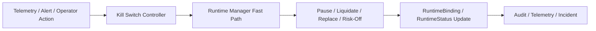

# KILL_SWITCH_AND_SAFE_MODE_EXECUTION_POLICY

Last updated: 2026-05-01
Status: canonical kill switch and safe mode execution policy for Pantheon
Tier: L1 Platform Architecture & Policy
Scope: emergency fast-path execution, kill switch routing, safe mode transitions, risk-off and liquidate command authority
Conflict rule: this document overrides any broader mention of kill switch in architecture or evolution docs; governance review thresholds and evolution decision lifecycle defer to EVOLUTION_REVIEW_AND_THRESHOLDS.md

---

## 1. 目的

本文件定義 Pantheon 在緊急情況下的：
- kill switch
- safe mode
- risk-off
- pause
- liquidate
- fallback artifact

並回答：

- 緊急指令是直接打 LEAN runtime，還是經過 runtime-manager
- 什麼叫最短路徑
- 什麼情況可直接進 hard stop
- 什麼情況走受控降級

---

## 2. 結論摘要

### 2.1 兩條路徑都要有，但分級
Pantheon 需要：

- **Soft emergency path**
- **Hard emergency path**

### 2.2 不繞過 runtime-manager
即使是 hard emergency，**也不直接繞過 runtime-manager 直打 LEAN runtime**。  
最短路徑的正確定義是：

> 直達 runtime-manager 的高優先權 fast path

原因：
- 保持 binding / state / audit 一致
- 保留 deployment/runtime inventory 的真相來源
- 後續可對帳與 postmortem

---

## 3. 路徑分級

## 3.1 Soft emergency path
適用：
- drift 超閾值
- canary performance degradation
- non-fatal execution anomaly
- broker partial degradation
- repeated but non-severe loader mismatch

路徑：
`telemetry / incident / drift -> recommendation -> runtime-manager controlled action`

可執行動作：
- pause new entries
- reduce budget
- switch risk-off
- pause_then_replace
- schedule rollback

## 3.2 Hard emergency path
適用：
- severe execution bug
- unauthorized deploy mismatch
- binding / artifact integrity breach
- broker runaway order risk
- severe drawdown breach
- manual operator emergency stop

路徑：
`alert engine / runtime health / operator emergency action -> kill-switch controller -> runtime-manager fast path`

可執行動作：
- immediate pause
- liquidate all
- hard rollback
- environment risk-off
- runtime terminate after safe action

---

## 4. 動作類型

## 4.1 pause
- 停止新進場
- 允許既有單處理 / 或依 mode 決定是否 cancel
- 保留現有部位

## 4.2 risk_off
- 降低曝險
- 切 baseline / defensive artifact
- 僅允許減碼與風險收縮

## 4.3 liquidate
- flatten 全部或指定範圍部位
- 最高優先級安全動作

## 4.4 replace
- 用 approved fallback artifact 接管
- 預設不先全平倉

## 4.5 terminate
- runtime process 終止
- 僅在 pause/liquidate/replace 已完成或不可避免時使用

---

## 5. owner 與權限

## 5.1 Kill Switch Controller
負責：
- 判斷 soft vs hard emergency
- 發出高優先權指令給 runtime-manager
- 記錄 kill-switch action

## 5.2 Runtime Manager
負責：
- 真正執行 pause / liquidate / replace / terminate
- 更新 RuntimeBinding / RuntimeStatus
- 回報 action 結果
- 保證 state 一致性

## 5.3 Operator
可手動觸發：
- pool-scoped kill switch
- environment-scoped safe mode

但必須有：
- RBAC
- audit trail
- optional dual control（高風險環境）

---

## 6. 觸發條件

## 6.1 hard triggers
以下直接進 hard emergency evaluation：
- severity-1 incident
- unauthorized artifact / binding mismatch
- runtime sending unexpected order pattern
- broker position mismatch beyond critical threshold
- drawdown breach beyond hard kill limit
- operator manual emergency stop

## 6.2 soft triggers
以下進 soft emergency evaluation：
- drift above warning threshold
- repeated reject rate increase
- slippage deterioration beyond tolerance
- loader anomaly but no live breach
- canary underperformance

---

## 7. action selection matrix

| 條件 | 預設動作 |
|---|---|
| severe mismatch / unauthorized deploy | liquidate_then_replace 或 hard pause |
| slippage drift / runtime degradation | pause_then_replace |
| mild artifact degradation | replace |
| drawdown hard breach | liquidate / risk_off |
| canary abnormal but controlled | pause / rollback |
| paper anomaly | freeze / revalidate，不觸碰 live |

---

## 8. 實作路徑



### 8.1 Runtime-manager secondary path and telemetry ack

Runtime-manager dispatch must not stop at a UI or controller state change.
The authorised kill-switch path is complete only after runtime-manager attempts
the RuntimeBinding follow-through and returns a telemetry acknowledgement:

```text
kill-switch command
  -> RuntimeBinding write path
  -> KillSwitchAuditEntry / AuditAction
  -> telemetry_ack
```

Ack rules:

- `telemetry_ack.ack_status = acknowledged` only when runtime-manager records the runtime/capital follow-through, such as pause/risk_off to `paused`, liquidate/terminate to terminal state, or replace to a fallback RuntimeBinding.
- `telemetry_ack.ack_status = fail_closed` when no target binding can be resolved or runtime follow-through is missing.
- A `fail_closed` ack is still an ack record, but it means the command must be treated as not runtime-confirmed and the pool/environment remains in the safest available safe-mode state.
- The ack must carry `command_id`, `audit_id`, `capital_pool_id`, action type, safe-mode state, and any resolved RuntimeBinding/runtime identity.
- Audit persistence and idempotency state must be durable before the command is returned as acknowledged.

---

## 9. Safe Mode 狀態

建議：
- `normal`
- `guarded`
- `risk_off`
- `paused`
- `recovery_testing`
- `normal_restored`

### guarded
加嚴監控，但未停新倉

### risk_off
只允許降風險操作

### paused
不允許新進場

### recovery_testing
問題緩解後，在 paper/canary 驗證恢復條件

---

## 10. v1 決策

1. kill switch 不直打 LEAN runtime
2. 最短路徑 = runtime-manager fast path
3. soft / hard emergency 分級
4. risk_off / pause / liquidate / replace 都是正式動作
5. 所有 kill switch 動作必須有 audit
6. active runtime state 必須由 runtime-manager 更新，而非旁路修改

---

## 11. 後續規格拆解（non-blocking，不影響目前 L1 真相）

以下項目屬於後續 kill-switch / safe-mode 細化，不是本文件目前生效的前置條件。

- kill switch RBAC 細則
- dual control policy
- action SLA
- pool/environment scope precedence
