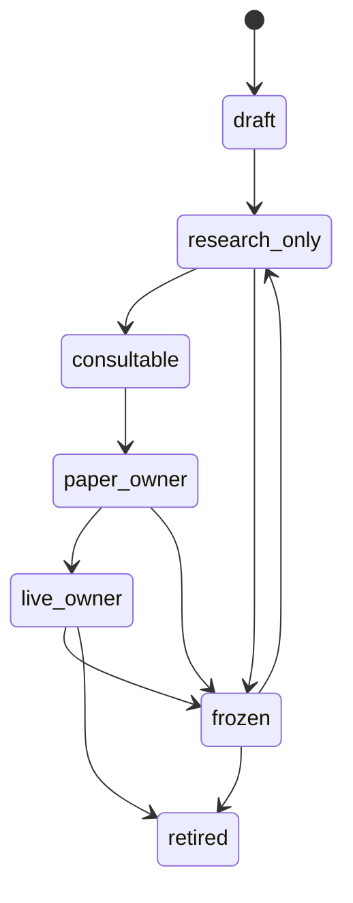
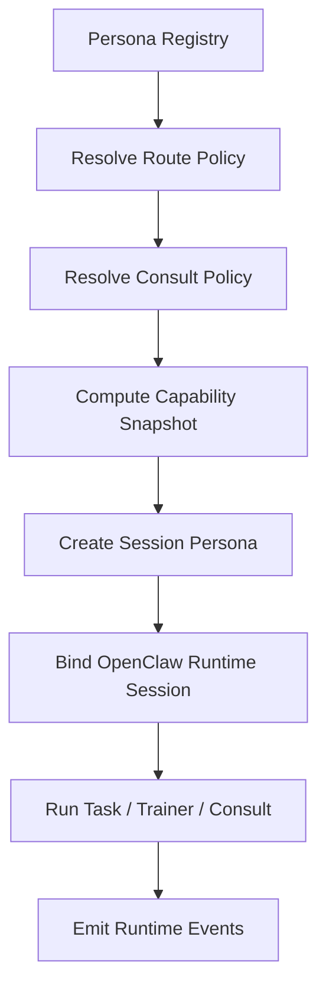

# PERSONA_RUNTIME_MODEL.md

Last updated: 2026-04-09
Status: canonical persona runtime model
Tier: L1 Platform Architecture & Policy
Scope: persona registry object, session object, runtime instance, and their lifecycle/binding interactions
Conflict rule: this document overrides broader persona wording in architecture/planning docs; deployment and binding authority still defer to the dedicated deployment/binding policy docs

## 1. 文件目的

本文件定義 Pantheon 中 **persona 的正式 runtime 表示**。

它回答三個問題：

1. persona 靜態上是什麼？
2. persona 執行時是什麼？
3. persona 的 lifecycle / binding / session 之間如何互動？

> 核心決議：persona 不是 prompt，也不是固定 process；  
> persona 是 **registry object + session object + runtime instance** 三層表示。

---

## 2. Persona 的三層表示

### 2.1 Registry Persona（靜態層）

這是 Persona Plane 的正式治理物件。

**定義**

儲存在 Persona Registry 中的 persona 主檔，包含：

- `persona_id`
- `name`
- `mandate`
- `strategy_family`
- `workspace_ref`
- `tool_profile_id`
- `route_policy_id`
- `consult_policy_id`
- `lifecycle_state`
- `owner`
- `status`

**責任**

- 表達「這個 persona 是誰」
- 保存它的 mandate 與政策
- 讓 BFF / Governance / Consultation 查詢
- 作為 session 與 runtime instance 的來源

**非責任**

- 不直接執行模型
- 不直接下單
- 不保存暫時性的推理狀態

### 2.2 Session Persona（控制層）

當 persona 被用來執行某個具體任務時，系統會建立 **session persona**。

**定義**

一個具體任務上下文中的 persona 實例，包含：

- `session_id`
- `persona_id`
- `session_type`
- `context_bundle`
- `effective_capability_snapshot`
- `task_ref`
- `status`

**常見 session 類型**

- `interactive`
- `trainer`
- `research_task`
- `consult`
- `committee`
- `red_team`
- `background_job`

**責任**

- 綁定一次任務與上下文
- 凍結當下的 effective capabilities
- 形成 replay / audit 的最小執行單位

### 2.3 Runtime Persona（執行層）

當 Session Persona 真正被送進 OpenClaw-compatible runtime 時，才成為 runtime persona。

**形式**
- 一個 agent session
- 一個 consult session
- 一個 sub-agent / spawned session
- 一個 workflow-triggered background session

**責任**
- 執行 inference / consult / workflow
- 消費 effective capabilities
- 產生 runtime events

---

## 3. Persona 的組成元素

一個完整 persona 由下列組件構成：

1. Identity
2. Mandate
3. Workspace
4. Route Policy
5. Consult Policy
6. Capability Snapshot
7. Bindings
8. Lifecycle State
9. Teaching History
10. Lineage

---

## 4. Workspace 模型

### 4.1 Workspace 是什麼
workspace 是 persona 的私有工作空間，不是 execution sandbox。

它包含：
- private notes
- persona rules
- local memory refs
- half-baked research
- local skill overrides

### 4.2 Workspace 的限制
workspace 不等於安全隔離。真正的安全還要靠：
- capability filtering
- RBAC
- secret boundary
- OS/container sandbox（高風險 persona）

---

## 5. Route Policy 模型

Route Policy 決定 persona 可以做什麼。

### 結構
- allowed tools
- allowed workflows
- preferred backends
- publish scope
- environment restrictions
- forbidden actions

### 用途
- 決定有效 capability 的上限
- 決定 session 中可見工具與流程
- 決定 persona 能否觸發 research / consult / deploy-related commands

---

## 6. Consult Policy 模型

Consult Policy 決定 persona 何時不能單獨行動。

### 結構
- required reviewers
- required committees
- trigger rules
- forbidden solo actions
- escalation rules

### 用途
- 上 paper 前必須 consult risk persona
- 遇 macro regime shift 時需 consult macro analyst
- 高風險 patch 不得 solo 推進

---

## 7. Capability Snapshot

### 定義
在某次 session 啟動時，系統根據：
- shared capabilities
- route policy
- consult policy
- RBAC / environment restrictions

計算出的 **effective capability set**。

### 規則
capability snapshot 是 **session-bound immutable snapshot**。  
session 啟動後，不因 registry 中的政策變更而自動漂移。

---

## 8. Persona Lifecycle 模型



### 狀態語義

- `draft`：剛建立，尚未完整配置
- `research_only`：可做研究 / trainer / research task
- `consultable`：可被發起 consult
- `paper_owner`：可對某些 pool 成為 paper deployment sponsor
- `live_owner`：可對某些 pool 成為 live deployment sponsor
- `frozen`：禁止新權限擴張 / 禁止新部署
- `retired`：保留歷史，不再接受新 session（除 audit / replay 特例）

---

## 9. Lifecycle 轉換 owner

| 狀態轉換 | owner | 觸發來源 |
|---|---|---|
| draft -> research_only | Persona Plane | 建立 / 初始化完成 |
| research_only -> consultable | Governance Plane | consult eligibility 審核 |
| consultable -> paper_owner | Governance Plane | binding + review |
| paper_owner -> live_owner | Governance Plane | approval + admissibility |
| 任意 -> frozen | Evolution / Governance | drift / incident / manual |
| frozen -> research_only | Governance | revalidation 通過 |
| frozen -> retired | Governance | retire 決議 |

---

## 10. Persona 與 Binding 的關係

### 核心決議
**binding 不改變 persona 的本體，只改變它的 admissibility 與 ownership scope。**

也就是：
- Persona 是誰：由 Persona Registry 定
- 它可服務哪些 pool：由 Persona-Capital Binding 定
- 真正 deploy 到哪個 runtime：由 DeploymentPlan / RuntimeBinding 定

### 因此 binding 不會：
- 自動建立 runtime process
- 自動切到 live_owner
- 自動下單

---

## 11. Persona Session 流程



---

## 12. Trainer 與 Persona 的關係

Trainer 不直接修改 runtime；它修改的是：
- control patch
- teaching history
- potential policy suggestions
- preview outcome

commit 後，才可能回寫：
- persona configuration
- teaching dataset
- future policy learning corpus

因此 `TrainerSession` 不是 runtime config editor，而是：
**human-in-the-loop persona adjustment channel**。

---

## 13. Persona 與 Consultation 的關係

persona 可有三種 consultation 角色：

- requester
- responder
- committee participant

這三個角色都透過 Session Persona 實現，而不是直接把 registry persona 拿去互傳訊息。

---

## 14. Persona 的 runtime 資料模型

### Persona
```text
persona_id
name
mandate
strategy_family
workspace_ref
tool_profile_id
route_policy_id
consult_policy_id
lifecycle_state
owner
status
```

### SessionPersona
```text
session_id                  — unique session identifier
persona_id                  — the persona this session belongs to
session_type                — interactive / trainer / research_task / consult / committee / red_team / background_job
status                      — active / terminated / degraded / quarantined / audit_replay
started_at                  — UTC ISO-8601
capability_snapshot_id      — CapabilitySnapshot frozen at session start (immutable)
trace_id                    — distributed trace identifier (required; always present)
request_id                  — idempotency / correlation identifier (required; always present)
context_bundle_ref          — optional; reference to context bundle for replay/audit
task_ref                    — optional; reference to the task being executed
runtime_binding_id          — nullable; the active RuntimeBinding at session start
                              required for interactive and background_job sessions
deployment_stage            — nullable; set iff runtime_binding_id is set
                              (paper / canary / live / frozen)
capital_pool_id             — nullable; set iff runtime_binding_id is set
                              completes audit chain: Persona → SessionPersona → RuntimeBinding
                              → DeploymentPlan → PersonaCapitalBinding
ended_at                    — nullable; session end time (UTC ISO-8601)
metadata                    — arbitrary session metadata
```

**Consistency invariant:** `runtime_binding_id`, `deployment_stage`, and `capital_pool_id` are co-dependent — all three must be set together or all absent. Setting `deployment_stage` or `capital_pool_id` without `runtime_binding_id` is a contract violation.

### CapabilitySnapshot
```text
snapshot_id
persona_id
effective_tools[]
effective_skills[]
effective_workflows[]
restrictions[]
generated_at
source_refs[]
```

### TeachingSession
```text
session_id
persona_id
opened_by
mode
status
started_at
ended_at
current_control_state
```

---

## 15. API / 契約建議

### Persona APIs
- `GET /api/personas`
- `GET /api/personas/{persona_id}`
- `POST /api/personas`
- `PATCH /api/personas/{persona_id}`

### Capability APIs
- `GET /api/personas/{persona_id}/capabilities`
- `POST /api/personas/{persona_id}/capabilities/refresh`

### Session APIs
- `POST /api/personas/{persona_id}/sessions`
- `GET /api/sessions/{session_id}`
- `POST /api/sessions/{session_id}/terminate`

### Trainer APIs
- `POST /api/trainer/sessions`
- `POST /api/trainer/sessions/{session_id}/message`
- `POST /api/trainer/sessions/{session_id}/patch`
- `POST /api/trainer/sessions/{session_id}/commit`

---

## 16. 審計與可回放要求

每個 session 都必須留下：
- `persona_id`
- `session_id`
- `session_type`
- `trace_id`
- `request_id`
- `capability_snapshot_id`
- `workspace_ref`
- `context_bundle_ref`

---

## 17. 結論

Pantheon 的 persona 不是 prompt，也不是固定 process。  
它是：

- 靜態上：registry object
- 控制上：session object
- 執行上：runtime-bound agent instance

只有把這三層分開，後面 binding、lifecycle、teaching、consultation、governance、runtime orchestration 才不會互相混掉。
