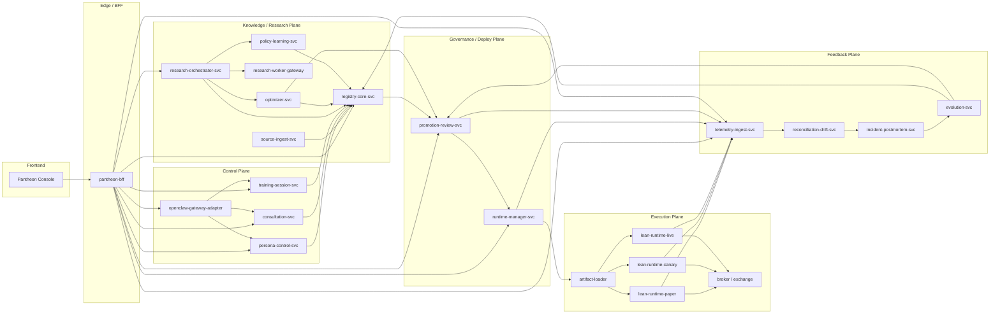
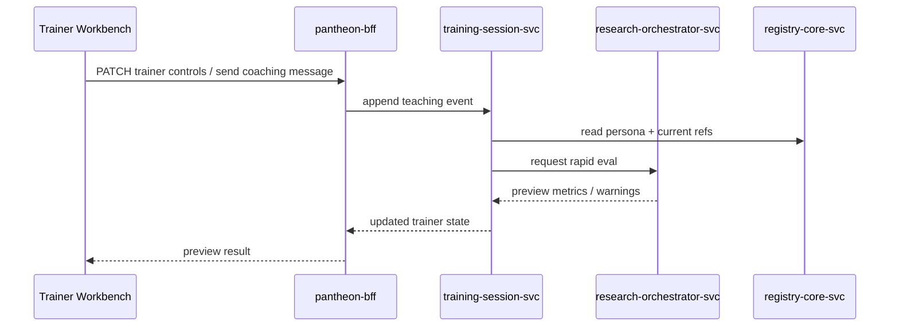
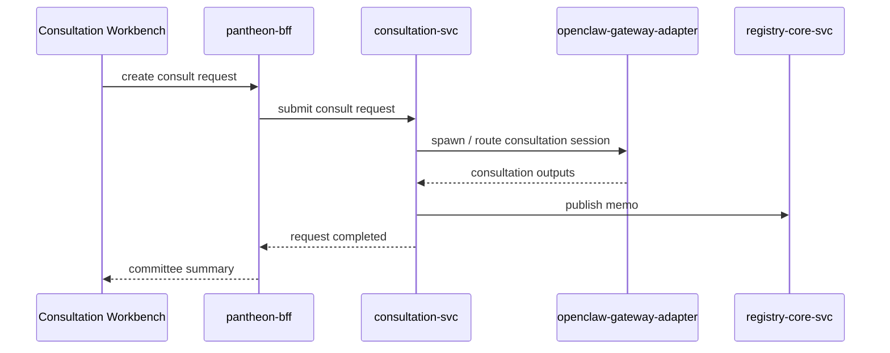
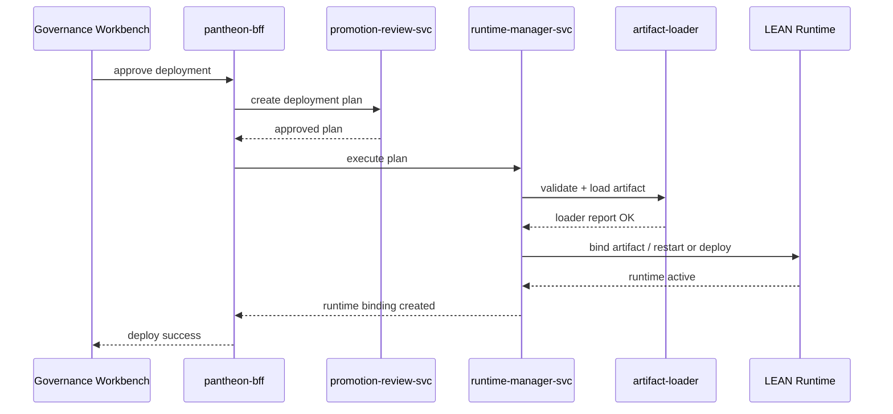
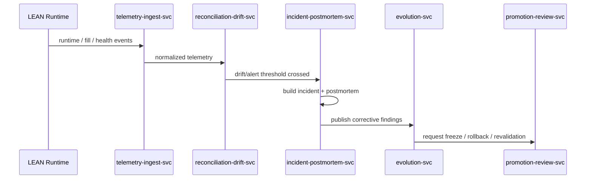

# Pantheon API / Service Contract 設計版
Last updated: 2026-04-09
Status: supporting future-state service/API design
Tier: L3 Supporting Design & Migration
Scope: future-state service topology, API/event contracts, and BFF/service ownership design
Conflict rule: this document informs future implementation and backlog planning, but current canonical platform semantics remain in the L1 policy docs and L2 execution plan

> 文件類型：系統設計文件
> 語言：繁體中文
> 格式：Markdown（含 Mermaid）
> 版本：v1
> 依據：Pantheon 總索引版系統分析文件延伸設計

---

## 0. 文件目的與範圍

本文件將 Pantheon 的四包系統分析往下壓成 **API / service contract 設計版**。
目標不是提供程式碼，而是提供可直接進入：

- repo / module 拆分
- OpenAPI 規格
- gRPC / internal API 規格
- event schema
- BFF 與 service ownership
- error model / idempotency / auth scope

的正式母文件。

本文件涵蓋：

1. service 拓樸與責任邊界  
2. service-by-service contract  
3. sync API 規格草案  
4. async event contract 草案  
5. auth / RBAC / idempotency / observability 契約  
6. 核心端到端流程 sequence

本文件不取代資料表 / schema 設計版；資料庫與 table 結構請看另一份文件。

---

## 1. 設計總原則

Pantheon 的 API / service contract 必須符合以下原則：

1. **BFF 是前台唯一聚合入口**，前端不直連內部 service。  
2. **控制面與 execution 面分離**；OpenClaw / agent 不直接碰 broker。  
3. **研究輸出只能是 artifact，不是 live order**。  
4. **Promotion 不等於 Deploy**；governance 與 execution loader 必須分離。  
5. **每個 capital pool 綁一個獨立 runtime**。  
6. **所有高風險命令都必須冪等且可審計**。  
7. **sync API 只做 bounded query/command**；長任務透過 async job / event 完成。  
8. **所有跨服務傳遞都必須帶 trace / correlation metadata**。

---

## 2. 服務總拓樸



---

## 3. 服務目錄與責任邊界

### 3.1 `pantheon-bff`

**定位**：前端唯一聚合 API。  
**服務性質**：edge / façade service。

**職責**：
- 前端 auth session / RBAC
- read model aggregation
- command facade
- SSE / notifications
- 把前台操作轉成內部 bounded command

**不負責**：
- 研究執行
- runtime 控制細節
- registry 內核寫入邏輯
- approval 決策

**主要上游**：Pantheon Console  
**主要下游**：persona-control-svc、consultation-svc、training-session-svc、registry-core-svc、research-orchestrator-svc、promotion-review-svc、runtime-manager-svc、telemetry-ingest-svc

---

### 3.2 `openclaw-gateway-adapter`

**定位**：Pantheon 對 OpenClaw 的控制面包裝層。  
**服務性質**：integration adapter。

**職責**：
- 管理 shared tools / skills / plugins 對 Pantheon 的映射
- agent route / session binding
- cron / hook job 接入
- sub-agent / consultation session 啟動
- OpenClaw session metadata 與 Pantheon trace metadata 對齊

**不負責**：
- 直接保存 persona 主檔
- 直接決定 approval / deploy
- 直接觸碰 broker / runtime

**主要上游**：pantheon-bff、persona-control-svc、consultation-svc  
**主要下游**：OpenClaw Gateway

---

### 3.3 `persona-control-svc`

**定位**：persona 領域主服務。  
**服務性質**：domain service。

**職責**：
- persona registry CRUD
- route policy / consult policy 管理
- effective capabilities resolve
- persona lifecycle 管理
- workspace / local skill metadata 管理
- persona 與 capital pool binding 查詢代理

**不負責**：
- 正式研究執行
- consult thread 執行
- trainer session event stream 實際處理
- live deploy

---

### 3.4 `consultation-svc`

**定位**：會診領域服務。  
**職責**：
- consult request 建立與分派
- committee / red-team orchestration
- consult memo lifecycle
- consultation audit log
- OpenClaw multi-agent consultation workflow 封裝

**不負責**：
- 直接做 deploy approval
- runtime action

---

### 3.5 `training-session-svc`

**定位**：研究員教學與 trainer session 領域服務。  
**職責**：
- trainer session lifecycle
- teaching event append-only log
- control patch 管理
- preview / rapid-eval request dispatch
- before/after compare 結果封裝
- commit / discard / replay

**不負責**：
- 正式 imitation model training
- strategy research 主流程

---

### 3.6 `source-ingest-svc`

**定位**：來源素材入口。  
**職責**：
- paper ingest
- repo ingest
- internal research ingest
- normalize / dedupe
- source registry 寫入
- StrategySpec seed 建立

**不負責**：
- 複雜研究實驗
- live deploy

---

### 3.7 `registry-core-svc`

**定位**：Pantheon 的知識與治理真相來源 API。  
**職責**：
- Strategy Registry
- Alpha Registry
- Experiment Registry
- Artifact Registry
- Approval Registry
- Insight / Evidence APIs
- lineage 查詢

**不負責**：
- heavy research compute
- deploy orchestration
- runtime action

---

### 3.8 `research-orchestrator-svc`

**定位**：研究任務總調度器。  
**職責**：
- 接收 StrategySpec / research request
- backend selection（Qlib / vectorbt / statsmodels / QuantLib / RL Lab）
- 建立 experiment task/run
- 調度 research-worker-gateway
- collect metrics / artifacts / notes
- rapid eval request orchestration

**不負責**：
- registry 作為真相來源的儲存
- optimizer 內核計算
- deployment approval

---

### 3.9 `research-worker-gateway`

**定位**：各研究 backend 的統一 adapter。  
**職責**：
- Qlib jobs
- vectorbt prototype jobs
- statsmodels jobs
- QuantLib jobs
- RL lab jobs
- 標準化結果回傳給 research-orchestrator

---

### 3.10 `optimizer-svc`

**定位**：配置 / 風險優化服務。  
**職責**：
- skfolio / PyPortfolioOpt / cvxportfolio / Riskfolio-Lib 調度
- allocation policy artifact 建立
- target weights / budget / constraints bundle 生成
- optimizer run registry writeback（經 registry-core）

**不負責**：
- live rebalancing runtime
- deploy decision

---

### 3.11 `policy-learning-svc`

**定位**：policy learning / imitation domain service。  
**職責**：
- persona policy dataset build
- alpha policy dataset build
- imitation dataset build
- preference / correction data build
- training orchestration for DSPy / TRL / imitation / RL

**不負責**：
- trainer session UI
- deploy live policy

---

### 3.12 `promotion-review-svc`

**定位**：治理與 promotion 核心服務。  
**職責**：
- patch validation
- review gates
- approval decision store write/read
- promotion state transition
- deployment plan generation
- rollback plan generation
- pool admissibility checks

**對齊現況**：對應 `pantheon` repo 現有 `Promotion Gate (REG-002)` 語義。  

---

### 3.13 `runtime-manager-svc`

**定位**：execution control plane。  
**職責**：
- runtime inventory
- runtime binding
- deploy / replace / restart / pause / liquidate
- artifact loader 協調
- runtime state / status query

**不負責**：
- 研究 worker
- promotion adjudication

---

### 3.14 `artifact-loader`

**定位**：approved artifact -> runtime-ready bundle 轉換器。  
**職責**：
- schema compatibility 檢查
- pool policy mapping
- broker capability 檢查
- loader report 生成
- runtime bundle 準備

---

### 3.15 `telemetry-ingest-svc`

**定位**：所有 canonical event 的入口。  
**職責**：
- ingest runtime / deploy / action / trainer / consult events
- normalize canonical events
- write telemetry / metrics / audit
- expose event query APIs

---

### 3.16 `reconciliation-drift-svc`

**定位**：backtest-paper-live / order-fill-position / drift 分析服務。  
**職責**：
- reconciliation run
- drift detection
- baseline compare
- drift report persistence

---

### 3.17 `incident-postmortem-svc`

**定位**：incident / postmortem domain service。  
**職責**：
- alert rule evaluation
- incident case lifecycle
- evidence collection
- structured postmortem build
- action recommendation

---

### 3.18 `evolution-svc`

**定位**：演化控制器。  
**職責**：
- retrain / revalidate trigger
- mutate / split / merge / freeze / retire decisions
- evolution decision registry
- downstream actions to research/governance/persona

---

## 4. API 設計規範

### 4.1 同步 API 規範
- 傳輸：HTTPS JSON
- 版本：`/api/v1/...`
- 錯誤格式統一
- 所有 command API 支援 `Idempotency-Key`
- 所有回應含 `request_id`、`trace_id`

### 4.2 非同步規範
- 長任務回傳 `job_id`
- 查詢端點：`GET /api/v1/jobs/:id`
- optional SSE channel：`/api/v1/events/stream`

### 4.3 錯誤模型

```json
{
  "request_id": "req_...",
  "trace_id": "trc_...",
  "error": {
    "code": "VALIDATION_ERROR",
    "message": "artifact schema mismatch",
    "details": [{"field": "schema_version", "reason": "unsupported"}]
  }
}
```

### 4.4 Auth Scope 規範
- `persona.read`
- `persona.write`
- `trainer.write`
- `consult.write`
- `registry.read`
- `research.submit`
- `review.write`
- `deploy.write`
- `runtime.control`
- `telemetry.read`
- `postmortem.write`
- `evolution.write`

---

## 5. 主要服務契約細節

## 5.1 `pantheon-bff` 契約

### 5.1.1 主要讀取 API
- `GET /api/v1/workbench/home`
- `GET /api/v1/personas`
- `GET /api/v1/personas/:id`
- `GET /api/v1/trainer/sessions/:id`
- `GET /api/v1/consult/requests/:id`
- `GET /api/v1/strategies/:id`
- `GET /api/v1/review/queue`
- `GET /api/v1/runtimes`
- `GET /api/v1/alerts`
- `GET /api/v1/evolution/decisions`

### 5.1.2 主要命令 API
- `POST /api/v1/personas`
- `PATCH /api/v1/personas/:id`
- `POST /api/v1/trainer/sessions`
- `POST /api/v1/trainer/sessions/:id/message`
- `POST /api/v1/trainer/sessions/:id/patch`
- `POST /api/v1/consult/requests`
- `POST /api/v1/review/submissions`
- `POST /api/v1/deploy/plans`
- `POST /api/v1/runtimes/:id/pause`
- `POST /api/v1/runtimes/:id/liquidate`

### 5.1.3 BFF 聚合規則
- BFF 不擁有業務真相來源
- BFF 只能 cache read model，不能覆寫 domain decision
- BFF 只做 bounded composition，不做長時間 blocking orchestration

---

## 5.2 `persona-control-svc` 契約

### 5.2.1 主要 API
- `GET /internal/personas`
- `GET /internal/personas/{persona_id}`
- `POST /internal/personas`
- `PATCH /internal/personas/{persona_id}`
- `PATCH /internal/personas/{persona_id}/route-policy`
- `PATCH /internal/personas/{persona_id}/consult-policy`
- `GET /internal/personas/{persona_id}/capabilities`
- `POST /internal/personas/{persona_id}/lifecycle-transition`

### 5.2.2 主要輸入物件

```json
{
  "name": "trend_equity_pm",
  "mandate": "台美大型股趨勢追蹤",
  "strategy_family": "trend_following",
  "tool_profile_id": "tp_default_research",
  "route_policy": {
    "allowed_tools": ["strategy_registry.search", "consult.request"],
    "allowed_workflows": ["equity_cross_sectional_v1"],
    "preferred_backends": {"alpha": "qlib", "prototype": "vectorbt"}
  },
  "consult_policy": {
    "required_reviewers": ["risk_guardian"],
    "trigger_rules": ["before_live", "high_leverage_patch"]
  }
}
```

### 5.2.3 主要輸出物件

```json
{
  "persona_id": "p_trend_equity_pm",
  "lifecycle_state": "research_only",
  "effective_capabilities": {
    "tools": ["strategy_registry.search", "consult.request"],
    "skills": ["research-intake", "consult-protocol"],
    "workflows": ["equity_cross_sectional_v1"]
  }
}
```

---

## 5.3 `consultation-svc` 契約

### 5.3.1 主要 API
- `POST /internal/consult/requests`
- `GET /internal/consult/requests/{id}`
- `POST /internal/consult/requests/{id}/start`
- `POST /internal/consult/requests/{id}/cancel`
- `GET /internal/consult/requests/{id}/memos`
- `POST /internal/consult/requests/{id}/publish`

### 5.3.2 Request 物件

```json
{
  "from_persona": "p_trend_equity_pm",
  "target_type": "committee",
  "target_ref": "committee_risk_macro_execution",
  "task": "評估 alpha_2026_04 是否可進 paper",
  "context_refs": [
    {"type": "strategy", "id": "strat_alpha_2026_04"},
    {"type": "artifact", "id": "art_sig_2026_04_v3"}
  ],
  "priority": "high"
}
```

### 5.3.3 Memo 物件

```json
{
  "memo_id": "memo_...",
  "request_id": "consult_...",
  "memo_type": "committee_summary",
  "summary": "風險面建議先限制科技股集中度後再進 paper",
  "recommendations": [
    "add_sector_cap",
    "run_turnover_stress"
  ],
  "evidence_refs": ["run_123", "insight_456"]
}
```

---

## 5.4 `training-session-svc` 契約

### 5.4.1 主要 API
- `POST /internal/trainer/sessions`
- `GET /internal/trainer/sessions/{id}`
- `POST /internal/trainer/sessions/{id}/message`
- `POST /internal/trainer/sessions/{id}/patch`
- `POST /internal/trainer/sessions/{id}/preview`
- `POST /internal/trainer/sessions/{id}/commit`
- `POST /internal/trainer/sessions/{id}/discard`
- `GET /internal/trainer/sessions/{id}/events`

### 5.4.2 Session 建立

```json
{
  "persona_id": "p_zpb_lead",
  "opened_by": "user_abc",
  "mode": "training"
}
```

### 5.4.3 Patch Command

```json
{
  "patch_type": "control_patch",
  "patch": {
    "risk_tolerance": 3,
    "max_leverage": 1.15,
    "sector_weights": {"tech": 35, "finance": 20}
  },
  "reason": "降低科技集中風險"
}
```

### 5.4.4 Preview Result

```json
{
  "preview_id": "prev_...",
  "session_id": "ts_...",
  "status": "completed",
  "metrics_delta": {
    "max_drawdown": -0.021,
    "turnover": -0.08,
    "sharpe": -0.03
  },
  "warnings": ["科技權重仍高於歷史中位數"]
}
```

---

## 5.5 `source-ingest-svc` 契約

### 5.5.1 主要 API
- `POST /internal/sources/ingest/paper`
- `POST /internal/sources/ingest/repo`
- `POST /internal/sources/ingest/internal`
- `GET /internal/sources/{id}`
- `POST /internal/sources/{id}/normalize`
- `POST /internal/sources/{id}/build-seed`

### 5.5.2 Source Record 輸出

```json
{
  "source_id": "src_...",
  "source_type": "paper",
  "title": "Alpha Factors under Regime Shift",
  "trust_score": 0.82,
  "normalized_status": "completed",
  "evidence_refs": ["ev_123", "ev_124"]
}
```

---

## 5.6 `registry-core-svc` 契約

### 5.6.1 主要 API families
- Strategy APIs
- Alpha APIs
- Experiment APIs
- Artifact APIs
- Insight APIs
- Approval APIs
- Lineage APIs

### 5.6.2 Strategy API
- `GET /internal/strategies`
- `GET /internal/strategies/{id}`
- `POST /internal/strategies`
- `PATCH /internal/strategies/{id}`

Strategy response example:

```json
{
  "strategy_id": "strat_001",
  "name": "Large Cap Trend Overlay",
  "strategy_family": "trend_following",
  "hypothesis": "高動能大型股在低信用利差環境延續性較高",
  "backend": "qlib",
  "replication_status": "replicated",
  "current_state": "approved_template"
}
```

### 5.6.3 Experiment API
- `POST /internal/experiments/tasks`
- `GET /internal/experiments/tasks/{id}`
- `POST /internal/experiments/runs`
- `GET /internal/experiments/runs/{id}`

### 5.6.4 Artifact API
- `POST /internal/artifacts/register`
- `GET /internal/artifacts/{id}`
- `POST /internal/artifacts/{id}/alias`
- `GET /internal/artifacts/{id}/lineage`

---

## 5.7 `research-orchestrator-svc` 契約

### 5.7.1 主要 API
- `POST /internal/research/tasks`
- `GET /internal/research/tasks/{id}`
- `POST /internal/research/runs`
- `GET /internal/research/runs/{id}`
- `POST /internal/rapid-eval`

### 5.7.2 Research Task

```json
{
  "strategy_id": "strat_001",
  "run_type": "formal_replication",
  "backend_hint": "qlib",
  "dataset_version": "ds_2026_04",
  "code_version": "git:abc123",
  "params": {"lookback": 60, "rebalance": "weekly"}
}
```

### 5.7.3 Rapid Eval Request

```json
{
  "persona_id": "p_zpb_lead",
  "session_id": "ts_001",
  "control_patch": {
    "risk_tolerance": 2,
    "max_leverage": 1.05
  },
  "context_refs": ["strat_001", "art_alloc_003"]
}
```

---

## 5.8 `optimizer-svc` 契約

### 5.8.1 主要 API
- `POST /internal/optimizer/runs`
- `GET /internal/optimizer/runs/{id}`
- `POST /internal/allocation-artifacts/register`

### 5.8.2 Optimizer Request

```json
{
  "strategy_id": "strat_001",
  "optimizer_backend": "skfolio",
  "objective": "max_sharpe",
  "constraints": {
    "max_weight": 0.08,
    "sector_cap": 0.25,
    "turnover_cap": 0.20
  },
  "signal_ref": "art_sig_2026_04_v3"
}
```

### 5.8.3 Allocation Artifact Response

```json
{
  "artifact_id": "art_alloc_001",
  "artifact_type": "allocation_policy",
  "optimizer_backend": "skfolio",
  "target_schema": "v1",
  "summary": {
    "objective": "max_sharpe",
    "num_assets": 24
  }
}
```

---

## 5.9 `policy-learning-svc` 契約

### 5.9.1 主要 API
- `POST /internal/policy-learning/datasets/build`
- `GET /internal/policy-learning/datasets/{id}`
- `POST /internal/policy-learning/jobs`
- `GET /internal/policy-learning/jobs/{id}`

### 5.9.2 Dataset Build Request

```json
{
  "dataset_type": "human_imitation",
  "source_refs": ["ts_001", "ts_002", "incident_pm_003"],
  "label_schema": "state_action_outcome_v1"
}
```

---

## 5.10 `promotion-review-svc` 契約

### 5.10.1 主要 API
- `POST /internal/review/validate`
- `POST /internal/review/submit`
- `GET /internal/review/queue`
- `GET /internal/review/{id}`
- `POST /internal/promotion/plans`
- `POST /internal/rollback/plans`

### 5.10.2 Validate Request

```json
{
  "artifact_id": "art_alloc_001",
  "target_mode": "paper",
  "capital_pool_id": "pool_tech_01"
}
```

### 5.10.3 ApprovalDecision Response

```json
{
  "decision_id": "dec_001",
  "target_id": "art_alloc_001",
  "decision": "approved",
  "approver": "reviewer_01",
  "rollback_target": "art_alloc_000",
  "effective_scope": ["pool_tech_01"]
}
```

### 5.10.4 DeploymentPlan Response

```json
{
  "plan_id": "plan_001",
  "artifact_id": "art_alloc_001",
  "capital_pool_id": "pool_tech_01",
  "target_mode": "paper",
  "runtime_action": "deploy_new_binding",
  "rollback_target": "art_alloc_000",
  "pre_checks": ["loader_compat", "pool_policy", "broker_capability"],
  "status": "pending_execution"
}
```

---

## 5.11 `runtime-manager-svc` 契約

### 5.11.1 主要 API
- `GET /internal/runtimes`
- `GET /internal/runtimes/{id}`
- `POST /internal/runtimes/deploy`
- `POST /internal/runtimes/{id}/pause`
- `POST /internal/runtimes/{id}/liquidate`
- `POST /internal/runtimes/{id}/replace`
- `POST /internal/runtimes/{id}/restart`

### 5.11.2 Deploy Request

```json
{
  "plan_id": "plan_001",
  "runtime_mode": "paper"
}
```

### 5.11.3 RuntimeStatus Response

```json
{
  "runtime_id": "rt_pool_tech_01_paper",
  "capital_pool_id": "pool_tech_01",
  "mode": "paper",
  "state": "active",
  "artifact_id": "art_alloc_001",
  "last_heartbeat": "2026-04-09T09:30:00Z",
  "health_summary": "ok"
}
```

---

## 5.12 `telemetry-ingest-svc` 契約

### 5.12.1 主要 API
- `POST /internal/telemetry/events`
- `POST /internal/telemetry/heartbeats`
- `GET /internal/telemetry/events`
- `GET /internal/telemetry/metrics`

### 5.12.2 Canonical Event

```json
{
  "event_type": "runtime.order_filled",
  "event_time": "2026-04-09T09:31:05Z",
  "environment": "paper",
  "capital_pool_id": "pool_tech_01",
  "runtime_id": "rt_pool_tech_01_paper",
  "artifact_id": "art_alloc_001",
  "trace_id": "trc_abc",
  "payload": {
    "symbol": "AAPL",
    "qty": 500,
    "price": 182.3
  }
}
```

---

## 5.13 `reconciliation-drift-svc` 契約

### 5.13.1 主要 API
- `POST /internal/reconciliation/runs`
- `GET /internal/reconciliation/runs/{id}`
- `GET /internal/drift/reports`
- `GET /internal/drift/reports/{id}`

### 5.13.2 Drift Report Response

```json
{
  "report_id": "dr_001",
  "drift_type": "execution_drift",
  "scope_ref": "rt_pool_tech_01_live",
  "severity": "high",
  "metrics": {
    "slippage_delta_bps": 18.2,
    "reject_rate_delta": 0.07
  },
  "recommended_action": "review_for_canary_rollback"
}
```

---

## 5.14 `incident-postmortem-svc` 契約

### 5.14.1 主要 API
- `GET /internal/alerts`
- `POST /internal/alerts/rules`
- `GET /internal/incidents`
- `GET /internal/incidents/{id}`
- `POST /internal/incidents/{id}/ack`
- `POST /internal/postmortems`
- `GET /internal/postmortems/{id}`

### 5.14.2 Incident Response

```json
{
  "incident_id": "inc_001",
  "category": "execution",
  "severity": "critical",
  "status": "active",
  "scope_refs": ["rt_pool_tech_01_live", "plan_001"],
  "related_alerts": ["alt_001", "alt_002"]
}
```

---

## 5.15 `evolution-svc` 契約

### 5.15.1 主要 API
- `GET /internal/evolution/decisions`
- `POST /internal/evolution/decisions`
- `POST /internal/evolution/decisions/{id}/execute`

### 5.15.2 EvolutionDecision

```json
{
  "decision_id": "evo_001",
  "target_type": "strategy",
  "target_id": "strat_001",
  "decision_type": "freeze",
  "reason": "paper-live divergence exceeds threshold for 10 sessions",
  "linked_postmortem_id": "pm_001"
}
```

---

## 6. 事件契約（Async Event Contract）

Pantheon 需要一套統一事件命名規範：

- `persona.*`
- `trainer.*`
- `consult.*`
- `source.*`
- `research.*`
- `artifact.*`
- `review.*`
- `promotion.*`
- `runtime.*`
- `telemetry.*`
- `incident.*`
- `evolution.*`

### 6.1 事件 envelope

```json
{
  "event_id": "evt_...",
  "event_name": "runtime.binding.created",
  "event_time": "2026-04-09T10:00:00Z",
  "producer": "runtime-manager-svc",
  "environment": "paper",
  "trace_id": "trc_...",
  "correlation_id": "corr_...",
  "payload": {}
}
```

### 6.2 關鍵事件清單

- `persona.created`
- `persona.policy.updated`
- `trainer.session.opened`
- `trainer.patch.committed`
- `consult.request.created`
- `consult.memo.published`
- `source.ingested`
- `strategy.spec.created`
- `experiment.run.completed`
- `artifact.registered`
- `review.decision.created`
- `promotion.plan.created`
- `runtime.binding.created`
- `runtime.replaced`
- `runtime.paused`
- `telemetry.event.ingested`
- `drift.report.created`
- `incident.opened`
- `postmortem.published`
- `evolution.decision.executed`

---

## 7. 端到端流程契約

## 7.1 Trainer Preview Sequence



## 7.2 Consultation Sequence



## 7.3 Deploy Sequence



## 7.4 Incident -> Evolution Sequence



---

## 8. 安全、冪等與可觀測性契約

### 8.1 所有 command API 必須支援
- `Idempotency-Key`
- `X-Request-Id`
- `X-Trace-Id`
- `X-Actor-Id`

### 8.2 所有高風險命令必須二次保護
適用於：
- deploy to live
- replace live runtime
- liquidate
- kill switch
- rollback live

### 8.3 observability 最低標準
每個 service 都要提供：
- `/healthz`
- `/livez`
- `/readyz`
- `/metrics`

### 8.4 event audit 最低欄位
- actor
- target
- action
- reason
- timestamp
- request id
- trace id
- before/after snapshot ref

---

## 9. 服務落地到 repo 的建議

### 9.1 `front-ai-trading-system`
- 不承載 domain truth
- 只透過 `pantheon-bff` 互動
- trainer / consultation / governance / health 視圖都走 BFF

### 9.2 `pantheon`
建議承載：
- `registry-core-svc`
- `promotion-review-svc`
- `runtime-manager-svc`
- `telemetry-ingest-svc`
- `reconciliation-drift-svc`
- `incident-postmortem-svc`
- `evolution-svc`

### 9.3 OpenClaw 外部整合
建議以 `openclaw-gateway-adapter` 封裝，不讓前台與 domain service 直接懂 OpenClaw session 細節。

### 9.4 `lean-platform`
作為 runtime substrate；Pantheon 僅做 control-plane binding 與 telemetry capture。

---

## 10. 實作順序建議（基於 contract）

1. 先做 `pantheon-bff` + `persona-control-svc` + `training-session-svc` + `consultation-svc`  
2. 再做 `registry-core-svc` + `research-orchestrator-svc` + `optimizer-svc`  
3. 再做 `promotion-review-svc` + `runtime-manager-svc` + `artifact-loader`  
4. 最後補 `telemetry-ingest-svc` + `reconciliation-drift-svc` + `incident-postmortem-svc` + `evolution-svc`

這個順序對應四包，但 contract 先定義，實作可以分階段進行。

---

## 11. 文件結語

本文件將 Pantheon 從系統分析推進到 service contract 層級。  
接下來若要再往下壓，最自然的下一步是：

1. 為每個 service 補 OpenAPI 規格  
2. 為每個事件補 JSON Schema  
3. 為每個高風險 command 補 idempotency / rollback runbook  
4. 對應資料表 / object storage / vector index / time-series store 補 schema
