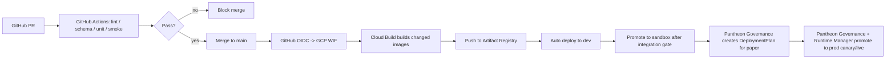

# Pantheon 正式部署與環境設計

## 版本
- 文件版本：v2
- 文件定位：正式交付草案
- 適用範圍：Pantheon 主平台、pantheon-lean、front-ai-trading-system
- 目標環境：GCP + GitHub + Docker

---

## 1. 文件目的

本文件將 Pantheon 既有的完整藍圖、service/module 拆分原則，以及 repo 邊界，正式落到可部署、可維運、可驗收的雲端設計上。

本文件回答四個問題：

1. Pantheon 在 GCP 上應如何部署。
2. GitHub、CI/CD、Docker 在正式環境中各自扮演什麼角色。
3. Pantheon / pantheon-lean / front-ai-trading-system 三個 repo 應如何對應到 deployable services。
4. dev / sandbox / paper / prod 環境應如何隔離與管理。

---

## 2. 設計原則

### 2.1 Plane / Domain 優先，服務數量次之
Pantheon 的第一層拆分依據是 Plane / Domain 邊界，而不是單純追求微服務數量。

先定：
- 哪些是正式的 Plane / Domain truth
- 哪些需要獨立 failure domain
- 哪些需要獨立 scaling profile
- 哪些仍可保留在 service 內部 module

### 2.2 兩條部署線分開
Pantheon 必須把：
- **應用程式 / 控制面部署**
- **策略 artifact / runtime deploy**

分成兩條線。

GitHub / CI/CD 只負責：
- code build
- image publish
- infra rollout

真正的 paper / canary / live deploy 必須由 Pantheon 自己的：
- ApprovalDecision
- DeploymentPlan
- RuntimeBinding
- runtime-manager

完成。

### 2.3 Execution 叢集獨立於一般控制面
Pantheon 的 execution plane 不應和普通 BFF / API service 混在同一套 compute substrate 內。

原因：
- 執行期需求與 API 需求不同
- 運行時間型態不同
- 風險域不同
- per-pool isolation 要求更高

### 2.4 Docker 是 packaging，不是 architecture substitute
Docker 用來做：
- dependency isolation
- reproducible build
- environment parity
- rollout artifact

Docker 不能取代：
- source of truth 設計
- governance
- runtime truth
- rollback semantics

### 2.5 正式環境以環境隔離 + stage 語義雙軌管理
環境維度：
- dev
- sandbox
- paper
- prod

部署 stage 維度：
- none
- paper
- canary
- live
- frozen

環境不應直接等於 stage。

---

## 3. 總體部署架構圖

```mermaid
flowchart TB

    subgraph GH["GitHub"]
        REPO1["pantheon repo"]
        REPO2["pantheon-lean repo"]
        REPO3["front-ai-trading-system repo"]
        GHA["GitHub Actions"]
    end

    subgraph GCP_SHARED["GCP Shared Build / Registry"]
        WIF["Workload Identity Federation"]
        CB["Cloud Build"]
        AR["Artifact Registry"]
        SM["Secret Manager"]
        LOG["Cloud Logging / Monitoring"]
    end

    subgraph GCP_DEV["GCP Dev / Sandbox"]
        CR_DEV["Cloud Run\ncontrol-plane services"]
        GKEA_DEV["GKE Autopilot\nresearch + async workers"]
        SQL_DEV["Cloud SQL (Postgres)"]
        GCS_DEV["GCS"]
        PS_DEV["Pub/Sub"]
        CH_DEV["ClickHouse / analytics"]
    end

    subgraph GCP_PAPER["GCP Paper"]
        CR_PAPER["Cloud Run\ncontrol-plane services"]
        GKEA_PAPER["GKE Autopilot\nresearch + async workers"]
        GKES_PAPER["GKE Standard\nruntime-manager + pantheon-lean paper runtimes"]
        SQL_PAPER["Cloud SQL (Postgres)"]
        GCS_PAPER["GCS"]
        PS_PAPER["Pub/Sub"]
        CH_PAPER["ClickHouse / analytics"]
    end

    subgraph GCP_PROD["GCP Prod"]
        CR_PROD["Cloud Run\ncontrol-plane services"]
        GKEA_PROD["GKE Autopilot\nasync workers"]
        GKES_PROD["GKE Standard\nruntime-manager + pantheon-lean prod runtimes"]
        SQL_PROD["Cloud SQL (Postgres)"]
        GCS_PROD["GCS"]
        PS_PROD["Pub/Sub"]
        CH_PROD["ClickHouse / analytics"]
    end

    subgraph EXEC["Execution Substrate"]
        RM["runtime-manager-svc"]
        LEAN["pantheon-lean / LEAN runtimes"]
        BRK["brokers / exchanges"]
    end

    REPO1 --> GHA
    REPO2 --> GHA
    REPO3 --> GHA

    GHA --> WIF
    WIF --> CB
    GHA --> CB
    CB --> AR

    AR --> CR_DEV
    AR --> GKEA_DEV
    AR --> GKES_PAPER
    AR --> GKES_PROD
    AR --> CR_PAPER
    AR --> CR_PROD
    AR --> GKEA_PAPER
    AR --> GKEA_PROD

    SM --> CR_DEV
    SM --> GKEA_DEV
    SM --> CR_PAPER
    SM --> GKEA_PAPER
    SM --> GKES_PAPER
    SM --> CR_PROD
    SM --> GKEA_PROD
    SM --> GKES_PROD

    CR_DEV --> SQL_DEV
    CR_DEV --> GCS_DEV
    CR_DEV --> PS_DEV
    GKEA_DEV --> SQL_DEV
    GKEA_DEV --> GCS_DEV
    GKEA_DEV --> PS_DEV
    GKEA_DEV --> CH_DEV

    CR_PAPER --> SQL_PAPER
    CR_PAPER --> GCS_PAPER
    CR_PAPER --> PS_PAPER
    GKEA_PAPER --> SQL_PAPER
    GKEA_PAPER --> GCS_PAPER
    GKEA_PAPER --> PS_PAPER
    GKEA_PAPER --> CH_PAPER
    GKES_PAPER --> SQL_PAPER
    GKES_PAPER --> GCS_PAPER
    GKES_PAPER --> PS_PAPER
    GKES_PAPER --> CH_PAPER

    CR_PROD --> SQL_PROD
    CR_PROD --> GCS_PROD
    CR_PROD --> PS_PROD
    GKEA_PROD --> SQL_PROD
    GKEA_PROD --> GCS_PROD
    GKEA_PROD --> PS_PROD
    GKEA_PROD --> CH_PROD
    GKES_PROD --> SQL_PROD
    GKES_PROD --> GCS_PROD
    GKES_PROD --> PS_PROD
    GKES_PROD --> CH_PROD

    GKES_PAPER --> RM
    GKES_PAPER --> LEAN
    GKES_PROD --> RM
    GKES_PROD --> LEAN
    LEAN --> BRK

    CR_DEV --> LOG
    GKEA_DEV --> LOG
    GKES_PAPER --> LOG
    GKES_PROD --> LOG
    CR_PAPER --> LOG
    CR_PROD --> LOG
```



---

## 4. Wave 1 Baseline and Deployable Service Inventory

### 4.1 BP5-SVC-001 baseline rule

本節是 `BP5-SVC-001` 的正式 baseline contract，適用於：

- 單 VM `docker compose` 測試環境
- 後續 GCP / cloud container 化部署
- `BP5-SVC-002` 到 `BP5-SVC-016` 的 service realization 工作

若本節和後面較舊的 target-state service 分拆清單有衝突，**以本節為準**，直到 Wave 1 service honesty gate 完成。

### 4.2 Wave 1 service boundary / owner split

| Service family | 主要職責 | 明確不擁有的 truth | 現況 / Wave 1 決議 |
|---|---|---|---|
| `runtime-control` | side-effectful operator commands；pause / rollback / kill-switch / deployment approval command dispatch；`RuntimeBinding` mutation fast path | `ApprovalDecision`、`DeploymentPlan`、`EvolutionDecision` canonical records | Wave 1 直接包裝 `services/control_plane/internal_api.py`；保留 Flask，FastAPI parity 是 follow-on，不阻擋 baseline 鎖定 |
| `governance-api` | `ApprovalDecision`、`DeploymentPlan`、`CapitalPool`、`PersonaCapitalBinding`、`EvolutionDecision` 的 read/write API；deployment/evolution governance flow | `RuntimeBinding` write authority；kill-switch fast path；telemetry canonical writes | Wave 1 明確承接 evolution decision / action，不把這兩類 endpoint 放在 `runtime-control` |
| `telemetry-ingest` | event intake、schema validation、buffer、retry、DLQ、canonical telemetry write path 前置 shock absorption | lineage query；runtime control；BFF aggregation | Wave 1 為既有 `TelemetryIngestService` 包 HTTP wrapper，不重開 telemetry semantics |
| `lineage-read` | lineage projection / read model query；BFF / UI read-facing lineage surfaces | telemetry ingest；incident / evolution decision writes；BFF 內建深度 join | Wave 1 為既有 `LineageReadService` 包 HTTP wrapper；BFF 不自行做深度 lineage join |
| `bff` | auth / RBAC facade；read model composition；command submission facade；UI realtime feed | canonical domain writes；runtime control truth；deployment state truth；telemetry truth | BFF 仍是 read-oriented facade；snapshot/default seed 只能作 bootstrap-local fallback，不得作 `core-vm` 或 cloud 正常路徑 |
| `delivery-platform` | `router`、`persona`、`feedback`，以及 optional `web` / `cron` 的 ingress / handoff / feedback entrypoints | governance/runtime/evidence canonical truth | `router` / `persona` 沿用既有 deployable apps；`feedback` 進 Wave 1；`web` / `cron` 保持 optional profile |

### 4.3 Wave 1 core service inventory

| Compose service id | Repo path / source | Default port | Default profile | Notes |
|---|---|---|---|---|
| `router` | `services/control-plane/router/` | `8001` | `core-vm` | existing FastAPI ingress |
| `persona` | `services/control-plane/persona/` | `8002` | `core-vm` | existing FastAPI persona hub |
| `bff` | `services/control-plane/bff/` | `8003` | `core-vm` | resolve current `8001` collision by moving BFF off router port |
| `feedback` | `services/control-plane/feedback/` | `8004` | `core-vm` | existing FastAPI feedback ingest/query surface |
| `runtime-control` | `services/control_plane/internal_api.py` | `5001` | `core-vm` | keeps current command URL contract used by BFF |
| `governance-api` | `services/control-plane/governance/` + related runtime/governance stores | `5002` | `core-vm` | new HTTP wrapper family in Wave 1 |
| `telemetry-ingest` | `services/telemetry/ingest_svc.py` | `5003` | `core-vm` | new HTTP wrapper over existing service class |
| `lineage-read` | `services/telemetry/lineage_read/service.py` | `5004` | `core-vm` | new HTTP wrapper over existing service class |
| `signal-store` | Redis | `6379` | `core-vm` | shared signal / buffer dependency already used by router/persona/runtime paths |
| `web` | `services/channels/web/` | `8000` | `optional-web` | thin router proxy; not part of Wave 1 honesty gate |
| `cron` | `services/control-plane/cron/` | n/a | `optional-cron` | workflow runner; no default public port contract |
| `mlflow-server` | `services/research/mlflow/` | `5000` | `research` | optional research profile only |
| `lean` / future `runtime-manager` | `lean/`, `services/execution/runtime-manager/` | internal | `execution-lab` | paper / mock execution only in single-VM tests; not a default profile gate |

### 4.4 Canonical port and health registry

| Service | Port contract | Health surface | Rule |
|---|---|---|---|
| `router` | `8001` | `GET /health` | existing surface stays unchanged |
| `persona` | `8002` | `GET /health` | existing surface stays unchanged |
| `bff` | `8003` | `GET /health` | local runner must stop using `8001` once containerized |
| `feedback` | `8004` | `GET /health` | keep FastAPI health contract |
| `runtime-control` | `5001` | `GET /__health__` | Wave 1 compatibility surface; later `/health` alias is allowed but not required for BP5-SVC-001 |
| `governance-api` | `5002` | `GET /health` | wrapper service must expose standard health route |
| `telemetry-ingest` | `5003` | `GET /health` | wrapper service must expose standard health route |
| `lineage-read` | `5004` | `GET /health` | wrapper service must expose standard health route |
| `signal-store` | `6379` | Redis native ping | infra dependency, not an HTTP service |

### 4.5 Canonical env contract

#### Service discovery

| Env var | Canonical meaning | Typical single-VM value |
|---|---|---|
| `ROUTER_URL` | public router base URL for thin channels | `http://router:8001` |
| `PERSONA_URL` | persona service base URL | `http://persona:8002` |
| `PANTHEON_BFF_URL` | operator BFF base URL | `http://bff:8003` |
| `PANTHEON_INTERNAL_API_URL` | runtime-control base URL | `http://runtime-control:5001` |
| `PANTHEON_GOVERNANCE_API_URL` | governance-api base URL | `http://governance-api:5002` |
| `PANTHEON_TELEMETRY_INGEST_URL` | telemetry-ingest base URL | `http://telemetry-ingest:5003` |
| `PANTHEON_LINEAGE_READ_URL` | lineage-read base URL | `http://lineage-read:5004` |
| `REDIS_URL` | shared Redis / signal-store URL | `redis://signal-store:6379` |
| `MLFLOW_TRACKING_URI` | MLflow endpoint for optional research workers | `http://mlflow-server:5000` |

#### Stateful data roots

| Env var | Canonical meaning | Typical single-VM value |
|---|---|---|
| `BFF_DATA_DIR` | BFF local command/read cache directory | `/var/lib/pantheon/bff` |
| `BFF_READ_SURFACE_STATE` | BFF read-surface freshness state | `fresh` |
| `PANTHEON_GOVERNANCE_DATA_DIR` | governance snapshots / file-backed stores root | `/var/lib/pantheon/governance` |
| `PANTHEON_RUNTIME_DATA_DIR` | runtime-binding / command-state root | `/var/lib/pantheon/runtime` |
| `PANTHEON_TELEMETRY_DATA_DIR` | telemetry spill / DLQ / projector root | `/var/lib/pantheon/telemetry` |
| `TRADER_FEEDBACK_STORE_PATH` | feedback event store path | `/var/lib/pantheon/feedback/trader_feedback_events.jsonl` |
| `PANTHEON_COMMAND_STATE_FILE` | runtime-control command-state file | `/var/lib/pantheon/runtime/commands.json` |

#### Env rules

- `BFF_READ_SURFACE_STATE=fresh` 是 `core-vm` 與 cloud 正常路徑的預設；seed/default data 只能在明確標示的 bootstrap-local 模式下使用。
- `PANTHEON_GOVERNANCE_DATA_DIR` 與 `PANTHEON_RUNTIME_DATA_DIR` 是 BFF、governance-api、runtime-control 之間共享的 file-backed baseline contract；後續 service 化可把底層實作換成 DB / object store，但 env 名稱不改。
- 若 cloud runtime 強制注入 `PORT`，服務 wrapper 必須優先讀 `PORT`，但仍保留本節列出的預設 port 作為 local/compose contract。

### 4.6 Canonical volume / persistence contract

| Named volume | Mount path | Consumer services | Canonical contents |
|---|---|---|---|
| `pantheon-bff-data` | `/var/lib/pantheon/bff` | `bff` | `commands.jsonl`, read-surface cache, temporary operator state |
| `pantheon-governance-data` | `/var/lib/pantheon/governance` | `governance-api`, `bff` | `approval_decisions.json`, `deployment_plans.json`, `capital_pools.json`, `persona_capital_bindings.json`, `evolution_decisions.json` |
| `pantheon-runtime-data` | `/var/lib/pantheon/runtime` | `runtime-control`, future `runtime-manager`, `bff` | `commands.json`, `runtime_bindings.json`, runtime action receipts |
| `pantheon-feedback-data` | `/var/lib/pantheon/feedback` | `feedback` | trader feedback event log |
| `pantheon-telemetry-data` | `/var/lib/pantheon/telemetry` | `telemetry-ingest`, `lineage-read` | DLQ spill, projector state, lineage materialization inputs |
| `lean-data` | `/Lean/Data` | `lean` | LEAN data directory |

### 4.7 Compose profile and single-VM resource boundary

| Profile | Included by default | Purpose | Boundary rule |
|---|---|---|---|
| `core-vm` | yes | honest Wave 1 control / governance / evidence stack | must boot without optional research, web, or live execution dependencies |
| `optional-web` | no | thin web channel proxy | not a compose acceptance gate |
| `optional-cron` | no | scheduled workflow runner | not a compose acceptance gate |
| `research` | no | MLflow + research / learning workers | must declare explicit CPU / memory limits on the single-VM target |
| `execution-lab` | no | paper/mock runtime-manager + LEAN lab profile | kept outside the default profile until Wave 1 service stack is proven |

單 VM baseline 目標仍然是測試環境的 `8 vCPU / 16–32 GB RAM` 級別，因此：

- `research` 與 `execution-lab` 不能和 `core-vm` 一起默認啟動
- optional profiles 必須有明確 resource caps，避免把整合失敗和資源爭用混在一起
- `web` / `cron` 不屬於 Wave 1 honesty gate；是否納入預設 profile 不再是 blocker

### 4.8 Cloud continuity rule

未來 cloud 部署沿用本節 contract 的原則如下：

- service id、責任邊界、discovery env 名稱、data-root 名稱都不改
- 單 VM named volume 可在 cloud 端映射為 Cloud SQL、GCS、managed disk、或 managed buffer，但 service 看到的 canonical env 仍維持本節命名
- `runtime-control`、`governance-api`、`telemetry-ingest`、`lineage-read`、`bff` 在 cloud 只是換 runtime substrate，不重新發明 API family 或 ownership split
- `router` / `persona` / `feedback` 仍屬 delivery-platform family；`web` / `cron` 保持 optional，除非後續 wave 另行升格

### 4.9 Longer-horizon deployable services

以下清單仍可作為後續 finer-grained target-state 參考，但 **不覆蓋** 4.1-4.8 的 Wave 1 baseline：

1. `app-bff-svc`
2. `openclaw-adapter-svc`
3. `persona-hub-svc`
4. `consultation-svc`
5. `data-ingest-svc`
6. `data-catalog-svc`
7. `feature-svc`
8. `research-orchestrator-svc`
9. `registry-core-svc`
10. `lineage-read-svc`
11. `decision-engine-svc`
12. `optimizer-svc`
13. `promotion-svc`
14. `runtime-manager-svc`
15. `telemetry-incident-svc`
16. `evolution-svc`

### 4.10 先留在 service 內部的 module

以下模組先不拆成獨立 deployable service：
- `policy-engine`
- `memory-index`
- `broker-gateway`
- `regime-evaluator`
- `universe-selector`
- `signal-inference`
- `allocation-aggregator`

### 4.11 不屬於 Pantheon 主 service 的外部 substrate

- `OpenClaw`：upstream agent/runtime substrate
- `pantheon-lean / LEAN`：execution substrate
- `Qlib / DSPy / imitation / TRL / RLlib / QuantLib / vectorbt / statsmodels`：research/learning worker runtimes

---

## 5. GCP services mapping

本節的 GCP runtime 對映仍可保留未來 finer-grained service 拆分，但在 Wave 1 實作時，請先以 4.1-4.8 的 service family 為 deployable units。

## 5.1 Cloud Run mapping

| Pantheon service | GCP runtime | 理由 |
|---|---|---|
| `app-bff-svc` | Cloud Run Service | HTTP API、SSE、stateless、revision rollout |
| `openclaw-adapter-svc` | Cloud Run Service | adapter façade、session bridge、error normalization |
| `persona-hub-svc` | Cloud Run Service | request/response 為主，state 在 DB |
| `consultation-svc` | Cloud Run Service | consult API、committee orchestration trigger |
| `registry-core-svc`（API slice） | Cloud Run Service | metadata read/write API + Cloud SQL/GCS |
| `lineage-read-svc` | Cloud Run Service | query facade、read-heavy |
| `promotion-svc` | Cloud Run Service | ApprovalDecision / DeploymentPlan API |
| `decision-engine-svc` | Cloud Run Service | synchronous decision façade |
| `evolution-svc` | Cloud Run Service | decision API + workflow trigger |

### Cloud Run 不放什麼
- 長時間 queue consumer
- 高吞吐 telemetry batch writers
- execution runtimes
- heavy research workers

---

## 5.2 GKE Autopilot mapping

| Pantheon service / worker | GCP runtime | 理由 |
|---|---|---|
| `data-ingest-svc` | GKE Autopilot | 長時間 ingest / connector / queue consumer |
| `data-catalog-svc`（batch part） | GKE Autopilot | normalization / dataset materialization |
| `feature-svc` | GKE Autopilot | feature build / batch jobs |
| `research-orchestrator-svc` | GKE Autopilot | async orchestration |
| `optimizer-svc` | GKE Autopilot | heavier optimization / synthesis jobs |
| `telemetry-incident-svc` | GKE Autopilot | ingest / reconciliation / incident processors |
| `qlib-worker` | GKE Autopilot | heavy Python workload |
| `vectorbt-worker` | GKE Autopilot | batch research |
| `statsmodels-worker` | GKE Autopilot | econometrics / regime jobs |
| `quantlib-worker` | GKE Autopilot | pricing / risk jobs |
| `rl-lab-worker` | GKE Autopilot | long-running compute |
| `dspy-worker` | GKE Autopilot | training/eval batch |
| `imitation-worker` | GKE Autopilot | trajectory processing |
| `trl-worker` | GKE Autopilot | preference-learning batch |

### GKE Autopilot 的適用原則
- queue-driven
- scheduled
- batch / long-running
- CPU / memory / library profile 複雜
- 不適合 Cloud Run request timeout 模型

---

## 5.3 GKE Standard mapping（execution cluster）

| Pantheon component | GCP runtime | 理由 |
|---|---|---|
| `runtime-manager-svc` | GKE Standard | execution-sensitive control plane |
| `pantheon-lean` paper runtimes | GKE Standard | 長駐、per-pool isolation |
| `pantheon-lean` prod runtimes | GKE Standard | live execution、風險域更高 |
| broker connectivity sidecars | GKE Standard | network / secrets / isolation |

### 為什麼 execution cluster 用 GKE Standard
- 需要較明確的 node / networking 控制
- 需要長駐 runtime
- 需要 per-pool 隔離
- 需要較穩定的 operator 介入能力

---

## 5.4 Shared managed services mapping

| GCP service | Pantheon 用途 |
|---|---|
| Cloud SQL for PostgreSQL | canonical relational truth：registry / governance / runtime binding / incidents / evolution |
| GCS | artifacts、datasets、replay bundles、reports |
| Artifact Registry | all Docker images / packages |
| Pub/Sub | async event backbone / decoupling |
| Secret Manager | broker creds、exchange keys、DB creds、API tokens |
| Cloud Logging / Monitoring | logs、metrics、alerts、health |
| ClickHouse | telemetry analytical mirror / dashboard / heavy time-series |

---

## 6. repo-to-service mapping

## 6.1 Repo 邊界

### `pantheon`
包含：
- control-plane services
- data services
- research orchestrator
- registry / promotion / runtime-manager
- telemetry / incident / evolution
- infra manifests
- CI templates
- canonical docs / audits / scripts

### `pantheon-lean`
包含：
- LEAN fork
- execution substrate
- strategy execution bridge
- runtime payload / algorithm integration

### `front-ai-trading-system`
包含：
- operator console
- frontend state machine
- BFF client
- handoff packet receiver

---

## 6.2 Path-to-service mapping

Wave 1 先以 4.1-4.8 的 service family 為準；
下表保留較細的 target-state path 拆分，供後續 service 進一步拆細時使用。

| Repo / path | 對應服務 / 組件 |
|---|---|
| `pantheon/services/control-plane/bff/` | `app-bff-svc` |
| `pantheon/integrations/openclaw/` | `openclaw-adapter-svc` |
| `pantheon/services/control-plane/persona/` | `persona-hub-svc` |
| `pantheon/services/control-plane/consultation/` | `consultation-svc` |
| `pantheon/services/data/ingest/` | `data-ingest-svc` |
| `pantheon/services/data/catalog/` | `data-catalog-svc` |
| `pantheon/services/data/feature/` | `feature-svc` |
| `pantheon/services/research/` | `research-orchestrator-svc` + workers |
| `pantheon/services/registry/` | `registry-core-svc` |
| `pantheon/services/registry/lineage/` or `services/telemetry/lineage_read/` | `lineage-read-svc` |
| `pantheon/services/decision/` | `decision-engine-svc` |
| `pantheon/services/optimizer-svc/` or `services/evaluation/optimizers/` | `optimizer-svc` |
| `pantheon/services/control-plane/governance/` | `promotion-svc` |
| `pantheon/services/execution/runtime-manager/` | `runtime-manager-svc` |
| `pantheon/services/telemetry/` + `services/incident/` | `telemetry-incident-svc` |
| `pantheon/services/control-plane/governance/evolution_*` | `evolution-svc` |
| `pantheon-lean/lean/Algorithm.Python/pantheon_algo/` | LEAN bridge / runtime payload layer |
| `front-ai-trading-system/src/` | operator UI |

---

## 7. Docker image strategy

## 7.1 image families

Wave 1 image 命名可先直接對應 4.3 的 baseline service ids；
以下 image families 仍可視為後續 finer-grained 拆分的目標名單。

### control-plane images
- `pantheon/app-bff`
- `pantheon/openclaw-adapter`
- `pantheon/persona-hub`
- `pantheon/consultation`
- `pantheon/registry-core`
- `pantheon/lineage-read`
- `pantheon/promotion`
- `pantheon/decision-engine`
- `pantheon/optimizer`
- `pantheon/telemetry-incident`
- `pantheon/evolution`

### worker images
- `pantheon-workers/qlib`
- `pantheon-workers/vectorbt`
- `pantheon-workers/statsmodels`
- `pantheon-workers/quantlib`
- `pantheon-workers/rl-lab`
- `pantheon-workers/dspy`
- `pantheon-workers/imitation`
- `pantheon-workers/trl`

### execution images
- `pantheon-exec/runtime-manager`
- `pantheon-exec/lean-runtime-base`
- `pantheon-exec/lean-runtime-family-*`

## 7.2 image 規則

### 必須做到
- 每個 deployable service 自己一個 image
- 每個 worker / framework 自己一個 image
- 每個 image 自己有 pinned dependencies
- 不把所有 quant frameworks merge 成單一 requirements

### tag 規則
至少保留：
- `:git-sha`
- `:release-tag`
- `:env-candidate`
- `:env-approved`

禁止只依賴 `latest`。

---

## 8. CI/CD pipeline stages

## 8.1 總體流程圖



---

## 8.2 Stage 0 — PR CI（GitHub Actions）

### 必跑項目
1. schema validation
2. canonical document consistency checks
3. lint / type check
4. unit tests
5. smoke tests
6. changed-service Docker build dry run
7. security / dependency scan

### Stage 0 machine-readable gate

- machine-readable stage-0 service matrix: `.github/pantheon-stage0-matrix.json`
- stage-0 workflow entry: `.github/workflows/stage-0-ci.yml`
- local / CI matrix validator and changed-path detector: `python3 scripts/ci_stage0.py validate` and `python3 scripts/ci_stage0.py detect-changes --base <sha> --head <sha>`

這三個檔案一起構成 Stage 0 的正式 gate。後續若要新增或升格 service，不得只改 workflow condition，必須同步更新 matrix 與本文件。

### Stage 0 changed-path policy

- 只要變更 `.github/pantheon-stage0-matrix.json`、`.github/workflows/stage-0-ci.yml`、`scripts/ci_stage0.py`、`docker-compose*.yml`、或本文件，Stage 0 必須觸發 full verify/build sweep，而不是只跑單一 service。
- `core-vm` inventory 中已 containerize 的 target 走 Docker build dry run；尚未 containerize 的 target 必須在 matrix 內明確標成 verification-only，並保留對應 unit / smoke / syntax checks。
- `research` 與 `execution-lab` profile 的 image dry run 也由同一份 matrix 管理，避免 worker / LEAN / runtime-manager 之間繼續靠隱性路徑判斷。

### smoke test 最低覆蓋
- promotion gate
- deployment saga
- runtime binding
- telemetry ingest
- lineage read
- BFF key surfaces

目前 baseline smoke floor 直接對應下列 repo scripts：
- `services/registry/promotion/smoke_test_gate.py`
- `services/control-plane/governance/smoke_test_deployment_saga.py`
- `services/execution/runtime-manager/smoke_test_runtime_binding.py`
- `services/telemetry/smoke_test_ingest.py`
- `python3 -m unittest discover -s services/telemetry/lineage_read -p 'test_*.py'`
- `services/control-plane/bff/smoke_test.py`

---

## 8.3 Stage 1 — Build / Publish（Cloud Build + Artifact Registry）

### 流程
1. GitHub Actions 透過 OIDC/WIF 取得 GCP 短期身份
2. Cloud Build 根據 changed paths build 對應 image
3. Cloud Build push image 到 Artifact Registry
4. 產出 build provenance / logs / image digest

### 原則
- GitHub 不持有長期 GCP service account key
- image build 以 Cloud Build 為主
- 所有 deployable units 必須可從 Artifact Registry 取得 image digest

---

## 8.4 Stage 2 — Dev deploy

### 目的
- 功能驗證
- 單服務 smoke
- early integration

### 流程
- merge to `main`
- 自動 deploy 到 `dev`
- 只允許 non-production secrets
- 執行 health / smoke / migration checks

### 可直接由 GitHub/CD 完成的內容
- Cloud Run revisions
- GKE Autopilot non-execution worker rollout
- frontend preview / dev build

---

## 8.5 Stage 3 — Sandbox deploy

### 目的
- 跨服務整合驗證
- contract / query / SSE / fallback 驗證
- release candidate rehearsal

### 流程
- release branch / RC tag
- 部署到 sandbox
- 執行 integration suite
- 驗證 degraded / fallback / replay / lineage / approval flows

### 注意
Sandbox 仍然不是 paper。
它只是 full-stack non-money integration env。

---

## 8.6 Stage 4 — Paper deploy

### 原則
Paper deploy 不能只靠 GitHub Action 把 image 推到 paper namespace 就算完成。

### 正式紙上部署鏈
1. artifact approved
2. DeploymentPlan created
3. runtime-manager receives deploy intent
4. RuntimeBinding established
5. telemetry confirms runtime state

### GitHub/CD 在這條線的角色
只負責：
- 發佈 runtime-manager / lean-runtime images
- 部署控制面服務到 paper env
- 更新 base infra

### 真正進入 paper 的主導者
- Pantheon governance
- runtime-manager
- RuntimeBinding truth

---

## 8.7 Stage 5 — Prod deploy

### 兩條線要分開

#### A. control-plane prod deploy
適用：
- BFF
- registry
- lineage read
- promotion
- persona / consultation
- telemetry API
- evolution API

這條線可用標準 GitHub -> Cloud Build -> Artifact Registry -> Cloud Run/GKE。

#### B. execution-plane prod deploy
適用：
- runtime-manager
- pantheon-lean runtimes
- per-pool deploy

這條線不得由 GitHub Actions 直接把策略送上 live。

### 正式 live deploy 鏈
1. ApprovalDecision
2. DeploymentPlan
3. runtime-manager executes
4. RuntimeBinding established
5. telemetry + health + audit confirm
6. canary / live state transition

---

## 9. Environment matrix

## 9.1 原則
- `dev`：開發、自測、局部驗證
- `sandbox`：跨服務整合
- `paper`：production-like infra + no real money
- `prod`：真實營運

`canary` 應作為 `prod` 內的 deployment stage，而不是另一套 repo/branch/environment 真相來源。

---

## 9.2 Environment matrix

| 項目 | dev | sandbox | paper | prod |
|---|---|---|---|---|
| 目的 | 開發與單元驗證 | 跨服務整合、contract 驗證 | production-like 模擬交易 | 真實營運 |
| Git trigger | PR / feature branch | main / RC tag | release + Pantheon approval | release + Pantheon approval |
| Cloud Run services | yes | yes | yes | yes |
| GKE Autopilot workers | minimal / shared | yes | yes | yes |
| GKE execution cluster | optional / stub | optional / stub | yes | yes |
| LEAN runtimes | local/dev only or stub | optional paper stub | paper runtimes required | live runtimes required |
| Broker / exchange connectivity | mock / simulator | sandbox API / mock | paper accounts / no real money | real broker / exchange |
| Market data | sample / replay / mocked | real delayed / replay | real market data preferred | real market data |
| Secrets | dev-only scoped | nonprod scoped | paper scoped | prod scoped |
| Canonical DB | isolated nonprod DB | isolated sandbox DB | isolated paper DB | isolated prod DB |
| Artifact Registry | shared repo, env tags | shared repo, env tags | shared repo, signed tags | shared repo, signed tags |
| Promotion path | code deploy only | code deploy only | DeploymentPlan required | DeploymentPlan + RuntimeBinding required |
| Real order execution | no | no | no | yes |
| Canary stage | no | no | no | yes |
| Kill-switch required | optional | optional | yes | yes |
| Operator fallback drill | optional | yes | yes | yes |

---

## 10. GCP project and network layout

## 10.1 建議 project layout

### 推薦方案
- `pantheon-shared`
- `pantheon-dev`
- `pantheon-sandbox`
- `pantheon-paper`
- `pantheon-prod`

### 精簡方案
- `pantheon-shared`
- `pantheon-nonprod`
- `pantheon-paper`
- `pantheon-prod`

### 原則
- `paper` 與 `prod` 不共 project
- shared build / registry / IAM 放在 shared project
- environment-specific DB / secrets / runtime clusters 分開

---

## 10.2 network design principles

### 原則
- Cloud Run 以 private/internal ingress 為主
- Cloud SQL 使用 private IP
- GKE 盡量使用 private nodes
- broker / exchange egress 經明確出口管理
- secrets 不透過 env repo 泄漏
- SSE / operator APIs 與 execution APIs 分開權限

### execution network 原則
- execution cluster 單獨 network policy
- runtime-manager 與 LEAN runtimes 在受控 subnet / namespace
- paper / prod execution cluster 不共 namespace

---

## 11. Identity, secrets, and access

## 11.1 GitHub -> GCP 身份

### 正式做法
- GitHub Actions 使用 OIDC
- GCP 使用 Workload Identity Federation
- 不使用長期 service account key

## 11.2 GCP 內 workload identity

- Cloud Run services 使用 dedicated service accounts
- GKE workloads 使用 GKE-native workload identity / attached GCP identity
- 每個 service 只拿它需要的最小 IAM 權限

## 11.3 Secret Manager 使用規則

以下內容一律放 Secret Manager：
- broker API keys
- exchange API keys
- DB credentials
- OpenClaw upstream credentials
- third-party vendor tokens
- signing / webhook secrets

### 版本管理規則
- secrets 需 versioned
- paper / prod 不共 secret version alias
- break-glass / rollback secret procedure 要明文化

---

## 12. Source of truth boundaries in deployment

## 12.1 GitHub 不是 deployment truth
GitHub 只是真相來源於：
- code
- build config
- infra manifests
- PR review history

GitHub 不是：
- ApprovalDecision truth
- RuntimeBinding truth
- live deploy truth

## 12.2 Pantheon 才是 deploy truth
以下真相來源應留在 Pantheon：
- ApprovalDecision -> `promotion-svc`
- DeploymentPlan -> `promotion-svc`
- RuntimeBinding -> `runtime-manager-svc`
- TelemetryEvent / IncidentCase / Postmortem -> `telemetry-incident-svc`
- EvolutionDecision -> `evolution-svc`

## 12.3 LEAN 是 execution kernel，不是 governance truth
LEAN runtime 只負責：
- execution loop
- fills / positions
- broker interaction

它不負責：
- governance approval
- runtime truth ownership
- promotion state truth

---

## 13. Operational drills and acceptance requirements

## 13.1 上線前最低驗收

### Control-plane
- BFF / registry / promotion / lineage / consultation health checks
- Cloud Run revision rollback drill
- Secret rotation smoke test

### Research / worker layer
- worker image build pass
- queue consumer smoke test
- artifact write/read to GCS

### Execution layer
- runtime-manager authority drill
- paper runtime deploy drill
- rollback action drill
- kill-switch drill

### Feedback layer
- telemetry ingest drill
- incident open/close drill
- lineage query drill
- replay drill

---

## 13.2 Operator fallback drills

至少要做：
- BFF down -> admin CLI path
- degraded API -> read-only fallback
- runtime kill-switch through runtime-manager fast path
- paper runtime replacement
- prod canary abort / rollback

---

## 14. 建議 rollout sequence

## Phase A — Shared infra
- GCP shared project
- WIF
- Artifact Registry
- Secret Manager
- Cloud Build
- base observability

## Phase B — Nonprod control-plane
- Cloud Run services in dev/sandbox
- Cloud SQL nonprod
- Pub/Sub backbone
- GKE Autopilot workers

## Phase C — Paper execution
- GKE Standard execution cluster
- runtime-manager
- pantheon-lean paper runtimes
- paper broker/accounts
- paper telemetry / replay

## Phase D — Prod control-plane
- prod Cloud Run services
- prod Cloud SQL
- prod GCS / Pub/Sub / ClickHouse

## Phase E — Prod execution
- prod execution cluster
- live runtime bindings
- canary path
- kill-switch and safe-mode drills

---

## 15. 需要開發團隊交付的文件與證據

### 15.1 每個 deployable service 必交
- service contract
- write authority
- event contract
- runtime config
- Dockerfile
- smoke test
- failure/degraded mode note

### 15.2 每個 worker 必交
- pinned upstream version
- dedicated Dockerfile
- dedicated requirements
- smoke test
- artifact output contract

### 15.3 每個 environment 必交
- infra manifest
- secrets scope
- DB instance / storage naming convention
- ingress/egress policy
- operator drill report

### 15.4 每條 deployment 路徑必交
- code/image rollout evidence
- DeploymentPlan evidence
- RuntimeBinding evidence
- telemetry confirmation evidence
- rollback evidence

---

## 16. 最終建議

Pantheon 的正式環境不應被設計成：
- GitHub Action 一條龍直接把所有東西推上 production
- 所有 service 都跑在同一種 compute substrate
- 所有 framework 塞進同一個 Docker image
- paper / prod 只靠 namespace 區分

Pantheon 應被設計成：
- **GitHub 管 code 與 CI**
- **Cloud Build 管 image build**
- **Artifact Registry 管 image truth**
- **Cloud Run 管 stateless control-plane**
- **GKE Autopilot 管 heavy async workers**
- **GKE Standard 管 execution cluster**
- **Pantheon governance/runtime path 管 artifact deploy truth**
- **LEAN 只做 execution kernel**

---

## 17. 一句話收斂

Pantheon 的正式部署模型應該是：

> GitHub 管 source 與 CI，Cloud Build 管 container build，Artifact Registry 管 artifacts，Cloud Run 跑控制面 API，GKE Autopilot 跑研究與異步 workers，GKE Standard 跑 runtime-manager 與 LEAN execution cluster；而 paper / canary / live 的真正部署真相必須留在 Pantheon 自己的 ApprovalDecision -> DeploymentPlan -> RuntimeBinding -> telemetry confirmation 鏈，而不是由 GitHub Action 直接決定。


---

## 18. 四個環境如何協作

四個環境不是四套彼此同步狀態的系統，而是：

- **共享同一套 code / image / policy / artifact promotion 規則**
- **隔離各自的 DB / bucket / queue / secrets / broker / runtime state**

要先把三件事分開：

1. **Environment**：`dev / sandbox / paper / prod`
2. **Artifact governance state**：`draft / candidate / approved / retired`
3. **Deployment stage**：`paper / canary / live / frozen`

也就是說，`paper` 既是獨立 environment，也是 deployment stage；而 `canary / live / frozen` 主要發生在 `prod` environment 內部。環境語義與 deployment stage 不得混用。

### 18.1 四個環境的角色

#### dev
用途：單服務開發、自測、schema/migration 驗證、local replay。

- 允許 mock broker / exchange
- 不連真實資金
- 不作為任何上游環境的 state source

#### sandbox
用途：跨服務整合、golden replay、BFF/front-end integration、adapter contract verification。

- 驗證 service 之間是否真正接得起來
- 驗證 saga / event ordering / lineage / telemetry integration
- 仍不是準交易環境

#### paper
用途：production-like 治理與執行預演。

- 使用正式 ApprovalDecision / DeploymentPlan / RuntimeBinding 路徑
- 使用真實市場資料
- 使用 paper broker / sandbox account
- 驗證 rollback / kill-switch / incident / telemetry / lineage / evolution 鏈

#### prod
用途：正式營運。

- 真實 broker / exchange
- 真實資金
- `canary / live / frozen` stage 在此環境內部運作
- 不與 paper 共用 DB / cluster / secrets / accounts

### 18.2 四個環境之間共享什麼

共享：

- GitHub repos
- CI/CD workflows
- immutable image digests
- canonical policy / contract docs
- approved artifact metadata 與 replay bundles（作為引用對象）

不共享：

- Cloud SQL instance
- GCS runtime buckets
- Pub/Sub topics / subscriptions
- Secret Manager secrets scope
- broker / exchange accounts
- RuntimeBinding / position / incident live state

### 18.3 三條正式協作鏈

#### A. Code / Image Promotion Chain

`GitHub -> CI -> Cloud Build -> Artifact Registry -> dev -> sandbox -> paper -> prod`

- 同一個 image digest 向上升環境
- 不允許每個環境 rebuild 不同內容的 image 後假裝是同一版

#### B. Domain Artifact Promotion Chain

`research artifact -> approved artifact -> paper DeploymentPlan -> RuntimeBinding -> prod canary -> prod live`

- 這條鏈由 Pantheon 自己的 governance/runtime path 管理
- GitHub Actions 只負責 code/image deployment，不直接把策略推上 live

#### C. Feedback / Replay Backflow Chain

`paper/prod telemetry -> incident/postmortem -> replay bundle -> sandbox/dev reproduction`

- 回流的是 evidence / replay bundle
- 不是把上游環境的 DB state 複製回來

### 18.4 環境切換的正式門檻

#### dev -> sandbox
- PR CI green
- image build 完成
- integration smoke pass

#### sandbox -> paper
- golden replay pass
- cross-service integration pass
- release candidate approved

#### paper -> prod canary
- ApprovalDecision approved
- DeploymentPlan created
- paper telemetry / incident criteria pass
- rollback target exists

#### prod canary -> prod live
- canary metrics pass
- no unresolved severe incident
- governance / risk owner approve

### 18.5 最重要的操作原則

1. **GitHub/CD 不能直接把策略推上 live**
2. **prod 問題回流用 replay bundle，不用 DB 複製**
3. **paper 是 production-like 預演，不是普通 QA 環境**
4. **canary 是 prod 內 stage，不是第五個 environment**
5. **所有環境共享 code truth，不共享 runtime truth**

---

## 19. Cloud Build → Artifact Registry 實作參考（BP5-CICD-002）

本節記錄 Stage 1 pipeline 的實作決策，作為 BP5-CICD-002 的正式交付依據。

### 19.1 實作檔案

| 檔案 | 用途 |
|---|---|
| `cloudbuild.yaml` | Cloud Build 建置與推送 config；由 GitHub Actions 提交 |
| `.github/workflows/gcp-deploy.yml` | GitHub Actions 觸發器；負責 WIF 認證與 changed-path 偵測 |

### 19.2 身份模型（無長期金鑰）

```
GitHub OIDC token
  └─► GCP Workload Identity Federation
        Pool:    pantheon-github-pool
        Provider: pantheon-github-provider
        Condition: attribute.repository == "ajoe734/pantheon"
        └─► 短期 access token 給 pantheon-cloud-build SA
              └─► gcloud builds submit → Cloud Build
```

GitHub runner 上不存放任何 GCP service account key JSON。
短期 token 的有效期由 WIF 管理，隨工作流程結束而失效。

### 19.3 GCP 單次設置步驟

正式執行時，優先使用 repo 內的 idempotent helper：

```bash
bash scripts/gcp_nonprod_baseline.sh --project-id pantheon-shared
```

若先做 dry-run，但目前 shell 無法用 `gcloud projects describe` 讀到 project number，請一併傳入：

```bash
bash scripts/gcp_nonprod_baseline.sh \
  --project-id pantheon-shared \
  --project-number 123456789012 \
  --dry-run
```

它會一次完成：
- required APIs 啟用
- GitHub OIDC 用的 Workload Identity Pool / Provider
- `pantheon-cloud-build` submitter service account
- nonprod baseline runtime service accounts
- `pantheon-dev-*` Secret Manager namespace 與 accessor IAM

若需要人工審核或逐步操作，以下命令可作為對照版（同樣屬於 `BP5-GCP-001` 範疇）：

```bash
PROJECT_ID="pantheon-shared"
PROJECT_NUMBER=$(gcloud projects describe $PROJECT_ID --format="value(projectNumber)")
GITHUB_REPO="ajoe734/pantheon"
POOL_ID="pantheon-github-pool"
PROVIDER_ID="pantheon-github-provider"
SA_EMAIL="pantheon-cloud-build@${PROJECT_ID}.iam.gserviceaccount.com"

# 建立 Workload Identity Pool
gcloud iam workload-identity-pools create "${POOL_ID}" \
  --project="${PROJECT_ID}" \
  --location="global" \
  --display-name="Pantheon GitHub Actions"

# 建立 Pool Provider（GitHub OIDC）
gcloud iam workload-identity-pools providers create-oidc "${PROVIDER_ID}" \
  --project="${PROJECT_ID}" \
  --location="global" \
  --workload-identity-pool="${POOL_ID}" \
  --display-name="Pantheon GitHub Provider" \
  --attribute-mapping="google.subject=assertion.sub,attribute.repository=assertion.repository" \
  --attribute-condition="attribute.repository == \"${GITHUB_REPO}\"" \
  --issuer-uri="https://token.actions.githubusercontent.com"

# 建立 Cloud Build 專用 Service Account
gcloud iam service-accounts create pantheon-cloud-build \
  --project="${PROJECT_ID}" \
  --display-name="Pantheon Cloud Build SA"

# 授予 SA 建置與推送 Artifact Registry 的權限
gcloud projects add-iam-policy-binding "${PROJECT_ID}" \
  --member="serviceAccount:${SA_EMAIL}" \
  --role="roles/cloudbuild.builds.editor"

gcloud projects add-iam-policy-binding "${PROJECT_ID}" \
  --member="serviceAccount:${SA_EMAIL}" \
  --role="roles/artifactregistry.writer"

gcloud projects add-iam-policy-binding "${PROJECT_ID}" \
  --member="serviceAccount:${SA_EMAIL}" \
  --role="roles/storage.objectAdmin"

# 允許 WIF pool 模擬 SA（只允許此 repo）
gcloud iam service-accounts add-iam-policy-binding "${SA_EMAIL}" \
  --project="${PROJECT_ID}" \
  --role="roles/iam.workloadIdentityUser" \
  --member="principalSet://iam.googleapis.com/projects/${PROJECT_NUMBER}/locations/global/workloadIdentityPools/${POOL_ID}/attribute.repository/${GITHUB_REPO}"

# 取得 Provider 完整資源名稱，存入 GitHub Repository Variable
WIF_PROVIDER=$(gcloud iam workload-identity-pools providers describe "${PROVIDER_ID}" \
  --project="${PROJECT_ID}" \
  --location="global" \
  --workload-identity-pool="${POOL_ID}" \
  --format="value(name)")
echo "GCP_WIF_PROVIDER=${WIF_PROVIDER}"
echo "GCP_SERVICE_ACCOUNT=${SA_EMAIL}"
echo "GCP_PROJECT_ID=${PROJECT_ID}"
echo "GCP_PROJECT_NUMBER=${PROJECT_NUMBER}"
```

在 GitHub → Settings → Variables → Repository variables 中新增：
- `GCP_WIF_PROVIDER`
- `GCP_SERVICE_ACCOUNT`
- `GCP_PROJECT_ID`
- `GCP_PROJECT_NUMBER`

腳本執行完成後，還會另外建立三個 nonprod runtime identities，作為 deploy-time secret reader baseline：

| Runtime lane | Service account | 用途 |
|---|---|---|
| Cloud Run control-plane | `pantheon-dev-control-plane@<PROJECT_ID>.iam.gserviceaccount.com` | BFF / router / governance API 這類 stateless API |
| GKE Autopilot workers | `pantheon-dev-worker@<PROJECT_ID>.iam.gserviceaccount.com` | research / telemetry / async workers |
| GKE execution workloads | `pantheon-dev-execution@<PROJECT_ID>.iam.gserviceaccount.com` | `runtime-manager` 與 execution-sensitive workloads |

### 19.4 Image naming 與 tag 策略

| Tag | 特性 | 說明 |
|---|---|---|
| `:<commit-sha>` | immutable | canonical artifact identity；永不覆寫 |
| `:dev-candidate` | mutable | 指向 main 分支最新 dev build |
| `:paper-candidate` | mutable | 指向通過 sandbox gate 的候選 |
| `:paper-approved` | mutable | 指向 DeploymentPlan 核准後的 paper image |
| `:prod-approved` | mutable | 指向 prod ApprovalDecision 核准後的 image |

Image base path：`asia-east1-docker.pkg.dev/${PROJECT_ID}/pantheon/<service-id>`

### 19.5 Changed-path gating

`gcp-deploy.yml` 使用 `scripts/ci_stage0.py detect-changes` 偵測本次 push 影響哪些 build targets，並透過 `_SERVICES` substitution 傳給 `cloudbuild.yaml`。只有受影響的 services 才會被 build 和 push，節省 Cloud Build 用量。

`global_changed=true` 時（matrix 檔案或 workflow 本身改變），自動 fallback 到 `_SERVICES=all` 做全量 rebuild。

### 19.6 Secret Manager namespace baseline（nonprod）

`BP5-GCP-001` 不只是建立 secret store，而是把 secret scope 明文化成環境真相。nonprod baseline 先使用 `dev` 前綴：

| Secret ID | Reader identity | 用途 |
|---|---|---|
| `pantheon-dev-postgres-url` | control-plane / worker / execution | nonprod shared DB connection string |
| `pantheon-dev-openclaw-api-token` | control-plane / worker | OpenClaw upstream API token |
| `pantheon-dev-vendor-marketdata-token` | worker | market data / vendor connector token |
| `pantheon-dev-webhook-signing-secret` | control-plane | webhook / callback verification |
| `pantheon-dev-broker-api-key` | execution | paper broker credential |
| `pantheon-dev-broker-api-secret` | execution | paper broker credential |

規則：
- secret 名稱必須帶環境前綴；`dev / paper / prod` 不共用同一個 secret container。
- GitHub repository 不存 runtime secret value，也不代替 Secret Manager。
- service account 權限以 secret-level IAM 綁定；不要把 `roles/secretmanager.secretAccessor` 廣發到整個 project。
- script 只建立 secret containers；真正 secret value 由環境 operator 後續 `versions add` 寫入。

### 19.7 Deploy-time secret flow（GitHub 不碰 runtime secret）

正式 flow：

1. GitHub Actions 透過 OIDC/WIF 取得短期 token，僅用於 `gcloud builds submit`
2. Cloud Build 建 image 並推到 Artifact Registry
3. deploy action 或 operator 在 Cloud Run / GKE deploy 時指定 runtime service account
4. runtime platform 透過該 service account 向 Secret Manager 讀取對應 version

Cloud Run example：

```bash
gcloud run deploy pantheon-dev-bff \
  --project="pantheon-shared" \
  --region="asia-east1" \
  --service-account="pantheon-dev-control-plane@pantheon-shared.iam.gserviceaccount.com" \
  --image="asia-east1-docker.pkg.dev/pantheon-shared/pantheon/bff:dev-candidate" \
  --set-secrets="DATABASE_URL=pantheon-dev-postgres-url:1,OPENCLAW_API_TOKEN=pantheon-dev-openclaw-api-token:1,WEBHOOK_SIGNING_SECRET=pantheon-dev-webhook-signing-secret:1"
```

GKE example：

```bash
kubectl create namespace pantheon-dev
kubectl create serviceaccount runtime-manager -n pantheon-dev
kubectl annotate serviceaccount runtime-manager -n pantheon-dev \
  iam.gke.io/gcp-service-account="pantheon-dev-execution@pantheon-shared.iam.gserviceaccount.com"
```

重點是 deploy artifact 與 secret truth 分開：
- GitHub / Cloud Build 決定「哪個 image digest」
- Secret Manager + runtime identity 決定「哪個環境能讀哪些 secret」
- paper / prod promotion 不能退化成把 GitHub secret 注入 runtime

`_SERVICES` 中的每個 ID 必須與 `.github/pantheon-stage0-matrix.json` 中的 `id` 欄位 1:1 對應，`cloudbuild.yaml` 才能正確路由。下表列出已接線的 service 庫存：

| Service ID | Dockerfile 路徑 | 可被 Stage 0 偵測 | Profile |
|---|---|---|---|
| `bff` | `services/control-plane/bff/Dockerfile` | ✓ | core-vm |
| `router` | `services/control-plane/router/Dockerfile` | ✓ | core-vm |
| `persona` | `services/control-plane/persona/Dockerfile` | ✓ | core-vm |
| `governance-api` | `services/governance/Dockerfile` | ✓ | core-vm |
| `telemetry-ingest` | `services/telemetry/Dockerfile` | ✓ | core-vm |
| `runtime-manager` | `services/runtime-manager/Dockerfile` | ✓ | core-vm |
| `mlflow-server` | `services/research/mlflow/Dockerfile` | ✓ | research |
| `dspy-worker` | `services/learning/dspy/Dockerfile` | ✓ | research |
| `imitation-worker` | `services/learning/imitation/Dockerfile` | ✓ | research |
| `research-base` | `services/research/Dockerfile` | ✓ | research |
| `research-dspy` | `services/research/dspy/Dockerfile` | ✓ | research |
| `research-finrl` | `services/research/finrl/Dockerfile` | ✓ | research |
| `research-imitation` | `services/research/imitation/Dockerfile` | ✓ | research |
| `research-qlib` | `services/research/qlib/Dockerfile` | ✓ | research |
| `lean` | `lean/Dockerfile` | ✓ | execution-lab |
| `incidents` | `services/incidents/Dockerfile` | — (manual-only) | — |
| `postmortems` | `services/postmortems/Dockerfile` | — (manual-only) | — |

Manual-only entries（`incidents`、`postmortems`）目前在 Stage 0 matrix 中沒有 changed-path 定義，只能透過 workflow_dispatch 手動傳入 `_SERVICES=incidents` 觸發。如需接入自動偵測，應在 `.github/pantheon-stage0-matrix.json` 補充對應的 target 定義。

### 19.6 Build provenance

Cloud Build 在每次 image push 後自動透過 Container Analysis API 記錄 build provenance，包括：
- Build ID
- Triggering commit SHA
- Builder image digest
- Source repo / branch
- Build config 路徑

Provenance 可透過 `gcloud artifacts docker images describe <image>@<digest> --show-provenance` 查詢。

### 19.7 接受驗收條件回應

| 驗收條件 | 實作依據 |
|---|---|
| GitHub CI、Cloud Build、Artifact Registry 形成一條 repo-to-build-to-image path | `gcp-deploy.yml` 觸發 → `gcloud builds submit` → `cloudbuild.yaml` push 到 AR |
| Publish flow 不依賴 GitHub 內嵌的長期 GCP key | WIF OIDC 流程取代 `credentials_json: ${{ secrets.GCP_SA_KEY }}` |
