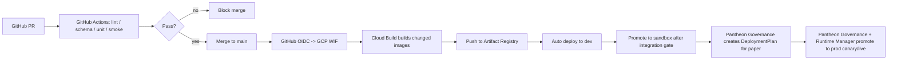

# Pantheon 正式部署與環境設計

## 版本
- 文件版本：v1
- 文件定位：正式交付草案
- 適用範圍：Pantheon 主平台、pantheon-lean、front-ai-trading-system
- 目標環境：GCP + GitHub + Docker

---

## 1. 文件目的

本文件將 Pantheon 既有的完整藍圖、service/module 拆分原則，以及 repo 邊界，正式落到可部署、可維運、可驗收的雲端設計上。

本文件回答四個問題：

1. Pantheon 在 GCP 上應如何部署。
2. GitHub、CI/CD、Docker 在正式環境中各自扮演什麼角色。
3. Pantheon / pantheon-lean / front-ai-trading-system 三個 repo 應如何對應到 deployable services。
4. dev / sandbox / paper / prod 環境應如何隔離與管理。

---

## 2. 設計原則

### 2.1 Plane / Domain 優先，服務數量次之
Pantheon 的第一層拆分依據是 Plane / Domain 邊界，而不是單純追求微服務數量。

先定：
- 哪些是正式的 Plane / Domain truth
- 哪些需要獨立 failure domain
- 哪些需要獨立 scaling profile
- 哪些仍可保留在 service 內部 module

### 2.2 兩條部署線分開
Pantheon 必須把：
- **應用程式 / 控制面部署**
- **策略 artifact / runtime deploy**

分成兩條線。

GitHub / CI/CD 只負責：
- code build
- image publish
- infra rollout

真正的 paper / canary / live deploy 必須由 Pantheon 自己的：
- ApprovalDecision
- DeploymentPlan
- RuntimeBinding
- runtime-manager

完成。

### 2.3 Execution 叢集獨立於一般控制面
Pantheon 的 execution plane 不應和普通 BFF / API service 混在同一套 compute substrate 內。

原因：
- 執行期需求與 API 需求不同
- 運行時間型態不同
- 風險域不同
- per-pool isolation 要求更高

### 2.4 Docker 是 packaging，不是 architecture substitute
Docker 用來做：
- dependency isolation
- reproducible build
- environment parity
- rollout artifact

Docker 不能取代：
- source of truth 設計
- governance
- runtime truth
- rollback semantics

### 2.5 正式環境以環境隔離 + stage 語義雙軌管理
環境維度：
- dev
- sandbox
- paper
- prod

部署 stage 維度：
- none
- paper
- canary
- live
- frozen

環境不應直接等於 stage。

---

## 3. 總體部署架構圖

```mermaid
flowchart TB

    subgraph GH["GitHub"]
        REPO1["pantheon repo"]
        REPO2["pantheon-lean repo"]
        REPO3["front-ai-trading-system repo"]
        GHA["GitHub Actions"]
    end

    subgraph GCP_SHARED["GCP Shared Build / Registry"]
        WIF["Workload Identity Federation"]
        CB["Cloud Build"]
        AR["Artifact Registry"]
        SM["Secret Manager"]
        LOG["Cloud Logging / Monitoring"]
    end

    subgraph GCP_DEV["GCP Dev / Sandbox"]
        CR_DEV["Cloud Run\ncontrol-plane services"]
        GKEA_DEV["GKE Autopilot\nresearch + async workers"]
        SQL_DEV["Cloud SQL (Postgres)"]
        GCS_DEV["GCS"]
        PS_DEV["Pub/Sub"]
        CH_DEV["ClickHouse / analytics"]
    end

    subgraph GCP_PAPER["GCP Paper"]
        CR_PAPER["Cloud Run\ncontrol-plane services"]
        GKEA_PAPER["GKE Autopilot\nresearch + async workers"]
        GKES_PAPER["GKE Standard\nruntime-manager + pantheon-lean paper runtimes"]
        SQL_PAPER["Cloud SQL (Postgres)"]
        GCS_PAPER["GCS"]
        PS_PAPER["Pub/Sub"]
        CH_PAPER["ClickHouse / analytics"]
    end

    subgraph GCP_PROD["GCP Prod"]
        CR_PROD["Cloud Run\ncontrol-plane services"]
        GKEA_PROD["GKE Autopilot\nasync workers"]
        GKES_PROD["GKE Standard\nruntime-manager + pantheon-lean prod runtimes"]
        SQL_PROD["Cloud SQL (Postgres)"]
        GCS_PROD["GCS"]
        PS_PROD["Pub/Sub"]
        CH_PROD["ClickHouse / analytics"]
    end

    subgraph EXEC["Execution Substrate"]
        RM["runtime-manager-svc"]
        LEAN["pantheon-lean / LEAN runtimes"]
        BRK["brokers / exchanges"]
    end

    REPO1 --> GHA
    REPO2 --> GHA
    REPO3 --> GHA

    GHA --> WIF
    WIF --> CB
    GHA --> CB
    CB --> AR

    AR --> CR_DEV
    AR --> GKEA_DEV
    AR --> GKES_PAPER
    AR --> GKES_PROD
    AR --> CR_PAPER
    AR --> CR_PROD
    AR --> GKEA_PAPER
    AR --> GKEA_PROD

    SM --> CR_DEV
    SM --> GKEA_DEV
    SM --> CR_PAPER
    SM --> GKEA_PAPER
    SM --> GKES_PAPER
    SM --> CR_PROD
    SM --> GKEA_PROD
    SM --> GKES_PROD

    CR_DEV --> SQL_DEV
    CR_DEV --> GCS_DEV
    CR_DEV --> PS_DEV
    GKEA_DEV --> SQL_DEV
    GKEA_DEV --> GCS_DEV
    GKEA_DEV --> PS_DEV
    GKEA_DEV --> CH_DEV

    CR_PAPER --> SQL_PAPER
    CR_PAPER --> GCS_PAPER
    CR_PAPER --> PS_PAPER
    GKEA_PAPER --> SQL_PAPER
    GKEA_PAPER --> GCS_PAPER
    GKEA_PAPER --> PS_PAPER
    GKEA_PAPER --> CH_PAPER
    GKES_PAPER --> SQL_PAPER
    GKES_PAPER --> GCS_PAPER
    GKES_PAPER --> PS_PAPER
    GKES_PAPER --> CH_PAPER

    CR_PROD --> SQL_PROD
    CR_PROD --> GCS_PROD
    CR_PROD --> PS_PROD
    GKEA_PROD --> SQL_PROD
    GKEA_PROD --> GCS_PROD
    GKEA_PROD --> PS_PROD
    GKEA_PROD --> CH_PROD
    GKES_PROD --> SQL_PROD
    GKES_PROD --> GCS_PROD
    GKES_PROD --> PS_PROD
    GKES_PROD --> CH_PROD

    GKES_PAPER --> RM
    GKES_PAPER --> LEAN
    GKES_PROD --> RM
    GKES_PROD --> LEAN
    LEAN --> BRK

    CR_DEV --> LOG
    GKEA_DEV --> LOG
    GKES_PAPER --> LOG
    GKES_PROD --> LOG
    CR_PAPER --> LOG
    CR_PROD --> LOG
```

---

## 4. Deployable service inventory

### 4.1 v1 建議的正式 deployable services

1. `app-bff-svc`
2. `openclaw-adapter-svc`
3. `persona-hub-svc`
4. `consultation-svc`
5. `data-ingest-svc`
6. `data-catalog-svc`
7. `feature-svc`
8. `research-orchestrator-svc`
9. `registry-core-svc`
10. `lineage-read-svc`
11. `decision-engine-svc`
12. `optimizer-svc`
13. `promotion-svc`
14. `runtime-manager-svc`
15. `telemetry-incident-svc`
16. `evolution-svc`

### 4.2 先留在 service 內部的 module

以下模組先不拆成獨立 deployable service：
- `policy-engine`
- `memory-index`
- `broker-gateway`
- `regime-evaluator`
- `universe-selector`
- `signal-inference`
- `allocation-aggregator`

### 4.3 不屬於 Pantheon 主 service 的外部 substrate

- `OpenClaw`：upstream agent/runtime substrate
- `pantheon-lean / LEAN`：execution substrate
- `Qlib / DSPy / imitation / TRL / RLlib / QuantLib / vectorbt / statsmodels`：research/learning worker runtimes

---

## 5. GCP services mapping

## 5.1 Cloud Run mapping

| Pantheon service | GCP runtime | 理由 |
|---|---|---|
| `app-bff-svc` | Cloud Run Service | HTTP API、SSE、stateless、revision rollout |
| `openclaw-adapter-svc` | Cloud Run Service | adapter façade、session bridge、error normalization |
| `persona-hub-svc` | Cloud Run Service | request/response 為主，state 在 DB |
| `consultation-svc` | Cloud Run Service | consult API、committee orchestration trigger |
| `registry-core-svc`（API slice） | Cloud Run Service | metadata read/write API + Cloud SQL/GCS |
| `lineage-read-svc` | Cloud Run Service | query facade、read-heavy |
| `promotion-svc` | Cloud Run Service | ApprovalDecision / DeploymentPlan API |
| `decision-engine-svc` | Cloud Run Service | synchronous decision façade |
| `evolution-svc` | Cloud Run Service | decision API + workflow trigger |

### Cloud Run 不放什麼
- 長時間 queue consumer
- 高吞吐 telemetry batch writers
- execution runtimes
- heavy research workers

---

## 5.2 GKE Autopilot mapping

| Pantheon service / worker | GCP runtime | 理由 |
|---|---|---|
| `data-ingest-svc` | GKE Autopilot | 長時間 ingest / connector / queue consumer |
| `data-catalog-svc`（batch part） | GKE Autopilot | normalization / dataset materialization |
| `feature-svc` | GKE Autopilot | feature build / batch jobs |
| `research-orchestrator-svc` | GKE Autopilot | async orchestration |
| `optimizer-svc` | GKE Autopilot | heavier optimization / synthesis jobs |
| `telemetry-incident-svc` | GKE Autopilot | ingest / reconciliation / incident processors |
| `qlib-worker` | GKE Autopilot | heavy Python workload |
| `vectorbt-worker` | GKE Autopilot | batch research |
| `statsmodels-worker` | GKE Autopilot | econometrics / regime jobs |
| `quantlib-worker` | GKE Autopilot | pricing / risk jobs |
| `rl-lab-worker` | GKE Autopilot | long-running compute |
| `dspy-worker` | GKE Autopilot | training/eval batch |
| `imitation-worker` | GKE Autopilot | trajectory processing |
| `trl-worker` | GKE Autopilot | preference-learning batch |

### GKE Autopilot 的適用原則
- queue-driven
- scheduled
- batch / long-running
- CPU / memory / library profile 複雜
- 不適合 Cloud Run request timeout 模型

---

## 5.3 GKE Standard mapping（execution cluster）

| Pantheon component | GCP runtime | 理由 |
|---|---|---|
| `runtime-manager-svc` | GKE Standard | execution-sensitive control plane |
| `pantheon-lean` paper runtimes | GKE Standard | 長駐、per-pool isolation |
| `pantheon-lean` prod runtimes | GKE Standard | live execution、風險域更高 |
| broker connectivity sidecars | GKE Standard | network / secrets / isolation |

### 為什麼 execution cluster 用 GKE Standard
- 需要較明確的 node / networking 控制
- 需要長駐 runtime
- 需要 per-pool 隔離
- 需要較穩定的 operator 介入能力

---

## 5.4 Shared managed services mapping

| GCP service | Pantheon 用途 |
|---|---|
| Cloud SQL for PostgreSQL | canonical relational truth：registry / governance / runtime binding / incidents / evolution |
| GCS | artifacts、datasets、replay bundles、reports |
| Artifact Registry | all Docker images / packages |
| Pub/Sub | async event backbone / decoupling |
| Secret Manager | broker creds、exchange keys、DB creds、API tokens |
| Cloud Logging / Monitoring | logs、metrics、alerts、health |
| ClickHouse | telemetry analytical mirror / dashboard / heavy time-series |

---

## 6. repo-to-service mapping

## 6.1 Repo 邊界

### `pantheon`
包含：
- control-plane services
- data services
- research orchestrator
- registry / promotion / runtime-manager
- telemetry / incident / evolution
- infra manifests
- CI templates
- canonical docs / audits / scripts

### `pantheon-lean`
包含：
- LEAN fork
- execution substrate
- strategy execution bridge
- runtime payload / algorithm integration

### `front-ai-trading-system`
包含：
- operator console
- frontend state machine
- BFF client
- handoff packet receiver

---

## 6.2 Path-to-service mapping

| Repo / path | 對應服務 / 組件 |
|---|---|
| `pantheon/services/control-plane/bff/` | `app-bff-svc` |
| `pantheon/integrations/openclaw/` | `openclaw-adapter-svc` |
| `pantheon/services/control-plane/persona/` | `persona-hub-svc` |
| `pantheon/services/control-plane/consultation/` | `consultation-svc` |
| `pantheon/services/data/ingest/` | `data-ingest-svc` |
| `pantheon/services/data/catalog/` | `data-catalog-svc` |
| `pantheon/services/data/feature/` | `feature-svc` |
| `pantheon/services/research/` | `research-orchestrator-svc` + workers |
| `pantheon/services/registry/` | `registry-core-svc` |
| `pantheon/services/registry/lineage/` or `services/telemetry/lineage_read/` | `lineage-read-svc` |
| `pantheon/services/decision/` | `decision-engine-svc` |
| `pantheon/services/optimizer-svc/` or `services/evaluation/optimizers/` | `optimizer-svc` |
| `pantheon/services/control-plane/governance/` | `promotion-svc` |
| `pantheon/services/execution/runtime-manager/` | `runtime-manager-svc` |
| `pantheon/services/telemetry/` + `services/incident/` | `telemetry-incident-svc` |
| `pantheon/services/control-plane/governance/evolution_*` | `evolution-svc` |
| `pantheon-lean/lean/Algorithm.Python/pantheon_algo/` | LEAN bridge / runtime payload layer |
| `front-ai-trading-system/src/` | operator UI |

---

## 7. Docker image strategy

## 7.1 image families

### control-plane images
- `pantheon/app-bff`
- `pantheon/openclaw-adapter`
- `pantheon/persona-hub`
- `pantheon/consultation`
- `pantheon/registry-core`
- `pantheon/lineage-read`
- `pantheon/promotion`
- `pantheon/decision-engine`
- `pantheon/optimizer`
- `pantheon/telemetry-incident`
- `pantheon/evolution`

### worker images
- `pantheon-workers/qlib`
- `pantheon-workers/vectorbt`
- `pantheon-workers/statsmodels`
- `pantheon-workers/quantlib`
- `pantheon-workers/rl-lab`
- `pantheon-workers/dspy`
- `pantheon-workers/imitation`
- `pantheon-workers/trl`

### execution images
- `pantheon-exec/runtime-manager`
- `pantheon-exec/lean-runtime-base`
- `pantheon-exec/lean-runtime-family-*`

## 7.2 image 規則

### 必須做到
- 每個 deployable service 自己一個 image
- 每個 worker / framework 自己一個 image
- 每個 image 自己有 pinned dependencies
- 不把所有 quant frameworks merge 成單一 requirements

### tag 規則
至少保留：
- `:git-sha`
- `:release-tag`
- `:env-candidate`
- `:env-approved`

禁止只依賴 `latest`。

---

## 8. CI/CD pipeline stages

## 8.1 總體流程圖

---

## 8.2 Stage 0 — PR CI（GitHub Actions）

### 必跑項目
1. schema validation
2. canonical document consistency checks
3. lint / type check
4. unit tests
5. smoke tests
6. changed-service Docker build dry run
7. security / dependency scan

### smoke test 最低覆蓋
- promotion gate
- deployment saga
- runtime binding
- telemetry ingest
- lineage read
- BFF key surfaces

---

## 8.3 Stage 1 — Build / Publish（Cloud Build + Artifact Registry）

### 流程
1. GitHub Actions 透過 OIDC/WIF 取得 GCP 短期身份
2. Cloud Build 根據 changed paths build 對應 image
3. Cloud Build push image 到 Artifact Registry
4. 產出 build provenance / logs / image digest

### 原則
- GitHub 不持有長期 GCP service account key
- image build 以 Cloud Build 為主
- 所有 deployable units 必須可從 Artifact Registry 取得 image digest

---

## 8.4 Stage 2 — Dev deploy

### 目的
- 功能驗證
- 單服務 smoke
- early integration

### 流程
- merge to `main`
- 自動 deploy 到 `dev`
- 只允許 non-production secrets
- 執行 health / smoke / migration checks

### 可直接由 GitHub/CD 完成的內容
- Cloud Run revisions
- GKE Autopilot non-execution worker rollout
- frontend preview / dev build

---

## 8.5 Stage 3 — Sandbox deploy

### 目的
- 跨服務整合驗證
- contract / query / SSE / fallback 驗證
- release candidate rehearsal

### 流程
- release branch / RC tag
- 部署到 sandbox
- 執行 integration suite
- 驗證 degraded / fallback / replay / lineage / approval flows

### 注意
Sandbox 仍然不是 paper。
它只是 full-stack non-money integration env。

---

## 8.6 Stage 4 — Paper deploy

### 原則
Paper deploy 不能只靠 GitHub Action 把 image 推到 paper namespace 就算完成。

### 正式紙上部署鏈
1. artifact approved
2. DeploymentPlan created
3. runtime-manager receives deploy intent
4. RuntimeBinding established
5. telemetry confirms runtime state

### GitHub/CD 在這條線的角色
只負責：
- 發佈 runtime-manager / lean-runtime images
- 部署控制面服務到 paper env
- 更新 base infra

### 真正進入 paper 的主導者
- Pantheon governance
- runtime-manager
- RuntimeBinding truth

---

## 8.7 Stage 5 — Prod deploy

### 兩條線要分開

#### A. control-plane prod deploy
適用：
- BFF
- registry
- lineage read
- promotion
- persona / consultation
- telemetry API
- evolution API

這條線可用標準 GitHub -> Cloud Build -> Artifact Registry -> Cloud Run/GKE。

#### B. execution-plane prod deploy
適用：
- runtime-manager
- pantheon-lean runtimes
- per-pool deploy

這條線不得由 GitHub Actions 直接把策略送上 live。

### 正式 live deploy 鏈
1. ApprovalDecision
2. DeploymentPlan
3. runtime-manager executes
4. RuntimeBinding established
5. telemetry + health + audit confirm
6. canary / live state transition

---

## 9. Environment matrix

## 9.1 原則
- `dev`：開發、自測、局部驗證
- `sandbox`：跨服務整合
- `paper`：production-like infra + no real money
- `prod`：真實營運

`canary` 應作為 `prod` 內的 deployment stage，而不是另一套 repo/branch/environment 真相來源。

---

## 9.2 Environment matrix

| 項目 | dev | sandbox | paper | prod |
|---|---|---|---|---|
| 目的 | 開發與單元驗證 | 跨服務整合、contract 驗證 | production-like 模擬交易 | 真實營運 |
| Git trigger | PR / feature branch | main / RC tag | release + Pantheon approval | release + Pantheon approval |
| Cloud Run services | yes | yes | yes | yes |
| GKE Autopilot workers | minimal / shared | yes | yes | yes |
| GKE execution cluster | optional / stub | optional / stub | yes | yes |
| LEAN runtimes | local/dev only or stub | optional paper stub | paper runtimes required | live runtimes required |
| Broker / exchange connectivity | mock / simulator | sandbox API / mock | paper accounts / no real money | real broker / exchange |
| Market data | sample / replay / mocked | real delayed / replay | real market data preferred | real market data |
| Secrets | dev-only scoped | nonprod scoped | paper scoped | prod scoped |
| Canonical DB | isolated nonprod DB | isolated sandbox DB | isolated paper DB | isolated prod DB |
| Artifact Registry | shared repo, env tags | shared repo, env tags | shared repo, signed tags | shared repo, signed tags |
| Promotion path | code deploy only | code deploy only | DeploymentPlan required | DeploymentPlan + RuntimeBinding required |
| Real order execution | no | no | no | yes |
| Canary stage | no | no | no | yes |
| Kill-switch required | optional | optional | yes | yes |
| Operator fallback drill | optional | yes | yes | yes |

---

## 10. GCP project and network layout

## 10.1 建議 project layout

### 推薦方案
- `pantheon-shared`
- `pantheon-dev`
- `pantheon-sandbox`
- `pantheon-paper`
- `pantheon-prod`

### 精簡方案
- `pantheon-shared`
- `pantheon-nonprod`
- `pantheon-paper`
- `pantheon-prod`

### 原則
- `paper` 與 `prod` 不共 project
- shared build / registry / IAM 放在 shared project
- environment-specific DB / secrets / runtime clusters 分開

---

## 10.2 network design principles

### 原則
- Cloud Run 以 private/internal ingress 為主
- Cloud SQL 使用 private IP
- GKE 盡量使用 private nodes
- broker / exchange egress 經明確出口管理
- secrets 不透過 env repo 泄漏
- SSE / operator APIs 與 execution APIs 分開權限

### execution network 原則
- execution cluster 單獨 network policy
- runtime-manager 與 LEAN runtimes 在受控 subnet / namespace
- paper / prod execution cluster 不共 namespace

---

## 11. Identity, secrets, and access

## 11.1 GitHub -> GCP 身份

### 正式做法
- GitHub Actions 使用 OIDC
- GCP 使用 Workload Identity Federation
- 不使用長期 service account key

## 11.2 GCP 內 workload identity

- Cloud Run services 使用 dedicated service accounts
- GKE workloads 使用 GKE-native workload identity / attached GCP identity
- 每個 service 只拿它需要的最小 IAM 權限

## 11.3 Secret Manager 使用規則

以下內容一律放 Secret Manager：
- broker API keys
- exchange API keys
- DB credentials
- OpenClaw upstream credentials
- third-party vendor tokens
- signing / webhook secrets

### 版本管理規則
- secrets 需 versioned
- paper / prod 不共 secret version alias
- break-glass / rollback secret procedure 要明文化

---

## 12. Source of truth boundaries in deployment

## 12.1 GitHub 不是 deployment truth
GitHub 只是真相來源於：
- code
- build config
- infra manifests
- PR review history

GitHub 不是：
- ApprovalDecision truth
- RuntimeBinding truth
- live deploy truth

## 12.2 Pantheon 才是 deploy truth
以下真相來源應留在 Pantheon：
- ApprovalDecision -> `promotion-svc`
- DeploymentPlan -> `promotion-svc`
- RuntimeBinding -> `runtime-manager-svc`
- TelemetryEvent / IncidentCase / Postmortem -> `telemetry-incident-svc`
- EvolutionDecision -> `evolution-svc`

## 12.3 LEAN 是 execution kernel，不是 governance truth
LEAN runtime 只負責：
- execution loop
- fills / positions
- broker interaction

它不負責：
- governance approval
- runtime truth ownership
- promotion state truth

---

## 13. Operational drills and acceptance requirements

## 13.1 上線前最低驗收

### Control-plane
- BFF / registry / promotion / lineage / consultation health checks
- Cloud Run revision rollback drill
- Secret rotation smoke test

### Research / worker layer
- worker image build pass
- queue consumer smoke test
- artifact write/read to GCS

### Execution layer
- runtime-manager authority drill
- paper runtime deploy drill
- rollback action drill
- kill-switch drill

### Feedback layer
- telemetry ingest drill
- incident open/close drill
- lineage query drill
- replay drill

---

## 13.2 Operator fallback drills

至少要做：
- BFF down -> admin CLI path
- degraded API -> read-only fallback
- runtime kill-switch through runtime-manager fast path
- paper runtime replacement
- prod canary abort / rollback

---

## 14. 建議 rollout sequence

## Phase A — Shared infra
- GCP shared project
- WIF
- Artifact Registry
- Secret Manager
- Cloud Build
- base observability

## Phase B — Nonprod control-plane
- Cloud Run services in dev/sandbox
- Cloud SQL nonprod
- Pub/Sub backbone
- GKE Autopilot workers

## Phase C — Paper execution
- GKE Standard execution cluster
- runtime-manager
- pantheon-lean paper runtimes
- paper broker/accounts
- paper telemetry / replay

## Phase D — Prod control-plane
- prod Cloud Run services
- prod Cloud SQL
- prod GCS / Pub/Sub / ClickHouse

## Phase E — Prod execution
- prod execution cluster
- live runtime bindings
- canary path
- kill-switch and safe-mode drills

---

## 15. 需要開發團隊交付的文件與證據

### 15.1 每個 deployable service 必交
- service contract
- write authority
- event contract
- runtime config
- Dockerfile
- smoke test
- failure/degraded mode note

### 15.2 每個 worker 必交
- pinned upstream version
- dedicated Dockerfile
- dedicated requirements
- smoke test
- artifact output contract

### 15.3 每個 environment 必交
- infra manifest
- secrets scope
- DB instance / storage naming convention
- ingress/egress policy
- operator drill report

### 15.4 每條 deployment 路徑必交
- code/image rollout evidence
- DeploymentPlan evidence
- RuntimeBinding evidence
- telemetry confirmation evidence
- rollback evidence

---

## 16. 最終建議

Pantheon 的正式環境不應被設計成：
- GitHub Action 一條龍直接把所有東西推上 production
- 所有 service 都跑在同一種 compute substrate
- 所有 framework 塞進同一個 Docker image
- paper / prod 只靠 namespace 區分

Pantheon 應被設計成：
- **GitHub 管 code 與 CI**
- **Cloud Build 管 image build**
- **Artifact Registry 管 image truth**
- **Cloud Run 管 stateless control-plane**
- **GKE Autopilot 管 heavy async workers**
- **GKE Standard 管 execution cluster**
- **Pantheon governance/runtime path 管 artifact deploy truth**
- **LEAN 只做 execution kernel**

---

## 17. 一句話收斂

Pantheon 的正式部署模型應該是：

> GitHub 管 source 與 CI，Cloud Build 管 container build，Artifact Registry 管 artifacts，Cloud Run 跑控制面 API，GKE Autopilot 跑研究與異步 workers，GKE Standard 跑 runtime-manager 與 LEAN execution cluster；而 paper / canary / live 的真正部署真相必須留在 Pantheon 自己的 ApprovalDecision -> DeploymentPlan -> RuntimeBinding -> telemetry confirmation 鏈，而不是由 GitHub Action 直接決定。

---

## 18. 四個環境如何協作

四個環境不是四套彼此同步狀態的系統，而是：

- **共享同一套 code / image / policy / artifact promotion 規則**
- **隔離各自的 DB / bucket / queue / secrets / broker / runtime state**

要先把三件事分開：

1. **Environment**：`dev / sandbox / paper / prod`
2. **Artifact governance state**：`draft / candidate / approved / retired`
3. **Deployment stage**：`paper / canary / live / frozen`

也就是說，`paper` 既是獨立 environment，也是 deployment stage；而 `canary / live / frozen` 主要發生在 `prod` environment 內部。環境語義與 deployment stage 不得混用。

### 18.1 四個環境的角色

#### dev
用途：單服務開發、自測、schema/migration 驗證、local replay。

- 允許 mock broker / exchange
- 不連真實資金
- 不作為任何上游環境的 state source

#### sandbox
用途：跨服務整合、golden replay、BFF/front-end integration、adapter contract verification。

- 驗證 service 之間是否真正接得起來
- 驗證 saga / event ordering / lineage / telemetry integration
- 仍不是準交易環境

#### paper
用途：production-like 治理與執行預演。

- 使用正式 ApprovalDecision / DeploymentPlan / RuntimeBinding 路徑
- 使用真實市場資料
- 使用 paper broker / sandbox account
- 驗證 rollback / kill-switch / incident / telemetry / lineage / evolution 鏈

#### prod
用途：正式營運。

- 真實 broker / exchange
- 真實資金
- `canary / live / frozen` stage 在此環境內部運作
- 不與 paper 共用 DB / cluster / secrets / accounts

### 18.2 四個環境之間共享什麼

共享：

- GitHub repos
- CI/CD workflows
- immutable image digests
- canonical policy / contract docs
- approved artifact metadata 與 replay bundles（作為引用對象）

不共享：

- Cloud SQL instance
- GCS runtime buckets
- Pub/Sub topics / subscriptions
- Secret Manager secrets scope
- broker / exchange accounts
- RuntimeBinding / position / incident live state

### 18.3 三條正式協作鏈

#### A. Code / Image Promotion Chain

`GitHub -> CI -> Cloud Build -> Artifact Registry -> dev -> sandbox -> paper -> prod`

- 同一個 image digest 向上升環境
- 不允許每個環境 rebuild 不同內容的 image 後假裝是同一版

#### B. Domain Artifact Promotion Chain

`research artifact -> approved artifact -> paper DeploymentPlan -> RuntimeBinding -> prod canary -> prod live`

- 這條鏈由 Pantheon 自己的 governance/runtime path 管理
- GitHub Actions 只負責 code/image deployment，不直接把策略推上 live

#### C. Feedback / Replay Backflow Chain

`paper/prod telemetry -> incident/postmortem -> replay bundle -> sandbox/dev reproduction`

- 回流的是 evidence / replay bundle
- 不是把上游環境的 DB state 複製回來

### 18.4 環境切換的正式門檻

#### dev -> sandbox
- PR CI green
- image build 完成
- integration smoke pass

#### sandbox -> paper
- golden replay pass
- cross-service integration pass
- release candidate approved

#### paper -> prod canary
- ApprovalDecision approved
- DeploymentPlan created
- paper telemetry / incident criteria pass
- rollback target exists

#### prod canary -> prod live
- canary metrics pass
- no unresolved severe incident
- governance / risk owner approve

### 18.5 最重要的操作原則

1. **GitHub/CD 不能直接把策略推上 live**
2. **prod 問題回流用 replay bundle，不用 DB 複製**
3. **paper 是 production-like 預演，不是普通 QA 環境**
4. **canary 是 prod 內 stage，不是第五個 environment**
5. **所有環境共享 code truth，不共享 runtime truth**
