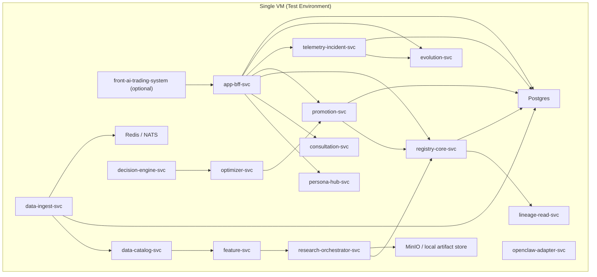
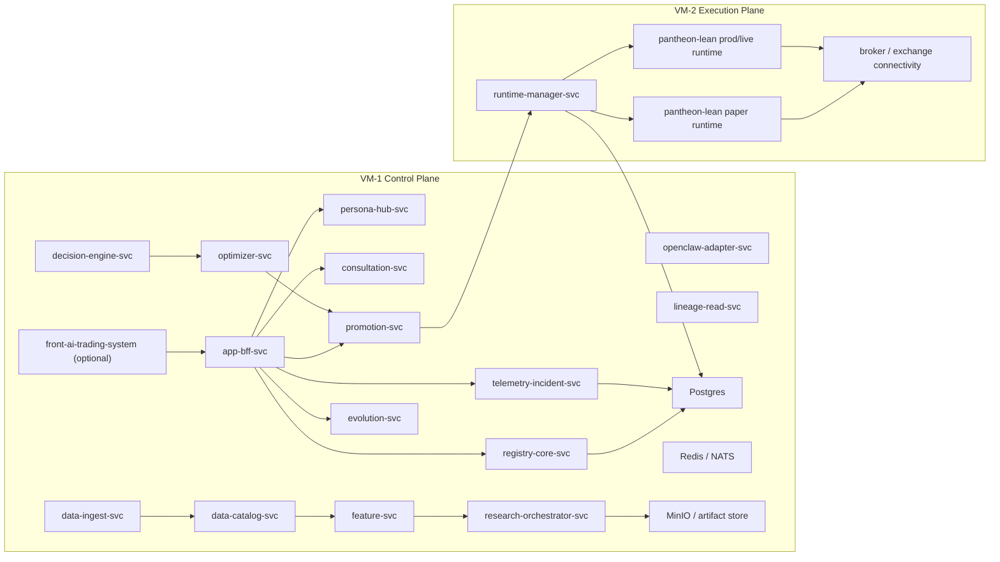

# Pantheon 部署補充說明
## 測試環境採單 VM、正式環境採雙 VM 的部署方案

## 0. 文件目的

本文件是對既有《Pantheon_GCP_GitHub_Docker_正式部署與環境設計》的補充說明。
目的不是重寫正式架構，而是給開發團隊一個**可立即執行的部署版本**：

- **測試環境**：先全部部署成 **單 VM 版**
- **正式環境**：準備升級成 **雙 VM 版**

這份文件要解決的不是「理想最終架構」，而是：

1. 現在怎麼先把整套 Pantheon 跑起來
2. 哪些服務可以先共用一台 VM
3. 哪些服務在正式環境一定要拆開
4. 單 VM → 雙 VM 的升級路徑怎麼走
5. 開發團隊應該先交付什麼、怎麼驗收

---

## 1. 核心決策

### 1.1 測試環境：單 VM 版
測試環境的目標是：
- 讓整套服務先跑起來
- 驗證 Docker image、service wiring、schema migration、basic smoke tests
- 驗證 BFF、registry、promotion、telemetry、persona、consultation、research orchestration 的整合
- 驗證 paper 前的整體流程

因此，測試環境允許將大部分服務先集中部署在**同一台 VM**。

### 1.2 正式環境：雙 VM 版
正式環境的目標是：
- 讓 control plane / governance plane / app plane 維持穩定
- 把 execution plane 從其他服務中隔離出來
- 避免 research / telemetry / BFF / lineage 查詢等負載拖慢交易 runtime
- 讓 broker / exchange secrets、runtime state、kill-switch 控制有更小的信任邊界

因此，正式環境至少要拆成 **雙 VM**：

- **VM-1：Control / Governance / Data / Research / Feedback**
- **VM-2：Execution（runtime-manager + pantheon-lean runtimes）**

---

## 2. 為什麼測試可以單 VM、正式要雙 VM

### 2.1 單 VM 版適合什麼
單 VM 版適合：
- dev / sandbox / early paper 前整合
- 成本控制
- 服務 wiring 驗證
- schema / migration 驗證
- Golden replay / incident / lineage / telemetry 的第一輪串接

### 2.2 單 VM 版不適合什麼
單 VM 版不適合：
- 真實交易
- 真實 broker / exchange 長時間穩定連線
- 高吞吐 research jobs 與 execution runtimes 併行
- 高安全需求下的 secrets 隔離

### 2.3 雙 VM 版的必要性
雙 VM 版不是因為技術上「單 VM 跑不起來」，而是因為正式環境中：

- `pantheon-lean` runtime 不能被 BFF / query / research / telemetry job 拖慢
- `runtime-manager-svc` 不能和其他高負載服務共享失效域
- broker / exchange credentials 不應和整套 control plane 混放
- kill-switch / rollback 需要在更穩定、更小範圍的 execution plane 中運作

---

## 3. 測試環境：單 VM 版部署方案

## 3.1 單 VM 版總體原則

測試環境先採用：

- 一台 Linux VM
- Docker Engine
- Docker Compose
- 單機 Postgres
- 單機 Redis 或 NATS（擇一）
- 單機 MinIO（可選，若尚未直接接 GCS）
- 所有 control plane / governance / feedback / research orchestration 服務都先放同一台

### 重要限制
單 VM 測試環境中：
- **不接真實 live broker**
- **不做真實交易**
- **LEAN runtime 若有啟動，也先只做 paper / mock execution**
- **不把這台機器當 production 雛形直接延用**

---

## 3.2 單 VM 版應部署的服務

### A. 控制面 / 人格 / BFF
- `app-bff-svc`
- `openclaw-adapter-svc`
- `persona-hub-svc`
- `consultation-svc`

### B. 知識 / registry / governance
- `registry-core-svc`
- `lineage-read-svc`
- `promotion-svc`

### C. 決策 / 優化
- `decision-engine-svc`
- `optimizer-svc`

### D. 研究 / 資料 / feature
- `data-ingest-svc`
- `data-catalog-svc`
- `feature-svc`
- `research-orchestrator-svc`

### E. 回饋 / incident / evolution
- `telemetry-incident-svc`
- `evolution-svc`

### F. 基礎元件
- `postgres`
- `redis` 或 `nats`
- `minio`（若尚未接 GCS）
- `clickhouse`（可選；若測試期先不跑分析型查詢，可暫不啟動）

### G. 前端（可選）
- `front-ai-trading-system` 可直接本機跑 dev server
- 或 build 成 nginx container 也放同 VM

---

## 3.3 單 VM 版不建議啟動的東西

以下即使技術上可以同機跑，也**不建議在測試環境單 VM 版先重度使用**：

- 重型 `qlib-worker`
- `rl-lab-worker`
- `quantlib-worker`
- 大規模 telemetry backfill
- 真實 `runtime-manager + pantheon-lean live runtime`
- 真實 broker / exchange connectivity

### 理由
這些會讓：
- CPU / RAM 爭用過重
- 服務不穩定時難以定位是整合問題還是資源問題
- 測試環境和正式 execution plane 的信任邊界混掉

---

## 3.4 單 VM 版參考部署拓樸

---

## 3.5 單 VM 版的測試目標

單 VM 測試環境不是為了「長期運行」，而是要完成以下驗收：

### 必須通過的項目
1. 所有 service 都能用 Docker Compose 起來
2. Postgres migration 能正確執行
3. BFF 能打到 registry / promotion / telemetry / persona 主要路徑
4. OpenClaw adapter 能正常回應基本 session / tool bridge
5. research-orchestrator 能提交至少一個 mock / replay research job
6. promotion 能建立 `ApprovalDecision` / `DeploymentPlan`
7. telemetry 能收事件、建立基本 incident
8. lineage read 能回傳至少一條 artifact / deployment / telemetry chain
9. Golden replay scenario 能在此環境跑通
10. CLI fallback / operator basic actions 能動作

### 單 VM 測試環境不要求
- 真實 live deployment
- 真實 broker account integration
- 真實 canary / live trading
- 高可用
- 水平擴縮
- 高吞吐 performance benchmark

---

# 4. 正式環境：雙 VM 版部署方案

## 4.1 雙 VM 版總體原則

正式環境至少拆成兩台：

### VM-1：Control Plane VM
放所有：
- BFF
- persona / consultation
- registry / promotion / lineage
- decision / optimizer
- telemetry / evolution
- data / feature / research orchestrator（輕量或中量）

### VM-2：Execution VM
只放：
- `runtime-manager-svc`
- `pantheon-lean` paper / prod runtime
- broker / exchange connectivity
- execution-side sidecars / adapters

### 核心原則
- **Control Plane 與 Execution Plane 故障域分開**
- **execution secrets 與 broker creds 不和所有服務混放**
- **runtime state 不和其他 control-plane state 混在同主機記憶體 / process 空間**
- **kill-switch / rollback 維持在 execution plane 的小信任邊界**

---

## 4.2 VM-1：Control Plane VM 應部署的內容

### A. 控制面 / 人格 / BFF
- `app-bff-svc`
- `openclaw-adapter-svc`
- `persona-hub-svc`
- `consultation-svc`

### B. 知識 / registry / governance
- `registry-core-svc`
- `lineage-read-svc`
- `promotion-svc`

### C. 決策 / 優化
- `decision-engine-svc`
- `optimizer-svc`

### D. 資料 / research（輕量）
- `data-ingest-svc`
- `data-catalog-svc`
- `feature-svc`
- `research-orchestrator-svc`

### E. 回饋 / incident / evolution
- `telemetry-incident-svc`
- `evolution-svc`

### F. 基礎設施
- `postgres`
- `redis` 或 `nats`
- `minio`
- `clickhouse`（若正式環境也需要分析鏡像）
- 反向代理（Nginx/Caddy，若需要）

---

## 4.3 VM-2：Execution VM 應部署的內容

### A. 核心服務
- `runtime-manager-svc`

### B. 執行底盤
- `pantheon-lean` paper runtime
- `pantheon-lean` prod runtime
- 若未來有 per-pool runtime，則每 pool 各自一個 runtime process/container

### C. 執行相關 module / sidecar
- broker / exchange adapter sidecars
- order / execution telemetry collector
- runtime local health checks
- local kill-switch helper（若需要）

### D. 不應放在 VM-2 的東西
- BFF
- registry-core
- lineage-read
- promotion API
- heavy research workers
- front-end
- 大量 replay / backfill jobs

---

## 4.4 雙 VM 版參考部署拓樸

---

## 4.5 雙 VM 版的核心協作方式

### VM-1 Control Plane 負責
- canonical objects
- approval / deployment planning
- registry truth
- lineage / telemetry / incident / evolution truth
- BFF / operator interface
- OpenClaw / persona / consultation

### VM-2 Execution Plane 負責
- RuntimeBinding 實際落地
- strategy runtime 啟動 / 停止 / rollback / pause
- broker / exchange 連線
- execution-side runtime loop
- kill-switch fast path

### 兩台 VM 的互動
它們透過：
- internal network
- DB / queue
- API / command channel
協作，但不共享 process space。

---

# 5. 單 VM → 雙 VM 的升級路徑

這一節是給開發團隊的真正操作指引。

## 5.1 第一步：先做單 VM 版
開發團隊先完成：

- Docker Compose 檔
- `.env.example`
- Postgres migration
- 所有控制面服務起動
- 基本 queue / object store
- Golden replay scenario
- basic BFF / CLI action path

### 這一階段不要求
- 真實 runtime 分離
- 真實 broker 連線
- per-pool runtime isolation

---

## 5.2 第二步：把 execution plane 從單 VM 拆出來
當單 VM 版測通後，立刻做：

- 把 `runtime-manager-svc` 移出
- 把 `pantheon-lean` runtime 移出
- 把 broker / exchange secrets 只放在 VM-2
- Control Plane 對 execution 只保留 API / command / DB / queue 協作

### 這一步完成後，正式環境就成為雙 VM
也就是：
- 測試環境：單 VM
- 正式環境：雙 VM

---

## 5.3 第三步：正式環境再做 hardening
雙 VM 正式環境跑穩之後，再補：

- execution VM 上的更嚴格 network rule
- secrets scope tightening
- telemetry / analytics externalization
- heavy research workers 抽離到第三台或 GKE

---

# 6. 開發團隊應交付的內容

## 6.1 先交付單 VM 版
### 必交
1. `docker-compose.test.yml`
2. `env/test.env.example`
3. `Makefile` / `taskfile`
4. `bootstrap.sh`
5. migration script
6. healthcheck script
7. smoke test script
8. Golden replay runbook

### 驗收條件
- 單 VM 可一鍵起全部服務
- BFF / registry / promotion / telemetry / lineage / persona 跑通
- 至少一條 replay scenario 成功
- 至少一條 DeploymentPlan / RuntimeBinding 的 mock 流程成功

---

## 6.2 再交付雙 VM 版
### 必交
1. `docker-compose.control.yml`
2. `docker-compose.exec.yml`
3. `env/prod-control.env.example`
4. `env/prod-exec.env.example`
5. execution VM bootstrap
6. runtime-manager deploy/rollback scripts
7. broker/exchange secret injection guide
8. operator failover / kill-switch guide

### 驗收條件
- VM-1 只跑 control plane
- VM-2 只跑 execution plane
- DeploymentPlan 能從 VM-1 下發到 VM-2
- RuntimeBinding 能正確建立
- paper runtime 能啟動
- kill-switch / rollback 可以從 control plane 發起、由 execution plane 執行
- telemetry 能回流到 VM-1

---

# 7. 資源配置建議

## 7.1 單 VM 測試版建議
### 最小建議
- CPU：8 vCPU
- RAM：16–32 GB
- Disk：200 GB SSD

### 如果 research / replay 比較重
- CPU：16 vCPU
- RAM：32–64 GB

---

## 7.2 雙 VM 正式版建議

### VM-1（Control Plane）
- CPU：8–16 vCPU
- RAM：16–32 GB
- Disk：200 GB SSD

### VM-2（Execution Plane）
- CPU：8–16 vCPU
- RAM：16–32 GB
- Disk：200 GB SSD
- 低延遲網路優先
- 穩定性優先，不要混入重型 research job

---

# 8. 管理規範

## 8.1 測試環境規範
- 允許所有服務同機
- 允許 mock / stub
- 不允許真實 live broker
- 不允許把測試機器誤當 production

## 8.2 正式環境規範
- execution plane 必須獨立 VM
- runtime-manager 與 LEAN runtime 不得和 control plane 混機
- broker / exchange secrets 不得放在 control plane VM
- 所有 live 交易都必須從 execution VM 發出
- paper / live deployment 必須經過 `DeploymentPlan` / `RuntimeBinding`

---

# 9. 給開發團隊的最終要求

## 9.1 短期要求
請先完成 **單 VM 測試版**，目標不是 production，而是：

- 跑通 Pantheon control plane
- 跑通 registry / promotion / telemetry / lineage / BFF / persona / consultation
- 跑通一條 Golden replay
- 跑通一條 mock deployment flow

## 9.2 中期要求
請在單 VM 版測通後，立刻準備 **雙 VM 正式版**，目標是：

- 把 execution plane 從 control plane 分離
- 在雙 VM 上跑通 `DeploymentPlan -> RuntimeBinding -> paper runtime`
- 確保 kill-switch / rollback / telemetry 回流完整

---

# 10. 一句話結論

> 測試環境先全部部署成單 VM 版，目的是快速整合與驗證整套 Pantheon；正式環境至少升級成雙 VM 版，把 control/governance/data/research/feedback 放在 VM-1，把 runtime-manager 與 pantheon-lean execution plane 放在 VM-2，藉此建立正式交易所需的故障域隔離、權限邊界與 runtime 穩定性。
