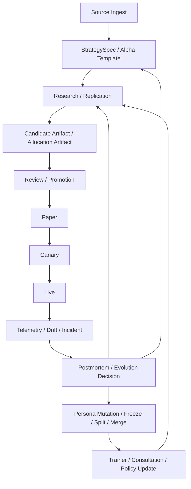
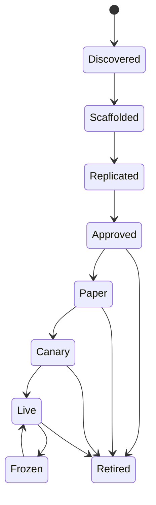
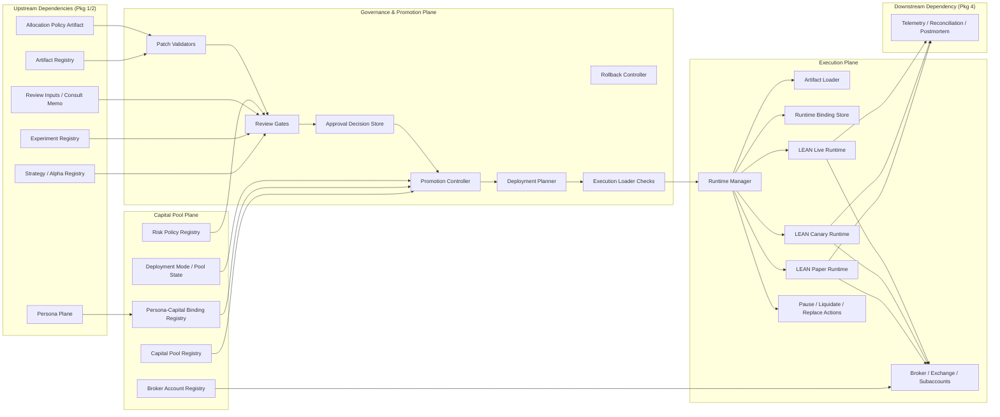
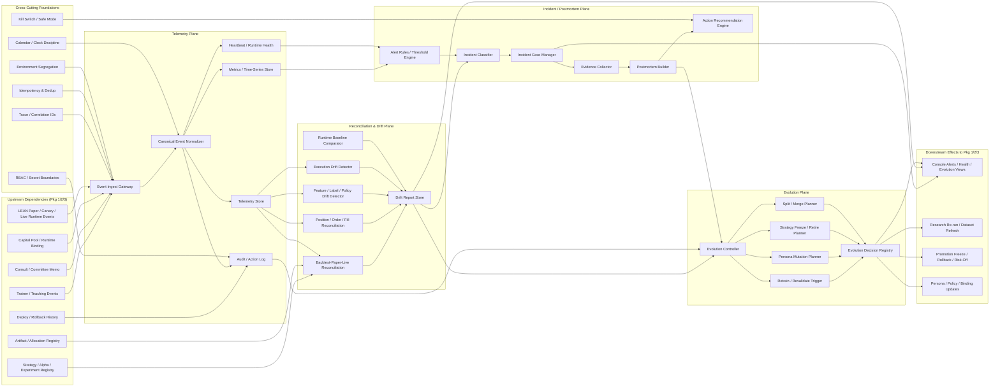

# Pantheon 總索引版系統分析文件

Last updated: 2026-04-09
Status: supporting future-state product blueprint
Tier: L3 Supporting Design & Migration
Scope: broad north-star product/system analysis across planes, packages, and service families
Conflict rule: this document is a future-state blueprint and background reference; it does not override current L1 platform architecture or L2 planning docs

> 文件定位：整併「總綱 / 完整系統架構」、「第一包～第四包系統分析文件」、以及「總索引版系統分析文件」為單一 Markdown 母文件。  
> 本文件可作為後續 schema、service contract、event contract、API spec、實作規劃與專案切分的主索引。

---

# 目錄

- [1. 文件定位與閱讀方式](#1-文件定位與閱讀方式)
- [2. Pantheon 系統定義](#2-pantheon-系統定義)
- [3. 系統公理](#3-系統公理)
- [4. 總體系統架構](#4-總體系統架構)
- [5. 系統主平面總覽](#5-系統主平面總覽)
- [6. 系統主循環總覽](#6-系統主循環總覽)
- [7. 狀態機總覽](#7-狀態機總覽)
- [8. 核心資料物件總覽](#8-核心資料物件總覽)
- [9. 第一包：Console / BFF / Shared Capability / Persona / Consultation](#9-第一包console--bff--shared-capability--persona--consultation)
- [10. 第二包：Source Ingestion / Knowledge & Registry / Research & Learning / Policy Learning / Optimizer](#10-第二包source-ingestion--knowledge--registry--research--learning--policy-learning--optimizer)
- [11. 第三包：Capital Pool / Governance & Promotion / Execution](#11-第三包capital-pool--governance--promotion--execution)
- [12. 第四包：Telemetry / Reconciliation / Postmortem / Evolution / Cross-Cutting Foundations](#12-第四包telemetry--reconciliation--postmortem--evolution--cross-cutting-foundations)
- [13. repo 與子系統落點](#13-repo-與子系統落點)
- [14. 前後端總分工](#14-前後端總分工)
- [15. API 家族索引](#15-api-家族索引)
- [16. 非功能需求總索引](#16-非功能需求總索引)
- [17. 後續細化建議](#17-後續細化建議)

---

# 1. 文件定位與閱讀方式

本文件不是單一模組規格，而是 **Pantheon 全系統的母文件**。

它整合了三種內容：

1. **總綱 / 完整架構藍圖**：定義 Pantheon 是什麼、有哪些 plane、資料如何流、治理與回饋如何形成閉環。
2. **四包系統分析文件**：依主題拆分成四大分析包，避免單次輸出過大，也讓後續工作更容易分派。
3. **總索引版整理**：把四包之間的交界、共同物件、共同狀態機、共同非功能需求收斂成單一入口。

建議閱讀順序：

1. 先讀第 2～8 章，建立系統世界觀。
2. 再依開發主題讀第 9～12 章。
3. 最後以第 13～17 章作為 repo 邊界、API、NFR 與後續細化的入口。

---

# 2. Pantheon 系統定義

**Pantheon** 是一個：

> 以前台工作台驅動、以控制平面協調多人格、以研究與知識平面生產策略與 artifact、以治理平面控制 promotion / rollback、以每資金池獨立 runtime 實現 paper / canary / live、並由 telemetry / postmortem / evolution 回灌形成閉環的多人格量化 operating system。

Pantheon 不是：

- 一個會聊天的交易 agent
- 一個單一模型下單系統
- 一個單純回測平台
- 一個只做 research、不做治理與實盤隔離的 AI 實驗專案

Pantheon 的制度核心是：

- **研發共享**
- **知識共享**
- **會診共享**
- **但資金池與 live 執行隔離**

也就是說：

- 共享的是 capability、knowledge、consultation。
- 不共享的是 capital pool runtime state、broker state、live book、風險邊界。

---

# 3. 系統公理

以下 10 條是 Pantheon 的主公理，後續所有設計都不能違反：

1. **研究與執行分離**  
   研究產出 artifact，execution consume artifact。

2. **persona 是正式一級物件**  
   persona 不是 prompt，而是 workspace、policy、capability、binding、lifecycle 的組合體。

3. **風控有否決權**  
   risk 不是附屬模組，而是 deployment 與 runtime 的 veto layer。

4. **所有資料與 artifact 必須可回放、可版本化**  
   raw / normalized / feature-ready / artifact / deployment 都要有 version 與 lineage。

5. **所有策略、人格、部署都要有 lineage**  
   能回答「從哪來、為何上線、誰批准、怎麼回退」。

6. **所有上線都經過 paper / canary / rollback 路徑**  
   不允許從 candidate 直接跳 full live。

7. **OpenClaw / LLM / agent 主要放在研究、控制、治理，不直接當 execution kernel**

8. **可學習物件要分開**  
   persona policy、alpha policy、human trader imitation 不能混成單一模型。

9. **回饋不只回模型，也回 persona 與知識庫**

10. **實盤表現必須和 backtest / paper / canary 持續 reconciliation**

---

# 4. 總體系統架構

## 4.1 總體架構圖

```mermaid
flowchart LR

    subgraph UI["Pantheon Console Plane"]
        UI1["Operator Console"]
        UI2["Persona Workbench"]
        UI3["Research Workbench"]
        UI4["Knowledge Workbench"]
        UI5["Trainer Workbench"]
        UI6["Consultation Workbench"]
        UI7["Governance Workbench"]
        UI8["Evolution Workbench"]
    end

    subgraph BFF["Pantheon BFF Plane"]
        BFF1["UI Aggregation API"]
        BFF2["Auth / Session / RBAC"]
        BFF3["Read Model / Command Facade"]
        BFF4["Realtime / Notification Layer"]
    end

    subgraph CAP["Shared Capability Plane"]
        CAP1["Plugin Tools"]
        CAP2["Shared Skills Pack"]
        CAP3["Workflow Templates"]
        CAP4["Hooks / Cron / Background Jobs"]
        CAP5["Agent Router / Session Binder"]
    end

    subgraph SRC["Source Ingestion Plane"]
        SRC1["Paper Ingest"]
        SRC2["Repo Ingest"]
        SRC3["Internal Research Ingest"]
        SRC4["Normalize -> StrategySpec Seed"]
        SRC5["Source Registry"]
    end

    subgraph PER["Persona Plane"]
        PER1["Persona Registry"]
        PER2["Workspace Manager"]
        PER3["Route Policy Manager"]
        PER4["Consult Policy Manager"]
        PER5["Capability Resolver"]
        PER6["Teaching Session Coordinator"]
        PER7["Persona Lifecycle Manager"]
    end

    subgraph CPL["Capital Pool Plane"]
        CPL1["Capital Pool Registry"]
        CPL2["Risk Policy Registry"]
        CPL3["Broker Account Registry"]
        CPL4["Persona-Capital Binding Registry"]
        CPL5["Pool State Manager"]
    end

    subgraph KNO["Knowledge & Registry Plane"]
        K1["Source Registry"]
        K2["Strategy Registry"]
        K3["Alpha Registry"]
        K4["Experiment Registry"]
        K5["Artifact Registry"]
        K6["Insight Bus / Research Notes"]
        K7["Evidence Store"]
        K8["Model / Artifact Lineage"]
    end

    subgraph CON["Consultation Plane"]
        CON1["Consult Request Manager"]
        CON2["Agent-to-Agent Bus"]
        CON3["Committee Orchestrator"]
        CON4["Red-Team Orchestrator"]
        CON5["Consult Memo Store"]
        CON6["Consult Audit Log"]
    end

    subgraph RES["Research & Learning Plane"]
        R1["Qlib Research Factory"]
        R2["vectorbt Rapid Prototype"]
        R3["statsmodels Econometrics / Regime"]
        R4["QuantLib Pricing / Rates / Vol"]
        R5["RL Lab (FinRL-Meta / RLlib)"]
        R6["Experiment Orchestrator"]
        R7["Rapid Eval Service"]
    end

    subgraph POL["Policy Learning Plane"]
        P1["Persona Policy Learning"]
        P2["Alpha Policy Learning"]
        P3["Human Trader Imitation"]
        P4["Preference / Correction Dataset Builder"]
    end

    subgraph OPT["Portfolio / Risk Optimizer Layer"]
        O1["skfolio"]
        O2["PyPortfolioOpt"]
        O3["cvxportfolio"]
        O4["Riskfolio-Lib"]
        O5["Allocation Policy Artifact Builder"]
    end

    subgraph GOV["Governance & Promotion Plane"]
        G1["Patch Validators"]
        G2["Review Gates"]
        G3["Approval Decision Store"]
        G4["Promotion Controller"]
        G5["Deployment Planner"]
        G6["Rollback Controller"]
        G7["Execution Loader Checks"]
    end

    subgraph EXE["Execution Plane"]
        E1["Runtime Manager"]
        E2["Artifact Loader"]
        E3["Runtime Binding Store"]
        E4["LEAN Paper Runtime"]
        E5["LEAN Canary Runtime"]
        E6["LEAN Live Runtime"]
        E7["Broker / Exchange / Subaccounts"]
        E8["Pause / Liquidate / Replace Actions"]
    end

    subgraph TEL["Telemetry / Postmortem / Evolution Plane"]
        T1["Event Ingest Gateway"]
        T2["Canonical Event Normalizer"]
        T3["Telemetry Store"]
        T4["Metrics / Time-Series Store"]
        T5["Reconciliation / Drift"]
        T6["Alert / Incident / Postmortem"]
        T7["Evolution Controller"]
        T8["Cross-Cutting Foundations"]
    end

    UI --> BFF
    BFF --> CAP
    BFF --> PER
    BFF --> KNO
    BFF --> CON
    BFF --> GOV
    BFF --> EXE
    BFF --> TEL

    CAP --> SRC
    CAP --> PER
    CAP --> CON
    CAP --> RES

    SRC --> KNO
    PER --> CON
    PER --> RES
    PER --> GOV
    PER --> CPL

    CPL --> GOV
    CPL --> EXE

    KNO <--> RES
    RES --> POL
    RES --> OPT
    POL --> KNO
    OPT --> KNO
    RES --> GOV
    CON --> GOV

    GOV --> EXE
    EXE --> TEL

    TEL --> KNO
    TEL --> RES
    TEL --> POL
    TEL --> PER
    TEL --> GOV
    TEL --> SRC
```

## 4.2 架構解讀

這張圖有四個核心意思：

1. **前台不是附屬 UI，而是正式工作台群**。  
2. **OpenClaw 是控制平面，不是 execution kernel**。  
3. **research / registry / governance / execution / feedback 是分層的**。  
4. **整個系統不是單線 pipeline，而是多個回路互相回灌**。

---

# 5. 系統主平面總覽

## 5.1 Pantheon Console Plane
前台工作台群，承接 researcher、trainer、committee member、reviewer、operator 與 AI persona 的互動表面。

## 5.2 Pantheon BFF Plane
前台唯一聚合入口。負責 auth、session、RBAC、view model、command façade、notification。

## 5.3 Shared Capability Plane
共用 tools / skills / plugins / workflow templates / cron / hooks。屬於控制平面。

## 5.4 Source Ingestion Plane
受控研究素材入口。paper / repo / internal research 先進這一層，再 normalize 成 seed。

## 5.5 Persona Plane
persona registry、workspace、route policy、consult policy、teaching session、lifecycle。

## 5.6 Capital Pool Plane
capital pool registry、risk policy、broker account、persona-capital binding、pool lifecycle。

## 5.7 Knowledge & Registry Plane
source / strategy / alpha / experiment / artifact / approval / insight / evidence 的真相來源。

## 5.8 Consultation Plane
agent-to-agent bus、committee orchestrator、red-team orchestrator、consult memo store。

## 5.9 Research & Learning Plane
Qlib、vectorbt、statsmodels、QuantLib、RL Lab、rapid eval、experiment orchestration。

## 5.10 Policy Learning Plane
persona policy、alpha policy、human trader imitation、preference / correction dataset builder。

## 5.11 Portfolio / Risk Optimizer Layer
skfolio、PyPortfolioOpt、cvxportfolio、Riskfolio-Lib，輸出 allocation artifact。

## 5.12 Governance & Promotion Plane
validators、review gates、promotion controller、deployment planner、rollback、loader checks。

## 5.13 Execution Plane
runtime manager、artifact loader、runtime binding、per-pool LEAN paper / canary / live runtime。

## 5.14 Telemetry / Postmortem / Evolution Plane
canonical telemetry、metrics、drift、incident、postmortem、evolution、kill switch、audit、trace。

---

# 6. 系統主循環總覽

Pantheon 不是單一 pipeline，而是多條主循環並存。

## 6.1 研究素材回路
`cron / researcher action -> paper/repo/internal ingest -> normalize -> Source Registry`

## 6.2 策略蒸餾回路
`discovered source -> StrategySpec seed -> StrategySpec / AlphaTemplate`

## 6.3 Alpha 複製 / 研究回路
`StrategySpec -> backend selection -> experiment / prototype / RL lab -> replicated artifact`

## 6.4 Persona 教學回路
`researcher -> Trainer Workbench -> teaching events -> rapid eval -> persona patch / dataset`

## 6.5 Human Trader 模仿回路
`teaching traces / trader trajectories -> imitation dataset -> behavior policy candidate`

## 6.6 Consultation / Committee 回路
`persona / researcher -> consult request -> committee / red-team -> memo -> registry / review`

## 6.7 Promotion / Deployment 回路
`candidate artifact -> validators -> review gates -> approved -> paper / canary / live`

## 6.8 Capital Pool Execution 回路
`approved artifact -> runtime binding -> LEAN runtime -> broker/subaccounts -> fills/positions`

## 6.9 Telemetry / Postmortem / Evolution 回路
`events -> reconciliation/drift -> incident -> postmortem -> evolution decision -> retrain/freeze/rollback/mutate`

## 6.10 主循環圖

---

# 7. 狀態機總覽

Pantheon 需要多條狀態機並存，而不是所有東西共用一條 `draft -> live`。

## 7.1 Strategy / Alpha Lifecycle

`discovered -> scaffolded -> replicated -> approved -> paper -> canary -> live -> frozen -> retired`

- `discovered / scaffolded / replicated`：研究成熟度
- `approved / paper / canary / live`：部署成熟度
- `frozen / retired`：運維 / 終止狀態

## 7.2 Persona Lifecycle

`draft -> research_only -> consultable -> paper_owner -> live_owner -> frozen -> retired`

不是每個 persona 都必須碰 live；有些永遠只是 research / risk / red-team persona。

## 7.3 Capital Pool Lifecycle

`provisioned -> paper_bound -> canary_bound -> live_bound -> risk_off -> paused -> liquidating -> archived`

## 7.4 Runtime Lifecycle

`created -> loading -> active -> degraded -> paused -> replacing -> terminated`

## 7.5 Incident / Postmortem / Evolution Lifecycle

- Alert: `open -> acknowledged -> investigating -> resolved -> closed`
- Incident: `new -> triaged -> active -> mitigated -> postmortem_pending -> closed`
- EvolutionDecision: `proposed -> reviewed -> approved -> executed -> superseded`

## 7.6 生命週期總圖

---

# 8. 核心資料物件總覽

## 8.1 第一包主物件
- `Persona`
- `RoutePolicy`
- `ConsultPolicy`
- `CapabilitySnapshot`
- `TeachingSession`
- `TeachingEvent`
- `ConsultRequest`
- `ConsultMemo`

## 8.2 第二包主物件
- `SourceRecord`
- `StrategySpecSeed`
- `StrategySpec`
- `AlphaTemplate`
- `ExperimentTask`
- `ExperimentRun`
- `CandidateArtifact`
- `AllocationPolicyArtifact`
- `InsightCard`
- `EvidenceBundle`
- `PreferenceExample`
- `TeachingDatasetRef`

## 8.3 第三包主物件
- `CapitalPool`
- `RiskPolicy`
- `BrokerAccount`
- `PersonaCapitalBinding`
- `ApprovalDecision`
- `DeploymentPlan`
- `RuntimeBinding`
- `RuntimeStatus`
- `LoaderReport`

## 8.4 第四包主物件
- `TelemetryEvent`
- `RuntimeHeartbeat`
- `ReconciliationRecord`
- `DriftReport`
- `AlertEvent`
- `IncidentCase`
- `Postmortem`
- `EvolutionDecision`
- `AuditAction`
- `KillSwitchAction`

---

# 9. 第一包：Console / BFF / Shared Capability / Persona / Consultation

## 9.1 範圍

第一包處理：

1. Pantheon Console Plane
2. Pantheon BFF Plane
3. Shared Capability Plane
4. Persona Plane
5. Consultation Plane

它處理的是 **interaction/control plane**：
- 人怎麼和 persona / system 互動
- persona 怎麼被定義、授權、路由
- shared tools / skills / workflows 怎麼供應
- 人格之間如何會診
- 前台怎麼組成工作台與 BFF

## 9.2 第一包架構圖

```mermaid
flowchart LR

    subgraph UI["Pantheon Console Plane"]
        UI1["Operator Console"]
        UI2["Persona Workbench"]
        UI3["Research Workbench (UI Shell)"]
        UI4["Trainer Workbench"]
        UI5["Consultation Workbench"]
        UI6["Governance Workbench (UI Shell)"]
        UI7["Evolution Workbench (UI Shell)"]
    end

    subgraph BFF["Pantheon BFF Plane"]
        B1["Auth / Session / RBAC Facade"]
        B2["Read Model API"]
        B3["Command API"]
        B4["ViewModel Composer"]
        B5["Realtime / SSE / Notifications"]
    end

    subgraph CTRL["Shared Capability Plane"]
        C1["Plugin Tools"]
        C2["Shared Skills Pack"]
        C3["Workflow Templates"]
        C4["Hooks / Cron / Background Jobs"]
        C5["Agent Router / Session Binder"]
    end

    subgraph PER["Persona Plane"]
        P1["Persona Registry"]
        P2["Workspace Manager"]
        P3["Route Policy Manager"]
        P4["Consult Policy Manager"]
        P5["Capability Resolver"]
        P6["Teaching Session Coordinator"]
        P7["Persona Lifecycle Manager"]
    end

    subgraph CON["Consultation Plane"]
        Q1["Consult Request Manager"]
        Q2["Agent-to-Agent Bus"]
        Q3["Committee Orchestrator"]
        Q4["Red-Team Orchestrator"]
        Q5["Consult Memo Store"]
        Q6["Consult Audit Log"]
    end

    subgraph EXT["External Dependencies (Pkg 2/3/4)"]
        X1["Knowledge & Registry Core"]
        X2["Research Workers / Rapid Eval"]
        X3["Promotion / Review Core"]
        X4["Capital Pool / Runtime Manager"]
        X5["Telemetry / Postmortem Core"]
    end

    UI --> BFF
    BFF --> CTRL
    BFF --> PER
    BFF --> CON

    CTRL --> PER
    CTRL --> CON

    PER -.query/command.-> X1
    PER -.rapid eval.-> X2
    CON -.memo / note.-> X1
    BFF -.review queue.-> X3
    BFF -.runtime status.-> X4
    BFF -.alerts / incidents.-> X5
```

## 9.3 主要功能區塊

### 9.3.1 Pantheon Console Plane
- Operator Console
- Persona Workbench
- Research Workbench（UI shell）
- Trainer Workbench
- Consultation Workbench
- Governance Workbench（UI shell）
- Evolution Workbench（UI shell）

### 9.3.2 Pantheon BFF Plane
- Auth / Session / RBAC Facade
- Read Model API
- Command API
- ViewModel Composer
- Realtime / SSE / Notifications

### 9.3.3 Shared Capability Plane
- Plugin Tools Catalog
- Shared Skills Pack
- Workflow Templates
- Hooks / Cron / Background Jobs
- Agent Router / Session Binder

### 9.3.4 Persona Plane
- Persona Registry
- Workspace Manager
- Route Policy Manager
- Consult Policy Manager
- Capability Resolver
- Teaching Session Coordinator
- Persona Lifecycle Manager

### 9.3.5 Consultation Plane
- Consult Request Manager
- Agent-to-Agent Bus
- Committee Orchestrator
- Red-Team Orchestrator
- Consult Memo Store
- Consultation Audit Log

## 9.4 第一包的核心流程

### 9.4.1 建立或編輯 Persona
1. 使用者進入 Persona Workbench
2. 建立 persona 主檔
3. 指定 workspace、route policy、consult policy
4. 系統計算 effective capabilities
5. persona 進入 `draft` / `research_only`

### 9.4.2 啟動 Trainer Session
1. 研究員選 persona
2. 建立 teaching session
3. 讀取當前 control state
4. 提交 coaching message / control patch
5. 觸發 preview / rapid eval
6. commit / discard / replay

### 9.4.3 發起 Consultation
1. researcher / persona 建立 consult request
2. 指定單一 persona / committee / red-team
3. 進 agent-to-agent bus
4. 產生 memo / summary
5. 回寫 registry / review

## 9.5 第一包主物件索引

### Persona
- `persona_id`
- `name`
- `mandate`
- `strategy_family`
- `workspace_ref`
- `tool_profile_id`
- `route_policy_id`
- `consult_policy_id`
- `lifecycle_state`
- `owner`
- `status`

### RoutePolicy
- `allowed_tools[]`
- `allowed_workflows[]`
- `preferred_backends{}`
- `publish_scope`
- `environment_scope`
- `restrictions[]`

### ConsultPolicy
- `required_reviewers[]`
- `required_committees[]`
- `trigger_rules[]`
- `forbidden_solo_actions[]`

### TeachingSession / TeachingEvent
用於支撐 trainer flow、preview、dataset builder 與 audit。

### ConsultRequest / ConsultMemo
用於支撐單次 consult、committee、red-team 與 memo 回寫。

---

# 10. 第二包：Source Ingestion / Knowledge & Registry / Research & Learning / Policy Learning / Optimizer

## 10.1 範圍

第二包處理：

1. Source Ingestion Plane
2. Knowledge & Registry Plane
3. Research & Learning Plane
4. Policy Learning Plane
5. Portfolio / Risk Optimizer Layer

它處理的是 **知識工廠與研究工廠**：
- 研究素材怎麼進場
- 如何變成 StrategySpec
- 如何進入研究與複製
- 如何產出 artifact
- 如何把 persona policy、alpha policy、human imitation 分開學
- 如何把 signal 轉成 allocation policy

## 10.2 第二包架構圖

```mermaid
flowchart LR

    subgraph SRC["Source Ingestion Plane"]
        S1["Paper Ingest"]
        S2["Repo Ingest"]
        S3["Internal Research Ingest"]
        S4["Source Normalizer"]
        S5["Source Registry"]
        S6["StrategySpec Seed Builder"]
    end

    subgraph KNO["Knowledge & Registry Plane"]
        K1["Strategy Registry"]
        K2["Alpha Registry"]
        K3["Experiment Registry"]
        K4["Artifact Registry"]
        K5["Insight Bus / Research Notes"]
        K6["Evidence Store"]
        K7["Model / Artifact Lineage"]
    end

    subgraph RES["Research & Learning Plane"]
        R1["Qlib Research Factory"]
        R2["vectorbt Rapid Prototype"]
        R3["statsmodels Econometrics / Regime"]
        R4["QuantLib Pricing / Rates / Vol"]
        R5["RL Lab (FinRL-Meta / RLlib)"]
        R6["Experiment Orchestrator"]
        R7["Rapid Eval Service"]
    end

    subgraph POL["Policy Learning Plane"]
        P1["Persona Policy Learning"]
        P2["Alpha Policy Learning"]
        P3["Human Trader Imitation"]
        P4["Preference / Correction Dataset Builder"]
    end

    subgraph OPT["Portfolio / Risk Optimizer Layer"]
        O1["skfolio"]
        O2["PyPortfolioOpt"]
        O3["cvxportfolio"]
        O4["Riskfolio-Lib"]
        O5["Allocation Policy Artifact"]
    end

    subgraph EXT["External Dependencies"]
        X1["OpenClaw Cron / Workflow"]
        X2["Package 1: Research Workbench / Trainer / Persona"]
        X3["Package 3: Governance / Promotion"]
        X4["Package 4: Telemetry / Postmortem / Evolution"]
    end

    X1 --> SRC
    X2 --> SRC
    X2 --> KNO
    X2 --> RES
    X2 --> POL

    SRC --> KNO
    KNO --> RES
    RES --> KNO
    RES --> POL
    POL --> KNO
    RES --> OPT
    OPT --> KNO

    KNO --> X3
    RES --> X3
    OPT --> X3

    X4 --> KNO
    X4 --> RES
    X4 --> POL
```

## 10.3 主要功能區塊

### 10.3.1 Source Ingestion Plane
- Paper Ingest
- Repo Ingest
- Internal Research Ingest
- Source Normalizer
- Source Registry
- StrategySpec Seed Builder

### 10.3.2 Knowledge & Registry Plane
- Strategy Registry
- Alpha Registry
- Experiment Registry
- Artifact Registry
- Insight Bus / Research Notes
- Evidence Store
- Model / Artifact Lineage

### 10.3.3 Research & Learning Plane
- Qlib Research Factory
- vectorbt Rapid Prototype
- statsmodels Econometrics / Regime
- QuantLib Pricing / Rates / Vol
- RL Lab (FinRL-Meta / RLlib)
- Experiment Orchestrator
- Rapid Eval Service

### 10.3.4 Policy Learning Plane
- Persona Policy Learning
- Alpha Policy Learning
- Human Trader Imitation
- Preference / Correction Dataset Builder

### 10.3.5 Portfolio / Risk Optimizer Layer
- skfolio
- PyPortfolioOpt
- cvxportfolio
- Riskfolio-Lib
- Allocation Policy Artifact Builder

## 10.4 第二包主流程

### 10.4.1 研究素材進場
1. cron / researcher action 觸發 ingest
2. paper/repo/internal 素材進場
3. normalize 成統一 schema
4. 寫入 Source Registry
5. 建立 StrategySpec seed
6. 形成 StrategySpec / AlphaTemplate

### 10.4.2 StrategySpec 複製
1. 選定 StrategySpec
2. Experiment Orchestrator 選 backend
3. 建立 ExperimentTask
4. 跑 Qlib / vectorbt / statsmodels / QuantLib / RL Lab
5. 產出 ExperimentRun / CandidateArtifact / Insight

### 10.4.3 Trainer Preview / Rapid Eval
1. 第一包 Trainer 提交 control patch / coaching message
2. Rapid Eval Service 收到 preview request
3. 取 persona context + strategy/artifact
4. 快速重算
5. 回傳 metrics / warnings / deltas

### 10.4.4 Policy Learning Dataset 流程
1. 收集 teaching traces / consult traces / approval edits / experiment outcomes
2. Dataset Builder 結構化
3. 輸出 persona dataset / alpha dataset / imitation dataset
4. 寫入 registry / storage

### 10.4.5 Allocation Artifact 產出
1. 研究 run 產生 signal / risk estimate
2. Optimizer layer 依 objective / constraints 選 optimizer
3. 輸出 target weights / risk budget / constraints bundle
4. 封裝成 AllocationPolicyArtifact

## 10.5 第二包主物件索引

### SourceRecord
- `source_id`
- `source_type`
- `source_uri`
- `title`
- `trust_score`
- `evidence_refs[]`

### StrategySpec
- `strategy_id`
- `strategy_family`
- `hypothesis`
- `asset_class`
- `holding_period`
- `required_data`
- `backend`
- `feature_spec`
- `label_spec`
- `cost_assumptions`
- `risk_constraints`

### ExperimentRun
- `run_id`
- `strategy_id`
- `backend`
- `dataset_version`
- `code_version`
- `params`
- `metrics`
- `artifacts[]`

### CandidateArtifact / AllocationPolicyArtifact
研究與 optimizer 的 deployable / promotable 產出物。

---

# 11. 第三包：Capital Pool / Governance & Promotion / Execution

## 11.1 範圍

第三包處理：

1. Capital Pool Plane
2. Governance & Promotion Plane
3. Execution Plane

它處理的是 **從 artifact 到 paper / canary / live 的正式制度與 runtime 執行主幹**。

## 11.2 第三包架構圖

## 11.3 主要功能區塊

### 11.3.1 Capital Pool Plane
- Capital Pool Registry
- Risk Policy Registry
- Broker Account Registry
- Persona-Capital Binding Registry
- Pool State Manager

### 11.3.2 Governance & Promotion Plane
- Patch Validators
- Review Gates
- Approval Decision Store
- Promotion Controller
- Deployment Planner
- Rollback Controller
- Execution Loader Checks

### 11.3.3 Execution Plane
- Runtime Manager
- Artifact Loader
- Runtime Binding Store
- LEAN Paper Runtime
- LEAN Canary Runtime
- LEAN Live Runtime
- Broker / Exchange / Subaccounts
- Pause / Liquidate / Replace Actions

## 11.4 第三包主流程

### 11.4.1 Candidate 進 Gate
1. 第二包產出 CandidateArtifact / AllocationPolicyArtifact
2. Validators 檢查 schema / lineage / compatibility
3. Review Gates 檢查 replication、risk、consult、pool admissibility、human approval
4. 產生 ApprovalDecision
5. 通過後進 approved / approved_template

### 11.4.2 Approved Artifact 綁 Paper
1. Promotion Controller 接收 ApprovalDecision
2. Deployment Planner 產生 paper plan
3. Loader checks 驗證 runtime 相容性
4. Runtime Manager 建立 binding
5. 啟動 LEAN Paper Runtime

### 11.4.3 Paper -> Canary -> Live
1. 由第四包提供 paper / canary 觀測結果
2. 重新進 review / admissibility
3. 產生 canary / live deploy plan
4. 由 Runtime Manager 啟動 / 替換 runtime

### 11.4.4 Replace / Rollback
1. operator 或 automated rule 觸發 rollback
2. Rollback Controller 找 rollback target
3. Runtime Manager 執行 replace / restart / pause / liquidate
4. binding 切換

## 11.5 第三包主物件索引

### CapitalPool
- `capital_pool_id`
- `name`
- `desk`
- `base_currency`
- `status`
- `allowed_asset_classes[]`
- `allowed_strategy_families[]`
- `risk_policy_id`
- `broker_account_ref`

### RiskPolicy
- `gross_limit`
- `net_limit`
- `max_single_name_weight`
- `max_sector_exposure`
- `max_leverage`
- `turnover_limit`
- `liquidity_constraints`

### PersonaCapitalBinding
- `binding_id`
- `persona_id`
- `capital_pool_id`
- `role`
- `deployment_mode`
- `mandate`
- `budget`

### ApprovalDecision / DeploymentPlan / RuntimeBinding
治理與部署的正式核心物件。

---

# 12. 第四包：Telemetry / Reconciliation / Postmortem / Evolution / Cross-Cutting Foundations

## 12.1 範圍

第四包處理：

1. Telemetry Plane
2. Reconciliation & Drift Plane
3. Incident / Postmortem Plane
4. Evolution Plane
5. Cross-Cutting Operational Foundations

這一包讓 Pantheon 成為真正的 **可演化 production system**。

## 12.2 第四包架構圖

## 12.3 主要功能區塊

### 12.3.1 Telemetry Plane
- Event Ingest Gateway
- Canonical Event Normalizer
- Telemetry Store
- Metrics / Time-Series Store
- Audit / Action Log
- Heartbeat / Runtime Health

### 12.3.2 Reconciliation & Drift Plane
- Backtest-Paper-Live Reconciliation
- Position / Order / Fill Reconciliation
- Feature / Label / Policy Drift Detector
- Execution Drift Detector
- Runtime Baseline Comparator
- Drift Report Store

### 12.3.3 Incident / Postmortem Plane
- Alert Rules / Threshold Engine
- Incident Classifier
- Incident Case Manager
- Evidence Collector
- Postmortem Builder
- Action Recommendation Engine

### 12.3.4 Evolution Plane
- Evolution Controller
- Retrain / Revalidate Trigger
- Persona Mutation Planner
- Strategy Freeze / Retire Planner
- Split / Merge Planner
- Evolution Decision Registry

### 12.3.5 Cross-Cutting Foundations
- Trace / Correlation IDs
- Idempotency & Dedup
- Environment Segregation
- Calendar / Clock Discipline
- Kill Switch / Safe Mode
- RBAC / Secret Boundaries

## 12.4 第四包主流程

### 12.4.1 Live Telemetry
1. runtime / operator / trainer / consult 事件進 Event Gateway
2. Canonical Event Normalizer 正規化
3. 寫入 Telemetry Store / Metrics Store / Audit Log
4. Heartbeat / alert / drift 管線開始消費

### 12.4.2 Reconciliation
1. 讀 runtime binding + artifact + experiment baseline
2. 比較 backtest / paper / canary / live
3. 比較 order / fill / position / broker snapshot
4. 產生 ReconciliationRecord / DriftReport

### 12.4.3 Incident / Postmortem
1. alert rule 觸發
2. incident classifier 分類
3. 建立 IncidentCase
4. 收集 evidence
5. 產生 Postmortem
6. 形成 corrective actions

### 12.4.4 Evolution
1. Evolution Controller 消費 drift / incident / postmortem / audit
2. 產生 EvolutionDecision
3. 執行 retrain / mutate / split / merge / freeze / retire / rollback / risk-off
4. 回灌第一～三包

## 12.5 第四包主物件索引

### TelemetryEvent
- `event_id`
- `event_type`
- `event_time`
- `ingest_time`
- `environment`
- `capital_pool_id`
- `runtime_id`
- `artifact_id`
- `persona_id`
- `strategy_id`
- `trace_id`

### DriftReport
- `report_id`
- `drift_type`
- `scope_ref`
- `baseline_ref`
- `current_ref`
- `severity`
- `metrics`
- `recommended_action`

### IncidentCase / Postmortem / EvolutionDecision
事故、結案、演化決策三者構成第四包的制度核心。

---

# 13. repo 與子系統落點

## 13.1 `front-ai-trading-system`
定位：**Pantheon Console**

目前已可觀察到的骨架：
- `Dashboard / Personas / Research / Memory / Evolution / Tools / Trainer / Alerts / Lineage / Inspiration / Health / Settings`
- `Research` 頁已是 BFF-driven shell
- `Trainer` 頁已有 teaching session demo 與 preview/backtest refresh 骨架

在本總索引中的角色：
- 第一包的主戰場
- 第四包 `Alerts / Health / Evolution / Lineage` 的呈現載體

## 13.2 `pantheon`
定位：**Governance + Registry Core**

目前已可確認：
- `Promotion Gate (REG-002)` 已存在
- canonical path 在 `services/registry/promotion/`
- 其 scope 為 lifecycle transition 與 metadata checks
- 它不取代 registry storage、execution loader checks、experiment lineage

在本總索引中的角色：
- 第三包主戰場
- 第二包 registry 與第三包 promotion 的樞紐
- 第四包 postmortem / evolution 回寫的治理核心

## 13.3 `pantheon-lean`
定位：**Execution Substrate**

在本總索引中的角色：
- 第三包 execution plane 的主底盤
- 第四包 telemetry / runtime health 的主要事件來源

---

# 14. 前後端總分工

## 14.1 前端
前端不再是 generic AI frontend，而是正式 workbench 群：

- Operator Console
- Persona Workbench
- Research Workbench
- Knowledge Workbench
- Trainer Workbench
- Consultation Workbench
- Governance Workbench
- Evolution Workbench

## 14.2 BFF
BFF 是前端唯一聚合入口，負責：
- auth / RBAC
- read model
- command facade
- realtime / notifications
- view model composition

## 14.3 控制平面
主要由 OpenClaw 類能力承接：
- tools / skills / plugins
- shared capabilities
- multi-agent persona runtime
- consultation orchestration
- cron / hooks / workflow routing

## 14.4 研究平面
由多研究子引擎共同構成：
- Qlib
- vectorbt
- statsmodels
- QuantLib
- RL Lab
- optimizer layer

## 14.5 治理與部署平面
由 `pantheon` repo 的 registry / review / promotion / rollback 主幹承接。

## 14.6 執行平面
由 per-pool LEAN runtime 承接，透過 runtime manager / artifact loader / binding store 管理。

## 14.7 回饋與演化平面
由 telemetry、drift、incident、postmortem、evolution controller 構成閉環。

---

# 15. API 家族索引

## 15.1 第一包接口族群
- Persona APIs
- Trainer Session APIs
- Consultation APIs
- Shared Capability / Workflow APIs
- BFF Read Model / Command APIs

## 15.2 第二包接口族群
- Source Ingestion APIs
- Strategy / Alpha Registry APIs
- Experiment APIs
- Artifact APIs
- Rapid Eval APIs
- Insight / Evidence APIs
- Optimizer APIs

## 15.3 第三包接口族群
- Capital Pool APIs
- Binding APIs
- Review / Promotion APIs
- Runtime / Deploy APIs
- Rollback APIs

## 15.4 第四包接口族群
- Telemetry APIs
- Reconciliation / Drift APIs
- Alerts / Incidents APIs
- Postmortem APIs
- Evolution APIs
- Kill Switch / Audit / Safe Mode APIs

---

# 16. 非功能需求總索引

## 16.1 Traceability
任何 live 問題都要可追到：
- source / strategy / experiment / artifact
- approval / deploy plan
- runtime binding
- telemetry / incident / postmortem
- evolution decision

## 16.2 Idempotency
下列動作必須冪等：
- ingest
- experiment submission
- artifact registration
- deploy / replace / rollback
- pause / liquidate
- telemetry ingest
- alert / incident creation
- trainer commit

## 16.3 Environment Segregation
至少分：
- dev
- sandbox
- paper
- canary
- live

且不得混用：
- credentials
- runtime state
- artifact aliases
- pool bindings

## 16.4 Calendar / Clock Discipline
全系統共享：
- timezone policy
- market calendar
- session boundary
- early close / holiday rules
- `event_time / available_time / ingest_time`

## 16.5 Kill Switch / Safe Mode
必須是正式系統元件，不是 runbook：
- pool risk-off
- pause new entries
- liquidate
- fallback artifact
- environment-wide safe mode

## 16.6 RBAC / Secret Boundaries
保證：
- trainer 無法直接 liquidate live pool
- committee 無法跳過 approval deploy
- persona 無法拿到不屬於自己的 broker secret
- shared skill 不等於 shared authority

## 16.7 Auditability
所有高風險動作必須有：
- actor
- target
- reason
- timestamp
- trace id
- correlation id
- before / after state

---

# 17. 後續細化建議

如果要從這份總索引走到可施工設計，建議順序如下：

## 17.1 Schema 設計
依核心物件補：
- 資料表 / collection schema
- versioning strategy
- relation / foreign keys / lineage fields

## 17.2 Service Contract 設計
依四包 plane 拆出：
- service ownership
- input / output contract
- sync / async boundary
- retry / idempotency rule

## 17.3 Event Contract 設計
定義：
- telemetry event schema
- audit event schema
- trainer event schema
- consult event schema
- deployment event schema
- postmortem / evolution event schema

## 17.4 API Spec 設計
把四包 API family 補成：
- OpenAPI
- request / response examples
- auth scopes
- error model

## 17.5 實作路線圖
最後才做：
- repo 邊界
- package / module 分工
- migration plan
- rollout plan

---

# 結語

四包整併之後，Pantheon 的整體形狀已經很清楚：

- **第一包**：互動與控制  
- **第二包**：知識與研究  
- **第三包**：治理與部署  
- **第四包**：監控、歸因與演化  

整體上，它不是「一個會聊天的交易 agent」，也不是「一個單純回測平台」，而是：

> 一個以 persona 為一級治理對象、以前台工作台為人機入口、以研究 / 治理 / 執行 / 回饋分層、並以每資金池獨立 runtime 維持 live 隔離的多人格量化 operating system。
