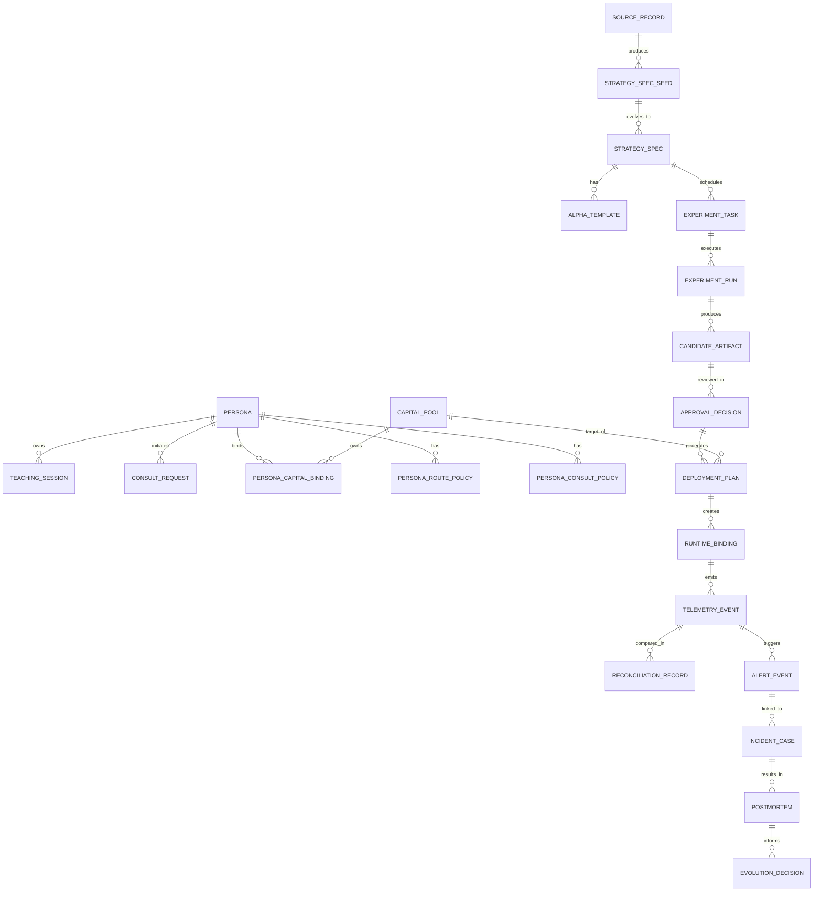

# Pantheon 資料表 / Schema 設計版
Last updated: 2026-04-09
Status: supporting future-state data/storage design
Tier: L3 Supporting Design & Migration
Scope: future-state relational/object/vector/timeseries schema design derived from the broader Pantheon blueprint
Conflict rule: this document informs backlog and future migrations, but current canonical data semantics are owned by the L1 policy set and concrete service contracts

> 文件類型：資料模型設計文件
> 語言：繁體中文
> 格式：Markdown（含 Mermaid）
> 版本：v1
> 依據：Pantheon 總索引版系統分析文件延伸設計

---

## 0. 文件目的與範圍

本文件將 Pantheon 的四包系統分析往下壓成 **資料表 / schema 設計版**。
它回答三個問題：

1. 哪些資料應進關聯式資料庫  
2. 哪些資料應進物件儲存 / 向量索引 / 時序儲存  
3. 各 plane 的核心 table、主鍵、外鍵、索引、狀態欄位與 lineage 欄位如何設計

本文件不提供完整 migration SQL，但提供足夠詳細的 table spec，可直接轉成：
- PostgreSQL DDL
- object storage path convention
- vector collection schema
- telemetry event schema

---

## 1. 儲存層總體設計

Pantheon 不應把所有資料硬塞進單一資料庫。建議採 **四層儲存結構**：

1. **PostgreSQL（關聯式核心）**  
   存：registry、persona、binding、approval、deploy、incident、evolution、audit metadata。
2. **Object Store（S3 / MinIO）**  
   存：model bundle、signal snapshot、allocation artifact、evidence files、reports。
3. **Vector Index（pgvector / Faiss / 專門 vector store）**  
   存：research notes、insight、memo embeddings、semantic retrieval index。
4. **Telemetry / Time-Series Store**  
   存：high-volume events、metrics、heartbeats、runtime series。可先用 Postgres partition / ClickHouse / TSDB 視流量決定。

這份 schema 先以 **PostgreSQL 為主體**，並對 object/vector/time-series 指定對應 metadata 表與 path/ID 規範。

---

## 2. PostgreSQL Schema Namespace 規劃

建議在同一個 Postgres cluster 內，用多個 schema 分域：

- `iam`：auth / actor / RBAC
- `persona`：persona、policy、teaching、consultation
- `source`：ingestion 與來源素材
- `registry`：strategy / alpha / experiment / artifact / insight / evidence
- `governance`：review / approval / promotion / rollback
- `capital`：capital pool / risk policy / broker account / binding
- `runtime`：runtime inventory / binding / loader report
- `telemetry`：event metadata / heartbeat / reconciliation / drift / alert / incident / postmortem
- `evolution`：evolution decision / action plan
- `audit`：cross-cutting action log / request log

---

## 3. 全系統 ER 總圖



---

## 4. 共同欄位規範

所有核心表建議帶以下欄位：

### 4.1 主鍵格式
- 文字型 ID：`<prefix>_<ulid>` 或 `uuid`
- 建議前綴：
  - `p_` persona
  - `src_` source
  - `strat_` strategy
  - `run_` experiment run
  - `art_` artifact
  - `dec_` approval decision
  - `plan_` deployment plan
  - `rt_` runtime
  - `evt_` telemetry event
  - `inc_` incident
  - `pm_` postmortem
  - `evo_` evolution decision

### 4.2 標準審計欄位
- `created_at timestamptz not null`
- `created_by text null`
- `updated_at timestamptz not null`
- `updated_by text null`
- `version int not null default 1`
- `is_deleted boolean not null default false`

### 4.3 Trace / lineage 欄位
依表的重要性選擇性帶：
- `request_id text`
- `trace_id text`
- `correlation_id text`
- `source_run_id text`
- `parent_id text`

---

## 5. IAM Schema

## 5.1 `iam.actors`

| 欄位 | 型別 | 說明 |
|---|---|---|
| actor_id | text pk | 使用者、系統、persona agent 的統一主鍵 |
| actor_type | text | user / system / persona_agent / service |
| display_name | text | 顯示名稱 |
| status | text | active / disabled |
| created_at | timestamptz | 建立時間 |

索引：
- `idx_actors_type_status (actor_type, status)`

## 5.2 `iam.roles`

| 欄位 | 型別 | 說明 |
|---|---|---|
| role_id | text pk | 角色 id |
| name | text unique | researcher / trainer / reviewer / operator_admin ... |
| description | text | 描述 |

## 5.3 `iam.actor_roles`

| 欄位 | 型別 | 說明 |
|---|---|---|
| actor_id | text fk -> iam.actors | actor |
| role_id | text fk -> iam.roles | role |
| granted_at | timestamptz | 授權時間 |
| granted_by | text | 授權者 |

PK：`(actor_id, role_id)`

---

## 6. Persona Schema

## 6.1 `persona.personas`

| 欄位 | 型別 | 說明 |
|---|---|---|
| persona_id | text pk | 人格 ID |
| name | text unique | 人格名稱 |
| mandate | text | 任務授權 / 投資使命 |
| strategy_family | text | trend / stat_arb / event_driven ... |
| workspace_ref | text | 對應 workspace reference |
| lifecycle_state | text | draft / research_only / consultable / paper_owner / live_owner / frozen / retired |
| owner_actor_id | text fk -> iam.actors | 擁有者 |
| status | text | active / archived |
| created_at | timestamptz | 建立時間 |
| updated_at | timestamptz | 更新時間 |

索引：
- `idx_personas_lifecycle_state`
- `idx_personas_strategy_family`
- `idx_personas_owner`

## 6.2 `persona.route_policies`

| 欄位 | 型別 | 說明 |
|---|---|---|
| route_policy_id | text pk | 路由政策 |
| persona_id | text fk -> persona.personas | 對應 persona |
| publish_scope | text | none / private / desk / shared |
| environment_scope | text | research / paper / canary / live |
| restrictions_json | jsonb | 限制規則 |
| version | int | 版本 |
| effective_from | timestamptz | 生效時間 |
| effective_to | timestamptz | 失效時間 |

## 6.3 `persona.route_policy_tools`

| 欄位 | 型別 | 說明 |
|---|---|---|
| route_policy_id | text fk | route policy |
| tool_name | text | 工具名稱 |
| mode | text | allow / deny |
|
PK：`(route_policy_id, tool_name)`

## 6.4 `persona.route_policy_workflows`

| 欄位 | 型別 | 說明 |
|---|---|---|
| route_policy_id | text fk | route policy |
| workflow_name | text | workflow template 名稱 |
| mode | text | allow / deny |

PK：`(route_policy_id, workflow_name)`

## 6.5 `persona.consult_policies`

| 欄位 | 型別 | 說明 |
|---|---|---|
| consult_policy_id | text pk | consult policy |
| persona_id | text fk | 對應 persona |
| trigger_rules_json | jsonb | 觸發規則 |
| forbidden_solo_actions_json | jsonb | 禁止單獨行動規則 |
| version | int | 版本 |

## 6.6 `persona.capability_snapshots`

| 欄位 | 型別 | 說明 |
|---|---|---|
| snapshot_id | text pk | snapshot |
| persona_id | text fk | persona |
| effective_tools_json | jsonb | 最終可用 tool set |
| effective_skills_json | jsonb | 最終 skill set |
| effective_workflows_json | jsonb | 最終 workflow set |
| resolved_at | timestamptz | 解析時間 |
| trace_id | text | trace |

## 6.7 `persona.teaching_sessions`

| 欄位 | 型別 | 說明 |
|---|---|---|
| session_id | text pk | 教學 session |
| persona_id | text fk | persona |
| opened_by | text fk -> iam.actors | 開啟者 |
| mode | text | preview / training |
| status | text | open / preview_ready / committed / discarded / closed |
| current_control_state_json | jsonb | 當前控制狀態快照 |
| started_at | timestamptz | 開始時間 |
| ended_at | timestamptz | 結束時間 |

索引：
- `idx_teaching_sessions_persona_status`
- `idx_teaching_sessions_opened_by`

## 6.8 `persona.teaching_events`

| 欄位 | 型別 | 說明 |
|---|---|---|
| event_id | text pk | event |
| session_id | text fk -> persona.teaching_sessions | session |
| event_seq | bigint | 事件序號 |
| event_type | text | message / patch / preview / commit / discard |
| actor_type | text | human / agent / system |
| actor_ref | text | actor id |
| payload_json | jsonb | 原始內容 |
| created_at | timestamptz | 事件時間 |
| request_id | text | request id |
| trace_id | text | trace id |

唯一索引：
- `uq_teaching_events_session_seq (session_id, event_seq)`

## 6.9 `persona.consult_requests`

| 欄位 | 型別 | 說明 |
|---|---|---|
| request_id | text pk | consult request |
| from_persona_id | text fk -> persona.personas | 發起人格 |
| target_type | text | persona / committee / red_team |
| target_ref | text | 目標 ref |
| task | text | 問題敘述 |
| context_refs_json | jsonb | 相關 context |
| priority | text | low / normal / high / critical |
| status | text | created / running / completed / canceled |
| created_at | timestamptz | 建立時間 |
| completed_at | timestamptz | 完成時間 |

## 6.10 `persona.consult_memos`

| 欄位 | 型別 | 說明 |
|---|---|---|
| memo_id | text pk | memo |
| request_id | text fk -> persona.consult_requests | consult request |
| memo_type | text | reply / committee_summary / red_team_findings |
| author_ref | text | 作者 |
| summary | text | 摘要 |
| recommendations_json | jsonb | 建議列表 |
| evidence_refs_json | jsonb | 證據 |
| status | text | draft / published |
| created_at | timestamptz | 建立時間 |

---

## 7. Source Schema

## 7.1 `source.source_records`

| 欄位 | 型別 | 說明 |
|---|---|---|
| source_id | text pk | source |
| source_type | text | paper / repo / internal |
| source_uri | text | 原始來源 URI |
| title | text | 標題 |
| authors_or_owner | text | 作者或 repo owner |
| trust_score | numeric(5,4) | 0~1 |
| ingest_status | text | discovered / fetched / normalized / failed |
| discovered_at | timestamptz | 發現時間 |
| normalized_at | timestamptz | 正規化時間 |
| tags_json | jsonb | tags |

索引：
- `idx_source_type_status`
- `idx_source_discovered_at`

## 7.2 `source.source_evidence_refs`

| 欄位 | 型別 | 說明 |
|---|---|---|
| source_id | text fk | source |
| evidence_id | text | evidence |

PK：`(source_id, evidence_id)`

## 7.3 `source.strategy_spec_seeds`

| 欄位 | 型別 | 說明 |
|---|---|---|
| seed_id | text pk | seed |
| source_id | text fk -> source.source_records | source |
| hypothesis | text | 假說 |
| asset_class | text | 資產類別 |
| holding_period | text | 持有期 |
| required_data_json | jsonb | 需要資料 |
| backend_hint | text | qlib / statsmodels / quantlib / rl_lab ... |
| feature_hints_json | jsonb | feature hints |
| label_hints_json | jsonb | label hints |
| code_refs_json | jsonb | code refs |
| status | text | created / promoted_to_strategy / discarded |
| created_at | timestamptz | 建立時間 |

---

## 8. Registry Schema

## 8.1 `registry.strategy_specs`

| 欄位 | 型別 | 說明 |
|---|---|---|
| strategy_id | text pk | strategy |
| seed_id | text fk -> source.strategy_spec_seeds | seed |
| name | text | 策略名稱 |
| strategy_family | text | 策略家族 |
| hypothesis | text | 假說 |
| asset_class | text | 資產類別 |
| holding_period | text | 持有期 |
| backend | text | qlib / vectorbt / statsmodels / quantlib / rl |
| feature_spec_json | jsonb | feature spec |
| label_spec_json | jsonb | label spec |
| required_data_json | jsonb | required data |
| cost_assumptions_json | jsonb | 成本假設 |
| risk_constraints_json | jsonb | 風險限制 |
| replication_status | text | none / prototype / replicated |
| current_state | text | discovered / scaffolded / replicated / approved_template / retired |
| created_at | timestamptz | 建立時間 |
| updated_at | timestamptz | 更新時間 |

索引：
- `idx_strategy_family_state`
- `idx_strategy_backend`
- GIN on `feature_spec_json`

## 8.2 `registry.alpha_templates`

| 欄位 | 型別 | 說明 |
|---|---|---|
| alpha_id | text pk | alpha |
| strategy_id | text fk -> registry.strategy_specs | strategy |
| alpha_family | text | 因子類別 |
| applicable_regimes_json | jsonb | 可用 regime |
| approved_template | boolean | 是否為核准模板 |
| search_tags_json | jsonb | 搜尋 tags |
| status | text | active / frozen / retired |
| created_at | timestamptz | 建立時間 |

## 8.3 `registry.experiment_tasks`

| 欄位 | 型別 | 說明 |
|---|---|---|
| task_id | text pk | task |
| strategy_id | text fk -> registry.strategy_specs | strategy |
| backend | text | backend |
| dataset_version | text | dataset version |
| code_version | text | code version |
| task_config_json | jsonb | config |
| priority | text | priority |
| status | text | queued / running / completed / failed |
| created_at | timestamptz | 建立時間 |

## 8.4 `registry.experiment_runs`

| 欄位 | 型別 | 說明 |
|---|---|---|
| run_id | text pk | run |
| task_id | text fk -> registry.experiment_tasks | task |
| strategy_id | text fk -> registry.strategy_specs | strategy |
| backend | text | backend |
| params_json | jsonb | params |
| metrics_json | jsonb | metrics |
| lineage_json | jsonb | lineage |
| status | text | running / completed / failed / superseded |
| started_at | timestamptz | 開始 |
| finished_at | timestamptz | 結束 |

索引：
- `idx_experiment_runs_strategy_backend`
- `idx_experiment_runs_status_finished`

## 8.5 `registry.artifacts`

| 欄位 | 型別 | 說明 |
|---|---|---|
| artifact_id | text pk | artifact |
| artifact_type | text | signal_snapshot / model_bundle / allocation_policy / pricing_model / candidate_bundle |
| strategy_id | text fk -> registry.strategy_specs | strategy |
| run_id | text fk -> registry.experiment_runs | run |
| version | text | 版本 |
| storage_ref | text | object store ref |
| schema_version | text | artifact schema |
| registry_status | text | draft / candidate / approved_template / deploy_candidate / archived |
| producer_backend | text | producer |
| created_at | timestamptz | 建立時間 |

索引：
- `idx_artifact_type_status`
- `idx_artifact_strategy_version`

## 8.6 `registry.artifact_pool_eligibility`

| 欄位 | 型別 | 說明 |
|---|---|---|
| artifact_id | text fk -> registry.artifacts | artifact |
| capital_pool_id | text | eligible pool |
| eligibility_status | text | allowed / denied / conditional |
| notes | text | 說明 |

PK：`(artifact_id, capital_pool_id)`

## 8.7 `registry.insight_cards`

| 欄位 | 型別 | 說明 |
|---|---|---|
| insight_id | text pk | insight |
| source_ref | text | source / run / incident ref |
| scope | text | desk / persona / shared |
| summary | text | 摘要 |
| confidence | numeric(5,4) | 信心 |
| evidence_refs_json | jsonb | 證據 |
| created_by | text | actor |
| created_at | timestamptz | 建立時間 |

## 8.8 `registry.evidence_bundles`

| 欄位 | 型別 | 說明 |
|---|---|---|
| evidence_id | text pk | evidence |
| evidence_type | text | source_excerpt / chart / run_metric / file_ref |
| storage_ref | text | object ref |
| metadata_json | jsonb | metadata |
| created_at | timestamptz | 建立時間 |

## 8.9 `registry.mlflow_lineage_refs`

| 欄位 | 型別 | 說明 |
|---|---|---|
| lineage_ref_id | text pk | lineage ref |
| run_id | text | MLflow run id |
| model_name | text | model name |
| model_version | text | version |
| aliases_json | jsonb | aliases |
| tags_json | jsonb | tags |
| linked_artifact_id | text | artifact |

---

## 9. Governance Schema

## 9.1 `governance.review_submissions`

| 欄位 | 型別 | 說明 |
|---|---|---|
| submission_id | text pk | submission |
| target_type | text | artifact / strategy / allocation |
| target_id | text | target |
| requested_mode | text | approved / paper / canary / live |
| submitted_by | text | actor |
| context_refs_json | jsonb | context |
| status | text | submitted / validating / in_review / decided |
| created_at | timestamptz | 建立時間 |

## 9.2 `governance.validation_reports`

| 欄位 | 型別 | 說明 |
|---|---|---|
| report_id | text pk | report |
| submission_id | text fk -> governance.review_submissions | submission |
| validation_type | text | schema / lineage / pool_compat / runtime_compat |
| status | text | passed / failed |
| blocking_reasons_json | jsonb | fail reasons |
| created_at | timestamptz | 建立時間 |

## 9.3 `governance.approval_decisions`

| 欄位 | 型別 | 說明 |
|---|---|---|
| decision_id | text pk | decision |
| submission_id | text fk -> governance.review_submissions | submission |
| target_type | text | target type |
| target_id | text | target |
| decision | text | approved / rejected / conditional |
| approver | text fk -> iam.actors | approver |
| risk_note | text | 風險註記 |
| committee_refs_json | jsonb | committee refs |
| rollback_target | text | rollback artifact |
| effective_scope_json | jsonb | pool scope |
| created_at | timestamptz | 建立時間 |

## 9.4 `governance.deployment_plans`

| 欄位 | 型別 | 說明 |
|---|---|---|
| plan_id | text pk | plan |
| decision_id | text fk -> governance.approval_decisions | decision |
| artifact_id | text fk -> registry.artifacts | artifact |
| capital_pool_id | text fk -> capital.capital_pools | pool |
| target_mode | text | paper / canary / live |
| runtime_action | text | deploy_new_binding / replace_binding / restart |
| runtime_config_ref | text | config ref |
| rollback_target | text | rollback target |
| schedule_window_start | timestamptz | 開始 |
| schedule_window_end | timestamptz | 結束 |
| status | text | pending / approved / executed / canceled |
| created_at | timestamptz | 建立時間 |

索引：
- `idx_deployment_plans_pool_mode_status`

## 9.5 `governance.rollback_actions`

| 欄位 | 型別 | 說明 |
|---|---|---|
| rollback_id | text pk | rollback |
| capital_pool_id | text fk | pool |
| runtime_id | text | runtime |
| from_artifact_id | text | current artifact |
| to_artifact_id | text | target artifact |
| action_type | text | replace / pause_then_replace / liquidate_then_replace |
| trigger_reason | text | 觸發原因 |
| approved_by | text | approver |
| executed_at | timestamptz | 執行時間 |
| status | text | planned / executed / failed |

---

## 10. Capital Schema

## 10.1 `capital.capital_pools`

| 欄位 | 型別 | 說明 |
|---|---|---|
| capital_pool_id | text pk | pool |
| name | text | pool name |
| desk | text | 所屬 desk |
| base_currency | text | base cc y |
| status | text | provisioned / paper_bound / canary_bound / live_bound / risk_off / paused / liquidating / archived |
| allowed_asset_classes_json | jsonb | 可交易資產 |
| allowed_strategy_families_json | jsonb | 可用策略家族 |
| risk_policy_id | text fk -> capital.risk_policies | risk policy |
| broker_account_ref | text fk -> capital.broker_accounts | broker account |
| runtime_group | text | runtime group |
| created_at | timestamptz | 建立時間 |

## 10.2 `capital.risk_policies`

| 欄位 | 型別 | 說明 |
|---|---|---|
| risk_policy_id | text pk | risk policy |
| gross_limit | numeric | gross exposure |
| net_limit | numeric | net exposure |
| max_single_name_weight | numeric | 單標的上限 |
| max_sector_exposure | numeric | sector 上限 |
| max_factor_exposure | numeric | factor 上限 |
| max_leverage | numeric | leverage |
| turnover_limit | numeric | turnover |
| liquidity_constraints_json | jsonb | 流動性限制 |
| drawdown_actions_json | jsonb | drawdown actions |
| pause_rules_json | jsonb | pause 規則 |
| liquidation_rules_json | jsonb | liquidate 規則 |
| created_at | timestamptz | 建立時間 |

## 10.3 `capital.broker_accounts`

| 欄位 | 型別 | 說明 |
|---|---|---|
| broker_account_ref | text pk | broker ref |
| broker_name | text | broker name |
| environment | text | paper / live |
| supported_asset_classes_json | jsonb | 支援資產 |
| order_capabilities_json | jsonb | 支援指令 |
| credential_ref | text | secret ref |
| status | text | active / disabled |
| created_at | timestamptz | 建立時間 |

## 10.4 `capital.persona_capital_bindings`

| 欄位 | 型別 | 說明 |
|---|---|---|
| binding_id | text pk | binding |
| persona_id | text fk -> persona.personas | persona |
| capital_pool_id | text fk -> capital.capital_pools | pool |
| role | text | advisor / paper_owner / live_owner |
| allowed_deployment_scope | text | none / paper / canary / live |
| mandate | text | 綁定 mandate |
| budget | numeric | 預算 |
| effective_from | timestamptz | 生效 |
| effective_to | timestamptz | 失效 |
| status | text | active / inactive |

索引：
- `idx_binding_persona_pool`
- `idx_binding_role_status`

---

## 11. Runtime Schema

## 11.1 `runtime.runtimes`

| 欄位 | 型別 | 說明 |
|---|---|---|
| runtime_id | text pk | runtime |
| capital_pool_id | text fk -> capital.capital_pools | pool |
| mode | text | paper / canary / live |
| runtime_type | text | lean |
| state | text | created / loading / active / degraded / paused / replacing / terminated |
| host_ref | text | infra host ref |
| created_at | timestamptz | 建立時間 |

## 11.2 `runtime.runtime_bindings`

| 欄位 | 型別 | 說明 |
|---|---|---|
| binding_id | text pk | runtime binding |
| runtime_id | text fk -> runtime.runtimes | runtime |
| capital_pool_id | text fk -> capital.capital_pools | pool |
| artifact_id | text fk -> registry.artifacts | artifact |
| deployment_mode | text | paper / canary / live |
| version | text | binding version |
| effective_at | timestamptz | 生效時間 |
| status | text | pending / active / superseded / failed |
| rollback_parent | text | previous binding |

索引：
- `idx_runtime_binding_runtime_status`
- `idx_runtime_binding_pool_mode`

## 11.3 `runtime.loader_reports`

| 欄位 | 型別 | 說明 |
|---|---|---|
| report_id | text pk | report |
| plan_id | text fk -> governance.deployment_plans | deployment plan |
| artifact_id | text fk -> registry.artifacts | artifact |
| runtime_id | text fk -> runtime.runtimes | runtime |
| schema_check | text | passed / failed |
| compatibility_check | text | passed / failed |
| pool_policy_check | text | passed / failed |
| broker_capability_check | text | passed / failed |
| blocking_reasons_json | jsonb | fail reasons |
| created_at | timestamptz | 建立時間 |

## 11.4 `runtime.runtime_actions`

| 欄位 | 型別 | 說明 |
|---|---|---|
| action_id | text pk | action |
| runtime_id | text fk -> runtime.runtimes | runtime |
| action_type | text | deploy / replace / pause / liquidate / restart |
| requested_by | text | actor |
| request_id | text | request |
| trace_id | text | trace |
| payload_json | jsonb | payload |
| status | text | requested / executing / completed / failed |
| created_at | timestamptz | 建立時間 |
| completed_at | timestamptz | 完成時間 |

---

## 12. Telemetry Schema

> 這一層若事件量很大，可拆到專用時序/列式儲存。以下先定 canonical schema 與最低 relational metadata。

## 12.1 `telemetry.events_raw`

| 欄位 | 型別 | 說明 |
|---|---|---|
| event_id | text pk | event |
| source_service | text | producer |
| raw_payload | jsonb | 原始內容 |
| ingest_time | timestamptz | ingest 時間 |
| dedup_key | text | dedup |

索引：
- `idx_events_raw_ingest_time`
- `uq_events_raw_dedup_key`

## 12.2 `telemetry.events_canonical`

| 欄位 | 型別 | 說明 |
|---|---|---|
| event_id | text pk | event |
| event_type | text | event type |
| event_time | timestamptz | 事件時間 |
| ingest_time | timestamptz | ingest 時間 |
| environment | text | env |
| capital_pool_id | text | pool |
| runtime_id | text | runtime |
| artifact_id | text | artifact |
| persona_id | text | persona |
| strategy_id | text | strategy |
| trace_id | text | trace |
| correlation_id | text | corr |
| payload_json | jsonb | payload |

索引：
- `idx_events_canonical_type_time`
- `idx_events_canonical_pool_runtime_time`
- `idx_events_canonical_trace_id`

## 12.3 `telemetry.runtime_heartbeats`

| 欄位 | 型別 | 說明 |
|---|---|---|
| heartbeat_id | text pk | heartbeat |
| runtime_id | text fk -> runtime.runtimes | runtime |
| capital_pool_id | text | pool |
| mode | text | mode |
| artifact_id | text | artifact |
| heartbeat_time | timestamptz | hb time |
| health_summary | text | 健康摘要 |
| connectivity_status | text | broker connectivity |
| latency_summary_json | jsonb | latency |

## 12.4 `telemetry.metric_series`

| 欄位 | 型別 | 說明 |
|---|---|---|
| metric_id | bigserial pk | row |
| scope_type | text | runtime / pool / artifact |
| scope_ref | text | ref |
| metric_name | text | metric |
| metric_time | timestamptz | time |
| metric_value | numeric | value |
| tags_json | jsonb | tags |

索引：
- `idx_metric_series_scope_name_time`

## 12.5 `telemetry.reconciliation_records`

| 欄位 | 型別 | 說明 |
|---|---|---|
| record_id | text pk | record |
| recon_type | text | backtest_live / order_fill / position_broker |
| scope_ref | text | ref |
| expected_ref | text | expected |
| actual_ref | text | actual |
| delta_summary_json | jsonb | delta |
| severity | text | severity |
| status | text | open / resolved |
| generated_at | timestamptz | 生成時間 |

## 12.6 `telemetry.drift_reports`

| 欄位 | 型別 | 說明 |
|---|---|---|
| report_id | text pk | report |
| drift_type | text | feature / label / policy / execution |
| scope_ref | text | ref |
| baseline_ref | text | baseline |
| current_ref | text | current |
| severity | text | severity |
| metrics_json | jsonb | metrics |
| evidence_refs_json | jsonb | evidence |
| recommended_action | text | 建議動作 |
| generated_at | timestamptz | 生成時間 |

## 12.7 `telemetry.alert_events`

| 欄位 | 型別 | 說明 |
|---|---|---|
| alert_id | text pk | alert |
| rule_id | text | rule |
| scope_ref | text | ref |
| severity | text | severity |
| status | text | open / ack / closed |
| opened_at | timestamptz | open |
| closed_at | timestamptz | close |
| linked_incident_id | text | incident |

## 12.8 `telemetry.incident_cases`

| 欄位 | 型別 | 說明 |
|---|---|---|
| incident_id | text pk | incident |
| category | text | data / model / strategy / optimizer / execution / broker / human |
| severity | text | severity |
| status | text | new / triaged / active / mitigated / postmortem_pending / closed |
| owner | text | owner actor |
| opened_at | timestamptz | 開啟時間 |
| closed_at | timestamptz | 關閉時間 |
| scope_refs_json | jsonb | scope refs |
| related_alerts_json | jsonb | related alerts |
| related_runtime_bindings_json | jsonb | bindings |

## 12.9 `telemetry.postmortems`

| 欄位 | 型別 | 說明 |
|---|---|---|
| postmortem_id | text pk | pm |
| incident_id | text fk -> telemetry.incident_cases | incident |
| impact_summary | text | 影響摘要 |
| timeline_json | jsonb | 時間線 |
| root_cause | text | root cause |
| contributing_factors_json | jsonb | factors |
| corrective_actions_json | jsonb | actions |
| evidence_refs_json | jsonb | evidence |
| status | text | draft / review / published / archived |
| created_at | timestamptz | 建立 |
| published_at | timestamptz | 發布 |

---

## 13. Evolution Schema

## 13.1 `evolution.decisions`

| 欄位 | 型別 | 說明 |
|---|---|---|
| decision_id | text pk | decision |
| target_type | text | strategy / alpha / persona / pool |
| target_id | text | target |
| decision_type | text | retain / retrain / revalidate / mutate / split / merge / freeze / retire / revive |
| reason | text | 原因 |
| evidence_refs_json | jsonb | 證據 |
| linked_postmortem_id | text | postmortem |
| status | text | proposed / reviewed / approved / executed / superseded |
| effective_scope_json | jsonb | scope |
| created_at | timestamptz | 建立 |
| executed_at | timestamptz | 執行 |

## 13.2 `evolution.action_plans`

| 欄位 | 型別 | 說明 |
|---|---|---|
| action_plan_id | text pk | plan |
| decision_id | text fk -> evolution.decisions | decision |
| action_type | text | retrain_job / freeze_strategy / split_persona / rollback_runtime ... |
| target_service | text | 下游服務 |
| payload_json | jsonb | 命令 payload |
| status | text | pending / executed / failed |
| created_at | timestamptz | 建立 |
| completed_at | timestamptz | 完成 |

---

## 14. Audit Schema

## 14.1 `audit.actions`

| 欄位 | 型別 | 說明 |
|---|---|---|
| action_id | text pk | action |
| actor_type | text | human / agent / system / service |
| actor_ref | text | actor |
| action_type | text | create / update / approve / deploy / rollback / pause ... |
| target_type | text | target type |
| target_ref | text | target |
| reason | text | 原因 |
| request_id | text | request |
| trace_id | text | trace |
| correlation_id | text | corr |
| before_ref | text | before snapshot |
| after_ref | text | after snapshot |
| created_at | timestamptz | 時間 |

索引：
- `idx_audit_actions_actor_time`
- `idx_audit_actions_target_time`
- `idx_audit_actions_trace`

## 14.2 `audit.request_log`

| 欄位 | 型別 | 說明 |
|---|---|---|
| request_id | text pk | request |
| service_name | text | service |
| actor_ref | text | actor |
| endpoint | text | endpoint |
| method | text | method |
| status_code | int | code |
| duration_ms | int | duration |
| trace_id | text | trace |
| created_at | timestamptz | 時間 |

---

## 15. Object Store Schema（邏輯規範）

Object store 不用 table 存全部內容，但要有 path convention。

建議 bucket / prefix：

- `pantheon-artifacts/models/{strategy_id}/{artifact_id}/...`
- `pantheon-artifacts/signals/{strategy_id}/{artifact_id}/...`
- `pantheon-artifacts/allocations/{strategy_id}/{artifact_id}/...`
- `pantheon-evidence/{evidence_id}/...`
- `pantheon-reports/postmortems/{postmortem_id}.json`
- `pantheon-datasets/training/{dataset_id}/...`

對應 metadata 仍回寫到 Postgres：
- `registry.artifacts`
- `registry.evidence_bundles`
- `telemetry.postmortems`
- `policy-learning dataset refs`

---

## 16. Vector Index Schema（邏輯規範）

向量索引建議至少分 4 類 collection：

1. `insight_cards`
2. `consult_memos`
3. `research_notes`
4. `postmortem_summaries`

每筆向量 metadata 至少含：
- `doc_id`
- `doc_type`
- `source_ref`
- `persona_id`（可空）
- `strategy_id`（可空）
- `scope`
- `created_at`
- `embedding_version`

主內容仍由 Postgres truth table 或 object store 保存，vector store 只做 retrieval index。

---

## 17. 關鍵索引與約束策略

### 17.1 唯一性約束
- `persona.name`
- `source.source_records.source_uri`（對特定 source_type 可唯一）
- `(session_id, event_seq)` for teaching events
- `telemetry.events_raw.dedup_key`
- `runtime.runtimes(capital_pool_id, mode)` 視部署模式可唯一

### 17.2 GIN / JSONB 索引
建議對以下欄位加 GIN：
- `feature_spec_json`
- `required_data_json`
- `risk_constraints_json`
- `context_refs_json`
- `effective_scope_json`
- `tags_json`

### 17.3 時間分區建議
高量表建議 partition：
- `telemetry.events_raw`
- `telemetry.events_canonical`
- `telemetry.metric_series`
- `audit.request_log`

按月或按週分區。

---

## 18. 狀態欄位總表

### 18.1 Persona State
`draft / research_only / consultable / paper_owner / live_owner / frozen / retired`

### 18.2 Strategy State
`discovered / scaffolded / replicated / approved_template / retired`

### 18.3 Artifact State
`draft / candidate / approved_template / deploy_candidate / archived`

### 18.4 Pool State
`provisioned / paper_bound / canary_bound / live_bound / risk_off / paused / liquidating / archived`

### 18.5 Runtime State
`created / loading / active / degraded / paused / replacing / terminated`

### 18.6 Incident State
`new / triaged / active / mitigated / postmortem_pending / closed`

### 18.7 Evolution State
`proposed / reviewed / approved / executed / superseded`

---

## 19. 端到端 lineage 鍵路徑

Pantheon 至少要能沿下面這條鏈追溯：

```text
SourceRecord
 -> StrategySpecSeed
 -> StrategySpec
 -> ExperimentTask
 -> ExperimentRun
 -> CandidateArtifact / AllocationPolicyArtifact
 -> ApprovalDecision
 -> DeploymentPlan
 -> RuntimeBinding
 -> TelemetryEvent / DriftReport / IncidentCase / Postmortem
 -> EvolutionDecision
```

這條鏈應該透過：
- foreign keys
- `lineage_json`
- `trace_id / correlation_id`
- MLflow lineage refs

共同構成。

---

## 20. Schema 與服務的對應表

| Schema | 主要服務 | 主要責任 |
|---|---|---|
| iam | pantheon-bff | actor / role / session context |
| persona | persona-control-svc / training-session-svc / consultation-svc | persona / trainer / consult |
| source | source-ingest-svc | paper / repo / internal ingest |
| registry | registry-core-svc / research-orchestrator-svc / optimizer-svc | strategy / alpha / experiment / artifact / insight |
| governance | promotion-review-svc | review / approval / plan / rollback |
| capital | promotion-review-svc / runtime-manager-svc | pool / broker / risk / bindings |
| runtime | runtime-manager-svc / artifact-loader | runtime inventory / binding / actions |
| telemetry | telemetry-ingest-svc / reconciliation-drift-svc / incident-postmortem-svc | events / drift / incidents / postmortems |
| evolution | evolution-svc | evolution decisions |
| audit | all write-capable services | action / request audit |

---

## 21. migration 優先順序建議

### 第 1 波
- `iam.*`
- `persona.personas`
- `persona.route_policies`
- `persona.consult_policies`
- `persona.teaching_sessions`
- `persona.teaching_events`
- `persona.consult_requests`
- `persona.consult_memos`

### 第 2 波
- `source.*`
- `registry.strategy_specs`
- `registry.experiment_tasks`
- `registry.experiment_runs`
- `registry.artifacts`
- `registry.insight_cards`
- `registry.evidence_bundles`

### 第 3 波
- `capital.*`
- `governance.*`
- `runtime.*`

### 第 4 波
- `telemetry.*`
- `evolution.*`
- `audit.*`

---

## 22. 文件結語

本文件把 Pantheon 的四包分析進一步落成資料模型設計。  
接下來若要繼續往下壓，最自然的下一步是：

1. 為每個 PostgreSQL schema 產生 migration 草稿  
2. 為 object store 定義 artifact schema 與 path naming 規範  
3. 為 telemetry event 與 audit event 產生 JSON Schema  
4. 將本文件與 API / service contract 設計版逐欄位對齊
