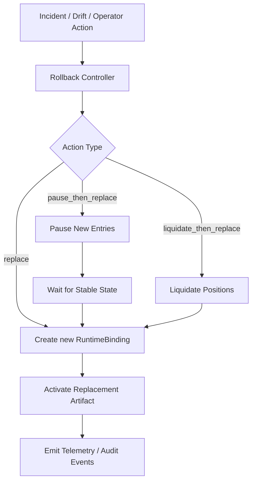

# ROLLBACK_AND_POSITION_SEMANTICS.md

Last updated: 2026-04-11
Status: canonical rollback and position-handling policy
Tier: L1 Platform Architecture & Policy
Scope: rollback action types, position treatment, telemetry cutover, and lineage expectations during mitigation
Conflict rule: this document overrides broader rollback wording in architecture/planning docs; deployment-stage policy still controls when rollback is allowed or required

## 1. 文件目的

本文件定義 Pantheon 的 rollback 行為，特別是：

- rollback 的類型
- 什麼情況用哪一種 rollback
- rollback 時 open positions 怎麼處理
- rollback 後 telemetry、binding、artifact lineage 怎麼記錄

> 核心決議：rollback 不是單一動作，而是正式分成三種策略：  
> `replace`、`pause_then_replace`、`liquidate_then_replace`

---

## 2. Rollback 的定位

rollback 屬於 **operational mitigation**，目的是：
- 對正在運行的 deployment 立即止血
- 把 runtime 切到較安全的 artifact / baseline
- 不中斷 lineage 與 audit

rollback 不等於：
- freeze
- retire
- revalidate
- retrain

那些屬於 governance / evolution 層動作。

---

## 3. 三種 rollback 策略

### 3.1 `replace`

**適用情況**
- 新舊 artifact 行為相近
- 問題是退化或配置修正
- 不需要先清空持倉
- 可讓下一個 rebalance/recontrol 週期平滑接手

**行為**
- 不強制平倉
- 不先 pause 新單
- Runtime Manager 依 `DeploymentPlan` 建立新的 replacement `RuntimeBinding`
- 舊 binding 只在 cutover 完成後轉成 `retired`，不覆寫核心欄位
- 後續由新 artifact / new binding 接管現有 book

### 3.2 `pause_then_replace`

**適用情況**
- 新舊 artifact 差異較大
- 希望先停止新開倉，穩定現有 book
- 風險可控，但直接切換不夠穩妥

**行為**
- 先把目前 binding 轉成 `pending_pause`
- pause 新 entries
- 讓在途 order / partial fills 穩定
- 達到 stable state（至少無新開倉、open orders drained）後把 binding 轉成 `paused`
- Runtime Manager 建立 replacement binding，原 binding 在 cutover 後轉成 `retired`
- 切換後恢復由新 artifact 管理既有 book

### 3.3 `liquidate_then_replace`

**適用情況**
- 嚴重安全事故
- artifact 明顯 bug
- governance breach
- risk breach
- position 不可再留

**行為**
- 先停止新 entries，並在舊 binding 上完成 flatten / liquidate
- 取消 pending orders，並確認 zero position / zero pending order
- 再把 runtime 切到 fallback artifact / previous approved artifact
- Runtime Manager 建立 replacement binding；必要時 replacement 可先停在 guarded / paused mode
- 視需要保留 runtime 進 guarded mode

---

## 4. 誰決定 rollback 策略

### 4.1 預設決策者
**Rollback Controller** 根據 `IncidentCase` / `Postmortem` / approved `EvolutionDecision` / `DeploymentPlan.rollback` 給出預設 `action_type`。

它只負責：

- 解析 incident class、risk policy、與 `DeploymentPlan.rollback.action_type`
- 決定這次 mitigation 應該是 `replace`、`pause_then_replace`、或 `liquidate_then_replace`
- 產生 immutable rollback request，交給 Runtime Manager

它不負責：

- 建立新的 approval chain
- 直接改寫 `RuntimeBinding`
- 決定新的 artifact lifecycle 或 freeze 狀態

### 4.2 強制覆蓋者
- Risk Policy
- Incident Classifier
- Kill Switch / Safe Mode

### 4.3 最終核准者
- 一般情況：沿用觸發它的 parent review / approval chain
  - 若是 incident-driven：依 incident / operator normal path
  - 若是 evolution-driven：依 parent `EvolutionDecision` 的 reviewed / approved owner
- 緊急情況：自動化規則可先執行，事後追認；fast-path 細節由 `EVO-005` / kill-switch policy 補充

---

## 5. Rollback 決策矩陣

| 狀況 | 預設動作 |
|---|---|
| 輕微退化、可平滑修復 | `replace` |
| 風格錯配、需穩定過渡 | `pause_then_replace` |
| 嚴重安全事故 / 錯單 / breach | `liquidate_then_replace` |

---

## 6. Rollback 流程



---

## 7. Position 的正式語意

rollback 最核心的問題是：**position 不是 artifact，而是跨 artifact 可能延續的狀態。**

因此 position 必須至少增加兩個 lineage 欄位：

- `opened_by_artifact_id`
- `current_managed_by_binding_id`

### 意義
- `opened_by_artifact_id`：這筆倉位最初由哪個 artifact 開出
- `current_managed_by_binding_id`：現在由哪個 active runtime binding 管理

### 更新規則
- `opened_by_artifact_id` 永遠不可被 rollback 改寫
- `current_managed_by_binding_id` 只有在 replacement binding 已建立並成為 active owner 後才更新
- `liquidate_then_replace` 在 flatten 完成前，所有 liquidation / cancel telemetry 仍歸在舊 binding / 舊 artifact

---

## 8. RuntimeBinding 與 rollback lineage

### RuntimeBinding 結構補充
```text
binding_id
runtime_id
capital_pool_id
artifact_id
artifact_version
deployment_mode
plan_id
persona_capital_binding_id
effective_at
status
rollback_parent
rollback_action_type
```

### 規則
- rollback 建立的是新的 RuntimeBinding，不是 in-place 改舊 binding 的 `artifact_id`
- 舊 binding 的 core fields 不改寫；Runtime Manager 只可把它收斂到新的 status / retired_at
- 新 binding 透過 `rollback_parent` 指向被替代 binding
- `rollback_action_type` 必須對齊 `DeploymentPlan.rollback.action_type`
- rollback 是新增 binding，不是覆蓋舊 binding 資料

---

## 9. Telemetry 的 artifact_id 記錄規則

### 正式決議

1. **歷史事件永遠保留原 artifact_id**
2. **cutover 之後的新事件使用新 artifact_id**
3. RuntimeBinding 用 `rollback_parent` 串 lineage
4. position 額外帶 `opened_by_artifact_id` 與 `current_managed_by_binding_id`
5. cutover 邊界由 Runtime Manager 建立 replacement binding 並 retire 舊 binding 的時間點決定，而不是任意以 loader load 完成時間決定

### 這樣才能回答
- 事故時是誰開的倉
- 現在誰在管這筆倉
- rollback 後新舊事件如何分界

---

## 10. Rollback 的 operational owner chain

| Step | Source objects | Authoritative writer | 說明 |
|---|---|---|---|
| Need detection | `IncidentCase`, `Postmortem`, approved `EvolutionDecision`, `DeploymentPlan.rollback` | Incident domain / Evolution plane / Governance plane 各自維護自己的物件 | 這些物件只提供 evidence 與 approval chain，不直接改 runtime |
| Rollback planning | incident evidence + `DeploymentPlan.rollback.action_type` + risk policy | `Rollback Controller` | 決定 `replace` / `pause_then_replace` / `liquidate_then_replace`，並建立 rollback request |
| Runtime mitigation | rollback request + fallback artifact metadata | `Runtime Manager` | 唯一可建立 replacement `RuntimeBinding`、切換 position owner、決定 telemetry cutover 的 writer |
| Feedback + audit | rollback request result / runtime outcome | Incident domain、Evolution plane、audit/read models | 只回寫 refs / status / outcome；不得回頭改寫 `RuntimeBinding` 或 position lineage |

### 10.1 Normal-path trigger chain

1. `IncidentCase`、`Postmortem`、或 approved `EvolutionDecision` 判定 active deployment 需要 mitigation。
2. parent approval chain 決定這次 mitigation 在 normal path 是否可提交；`Rollback Controller` 不創造平行 approval。
3. `Rollback Controller` 消費：
   - `IncidentCase.severity`
   - `Postmortem.root_cause` / follow-up recommendation
   - `EvolutionDecision.linked_incident_id` / `linked_postmortem_id`
   - `DeploymentPlan.rollback.action_type`
4. `Rollback Controller` 產生 rollback request，交由 `Runtime Manager` 執行。
5. `Runtime Manager` 依本文件 §3 與 `rollback_action_matrix.md` 完成 mitigation。
6. rollback request ref、runtime outcome、與 post-cutover telemetry 再回寫 incident / postmortem / evolution audit chain。

### 10.2 `executed` 與回寫語意

- 若 rollback 是由 `EvolutionDecision` 的 operational follow-through 觸發，`EvolutionDecision.executed` 的判準是：rollback request 已被 `Rollback Controller` 正式接受並產生 immutable request ref。
- `Runtime Manager` 之後是否成功完成 cutover / flatten，屬 downstream outcome；它會更新 incident / postmortem / audit/read model，但不改變 write-owner 分界。
- 若 rollback 失敗或 mitigation 後問題仍持續，應開新的高風險 evolution / incident follow-up，而不是讓舊 decision 直接 in-place 改下一輪 runtime state。

### 10.3 replace / pause / liquidate 的 owner

| 動作 | Owner | 可否自動 |
|---|---|---|
| `replace` | `Rollback Controller` 發命令，`Runtime Manager` 建立 replacement binding 並完成 cutover | 可以，視 policy |
| `pause_then_replace` | `Rollback Controller` / `Risk Policy` 發命令，`Runtime Manager` 執行 pause 與 replacement | 可以，但需 risk / incident rule |
| `liquidate_then_replace` | `Kill Switch` / `Risk Policy` / `Incident Classifier` 升級 action；`Runtime Manager` 執行 flatten 與 replacement | 可自動，但需高門檻 |

---

## 11. Rollback 與 Freeze 的區分

### rollback
- operational mitigation
- 作用在 active deployment
- 目的：現在先止血

### freeze
- governance quarantine
- 作用在 strategy / artifact / persona 的 future deployability
- 目的：暫停後續使用，待重審

兩者常一起出現，但不是同一件事。

---

## 12. Rollback 與 deployment `frozen` stage 的關係

- `rollback` 處理的是 active deployment 的 mitigation：替換、暫停後替換、或清倉後替換。
- `current_stage -> frozen` 的 `DeploymentPlan` 處理的是 stage quarantine：停止新 entries / 讓 runtime 進 frozen semantics，但不自動決定 replacement artifact。
- 在 `live` incident 中，兩者可同時存在：
  - `freeze` / `frozen` 阻止未來 deployability 與新 entries
  - `rollback` 決定是否切到 fallback artifact，或直接 flatten
- 兩者共享 incident / postmortem evidence，但絕不能被實作成同一個 object。

---

## 13. API 草案

- `POST /api/rollback`
- `GET /api/rollback/history`
- `POST /api/runtimes/{runtime_id}/replace`
- `POST /api/runtimes/{runtime_id}/pause`
- `POST /api/runtimes/{runtime_id}/liquidate`

---

## 14. 後續規格拆解（non-blocking，不影響目前 L1 真相）

以下文件屬於後續操作矩陣與執行細化，不是本文件目前 rollback semantics 生效的前置條件。

- `DEPLOYMENT_POLICY_SPEC.md`
- `KILL_SWITCH_AND_SAFE_MODE.md`
- `RUNTIME_ACTION_MATRIX.md`

---

## 15. 結論

Pantheon 的 rollback 必須具備 position-aware 語意。  
如果只說「回退到前一個 approved artifact」，卻不說明：

- 持倉是否平掉
- 哪種事故用哪種 rollback
- 新舊 artifact 的 telemetry 怎麼切
- binding lineage 怎麼追

那 deployment 與 incident 分析都會失真。

因此本文件正式把 rollback 分成三種策略，並把 position / binding / telemetry 的語意一起定義。
