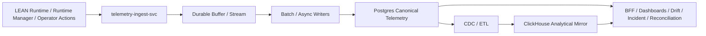

# TELEMETRY_INGEST_AND_STORAGE_ARCHITECTURE

Last updated: 2026-04-09
Status: canonical telemetry ingest and storage architecture policy for Pantheon
Tier: L1 Platform Architecture & Policy
Scope: ingest shock absorption, canonical Postgres storage, ClickHouse analytics mirror, CDC/repair, backpressure, and query responsibility split
Conflict rule: this document refines and overrides high-level storage mentions in LINEAGE_AND_TELEMETRY_STORAGE_DECISIONS.md for the ingest and buffer layer specifically; lineage edge model and read-model aggregation still defer to LINEAGE_AND_TELEMETRY_STORAGE_DECISIONS.md

---

## 1. 目的

本文件定義 Pantheon 在高頻/中高頻與一般策略混合場景下的 telemetry ingest、canonical storage、analytics mirror、CDC/repair 與查詢責任分工。

本決議補足下列工程級問題：

- LEAN runtime 是否可以直接同步高併發寫入 Postgres
- Postgres partitioned tables 在高寫入下的瓶頸如何緩解
- ClickHouse 與 Postgres 雙寫/鏡像時，以誰為真相來源
- 什麼資料不能採樣，什麼資料可以聚合或降採樣
- 什麼元件負責 ingest shock absorption、backpressure 與 replay

---

## 2. 結論摘要

### 2.1 Canonical truth
Pantheon 的 **Telemetry Canonical Store 預設採 Postgres partitioned tables**。

### 2.2 High-volume ingestion path
**LEAN runtime 不得直接高併發同步寫入 canonical Postgres telemetry tables。**

正式路徑為：

### 2.3 Analytical mirror
**ClickHouse 是 analytical mirror，不是 source of truth。**

### 2.4 Disagreement rule
若 Postgres 與 ClickHouse 數據不一致，**以 Postgres 為準**。

### 2.5 Sampling rule
- 訂單 / 成交 / 部位 / deploy / rollback / audit 類事件：**不得採樣**
- 高頻診斷 metrics：**可聚合或降採樣**
- 心跳 / latency / queue depth：**優先聚合寫入**

---

## 3. 寫入架構

## 3.1 ingest 分層

### Layer A：Event Producers
來源包括：
- LEAN paper/canary/live runtimes
- runtime-manager-svc
- artifact-loader
- rollback-controller
- operator / governance actions
- trainer / consultation / approval actions（僅 audit-facing 類型）

### Layer B：telemetry-ingest-svc
職責：
- schema validation
- trace_id / correlation_id 補齊
- event type normalization
- environment / pool / runtime / artifact metadata 注入
- idempotency key 檢查
- 推入 durable buffer

### Layer C：Durable Buffer / Stream
v1 可接受方案：
- Redis Streams
- NATS JetStream
- Kafka

選型原則：
- 若預期量級偏中小，優先 NATS JetStream 或 Redis Streams
- 若預期多 consumer、高吞吐、長期 replay，優先 Kafka

### Layer D：Batch / Async Writers
職責：
- micro-batching
- partition routing
- retry with backoff
- dead-letter routing
- write amplification 控制

### Layer E：Canonical Postgres
職責：
- immutable raw/normalized telemetry persistence
- reconciliation / incident / lineage join 的 authoritative event source

### Layer F：CDC / ETL to ClickHouse
職責：
- analytical mirror
- OLAP 查詢
- dashboard materialization
- exploratory operations analytics

---

## 4. 資料分類與採樣政策

## 4.1 不得採樣的事件
以下事件必須逐筆保留：

- order_submitted
- order_accepted
- order_rejected
- order_partially_filled
- order_filled
- order_canceled
- position_snapshot
- deploy_started
- deploy_completed
- rollback_started
- rollback_completed
- pause_triggered
- liquidate_triggered
- governance_decision
- approval_action
- manual_override
- kill_switch_action

## 4.2 可聚合 / 降採樣的資料
以下資料允許按窗口聚合：

- heartbeat latency
- queue lag
- retry counts
- CPU / memory / process diagnostics
- broker connectivity pings
- non-critical model inference diagnostics
- high-frequency internal debug counters

## 4.3 聚合窗口建議
- 1s：高敏感 runtime health
- 5s：latency / queue metrics
- 1m：dashboard summary
- 5m：longer trend / ops chart

---

## 5. Canonical Postgres 設計原則

## 5.1 分區策略
建議按以下主鍵分區：

- `event_date`
- `environment`
- 視量級追加 `capital_pool_id hash`

## 5.2 表類型
- `telemetry.event_raw`
- `telemetry.event_normalized`
- `telemetry.metric_rollup_1s`
- `telemetry.metric_rollup_1m`
- `telemetry.runtime_heartbeat`
- `telemetry.audit_action`

## 5.3 寫入原則
- 僅由 telemetry-ingest-svc / telemetry writer 寫入
- 其他服務不得直接插 telemetry canonical tables
- 使用 append-only + derived rollup 模式
- 不對 canonical event 做 in-place mutation

---

## 6. ClickHouse 角色

## 6.1 角色定位
ClickHouse 僅用於：
- dashboard
- OLAP 分析
- 長期指標趨勢
- incident exploration
- ad-hoc aggregations

## 6.2 不可作為真相來源
下列查詢若需要 authoritative 結果，必須回到 Postgres：
- exact deploy timeline
- exact audit action chain
- binding-artifact-runtime truth
- forensic lineage join
- postmortem root-cause evidence extraction

## 6.3 freshness 可見化
所有使用 ClickHouse 的 dashboard 必須顯示：
- `mirror_last_synced_at`
- `expected_lag_sla`
- `current_lag_seconds`

---

## 7. 一致性與修復政策

## 7.1 authoritative side
**Postgres 永遠是 authoritative side。**

## 7.2 discrepancy handling
若檢測到 ClickHouse 與 Postgres 不一致：

1. 以 Postgres 回答使用者與系統判斷
2. 產生 `telemetry_mirror_mismatch` incident / warning
3. 啟動 sink reconciliation / backfill job
4. 必要時重播指定時間窗口

## 7.3 replay 範圍
CDC / ETL 系統必須支援：
- by time window replay
- by event type replay
- by pool/runtime replay

---

## 8. ingest backpressure 與 retry

## 8.1 backpressure
當 Postgres 寫入壓力上升時：

- durable buffer 保留事件
- writer 降低 batch concurrency
- non-critical aggregated metrics 可延後寫入
- critical order/fill/deploy/audit 不得丟棄

## 8.2 retry
- transient DB/network error：retry with exponential backoff
- poison events：進 dead-letter queue
- malformed schema：reject + audit + incident threshold 累計

---

## 9. 與其他平面的關係

## 9.1 第三包
第三包 runtime-manager、artifact-loader、rollback-controller 產生的 deploy/runtime/action events 必須走本架構。

## 9.2 第四包
Reconciliation / Drift / Incident / Postmortem 都以 Postgres canonical telemetry 為 authoritative source；ClickHouse 只作分析加速。

## 9.3 第一包
Trainer / consult / manual override 只要具有審核或事故價值，也要寫入 audit-facing telemetry。

---

## 10. v1 決策

1. 採 **Postgres partitioned canonical store**
2. 採 **durable buffer + async writers**
3. 採 **ClickHouse analytical mirror**
4. **Postgres = truth**
5. **ClickHouse = mirror**
6. 訂單/成交/部位/部署/審批/手動動作 **不採樣**
7. 高頻診斷類 metrics 允許聚合
8. telemetry canonical tables 僅 telemetry domain 可寫

---

## 11. 後續規格拆解 / 實作（non-blocking，不影響目前 L1 真相）

以下項目屬於後續 ingest 實作拆解與營運細化，不是本文件目前生效的前置條件。

- event schema 詳細定義
- ingestion stream 技術選型 ADR
- Postgres partition 策略與 retention policy
- ClickHouse mirror DDL / CDC job spec
- telemetry replay runbook
