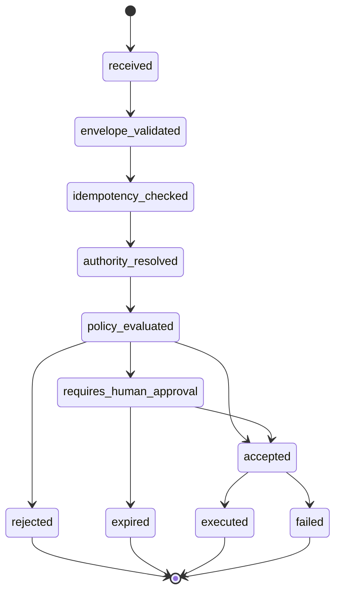
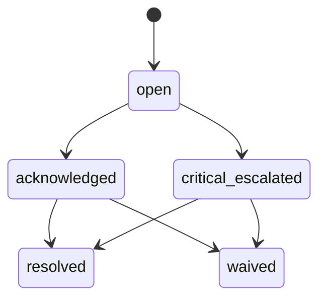

# SD-00 — Architecture Invariants / Pantheon 系統公理與橫切邊界

版本：v0.1 Codex-ready draft
適用範圍：Pantheon 全系統，多 repo：`front-ai-trading-system`、`pantheon`、`pantheon-lean`
來源準繩：Pantheon 總索引版系統分析文件 v1 Consolidated、openclaw strategy lifecycle、openclaw multi-persona implementation architecture

---

## 1. Purpose

本文件定義 Pantheon 的「不可變系統公理」與「橫切基礎 contract」。
它不是功能需求清單，而是給 Codex / LLM 開發代理使用的最高層 Software Design 約束文件。

Pantheon 的所有模組、API、workflow、runtime integration 都必須遵守本文件。後續 SD-01～SD-12 可以擴充具體 plane，但不得違反本文件的 hard invariants。

核心目標：

1. 防止 Pantheon 退化成單一路徑 trading bot。
2. 防止 OpenClaw / LLM 直接變成 execution authority。
3. 防止 shared skill 被誤解為 shared authority。
4. 保證 research、governance、execution、telemetry、evolution 能以事件與 registry 串成可回放閉環。
5. 保留動態調整空間：流程由 policy 決定，底線由 hard invariants 約束。

---

## 2. Repo ownership

| Repo | Ownership |
|---|---|
| `pantheon` | Primary owner。實作 authority evaluator、policy evaluator、event envelope、audit log、idempotency、command admission、cross-plane foundation。 |
| `front-ai-trading-system` | Consumer。只呼叫 BFF / command facade，不自行判定權限、不持有 secret、不直接寫 registry。 |
| `pantheon-lean` | Runtime participant。執行已核准 deployment，送出 canonical runtime / order / fill / position / heartbeat events。 |
| `Lean` | Upstream reference only。不得直接成為 Pantheon 主 runtime path，除非後續 migration SD 明確指定。 |

---

## 3. Module paths

### `pantheon`

```text
services/foundation/
  __init__.py
  envelopes.py
  ids.py
  clock.py
  idempotency.py
  audit.py
  invariants.py
  policy.py
  authority.py
  secrets.py
  event_outbox.py
  exceptions.py
  tests/

services/control-plane/authority/
  api.py
  evaluator.py
  schemas.py
  repository.py
  tests/

services/control-plane/policies/
  policy_loader.py
  policy_registry.py
  policy_evaluator.py
  schemas.py
  tests/

docs/sd/00_architecture_invariants.md
docs/contracts/event_envelope.schema.json
docs/contracts/command_envelope.schema.json
docs/contracts/audit_action.schema.json
docs/contracts/policy_ref.schema.json
docs/codex/SD-00_task_packets.md
```

### `front-ai-trading-system`

```text
src/lib/bffClient.ts
src/lib/authorityClient.ts
src/types/foundation.ts
src/pages/operator/AuditLogPanel.tsx
src/pages/operator/InvariantViolationPanel.tsx
```

### `pantheon-lean`

```text
Pantheon/Telemetry/
  EventEnvelope.cs
  RuntimeEventEmitter.cs
  TraceContext.cs
  RuntimeBoundaryValidator.cs
```

---

## 4. Domain model

### 4.1 `TraceContext`

```yaml
TraceContext:
  trace_id: string
  correlation_id: string
  causation_id: string | null
  request_id: string | null
  idempotency_key: string | null
  actor_ref: ActorRef | null
  environment: EnvironmentScope
  created_at: datetime
```

### 4.2 `ActorRef`

```yaml
ActorRef:
  actor_type: enum[user, persona, service, runtime, system]
  actor_id: string
  display_name: string | null
  roles: string[]
  workspace_id: string | null
  session_id: string | null
```

### 4.3 `EnvironmentScope`

```yaml
EnvironmentScope:
  name: enum[dev, sandbox, paper, canary, live]
  region: string | null
  market: string | null
  timezone: string
```

### 4.4 `AuthorityScope`

```yaml
AuthorityScope:
  persona_id: string | null
  workspace_id: string | null
  capital_pool_id: string | null
  runtime_id: string | null
  target_type: string
  target_id: string
  action: string
  environment: EnvironmentScope
```

### 4.5 `CommandEnvelope`

```yaml
CommandEnvelope:
  command_id: string
  command_type: string
  actor_ref: ActorRef
  authority_scope: AuthorityScope
  payload: object
  trace: TraceContext
  requested_at: datetime
  idempotency_key: string
  expected_version: string | null
  approval_token: string | null
```

### 4.6 `EventEnvelope`

```yaml
EventEnvelope:
  event_id: string
  event_type: string
  event_version: string
  source_service: string
  source_repo: string
  event_time: datetime
  ingest_time: datetime | null
  trace: TraceContext
  actor_ref: ActorRef | null
  subject_type: string
  subject_id: string
  payload: object
```

### 4.7 `PolicyRef`

```yaml
PolicyRef:
  policy_id: string
  policy_type: enum[route, consult, promotion, risk, search, evidence_access, execution_action, evolution, alert]
  version: string
  status: enum[draft, active, retired]
  effective_from: datetime
  effective_to: datetime | null
```

### 4.8 `SecretRef`

```yaml
SecretRef:
  secret_ref_id: string
  provider: string
  scope: enum[service, connector, broker, runtime]
  environment: EnvironmentScope
  readable_by_service_only: boolean
  last_rotated_at: datetime | null
```

### 4.9 `AuditAction`

```yaml
AuditAction:
  action_id: string
  actor_ref: ActorRef
  action_type: string
  target_type: string
  target_id: string
  before_ref: string | null
  after_ref: string | null
  reason: string | null
  trace: TraceContext
  timestamp: datetime
```

### 4.10 `InvariantViolation`

```yaml
InvariantViolation:
  violation_id: string
  invariant_id: string
  severity: enum[warning, blocking, critical]
  detected_by: string
  subject_type: string
  subject_id: string
  description: string
  trace: TraceContext
  detected_at: datetime
  status: enum[open, acknowledged, resolved, waived]
```

---

## 5. Commands

| Command | Purpose | Handler |
|---|---|---|
| `ValidateCommandEnvelope` | 驗證 command 基本結構、trace、idempotency、actor | `services/foundation/envelopes.py` |
| `EvaluateAuthority` | 檢查 actor 是否可在該 scope 執行 action | `services/control-plane/authority/evaluator.py` |
| `EvaluatePolicy` | 根據 policy-as-data 做決策，不硬編碼流程 | `services/control-plane/policies/policy_evaluator.py` |
| `IssueApprovalToken` | 產生 session-scoped approval token | `services/foundation/authority.py` |
| `RevokeApprovalToken` | 撤銷 approval token | `services/foundation/authority.py` |
| `ResolveSecretRef` | 服務端解析 secret ref；前端與 persona 不得拿原文 | `services/foundation/secrets.py` |
| `EmitAuditAction` | 對高風險動作寫 audit log | `services/foundation/audit.py` |
| `RegisterInvariantViolation` | 記錄 hard invariant violation | `services/foundation/invariants.py` |
| `StoreIdempotencyRecord` | 記錄冪等 key 與結果 | `services/foundation/idempotency.py` |
| `PublishDomainEvent` | 寫 event outbox | `services/foundation/event_outbox.py` |

---

## 6. Queries

| Query | Purpose |
|---|---|
| `GetAuthorityDecision(command_id)` | 查詢某 command 為何被允許或拒絕 |
| `GetEffectivePolicies(scope)` | 查詢某 action / persona / pool / environment 的有效 policies |
| `GetAuditActions(filter)` | 查詢 audit log |
| `GetInvariantViolations(filter)` | 查詢 invariant violation |
| `GetTrace(trace_id)` | 回放一條 trace chain |
| `GetIdempotencyRecord(idempotency_key)` | 查詢 command 是否已處理 |
| `GetSecretRefMetadata(secret_ref_id)` | 只返回 metadata，不返回 secret value |

---

## 7. Events

| Event | Emitted when |
|---|---|
| `CommandReceived` | command facade 收到 command |
| `CommandRejected` | authority / policy / invariant check 拒絕 command |
| `CommandAccepted` | command 通過 admission |
| `PolicyEvaluated` | policy evaluator 產生決策 |
| `ApprovalTokenIssued` | 建立 approval token |
| `ApprovalTokenRevoked` | token 被撤銷或過期 |
| `SecretRefAccessed` | 服務端解析 secret ref |
| `AuditActionRecorded` | 高風險行為被記錄 |
| `InvariantViolationDetected` | 觸發 blocking / critical invariant violation |
| `DomainEventPublished` | event outbox 成功寫入 |

所有 event 必須包在 `EventEnvelope` 內。

---

## 8. State machine

### 8.1 Command admission state machine



### 8.2 Invariant violation lifecycle



---

## 9. Hard invariants

這些規則必須由 code enforce，不得只放在 README 或 UI。

| ID | Invariant |
|---|---|
| `INV-001` | Research plane 不得直接呼叫 broker / exchange order path。 |
| `INV-002` | OpenClaw / LLM 不得直接成為 execution kernel，不得直接呼叫 LEAN runtime action。 |
| `INV-003` | Persona 不得讀取 raw broker secret、vendor token、runtime credential。 |
| `INV-004` | Shared skill 不等於 shared authority；每次 tool / workflow call 都要經 capability / authority resolver。 |
| `INV-005` | Live deployment 必須引用 approved artifact、ApprovalDecision、DeploymentPlan、RuntimeBinding。 |
| `INV-006` | Artifact、dataset、deployment、runtime event 都必須有 lineage / trace。 |
| `INV-007` | Paper / canary / live environment 不得共用 runtime state、credential、artifact alias。 |
| `INV-008` | TelemetryEvent 來自 runtime 時必須包含 runtime_id、artifact_id、capital_pool_id、environment。 |
| `INV-009` | 高風險 action：deploy、rollback、pause、liquidate、safe-mode、secret access 必須寫 audit log。 |
| `INV-010` | Any command with idempotency key must be safe to retry without duplicate side effects。 |
| `INV-011` | Data / evidence retrieval must enforce workspace / persona / license / environment filters before returning results。 |
| `INV-012` | Live 表現必須可與 backtest / paper / canary 做 reconciliation；缺 baseline 不可 promotion 到 live，除非有 explicit override approval。 |

---

## 10. Policy hooks

Hard invariants 是底線；下列表現為 policy-as-data，可動態調整。

| Policy | Configurable decisions |
|---|---|
| `RoutePolicy` | persona 可用 tools、skills、workflow、research backend |
| `ConsultPolicy` | 何時必須 committee / red-team / reviewer memo |
| `PromotionPolicy` | promotion gate 組成、paper/canary duration、override rule |
| `RiskPolicy` | exposure、drawdown、turnover、kill switch、liquidation rules |
| `SearchPolicy` | allowed source types、top_k、freshness、citation requirements |
| `EvidenceAccessPolicy` | workspace、license、persona、environment filtering |
| `ExecutionActionPolicy` | pause / liquidate / replace / restart 的角色與審批要求 |
| `EvolutionPolicy` | retrain / freeze / retire / mutate persona 的觸發條件 |
| `AlertPolicy` | heartbeat、drift、PnL、reconciliation mismatch 閾值 |

---

## 11. Storage model

### Required tables / collections

```text
foundation_command_log
foundation_idempotency_records
foundation_event_outbox
foundation_audit_actions
foundation_invariant_violations
foundation_policy_registry
foundation_policy_versions
foundation_approval_tokens
foundation_secret_ref_metadata
```

### Minimal SQL shape

```sql
CREATE TABLE foundation_event_outbox (
  event_id TEXT PRIMARY KEY,
  event_type TEXT NOT NULL,
  event_version TEXT NOT NULL,
  source_service TEXT NOT NULL,
  source_repo TEXT NOT NULL,
  subject_type TEXT NOT NULL,
  subject_id TEXT NOT NULL,
  trace_id TEXT NOT NULL,
  correlation_id TEXT NOT NULL,
  event_time TIMESTAMPTZ NOT NULL,
  payload JSONB NOT NULL,
  published_at TIMESTAMPTZ NULL,
  created_at TIMESTAMPTZ NOT NULL DEFAULT now()
);
```

---

## 12. API endpoints

All endpoints must be behind BFF / control-plane auth.

```text
POST /api/v1/foundation/authority/evaluate
GET  /api/v1/foundation/authority/decisions/{command_id}
POST /api/v1/foundation/policies/evaluate
GET  /api/v1/foundation/policies
POST /api/v1/foundation/approval-tokens
DELETE /api/v1/foundation/approval-tokens/{token_id}
GET  /api/v1/foundation/audit/actions
GET  /api/v1/foundation/invariants/violations
GET  /api/v1/foundation/traces/{trace_id}
```

---

## 13. Integration points

| Integration | Contract |
|---|---|
| BFF command facade | Must call `ValidateCommandEnvelope` and `EvaluateAuthority` before dispatching commands. |
| OpenClaw gateway | Must use governed tools only; no direct runtime / broker secret access. |
| Registry services | Must publish domain events through event outbox. |
| Promotion service | Must enforce approval, lineage, capital pool, and runtime invariants. |
| pantheon-lean | Must emit runtime events using `EventEnvelope` compatible schema. |
| Console UI | Must display audit / invariant / authority decision read models; must not decide authority locally. |

---

## 14. Tests

### Unit tests

```text
test_command_envelope_requires_trace_id
test_idempotency_prevents_duplicate_side_effect
test_persona_cannot_resolve_secret_ref
test_openclaw_direct_execution_action_rejected
test_live_deployment_without_runtime_binding_rejected
test_event_envelope_requires_subject_and_trace
test_audit_written_for_high_risk_action
test_policy_evaluator_allows_configurable_decision
test_hard_invariant_cannot_be_overridden_by_policy
```

### Integration tests

```text
test_bff_command_admission_happy_path
test_openclaw_tool_call_uses_authority_resolver
test_runtime_event_from_lean_platform_passes_normalizer
test_high_risk_liquidate_requires_approval_and_audit
test_trace_chain_command_to_event_to_audit
```

### Contract tests

```text
test_event_envelope_schema_json_validates_all_domain_events
test_command_envelope_schema_rejects_missing_actor
test_secret_ref_metadata_never_contains_secret_value
```

---

## 15. Definition of Done

This SD is complete when:

1. `CommandEnvelope` and `EventEnvelope` schemas exist and are used by at least one real command path and one real event path.
2. Authority evaluator exists and is called by BFF command facade.
3. Policy evaluator supports policy-as-data and returns auditable decisions.
4. Hard invariants are implemented in code and covered by tests.
5. Audit log is written for high-risk actions.
6. Idempotency records prevent duplicate command effects.
7. OpenClaw integration cannot call execution runtime directly.
8. pantheon-lean can emit at least one canonical runtime heartbeat event into Pantheon telemetry path.
9. All tests listed above pass in CI.

---

## 16. Codex task packet

### Task `PTH-SD00-001` — Implement foundation envelopes

```text
Repo: ajoe734/pantheon
Target paths:
  services/foundation/envelopes.py
  services/foundation/ids.py
  docs/contracts/event_envelope.schema.json
  docs/contracts/command_envelope.schema.json
Goal:
  Implement CommandEnvelope and EventEnvelope models with validation.
Acceptance:
  - command_id, trace_id, actor_ref, idempotency_key required for commands.
  - event_id, event_type, event_version, source_service, subject, trace required for events.
  - JSON schema generated or checked in.
  - Unit tests cover missing fields and valid examples.
Non-goals:
  - Do not implement registry domain objects.
  - Do not implement OpenClaw routing.
```

### Task `PTH-SD00-002` — Implement authority evaluator skeleton

```text
Repo: ajoe734/pantheon
Target paths:
  services/control-plane/authority/evaluator.py
  services/control-plane/authority/api.py
  services/control-plane/authority/tests/test_evaluator.py
Goal:
  Provide a deny-first authority evaluator that can reject direct execution actions from OpenClaw/persona contexts.
Acceptance:
  - Reject persona attempting to resolve raw secret.
  - Reject OpenClaw direct runtime action.
  - Allow service actor with proper scope to publish telemetry.
  - Return structured decision with reason codes.
Non-goals:
  - Do not implement full RBAC matrix yet.
```

### Task `PTH-SD00-003` — Implement hard invariant registry

```text
Repo: ajoe734/pantheon
Target paths:
  services/foundation/invariants.py
  services/foundation/audit.py
  services/foundation/tests/test_invariants.py
Goal:
  Implement invariant checks for INV-001 through INV-012 and record violations.
Acceptance:
  - Blocking invariants cannot be overridden by policy.
  - Violations are persisted with trace_id.
  - AuditActionRecorded event emitted for high-risk actions.
Non-goals:
  - Do not build UI panels in this task.
```
