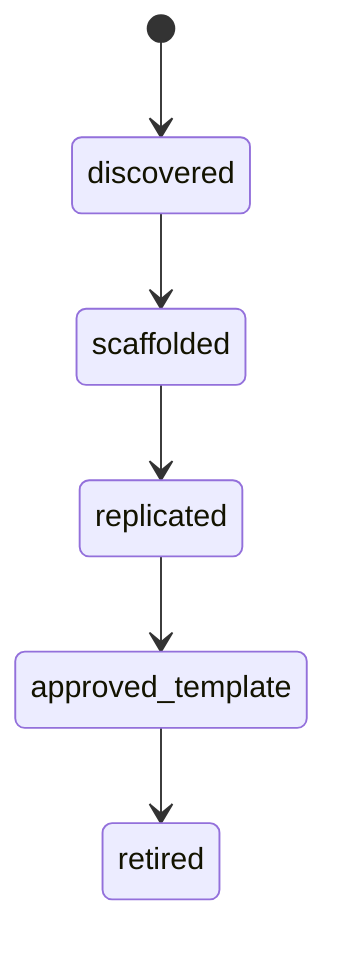
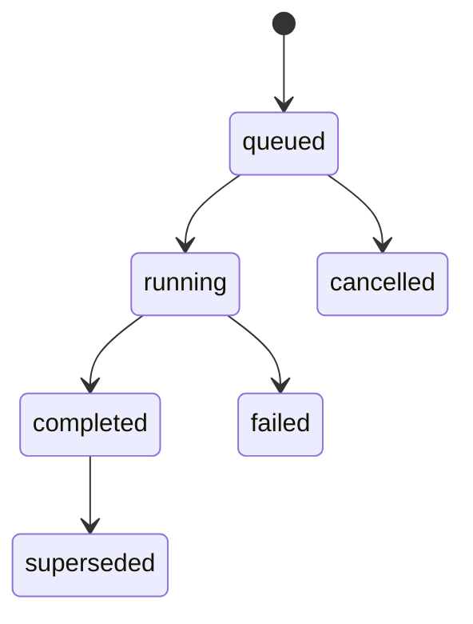
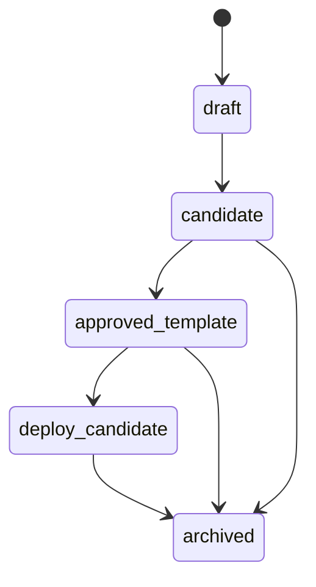

# SD-01 — Domain Model & Registry Backbone / 註冊與 Lineage 真相來源

版本：v0.1 Codex-ready draft
適用範圍：Pantheon Knowledge & Registry Plane、Research / Governance / Execution 的共同真相來源
前置依賴：SD-00 Architecture Invariants

---

## 1. Purpose

本文件定義 Pantheon 的 registry backbone。這是全系統的 Source of Truth，不是單純資料表集合。

Registry Backbone 必須支撐以下回放鏈：

```text
Source / Evidence
→ StrategySpec
→ ExperimentTask / ExperimentRun
→ CandidateArtifact / AllocationPolicyArtifact
→ ApprovalDecision
→ DeploymentPlan
→ RuntimeBinding
→ Telemetry / Reconciliation / Evolution
```

任何 live strategy 必須能一路追回：source、StrategySpec、experiment、artifact、approval、deployment、runtime、pool、human / persona / consult action。

---

## 2. Repo ownership

| Repo | Ownership |
|---|---|
| `pantheon` | Primary owner：registry domain model、storage、lineage、query API、event publication。 |
| `front-ai-trading-system` | Read model consumer：顯示 lineage、registry state、artifact history，不直接寫 registry。 |
| `pantheon-lean` | Runtime reference producer：只透過 RuntimeBinding / TelemetryEvent 反向關聯 registry。 |

---

## 3. Module paths

### `pantheon`

```text
services/registry/core/
  __init__.py
  models.py
  repository.py
  lineage.py
  state_machine.py
  commands.py
  queries.py
  events.py
  api.py
  migrations/
  tests/

services/registry/strategy/
  service.py
  validators.py
  tests/

services/registry/experiment/
  service.py
  backend_refs.py
  tests/

services/registry/artifact/
  service.py
  checksum.py
  storage_refs.py
  tests/

docs/contracts/source_record.schema.json
docs/contracts/strategy_spec.schema.json
docs/contracts/experiment_run.schema.json
docs/contracts/candidate_artifact.schema.json
docs/contracts/lineage_edge.schema.json
docs/sd/01_domain_model_registry_backbone.md
docs/codex/SD-01_task_packets.md
```

### `front-ai-trading-system`

```text
src/pages/lineage/*
src/pages/research/*
src/pages/knowledge/*
src/types/registry.ts
src/lib/registryClient.ts
```

---

## 4. Domain model

### 4.1 `SourceRecord`

```yaml
SourceRecord:
  source_id: string
  source_type: enum[paper, repo, internal_note, filing, news, social, alpha_db, market_data, macro, telemetry]
  source_uri: string | null
  title: string
  authors_or_owner: string[]
  trust_score: number
  license_scope: string | null
  access_scope: string[]
  discovered_at: datetime
  available_time: datetime | null
  ingest_time: datetime
  normalized_status: enum[raw, normalized, indexed, rejected]
  tags: string[]
  evidence_refs: string[]
```

### 4.2 `EvidenceBundleRef`

```yaml
EvidenceBundleRef:
  evidence_bundle_id: string
  source_ids: string[]
  summary: string
  citation_refs: string[]
  confidence: number
  access_scope: string[]
  created_at: datetime
```

### 4.3 `StrategySpec`

```yaml
StrategySpec:
  strategy_id: string
  name: string
  strategy_family: string
  hypothesis: string
  asset_class: string[]
  market_scope: string[]
  holding_period: string
  required_data: string[]
  backend_hint: string | null
  feature_spec_ref: string | null
  label_spec_ref: string | null
  cost_assumptions_ref: string | null
  risk_constraints_ref: string | null
  current_state: enum[discovered, scaffolded, replicated, approved_template, retired]
  evidence_refs: string[]
  code_refs: string[]
  owner_persona_id: string | null
  created_at: datetime
  updated_at: datetime
```

### 4.4 `AlphaTemplate`

```yaml
AlphaTemplate:
  alpha_id: string
  strategy_id: string
  alpha_family: string
  applicable_regimes: string[]
  artifact_refs: string[]
  approved_template: boolean
  search_tags: string[]
  status: enum[draft, active, retired]
```

### 4.5 `ExperimentTask`

```yaml
ExperimentTask:
  task_id: string
  strategy_id: string
  backend: enum[qlib, vectorbt, statsmodels, quantlib, finrl, custom]
  dataset_version_id: string
  code_version: string
  task_config: object
  priority: enum[low, normal, high]
  status: enum[queued, running, completed, failed, cancelled]
  created_by: string
  created_at: datetime
```

### 4.6 `ExperimentRun`

```yaml
ExperimentRun:
  run_id: string
  task_id: string
  strategy_id: string
  backend: string
  dataset_version_id: string
  code_version: string
  params: object
  metrics: object
  artifacts: string[]
  lineage_refs: string[]
  status: enum[running, completed, failed, superseded]
  started_at: datetime
  finished_at: datetime | null
```

### 4.7 `CandidateArtifact`

```yaml
CandidateArtifact:
  artifact_id: string
  artifact_type: enum[strategy_model, signal_model, allocation_policy, rule_pack, persona_patch]
  strategy_id: string | null
  run_id: string | null
  version: string
  storage_ref: string
  checksum: string
  schema_version: string
  registry_status: enum[draft, candidate, approved_template, deploy_candidate, archived]
  eligible_pools: string[]
  lineage_refs: string[]
  created_at: datetime
```

### 4.8 `LineageEdge`

```yaml
LineageEdge:
  edge_id: string
  from_type: string
  from_id: string
  to_type: string
  to_id: string
  relation: enum[derived_from, cites, produced, approved, deployed_as, emitted, supersedes, caused]
  trace_id: string
  created_at: datetime
```

### 4.9 `RegistrySnapshot`

```yaml
RegistrySnapshot:
  snapshot_id: string
  snapshot_type: enum[strategy, experiment, artifact, lineage, approval]
  subject_id: string
  version: string
  state: object
  created_at: datetime
```

---

## 5. Commands

| Command | Purpose |
|---|---|
| `RegisterSourceRecord` | 新增或更新 source metadata。 |
| `RegisterEvidenceBundle` | 建立可引用 evidence bundle。 |
| `CreateStrategySpec` | 從 seed 或人工輸入建立 StrategySpec。 |
| `UpdateStrategySpec` | 更新 StrategySpec，但必須建立 version / audit。 |
| `CreateExperimentTask` | 建立 research backend 可執行 task。 |
| `RecordExperimentRun` | 寫入 ExperimentRun 結果。 |
| `RegisterCandidateArtifact` | 把 experiment output 封裝為 CandidateArtifact。 |
| `TransitionArtifactState` | 僅允許合法 artifact state transition。 |
| `LinkLineageEdge` | 建立 lineage edge。 |
| `CreateRegistrySnapshot` | 針對重要 state 建 snapshot。 |
| `SupersedeRegistryObject` | 版本替換但保留 lineage。 |

---

## 6. Queries

| Query | Purpose |
|---|---|
| `GetSourceRecord(source_id)` | 查 source metadata。 |
| `SearchSources(filter)` | 根據 type、tags、license、access scope 查 source。 |
| `GetStrategySpec(strategy_id)` | 查 StrategySpec。 |
| `ListStrategies(filter)` | 查策略列表與狀態。 |
| `GetExperimentRun(run_id)` | 查 experiment 結果。 |
| `GetCandidateArtifact(artifact_id)` | 查 artifact。 |
| `GetLineageGraph(subject_type, subject_id)` | 回傳 lineage graph。 |
| `GetRegistrySnapshot(subject_id, version)` | 查特定版本 snapshot。 |
| `GetLiveTraceability(runtime_id | artifact_id)` | 回放 live path。 |

---

## 7. Events

| Event | Emitted when |
|---|---|
| `SourceRecordRegistered` | source 寫入 registry。 |
| `EvidenceBundleRegistered` | evidence bundle 建立。 |
| `StrategySpecCreated` | StrategySpec 建立。 |
| `StrategySpecUpdated` | StrategySpec 更新。 |
| `ExperimentTaskCreated` | experiment task 建立。 |
| `ExperimentRunRecorded` | experiment run 寫入。 |
| `CandidateArtifactRegistered` | artifact 註冊。 |
| `ArtifactStateTransitioned` | artifact 狀態轉換。 |
| `LineageEdgeLinked` | lineage edge 建立。 |
| `RegistrySnapshotCreated` | snapshot 建立。 |

All events must use `EventEnvelope` from SD-00.

---

## 8. State machine

### 8.1 Strategy maturity



### 8.2 Experiment state



### 8.3 Artifact registry state



Deployment stage is not artifact state. `paper / canary / live` are deployment stages and must be modeled in SD-07 / SD-08, not here.

---

## 9. Hard invariants

| ID | Invariant |
|---|---|
| `REG-001` | Every `StrategySpec` must reference at least one evidence source, unless explicitly marked as manual_seed with audit reason. |
| `REG-002` | Every `ExperimentRun` must pin `dataset_version_id` and `code_version`. |
| `REG-003` | Every `CandidateArtifact` must have checksum and storage_ref. |
| `REG-004` | Artifact state transition must follow state machine. |
| `REG-005` | `paper / canary / live` must not be stored as artifact registry status. |
| `REG-006` | Registry updates must produce audit action and domain event. |
| `REG-007` | Any live traceability query must be able to reach artifact, approval, deployment plan, runtime binding, and telemetry refs. |
| `REG-008` | Lineage edge deletion is forbidden; use supersede / retire semantics instead. |

---

## 10. Policy hooks

| Policy | Dynamic behavior |
|---|---|
| `StrategyAdmissionPolicy` | Determines whether manual StrategySpec can be created without external evidence. |
| `ArtifactEligibilityPolicy` | Determines which artifact types can become deploy candidates. |
| `RegistryRetentionPolicy` | Controls snapshot retention and archive rules. |
| `LineageCompletenessPolicy` | Defines minimum lineage requirements for each promotion level. |
| `ExperimentMetricPolicy` | Defines required metrics per strategy family. |

---

## 11. Storage model

### Required tables

```text
registry_source_records
registry_evidence_bundle_refs
registry_strategy_specs
registry_alpha_templates
registry_experiment_tasks
registry_experiment_runs
registry_candidate_artifacts
registry_lineage_edges
registry_snapshots
registry_object_versions
```

### Suggested indexes

```text
(source_type, ingest_time)
(strategy_family, current_state)
(strategy_id, backend, dataset_version_id)
(artifact_type, registry_status)
(from_type, from_id)
(to_type, to_id)
(trace_id)
```

---

## 12. API endpoints

```text
POST /api/v1/registry/sources
GET  /api/v1/registry/sources
GET  /api/v1/registry/sources/{source_id}

POST /api/v1/registry/evidence-bundles
GET  /api/v1/registry/evidence-bundles/{bundle_id}

POST /api/v1/registry/strategies
GET  /api/v1/registry/strategies
GET  /api/v1/registry/strategies/{strategy_id}
PATCH /api/v1/registry/strategies/{strategy_id}

POST /api/v1/registry/experiments/tasks
GET  /api/v1/registry/experiments/tasks/{task_id}
POST /api/v1/registry/experiments/runs
GET  /api/v1/registry/experiments/runs/{run_id}

POST /api/v1/registry/artifacts
GET  /api/v1/registry/artifacts
GET  /api/v1/registry/artifacts/{artifact_id}
POST /api/v1/registry/artifacts/{artifact_id}/transition

POST /api/v1/registry/lineage/edges
GET  /api/v1/registry/lineage/{subject_type}/{subject_id}
GET  /api/v1/registry/traceability/live
```

---

## 13. Integration points

| Plane | Integration |
|---|---|
| Source Ingestion | Creates SourceRecord and EvidenceBundleRef. |
| Research Orchestrator | Creates ExperimentTask, records ExperimentRun. |
| Artifact Packager | Registers CandidateArtifact. |
| Governance / Promotion | Reads CandidateArtifact and lineage; writes ApprovalDecision refs in later SD. |
| Execution | Reads approved deployment info, writes RuntimeBinding in later SD. |
| Telemetry / Evolution | Queries lineage graph to contextualize runtime events and drift. |
| Console | Reads registry and lineage view models. |

---

## 14. Tests

### Unit tests

```text
test_strategy_requires_evidence_or_manual_audit_reason
test_experiment_run_requires_dataset_and_code_version
test_candidate_artifact_requires_checksum
test_artifact_state_transition_valid
test_artifact_state_rejects_paper_canary_live
test_lineage_edge_immutable
test_registry_update_emits_event
test_registry_snapshot_created_for_artifact_transition
```

### Integration tests

```text
test_source_to_strategy_to_experiment_to_artifact_lineage
test_live_traceability_query_requires_deployment_refs
test_frontend_registry_read_model_contract
test_event_outbox_receives_registry_events
```

---

## 15. Definition of Done

1. Core registry models exist and validate required fields.
2. Registry repository supports create / update / get / list / lineage graph.
3. State machines enforce legal transitions.
4. Every mutating command emits domain event and audit action.
5. Artifact registry state is separated from deployment stage.
6. Lineage edges are immutable and queryable in both directions.
7. Tests listed above pass.
8. At least one end-to-end sample exists: source → StrategySpec → ExperimentRun → CandidateArtifact → lineage graph.

---

## 16. Codex task packet

### Task `PTH-SD01-001` — Implement registry domain models

```text
Repo: ajoe734/pantheon
Target paths:
  services/registry/core/models.py
  docs/contracts/strategy_spec.schema.json
  docs/contracts/experiment_run.schema.json
  docs/contracts/candidate_artifact.schema.json
Goal:
  Implement SourceRecord, StrategySpec, ExperimentTask, ExperimentRun, CandidateArtifact, LineageEdge models.
Acceptance:
  - Models validate required fields.
  - Artifact registry_status excludes paper/canary/live.
  - JSON schemas checked in.
Non-goals:
  - Do not implement promotion or deployment.
```

### Task `PTH-SD01-002` — Implement lineage repository

```text
Repo: ajoe734/pantheon
Target paths:
  services/registry/core/repository.py
  services/registry/core/lineage.py
  services/registry/core/tests/test_lineage.py
Goal:
  Persist and query lineage edges.
Acceptance:
  - LinkLineageEdge creates immutable edge.
  - GetLineageGraph returns upstream/downstream graph.
  - Delete edge operation is not exposed.
Non-goals:
  - Do not build graph visualization UI.
```

### Task `PTH-SD01-003` — Implement artifact state machine

```text
Repo: ajoe734/pantheon
Target paths:
  services/registry/core/state_machine.py
  services/registry/artifact/service.py
  services/registry/artifact/tests/test_artifact_state.py
Goal:
  Enforce draft -> candidate -> approved_template -> deploy_candidate -> archived.
Acceptance:
  - Reject invalid transition.
  - Reject paper/canary/live as artifact status.
  - Emit ArtifactStateTransitioned event.
```
