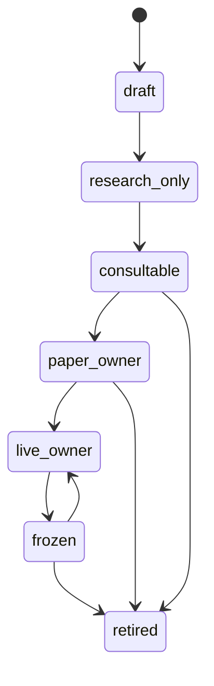
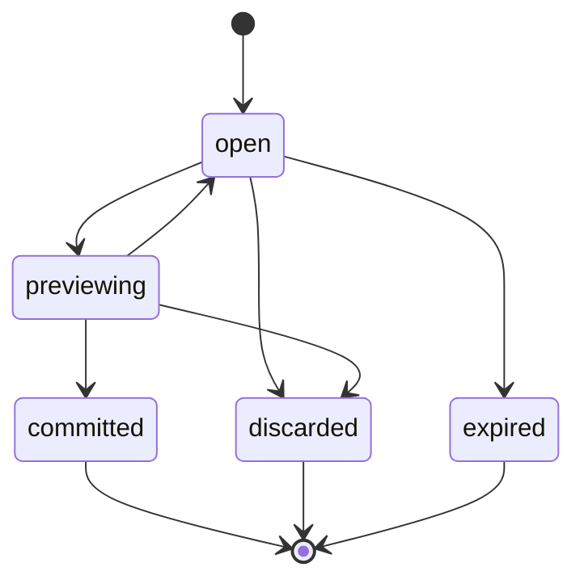
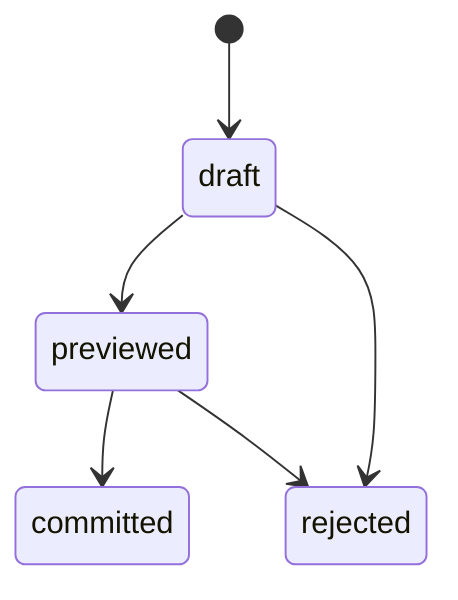

# SD-02 — Persona Governance / 多人格治理與 Capability Boundary

版本：v0.1 Codex-ready draft
適用範圍：Persona Plane、Shared Capability Plane、OpenClaw integration、Trainer / Consultation 前置能力
前置依賴：SD-00 Architecture Invariants、SD-01 Registry Backbone

---

## 1. Purpose

本文件定義 Pantheon 中 persona 作為正式一級治理物件的 software design。

Persona 不是 prompt，也不是聊天角色。Persona 是具備 lifecycle、workspace、route policy、consult policy、capability snapshot、teaching trace、audit lineage 的治理物件。

核心原則：

```text
shared knowledge != shared authority
shared skill != shared authority
persona capability != broker/execution permission
```

OpenClaw 可作為 Shared Capability / agent runtime substrate，但 Pantheon 的 authority、capital pool、promotion、execution boundary 仍由 Pantheon enforce。

---

## 2. Repo ownership

| Repo | Ownership |
|---|---|
| `pantheon` | Primary owner：persona registry、policy resolver、capability resolver、teaching session、OpenClaw governance adapter。 |
| `front-ai-trading-system` | UI owner：Persona Workbench、Trainer Workbench、Capability Viewer、Consultation entry points、Agora / Ask Personas human interaction surfaces。 |
| `pantheon-lean` | No direct persona ownership。只接受經 DeploymentPlan / RuntimeBinding 的 artifact，不接受 persona 直接命令。 |

---

## 3. Module paths

### `pantheon`

```text
services/persona/
  __init__.py
  models.py
  repository.py
  lifecycle.py
  route_policy.py
  consult_policy.py
  capability_resolver.py
  teaching.py
  commands.py
  queries.py
  events.py
  api.py
  tests/

integrations/openclaw/
  governance.md
  gateway.py
  tool_authority.py
  session_binder.py
  capability_bridge.py
  tests/

docs/contracts/persona.schema.json
docs/contracts/route_policy.schema.json
docs/contracts/consult_policy.schema.json
docs/contracts/capability_snapshot.schema.json
docs/contracts/teaching_session.schema.json
docs/sd/02_persona_governance.md
docs/codex/SD-02_task_packets.md
```

### `front-ai-trading-system`

```text
src/pages/personas/*
src/pages/trainer/*
src/pages/consultation/*
src/agora/*
src/types/persona.ts
src/lib/personaClient.ts
```

---

## 4. Domain model

### 4.1 `Persona`

```yaml
Persona:
  persona_id: string
  name: string
  mandate: string
  strategy_family: string[]
  workspace_ref: string
  tool_profile_id: string | null
  route_policy_id: string
  consult_policy_id: string
  lifecycle_state: enum[draft, research_only, consultable, paper_owner, live_owner, frozen, retired]
  owner: string
  status: enum[active, disabled, archived]
  created_at: datetime
  updated_at: datetime
```

### 4.2 `PrivateWorkspace`

```yaml
PrivateWorkspace:
  workspace_id: string
  persona_id: string
  storage_scope: string
  memory_scope: string
  search_scope: string[]
  status: enum[active, frozen, archived]
```

### 4.3 `RoutePolicy`

```yaml
RoutePolicy:
  route_policy_id: string
  version: string
  allowed_tools: string[]
  allowed_workflows: string[]
  allowed_research_backends: string[]
  allowed_source_scopes: string[]
  publish_scope: enum[private, shared_research, committee, governance]
  environment_scope: enum[dev, sandbox, paper, canary, live][]
  restrictions: string[]
  status: enum[draft, active, retired]
```

### 4.4 `ConsultPolicy`

```yaml
ConsultPolicy:
  consult_policy_id: string
  version: string
  required_reviewers: string[]
  required_committees: string[]
  trigger_rules: object[]
  forbidden_solo_actions: string[]
  red_team_required_for: string[]
  status: enum[draft, active, retired]
```

### 4.5 `CapabilitySnapshot`

```yaml
CapabilitySnapshot:
  snapshot_id: string
  persona_id: string
  effective_tools: string[]
  effective_skills: string[]
  effective_workflows: string[]
  effective_source_scopes: string[]
  effective_environment_scope: string[]
  denied_capabilities: object[]
  resolved_from: string[]
  generated_at: datetime
```

### 4.6 `TeachingSession`

```yaml
TeachingSession:
  session_id: string
  persona_id: string
  opened_by: string
  mode: enum[coaching, patch_preview, evaluation, correction]
  status: enum[open, previewing, committed, discarded, expired]
  started_at: datetime
  ended_at: datetime | null
  current_control_state_ref: string | null
  trace_id: string
```

### 4.7 `TeachingEvent`

```yaml
TeachingEvent:
  event_id: string
  session_id: string
  event_type: enum[message, correction, patch_proposed, preview_requested, preview_result, commit, discard]
  actor_type: enum[user, persona, service]
  payload: object
  timestamp: datetime
  correlation_id: string
```

### 4.8 `PersonaPatch`

```yaml
PersonaPatch:
  patch_id: string
  persona_id: string
  session_id: string
  patch_type: enum[route_policy, consult_policy, memory, behavior, tool_profile]
  proposed_change: object
  preview_result_ref: string | null
  status: enum[draft, previewed, committed, rejected]
```

### 4.9 `PersonaOodaState`

每個 persona 都有自己的 OODA state。這個 state 是 persona-scoped，不能被多
persona committee 或 optimizer synthesis 合併成單一全域人格。

```yaml
PersonaOodaState:
  ooda_state_id: string
  persona_id: string
  observe_refs: string[]
  orient_summary_ref: string | null
  decide_refs: string[]
  proposal_refs: string[]
  learn_refs: string[]
  source_context:
    market_data_refs: string[]
    pool_telemetry_refs: string[]
    strategy_telemetry_refs: string[]
    research_note_refs: string[]
    signal_refs: string[]
    incident_refs: string[]
    agora_evidence_refs: string[]
  status: enum[open, superseded, archived]
  trace_id: string
  created_at: datetime
  updated_at: datetime
```

`Act` in this state means producing governed proposals or requests in the
control plane. It does not mean the persona calls LEAN, broker adapters, or
runtime actions directly.

### 4.10 `AgoraInteractionEvidence`

Agora / Ask Personas is a first-class human interaction surface. A human trader
or operator may ask for analysis, correct a proposal, mark a signal, write a
journal note, convert an insight to a training example, or submit a persona-lab
commit without thinking of the action as an explicit AI-training session.

```yaml
AgoraInteractionEvidence:
  evidence_id: string
  source_surface: enum[agora_ask, signal_feedback, journal, note, insight, training_example, persona_lab_commit]
  actor_id: string
  actor_role: enum[operator, trader, trainer, researcher, approver, system]
  persona_id: string | null
  session_id: string | null
  message_ids: string[]
  artifact_refs: string[]
  rationale_ref: string | null
  labels: string[]
  learning_use: enum[observe_only, implicit_training_evidence, explicit_teaching, imitation_candidate]
  governance_state: enum[recorded, quarantined, dataset_ready, submitted_for_review, rejected]
  trace_id: string
  created_at: datetime
```

Implicit Agora evidence may feed Observe / Learn, dataset builders, persona
memory, strategy lessons, correction traces, preference pairs, or trader
trajectories. It is not an approved persona patch and is not runtime authority.

### 4.11 `ShadowImitationCandidate`

Human trader imitation can create a shadow candidate that mirrors a trader's
logic and then runs its own persona OODA against the same context to compare
decisions.

```yaml
ShadowImitationCandidate:
  candidate_id: string
  source_trader_id: string
  persona_id: string
  source_evidence_refs: string[]
  imitation_dataset_ref: string
  behavior_policy_ref: string
  shadow_eval_refs: string[]
  comparison_targets:
    trader_trajectory_refs: string[]
    no_order_rationale_refs: string[]
    persona_proposal_refs: string[]
  status: enum[draft, evaluating, paper_shadow, submitted_for_review, rejected, approved_candidate]
  trace_id: string
  created_at: datetime
  updated_at: datetime
```

Shadow candidates remain research / paper-shadow objects until the normal
experiment, approval, DeploymentPlan, and RuntimeBinding path admits them.

---

## 5. Commands

| Command | Purpose |
|---|---|
| `CreatePersona` | 建立 persona。 |
| `UpdatePersonaProfile` | 更新 mandate / strategy family 等基本資訊。 |
| `SetRoutePolicy` | 綁定或更新 route policy。 |
| `SetConsultPolicy` | 綁定或更新 consult policy。 |
| `ResolveCapabilitySnapshot` | 產生 effective capability snapshot。 |
| `StartTeachingSession` | 開始 trainer session。 |
| `RecordTeachingEvent` | 寫 teaching trace。 |
| `ProposePersonaPatch` | 提出 persona patch。 |
| `PreviewPersonaPatch` | 觸發 rapid eval / dry-run。 |
| `CommitPersonaPatch` | 經檢查後套用 patch。 |
| `DiscardPersonaPatch` | 丟棄 patch。 |
| `TransitionPersonaLifecycle` | 依 lifecycle state machine 轉換。 |
| `BindOpenClawSession` | 建立 OpenClaw session 與 persona / workspace 綁定。 |
| `AuthorizeOpenClawToolCall` | 對 OpenClaw tool call 做 deny-first authorization。 |
| `RecordPersonaOodaEvidence` | 將 Observe / Orient / Decide / Learn refs 寫入 persona-scoped OODA state。 |
| `RecordAgoraInteractionEvidence` | 將 Agora ask、feedback、journal、insight、training example 或 persona-lab handoff 記為 learning evidence。 |
| `BuildPersonaLearningDataset` | 將 teaching / Agora / feedback / trajectory traces 結構化成 persona、alpha 或 imitation dataset。 |
| `ProposeShadowImitationCandidate` | 用 human trader traces 產生 shadow behavior policy / persona candidate。 |
| `EvaluateShadowImitationCandidate` | 在 rapid eval / OOS / paper shadow 中比較真人 trajectory 與 persona proposal。 |

---

## 6. Queries

| Query | Purpose |
|---|---|
| `ListPersonas(filter)` | 查 persona 列表。 |
| `GetPersona(persona_id)` | 查 persona。 |
| `GetPersonaWorkspace(persona_id)` | 查 private workspace。 |
| `GetEffectiveCapabilities(persona_id, context)` | 查 effective capability snapshot。 |
| `GetRoutePolicy(policy_id)` | 查 route policy。 |
| `GetConsultPolicy(policy_id)` | 查 consult policy。 |
| `GetTeachingSession(session_id)` | 查 teaching session。 |
| `GetTeachingHistory(persona_id)` | 查 persona teaching traces。 |
| `GetOpenClawSessionBinding(session_id)` | 查 OpenClaw session binding。 |

---

## 7. Events

| Event | Emitted when |
|---|---|
| `PersonaCreated` | persona 建立。 |
| `PersonaUpdated` | persona profile 更新。 |
| `RoutePolicyAssigned` | route policy 綁定。 |
| `ConsultPolicyAssigned` | consult policy 綁定。 |
| `CapabilitySnapshotResolved` | capability snapshot 產生。 |
| `TeachingSessionStarted` | teaching session 開始。 |
| `TeachingEventRecorded` | teaching event 寫入。 |
| `PersonaPatchProposed` | patch 被提出。 |
| `PersonaPatchPreviewed` | patch preview 完成。 |
| `PersonaPatchCommitted` | patch commit。 |
| `PersonaPatchDiscarded` | patch discard。 |
| `PersonaLifecycleTransitioned` | lifecycle 轉換。 |
| `OpenClawSessionBound` | OpenClaw session 綁定 persona。 |
| `OpenClawToolCallAuthorized` | tool call 通過。 |
| `OpenClawToolCallRejected` | tool call 拒絕。 |
| `PersonaOodaEvidenceRecorded` | persona-scoped OODA evidence 被記錄。 |
| `AgoraInteractionEvidenceRecorded` | Agora / Ask Personas interaction 被記為 learning evidence。 |
| `PersonaLearningDatasetBuilt` | teaching / Agora / feedback traces 被輸出為 dataset。 |
| `ShadowImitationCandidateProposed` | imitation / shadow candidate 被提出。 |
| `ShadowImitationCandidateEvaluated` | shadow candidate 完成 eval / OOS / paper-shadow 比較。 |

---

## 8. State machine

### 8.1 Persona lifecycle



### 8.2 Teaching session lifecycle



### 8.3 Persona patch lifecycle



---

## 9. Hard invariants

| ID | Invariant |
|---|---|
| `PER-001` | Persona must not access raw broker secret or vendor token. |
| `PER-002` | Persona tool call must be authorized through CapabilityResolver and SD-00 authority evaluator. |
| `PER-003` | Shared skill does not imply authority; every tool call must be context-checked. |
| `PER-004` | Persona cannot transition to `paper_owner` without consultable state and route policy. |
| `PER-005` | Persona cannot transition to `live_owner` without capital binding and approval policy in later SD. |
| `PER-006` | Teaching patch cannot affect live behavior without preview, commit, audit, and governance approval when required. |
| `PER-007` | OpenClaw session must be bound to persona_id and workspace_id before tool execution. |
| `PER-008` | Persona private workspace must not be merged with shared knowledge store without explicit publish action. |
| `PER-009` | Retired persona cannot initiate new research, consult, promotion, or runtime actions. |
| `PER-010` | Persona OODA state is persona-scoped; multi-persona consultation must not collapse all personas into one global OODA loop. |
| `PER-011` | Agora / Ask Personas evidence may enter Observe / Learn, but cannot promote artifacts, mutate runtime bindings, or change live LEAN. |
| `PER-012` | Implicit Agora evidence is not an approved TeachingEvent commit unless explicitly routed through preview / review / governance. |
| `PER-013` | Shadow imitation candidates are research / paper-shadow only until experiment, approval, DeploymentPlan, and RuntimeBinding admission. |
| `PER-014` | Persona discussion, conflict classification, artifact synthesis, and governance happen in the pre-LEAN control plane, never inside LEAN. |

---

## 10. Policy hooks

| Policy | Dynamic behavior |
|---|---|
| `RoutePolicy` | allowed tools, workflows, source scopes, backend preferences。 |
| `ConsultPolicy` | red-team / committee triggers, forbidden solo actions。 |
| `TeachingPolicy` | which patch types require preview / approval。 |
| `ImplicitTeachingEvidencePolicy` | decides which Agora / trader interactions may be used as observe-only, dataset-ready, quarantined, or review-required evidence。 |
| `ShadowImitationPolicy` | defines allowed source traders, datasets, eval gates, paper-shadow limits, and approval requirements。 |
| `PersonaLifecyclePolicy` | prerequisites for promotion across lifecycle states。 |
| `OpenClawToolPolicy` | maps OpenClaw tool call to Pantheon action and required scope。 |
| `WorkspacePublishPolicy` | decides how private insights become shared knowledge。 |

---

## 11. Storage model

```text
persona_profiles
persona_workspaces
persona_route_policies
persona_consult_policies
persona_capability_snapshots
persona_teaching_sessions
persona_teaching_events
persona_patches
persona_ooda_states
agora_interaction_evidence
persona_learning_dataset_refs
shadow_imitation_candidates
persona_lifecycle_events
openclaw_session_bindings
openclaw_tool_authorization_log
```

Suggested indexes:

```text
(persona_id, lifecycle_state)
(persona_id, generated_at)
(session_id, event_type, timestamp)
(workspace_id)
(trace_id)
```

---

## 12. API endpoints

```text
GET  /api/v1/personas
POST /api/v1/personas
GET  /api/v1/personas/{persona_id}
PATCH /api/v1/personas/{persona_id}
POST /api/v1/personas/{persona_id}/lifecycle-transition

GET  /api/v1/personas/{persona_id}/workspace
GET  /api/v1/personas/{persona_id}/capabilities
POST /api/v1/personas/{persona_id}/capabilities/resolve

GET  /api/v1/personas/{persona_id}/route-policy
PATCH /api/v1/personas/{persona_id}/route-policy
GET  /api/v1/personas/{persona_id}/consult-policy
PATCH /api/v1/personas/{persona_id}/consult-policy

POST /api/v1/trainer/sessions
GET  /api/v1/trainer/sessions/{session_id}
POST /api/v1/trainer/sessions/{session_id}/events
POST /api/v1/trainer/sessions/{session_id}/patches
POST /api/v1/trainer/sessions/{session_id}/preview
POST /api/v1/trainer/sessions/{session_id}/commit
POST /api/v1/trainer/sessions/{session_id}/discard

POST /api/v1/openclaw/session-bindings
POST /api/v1/openclaw/tool-authorize
```

---

## 13. Integration points

| Integration | Contract |
|---|---|
| OpenClaw gateway | Must bind session and call `AuthorizeOpenClawToolCall` before any governed tool. |
| Source / Knowledge | Persona search scopes come from CapabilitySnapshot. |
| Research Orchestrator | Persona may request experiments only through allowed backend and route policy. |
| Agora / BFF | Ask sessions, messages, signal feedback, journal, insight actions, training examples, and persona-lab commits can become learning evidence but not runtime authority. |
| Trader feedback / imitation | Approve / edit / reject / rationale, correction traces, and trader trajectories can feed persona lessons or shadow candidates through research-only dataset builders. |
| Consultation Plane | ConsultPolicy determines required committee / red-team. |
| Capital Pool Plane | Persona-capital binding is downstream; persona itself does not own capital. |
| BFF / Console | UI can display and request changes, but authority lives in Pantheon services. |

---

## 14. Tests

### Unit tests

```text
test_create_persona_defaults_to_draft
test_route_policy_required_for_research_only
test_capability_snapshot_does_not_include_forbidden_tools
test_shared_skill_not_authority
test_openclaw_tool_rejected_without_session_binding
test_teaching_patch_requires_preview_before_commit
test_retired_persona_cannot_start_session
test_private_workspace_not_published_without_explicit_action
test_persona_ooda_state_is_persona_scoped
test_agora_interaction_evidence_does_not_mutate_runtime
test_implicit_agora_evidence_requires_review_before_persona_patch
test_shadow_imitation_candidate_requires_experiment_before_approval
```

### Integration tests

```text
test_openclaw_session_to_tool_authorization_flow
test_persona_research_request_uses_route_policy
test_persona_consult_trigger_uses_consult_policy
test_teaching_patch_preview_to_commit_to_audit
test_agora_feedback_to_dataset_to_shadow_candidate_flow_has_no_live_side_effect
```

---

## 15. Definition of Done

1. Persona, route policy, consult policy, capability snapshot models exist.
2. Persona lifecycle state machine is enforced.
3. OpenClaw session binding and tool authorization exist.
4. Teaching session can record events and commit/discard patches.
5. CapabilityResolver produces auditable snapshot.
6. Persona cannot access secrets or runtime action path directly.
7. Agora / Ask Personas evidence capture is explicit about Observe / Learn use and cannot bypass approval.
8. Shadow imitation candidates stay research / paper-shadow until approved through deployment governance.
9. Tests listed above pass.
10. Frontend can list personas and show effective capabilities through read-only APIs.

---

## 16. Codex task packet

### Task `PTH-SD02-001` — Implement persona models and lifecycle

```text
Repo: ajoe734/pantheon
Target paths:
  services/persona/models.py
  services/persona/lifecycle.py
  services/persona/tests/test_lifecycle.py
Goal:
  Implement Persona, RoutePolicy, ConsultPolicy, CapabilitySnapshot and lifecycle transitions.
Acceptance:
  - New persona defaults to draft.
  - Invalid lifecycle transitions rejected.
  - live_owner transition requires downstream binding placeholder check.
Non-goals:
  - Do not implement capital pool binding in this task.
```

### Task `PTH-SD02-002` — Implement capability resolver

```text
Repo: ajoe734/pantheon
Target paths:
  services/persona/capability_resolver.py
  services/persona/tests/test_capability_resolver.py
Goal:
  Resolve effective capabilities from route policy, workspace, environment and SD-00 invariants.
Acceptance:
  - Shared skills do not imply execution authority.
  - Forbidden capabilities appear in denied_capabilities with reason.
  - Snapshot is persisted and event emitted.
```

### Task `PTH-SD02-003` — Implement OpenClaw session binding and tool authorization

```text
Repo: ajoe734/pantheon
Target paths:
  integrations/openclaw/session_binder.py
  integrations/openclaw/tool_authority.py
  integrations/openclaw/tests/test_tool_authority.py
Goal:
  Bind OpenClaw session to persona/workspace and authorize tool calls.
Acceptance:
  - Reject tool call without binding.
  - Reject direct runtime action.
  - Emit OpenClawToolCallAuthorized or Rejected event.
```
