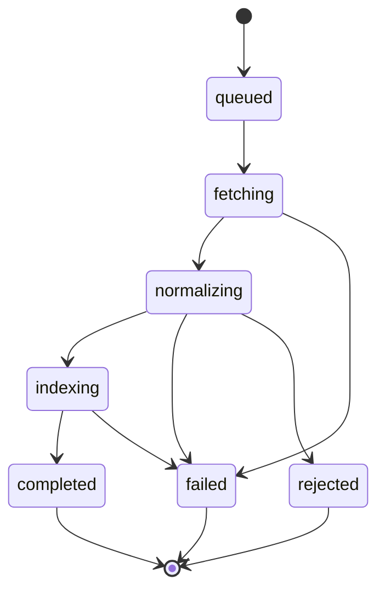
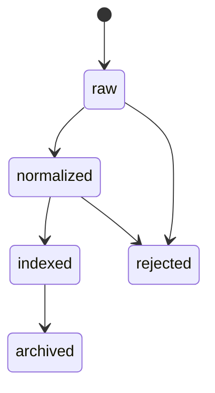
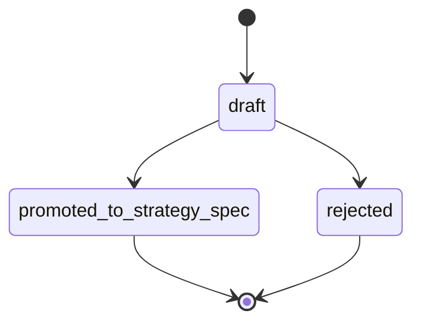

# SD-03 — Source / Knowledge / Evidence Plane / 來源、知識與證據檢索設計

版本：v0.1 Codex-ready draft  
適用範圍：Source Ingestion Plane、Knowledge & Registry Plane 的 evidence/search 子系統、OpenClaw governed search  
前置依賴：SD-00 Architecture Invariants、SD-01 Registry Backbone、SD-02 Persona Governance

---

## 1. Purpose

本文件定義 Pantheon 的受控 source ingestion、evidence store、search / RAG gateway、StrategySpec seed builder。

此 plane 不只是「接外部資料源」。它的任務是把 paper、repo、internal notes、filings、news、social media、alpha external database、market / macro / telemetry 等來源轉成可治理、可引用、可搜尋、可回放的 evidence。

OpenClaw / LLM 可以搜尋，但必須透過 governed search gateway：

```text
OpenClaw / LLM
→ governed search request
→ persona / workspace / license / environment filter
→ evidence retrieval
→ cited evidence bundle
→ audit event
```

OpenClaw 不得直接持有 vendor token，也不得直接任意上網抓資料進 live decision path。

---

## 2. Repo ownership

| Repo | Ownership |
|---|---|
| `pantheon` | Primary owner：source ingestion、normalizer、evidence store、search gateway、StrategySpec seed builder。 |
| `front-ai-trading-system` | UI consumer：Knowledge Workbench、Research Search、Evidence Bundle Viewer、Connector Health。 |
| `pantheon-lean` | Existing connector source reference：Polygon / Benzinga 等 execution-facing connector 可作為 adapter reference，但 canonical ingestion authority 應回到 Pantheon。 |
| `OpenClaw` integration | Governed search client only；不可直接擁有 source authority。 |

---

## 3. Module paths

### `pantheon`

```text
services/source-ingestion/
  __init__.py
  connectors/
    base.py
    paper.py
    repo.py
    internal_note.py
    filing.py
    news.py
    social.py
    alpha_db.py
    macro.py
    market.py
  normalizer.py
  source_registry.py
  strategy_seed_builder.py
  ingest_manager.py
  entitlement.py
  tests/

services/knowledge/evidence/
  models.py
  repository.py
  chunker.py
  citation.py
  bundle_builder.py
  tests/

services/search/
  gateway.py
  indexer.py
  retriever.py
  filters.py
  reranker.py
  api.py
  tests/

integrations/openclaw/search_gateway.py

docs/contracts/source_connector.schema.json
docs/contracts/evidence_bundle.schema.json
docs/contracts/search_request.schema.json
docs/contracts/strategy_spec_seed.schema.json
docs/sd/03_source_knowledge_evidence.md
docs/codex/SD-03_task_packets.md
```

### `front-ai-trading-system`

```text
src/pages/knowledge/*
src/pages/research/SearchPanel.tsx
src/pages/settings/ConnectorHealthPanel.tsx
src/types/evidence.ts
src/lib/searchClient.ts
```

---

## 4. Domain model

### 4.1 `SourceConnector`

```yaml
SourceConnector:
  connector_id: string
  source_type: enum[paper, repo, internal_note, filing, news, social, alpha_db, macro, market, telemetry]
  provider: string
  auth_type: enum[none, api_key, oauth, secret_ref, broker_ref]
  secret_ref_id: string | null
  supported_modes: enum[batch, streaming, webhook][]
  license_scope: string
  status: enum[enabled, disabled, degraded]
  rate_limit_policy_ref: string | null
```

### 4.2 `IngestRun`

```yaml
IngestRun:
  ingest_run_id: string
  connector_id: string
  source_type: string
  trigger_type: enum[manual, cron, webhook, tool_call]
  status: enum[queued, fetching, normalizing, indexing, completed, failed, rejected]
  started_at: datetime
  finished_at: datetime | null
  raw_count: integer
  normalized_count: integer
  rejected_count: integer
  trace_id: string
```

### 4.3 `SourceRecord`

Use SD-01 canonical `SourceRecord`; SD-03 owns creation and normalization.

Additional SD-03-specific metadata:

```yaml
SourceRecord.metadata:
  provider: string
  raw_uri: string | null
  raw_checksum: string | null
  language: string | null
  event_time: datetime | null
  available_time: datetime | null
  license_scope: string
  access_scope: string[]
  source_quality_score: number
```

### 4.4 `EvidenceItem`

```yaml
EvidenceItem:
  evidence_item_id: string
  source_id: string
  item_type: enum[text_chunk, table, code_snippet, filing_fact, headline, social_post, metric, chart_ref]
  content_ref: string
  citation_label: string
  event_time: datetime | null
  available_time: datetime | null
  confidence: number
  access_scope: string[]
```

### 4.5 `EvidenceBundle`

```yaml
EvidenceBundle:
  evidence_bundle_id: string
  source_ids: string[]
  evidence_item_ids: string[]
  summary: string
  citation_refs: string[]
  confidence: number
  license_scope: string
  access_scope: string[]
  created_by: string
  created_at: datetime
```

### 4.6 `DocumentChunk`

```yaml
DocumentChunk:
  chunk_id: string
  source_id: string
  evidence_item_id: string
  chunk_index: integer
  text: string
  token_count: integer
  embedding_ref: string | null
  metadata: object
  access_scope: string[]
```

### 4.7 `SearchRequest`

```yaml
SearchRequest:
  request_id: string
  query: string
  persona_id: string | null
  workspace_id: string | null
  source_types: string[]
  time_window: object | null
  environment: enum[dev, sandbox, paper, canary, live]
  top_k: integer
  require_citations: boolean
  trace_id: string
```

### 4.8 `RetrievalResult`

```yaml
RetrievalResult:
  result_id: string
  request_id: string
  evidence_bundle_id: string
  matched_items: object[]
  answer_context: string
  citations: string[]
  filters_applied: object
  rejected_items_count: integer
  created_at: datetime
```

### 4.9 `StrategySpecSeed`

```yaml
StrategySpecSeed:
  seed_id: string
  source_id: string
  evidence_bundle_id: string
  hypothesis: string
  asset_class: string[]
  market_scope: string[]
  holding_period: string | null
  required_data: string[]
  backend_hint: string | null
  feature_hints: string[]
  label_hints: string[]
  risk_notes: string[]
  confidence: number
  status: enum[draft, promoted_to_strategy_spec, rejected]
```

### 4.10 External source event subtypes

```yaml
NewsEvent:
  source_id: string
  headline: string
  provider: string
  published_at: datetime
  available_time: datetime
  symbols: string[]
  topics: string[]

SocialPostEvent:
  source_id: string
  platform: string
  author_ref: string
  posted_at: datetime
  available_time: datetime
  engagement: object
  symbols: string[]

FilingEvent:
  source_id: string
  filing_type: string
  issuer_ref: string
  period_end: date | null
  filing_time: datetime
  available_time: datetime
  fact_refs: string[]

AlphaExternalRecord:
  source_id: string
  vendor: string
  dataset_name: string
  field_refs: string[]
  point_in_time_policy: string
  license_scope: string
```

---

## 5. Commands

| Command | Purpose |
|---|---|
| `RegisterSourceConnector` | 註冊外部資料 / 研究素材 connector。 |
| `StartIngestRun` | 啟動 ingest run。 |
| `FetchRawSource` | 抓取 raw source payload。 |
| `NormalizeSource` | 正規化 source，產生 SourceRecord / EvidenceItem。 |
| `BuildEvidenceBundle` | 從 evidence items 建 bundle。 |
| `IndexEvidence` | chunk + embed + keyword index。 |
| `BuildStrategySpecSeed` | 從 evidence bundle 蒸餾策略種子。 |
| `GovernedSearch` | 經 ACL / license / workspace 過濾後檢索。 |
| `FetchEvidenceBundle` | 取 evidence bundle。 |
| `PublishInsightCard` | 把 evidence 轉成可共享 insight。 |
| `RejectSourceRecord` | 對低品質或違規 source 做 reject。 |

---

## 6. Queries

| Query | Purpose |
|---|---|
| `ListConnectors(filter)` | 查 connector 狀態。 |
| `GetConnectorHealth(connector_id)` | 查 connector health / lag。 |
| `GetIngestRun(ingest_run_id)` | 查 ingest run。 |
| `SearchSourceRecords(filter)` | 查 source。 |
| `GetEvidenceBundle(bundle_id)` | 查 evidence bundle。 |
| `SearchEvidence(SearchRequest)` | governed search。 |
| `ListStrategySpecSeeds(filter)` | 查 strategy seeds。 |
| `GetStrategySpecSeed(seed_id)` | 查單一 seed。 |
| `GetSourceLineage(source_id)` | 查 source → evidence → strategy lineage。 |

---

## 7. Events

| Event | Emitted when |
|---|---|
| `SourceConnectorRegistered` | connector 註冊。 |
| `IngestRunStarted` | ingest 開始。 |
| `RawSourceFetched` | raw payload 抓取。 |
| `SourceNormalized` | source 正規化。 |
| `SourceRejected` | source 被拒絕。 |
| `EvidenceBundleBuilt` | evidence bundle 建立。 |
| `EvidenceIndexed` | evidence index 完成。 |
| `StrategySpecSeedBuilt` | seed 產生。 |
| `GovernedSearchRequested` | OpenClaw / UI / persona 發起搜尋。 |
| `GovernedSearchCompleted` | 搜尋完成。 |
| `SearchAccessDenied` | 搜尋被 ACL / license / environment 拒絕。 |
| `InsightCardPublished` | insight card 發布。 |

---

## 8. State machine

### 8.1 Ingest run lifecycle



### 8.2 Source normalization lifecycle



### 8.3 StrategySpecSeed lifecycle



---

## 9. Hard invariants

| ID | Invariant |
|---|---|
| `SRC-001` | Every external source must create SourceRecord before becoming evidence. |
| `SRC-002` | Evidence returned to LLM / OpenClaw must pass persona, workspace, license, environment filters. |
| `SRC-003` | Vendor secret / token must remain server-side SecretRef only. |
| `SRC-004` | Search result used for governance / review must include citations / evidence refs. |
| `SRC-005` | StrategySpecSeed cannot be promoted to StrategySpec without evidence_bundle_id. |
| `SRC-006` | Social / news / alpha external data cannot directly create deployment action. |
| `SRC-007` | `event_time`, `available_time`, and `ingest_time` must be tracked when source has market relevance. |
| `SRC-008` | Search filters must be applied before semantic ranking result is returned. |
| `SRC-009` | Rejected source cannot be indexed or used as evidence. |
| `SRC-010` | Live environment search scope must be narrower or equal to governance-approved evidence scope. |

---

## 10. Policy hooks

| Policy | Dynamic behavior |
|---|---|
| `SourceAdmissionPolicy` | which source types / providers are allowed. |
| `LicenseEntitlementPolicy` | provider license / persona / workspace usage constraints. |
| `EvidenceAccessPolicy` | source and evidence visibility. |
| `SearchPolicy` | top_k, freshness, source_type allowlist, citation requirements. |
| `SeedBuilderPolicy` | when evidence can become StrategySpecSeed. |
| `SourceQualityPolicy` | trust score threshold, rejection rules. |
| `IndexingPolicy` | chunk size, embedding model, hybrid ranking, retention. |

---

## 11. Storage model

```text
source_connectors
source_ingest_runs
source_raw_payload_refs
registry_source_records        # also owned by SD-01 registry
knowledge_evidence_items
knowledge_evidence_bundles
knowledge_document_chunks
knowledge_search_index_records
knowledge_retrieval_results
knowledge_strategy_spec_seeds
knowledge_insight_cards
source_entitlement_policies
```

Vector / hybrid search first implementation:

```text
Option A: Postgres + pgvector + tsvector
Option B: Qdrant / Weaviate / OpenSearch adapter behind SearchBackend interface
```

The design must use a `SearchBackend` interface so provider can change without altering OpenClaw / BFF contracts.

---

## 12. API endpoints

```text
GET  /api/v1/source/connectors
POST /api/v1/source/connectors
GET  /api/v1/source/connectors/{connector_id}/health

POST /api/v1/source/ingest-runs
GET  /api/v1/source/ingest-runs/{ingest_run_id}
POST /api/v1/source/normalize
POST /api/v1/source/reject

GET  /api/v1/knowledge/evidence-bundles/{bundle_id}
POST /api/v1/knowledge/evidence-bundles
POST /api/v1/knowledge/evidence/index

POST /api/v1/search/evidence
GET  /api/v1/search/results/{result_id}

POST /api/v1/strategy-seeds
GET  /api/v1/strategy-seeds
GET  /api/v1/strategy-seeds/{seed_id}
POST /api/v1/strategy-seeds/{seed_id}/promote

POST /api/v1/openclaw/search
```

### 12.1 Current bounded activation slice (2026-05-04)

本輪 `SVC-BLUEPRINT-SOURCE-SEARCH-INDEXER` 落地的是 bounded autonomous connector / indexer slice，不是 unrestricted crawler。
目前 repo 內實作路徑使用 underscore package names：

```text
services/source_ingestion/
services/search/
services/control-plane/bff/
```

Source-ingest service current API:

```text
GET  /api/source-ingest/registry
GET  /api/source-ingest/policy-registry
POST /api/source-ingest/connectors
GET  /api/source-ingest/connectors/{connector_id}
PUT  /api/source-ingest/connectors/{connector_id}/lifecycle
PUT  /api/source-ingest/connectors/{connector_id}/schedule
GET  /api/source-ingest/connectors/{connector_id}/schedule
POST /api/source-ingest/jobs
GET  /api/source-ingest/jobs
GET  /api/source-ingest/watermarks/{connector_id}
POST /api/source-ingest/run-scheduled
GET  /api/source-ingest/frontier
POST /api/source-ingest/frontier/{frontier_id}/replay
GET  /api/source-ingest/dlq
POST /api/source-ingest/dlq/replay
GET  /api/source-ingest/audit
GET  /api/source-ingest/source-records
GET  /api/source-ingest/evidence/items
GET  /api/source-ingest/evidence/bundles
GET  /api/source-ingest/evidence/knowledge-objects
```

Search service current API:

```text
POST /api/search/query
POST /api/search/query/request-documents-compat   # dev/compat only; not staging normal path
POST /api/search/index/refresh
GET  /api/search/index/freshness
GET  /api/search/index/pipeline-runs
POST /api/search/index/materialize
GET  /api/search/index/materialize
GET  /api/search/index/status
GET  /api/search/snapshots/{request_id}
```

BFF operator/read surfaces:

```text
GET  /api/v1/research/source-connectors
GET  /api/v1/research/search
GET  /api/v1/operator/source/ops
GET  /api/v1/operator/search/ops
POST /api/v1/operator/source/dlq/replay
POST /api/v1/operator/source/frontier/{frontier_id}/replay
POST /api/v1/operator/search/index/refresh
POST /api/v1/operator/search/index/materialize
```

Delivered bounded behavior:

- Connector registry responses include fetch policy, schedule, fetch state, and per-connector freshness derived from schedule, watermark, and latest run.
- Connector registry responses include a per-connector crawler/indexer policy projection, and `GET /api/source-ingest/policy-registry` summarizes bounded adapter classes, allowlists, license/rate/PIT/audit guards, scheduled readiness, and durable-index search policy.
- Connector lifecycle changes use `PUT /api/source-ingest/connectors/{connector_id}/lifecycle`; disabled connectors reject manual ingest, are skipped by scheduled runs, and record foundation audit actions with payload checksums plus connector/status metadata.
- Scheduled ingest is bounded by `SOURCE_INGEST_MAX_RECORDS`, scheduler concurrency, frontier attempts, and explicit `static_records` / `external_feed` fetch modes.
- `external_feed` requires `allowed_url_prefixes`, validates redirect scope, rejects inline secret material, enforces max bytes / max records, and honors robots.txt when enabled.
- Failed scheduled runs and rejected source records route to the shared DLQ with replay/audit evidence.
- Source-ingest persists SourceRecord, EvidenceItem, EvidenceBundle, and KnowledgeObject refs; search consumes that durable evidence store.
- Search index refresh records replayable pipeline snapshots with freshness SLA and retention visibility; materialize records a durable materialized index snapshot. `search-index-scheduler` can periodically call refresh and materialize through the search service HTTP API.
- Normal staging/prod search path is durable-index based; request-document search is exposed only through the explicit compatibility endpoint/flag and is blocked when `SEARCH_DURABLE_INDEX_ONLY=true`.
- BFF source/search read surfaces expose connector crawler policy, policy registry summary, connector freshness, search freshness, pipeline runs, and materialized-index state via service clients rather than cross-service volume reads.
- Staging/prod source/search posture requires Postgres stores, object-store config, and durable-index-only search.

---

## 13. Integration points

| Integration | Contract |
|---|---|
| SD-01 Registry | SourceRecord, EvidenceBundleRef, StrategySpecSeed lineage must be linked. |
| SD-02 Persona | Search request must use persona capability / workspace scope. |
| OpenClaw | Only calls `POST /api/v1/openclaw/search`; no raw vendor API access. |
| Research Orchestrator | Consumes StrategySpecSeed / EvidenceBundle to create StrategySpec / ExperimentTask. |
| Governance | Review gate consumes evidence bundle and citations. |
| Console | Displays source health, evidence bundles, strategy seeds. |
| pantheon-lean | Existing news / market connectors can be wrapped as data source adapters, but canonical source registry remains Pantheon. |

---

## 14. Tests

### Unit tests

```text
test_connector_registration_requires_license_scope
test_ingest_run_state_machine_valid
test_source_record_requires_ingest_time
test_market_relevant_source_requires_available_time
test_evidence_bundle_requires_source_ids
test_search_filters_before_ranking
test_openclaw_search_denies_forbidden_source_scope
test_strategy_seed_requires_evidence_bundle
test_rejected_source_not_indexed
test_secret_ref_value_never_returned
```

### Integration tests

```text
test_ingest_to_source_to_evidence_to_index_flow
test_openclaw_governed_search_with_persona_scope
test_news_source_creates_evidence_but_not_deployment_action
test_social_source_license_filter
test_seed_to_registry_strategy_lineage
```

### Contract tests

```text
test_search_request_schema
test_evidence_bundle_schema
test_strategy_spec_seed_schema
test_source_connector_schema
```

---

## 15. Definition of Done

1. SourceConnector, IngestRun, EvidenceBundle, SearchRequest, StrategySpecSeed models exist.
2. Ingest manager can run at least paper / repo / internal note connector and one external event-style connector stub.
3. Evidence store can build bundle and index chunks.
4. Governed search enforces persona / workspace / license / environment filters before ranking.
5. OpenClaw search endpoint returns cited evidence bundle, not raw ungoverned web output.
6. StrategySpecSeed can be produced and linked to source/evidence lineage.
7. Tests listed above pass.
8. Console can read connector health and search results through BFF.

---

## 16. Codex task packet

### Task `PTH-SD03-001` — Implement source connector and ingest run models

```text
Repo: ajoe734/pantheon
Target paths:
  services/source-ingestion/connectors/base.py
  services/source-ingestion/ingest_manager.py
  services/source-ingestion/tests/test_ingest_run.py
Goal:
  Implement SourceConnector and IngestRun with lifecycle enforcement.
Acceptance:
  - Connector requires source_type, provider, license_scope.
  - IngestRun state transitions are validated.
  - Event emitted on start / completion / failure.
Non-goals:
  - Do not implement every vendor connector.
```

### Task `PTH-SD03-002` — Implement evidence bundle store

```text
Repo: ajoe734/pantheon
Target paths:
  services/knowledge/evidence/models.py
  services/knowledge/evidence/repository.py
  services/knowledge/evidence/bundle_builder.py
  services/knowledge/evidence/tests/test_bundle.py
Goal:
  Build and persist EvidenceBundle from SourceRecord/EvidenceItem.
Acceptance:
  - Bundle requires at least one SourceRecord.
  - Bundle exposes citation_refs.
  - Rejected source cannot be used.
```

### Task `PTH-SD03-003` — Implement governed search gateway

```text
Repo: ajoe734/pantheon
Target paths:
  services/search/gateway.py
  services/search/filters.py
  services/search/retriever.py
  integrations/openclaw/search_gateway.py
  services/search/tests/test_governed_search.py
Goal:
  Implement search with pre-ranking ACL/license/persona/workspace/environment filtering.
Acceptance:
  - OpenClaw search without persona/workspace scope is rejected.
  - Search returns evidence bundle refs and citations.
  - Forbidden source scopes are filtered before ranking.
Non-goals:
  - Do not build full vector DB integration beyond interface/stub if unavailable.
```

### Task `PTH-SD03-004` — Implement StrategySpec Seed Builder

```text
Repo: ajoe734/pantheon
Target paths:
  services/source-ingestion/strategy_seed_builder.py
  docs/contracts/strategy_spec_seed.schema.json
  services/source-ingestion/tests/test_strategy_seed_builder.py
Goal:
  Build StrategySpecSeed from EvidenceBundle.
Acceptance:
  - Seed requires evidence_bundle_id.
  - Seed includes hypothesis, required_data, backend_hint when available.
  - Promotion to StrategySpec links lineage edge.
```
