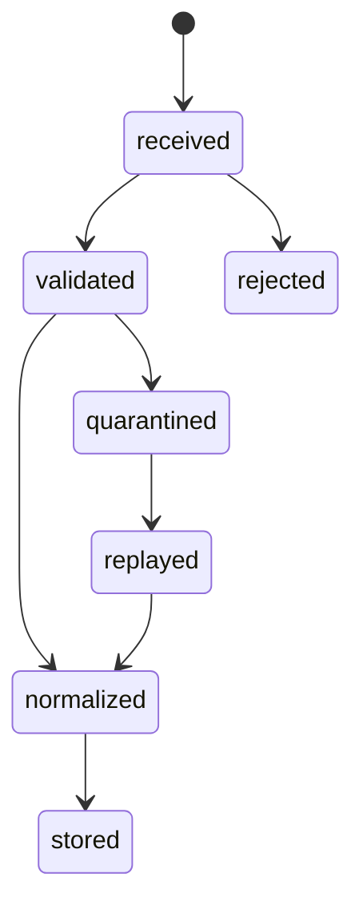
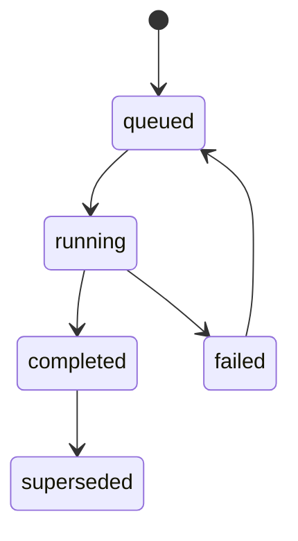
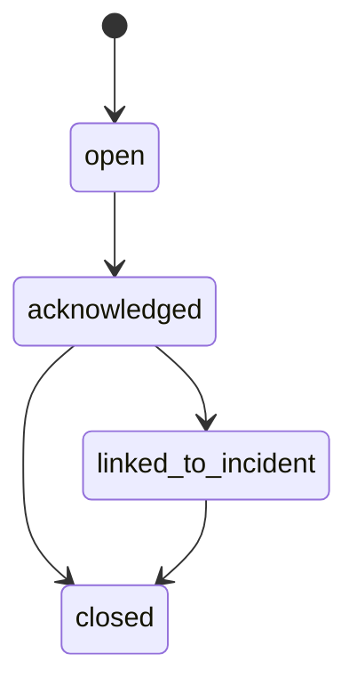
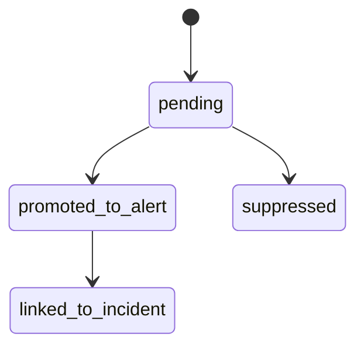

# SD-09 — Telemetry & Reconciliation / 事件遙測、對帳與 Drift 設計

版本：v0.1 Codex-ready draft  
適用範圍：Pantheon Telemetry Plane、Reconciliation & Drift Plane、`lean-platform` runtime event ingestion、Metrics/Time-Series Store  
來源準繩：Pantheon 總索引版系統分析文件 v1 Consolidated、openclaw strategy lifecycle、openclaw multi-persona implementation architecture

---

## 1. Purpose

本文件定義 Pantheon 的 **Telemetry & Reconciliation Plane**。這一層負責把 `lean-platform`、operator、promotion、capital pool、research run、consultation、trainer session 等系統事實轉成 canonical events，再以可回放、可對帳、可觸發 drift / incident / evolution 的方式儲存。

此 SD 的核心不是「監控 dashboard」，而是讓 Pantheon 具備 operating system 的事實回流能力：

```text
Runtime / Operator / Governance Events
→ Event Ingest Gateway
→ Canonical Event Normalizer
→ Telemetry Store / Metrics Store / Audit Log
→ Reconciliation Runs
→ Drift Reports
→ Alert Candidates
→ SD-10 Incident / Postmortem / Evolution
```

核心目標：

1. 統一事件 envelope，所有事件必須帶 `trace_id`、`correlation_id`、`environment`、`event_time`、`ingest_time`。
2. 將 order / fill / position / heartbeat / runtime action / deployment / approval / trainer / consult 事件正規化。
3. 支援 backtest-paper-canary-live reconciliation。
4. 支援 order / fill / position / broker snapshot reconciliation。
5. 偵測 feature drift、label drift、policy drift、execution drift、runtime health drift。
6. 對超門檻 drift 產生 `AlertCandidate`，交給 SD-10 決定是否開 incident。
7. 所有 ingestion / reconciliation / alert candidate creation 都必須 idempotent。

Non-goals：

- 不負責建立 IncidentCase；那是 SD-10。
- 不負責下達 pause / rollback / liquidate；那是 SD-08/SD-10/SD-12 共同約束的 command path。
- 不負責定義新的 trading strategy 或 research backend。

---

## 2. Repo ownership

| Repo | Ownership |
|---|---|
| `pantheon` | Event Ingest Gateway、Canonical Event Normalizer、Telemetry Store、Metrics Store adapter、Reconciliation service、Drift detector、AlertCandidate producer。 |
| `lean-platform` | Runtime event producer。依 SD-08 發送 heartbeat、order、fill、position、broker、runtime action events。 |
| `front-ai-trading-system` | Telemetry / reconciliation / drift dashboard consumer；不得直接寫 telemetry truth。 |
| `Lean` | Upstream reference only。不得直接成為 Pantheon telemetry authority。 |

---

## 3. Module paths

### `pantheon`

```text
services/telemetry/
  __init__.py
  models.py
  event_envelope.py
  commands.py
  queries.py
  events.py
  ingest_gateway.py
  canonical_normalizer.py
  telemetry_store.py
  metric_store.py
  heartbeat_service.py
  audit_projection.py
  idempotency.py
  api.py
  exceptions.py
  tests/
    test_event_envelope.py
    test_ingest_gateway.py
    test_canonical_normalizer.py
    test_heartbeat_service.py
    test_metric_store.py

services/reconciliation/
  __init__.py
  models.py
  commands.py
  queries.py
  events.py
  baseline_resolver.py
  reconciliation_runner.py
  order_fill_position_reconciler.py
  backtest_paper_live_reconciler.py
  drift_detectors.py
  alert_candidate_producer.py
  policies.py
  repository.py
  api.py
  tests/
    test_baseline_resolver.py
    test_reconciliation_runner.py
    test_order_fill_position_reconciler.py
    test_backtest_paper_live_reconciler.py
    test_drift_detectors.py
    test_alert_candidate_producer.py

docs/sd/09_telemetry_reconciliation.md
docs/contracts/event_envelope.schema.json
docs/contracts/telemetry_event.schema.json
docs/contracts/runtime_heartbeat.schema.json
docs/contracts/metric_sample.schema.json
docs/contracts/reconciliation_record.schema.json
docs/contracts/drift_report.schema.json
docs/contracts/alert_candidate.schema.json
docs/codex/SD-09_task_packets.md
```

### `lean-platform`

```text
Pantheon/Telemetry/
  PantheonEventEnvelope.cs
  RuntimeEventEmitter.cs
  HeartbeatEmitter.cs
  OrderEventMapper.cs
  FillEventMapper.cs
  PositionEventMapper.cs
  BrokerEventMapper.cs
  DeliveryCheckpointStore.cs
  TelemetryRetryPolicy.cs
```

### `front-ai-trading-system`

```text
src/pages/operator/TelemetryDashboard.tsx
src/pages/operator/ReconciliationRuns.tsx
src/pages/operator/DriftReports.tsx
src/pages/operator/RuntimeHealthTimeline.tsx
src/lib/telemetryClient.ts
src/lib/reconciliationClient.ts
src/types/telemetry.ts
src/types/reconciliation.ts
```

---

## 4. Domain model

### 4.1 `EventEnvelope`

```yaml
EventEnvelope:
  event_id: string
  event_type: string
  schema_version: string
  event_time: datetime
  available_time: datetime | null
  ingest_time: datetime
  environment: enum[dev, sandbox, paper, canary, live]
  source_system: string
  source_instance: string | null
  actor_ref: string | null
  trace_id: string
  correlation_id: string
  idempotency_key: string
  payload: object
  payload_checksum: string
  metadata:
    capital_pool_id: string | null
    runtime_id: string | null
    runtime_binding_id: string | null
    artifact_id: string | null
    strategy_id: string | null
    persona_id: string | null
    broker_account_ref: string | null
```

### 4.2 `TelemetryEvent`

```yaml
TelemetryEvent:
  event_id: string
  envelope: EventEnvelope
  canonical_type: enum[
    runtime_heartbeat,
    order_submitted,
    order_updated,
    order_cancelled,
    fill_received,
    position_snapshot,
    broker_snapshot,
    runtime_action_requested,
    runtime_action_result,
    deployment_state_changed,
    approval_recorded,
    trainer_event,
    consult_event,
    operator_action
  ]
  normalized_payload: object
  normalization_status: enum[accepted, rejected, quarantined]
  rejection_reason: string | null
```

### 4.3 `RuntimeHeartbeat`

```yaml
RuntimeHeartbeat:
  runtime_id: string
  runtime_binding_id: string
  capital_pool_id: string
  artifact_id: string
  deployment_mode: enum[paper, canary, live]
  heartbeat_time: datetime
  connectivity_status: enum[connected, degraded, disconnected]
  broker_status: enum[ok, degraded, unavailable]
  queue_lag_ms: int | null
  event_delivery_lag_ms: int | null
  health_summary: object
```

### 4.4 `MetricSample`

```yaml
MetricSample:
  metric_id: string
  metric_name: string
  scope_type: enum[runtime, pool, strategy, artifact, persona, system]
  scope_id: string
  ts: datetime
  value: number
  unit: string | null
  tags: object
  source_event_id: string | null
```

### 4.5 `ReconciliationRun`

```yaml
ReconciliationRun:
  recon_run_id: string
  recon_type: enum[backtest_paper_live, order_fill_position, feature_drift, policy_drift, execution_drift, runtime_health]
  scope_type: enum[strategy, artifact, runtime, capital_pool, deployment_plan]
  scope_id: string
  baseline_ref: string
  current_ref: string
  status: enum[queued, running, completed, failed, superseded]
  policy_id: string
  started_at: datetime | null
  finished_at: datetime | null
  triggered_by: string
  trace_id: string
```

### 4.6 `ReconciliationRecord`

```yaml
ReconciliationRecord:
  record_id: string
  recon_run_id: string
  recon_type: string
  scope_ref: string
  expected_ref: string
  actual_ref: string
  delta_summary: object
  severity: enum[none, low, medium, high, critical]
  status: enum[pass, warn, fail]
  evidence_refs: list[string]
  generated_at: datetime
```

### 4.7 `DriftReport`

```yaml
DriftReport:
  drift_report_id: string
  recon_run_id: string
  drift_type: enum[feature, label, policy, execution, runtime_health, pnl, cost, slippage]
  scope_ref: string
  baseline_ref: string
  current_ref: string
  severity: enum[low, medium, high, critical]
  metrics: object
  evidence_refs: list[string]
  recommended_action: enum[observe, rerun_research, open_incident, freeze, pause, rollback, retire]
  status: enum[open, acknowledged, linked_to_incident, closed]
  generated_at: datetime
```

### 4.8 `AlertCandidate`

```yaml
AlertCandidate:
  alert_candidate_id: string
  source_type: enum[heartbeat, reconciliation, drift, metric_threshold, audit_anomaly]
  source_ref: string
  rule_id: string
  severity: enum[low, medium, high, critical]
  scope_ref: string
  summary: string
  evidence_refs: list[string]
  suggested_incident_category: string | null
  idempotency_key: string
  status: enum[pending, promoted_to_alert, suppressed]
```

---

## 5. Commands

```yaml
IngestTelemetryEvents:
  input: EventEnvelope[]
  output: IngestResult
  idempotent_by: envelope.idempotency_key

RecordHeartbeat:
  input: RuntimeHeartbeat
  output: TelemetryEvent
  idempotent_by: runtime_id + heartbeat_time

StartReconciliationRun:
  input:
    recon_type: string
    scope_type: string
    scope_id: string
    baseline_ref: string | null
    current_ref: string | null
    policy_id: string
  output: ReconciliationRun
  idempotent_by: recon_type + scope_type + scope_id + baseline_ref + current_ref + policy_id

RunReconciliationWindow:
  input:
    window_start: datetime
    window_end: datetime
    scope_filter: object
  output: list[ReconciliationRun]

AcknowledgeDriftReport:
  input:
    drift_report_id: string
    actor_ref: string
    note: string
  output: DriftReport

CloseDriftReport:
  input:
    drift_report_id: string
    resolution: string
  output: DriftReport

BackfillTelemetryWindow:
  input:
    source_system: string
    start: datetime
    end: datetime
    replay_mode: enum[validate_only, write_missing, overwrite_quarantined]
  output: BackfillReport
```

---

## 6. Queries

```yaml
GetTelemetryEvent:
  input: { event_id: string }
  output: TelemetryEvent

SearchTelemetryEvents:
  input:
    event_type: string | null
    environment: string | null
    runtime_id: string | null
    capital_pool_id: string | null
    artifact_id: string | null
    trace_id: string | null
    start: datetime
    end: datetime
  output: list[TelemetryEvent]

GetRuntimeHeartbeatStatus:
  input: { runtime_id: string }
  output: RuntimeHeartbeatStatus

GetMetricSeries:
  input:
    metric_name: string
    scope_type: string
    scope_id: string
    start: datetime
    end: datetime
  output: list[MetricSample]

GetReconciliationRun:
  input: { recon_run_id: string }
  output: ReconciliationRun

ListReconciliationRecords:
  input: { recon_run_id: string }
  output: list[ReconciliationRecord]

ListDriftReports:
  input:
    severity: string | null
    status: string | null
    scope_type: string | null
    scope_id: string | null
  output: list[DriftReport]

ListAlertCandidates:
  input: { status: string, severity: string | null }
  output: list[AlertCandidate]
```

---

## 7. Events

### 7.1 Input events from SD-08 / `lean-platform`

```text
RuntimeHeartbeatReceived
OrderSubmitted
OrderUpdated
OrderCancelled
FillReceived
PositionSnapshotReceived
BrokerSnapshotReceived
RuntimeActionResultReceived
```

### 7.2 Internal telemetry events

```text
TelemetryEventAccepted
TelemetryEventRejected
TelemetryEventQuarantined
MetricSampleRecorded
HeartbeatStatusChanged
TelemetryBackfillStarted
TelemetryBackfillCompleted
```

### 7.3 Reconciliation / drift events

```text
ReconciliationRunQueued
ReconciliationRunStarted
ReconciliationRunCompleted
ReconciliationRecordCreated
DriftReportCreated
DriftReportAcknowledged
AlertCandidateCreated
```

### 7.4 Event envelope requirement

All events emitted by this SD must use:

```yaml
required:
  - event_id
  - event_type
  - schema_version
  - event_time
  - ingest_time
  - environment
  - trace_id
  - correlation_id
  - idempotency_key
```

---

## 8. State machines

### 8.1 Telemetry event lifecycle



### 8.2 Reconciliation run lifecycle



### 8.3 Drift report lifecycle



### 8.4 Alert candidate lifecycle



---

## 9. Hard invariants

1. Every telemetry event must include `trace_id`, `correlation_id`, `environment`, `event_time`, `ingest_time`, `schema_version`.
2. Every runtime event from `lean-platform` must include `runtime_binding_id`, `runtime_id`, `artifact_id`, `capital_pool_id`, and `deployment_mode`.
3. Telemetry ingest must be idempotent by `idempotency_key` and `payload_checksum`.
4. Telemetry event timestamps must not be rewritten after acceptance; corrections must be new events.
5. Reconciliation must never compare live behavior against mutable / unfrozen baselines.
6. Backtest-paper-live reconciliation must reference the original `ExperimentRun`, `CandidateArtifact`, and `DeploymentPlan` lineage.
7. Order/fill/position reconciliation must include broker snapshot or explicitly record why unavailable.
8. Drift reports cannot directly mutate persona, artifact, pool, or runtime state.
9. Drift reports above policy threshold must produce `AlertCandidate`; SD-10 decides incident promotion.
10. Missing live heartbeat beyond policy threshold must produce an alert candidate.
11. Quarantined events must not be used by reconciliation until replayed and accepted.
12. BFF / frontend must read telemetry through query APIs only; they cannot write canonical telemetry except governed operator action events.

---

## 10. Policy hooks

```yaml
telemetry_policy:
  id: default_telemetry_policy_v1
  ingestion:
    allowed_source_systems:
      - lean-platform
      - pantheon-bff
      - promotion-controller
      - research-orchestrator
      - consultation-plane
    quarantine_unknown_schema: true
    reject_missing_trace_id: true
    max_event_time_skew_seconds: 300
  heartbeat:
    max_missing_seconds:
      paper: 120
      canary: 60
      live: 30
  backfill:
    allow_overwrite_quarantined: true
    allow_overwrite_accepted: false

reconciliation_policy:
  id: default_reconciliation_policy_v1
  schedules:
    runtime_health: "*/1 * * * *"
    order_fill_position: "*/2 * * * *"
    backtest_paper_live: "0 */1 * * *"
  baseline:
    require_frozen_dataset_version: true
    require_artifact_checksum: true
  severity_thresholds:
    slippage_bps_warn: 25
    slippage_bps_critical: 100
    fill_mismatch_critical: true
    missing_position_snapshot_minutes: 5

drift_policy:
  id: default_drift_policy_v1
  feature_drift:
    psi_warn: 0.10
    psi_critical: 0.25
  execution_drift:
    realized_cost_vs_expected_bps_warn: 30
    realized_cost_vs_expected_bps_critical: 100
  action_mapping:
    low: observe
    medium: rerun_research
    high: open_incident
    critical: open_incident
```

Policy-configurable decisions:

| Decision | Policy |
|---|---|
| heartbeat timeout | `telemetry_policy.heartbeat` |
| event quarantine vs reject | `telemetry_policy.ingestion` |
| reconciliation cadence | `reconciliation_policy.schedules` |
| severity thresholds | `reconciliation_policy.severity_thresholds` / `drift_policy` |
| alert candidate suppression | SD-10 alert policy |
| baseline selection | `baseline_resolver` + `reconciliation_policy.baseline` |

---

## 11. Storage model

Recommended tables / collections in `pantheon`:

```text
telemetry_events
telemetry_event_payloads
telemetry_event_quarantine
telemetry_ingest_batches
runtime_heartbeats
runtime_health_snapshots
metric_samples
audit_event_projection
reconciliation_runs
reconciliation_records
drift_reports
alert_candidates
telemetry_idempotency_keys
telemetry_dlq
```

Recommended indexes:

```text
telemetry_events(trace_id)
telemetry_events(correlation_id)
telemetry_events(event_type, event_time)
telemetry_events(runtime_binding_id, event_time)
telemetry_events(capital_pool_id, event_time)
runtime_heartbeats(runtime_id, heartbeat_time desc)
metric_samples(metric_name, scope_type, scope_id, ts)
reconciliation_runs(scope_type, scope_id, recon_type, status)
drift_reports(scope_ref, severity, status)
alert_candidates(status, severity, rule_id)
```

Storage requirements:

1. Event payloads should be immutable after accepted.
2. Large payloads may be stored in object storage with checksum and `payload_ref`.
3. Quarantine must preserve raw envelope and rejection reason.
4. Reconciliation outputs must reference source event ids and baseline refs.
5. Audit projection may be derived, but source telemetry events must remain authoritative.

---

## 12. API endpoints

### Telemetry ingest

```text
POST /api/v1/telemetry/events
POST /api/v1/telemetry/heartbeats
POST /api/v1/telemetry/backfill
GET  /api/v1/telemetry/events/{event_id}
GET  /api/v1/telemetry/events
GET  /api/v1/telemetry/runtime/{runtime_id}/heartbeat
GET  /api/v1/telemetry/metrics
```

### Reconciliation / drift

```text
POST /api/v1/reconciliation/runs
POST /api/v1/reconciliation/runs/window
GET  /api/v1/reconciliation/runs
GET  /api/v1/reconciliation/runs/{recon_run_id}
GET  /api/v1/reconciliation/runs/{recon_run_id}/records
GET  /api/v1/drift/reports
GET  /api/v1/drift/reports/{drift_report_id}
POST /api/v1/drift/reports/{drift_report_id}/ack
POST /api/v1/drift/reports/{drift_report_id}/close
GET  /api/v1/alert-candidates
```

### SSE / realtime topics for BFF

```text
/stream/telemetry/runtime-health
/stream/telemetry/ingest-status
/stream/reconciliation/runs
/stream/drift/reports
/stream/alert-candidates
```

---

## 13. Integration points

| Integration | Contract |
|---|---|
| SD-08 Execution Runtime Binding | Consumes runtime heartbeat/order/fill/position/broker events. |
| SD-07 Promotion / Deployment | Consumes deployment plan, approval decision, rollback lineage as baselines. |
| SD-06 Capital Pool | Uses risk policy and pool state to interpret telemetry severity. |
| SD-04 Research Orchestrator | Uses ExperimentRun / artifact baseline for reconciliation. |
| SD-01 Registry Backbone | Writes lineage references and reads artifact / strategy / experiment truth. |
| SD-10 Incident / Evolution | Receives AlertCandidate and DriftReport; may create IncidentCase / EvolutionDecision. |
| SD-11 BFF / Console | Provides read models and SSE for telemetry dashboards. |
| SD-12 Cross-Cutting | Uses trace/idempotency/RBAC/clock/secret policies. |

---

## 14. Tests

### Unit tests

1. `EventEnvelope` rejects missing `trace_id`.
2. `EventEnvelope` rejects missing `idempotency_key`.
3. Normalizer maps `lean-platform` fill event to canonical `fill_received`.
4. Unknown schema version is quarantined under policy.
5. Duplicate telemetry event returns existing result.
6. Heartbeat status changes from connected to degraded to disconnected.
7. Reconciliation run requires frozen baseline.
8. Drift detector produces severity according to policy.
9. Alert candidate producer deduplicates by idempotency key.

### Integration tests

1. SD-08 emits heartbeat → SD-09 stores heartbeat → runtime health query returns latest status.
2. SD-08 emits order/fill/position → reconciliation detects no mismatch.
3. Broker snapshot differs from internal position → reconciliation creates high severity record.
4. Backtest baseline vs paper runtime performance deviation → drift report created.
5. Missing live heartbeat → alert candidate created.
6. Quarantined event is not used in reconciliation until replayed.

### Contract tests

1. `event_envelope.schema.json` validates all telemetry events.
2. `runtime_heartbeat.schema.json` validates heartbeat payload.
3. `reconciliation_record.schema.json` validates reconciliation output.
4. `drift_report.schema.json` validates drift report.
5. `alert_candidate.schema.json` validates alert candidate.

### Frontend tests

1. Runtime health page renders live heartbeat status.
2. Reconciliation page groups records by severity.
3. Drift report detail shows evidence refs and recommended action.
4. SSE updates dashboard without creating duplicate rows.

---

## 15. Definition of Done

SD-09 is done when:

1. Pantheon accepts canonical telemetry events through a validated ingest gateway.
2. `lean-platform` runtime events are accepted, normalized, and queryable.
3. Runtime heartbeat status is computed and exposed.
4. Backtest-paper-live reconciliation can run for at least one approved artifact.
5. Order/fill/position reconciliation can compare internal state and broker snapshot.
6. Drift reports are generated from reconciliation outputs.
7. Alert candidates are created for policy-defined critical conditions.
8. All accepted telemetry events are immutable, idempotent, and traceable.
9. Frontend can display runtime health, reconciliation runs, and drift reports.
10. SD-10 can consume alert candidates and drift reports without custom glue.

---

## 16. Codex task packets

### PTH-SD09-001 — Implement telemetry event envelope and contracts

```yaml
task_id: PTH-SD09-001
repo: ajoe734/pantheon
goal: Implement EventEnvelope, TelemetryEvent, RuntimeHeartbeat, MetricSample models and JSON schemas.
target_paths:
  - services/telemetry/models.py
  - services/telemetry/event_envelope.py
  - docs/contracts/event_envelope.schema.json
  - docs/contracts/telemetry_event.schema.json
  - docs/contracts/runtime_heartbeat.schema.json
acceptance_tests:
  - missing trace_id rejected
  - missing idempotency_key rejected
  - runtime event requires runtime_binding_id, artifact_id, capital_pool_id
```

### PTH-SD09-002 — Implement telemetry ingest gateway and normalizer

```yaml
task_id: PTH-SD09-002
repo: ajoe734/pantheon
goal: Accept batches of event envelopes, validate schema, normalize canonical type, quarantine invalid events.
target_paths:
  - services/telemetry/ingest_gateway.py
  - services/telemetry/canonical_normalizer.py
  - services/telemetry/idempotency.py
  - services/telemetry/tests/test_ingest_gateway.py
acceptance_tests:
  - duplicate event returns existing ingest result
  - unknown schema quarantined when policy says quarantine
  - fill event normalized to fill_received
```

### PTH-SD09-003 — Implement heartbeat and metric store

```yaml
task_id: PTH-SD09-003
repo: ajoe734/pantheon
goal: Store runtime heartbeats, compute heartbeat status, and persist metric samples.
target_paths:
  - services/telemetry/heartbeat_service.py
  - services/telemetry/metric_store.py
  - services/telemetry/tests/test_heartbeat_service.py
acceptance_tests:
  - latest heartbeat returned by runtime_id
  - missing live heartbeat creates disconnected status by policy
  - metric sample stored with scope and source_event_id
```

### PTH-SD09-004 — Implement reconciliation runner

```yaml
task_id: PTH-SD09-004
repo: ajoe734/pantheon
goal: Implement ReconciliationRun, baseline resolver, and reconciliation record generation.
target_paths:
  - services/reconciliation/models.py
  - services/reconciliation/baseline_resolver.py
  - services/reconciliation/reconciliation_runner.py
  - services/reconciliation/repository.py
  - docs/contracts/reconciliation_record.schema.json
acceptance_tests:
  - rejects mutable baseline
  - creates completed reconciliation run with records
  - failed run records blocking reason
```

### PTH-SD09-005 — Implement order/fill/position reconciliation

```yaml
task_id: PTH-SD09-005
repo: ajoe734/pantheon
goal: Compare internal target/order/fill/position data against broker snapshots and emit reconciliation records.
target_paths:
  - services/reconciliation/order_fill_position_reconciler.py
  - services/reconciliation/tests/test_order_fill_position_reconciler.py
acceptance_tests:
  - matching broker snapshot produces pass record
  - missing fill produces fail record
  - position mismatch produces high severity record
```

### PTH-SD09-006 — Implement drift detectors and alert candidate producer

```yaml
task_id: PTH-SD09-006
repo: ajoe734/pantheon
goal: Generate DriftReport and AlertCandidate from reconciliation records according to policy.
target_paths:
  - services/reconciliation/drift_detectors.py
  - services/reconciliation/alert_candidate_producer.py
  - services/reconciliation/policies.py
  - docs/contracts/drift_report.schema.json
  - docs/contracts/alert_candidate.schema.json
acceptance_tests:
  - high drift produces alert candidate
  - low drift maps to observe recommendation
  - alert candidate deduplicates by idempotency key
```

### PTH-SD09-007 — Implement frontend telemetry and drift views

```yaml
task_id: PTH-SD09-007
repo: ajoe734/front-ai-trading-system
goal: Add telemetry dashboard, reconciliation run list, drift report details, and SSE updates.
target_paths:
  - src/pages/operator/TelemetryDashboard.tsx
  - src/pages/operator/ReconciliationRuns.tsx
  - src/pages/operator/DriftReports.tsx
  - src/lib/telemetryClient.ts
  - src/lib/reconciliationClient.ts
acceptance_tests:
  - runtime health renders latest heartbeat
  - drift reports show severity, evidence refs, recommended action
  - SSE update does not duplicate records
```
