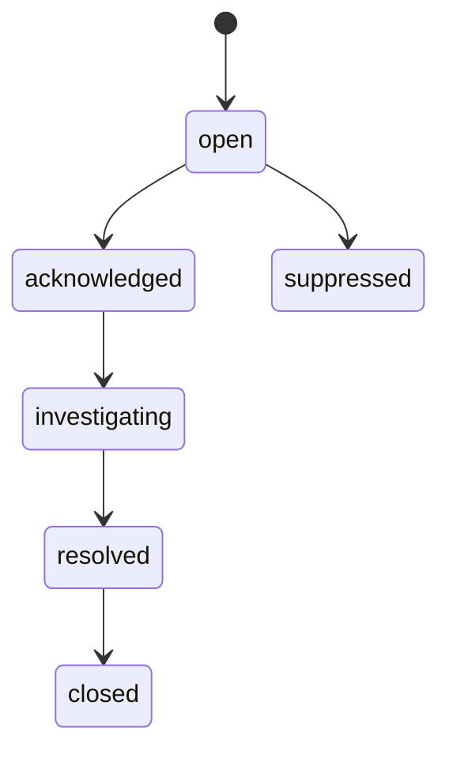
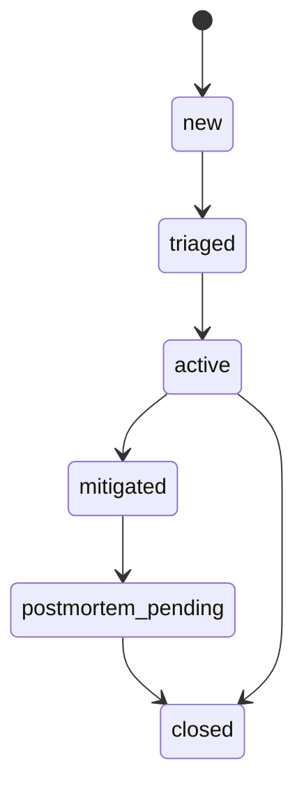
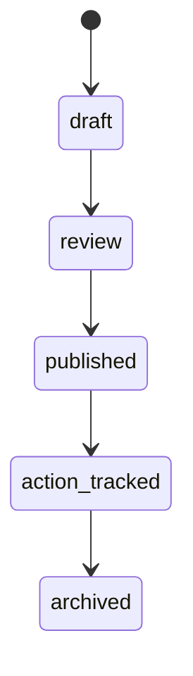
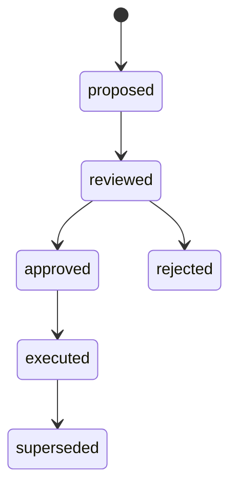
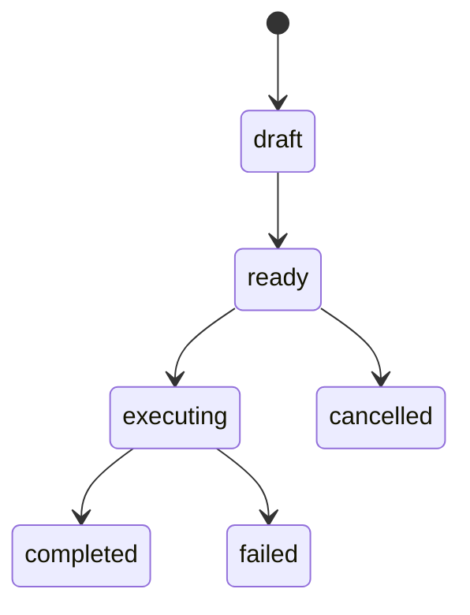

# SD-10 — Incident, Postmortem & Evolution / 事故、復盤與演化控制設計

版本：v0.1 Codex-ready draft  
適用範圍：Pantheon Incident / Postmortem Plane、Evolution Plane、Alert Rules、Corrective Actions、EvolutionDecision Registry  
來源準繩：Pantheon 總索引版系統分析文件 v1 Consolidated、openclaw strategy lifecycle、openclaw multi-persona implementation architecture

---

## 1. Purpose

本文件定義 Pantheon 的 **Incident / Postmortem / Evolution Plane**。SD-09 產生 drift reports 與 alert candidates；SD-10 將它們升級為 alerts、incidents、postmortems、corrective actions 與 evolution decisions。

這一層讓 Pantheon 不只是「監控」交易系統，而是能從 live 事實中產生可治理的變更：

```text
AlertCandidate / DriftReport
→ AlertEvent
→ IncidentCase
→ Evidence Collection
→ Postmortem
→ CorrectiveAction
→ EvolutionDecision
→ retrain / revalidate / freeze / rollback / retire / mutate persona / update policy
```

核心目標：

1. 將 SD-09 的 alert candidate / drift report 轉成 governed incident lifecycle。
2. 將事件、runtime、artifact、capital pool、approval、consult memo、operator action 收集成 incident evidence。
3. 產生可審查、可發布、可追蹤 corrective action 的 postmortem。
4. 將 postmortem / drift / audit / telemetry 輸出成 `EvolutionDecision`，但不直接越權修改 live system。
5. 保留動態調整空間：evolution 決策由 policy 決定，hard invariants 保護底線。

Non-goals：

- 不直接執行 runtime pause / rollback / liquidate；它產生 governed command 或 action plan，實際執行由 SD-08 / SD-12 受控 path 完成。
- 不訓練模型；它觸發 SD-04 research/retrain/revalidate task。
- 不直接修改 persona 行為；它提出 persona mutation plan，需走 SD-02 / SD-05 / SD-07 gate。

---

## 2. Repo ownership

| Repo | Ownership |
|---|---|
| `pantheon` | Alert Engine、Incident Case Manager、Evidence Collector、Postmortem Builder、Action Recommendation Engine、Evolution Controller、EvolutionDecision Registry。 |
| `front-ai-trading-system` | Alerts / Incidents / Postmortems / Evolution Workbench UI；operator action forms；timeline views。 |
| `lean-platform` | Runtime evidence source；可接收由 SD-08 批准的 pause / replace / liquidate actions。 |
| `Lean` | Upstream reference only；不參與 incident/evolution authority。 |

---

## 3. Module paths

### `pantheon`

```text
services/incident/
  __init__.py
  models.py
  commands.py
  queries.py
  events.py
  alert_engine.py
  alert_rule_repository.py
  incident_classifier.py
  incident_case_manager.py
  evidence_collector.py
  postmortem_builder.py
  action_recommender.py
  policies.py
  repository.py
  api.py
  exceptions.py
  tests/
    test_alert_engine.py
    test_incident_classifier.py
    test_incident_case_manager.py
    test_evidence_collector.py
    test_postmortem_builder.py
    test_action_recommender.py

services/evolution/
  __init__.py
  models.py
  commands.py
  queries.py
  events.py
  evolution_controller.py
  decision_registry.py
  revalidate_trigger.py
  retrain_trigger.py
  persona_mutation_planner.py
  strategy_freeze_retire_planner.py
  policy_update_planner.py
  execution_action_planner.py
  policies.py
  repository.py
  api.py
  exceptions.py
  tests/
    test_evolution_controller.py
    test_decision_registry.py
    test_revalidate_trigger.py
    test_persona_mutation_planner.py
    test_strategy_freeze_retire_planner.py

docs/sd/10_incident_postmortem_evolution.md
docs/contracts/alert_event.schema.json
docs/contracts/incident_case.schema.json
docs/contracts/postmortem.schema.json
docs/contracts/corrective_action.schema.json
docs/contracts/evolution_decision.schema.json
docs/contracts/evolution_action_plan.schema.json
docs/codex/SD-10_task_packets.md
```

### `front-ai-trading-system`

```text
src/pages/operator/AlertsPanel.tsx
src/pages/operator/IncidentList.tsx
src/pages/operator/IncidentDetail.tsx
src/pages/evolution/PostmortemWorkbench.tsx
src/pages/evolution/EvolutionDecisionList.tsx
src/pages/evolution/EvolutionDecisionDetail.tsx
src/lib/incidentClient.ts
src/lib/evolutionClient.ts
src/types/incident.ts
src/types/evolution.ts
```

---

## 4. Domain model

### 4.1 `AlertRule`

```yaml
AlertRule:
  rule_id: string
  name: string
  source_type: enum[heartbeat, drift, reconciliation, metric, audit]
  scope_filter: object
  severity_mapping: object
  suppression_policy: object
  enabled: bool
  owner: string
  version: string
```

### 4.2 `AlertEvent`

```yaml
AlertEvent:
  alert_id: string
  alert_candidate_id: string | null
  rule_id: string
  scope_ref: string
  severity: enum[low, medium, high, critical]
  status: enum[open, acknowledged, investigating, resolved, closed, suppressed]
  summary: string
  evidence_refs: list[string]
  opened_at: datetime
  acknowledged_at: datetime | null
  closed_at: datetime | null
  linked_incident_id: string | null
  idempotency_key: string
```

### 4.3 `IncidentCase`

```yaml
IncidentCase:
  incident_id: string
  category: enum[runtime_health, execution_drift, pnl_drift, policy_violation, data_quality, broker, operator_action, security]
  severity: enum[low, medium, high, critical]
  status: enum[new, triaged, active, mitigated, postmortem_pending, closed]
  owner: string | null
  opened_at: datetime
  closed_at: datetime | null
  scope_refs: list[string]
  related_alerts: list[string]
  related_runtime_bindings: list[string]
  related_artifacts: list[string]
  related_capital_pools: list[string]
  evidence_bundle_id: string | null
  mitigation_actions: list[string]
  trace_id: string
```

### 4.4 `IncidentTimelineEntry`

```yaml
IncidentTimelineEntry:
  entry_id: string
  incident_id: string
  timestamp: datetime
  actor_ref: string | null
  entry_type: enum[event, action, note, state_transition, evidence_added, recommendation]
  summary: string
  source_ref: string | null
  payload: object
```

### 4.5 `Postmortem`

```yaml
Postmortem:
  postmortem_id: string
  incident_id: string
  status: enum[draft, review, published, action_tracked, archived]
  impact_summary: string
  timeline: list[IncidentTimelineEntry]
  root_cause: string
  contributing_factors: list[string]
  corrective_actions: list[CorrectiveAction]
  evidence_refs: list[string]
  reviewer_refs: list[string]
  published_at: datetime | null
```

### 4.6 `CorrectiveAction`

```yaml
CorrectiveAction:
  action_id: string
  postmortem_id: string
  action_type: enum[retrain, revalidate, freeze, rollback, retire, update_policy, mutate_persona, update_data_source, improve_test]
  target_type: enum[strategy, artifact, persona, capital_pool, runtime, policy, dataset, connector]
  target_id: string
  priority: enum[low, medium, high, urgent]
  owner: string | null
  status: enum[proposed, approved, in_progress, completed, rejected]
  due_at: datetime | null
  evidence_refs: list[string]
```

### 4.7 `EvolutionDecision`

```yaml
EvolutionDecision:
  decision_id: string
  target_type: enum[strategy, artifact, persona, alpha_template, policy, capital_pool, runtime, data_source]
  target_id: string
  decision_type: enum[retrain, revalidate, freeze, rollback, retire, split, merge, mutate_persona, update_policy, update_gate, update_source_policy]
  reason: string
  evidence_refs: list[string]
  linked_postmortem_id: string | null
  linked_drift_report_ids: list[string]
  status: enum[proposed, reviewed, approved, rejected, executed, superseded]
  effective_scope: enum[research, paper, canary, live, global]
  proposed_by: string
  approved_by: string | null
  timestamp: datetime
  policy_id: string
```

### 4.8 `EvolutionActionPlan`

```yaml
EvolutionActionPlan:
  plan_id: string
  decision_id: string
  actions: list[object]
  required_approvals: list[string]
  target_services: list[string]
  rollback_plan_ref: string | null
  risk_note: string
  status: enum[draft, ready, executing, completed, failed, cancelled]
```

---

## 5. Commands

```yaml
EvaluateAlertCandidates:
  input: { candidate_ids: list[string] | null, window: object | null }
  output: list[AlertEvent]

AcknowledgeAlert:
  input: { alert_id: string, actor_ref: string, note: string }
  output: AlertEvent

OpenIncident:
  input:
    alert_ids: list[string]
    category: string | null
    severity: string | null
    owner: string | null
  output: IncidentCase
  idempotent_by: sorted(alert_ids) + category

TriageIncident:
  input:
    incident_id: string
    owner: string
    category: string
    severity: string
    note: string
  output: IncidentCase

AddIncidentTimelineEntry:
  input:
    incident_id: string
    entry_type: string
    summary: string
    source_ref: string | null
    payload: object
  output: IncidentTimelineEntry

MitigateIncident:
  input:
    incident_id: string
    mitigation_actions: list[string]
    note: string
  output: IncidentCase

BuildPostmortemDraft:
  input: { incident_id: string }
  output: Postmortem

PublishPostmortem:
  input:
    postmortem_id: string
    reviewer_refs: list[string]
  output: Postmortem

ProposeEvolutionDecision:
  input:
    target_type: string
    target_id: string
    decision_type: string
    evidence_refs: list[string]
    linked_postmortem_id: string | null
  output: EvolutionDecision

ReviewEvolutionDecision:
  input:
    decision_id: string
    reviewer: string
    decision: enum[approved, rejected]
    note: string
  output: EvolutionDecision

CreateEvolutionActionPlan:
  input: { decision_id: string }
  output: EvolutionActionPlan

ExecuteEvolutionActionPlan:
  input: { plan_id: string, actor_ref: string }
  output: EvolutionActionPlan
```

---

## 6. Queries

```yaml
ListAlerts:
  input: { status: string | null, severity: string | null, scope_ref: string | null }
  output: list[AlertEvent]

GetAlert:
  input: { alert_id: string }
  output: AlertEvent

ListIncidents:
  input: { status: string | null, severity: string | null, category: string | null }
  output: list[IncidentCase]

GetIncident:
  input: { incident_id: string }
  output: IncidentCase

GetIncidentTimeline:
  input: { incident_id: string }
  output: list[IncidentTimelineEntry]

GetIncidentEvidenceBundle:
  input: { incident_id: string }
  output: EvidenceBundle

ListPostmortems:
  input: { status: string | null, incident_id: string | null }
  output: list[Postmortem]

GetPostmortem:
  input: { postmortem_id: string }
  output: Postmortem

ListEvolutionDecisions:
  input: { status: string | null, target_type: string | null, decision_type: string | null }
  output: list[EvolutionDecision]

GetEvolutionDecision:
  input: { decision_id: string }
  output: EvolutionDecision

GetEvolutionActionPlan:
  input: { plan_id: string }
  output: EvolutionActionPlan
```

---

## 7. Events

### Alert / incident events

```text
AlertCreated
AlertAcknowledged
AlertSuppressed
IncidentOpened
IncidentTriaged
IncidentTimelineEntryAdded
IncidentMitigated
IncidentClosed
```

### Postmortem events

```text
PostmortemDraftCreated
PostmortemMovedToReview
PostmortemPublished
CorrectiveActionProposed
CorrectiveActionApproved
CorrectiveActionCompleted
```

### Evolution events

```text
EvolutionDecisionProposed
EvolutionDecisionReviewed
EvolutionDecisionApproved
EvolutionDecisionRejected
EvolutionActionPlanCreated
EvolutionActionPlanExecuted
EvolutionActionPlanFailed
```

### Downstream request events

```text
ResearchRevalidationRequested
RetrainRequested
StrategyFreezeRequested
StrategyRetireRequested
RuntimeRollbackRequested
PersonaMutationReviewRequested
PolicyUpdateRequested
```

---

## 8. State machines

### 8.1 Alert lifecycle



### 8.2 Incident lifecycle



### 8.3 Postmortem lifecycle



### 8.4 Evolution decision lifecycle



### 8.5 Evolution action plan lifecycle



---

## 9. Hard invariants

1. IncidentCase must reference at least one alert, drift report, telemetry event, or audit action.
2. Critical alert in live environment must not be silently suppressed without risk_admin override.
3. Postmortem cannot be published without evidence refs and reviewer refs.
4. Corrective actions cannot directly execute live runtime action; they must create governed action plan / command.
5. EvolutionDecision for live scope must require approval before execution.
6. Persona mutation cannot be executed directly from incident; it must go through SD-02 teaching/lifecycle and SD-05 consult/review gates.
7. Strategy freeze / retire must update SD-01 registry lineage and SD-07 deployment eligibility.
8. Runtime rollback requests must reference valid rollback target from SD-07 / SD-08.
9. EvolutionActionPlan must be idempotent and auditable.
10. EvolutionDecision must preserve source evidence and linked postmortem / drift report ids.
11. Incident closure must not delete alerts, telemetry, or postmortem artifacts.
12. Evolution may update policy-as-data but must not alter hard invariants.

---

## 10. Policy hooks

```yaml
alert_policy:
  id: default_alert_policy_v1
  suppression:
    allow_suppress_low: true
    allow_suppress_medium: true
    require_risk_admin_for_high_live: true
    forbid_suppress_critical_live_without_override: true
  promotion_to_incident:
    critical_live: always
    high_live: after_ack_or_timeout
    repeated_medium_same_scope: true
  timeout_minutes:
    high_live_ack: 10
    critical_live_ack: 2

incident_policy:
  id: default_incident_policy_v1
  required_evidence:
    - telemetry_events
    - runtime_binding
    - artifact_lineage
    - deployment_plan
  postmortem_required:
    severity: [high, critical]
    environments: [canary, live]
  default_owner_by_category:
    runtime_health: operator
    execution_drift: risk_admin
    data_quality: data_owner
    policy_violation: governance_admin

evolution_policy:
  id: default_evolution_policy_v1
  approval_requirements:
    live_scope: [governance_admin, risk_admin]
    persona_mutation: [persona_owner, reviewer]
    policy_update: [governance_admin]
  auto_proposals:
    critical_execution_drift: [freeze, rollback]
    repeated_feature_drift: [revalidate, retrain]
    repeated_policy_violation: [update_policy, redteam]
  execution_limits:
    allow_auto_freeze_live: true
    allow_auto_liquidate_live: false
```

Policy-configurable decisions:

| Decision | Policy |
|---|---|
| alert suppression | `alert_policy.suppression` |
| alert → incident promotion | `alert_policy.promotion_to_incident` |
| required postmortem | `incident_policy.postmortem_required` |
| incident owner | `incident_policy.default_owner_by_category` |
| evolution proposal generation | `evolution_policy.auto_proposals` |
| approval requirements | `evolution_policy.approval_requirements` |
| auto-executable actions | `evolution_policy.execution_limits` |

---

## 11. Storage model

```text
alert_rules
alert_events
alert_suppressions
incident_cases
incident_timeline_entries
incident_evidence_links
postmortems
corrective_actions
evolution_decisions
evolution_action_plans
evolution_action_results
evolution_idempotency_keys
```

Recommended indexes:

```text
alert_events(status, severity, opened_at)
alert_events(scope_ref, rule_id, status)
incident_cases(status, severity, category, opened_at)
incident_timeline_entries(incident_id, timestamp)
postmortems(incident_id, status)
corrective_actions(target_type, target_id, status)
evolution_decisions(target_type, target_id, status)
evolution_decisions(decision_type, effective_scope, status)
```

---

## 12. API endpoints

### Alert APIs

```text
GET  /api/v1/alerts
GET  /api/v1/alerts/{alert_id}
POST /api/v1/alerts/evaluate
POST /api/v1/alerts/{alert_id}/ack
POST /api/v1/alerts/{alert_id}/suppress
POST /api/v1/alerts/{alert_id}/resolve
```

### Incident APIs

```text
GET  /api/v1/incidents
GET  /api/v1/incidents/{incident_id}
POST /api/v1/incidents
POST /api/v1/incidents/{incident_id}/triage
POST /api/v1/incidents/{incident_id}/timeline
POST /api/v1/incidents/{incident_id}/mitigate
POST /api/v1/incidents/{incident_id}/close
GET  /api/v1/incidents/{incident_id}/evidence
```

### Postmortem APIs

```text
GET  /api/v1/postmortems
GET  /api/v1/postmortems/{postmortem_id}
POST /api/v1/postmortems/draft
POST /api/v1/postmortems/{postmortem_id}/review
POST /api/v1/postmortems/{postmortem_id}/publish
POST /api/v1/postmortems/{postmortem_id}/corrective-actions
```

### Evolution APIs

```text
GET  /api/v1/evolution/decisions
GET  /api/v1/evolution/decisions/{decision_id}
POST /api/v1/evolution/decisions
POST /api/v1/evolution/decisions/{decision_id}/review
POST /api/v1/evolution/decisions/{decision_id}/action-plan
POST /api/v1/evolution/action-plans/{plan_id}/execute
```

### SSE topics

```text
/stream/alerts
/stream/incidents
/stream/postmortems
/stream/evolution-decisions
```

---

## 13. Integration points

| Integration | Contract |
|---|---|
| SD-09 Telemetry / Reconciliation | Consumes AlertCandidate, DriftReport, TelemetryEvent, ReconciliationRecord. |
| SD-08 Execution | Sends governed runtime action requests only after authority checks. |
| SD-07 Promotion | Requests rollback / freeze / deployment eligibility updates. |
| SD-06 Capital Pool | Consumes pool risk policy and may request pool risk-off actions. |
| SD-05 Consultation | Requests committee / red-team memo for high-risk postmortem/evolution decisions. |
| SD-04 Research | Triggers retrain / revalidate / rerun experiment tasks. |
| SD-02 Persona | Routes persona mutation proposals through teaching / lifecycle gates. |
| SD-01 Registry | Writes evolution decisions, corrective action lineage, strategy freeze/retire state. |
| SD-11 BFF / Console | Exposes workbench read models and command endpoints. |
| SD-12 Cross-Cutting | Provides RBAC, audit, idempotency, trace, safe mode, secret boundaries. |

---

## 14. Tests

### Unit tests

1. Alert engine promotes critical live candidate to alert.
2. Alert suppression denies critical live suppression without override.
3. Incident cannot open without evidence source.
4. Incident classifier maps drift report to execution_drift category.
5. Postmortem draft collects telemetry, runtime binding, artifact lineage, deployment plan.
6. Postmortem publish rejects missing reviewer refs.
7. Evolution controller proposes freeze + rollback for critical execution drift.
8. Evolution decision for live scope requires approval.
9. Persona mutation action plan routes to SD-02/SD-05 instead of direct mutation.
10. Evolution action plan execution is idempotent.

### Integration tests

1. SD-09 AlertCandidate → AlertEvent → IncidentCase → Postmortem → EvolutionDecision.
2. Critical live heartbeat incident recommends pause or risk-off but does not directly execute it.
3. Published postmortem creates corrective actions and registry links.
4. Evolution freeze decision updates strategy eligibility after approval.
5. Evolution revalidate decision creates SD-04 experiment task.
6. Evolution rollback decision creates SD-07 / SD-08 runtime action request.

### Contract tests

1. `alert_event.schema.json` validates alert event.
2. `incident_case.schema.json` validates incident case.
3. `postmortem.schema.json` validates postmortem.
4. `evolution_decision.schema.json` validates evolution decision.
5. `evolution_action_plan.schema.json` validates action plan.

### Frontend tests

1. Incident detail shows timeline, evidence, related runtime/artifact/pool.
2. Postmortem workbench supports draft → review → publish.
3. Evolution decision list filters by status/target/decision type.
4. Critical alert SSE appears without duplicate incident creation.

---

## 15. Definition of Done

SD-10 is done when:

1. Alert candidates from SD-09 can be evaluated into alert events.
2. Alerts can be acknowledged, suppressed, resolved, and linked to incidents.
3. Incident cases track lifecycle, owner, severity, timeline, evidence, and mitigation actions.
4. Postmortems can be built from incident evidence and published with reviewer refs.
5. Corrective actions can be created and tracked.
6. Evolution decisions can be proposed, reviewed, approved, rejected, and executed.
7. Evolution action plans route to correct downstream services without bypassing authority.
8. Live-scope evolution requires approval and audit.
9. Frontend can operate alert, incident, postmortem, and evolution workbenches.
10. All incident/evolution changes are traceable back to telemetry, drift, artifact, runtime, and approval lineage.

---

## 16. Codex task packets

### PTH-SD10-001 — Implement alert models and alert engine

```yaml
task_id: PTH-SD10-001
repo: ajoe734/pantheon
goal: Implement AlertRule, AlertEvent, alert policy evaluator, and alert candidate promotion.
target_paths:
  - services/incident/models.py
  - services/incident/alert_engine.py
  - services/incident/alert_rule_repository.py
  - services/incident/policies.py
  - docs/contracts/alert_event.schema.json
acceptance_tests:
  - critical live alert candidate creates AlertEvent
  - critical live suppression requires override
  - duplicate candidate does not create duplicate alert
```

### PTH-SD10-002 — Implement incident case manager

```yaml
task_id: PTH-SD10-002
repo: ajoe734/pantheon
goal: Implement IncidentCase lifecycle, triage, mitigation, timeline entries, and evidence links.
target_paths:
  - services/incident/incident_case_manager.py
  - services/incident/incident_classifier.py
  - services/incident/repository.py
  - docs/contracts/incident_case.schema.json
acceptance_tests:
  - incident requires alert or evidence source
  - triage sets owner/category/severity
  - mitigation moves incident to mitigated
```

### PTH-SD10-003 — Implement evidence collector and postmortem builder

```yaml
task_id: PTH-SD10-003
repo: ajoe734/pantheon
goal: Collect telemetry/runtime/artifact/deployment evidence and build publishable postmortem drafts.
target_paths:
  - services/incident/evidence_collector.py
  - services/incident/postmortem_builder.py
  - docs/contracts/postmortem.schema.json
  - docs/contracts/corrective_action.schema.json
acceptance_tests:
  - postmortem draft includes timeline and evidence refs
  - publish rejects missing reviewers
  - corrective actions are stored and linked
```

### PTH-SD10-004 — Implement evolution decision registry

```yaml
task_id: PTH-SD10-004
repo: ajoe734/pantheon
goal: Implement EvolutionDecision and EvolutionActionPlan models, registry, review, and status transitions.
target_paths:
  - services/evolution/models.py
  - services/evolution/decision_registry.py
  - services/evolution/repository.py
  - docs/contracts/evolution_decision.schema.json
  - docs/contracts/evolution_action_plan.schema.json
acceptance_tests:
  - live-scope decision requires approval before execution
  - rejected decision cannot create action plan
  - decision stores evidence and postmortem refs
```

### PTH-SD10-005 — Implement evolution controller and planners

```yaml
task_id: PTH-SD10-005
repo: ajoe734/pantheon
goal: Create evolution proposals and action plans for revalidate, retrain, freeze, rollback, retire, persona mutation, and policy update.
target_paths:
  - services/evolution/evolution_controller.py
  - services/evolution/revalidate_trigger.py
  - services/evolution/retrain_trigger.py
  - services/evolution/persona_mutation_planner.py
  - services/evolution/strategy_freeze_retire_planner.py
  - services/evolution/execution_action_planner.py
acceptance_tests:
  - critical execution drift proposes freeze and rollback
  - repeated feature drift proposes revalidate/retrain
  - persona mutation produces review request, not direct mutation
```

### PTH-SD10-006 — Implement incident/evolution BFF and frontend workbenches

```yaml
task_id: PTH-SD10-006
repo: ajoe734/front-ai-trading-system
goal: Add alerts, incidents, postmortem, and evolution decision UI surfaces.
target_paths:
  - src/pages/operator/AlertsPanel.tsx
  - src/pages/operator/IncidentList.tsx
  - src/pages/operator/IncidentDetail.tsx
  - src/pages/evolution/PostmortemWorkbench.tsx
  - src/pages/evolution/EvolutionDecisionList.tsx
  - src/lib/incidentClient.ts
  - src/lib/evolutionClient.ts
acceptance_tests:
  - incident detail renders evidence and timeline
  - postmortem can move draft to review to publish
  - evolution decision list filters by status and target
```
