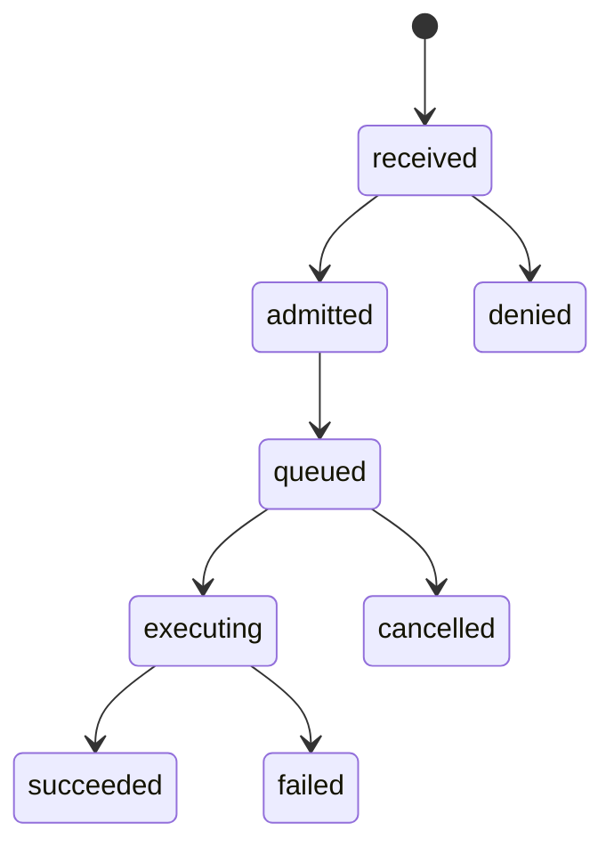
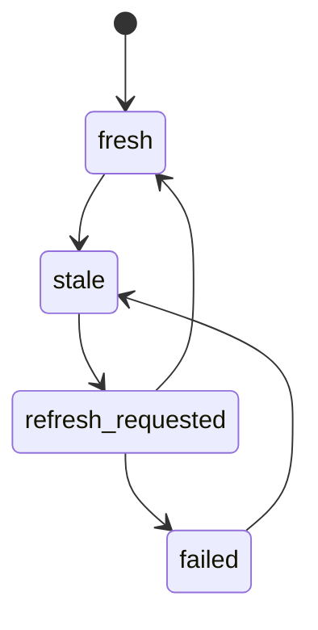
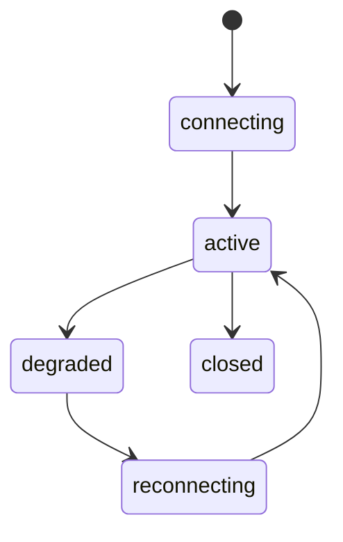

# SD-11 — BFF & Console Integration / 前台工作台、BFF Read Model、Command Facade 與 Realtime 設計

版本：v0.1 Codex-ready draft  
適用範圍：Pantheon Console Plane、Pantheon BFF Plane、`front-ai-trading-system`、BFF contracts、SSE/realtime、command/query separation  
來源準繩：Pantheon 總索引版系統分析文件 v1 Consolidated、openclaw strategy lifecycle、openclaw multi-persona implementation architecture

---

## 1. Purpose

本文件定義 Pantheon 的 **BFF & Console Integration**。`front-ai-trading-system` 是 Pantheon Console；`pantheon` BFF 是前台唯一聚合入口，負責 auth/RBAC facade、read model composition、command facade、SSE/realtime notifications。

此 SD 釐清一個重要邊界：BFF 可以提供 command facade，但不擁有 domain truth；BFF 不應把 UI 操作直接變成 execution authority。所有 command 必須轉送到對應 domain service，並由 SD-12 的 RBAC / approval / idempotency / audit discipline 約束。

核心目標：

1. 統一 Console 的 workbench 與 BFF route family。
2. 將 read models 與 commands 分離，避免 UI 直接碰 domain store 或 execution substrate。
3. 所有 command 必須產生 `CommandReceipt`，可追蹤、可重送、可審計。
4. SSE / realtime 必須使用 topic allowlist 與 actor capability filtering。
5. 前端不得承載 secrets；settings 只能顯示 server-side secret refs / capability refs。
6. mock mode 必須顯式標示，不得被視為 production readiness。

Non-goals：

- 不定義 domain services 的內部 business logic；BFF 只聚合與轉送。
- 不讓 BFF 直接寫 execution runtime；runtime command 需經 SD-08。
- 不讓 frontend 決定權限；權限由 `pantheon` BFF + SD-12 policy engine 決定。

---

## 2. Repo ownership

| Repo | Ownership |
|---|---|
| `front-ai-trading-system` | Console workbenches、typed clients、view components、SSE consumer、operator UX。 |
| `pantheon` | BFF API、read model composer、command gateway、auth/RBAC facade、SSE broker、view-model adapters。 |
| `lean-platform` | No direct frontend integration; only visible through Pantheon BFF read models and governed runtime actions. |
| `Lean` | No BFF ownership. Upstream reference only. |

---

## 3. Module paths

### `pantheon`

```text
services/control-plane/bff/
  __init__.py
  main.py
  api.py
  auth.py
  rbac.py
  command_gateway.py
  command_receipts.py
  read_model_composer.py
  sse_broker.py
  topic_policy.py
  view_models.py
  error_model.py
  idempotency.py
  audit_bridge.py
  adapters/
    persona_adapter.py
    source_adapter.py
    research_adapter.py
    consult_adapter.py
    capital_pool_adapter.py
    promotion_adapter.py
    execution_adapter.py
    telemetry_adapter.py
    incident_adapter.py
    evolution_adapter.py
  tests/
    test_command_gateway.py
    test_read_model_composer.py
    test_sse_broker.py
    test_topic_policy.py
    test_error_model.py

docs/sd/11_bff_console_integration.md
docs/api/pantheon_bff_openapi.yaml
docs/contracts/command_request.schema.json
docs/contracts/command_receipt.schema.json
docs/contracts/view_model_envelope.schema.json
docs/contracts/sse_event.schema.json
docs/codex/SD-11_task_packets.md
```

### `front-ai-trading-system`

```text
src/lib/bffClient.ts
src/lib/commandClient.ts
src/lib/sseClient.ts
src/lib/capabilityClient.ts
src/types/bff.ts
src/types/commands.ts
src/types/sse.ts
src/pages/operator/*
src/pages/persona/*
src/pages/research/*
src/pages/knowledge/*
src/pages/trainer/*
src/pages/consultation/*
src/pages/governance/*
src/pages/evolution/*
src/components/common/CommandReceiptPanel.tsx
src/components/common/FreshnessBadge.tsx
src/components/common/EvidenceRefs.tsx
src/components/common/CapabilityGuard.tsx
```

---

## 4. Domain model

### 4.1 `ViewModelEnvelope`

```yaml
ViewModelEnvelope:
  view_id: string
  view_type: string
  schema_version: string
  generated_at: datetime
  freshness:
    max_source_lag_seconds: int | null
    stale: bool
    source_refs: list[string]
  actor_context:
    actor_ref: string
    roles: list[string]
    effective_capabilities: list[string]
  data: object
  evidence_refs: list[string]
  links: object
```

### 4.2 `CommandRequest`

```yaml
CommandRequest:
  command_id: string
  command_type: string
  schema_version: string
  actor_ref: string
  workspace_id: string | null
  environment: enum[dev, sandbox, paper, canary, live]
  target_ref: string
  payload: object
  reason: string
  idempotency_key: string
  trace_id: string
  approval_token: string | null
```

### 4.3 `CommandReceipt`

```yaml
CommandReceipt:
  command_id: string
  command_type: string
  target_ref: string
  status: enum[received, admitted, denied, queued, executing, succeeded, failed, cancelled]
  denial_reason: string | null
  domain_service: string
  domain_command_ref: string | null
  emitted_events: list[string]
  trace_id: string
  idempotency_key: string
  created_at: datetime
  updated_at: datetime
```

### 4.4 `SseEventEnvelope`

```yaml
SseEventEnvelope:
  sse_event_id: string
  topic: string
  schema_version: string
  event_time: datetime
  actor_visibility_scope: object
  payload: object
  source_event_ref: string | null
  trace_id: string
```

### 4.5 `WorkbenchRoute`

```yaml
WorkbenchRoute:
  route_id: string
  workbench: enum[operator, persona, research, knowledge, trainer, consultation, governance, evolution]
  path: string
  required_capabilities: list[string]
  supported_topics: list[string]
  read_model_endpoint: string
  command_endpoint_refs: list[string]
```

### 4.6 `EffectiveCapabilityView`

```yaml
EffectiveCapabilityView:
  actor_ref: string
  persona_id: string | null
  workspace_id: string | null
  environment: string
  capabilities: list[string]
  denied_capabilities: list[object]
  generated_at: datetime
```

---

## 5. Commands

BFF command gateway accepts generic command envelopes but dispatches to domain-specific services.

```yaml
SubmitCommand:
  input: CommandRequest
  output: CommandReceipt
  idempotent_by: command_type + target_ref + idempotency_key

CancelCommand:
  input: { command_id: string, actor_ref: string, reason: string }
  output: CommandReceipt

RequestApprovalToken:
  input:
    actor_ref: string
    command_type: string
    target_ref: string
    reason: string
  output: ApprovalTokenChallenge

RefreshViewModel:
  input:
    view_type: string
    scope_ref: string
    actor_ref: string
  output: ViewModelEnvelope

SubscribeSseTopic:
  input:
    topic: string
    actor_ref: string
    filters: object
  output: SseSubscription
```

Domain command families exposed through BFF:

```text
persona.*
trainer.*
consult.*
source.*
research.*
capital_pool.*
promotion.*
runtime.*
telemetry.*
incident.*
evolution.*
settings.*
```

---

## 6. Queries

```yaml
GetShellBootstrap:
  input: { actor_ref: string }
  output:
    actor: object
    workbenches: list[WorkbenchRoute]
    effective_capabilities: EffectiveCapabilityView
    feature_flags: object

GetWorkbenchView:
  input:
    workbench: string
    scope_ref: string | null
    actor_ref: string
  output: ViewModelEnvelope

GetCommandReceipt:
  input: { command_id: string }
  output: CommandReceipt

ListCommandReceipts:
  input:
    actor_ref: string | null
    target_ref: string | null
    status: string | null
  output: list[CommandReceipt]

GetSseTopics:
  input: { actor_ref: string, workbench: string | null }
  output: list[SseTopicDescriptor]

GetEffectiveCapabilities:
  input:
    actor_ref: string
    persona_id: string | null
    workspace_id: string | null
    environment: string
  output: EffectiveCapabilityView

GetSettingsView:
  input: { actor_ref: string }
  output: ViewModelEnvelope
```

---

## 7. Events

### BFF command events

```text
BffCommandReceived
BffCommandAdmitted
BffCommandDenied
BffCommandDispatched
BffCommandSucceeded
BffCommandFailed
BffCommandCancelled
```

### View model events

```text
ViewModelComposed
ViewModelStale
ViewModelRefreshRequested
```

### SSE events

```text
SseClientConnected
SseClientDisconnected
SseTopicSubscribed
SseEventDelivered
SseEventFiltered
```

### Domain SSE topics

```text
persona.updated
trainer.session.updated
consult.request.updated
research.experiment.updated
promotion.plan.updated
runtime.status.updated
telemetry.drift.updated
incident.updated
evolution.decision.updated
operator.audit.updated
```

---

## 8. State machines

### 8.1 Command lifecycle



### 8.2 View model freshness lifecycle



### 8.3 SSE subscription lifecycle



---

## 9. Hard invariants

1. BFF does not own domain truth; it composes read models and dispatches commands.
2. Frontend must not call `lean-platform` directly.
3. Frontend must not store broker credentials, vendor secrets, or raw secret values.
4. Every command must include `idempotency_key`, `trace_id`, `actor_ref`, `reason`.
5. Destructive commands must require authority check and, when configured, approval token / MFA.
6. BFF command result must be a `CommandReceipt`; UI must not infer success from HTTP 200 alone.
7. SSE payloads must be filtered by actor capability and workspace/environment scope.
8. `mock` data must be explicitly labeled in `ViewModelEnvelope.freshness` or feature flags.
9. BFF cannot convert unapproved artifact into deployment; it can only call SD-07.
10. BFF cannot bypass SD-06 capital pool policy or SD-08 runtime action authority.
11. BFF errors must use stable error codes, not freeform strings only.
12. UI must not render high-risk action buttons unless capability guard allows it; server still enforces authority.

---

## 10. Policy hooks

```yaml
bff_policy:
  id: default_bff_policy_v1
  commands:
    require_reason: true
    require_idempotency_key: true
    destructive_commands:
      - runtime.liquidate
      - runtime.replace
      - capital_pool.risk_off
      - promotion.approve_live
      - evolution.execute_live
    require_mfa_for_destructive: true
  sse:
    allow_topics_by_workbench:
      operator: [runtime.status.updated, telemetry.drift.updated, incident.updated, operator.audit.updated]
      governance: [promotion.plan.updated, consult.request.updated, evolution.decision.updated]
      research: [research.experiment.updated, telemetry.drift.updated]
    max_reconnect_seconds: 30
  freshness:
    default_stale_after_seconds: 60
    runtime_health_stale_after_seconds: 10
    incident_stale_after_seconds: 15

console_policy:
  id: default_console_policy_v1
  mock_mode:
    allow_in_dev: true
    allow_in_live: false
  dangerous_action_ui:
    require_double_confirm: true
    show_policy_reason: true
  settings:
    hide_secret_values: true
    show_secret_refs_only: true
```

Policy-configurable decisions:

| Decision | Policy |
|---|---|
| destructive command classification | `bff_policy.commands.destructive_commands` |
| MFA / approval token | `bff_policy.commands` + SD-12 RBAC |
| SSE topic access | `bff_policy.sse` + effective capabilities |
| freshness thresholds | `bff_policy.freshness` |
| mock mode usage | `console_policy.mock_mode` |
| UI confirmation behavior | `console_policy.dangerous_action_ui` |

---

## 11. Storage model

BFF-owned / facade tables:

```text
bff_command_receipts
bff_command_dispatch_log
bff_view_model_cache
bff_sse_subscriptions
bff_sse_delivery_log
bff_feature_flags
bff_settings_projection
```

BFF must not own:

```text
strategy_registry
artifact_registry
approval_registry
capital_pool_registry
runtime_bindings
telemetry_events
incident_cases
evolution_decisions
```

BFF may cache read models with:

```yaml
cache_key: actor_ref + view_type + scope_ref + capability_hash
source_refs: list[string]
generated_at: datetime
expires_at: datetime
stale: bool
```

---

## 12. API endpoints

### Shell / workbench

```text
GET /api/v1/shell/bootstrap
GET /api/v1/workbenches/{workbench}
GET /api/v1/workbenches/{workbench}/views/{scope_ref}
GET /api/v1/capabilities/effective
GET /api/v1/settings
```

### Command gateway

```text
POST /api/v1/commands
GET  /api/v1/commands/{command_id}
GET  /api/v1/commands
POST /api/v1/commands/{command_id}/cancel
POST /api/v1/approval-tokens/request
```

### Domain route façade examples

```text
GET  /api/v1/personas
GET  /api/v1/strategies
GET  /api/v1/experiments
GET  /api/v1/capital-pools
GET  /api/v1/promotion/plans
GET  /api/v1/runtimes
GET  /api/v1/telemetry/runtime-health
GET  /api/v1/incidents
GET  /api/v1/evolution/decisions
```

### SSE

```text
GET /api/v1/stream
GET /api/v1/stream/topics
POST /api/v1/stream/subscriptions
```

---

## 13. Integration points

| Integration | Contract |
|---|---|
| SD-00 Architecture Invariants | Enforces hard separation between facade, authority, runtime, registry. |
| SD-01 Registry Backbone | BFF reads registry projections only through query adapters. |
| SD-02 Persona Governance | BFF consumes effective capabilities and persona lifecycle status. |
| SD-03 Source / Knowledge / Evidence | BFF displays evidence refs and governed search results. |
| SD-04 Research | BFF submits experiment commands and reads research status. |
| SD-05 Consultation | BFF provides consult workbench and memo publishing UI. |
| SD-06 Capital Pool | BFF displays pool state and sends governed pool commands. |
| SD-07 Promotion | BFF shows review/promotion queues and dispatches approval/deployment commands. |
| SD-08 Execution | BFF displays runtime status and dispatches governed runtime actions. |
| SD-09 Telemetry | BFF displays telemetry/reconciliation/drift and subscribes to SSE. |
| SD-10 Incident/Evolution | BFF displays alerts/incidents/postmortems/evolution decisions. |
| SD-12 Cross-Cutting | BFF uses RBAC, idempotency, audit, trace, error model, secret boundaries. |

---

## 14. Tests

### BFF unit tests

1. Command gateway rejects missing idempotency key.
2. Command gateway rejects destructive command without required authority.
3. Command gateway returns `CommandReceipt` for admitted command.
4. Read model composer marks stale sources.
5. SSE topic policy filters unauthorized topic.
6. Error model returns stable error code.
7. Settings projection redacts secret values.
8. Mock mode is denied for live environment.

### Integration tests

1. Frontend submits promotion command → BFF receipt → SD-07 command dispatched.
2. Frontend submits runtime pause → BFF policy check → SD-08 runtime action request.
3. Runtime SSE update → BFF topic filter → frontend dashboard update.
4. Incident opened → SSE → incident list updates.
5. User without risk_admin cannot see liquidate action button and server denies direct command.
6. Read model cache invalidates after domain event.

### Contract tests

1. `command_request.schema.json` validates all command requests.
2. `command_receipt.schema.json` validates command receipt.
3. `view_model_envelope.schema.json` validates read model.
4. `sse_event.schema.json` validates SSE payload.
5. `pantheon_bff_openapi.yaml` includes all exposed BFF endpoints.

### Frontend tests

1. Workbench routes are hidden when capability missing.
2. Dangerous action requires double confirmation.
3. Command receipt panel shows queued/executing/succeeded/failed states.
4. Evidence refs render as links to evidence bundle.
5. Freshness badge displays stale status.
6. SSE reconnect recovers without duplicate data.

---

## 15. Definition of Done

SD-11 is done when:

1. BFF has stable read model and command gateway contracts.
2. `front-ai-trading-system` uses typed clients for BFF commands, queries, and SSE.
3. Commands return receipts and are not treated as successful by HTTP status alone.
4. SSE topics are filtered by actor capability / workspace / environment.
5. Secrets are never returned to frontend settings views.
6. All dangerous actions are server-authority checked and visibly guarded in UI.
7. Workbenches can display persona, research, governance, runtime, telemetry, incident, and evolution read models.
8. Mock mode is explicit and disabled for live-like environments.
9. BFF does not bypass domain services or runtime authority.

---

## 16. Codex task packets

### PTH-SD11-001 — Implement BFF command gateway

```yaml
task_id: PTH-SD11-001
repo: ajoe734/pantheon
goal: Implement CommandRequest, CommandReceipt, command dispatch, idempotency, and authority checks.
target_paths:
  - services/control-plane/bff/command_gateway.py
  - services/control-plane/bff/command_receipts.py
  - services/control-plane/bff/idempotency.py
  - docs/contracts/command_request.schema.json
  - docs/contracts/command_receipt.schema.json
acceptance_tests:
  - missing idempotency key rejected
  - admitted command creates receipt
  - duplicate command returns same receipt
```

### PTH-SD11-002 — Implement read model composer and adapters

```yaml
task_id: PTH-SD11-002
repo: ajoe734/pantheon
goal: Compose view model envelopes from domain service adapters with freshness and evidence refs.
target_paths:
  - services/control-plane/bff/read_model_composer.py
  - services/control-plane/bff/view_models.py
  - services/control-plane/bff/adapters/
  - docs/contracts/view_model_envelope.schema.json
acceptance_tests:
  - view model includes generated_at and freshness
  - stale source marks view stale
  - evidence refs preserved
```

### PTH-SD11-003 — Implement SSE broker and topic policy

```yaml
task_id: PTH-SD11-003
repo: ajoe734/pantheon
goal: Implement SSE topic registry, subscription filtering, and delivery log.
target_paths:
  - services/control-plane/bff/sse_broker.py
  - services/control-plane/bff/topic_policy.py
  - docs/contracts/sse_event.schema.json
acceptance_tests:
  - unauthorized topic filtered
  - allowed topic delivers event
  - reconnect does not duplicate last delivered event
```

### PTH-SD11-004 — Align BFF OpenAPI and error model

```yaml
task_id: PTH-SD11-004
repo: ajoe734/pantheon
goal: Produce OpenAPI spec and stable error model for BFF command/query/SSE surfaces.
target_paths:
  - docs/api/pantheon_bff_openapi.yaml
  - services/control-plane/bff/error_model.py
  - services/control-plane/bff/api.py
acceptance_tests:
  - OpenAPI includes command endpoints
  - destructive command error has stable code
  - settings endpoint redacts secrets
```

### PTH-SD11-005 — Implement frontend typed clients

```yaml
task_id: PTH-SD11-005
repo: ajoe734/front-ai-trading-system
goal: Add typed BFF command, query, SSE, capability clients.
target_paths:
  - src/lib/bffClient.ts
  - src/lib/commandClient.ts
  - src/lib/sseClient.ts
  - src/lib/capabilityClient.ts
  - src/types/bff.ts
  - src/types/commands.ts
  - src/types/sse.ts
acceptance_tests:
  - command returns CommandReceipt
  - SSE client reconnects
  - capability client loads effective capabilities
```

### PTH-SD11-006 — Implement shared console components

```yaml
task_id: PTH-SD11-006
repo: ajoe734/front-ai-trading-system
goal: Add shared UI components for command receipts, freshness, evidence refs, and capability guards.
target_paths:
  - src/components/common/CommandReceiptPanel.tsx
  - src/components/common/FreshnessBadge.tsx
  - src/components/common/EvidenceRefs.tsx
  - src/components/common/CapabilityGuard.tsx
acceptance_tests:
  - command receipt states render correctly
  - stale freshness badge visible
  - unauthorized action hidden by CapabilityGuard
```
