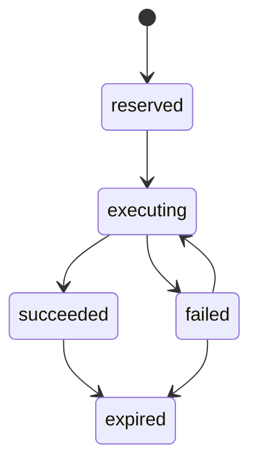
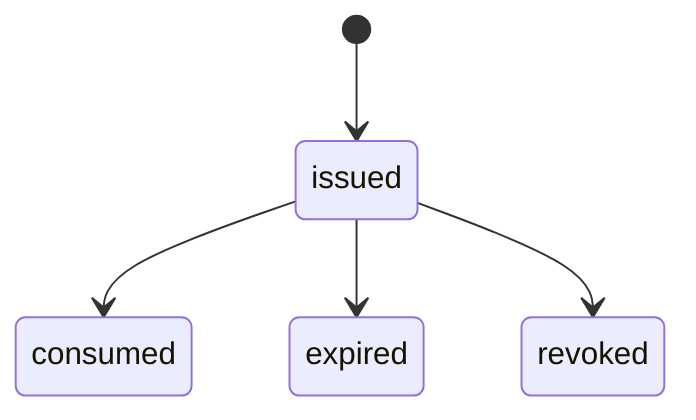
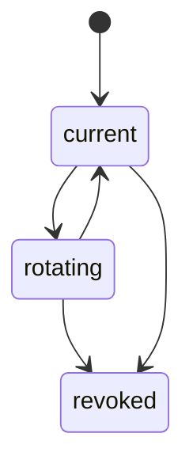
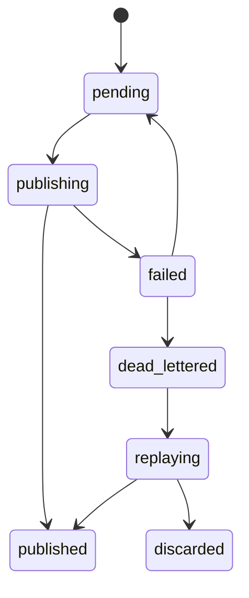
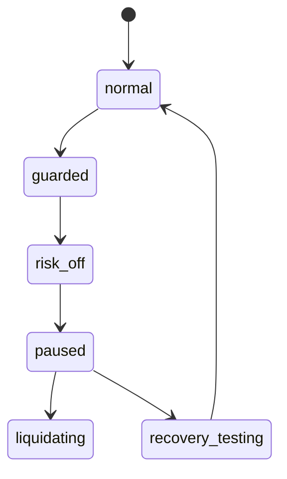

# SD-12 — Cross-Cutting Foundations / Trace、Idempotency、RBAC、Secrets、Clock、Audit 與 Safe Mode 設計

版本：v0.1 Codex-ready draft  
適用範圍：Pantheon 橫切基礎能力、所有 planes、`front-ai-trading-system`、`pantheon`、`pantheon-lean`  
來源準繩：Pantheon 總索引版系統分析文件 v1 Consolidated、openclaw strategy lifecycle、openclaw multi-persona implementation architecture

---

## 1. Purpose

本文件定義 Pantheon 全系統必須共享的 **Cross-Cutting Foundations**。這些能力不是某個單一服務的附屬功能，而是所有 SD 的共同施工標準：traceability、idempotency、environment segregation、calendar/clock discipline、kill switch/safe mode、RBAC/secret boundaries、auditability、schema versioning、outbox/DLQ、contract testing。

如果缺少這些橫切能力，即使 SD-01～SD-11 的功能都存在，Pantheon 仍會變成不可回放、不可審計、權限易混、live 風險不可控的系統。

核心目標：

1. 為所有 commands / events / queries 提供一致 `TraceContext`。
2. 為所有高風險與重試操作提供 idempotency discipline。
3. 強制 dev / sandbox / paper / canary / live environment segregation。
4. 強制所有市場資料、runtime event、governance decision 的 clock / calendar discipline。
5. 實作 deny-first RBAC / capability / approval-token boundary。
6. 將 secret boundary 與 authority boundary 分離。
7. 為所有高風險動作留下 audit action。
8. 將 kill switch / safe mode 作為正式系統元件，不依賴 OpenClaw 或前端。
9. 提供 event outbox / DLQ / replay 基礎。
10. 提供跨 SD 的 contract testing 與 schema versioning 規則。

---

## 2. Repo ownership

| Repo | Ownership |
|---|---|
| `pantheon` | Policy engine、RBAC、SecretRef resolver facade、audit log、trace/idempotency middleware、schema registry、outbox/DLQ、safe mode controller。 |
| `front-ai-trading-system` | Capability-aware UI、dangerous-action confirmation、audit trace display；不得保存 secrets 或自行判定 authority。 |
| `pantheon-lean` | Runtime-side trace propagation、secret resolution inside execution boundary、runtime safe mode action handling、telemetry outbox checkpointing。 |
| `Lean` | Upstream reference only。不得成為 cross-cutting authority。 |

---

## 3. Module paths

### `pantheon`

```text
services/foundations/
  __init__.py
  trace.py
  idempotency.py
  environment.py
  clock.py
  calendar.py
  rbac.py
  capabilities.py
  policy_engine.py
  approval_tokens.py
  secrets.py
  audit.py
  schema_registry.py
  outbox.py
  dlq.py
  safe_mode.py
  kill_switch.py
  error_model.py
  middleware.py
  tests/
    test_trace.py
    test_idempotency.py
    test_environment.py
    test_clock_calendar.py
    test_rbac.py
    test_capabilities.py
    test_policy_engine.py
    test_approval_tokens.py
    test_secrets.py
    test_audit.py
    test_schema_registry.py
    test_outbox_dlq.py
    test_safe_mode.py

docs/sd/12_cross_cutting_foundations.md
docs/contracts/trace_context.schema.json
docs/contracts/idempotency_record.schema.json
docs/contracts/actor_ref.schema.json
docs/contracts/policy_decision.schema.json
docs/contracts/audit_action.schema.json
docs/contracts/secret_ref.schema.json
docs/contracts/safe_mode_action.schema.json
docs/contracts/error_envelope.schema.json
docs/events/event_envelope.schema.json
docs/codex/SD-12_task_packets.md
```

### `front-ai-trading-system`

```text
src/lib/authContext.ts
src/lib/traceContext.ts
src/lib/errorModel.ts
src/lib/capabilityGuard.ts
src/components/common/DangerousActionDialog.tsx
src/components/common/AuditTrailPanel.tsx
src/components/common/ErrorBanner.tsx
src/components/common/TraceLink.tsx
src/types/foundations.ts
```

### `pantheon-lean`

```text
Pantheon/Foundation/
  TraceContext.cs
  EnvironmentScope.cs
  SecretRef.cs
  RuntimeSafeModeState.cs
  TelemetryOutbox.cs
  DeliveryCheckpointStore.cs
  PantheonErrorEnvelope.cs
  Tests/
```

---

## 4. Domain model

### 4.1 `TraceContext`

```yaml
TraceContext:
  trace_id: string
  correlation_id: string
  parent_span_id: string | null
  request_id: string | null
  actor_ref: string | null
  environment: enum[dev, sandbox, paper, canary, live]
  source_system: string
  created_at: datetime
```

### 4.2 `IdempotencyRecord`

```yaml
IdempotencyRecord:
  idempotency_key: string
  operation_type: string
  target_ref: string
  request_hash: string
  first_seen_at: datetime
  last_seen_at: datetime
  status: enum[reserved, executing, succeeded, failed, expired]
  result_ref: string | null
  trace_id: string
```

### 4.3 `ActorRef`

```yaml
ActorRef:
  actor_type: enum[user, persona, service, runtime, system]
  actor_id: string
  display_name: string | null
  roles: list[string]
  workspace_id: string | null
  persona_id: string | null
  environment: string
```

### 4.4 `CapabilityGrant`

```yaml
CapabilityGrant:
  grant_id: string
  actor_ref: string
  capability: string
  scope_type: enum[global, workspace, persona, capital_pool, runtime, environment]
  scope_id: string | null
  conditions: object
  effective_from: datetime
  effective_to: datetime | null
  status: enum[active, expired, revoked]
```

### 4.5 `PolicyDecision`

```yaml
PolicyDecision:
  decision_id: string
  policy_id: string
  policy_version: string
  decision: enum[allow, deny, require_approval, require_mfa]
  actor_ref: string
  action: string
  target_ref: string
  environment: string
  reasons: list[string]
  evaluated_at: datetime
  trace_id: string
```

### 4.6 `ApprovalToken`

```yaml
ApprovalToken:
  token_id: string
  actor_ref: string
  action: string
  target_ref: string
  environment: string
  issued_at: datetime
  expires_at: datetime
  status: enum[issued, consumed, expired, revoked]
  mfa_verified: bool
  policy_decision_ref: string
```

### 4.7 `SecretRef`

```yaml
SecretRef:
  secret_ref: string
  provider: enum[vault, env, cloud_secret_manager, broker_runtime]
  scope_type: enum[service, runtime, broker_account, data_vendor]
  scope_id: string
  environment: string
  allowed_consumers: list[string]
  rotation_state: enum[current, rotating, revoked]
  metadata: object
```

### 4.8 `AuditAction`

```yaml
AuditAction:
  action_id: string
  actor_ref: string
  action_type: string
  target_ref: string
  environment: string
  reason: string
  before_state_ref: string | null
  after_state_ref: string | null
  policy_decision_ref: string | null
  approval_token_ref: string | null
  trace_id: string
  correlation_id: string
  timestamp: datetime
  payload_checksum: string
```

### 4.9 `MarketCalendarSession`

```yaml
MarketCalendarSession:
  calendar_id: string
  market: string
  session_date: date
  timezone: string
  open_time: datetime
  close_time: datetime
  is_trading_day: bool
  is_early_close: bool
  source_ref: string
  version: string
```

### 4.10 `SafeModeAction`

```yaml
SafeModeAction:
  action_id: string
  scope_type: enum[system, environment, capital_pool, runtime, strategy]
  scope_id: string
  action_type: enum[guarded, risk_off, pause_new_entries, pause_runtime, liquidate, recovery_testing, resume]
  trigger_reason: string
  initiated_by: string
  approved_by: string | null
  status: enum[requested, admitted, executing, succeeded, failed, cancelled]
  trace_id: string
  created_at: datetime
```

### 4.11 `OutboxEvent` and `DeadLetterEvent`

```yaml
OutboxEvent:
  outbox_id: string
  event_type: string
  payload_ref: string
  target_topic: string
  status: enum[pending, publishing, published, failed]
  attempts: int
  next_attempt_at: datetime | null
  trace_id: string

DeadLetterEvent:
  dlq_id: string
  source_ref: string
  failure_reason: string
  payload_ref: string
  replay_policy: object
  status: enum[open, replaying, replayed, discarded]
  trace_id: string
```

---

## 5. Commands

```yaml
EvaluatePolicy:
  input:
    actor_ref: ActorRef
    action: string
    target_ref: string
    environment: string
    context: object
  output: PolicyDecision

RequestApprovalToken:
  input:
    actor_ref: ActorRef
    action: string
    target_ref: string
    reason: string
    mfa_evidence: object | null
  output: ApprovalToken

ReserveIdempotencyKey:
  input:
    idempotency_key: string
    operation_type: string
    target_ref: string
    request_hash: string
  output: IdempotencyRecord

RecordAuditAction:
  input: AuditAction
  output: AuditAction

ResolveSecretRef:
  input:
    secret_ref: string
    consumer_ref: string
    environment: string
  output: ResolvedSecretHandle

ValidateSchemaVersion:
  input:
    schema_name: string
    schema_version: string
    payload: object
  output: SchemaValidationResult

PublishOutboxEvent:
  input:
    event_type: string
    payload: object
    target_topic: string
    trace_context: TraceContext
  output: OutboxEvent

ReplayDeadLetterEvent:
  input:
    dlq_id: string
    actor_ref: string
    reason: string
  output: DeadLetterEvent

RequestSafeModeAction:
  input:
    scope_type: string
    scope_id: string
    action_type: string
    trigger_reason: string
    actor_ref: string
  output: SafeModeAction
```

---

## 6. Queries

```yaml
GetTrace:
  input: { trace_id: string }
  output: TraceGraph

GetAuditTrail:
  input:
    target_ref: string | null
    actor_ref: string | null
    trace_id: string | null
    start: datetime | null
    end: datetime | null
  output: list[AuditAction]

GetEffectiveCapabilities:
  input:
    actor_ref: ActorRef
    scope_type: string | null
    scope_id: string | null
  output: list[CapabilityGrant]

GetPolicyDecision:
  input: { decision_id: string }
  output: PolicyDecision

ListSecretRefs:
  input:
    scope_type: string | null
    environment: string | null
  output: list[SecretRef]

GetMarketCalendarSession:
  input:
    market: string
    session_date: date
  output: MarketCalendarSession

ListOutboxEvents:
  input: { status: string | null, target_topic: string | null }
  output: list[OutboxEvent]

ListDeadLetterEvents:
  input: { status: string | null, source_ref: string | null }
  output: list[DeadLetterEvent]

GetSafeModeState:
  input: { scope_type: string, scope_id: string }
  output: SafeModeStateView
```

---

## 7. Events

```text
TraceContextCreated
IdempotencyKeyReserved
IdempotencyResultRecorded
PolicyEvaluated
ApprovalTokenIssued
ApprovalTokenConsumed
SecretRefResolved
SecretRotationStarted
SecretRevoked
AuditActionRecorded
SchemaValidationFailed
OutboxEventQueued
OutboxEventPublished
DeadLetterEventCreated
DeadLetterEventReplayed
SafeModeActionRequested
SafeModeActionAdmitted
SafeModeActionExecuted
SafeModeActionFailed
EnvironmentBoundaryViolationDetected
```

All events emitted by foundations must be accepted by SD-09 telemetry ingest and available to SD-10 incident/evolution.

---

## 8. State machines

### 8.1 Idempotency lifecycle



### 8.2 Approval token lifecycle



### 8.3 Secret lifecycle



### 8.4 Outbox / DLQ lifecycle



### 8.5 Safe mode lifecycle



---

## 9. Hard invariants

1. Every command and event must carry `TraceContext` or explicitly create one at boundary ingress.
2. Idempotent operations must not execute twice for the same request hash and idempotency key.
3. Environment scope must be explicit for every command, event, secret, artifact, runtime, pool, and deployment.
4. Paper/canary/live credentials, runtime state, artifact aliases, and pool bindings must never be mixed.
5. Secret values must never be returned to frontend, OpenClaw, BFF view models, logs, telemetry payloads, or audit payloads.
6. Persona capability is not authority. Every high-risk action must evaluate RBAC/capability/policy at command time.
7. Shared skill does not imply shared authority.
8. Market calendar and clock discipline must use `event_time`, `available_time`, `ingest_time` where applicable.
9. Live execution actions must be auditable with actor, reason, policy decision, before/after state, trace id.
10. Kill switch / safe mode path must not depend on OpenClaw availability.
11. Schema version must be explicit for every contract payload.
12. A schema-breaking change must not be deployed without version bump and compatibility test.
13. DLQ replay must be governed, audited, and idempotent.
14. Hard invariants cannot be overridden by policy-as-data.

---

## 10. Policy hooks

```yaml
rbac_policy:
  id: default_rbac_policy_v1
  deny_first: true
  roles:
    operator:
      allow: [read.runtime, command.runtime.pause, read.incident]
    risk_admin:
      allow: [command.runtime.liquidate, command.pool.risk_off, command.safe_mode]
    governance_admin:
      allow: [command.promotion.approve, command.evolution.approve]
    researcher:
      allow: [read.research, command.experiment.submit, read.evidence]
  destructive_actions:
    require_mfa: true
    require_reason: true

secret_policy:
  id: default_secret_policy_v1
  frontend_access: deny
  openclaw_access: deny_raw_secret
  bff_view_access: secret_ref_only
  runtime_resolution:
    allowed_consumers: [pantheon-lean-runtime, data-gateway-worker]
  rotation:
    max_age_days: 90

environment_policy:
  id: default_environment_policy_v1
  forbid_cross_env_runtime_state: true
  forbid_live_using_paper_artifact_alias: true
  allowed_promotion_paths:
    - paper
    - paper_to_canary
    - canary_to_live

clock_policy:
  id: default_clock_policy_v1
  required_fields:
    market_data: [event_time, available_time, ingest_time]
    telemetry: [event_time, ingest_time]
    approval: [event_time]
  max_clock_skew_seconds: 300

safe_mode_policy:
  id: default_safe_mode_policy_v1
  allow_auto_guarded: true
  allow_auto_risk_off: true
  allow_auto_liquidate: false
  require_risk_admin_for_liquidate: true
```

Policy-configurable decisions:

| Decision | Policy |
|---|---|
| role permissions | `rbac_policy.roles` |
| destructive command controls | `rbac_policy.destructive_actions` |
| secret resolution consumers | `secret_policy.runtime_resolution` |
| credential rotation cadence | `secret_policy.rotation` |
| promotion path restrictions | `environment_policy.allowed_promotion_paths` |
| clock skew tolerance | `clock_policy.max_clock_skew_seconds` |
| safe mode automation | `safe_mode_policy` |

---

## 11. Storage model

```text
trace_contexts
idempotency_records
actor_refs
capability_grants
policy_decisions
approval_tokens
secret_refs
audit_actions
schema_versions
schema_compatibility_results
market_calendar_sessions
outbox_events
dead_letter_events
safe_mode_states
safe_mode_actions
environment_boundary_violations
```

Recommended indexes:

```text
trace_contexts(trace_id)
idempotency_records(idempotency_key, operation_type, target_ref)
capability_grants(actor_ref, scope_type, scope_id, status)
policy_decisions(actor_ref, action, target_ref, evaluated_at)
audit_actions(target_ref, timestamp)
audit_actions(actor_ref, timestamp)
audit_actions(trace_id)
secret_refs(scope_type, scope_id, environment)
market_calendar_sessions(market, session_date, version)
outbox_events(status, next_attempt_at)
dead_letter_events(status, source_ref)
safe_mode_states(scope_type, scope_id)
```

---

## 12. API endpoints

### Trace / audit

```text
GET  /api/v1/foundations/traces/{trace_id}
GET  /api/v1/foundations/audit/actions
POST /api/v1/foundations/audit/actions
```

### RBAC / policy / approval

```text
POST /api/v1/foundations/policy/evaluate
GET  /api/v1/foundations/policy/decisions/{decision_id}
GET  /api/v1/foundations/capabilities/effective
POST /api/v1/foundations/approval-tokens
POST /api/v1/foundations/approval-tokens/{token_id}/consume
```

### Secrets

```text
GET  /api/v1/foundations/secrets
POST /api/v1/foundations/secrets/resolve
POST /api/v1/foundations/secrets/{secret_ref}/rotate
POST /api/v1/foundations/secrets/{secret_ref}/revoke
```

`resolve` must be service-to-service only; never exposed to frontend.

### Clock / calendar

```text
GET  /api/v1/foundations/calendars/{market}/sessions/{session_date}
POST /api/v1/foundations/calendars/{market}/sessions
POST /api/v1/foundations/clock/validate
```

### Outbox / DLQ

```text
GET  /api/v1/foundations/outbox
POST /api/v1/foundations/outbox/{outbox_id}/publish
GET  /api/v1/foundations/dlq
POST /api/v1/foundations/dlq/{dlq_id}/replay
POST /api/v1/foundations/dlq/{dlq_id}/discard
```

### Safe mode / kill switch

```text
GET  /api/v1/foundations/safe-mode/{scope_type}/{scope_id}
POST /api/v1/foundations/safe-mode/actions
POST /api/v1/foundations/kill-switch
```

---

## 13. Integration points

| Integration | Contract |
|---|---|
| SD-00 Architecture Invariants | Implements system-wide hard invariants. |
| SD-01 Registry | Uses trace/idempotency/audit/schema versioning for registry writes. |
| SD-02 Persona | Uses capability grants and policy decisions; persona cannot self-grant authority. |
| SD-03 Source / Evidence | Uses clock discipline, secret refs, evidence ACLs, schema registry. |
| SD-04 Research | Uses idempotency for experiment submission and trace for experiment lineage. |
| SD-05 Consultation | Uses audit and trace for consult memos and committee decisions. |
| SD-06 Capital Pool | Uses RBAC, policy, safe mode, secret refs, environment segregation. |
| SD-07 Promotion | Uses approval tokens, audit, schema versioning, outbox, environment boundaries. |
| SD-08 Execution | Uses secret refs, runtime safe mode, trace propagation, telemetry outbox. |
| SD-09 Telemetry | Uses event envelope, DLQ, idempotency, clock discipline. |
| SD-10 Incident/Evolution | Uses audit, approval, safe mode, policy-as-data. |
| SD-11 BFF/Console | Uses command idempotency, capability guard, error envelope, no-secret rule. |

---

## 14. Tests

### Unit tests

1. Trace context is created when missing at ingress boundary.
2. Idempotency record returns prior result for duplicate command.
3. RBAC denies by default.
4. Capability grant with expired status is not effective.
5. Policy engine returns `require_approval` for destructive live command.
6. Approval token expires and cannot be consumed.
7. Secret resolver rejects frontend consumer.
8. Audit action requires actor, target, reason, trace id.
9. Calendar session rejects invalid timezone.
10. Schema registry rejects incompatible payload without version bump.
11. Outbox retries failed publish and moves to DLQ after max attempts.
12. Safe mode liquidate requires risk_admin.

### Integration tests

1. BFF command → policy evaluation → command receipt → audit action.
2. Runtime event → trace propagation → telemetry ingest → audit trace query.
3. Promotion live approval → approval token consumed → deployment action audited.
4. SecretRef visible to frontend as ref only; raw value not present in response.
5. Safe mode risk-off triggers SD-08 runtime pause request and SD-09 telemetry event.
6. DLQ replay reprocesses telemetry event idempotently.
7. Cross-environment runtime binding attempt is denied.

### Contract tests

1. `trace_context.schema.json` validates trace context.
2. `policy_decision.schema.json` validates policy decision.
3. `audit_action.schema.json` validates audit action.
4. `secret_ref.schema.json` validates secret metadata without secret value.
5. `safe_mode_action.schema.json` validates safe mode action.
6. `error_envelope.schema.json` validates stable error response.

### Frontend tests

1. Dangerous action dialog requires reason and confirmation.
2. Capability guard hides unauthorized controls.
3. Error banner renders stable error code and trace link.
4. Audit trail panel links command receipts to trace.
5. No secret value appears in settings snapshot.

### Lean-platform tests

1. Runtime propagates TraceContext to telemetry events.
2. Runtime resolves broker secret only inside allowed consumer.
3. Runtime safe mode state changes emit telemetry.
4. Telemetry outbox persists delivery checkpoint and retries.

---

## 15. Definition of Done

SD-12 is done when:

1. All SD services can use common trace, idempotency, policy, audit, error, schema utilities.
2. BFF and domain services reject commands missing idempotency key or trace context.
3. RBAC is deny-first and effective capabilities are computed server-side.
4. Secret values are never exposed to frontend, OpenClaw, logs, telemetry, or audit payloads.
5. Environment segregation is enforced for artifact aliases, runtime bindings, broker accounts, and secrets.
6. Calendar / clock validation exists for event time, available time, ingest time, market sessions.
7. Outbox and DLQ support retry and governed replay.
8. Safe mode / kill switch commands are formal, audited, and independent of OpenClaw availability.
9. Stable error envelope and schema versioning exist for BFF and domain APIs.
10. Cross-SD contract tests run in CI.

---

## 16. Codex task packets

### PTH-SD12-001 — Implement trace and idempotency foundations

```yaml
task_id: PTH-SD12-001
repo: ajoe734/pantheon
goal: Implement TraceContext middleware and IdempotencyRecord service for commands/events.
target_paths:
  - services/foundations/trace.py
  - services/foundations/idempotency.py
  - services/foundations/middleware.py
  - docs/contracts/trace_context.schema.json
  - docs/contracts/idempotency_record.schema.json
acceptance_tests:
  - missing trace at ingress creates trace context
  - duplicate idempotency key returns previous result
  - changed request hash with same key rejected
```

### PTH-SD12-002 — Implement RBAC, capabilities, policy engine, approval tokens

```yaml
task_id: PTH-SD12-002
repo: ajoe734/pantheon
goal: Implement deny-first RBAC, effective capabilities, policy decisions, and approval token lifecycle.
target_paths:
  - services/foundations/rbac.py
  - services/foundations/capabilities.py
  - services/foundations/policy_engine.py
  - services/foundations/approval_tokens.py
  - docs/contracts/policy_decision.schema.json
acceptance_tests:
  - unknown action denied
  - destructive live command requires approval
  - consumed approval token cannot be reused
```

### PTH-SD12-003 — Implement secret boundaries

```yaml
task_id: PTH-SD12-003
repo: ajoe734/pantheon
goal: Implement SecretRef model and resolver facade that never returns secret values to frontend/OpenClaw/logs.
target_paths:
  - services/foundations/secrets.py
  - docs/contracts/secret_ref.schema.json
acceptance_tests:
  - frontend consumer denied raw secret
  - allowed runtime consumer receives resolved handle only
  - secret metadata contains no secret value
```

### PTH-SD12-004 — Implement audit and error model

```yaml
task_id: PTH-SD12-004
repo: ajoe734/pantheon
goal: Implement AuditAction recorder, stable error envelope, and trace-linked audit queries.
target_paths:
  - services/foundations/audit.py
  - services/foundations/error_model.py
  - docs/contracts/audit_action.schema.json
  - docs/contracts/error_envelope.schema.json
acceptance_tests:
  - audit action requires actor, target, reason, trace_id
  - error envelope includes error_code and trace_id
  - audit trail query by trace_id works
```

### PTH-SD12-005 — Implement calendar, clock, schema registry, outbox, DLQ

```yaml
task_id: PTH-SD12-005
repo: ajoe734/pantheon
goal: Implement clock/calendar validation, schema registry, event outbox, and DLQ replay.
target_paths:
  - services/foundations/clock.py
  - services/foundations/calendar.py
  - services/foundations/schema_registry.py
  - services/foundations/outbox.py
  - services/foundations/dlq.py
acceptance_tests:
  - market calendar session validates timezone
  - schema-breaking change requires version bump
  - outbox retries and then sends to DLQ
  - DLQ replay is audited and idempotent
```

### PTH-SD12-006 — Implement safe mode and kill switch

```yaml
task_id: PTH-SD12-006
repo: ajoe734/pantheon
goal: Implement safe mode / kill switch command service independent of OpenClaw availability.
target_paths:
  - services/foundations/safe_mode.py
  - services/foundations/kill_switch.py
  - docs/contracts/safe_mode_action.schema.json
acceptance_tests:
  - guarded and risk_off actions admitted by policy
  - liquidate requires risk_admin
  - safe mode action emits audit and telemetry event
```

### PTH-SD12-007 — Implement frontend cross-cutting components

```yaml
task_id: PTH-SD12-007
repo: ajoe734/front-ai-trading-system
goal: Add trace, error, capability, dangerous-action, audit-trail shared UI foundations.
target_paths:
  - src/lib/traceContext.ts
  - src/lib/errorModel.ts
  - src/lib/capabilityGuard.ts
  - src/components/common/DangerousActionDialog.tsx
  - src/components/common/AuditTrailPanel.tsx
  - src/components/common/ErrorBanner.tsx
  - src/components/common/TraceLink.tsx
acceptance_tests:
  - dangerous action requires reason
  - unauthorized control hidden
  - error banner shows stable code and trace link
  - audit trail links to trace
```

### PTH-SD12-008 — Implement pantheon-lean runtime foundation hooks

```yaml
task_id: PTH-SD12-008
repo: ajoe734/pantheon-lean
goal: Add TraceContext, SecretRef, SafeModeState, TelemetryOutbox support to runtime boundary.
target_paths:
  - Pantheon/Foundation/TraceContext.cs
  - Pantheon/Foundation/EnvironmentScope.cs
  - Pantheon/Foundation/SecretRef.cs
  - Pantheon/Foundation/RuntimeSafeModeState.cs
  - Pantheon/Foundation/TelemetryOutbox.cs
acceptance_tests:
  - runtime telemetry includes trace context
  - secret ref resolved only in runtime boundary
  - telemetry outbox retries delivery
  - safe mode state emits event
```
