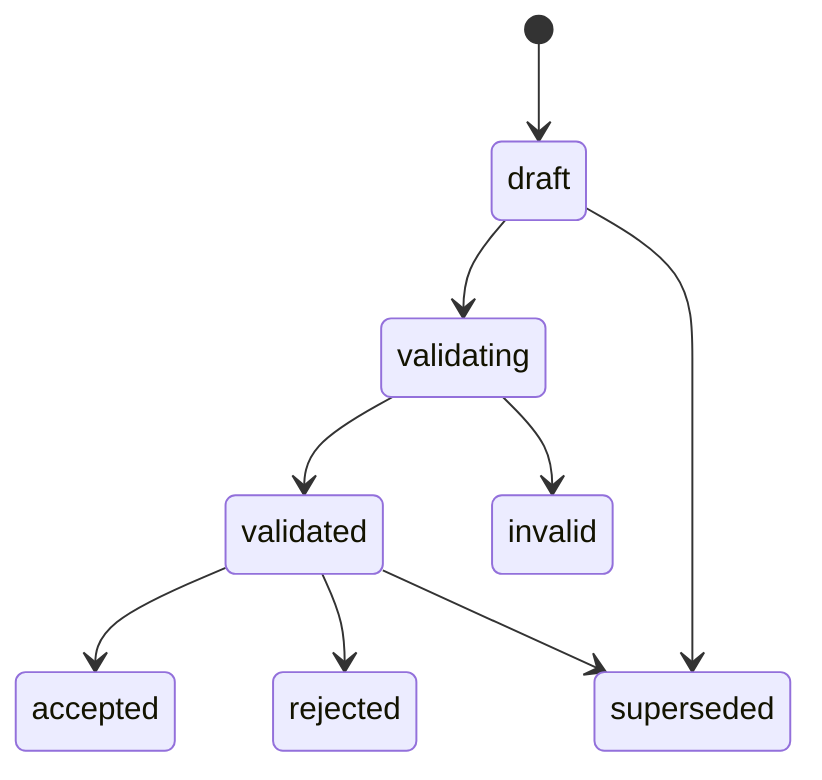

# A — Strategy Versioning, Patch, Comparison and Readiness

## A1. Ownership

- Strategy Registry owns immutable `StrategySpec` versions.
- Strategy Workshop owns proposals, conversation context, readiness assessments and links to Registry versions.
- A patch proposal never mutates a Registry row in place.
- Acceptance of a validated proposal creates a new Registry draft and a new workshop-version link.

## A2. Patch grammar decision

Use **restricted RFC 6902 JSON Patch**.

Allowed operations:

```text
add
remove
replace
test
```

Disallowed:

```text
move
copy
```

Reason: `move`/`copy` make provenance and path-level review harder; array reordering can be represented as a `replace` of the array.

Allowed top-level StrategySpec paths:

```text
/title
/hypothesis
/objective
/market_scope
/data_dependencies
/execution_profile
/evaluation_plan
/governance
/evidence_refs
/code_refs
/metadata
```

Forbidden:

```text
/spec_version
/strategy_id
/lifecycle_state
/provenance
```

System code, not the patch author, updates provenance and lifecycle.

## A3. VersionPatchProposal lifecycle



Validation sequence:

1. Resolve the exact base Registry record.
2. Verify `base_document_sha256`.
3. Verify workshop and user scope.
4. Validate every path against the allowlist.
5. Apply patch to an in-memory copy.
6. Validate the resulting document against canonical StrategySpec.
7. Run policy validation.
8. Record conflicts and warnings.
9. On acceptance, create a new immutable Registry draft.
10. Link the new Registry version to the Workshop.

Every command requires `If-Match`, `Idempotency-Key`, and `X-Request-Id`.

## A4. API

```text
GET  /bff/agora/workshops/{workshop_id}/patch-proposals
POST /bff/agora/workshops/{workshop_id}/patch-proposals
GET  /bff/agora/workshops/{workshop_id}/patch-proposals/{proposal_id}
POST /bff/agora/workshops/{workshop_id}/patch-proposals/{proposal_id}/validate
POST /bff/agora/workshops/{workshop_id}/patch-proposals/{proposal_id}/accept
POST /bff/agora/workshops/{workshop_id}/patch-proposals/{proposal_id}/reject

POST /bff/agora/workshops/{workshop_id}/version-comparisons
GET  /bff/agora/workshops/{workshop_id}/readiness
POST /bff/agora/workshops/{workshop_id}/readiness/reassess
```

## A5. Version comparison

A comparison contains one base version and one to four candidate versions.

It must separate:

```text
field diff
assumption diff
risk diff
readiness diff
predicted metric effect
backtested metric result
paper-observed metric result
```

A predicted effect must never be rendered with the visual treatment of an observed metric.

Evidence classes:

```text
predicted
backtested_in_sample
backtested_oos
paper_observed
```

The servant may recommend a version, but `decision_authority` is always `trader`.

## A6. Readiness state machine

Each gate has:

```text
not_assessed
blocked
conditional
ready
stale
```

`conditional` permits only the next explicitly allowed lower-risk activity. It does not count as full Trading Room readiness.

### Gate 1 — `preliminary_research`

| ID | Requirement | Hard? |
|---|---|---:|
| PR-01 | hypothesis and objective are explicit | yes |
| PR-02 | market scope/universe/frequency are defined | yes |
| PR-03 | required data is identified and access/PIT posture is known | yes |
| PR-04 | signal or candidate-selection logic is testable | yes |
| PR-05 | entry and exit/invalidation logic is sufficiently defined for prototype | yes |
| PR-06 | evaluation metrics and research horizon are defined | yes |
| PR-07 | no unresolved critical definition conflict | yes |
| PR-08 | assumptions used for a preliminary run are visible and accepted | no |

Gate may be `conditional` when only PR-08 is unresolved and the trader explicitly accepts temporary assumptions.

### Gate 2 — `full_validation`

| ID | Requirement | Hard? |
|---|---|---:|
| FV-01 | at least one real or governed historical prototype run completed | yes |
| FV-02 | rolling/walk-forward OOS completed | yes |
| FV-03 | transaction costs and slippage included | yes |
| FV-04 | liquidity/capacity assessed | yes |
| FV-05 | parameter sensitivity/robustness assessed | yes |
| FV-06 | regime/subperiod breakdown assessed | yes |
| FV-07 | sizing, concentration and risk constraints defined | yes |
| FV-08 | PIT/look-ahead/survivorship checks passed | yes |
| FV-09 | required consult/red-team findings resolved or explicitly accepted | yes |
| FV-10 | selected StrategySpec version and lineage are fixed | yes |

Fixture/stub output cannot satisfy FV-01 or FV-02.

### Gate 3 — `trading_room`

| ID | Requirement | Hard? |
|---|---|---:|
| TR-01 | full-validation gate is ready | yes |
| TR-02 | active StrategySpec Registry version selected | yes |
| TR-03 | candidate generation and scoring recipe available | yes |
| TR-04 | entry/add/reduce/exit/review event rules defined | yes |
| TR-05 | position sizing, leverage and risk budget defined | yes |
| TR-06 | accepted DashboardRecipe tied to selected strategy version | yes |
| TR-07 | shadow/paper evaluation mode configured | yes |
| TR-08 | governed TradingIntent handoff configured | yes |
| TR-09 | no-order-route proof is valid; canary/live remain request-only | yes |
| TR-10 | monitoring freshness and invalidation checks are active | yes |

## A7. Readiness staleness

A previously ready gate becomes `stale` when any of these occur:

- active StrategySpec version changes;
- required research artifact is superseded;
- risk policy changes;
- a required dataset becomes stale/unavailable;
- dashboard recipe references a prior strategy version;
- a critical incident or invalidation event opens.

## A8. Error codes

```text
PATCH_PATH_FORBIDDEN
PATCH_BASE_HASH_MISMATCH
PATCH_RESULT_SCHEMA_INVALID
PATCH_POLICY_INVALID
PATCH_PROPOSAL_NOT_VALIDATED
VERSION_COMPARE_LIMIT_EXCEEDED
READINESS_HARD_BLOCKER
READINESS_STALE
REGISTRY_VERSION_MISMATCH
```
