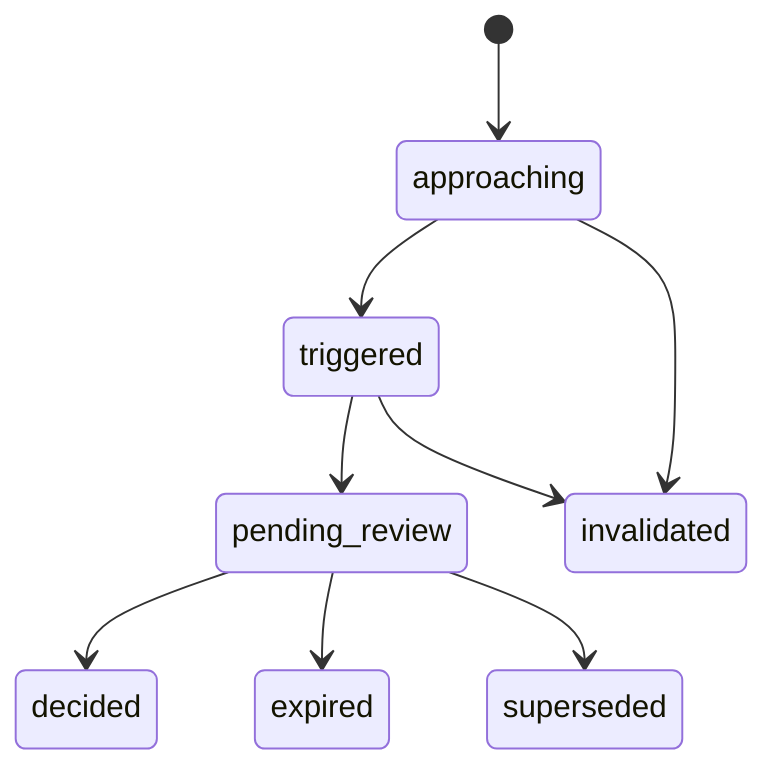

# D — Trading Room Aggregate, Decision Queue and Governed TradingIntent Handoff

## D1. Boundary

The Trading Room is a user-scoped read/decision-support surface.

It may:

- show strategy-specific dashboards;
- show candidates and approaching/triggered entry/add/reduce/exit/review events;
- record a trader decision;
- create a TradingIntent;
- start a shadow evaluation;
- submit a governed request to Management.

It may not:

- write broker orders;
- create or mutate RuntimeBinding;
- create capital binding;
- approve paper/canary/live promotion;
- bypass Management or existing promotion gates.

## D2. API

```text
GET /bff/agora/trading-room
GET /bff/agora/trading-room/strategies/{strategy_id}
GET /bff/agora/trading-room/decision-events
GET /bff/agora/trading-room/decision-events/{decision_event_id}
POST /bff/agora/trading-room/decision-events/{decision_event_id}/decisions
GET /bff/agora/trading-room/stream

GET /bff/agora/trading-intents/{intent_id}
POST /bff/agora/trading-intents/{intent_id}/handoffs
POST /bff/agora/trading-intents/{intent_id}/withdraw
```

Candidate review commands must use the canonical AG-BE-CP-001 route. The Trading Room consumes its resulting candidate-decision reference and does not create a duplicate candidate state machine.

## D3. Aggregate

The Trading Room aggregate includes:

```text
user scope
active strategies
selected StrategySpec versions
readiness
DashboardRecipe refs
monitoring/shadow/paper-request state
candidate/position counts
pending event counts by entry/add/reduce/exit/review
top decision events
position summaries
risk summary
snapshot/data cutoff
freshness/degradation metadata
```

## D4. Decision event semantics

Event kinds:

```text
entry
add
reduce
exit
review
```

Required decision-support fields:

```text
strategy/version identity
symbol/asset/venue
candidate or position ref
trigger and distance-to-trigger
confidence and calibration state
probability forecast + horizon + interval
gross/cost/net EV and downside
structured rationale
risk notes
evidence refs
invalidation conditions
suggested action
non-binding suggested size
data cutoff
no-order-route proof
```

### Confidence is not probability

```text
confidence
  confidence in the evidence/model/decision quality

probability.value
  estimated probability of a named outcome over a stated horizon
```

Both must be shown with their basis and calibration state.

### EV

```text
net EV = gross EV - estimated transaction cost/slippage
```

The UI must show the unit and horizon.

## D5. Event lifecycle



A stable `dedupe_key` prevents duplicate cards for the same strategy version, symbol, event kind and trigger window.

## D6. Trader decision

Allowed decisions:

```text
approve
reject
defer
modify
```

`approve` or `modify` creates a TradingIntent. It does not create an order.

`reject`/`defer` remain available to Shadow and Learn subject to consent and privacy policy.

## D7. Governed handoff

Requested stage:

```text
shadow
paper
canary
live
```

Semantics:

- `shadow`: may be accepted by the research/shadow path; no order route.
- `paper`: creates a Management/governance validation request. Existing approval/deployment/runtime paths remain authoritative.
- `canary` and `live`: request-only promotion review; no direct side effect.
- A handoff can later reference a DeploymentPlan/RuntimeBinding produced elsewhere, but Agora is never their write owner.

UI wording:

```text
Start shadow
Request paper validation
Submit canary review request
Submit live review request
```

Do not label canary/live actions as direct “execute” or “place order”.

## D8. Candidate review to Trading Room

Candidate decisions:

```text
add_to_monitoring
remove
park
request_research
start_shadow
create_entry_watch
```

Rejected candidates are retained as negative/preference evidence; they are not hard-deleted.

A candidate becomes a decision event only when:

- its strategy version is Trading Room ready;
- the configured trigger is approaching or reached;
- freshness checks pass;
- no invalidation condition is active.

## D9. Position events

For add/reduce/exit/review events, the projection includes:

```text
current position snapshot
original thesis ref
thesis status
current risk/exposure
triggered rule
suggested delta (non-binding)
alternative/shadow action
```

## D10. Safety errors

```text
TRADING_ROOM_NOT_READY
TRADING_EVENT_STALE
TRADING_EVENT_INVALIDATED
TRADING_INTENT_ALREADY_RECORDED
TRADING_INTENT_HANDOFF_NOT_ALLOWED
APPROVAL_REQUIRED
CAPABILITY_DENIED
```
