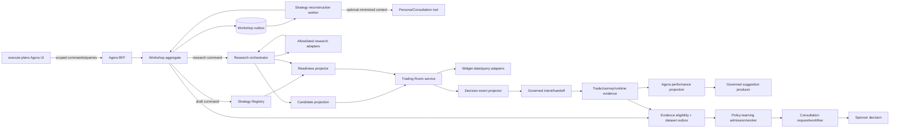

# SD — Agora Complete Product Journey

## 1. Objective

Design the minimum coherent Agora product in which an authenticated user can:

1. create a private Strategy Workshop and state a hypothesis;
2. receive an evidence-bound strategy reconstruction, gap map, completeness,
   and one next-best question;
3. confirm and version an immutable StrategySpec;
4. approve and observe governed research;
5. compare results and select one or more shadow candidates;
6. obtain a real candidate pool and a data-backed Trading Room workspace;
7. review a decision event and create a no-order governed intent/handoff;
8. observe owner-scoped performance and act on governed suggestions;
9. allow eligible evidence to enter an offline learning and independent
   Consultation path;
10. read all state back after process restart without crossing tenant/user
    boundaries.

This SD replaces the incorrect authority paths identified by the audit. It is
not a proposal to add more surfaces around the present shortcuts.

## 2. Safety and product boundaries

- Agora does not place broker orders.
- Shadow evaluation has no order route.
- Paper/canary/live actions create request-only governed handoffs.
- Policy-learning output has no runtime effect until separate experiment,
  governance, deployment, and capital gates approve it.
- Raw private Workshop text is not copied into Management projections,
  learning datasets, logs, traces, or audit messages.
- Missing, stale, or unauthorized data is `unavailable` or `degraded`, never
  fabricated and never mapped to healthy/normal.
- `execute-plans` is the frontend; Pantheon BFF is the browser boundary.
- Lovable and legacy `front-ai-trading-system` are not part of the design.
- Supervisor/fleet implementation mechanics are outside the product
  architecture.

## 3. Target architecture



The BFF exposes one browser contract, but it does not become the source of all
truth. Each domain performs canonical readback from its owner.

## 4. Shared authority model

### 4.1 Scope envelope

Every application command and private event carries an immutable scope:

```json
{
  "tenant_id": "tenant-...",
  "user_id": "user-...",
  "actor_id": "user-or-service-...",
  "actor_type": "user|service",
  "roles": ["agora:write"],
  "trace_id": "trace-..."
}
```

Browser-supplied tenant/user fields are ignored or rejected; scope comes from
authenticated identity. Service calls use a signed service identity plus a
delegated subject/scope envelope. The callee verifies both service audience and
tenant binding.

### 4.2 Command envelope and receipt

All writes converge on this semantic contract:

```json
{
  "command_id": "cmd-...",
  "operation": "workshop.message.post",
  "aggregate_type": "workshop",
  "aggregate_id": "ws-...",
  "expected_revision": 7,
  "idempotency_key": "opaque-client-key",
  "request_hash": "sha256-canonical-body-and-target",
  "payload": {},
  "scope": {},
  "submitted_at": "RFC3339"
}
```

Receipt states:

`accepted -> processing -> succeeded | failed_retryable | failed_terminal | compensated`

Rules:

1. same scope/operation/key and same hash returns the existing receipt/result;
2. same key with a different hash returns `IDEMPOTENCY_KEY_REUSED`;
3. stale revision returns `REVISION_CONFLICT` with current revision and no side
   effect;
4. synchronous commands return canonical readback plus receipt;
5. asynchronous commands return HTTP 202 only after command, receipt, and
   outbox are committed;
6. downstream partial effects are recorded and adopted on retry;
7. success is never inferred from a transport 2xx alone.

### 4.3 Event envelope

```json
{
  "event_id": "evt-...",
  "event_type": "workshop.reconstruction.completed",
  "aggregate_id": "ws-...",
  "aggregate_revision": 8,
  "sequence_no": 42,
  "scope": {"tenant_id": "...", "user_id": "..."},
  "occurred_at": "RFC3339",
  "causation_id": "cmd-...",
  "correlation_id": "trace-...",
  "schema_version": 1,
  "payload": {},
  "private_payload_ref": "opaque://...",
  "redacted_summary": "..."
}
```

SSE is an owner-scoped projection of these events. Authorization is checked
before connect and replay. Sequence numbers are per aggregate; delivery is
at-least-once and clients deduplicate by event ID.

## 5. Workshop and strategy reconstruction

### 5.1 Workshop aggregate

Authoritative state:

- owner scope and privacy/retention policy;
- status: `open | waiting_for_user | reconstructing | ready_for_draft |
  research_active | concluded | failed`;
- current revision and ordered event cursor;
- opaque references to private messages;
- latest reconstruction result ID;
- version links, selected Registry version, and downstream command receipts;
- no copied StrategySpec document.

Create and message commands store encrypted/private content before
acknowledgment. Logs/audit contain only content hash, size class, actor, and
redacted summary.

### 5.2 StrategyReconstructionResult

The reconstruction worker outputs a versioned typed object:

```json
{
  "reconstruction_id": "recon-...",
  "workshop_id": "ws-...",
  "based_on_sequence_no": 42,
  "strategy_map": {
    "hypothesis": {},
    "universe": {},
    "data_requirements": {},
    "signal_definition": {},
    "entry_rules": {},
    "exit_rules": {},
    "position_sizing": {},
    "risk_controls": {},
    "cost_liquidity_capacity": {},
    "validation_plan": {},
    "regime_invalidation": {},
    "governance_constraints": {}
  },
  "explicit_facts": [],
  "inferences": [],
  "assumptions": [],
  "contradictions": [],
  "evidence_refs": [],
  "completeness": {
    "grade": "insufficient|draftable|researchable|trading_room_ready",
    "blockers": [],
    "confirmed_fields": [],
    "unconfirmed_fields": []
  },
  "next_best_question": {
    "question_id": "nbq-...",
    "text": "...",
    "resolves": ["signal_definition.lookback"],
    "why_now": "..."
  },
  "draft_proposal": null,
  "provider_lineage": {},
  "created_at": "RFC3339"
}
```

Only one NBQ is active. A result is rejected if it is based on an old message
cursor, lacks required scope/lineage, cites unavailable evidence as confirmed,
or uses a non-allowlisted schema version.

### 5.3 Reconstruction worker

1. lease `workshop.reconstruction.requested` outbox row;
2. read the owner-authorized private conversation at a fixed sequence;
3. obtain optional tools/evidence through allowlisted adapters;
4. validate provider output against the typed schema;
5. apply deterministic policy checks and evidence classification;
6. atomically append result/card/projection events if Workshop revision and
   source sequence still match;
7. otherwise mark result superseded and enqueue reconstruction for the newer
   cursor;
8. release/renew lease and expose attempts/DLQ without leaking content.

Persona consultation may contribute opinion evidence, but cannot write
completeness or a Registry version.

### 5.4 Draft and version lifecycle

`reconstruction draft -> user-confirmed proposal -> Registry immutable draft ->
workshop version link -> selected version`

Registry creation requires:

- stable `strategy_id` (created once if absent);
- explicit confirmed fields and disclosed assumptions;
- reconstruction and evidence lineage;
- schema validation;
- canonical Registry readback matching strategy identity.

Workshop stores only the Registry ID, reconstruction ID, relationship to the
base version, and selection state.

## 6. Research and candidate pipeline

### 6.1 ResearchPlan

Plan ownership is the Workshop owner scope. The plan is immutable after
approval; edits create a revision. Required stages for the winner-branch path
include data validation, historical scoring, branch mapping/migration, event
lead/placebo, probability/EV calibration, cost/liquidity/capacity,
alternative-alpha research, and robustness/OOS.

Plan states:

`proposed -> approved -> dispatching -> running -> completed | partially_completed | cancelled | failed`

Transitions require write role and CAS. Cancellation records whether a backend
job was actually cancelled or merely ignored after completion.

### 6.2 Dispatcher and adapters

The Research dispatcher:

- consumes a durable outbox row;
- resolves an allowlisted adapter for each typed stage;
- creates/adopts a backend job with deterministic downstream idempotency key;
- persists backend identity before polling;
- projects ordered progress and artifact metadata;
- labels real, simulation, fixture, and unavailable without fallback;
- stores only evidence/artifact references in the facade;
- supports lease recovery and partial-effect adoption.

No stage may claim complete without canonical backend readback and artifact
checksum/lineage.

### 6.3 Candidate projection

Candidate pools are generated from selected Registry versions and completed
research artifacts, never a default list.

Each member contains:

- tenant/user, strategy ID, immutable Registry version;
- pool/scoring recipe version;
- evidence and research artifact refs;
- point-in-time score components and cutoff;
- source mode (`real|simulation|demo`) and availability;
- lifecycle (`proposed|reviewing|parked|researching|shadowing|selected|rejected`);
- current revision and durable action receipt refs.

If no eligible candidates exist, the pool is empty with explicit exclusion
reasons. The API provides an owner-scoped strategy/version-to-current-pool
lookup; frontend never guesses pool IDs.

## 7. Readiness design

Readiness is a projector over authoritative sources. It is not a write API.

Gates:

1. `draftable` — reconstruction has minimum confirmed structure;
2. `researchable` — immutable selected Registry draft and valid research plan;
3. `candidate_review_ready` — completed eligible evidence and candidate pool;
4. `trading_room_ready` — selected version, required evidence classes, live
   data-source readiness, risk/cost/capacity checks, and no blocking
   contradiction;
5. `intent_handoff_ready` — current decision evidence and governance policy
   permit a request-only handoff.

Each gate response includes:

- assessment ID/time and source cutoff;
- exact strategy/Registry/Workshop identities;
- pass/fail per rule;
- evidence refs and freshness;
- blockers and degraded dependencies;
- policy/schema versions.

Missing identity, source, or lineage fails closed. A caller may request
reassessment; it cannot supply the result.

## 8. Trading Room design

### 8.1 WorkspaceIntent and WorkspaceCompiler

The UI may submit a typed intent:

```json
{
  "strategy_spec_registry_id": "ssr-...",
  "candidate_pool_id": "cpool-...",
  "requested_views": ["candidate_ranking", "decision_queue"],
  "user_preferences": {"density": "compact"},
  "natural_language_request": null
}
```

Server resolves owner scope, selected strategy, readiness, evidence, and data
source health. Optional servant authoring converts natural language to the
typed intent with provider lineage. The deterministic WorkspaceCompiler:

1. validates the intent and allowlist;
2. expands it into widget specs and queries;
3. rejects unavailable required data sources;
4. includes explicit unavailable optional views;
5. emits a proposal and validation report;
6. has no data fabrication or order authority.

### 8.2 Widget data contract

Every widget query returns:

```json
{
  "widget_id": "widget-...",
  "status": "fresh|stale|degraded|unavailable",
  "source": "candidate_projection",
  "as_of": "RFC3339",
  "cutoff": "RFC3339",
  "lineage": {"artifact_refs": [], "query_hash": "..."},
  "data": {},
  "unavailable_reason": null
}
```

The initial live allowlist contains only widgets with real adapters. New widget
types require an adapter, freshness policy, tenant test, empty/degraded UI, and
contract test before registration.

### 8.3 Atomic workspace persistence

Accept, layout edit, view/widget edit, revision acceptance, and rollback each
use one transaction to:

1. validate owner/revision;
2. append command/event;
3. write materialized workspace;
4. create immutable workspace version;
5. update current version pointer;
6. store receipt/audit/outbox.

Optimistic UI may show `pending`; it becomes `succeeded` only after canonical
readback of the new revision.

### 8.4 Decision event and intent

An allowlisted projection consumes authoritative signal/risk/runtime evidence
and creates owner-scoped decision events with probability, EV, invalidation,
risk, freshness, and evidence. Missing risk is unavailable, not normal.

User actions are `approve | reject | defer | modify`. Approval creates a
`TradingIntent` only. Shadow may create a no-order evaluation job. Paper,
canary, or live selections create a governed request handoff; no broker order,
RuntimeBinding, or capital binding is created by Agora.

## 9. Strategy Performance design

### 9.1 StrategyPerformanceIndex

An Agora-owned projector joins owner-scoped:

- selected StrategySpec versions;
- TradeJourney events and executions;
- simulated/shadow outcomes explicitly labeled;
- costs/slippage/capacity/risk events;
- version and decision-event lineage.

It provides summary, time series, attribution, warnings, and source freshness.
Agora frontend stops calling Management performance-attribution routes.

### 9.2 Suggestion producer

A governed producer evaluates explicit rules/models against the index and
upserts suggestions using the existing scoped store. Every suggestion includes
policy/model version, source event cutoff, evidence refs, expiry, proposed
change, and why it is safe to propose. Apply/reject/defer uses the existing
receipt/CAS/audit pattern. Apply creates a Workshop/Registry proposal, not a
silent live mutation.

## 10. Evidence, dataset, learning, and Consultation

### 10.1 Evidence eligibility

Only explicit eligible events enter dataset extraction. The policy records
consent, purpose, retention, redaction, source schema, and allowed use. Raw
private conversation is excluded unless a separate explicit consent and
minimization rule is satisfied.

### 10.2 Dataset outbox consumer

1. API transaction stores evidence and inbox/outbox only;
2. extraction worker leases evidence, validates/redacts, and creates immutable
   DatasetVersion;
3. handoff dispatcher leases a pending handoff;
4. it calls policy-learning with signed service/tenant context and stable
   idempotency key;
5. policy-learning durably registers/adopts the DatasetVersion and candidate;
6. dispatcher reads back candidate admission identity;
7. only then does it ACK the source handoff;
8. failures retry with backoff, DLQ, and operator-visible reason.

### 10.3 Policy-learning worker

Handoff ends at `proposed`. A separate scheduler/worker claims with a lease,
runs behavior cloning/evaluation, stores checksum/metrics/lineage, and marks
`processed|degraded|failed`. It does not promote runtime policy. Dataset access
is tenant-scoped and fail-closed; no seed fallback in product mode.

### 10.4 Independent Consultation

Policy candidate intake creates a submitted request only. The normal
Consultation workflow:

`submitted -> assigned -> evidence_collection -> committee_review -> memo_draft
-> memo_published -> sponsor_pending -> approved_with_conditions | rejected |
deferred`

The evaluator identity must differ from the candidate producer. Findings cite
dataset, artifact checksum, evaluation results, limitations, and failure cases.
Confidence is produced from actual review, not a fixed constant. Sponsor
decision is a separate authenticated write with receipt/audit.

## 11. Persistence model

Use domain tables or strongly versioned aggregates, but enforce these logical
keys:

| Record | Required partition/unique key |
|---|---|
| Workshop/event/card | `(tenant_id, user_id, workshop_id[, sequence_no])` |
| Idempotency/receipt | `(tenant_id, user_id, operation, idempotency_key)` |
| Reconstruction | `(tenant_id, user_id, workshop_id, based_on_sequence_no, schema_version)` |
| Research plan/run/artifact | `(tenant_id, user_id, plan_or_run_id)` |
| Candidate pool/member | `(tenant_id, user_id, pool_id[, candidate_id])` |
| Workspace/version | `(tenant_id, user_id, workspace_id[, version_id])` |
| Decision/intent/handoff | `(tenant_id, user_id, object_id)` |
| Performance index/suggestion | `(tenant_id, user_id, strategy_id[, suggestion_id])` |
| Dataset/handoff | `(tenant_id, user_id, dataset_or_handoff_id)` |
| Policy candidate | `(tenant_id, candidate_id)` plus dataset lineage |
| Consult request/memo | `(tenant_id, request_or_memo_id)` plus producer/reviewer identity |

Database policies and application queries both enforce ownership. In-memory
stores remain test-only and must implement identical scope semantics.

## 12. API migration posture

Keep current route families where their semantics are sound. Contract changes:

- Workshop create/message return command receipts and enqueue reconstruction;
- public completeness POST is deprecated and then removed;
- readiness reassess accepts no caller truth and returns a receipt;
- plan/run/candidate and Trading Room mutations require write role + CAS;
- add strategy/version-to-candidate-pool lookup;
- workspace proposal accepts typed intent, not readiness/freshness truth;
- add widget query/read-model endpoints or one batched workspace-data endpoint;
- add Agora owner-scoped StrategyPerformanceIndex endpoints;
- dataset handoff exposes delivery/ACK state;
- policy handoff is admit-only;
- Consultation candidate intake returns submitted request, never terminal memo.

Generated frontend types and capability manifests update from the canonical
OpenAPI. During migration, unsafe old fields are rejected in live mode rather
than silently ignored when ignoring them could hide a caller bug.

## 13. Error and degraded-state contract

All errors return a stable code, safe message, retryability, receipt/trace when
available, and no foreign-object existence leak. Required codes include:

- `OWNER_SCOPE_NOT_FOUND` (404 semantics);
- `WRITE_ROLE_REQUIRED`;
- `REVISION_CONFLICT`;
- `IDEMPOTENCY_KEY_REUSED`;
- `AUTHORITATIVE_IDENTITY_MISSING`;
- `READINESS_BLOCKED`;
- `SOURCE_UNAVAILABLE` / `SOURCE_STALE`;
- `WORKER_ACCEPTED` / `WORKER_RETRYABLE_FAILURE` / `WORKER_DLQ`;
- `CAPABILITY_TEMPORARILY_DISABLED` during correction migration;
- `SSE_REPLAY_UNAVAILABLE`.

The frontend renders these states directly; it does not substitute sample data.

## 14. Observability and operations

Metrics must distinguish accepted, processing, succeeded, failed, and replayed:

- command latency to durable acceptance and to terminal result;
- Workshop reconstruction backlog/lease age/DLQ/superseded result count;
- Research adapter queue, backend job age, and artifact readback failures;
- candidate pool empty/excluded/real/demo counts;
- workspace data source freshness/unavailability by adapter;
- decision-event producer lag;
- performance index lag and suggestion producer watermark;
- dataset outbox/handoff pending age, attempts, ACK latency, DLQ;
- policy candidate lease/processing and Consultation queue age;
- cross-tenant denial count without target identifiers;
- FE/BFF manifest identity and readiness acceptance.

Health/readiness checks validate worker/controller activity and cursor
agreement. A worker in `repair_only`, stale watermark, or manifest/running SHA
mismatch cannot report accepted live readiness.

## 15. Validation strategy

### 15.1 Contract and unit

- schema validation and generated-type drift;
- command replay/conflict/CAS matrix;
- readiness rule truth table with missing/stale/fixture sources;
- compiler allowlist and no hidden fixture fallback;
- redaction and evidence eligibility;
- Consultation cannot publish from intake.

### 15.2 Persistence and failure injection

- transaction rollback between workspace snapshot/version/pointer writes;
- worker crash after downstream create but before source ACK;
- lease expiry/recovery and duplicate delivery;
- BFF/service restart readback;
- ambiguous legacy row quarantine;
- no process-memory-only success state.

### 15.3 Security and isolation

For two tenants and two users per tenant, test list/get/mutate/SSE/replay for
Workshop, plans, runs, artifacts, pools, workspaces, versions, decision events,
intents, handoffs, performance, datasets, candidates, and Consultation. Guessed
foreign IDs do not reveal existence. Every mutation rejects read-only roles.

### 15.4 Product journey E2E

One authenticated browser journey must complete the original winner-branch
steps 1–11 and continue through Performance and eligible Learning/Consultation.
Evidence must prove UI action -> BFF receipt -> domain event -> worker/adaptor ->
canonical readback. Seeded store rows cannot satisfy the proof.

### 15.5 Hosted acceptance

- exact FE/BFF manifest equals served identities;
- live/strict/safe write defaults are explicit;
- `/readyz` healthy with lifecycle cursor agreement;
- current source capability/hash gate passes;
- authenticated desktop and mobile browser journey;
- cross-user negative path;
- BFF and worker restart, then state/receipt readback;
- no Lovable or suspended/legacy host dependency.

## 16. Non-goals

- live-capital activation or broker order submission;
- new Supervisor V2 features or worker scheduling design;
- a generalized agent framework to replace deterministic domain policy;
- keeping old endpoints solely to preserve a false-success UI;
- expanding widget count before existing widgets have authoritative data;
- using policy-learning or Consultation as proof of runtime promotion;
- treating a new deployment as proof that missing producers now exist.
