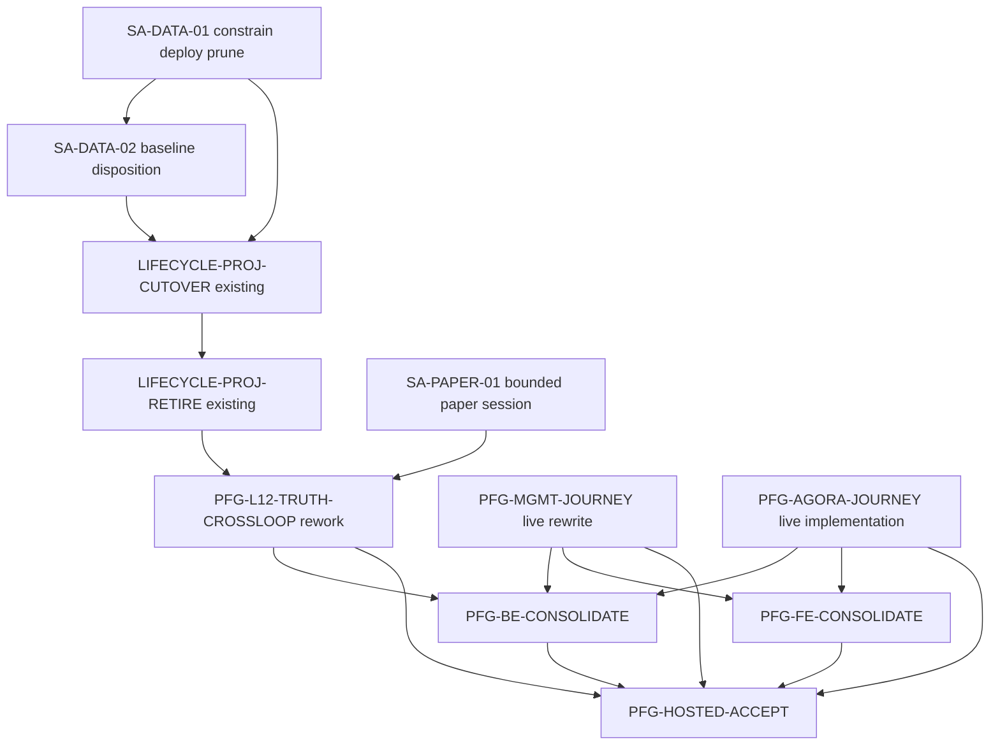

# Pantheon Functional Closure SA Implementation Plan — 2026-08-22

Date: 2026-08-22

Input: [`CURRENT_GAP_2026-08-22.md`](CURRENT_GAP_2026-08-22.md)

Goal: close the remaining product gaps using the existing canonical owners and
stores, with function and operability first. This plan does not add a security
program, HA/DR program, live broker, real capital, or a new development-task
authority.

## 1. Architecture decisions

### AD-01 — `public.telemetry_events` is canonical source data

No deploy cleanup, Management feature, derived projector, or test may truncate,
replace, or synthesize this table. Management AI telemetry maintenance is
strictly limited to the configured Management AI schema.

### AD-02 — Relational Lifecycle projection is the target normal path

Retain and complete the existing `RelationalLifecycleProjector` and
`trade_journey_projection` schema. Do not create another projector or event
store. The JSON projector is a temporary migration source/read-only comparison
surface and must be retired after relational parity and reader cutover.

### AD-03 — Derived JSON cannot become canonical telemetry

Legacy JSON may support comparison and historical operator display with an
explicit derived/legacy label. It cannot manufacture missing source events or
be inserted into `public.telemetry_events` as if it were original telemetry.

### AD-04 — Dev Source remains manual and bounded

The standing dev mode remains `reconcile_only`. One-shot provider execution is
allowed only for an explicitly named test connector/run and returns to
reconcile-only when terminal. No task may solve paper freshness by enabling a
continuous Source daemon.

### AD-05 — Paper execution is a bounded session

A paper session is active only while its immutable artifact and referenced
market snapshot satisfy the binding contract. Stale input produces a durable
paused state and stops execution; it is not an endlessly unhealthy process.

### AD-06 — Static loop catalog owns stable contract, not runtime truth

The catalog owns loop identity, specification, canonical controller identity,
queries, restart, and idempotency contracts. Current maturity and health come
only from fresh runtime records. Historical task references remain in planning
documents, not the product read model.

### AD-07 — Hosted proof uses server-side credentials and real network paths

Reuse existing dev-login and token-export helpers. Credentials remain in the
workflow/VM environment; the browser receives only a short-lived session/token.
Required hosted tests may not route-mock BFF calls or skip because the target is
external.

### AD-08 — Cleanup follows replacement proof

Every legacy path is classified `keep`, `consolidate`,
`retire-after-proof`, or `delete`. The unique existing owner is never replaced
with a parallel compatibility owner. Duplicate code is removed only after its
replacement journey passes.

## 2. Target architecture

### 2.1 Telemetry and Lifecycle flow

```text
domain owners
  -> public.telemetry_events                  canonical append-only source
  -> PostgresLifecycleSource                  existing reader/cursor
  -> RelationalLifecycleProjector             existing single normal writer
  -> trade_journey_projection.*               relational derived authority
  -> BFF relational read adapter
  -> Management / loop truth

legacy LifecycleProjector JSON
  -> read-only parity input during migration
  -> archived historical derived evidence
  -> removed from normal Compose after cutover
```

The deploy cleanup path is outside this chain and may operate only on
`management_ai.telemetry_events`.

### 2.2 Source and bounded paper session

```text
reconcile-only Source controller
  -> explicit one-shot connector run
  -> SourceRecord + stored market snapshot
  -> approved DeploymentPlan
  -> executable RuntimeBinding
  -> paper session active_with_fresh_snapshot
  -> signal/order/fill/position/telemetry

snapshot expires
  -> paper session paused_stale_input
  -> child execution stopped; readback preserved
  -> explicit one-shot refresh
  -> resume with new snapshot OR canonical retire/redeploy
```

The producer does not pull providers and the Source controller does not infer a
paper demand into recurring egress.

### 2.3 Twelve-loop truth

```text
stable loop catalog
  loop_id + owner/controller contract + query/restart/idempotency
                              |
fresh owner observation -----+----> loop-control store
functional worker health ----+          |
                                         v
                               BFF loop-health composition
                                         |
                              runtime_maturity/current status
                                         |
                                   Management UI
```

Task completion, PR state, fixture evidence, and static maturity are excluded
from runtime admission.

### 2.4 Hosted acceptance profiles

```text
read-only artifact (normal served dev)
    |
same exact FE source commit
    +--> bounded operator-live paper-only candidate
            + server-side dev-login
            + required hosted journeys
            + no live capital / no recurring Source pull
            + terminal/readback evidence
    |
return to accepted read-only artifact
```

This reuses the existing release pair and write-profile model. It does not add a
second frontend or bypass the BFF.

## 3. Work-package strategy and task reuse

Existing nonterminal tasks must be repaired/reused rather than superseded:

| Existing task | Planned use |
|---|---|
| `LIFECYCLE-PROJ-CUTOVER-001` | absorb the relational backfill/shadow and BFF reader-cutover scope after the telemetry baseline gate |
| `LIFECYCLE-PROJ-RETIRE-001` | retire the legacy JSON writer/read fallback and data only after accepted cutover/soak and explicit cleanup approval |
| `PFG-L12-TRUTH-CROSSLOOP-20260820` | amend PR #5122 and complete loop-contract/runtime truth |
| `PFG-MGMT-JOURNEY-E2E-20260820` | replace fixture-only PR #601 tests with live E2E |
| `PFG-AGORA-JOURNEY-E2E-20260820` | add and run the missing operator-live browser journey |
| `PFG-BE-CONSOLIDATE-20260820` | run after replacement journeys pass |
| `PFG-FE-CONSOLIDATE-20260820` | run after replacement journeys pass |
| `PFG-HOSTED-ACCEPT-20260820` | final exact-pair acceptance |

Only three newly discovered scopes need new canonical tasks:
`PFG-DATA-TELEMETRY-PRUNE-20260822`,
`PFG-DATA-TELEMETRY-BASELINE-20260822`, and
`PFG-PAPER-STALE-SESSION-20260822`. The `SA-LIFECYCLE-01/02` labels below are
design sections that compose into the two existing Lifecycle tasks; they must
not be materialized as new tasks.

## 4. Implementable work packages

### SA-DATA-01 — Constrain deploy telemetry prune

**Scope**

- `scripts/deploy_nonprod_vm.sh`
- focused deploy-script tests
- deployment evidence for target/pre/post counts

**Implementation**

1. Replace the `(target_schema, 'public')` selection with an exact
   Management-AI-schema selection.
2. Validate the resolved schema is non-empty and not `public`.
3. Resolve and print the exact qualified table before mutation.
4. Fail if more than the expected table is selected.
5. Capture pre/post counts for the selected Management AI table and an unchanged
   count/checksum boundary for `public.telemetry_events`.
6. Add positive and negative tests, including a database integration test with
   both tables present.

**Acceptance**

- Management AI telemetry is pruned when enabled.
- `public.telemetry_events` rows survive byte/identity unchanged.
- `public`, wildcard, missing, and multi-table targets fail before mutation.
- a root deploy cannot reach the old broad SQL path.

**Rollback**

Disable the Management AI prune entirely. Do not restore the broad scope.

### SA-DATA-02 — Establish canonical telemetry baseline disposition

**Scope**

- data/runbook and evidence only unless an authoritative backup is discovered;
- no synthesis from JSON.

**Implementation**

1. Record `2026-08-22T05:21:28Z` as the observed new-source boundary.
2. Search and record all authoritative backup/import candidates.
3. If a canonical backup exists, restore into an isolated schema and compare
   event IDs before a governed merge.
4. If none exists, record an explicit baseline disposition: pre-boundary source
   history unavailable; legacy JSON remains derived historical evidence only.
5. Define the first accepted post-boundary source sequence/checkpoint.

**Acceptance**

- every projected row can identify whether it comes from restored canonical
  source or the approved post-boundary baseline;
- no derived JSON row is labelled canonical telemetry;
- the migration start checkpoint is unambiguous.

### Existing `LIFECYCLE-PROJ-CUTOVER-001` — Backfill and shadow

`SA-LIFECYCLE-01` is the design label for this portion of the existing task. It
does not create a new Lifecycle task.

**Depends on**: SA-DATA-01, SA-DATA-02

**Scope**

- existing Lifecycle migration/projector/parity code;
- Compose/deploy configuration through the single integration owner.

**Implementation**

1. Run the existing resumable backfill from the accepted canonical source
   boundary into `trade_journey_projection`.
2. Keep backfill rows explicitly `accepted_live=false`.
3. Enable the existing relational shadow writer with its DSN.
4. Verify checkpoint, watermark, backlog, quarantine, identity, stage, journey,
   and loop-run parity for new events.
5. Restart the writer and prove idempotent continuation.
6. Bound batch memory and confirm no full JSON materialization occurs in the
   relational path.

**Acceptance**

- relational controller row exists and advances;
- backlog reaches zero with no unresolved quarantine;
- a new live telemetry event appears exactly once in relational projections;
- restart continues from durable checkpoint;
- backfill never advertises live truth.

### Existing Lifecycle tasks — Cut reads and retire JSON

`SA-LIFECYCLE-02` is split across the existing canonical identities:

- `LIFECYCLE-PROJ-CUTOVER-001` owns dual-read parity, the relational reader
  canary/cutover, rollback/forward proof, and the accepted observation window.
- `LIFECYCLE-PROJ-RETIRE-001` owns stopping/removing the JSON writer and read
  fallback, preserving the approved rollback artifact, and the separately
  approved legacy-file cleanup after the required soak.

**Depends on**: the backfill/shadow portion of
`LIFECYCLE-PROJ-CUTOVER-001`; retirement additionally depends on accepted
cutover and its required soak/approval gates.

**Implementation**

1. In `LIFECYCLE-PROJ-CUTOVER-001`, run dual-read parity for the accepted
   comparison window.
2. Switch BFF `trade_journey_reader_backend` to relational through the existing
   canary and gate-before-switch flow.
3. Prove Management, trade journey, loop run, and hosted lifecycle probes from
   relational tables; complete rollback/forward rehearsal and the task's
   observation gate.
4. In `LIFECYCLE-PROJ-RETIRE-001`, stop/remove the legacy JSON writer and read
   fallback only after the accepted soak.
5. Keep one immutable read-only legacy snapshot through the rollback window.
6. Archive/delete old generations only through the retirement task's exact-path
   inventory, checksums, and explicit cleanup approval.

**Acceptance**

- BFF version/config reports relational reader;
- required API reads survive BFF and projector restart;
- legacy projector consumes no normal CPU/RAM and produces no new generations;
- normal Lifecycle projection disk/RSS remain bounded under a multi-hour soak;
- rollback switches reads only to the preserved snapshot, never restarts broad
  source truncation or dual normal writers.

### SA-PAPER-01 — Add bounded paper-session stale-input transition

**Scope**

- existing RuntimeBinding, paper producer, fleet reconciler, and runtime state;
- no provider client in the producer.

**Implementation**

1. Add a durable paper session status and transition metadata.
2. On stale snapshot, atomically transition active session to
   `paused_stale_input`.
3. Stop signal emission and binding-scoped child execution.
4. Preserve the last terminal signal/order/fill/position and stale snapshot
   identity/time.
5. Add explicit resume with a new canonical snapshot or canonical retire and
   redeploy.
6. Project paused state into Loop 9 and Management.

**Acceptance**

- stale input creates one idempotent pause transition;
- producer/fleet are process-healthy while reporting the session as paused;
- no signal/order is emitted after expiry;
- explicit one-shot refresh and resume uses a new snapshot ID;
- Source remains reconcile-only before and after the test.

### Existing `PFG-L12-TRUTH-CROSSLOOP-20260820` — Rework loop truth

**Implementation correction**

1. Amend PR #5122 rather than opening a parallel truth PR.
2. Remove runtime/task fields from the product projection.
3. Reconcile stable controller contracts for all twelve current owners.
4. Keep controller-name validation; do not simply accept arbitrary records.
5. Ensure each owner emits required evidence basis, runtime refs, heartbeat,
   desired/actual readback, last trigger/terminal, and next receipt.
6. Add negative tests for stale, wrong-owner, conflicting-provenance, fixture,
   and task-only records.
7. Run the new stimulus suite against the exact deployed head.

**Acceptance**

- 12 canonical + separately labelled overlay;
- all 12 current owner records accepted in the named closure run;
- wrong/stale/fixture/task-only records rejected;
- `runtime_maturity` is record-derived;
- no `current_maturity`, task list, or archived completion appears as current
  truth.

### Existing `PFG-MGMT-JOURNEY-E2E-20260820` — Replace fixture proof

**Implementation correction**

1. Preserve useful route-mocked tests as component tests under an accurate name.
2. Rewrite the required journey with no `page.route("**/bff/**")` interception.
3. Acquire dev-login token in a server-side workflow step and inject the
   short-lived browser session.
4. Assert Formula, Activity, telemetry, and Postmortem network provenance.
5. Execute one supported dev-paper action, wait for domain terminal state, and
   verify reload persistence and exactly-once receipt.
6. Ask Management AI, verify a real provider response, navigation/drawer/focus,
   and one confirmed domain action.
7. Make missing credentials fail preflight; required hosted tests may not skip.

**Acceptance**

- zero BFF route mocks;
- zero required skips;
- live provider and action receipts correlate to captured requests;
- read-only artifact remains honestly disabled outside the operator-live run.

### Existing `PFG-AGORA-JOURNEY-E2E-20260820` — Add full live journey

**Implementation**

1. Build the bounded operator-live frontend artifact from the same accepted FE
   source commit.
2. Use a short-lived operator session and paper-only domain.
3. Create every journey identity in the browser run.
4. Prove Workshop message, reconstruction, Registry draft, Research stages,
   candidate pool, shared review drawer, decision, performance suggestion,
   policy handoff, Consultation, and Governance receipt.
5. Reload at decision and consultation boundaries.
6. Capture request/response provenance and durable IDs.
7. Return served dev to the read-only artifact after proof.

**Acceptance**

- no fixture candidate, fixed lens ID, prebuilt manifest ID, or route mock;
- decisions/performance survive reload;
- Consultation uses the existing provider/executor and Governance sink;
- all effects are paper/dev only.

### Existing backend/frontend consolidation tasks

Run `PFG-BE-CONSOLIDATE-20260820` and `PFG-FE-CONSOLIDATE-20260820` only after
the corrected journeys pass.

**Backend disposition targets**

- direct automatic `AgoraDatasetAuthority` discovery: retire after durable
  handoff proof; retain explicit-reference diagnostics if still called;
- legacy Source scheduler utility: isolate to one-shot diagnostic or retire
  after caller audit;
- static paper runtime: remove normal deployment wiring if no caller remains;
- legacy JSON Lifecycle writer: retire after relational cutover;
- loop catalog runtime/task fields: remove from product projection/source.

**Frontend disposition targets**

- converge active live callers toward one BFF adapter family;
- keep seed library only for explicit tests/demo;
- remove production strict-live seed imports and unreachable mock write paths;
- reject the fixture-only Management journey as hosted evidence;
- preserve the already adopted shared Agora drawer and real pool path.

### Existing `PFG-HOSTED-ACCEPT-20260820` — Final exact-pair proof

**Acceptance**

- exact current Pantheon/execute-plans SHAs in manifest and `/bff/version`;
- Source reconcile-only before and after one named one-shot;
- relational Lifecycle writer/reader active and legacy writer stopped;
- paper stale-input pause/resume behavior proven;
- L12, Agora, Management, and Management AI required cases pass with zero
  skips;
- backend/frontend disposition evidence included;
- rollback-safe gate-before-switch; normal served profile returns to read-only.

## 5. Dependency graph



## 6. Maximum safe parallel execution

After the SA documents are accepted, the first implementation wave can use four
independent lanes without touching the same primary files:

| Lane | Work | Main repo/files |
|---|---|---|
| A | SA-DATA-01 deploy prune | Pantheon deploy script/tests |
| B | SA-PAPER-01 session lifecycle | Pantheon execution/runtime files |
| C | Management live E2E rewrite | execute-plans E2E/workflow only |
| D | loop-truth PR #5122 correction | Pantheon BFF inventory/tests |

Lifecycle baseline/cutover follows SA-DATA-01. Agora live E2E can run in
parallel with Lifecycle work once an operator-live candidate slot is available.
Compose/deploy configuration changes remain serialized under one integration
owner to avoid competing edits and live-environment collisions.

## 7. File ownership and conflict boundaries

| Scope | Sole change owner for a wave | Must not create |
|---|---|---|
| deploy telemetry prune | SA-DATA-01 | second cleanup script or second DB |
| Lifecycle projection | existing `LIFECYCLE-PROJ-CUTOVER-001`, then `LIFECYCLE-PROJ-RETIRE-001` | second projector/store or duplicate Lifecycle task |
| paper session | SA-PAPER-01 | provider puller inside producer |
| loop truth | existing cross-loop task | second loop-health store/projector |
| Management E2E | existing Management task | product BFF dev-task endpoints or route mocks |
| Agora E2E | existing Agora task | new drawer/store/research/consult owner |
| Compose/dev wiring | one integration owner | component-specific competing compose PRs |

## 8. Validation matrix

| Layer | Required validation |
|---|---|
| deploy prune | shell/unit tests plus Postgres two-schema negative test |
| source baseline | row identity/time boundary and restore/disposition evidence |
| relational projector | backfill, live shadow, restart, idempotency, quarantine, bounded memory |
| reader cutover | API parity, restart, current SHA, legacy writer stopped |
| paper session | fresh, expiry, idempotent pause, no post-expiry signal, resume/retire |
| loop truth | positive 12-owner run and stale/wrong-owner/fixture/task-only negatives |
| Management | real token, no mocks/skips, provider/action/reload/network proof |
| Agora | all browser-created IDs, durable reload, policy/consult receipt |
| consolidation | caller/profile audit, deletion after proof, journey rerun |
| hosted | exact FE/BFF pair, named one-shot, zero required skips, rollback-safe switch |

## 9. Migration and rollback sequence

### Lifecycle

1. merge deploy prune fix through `PFG-DATA-TELEMETRY-PRUNE-20260822`;
2. record baseline disposition through
   `PFG-DATA-TELEMETRY-BASELINE-20260822`;
3. resume `LIFECYCLE-PROJ-CUTOVER-001` for relational backfill;
4. enable relational shadow writer;
5. prove parity and restart;
6. switch BFF reader through the existing cutover canary;
7. label and preserve the legacy rollback bundle, then complete
   rollback/forward proof and the accepted observation gate;
8. run `LIFECYCLE-PROJ-RETIRE-001` to stop/remove the JSON writer and fallback;
9. archive/delete legacy generations only after the retirement task's explicit
   approval gate.

Rollback before step 6 keeps the JSON reader and stops relational shadow. After
step 6, rollback may temporarily select the preserved read-only JSON snapshot,
but must not resume destructive prune or dual normal writers.

### Paper

On failure, pause the session and preserve binding/readback. Do not switch to a
smoke strategy, fabricate a snapshot, or enable recurring provider pull.

### Hosted journeys

On failure, keep or restore the read-only artifact, preserve captured evidence,
and leave domain records for diagnosis. Do not mark the operator-live candidate
accepted.

## 10. Definition of product completion

Pantheon may claim this gap program complete only when all of the following are
simultaneously true:

1. root dev deploy cannot truncate `public.telemetry_events`;
2. the canonical telemetry baseline/disposition is recorded;
3. relational Lifecycle projection is the active writer and reader;
4. legacy JSON writer is stopped and normal resource use is bounded;
5. paper execution pauses cleanly on stale manual-only input and resumes only
   from an explicit new snapshot;
6. all 12 canonical loop records are accepted from fresh current owners;
7. Management and Agora live journeys contain no BFF mocks or required skips;
8. duplicate backend/frontend production paths have been dispositioned after
   replacement proof; and
9. the served exact FE/BFF pair passes final acceptance and returns to the
   intended read-only dev profile.

Anything less is partial delivery and must be reported with the exact remaining
boundary.
