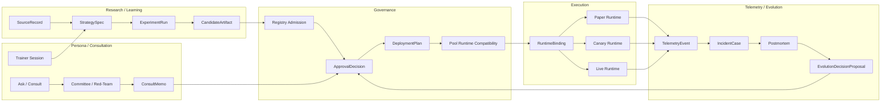
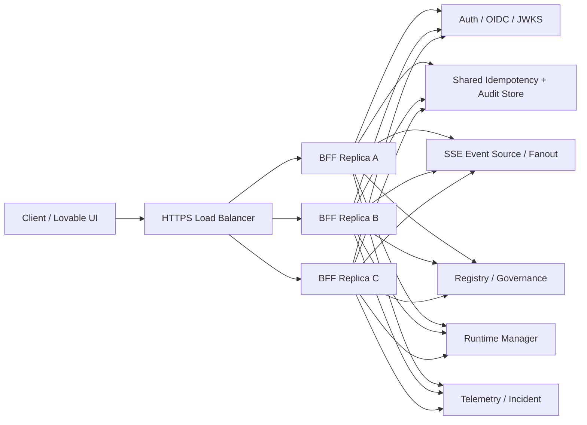

# Pantheon Design Team — Blueprint Supplement (Complete Specification)

> Document version: v1.0
> Date: 2026-05-19
> Source repos: `pantheon@dev`, `execute-plans@bff-luv-fe-006-dev-deploy`
> Purpose: consolidate the latest design-team gap supplement into a complete spec, so implementation can dispatch immediately on pre-gate engineering. Humans only sign go/no-go for real canary/live, broker live, capital binding live, and production cutover.
> Document type: SA + SD + Task Specification, consolidated.

> **Encoding note (2026-05-19):** original Chinese narrative was lost to a transit-time encoding error. YAML schemas, Mermaid diagrams, task ID tables, JSON contracts, and acceptance matrices in this archive are byte-faithful to the source. Commentary has been rewritten in English by the receiving Claude lane.

---

## 0. Core principle

**Design-team responsibility model.**

Design team owns:

1. Defining the complete go-live target state.
2. Auditing the gap between current implementation and that state.
3. Capturing each gap as a buildable spec.
4. Defining data structures, APIs, flows, transition conditions, evidence formats.
5. Designing all pre-gate engineering for gated capabilities.
6. Reserving only the activation / non-activation decision for humans.

Implementation team owns:

1. Building against this spec.
2. Reporting infeasibility, scope creep, or insufficient context back to design.
3. Producing tests and evidence packets.
4. Not unilaterally changing L1 policy, live gates, or fail-closed invariants.

Humans own:

1. Broker production live enable.
2. Capital binding live enable.
3. Production BFF HA cutover.
4. Production real writes enable.
5. Canary/live capital scale-up.

**Gates block activation, not engineering.**

---

## 1. Latest current-state summary

### 1.1 Completed or near-completed capabilities

`pantheon@dev` has completed or is near-completing:

- Management / Agora console core surfaces.
- BFF control shell — auth, idempotency, audit, command validation, fail-closed guard.
- Registry / Promotion — `artifact_state` and `deployment_stage` separated.
- OODA paper-strategy E2E closure.
- DEP-004 pool/runtime compatibility guard.
- POST-EVO-BRIDGE — postmortem published → evolution proposal.
- Trainer session / commit / discard / replay / rapid-eval.
- Consultation / Committee / Memo / Review e2e.
- Research / OSS V2 production-scale tasks.
- Strategy distillation, Experiment orchestrator, lineage read API.
- M7 canary readiness packet.
- Strict Lovable publish audit infrastructure.

### 1.2 Capabilities not yet at complete-deployable

True remaining work:

1. EP5 canary/live execution proof.
2. Broker production live activation package + human gate.
3. Capital binding live policy / readiness / signoff.
4. BFF HA / LB production topology + PoC.
5. Strict Lovable deployment URL final audit.
6. Research production-data activation + multi-week evidence proof.
7. Canary/live OODA proof.
8. Delivery governance — wave cadence, planning cadence, human gate signoff records, release/tag discipline, evidence retention.

---

## 2. Complete deployable target state

```text
Source / Research / Human / Telemetry
    -> StrategySpec / ExperimentRun / CandidateArtifact
    -> Consultation / Committee / Red-Team
    -> ApprovalDecision / DeploymentPlan
    -> Pool x Runtime Compatibility
    -> RuntimeBinding
    -> Paper / Canary / Live Runtime
    -> Telemetry / Incident / Postmortem
    -> EvolutionDecisionProposal
    -> Governance Review
    -> Retrain / Mutate / Freeze / Retire / Rollback
```

Complete state invariants:

1. Research is shared, but live execution is isolated.
2. Knowledge is shared, but private workspace / auth / runtime stay isolated.
3. Consultation is shared, but a consult memo cannot directly emit an order.
4. Execution only consumes approved artifacts.
5. Each capital pool has dedicated runtime / binding / risk policy.
6. Paper / canary / live each must have evidence chains.
7. Live activation requires risk-owner + operator dual gate.
8. Postmortem must be able to fire evolution proposals — but never directly mutate live.
9. BFF is a facade, not a source of truth.
10. Any strict / production-like mode must not silent-fallback to mock / seed.

---

## 3. Complete system view



---

## 4. Remaining Workstream Overview

| Workstream | Goal | Human gate? | Engineering may start now? |
|---|---|---:|---:|
| WS1 EP5 Canary Proof | Take EP4 paper proof forward to canary proof | Canary activation gated | Yes |
| WS2 Broker Live Activation | Define broker live criteria / runbook / signoff / observation | Live enable gated | Yes |
| WS3 Capital Binding Live | Define capital pool live binding readiness | Live binding gated | Yes |
| WS4 BFF HA / LB | Define HA topology, degraded mode, PoC | Production cutover gated | Yes |
| WS5 Strict Lovable Publish | Final strict deployment audit | Production publish gate | Yes |
| WS6 Research Production Activation | Production-data proof / admission proof | Not live-bound | Yes |
| WS7 Canary/Live OODA | Take paper OODA proof forward to canary/live proof | Canary/live gated | Yes |
| WS8 Delivery Governance | Wave / release / evidence / signoff discipline | No gate | Yes |

---

# Part A — EP5 Canary / Live Readiness Specification

## A1. Goal

EP4 governed paper execution proof and paper_strategy OODA closure are complete. Next:

```text
EP5 Canary Execution Proof
```

EP5 is not equivalent to production live. EP5 step one is:

```text
Canary readiness packet + dual-gate approval + actual canary proof + rollback drill
```

## A2. Primary artifacts

### A2.1 `PromotionReadinessPacket`

```yaml
packet_id: string
packet_version: string
target_type: deployment
target_environment: canary
artifact_id: string
deployment_plan_id: string
runtime_binding_id: string | null
capital_pool_id: string
risk_policy_id: string
created_at: timestamp
created_by: string

required_evidence:
  ep4_governed_paper_packet_ref: string
  ooda_paper_packet_ref: string
  broker_sandbox_smoke_ref: string
  shioaji_sandbox_evidence_packet_ref: string
  canary_activation_gate_refs: string[]
  rollback_drill_ref: string | null
  kill_switch_demo_ref: string | null
  telemetry_readiness_ref: string | null
  runtime_health_ref: string | null
  pool_runtime_compatibility_ref: string
  strict_publish_audit_ref: string | null
  bff_ha_readiness_ref: string | null

approval:
  risk_owner:
    status: pending | approved | rejected | revoked | expired
    actor_id: string | null
    signed_at: timestamp | null
    ttl_hours: integer
    evidence_reviewed: string[]
    note: string | null
  operator:
    status: pending | approved | rejected | revoked | expired
    actor_id: string | null
    signed_at: timestamp | null
    ttl_hours: integer
    evidence_reviewed: string[]
    note: string | null

flags:
  broker_production_live_enabled: false
  capital_binding_live_enabled: false
  canary_enabled: boolean
  can_proceed: boolean

blocking_reasons: string[]
```

### A2.2 `EP5ProofPacket`

```yaml
packet_id: string
promotion_readiness_packet_id: string
environment: canary
started_at: timestamp
ended_at: timestamp
status: running | passed | failed | aborted

runtime:
  runtime_id: string
  runtime_binding_id: string
  artifact_id: string
  deployment_plan_id: string

proof:
  canary_runtime_started: boolean
  runtime_heartbeat_received: boolean
  order_route_mode: sandbox | paper | validate_only | live
  live_capital_side_effects: false
  telemetry_ingested: boolean
  rollback_drill_completed: boolean
  kill_switch_demo_completed: boolean
  audit_events_recorded: boolean
  incident_path_tested: boolean

result:
  pass: boolean
  blocking_reasons: string[]
  evidence_refs: string[]
```

## A3. API / Command contract

```text
POST /api/v1/ep5/readiness-packets
GET  /api/v1/ep5/readiness-packets/{packet_id}
POST /api/v1/ep5/readiness-packets/{packet_id}/validate
POST /api/v1/ep5/readiness-packets/{packet_id}/risk-owner-signoff
POST /api/v1/ep5/readiness-packets/{packet_id}/operator-signoff
POST /api/v1/ep5/readiness-packets/{packet_id}/revoke
POST /api/v1/ep5/proofs/dry-run
POST /api/v1/ep5/proofs/canary-run
GET  /api/v1/ep5/proofs/{proof_id}
```

## A4. Engineering tasks

| Task | Description | Acceptance |
|---|---|---|
| EP5-001 | `PromotionReadinessPacket` schema | Schema validated by tests |
| EP5-002 | Readiness validator | Missing evidence produces blocking reasons |
| EP5-003 | Signoff record API | Risk-owner/operator signoff captured with TTL |
| EP5-004 | Revoke/expire semantics | Revoked/expired blocks `can_proceed` |
| EP5-005 | EP5 proof packet generator | Produces `EP5ProofPacket` |
| EP5-006 | Canary dry-run command | No live side effects |
| EP5-007 | Rollback drill harness | Produces rollback evidence |
| EP5-008 | Kill-switch demo harness | Produces kill-switch evidence |
| EP5-009 | Canary observation report | Telemetry + audit + incident refs |
| EP5-010 | EP5 closeout renderer | Emits Markdown + JSON packet |

## A5. Definition of done

EP5 readiness done:

- Readiness packet can be generated.
- All evidence refs can be verified.
- `can_proceed` is computed by validator.
- Risk-owner / operator approval is signable and auditable.
- Dry-run produces no live side effects.
- Rollback drill and kill-switch demo have evidence.

EP5 canary proof done:

- Actual canary run with runtime binding.
- Canary run has telemetry.
- Rollback drill completed.
- Incident / postmortem / evolution-proposal path verifiable in canary context.
- Live capital side effects = false or strictly bounded canary scope.

---

# Part B — Broker Production Live Activation Specification

## B1. Goal

Translate broker production live activation from a planning brief into a complete, buildable spec. Implementation may complete all pre-gate engineering; live enable remains a human risk-owner + operator decision.

## B2. Broker Live Activation Criteria

### `broker_live_activation_criteria.json`

```json
{
  "version": "1.0",
  "required_evidence": {
    "paper_run_days_min": 14,
    "canary_run_days_min": 7,
    "ep4_packet_required": true,
    "ep5_packet_required": true,
    "broker_sandbox_smoke_required": true,
    "broker_credential_scope_verified": true,
    "kill_switch_demo_required": true,
    "rollback_drill_required": true,
    "bff_ha_readiness_required": true,
    "telemetry_readiness_required": true,
    "audit_retention_ready": true,
    "first_week_observation_window_ready": true
  },
  "required_approvals": [
    "risk_owner",
    "operator"
  ],
  "hard_fail_conditions": [
    "telemetry_unavailable",
    "audit_unavailable",
    "kill_switch_unavailable",
    "rollback_target_missing",
    "broker_credential_unverified",
    "bff_control_plane_unhealthy",
    "capital_binding_unapproved",
    "runtime_binding_unverified",
    "openclaw_as_execution_kernel_attempted"
  ],
  "cooldown_policy": {
    "min_hours_after_short_term_drift_before_live_change": 24
  }
}
```

## B3. Risk-owner checklist

Risk-owner must confirm:

1. Strategy / artifact lineage complete.
2. 14 days paper evidence complete.
3. 7 days canary evidence complete.
4. Risk policy matches capital pool charter.
5. Drawdown / liquidity / exposure within threshold.
6. Rollback target exists.
7. Kill-switch demo complete.
8. Telemetry / audit / postmortem path available.
9. Sponsor persona responsibility explicit.
10. Conflict resolution log has no open conflict.

## B4. Operator checklist

Operator must confirm:

1. Runtime ready.
2. Broker credential valid and scoped.
3. Order route mode correct.
4. RuntimeBinding correct.
5. BFF strict mode / HA readiness confirmed.
6. Rollback runbook executable.
7. On-call roster exists.
8. First 24h monitoring roster exists.
9. Alert / incident escalation channel available.
10. No live flag enabled before signoff.

## B5. Runbooks

Required:

- `broker_live_activation_runbook.md`
- `rollback_drill_runbook.md`
- `kill_switch_demo_runbook.md`
- `first_week_observation_window.md`
- `live_to_frozen_runbook.md`
- `live_to_retired_runbook.md`

## B6. Engineering tasks

| Task | Description | Human gate? |
|---|---|---:|
| BLA-001 | criteria JSON + validator | No |
| BLA-002 | risk-owner checklist generator | No |
| BLA-003 | operator checklist generator | No |
| BLA-004 | rollback drill dry-run | No |
| BLA-005 | kill-switch demo evidence collector | No |
| BLA-006 | broker credential vault readiness spec | No |
| BLA-007 | first-week observation report builder | No |
| BLA-008 | approval revoke / withdraw model | No |
| BLA-009 | live activation simulator | No |
| BLA-010 | go/no-go dashboard | No |
| BLA-LIVE-001 | broker production live enable | Yes |

---

# Part C — Capital Binding Live Specification

## C1. Goal

Establish full pre-gate engineering and signoff schema for capital pool live binding. Broker live and capital binding live must be governed independently.

## C2. `CapitalBindingLiveReadiness`

```yaml
readiness_id: string
binding_id: string
persona_id: string
capital_pool_id: string
artifact_id: string
runtime_id: string
deployment_plan_id: string
risk_policy_id: string

roles:
  sponsor_persona: string
  live_owner: string
  risk_owner: string
  operator: string

required_evidence:
  persona_mandate_ref: string
  sponsor_responsibility_ref: string
  conflict_resolution_log_ref: string
  pool_risk_policy_ref: string
  runtime_compatibility_ref: string
  artifact_approval_ref: string
  deployment_plan_ref: string
  rollback_target_ref: string
  telemetry_readiness_ref: string
  ep5_packet_ref: string

controls:
  max_budget_pct: number
  ttl_hours: integer
  revocation_allowed: true
  auto_scale_allowed: false
  live_order_allowed: false

approval:
  risk_owner: pending | approved | rejected | revoked | expired
  operator: pending | approved | rejected | revoked | expired

result:
  can_bind_live: boolean
  blocking_reasons: string[]
```

## C3. Engineering tasks

| Task | Description | Gate |
|---|---|---:|
| CBL-001 | CapitalBindingLiveReadiness schema | No |
| CBL-002 | sponsor responsibility model | No |
| CBL-003 | conflict resolution log gate | No |
| CBL-004 | binding TTL / revoke / suspend semantics | No |
| CBL-005 | live binding simulator | No |
| CBL-006 | evidence collector | No |
| CBL-007 | go/no-go dashboard | No |
| CBL-LIVE-001 | actual capital binding live enable | Yes |

---

# Part D — BFF HA / LB Production Topology Specification

## D1. Goal

Advance BFF from single-replica dev topology to production-grade control-plane topology, without making BFF a truth owner.

## D2. Baseline topology



## D3. SLA targets

```yaml
dev:
  uptime_target: 95%
  p99_latency_ms: 1000
  sse_connections: 100
  rto_seconds: 300
  rpo_seconds: 60
  monthly_cost_ceiling_usd: 100

staging:
  uptime_target: 99%
  p99_latency_ms: 700
  sse_connections: 500
  rto_seconds: 120
  rpo_seconds: 30
  monthly_cost_ceiling_usd: 300

production:
  uptime_target: 99.5%
  p99_latency_ms: 500
  sse_connections: 1000
  rto_seconds: 60
  rpo_seconds: 10
  monthly_cost_ceiling_usd: 800
```

## D4. Degraded mode matrix

| Upstream | Strict mode response | UI state | Command allowed |
|---|---|---|---|
| Registry down | 503 `REGISTRY_UNAVAILABLE` | Registry degraded | No |
| Governance down | 503 `GOVERNANCE_UNAVAILABLE` | Approval degraded | No |
| Runtime manager down | 503 `RUNTIME_MANAGER_UNAVAILABLE` | Runtime degraded | No |
| Telemetry down | 503 `TELEMETRY_UNAVAILABLE` | Telemetry stale | No high-risk command |
| Audit down | 503 `AUDIT_UNAVAILABLE` | Audit unavailable | No |
| Idempotency store down | 503 `IDEMPOTENCY_UNAVAILABLE` | Command disabled | No |
| SSE disconnected | Reconnect + stale state | Realtime degraded | Read only / guarded |

## D5. Engineering tasks

| Task | Description | Gate |
|---|---|---:|
| HA-001 | topology doc | No |
| HA-002 | SLA JSON | No |
| HA-003 | degraded mode matrix implementation | No |
| HA-004 | failover runbook | No |
| HA-005 | observability spec | No |
| HA-006 | cost ceiling monitor | No |
| HA-007 | multi-replica dev PoC | No |
| HA-008 | SSE Last-Event-ID replay test | No |
| HA-009 | idempotency under multi-replica test | No |
| HA-010 | failover demo | No |
| HA-PROD-001 | production HA cutover | Yes |

---

# Part E — Strict Lovable Publish Final Proof

## E1. Goal

Guarantee that strict / production-like UI does not silent-fallback to mock / seed.

## E2. Final proof flow

```text
1. Build execute-plans with strict env
2. Publish Lovable deployment
3. Run audit script against deployment URL
4. Fetch JS bundles
5. Hash bundles
6. Scan forbidden runtime paths
7. Probe /health, /bff/me, selected BFF routes
8. Generate strict-publish-audit.json
9. Generate strict-publish-audit.md
10. Attach evidence packet
```

## E3. Required env

```text
VITE_BFF_MODE=live
VITE_BFF_FALLBACK=strict
VITE_BFF_REAL_WRITES=false
```

## E4. Forbidden runtime patterns

```yaml
forbidden:
  - /mocks/
  - seed.
  - mockSeed
  - silent fallback
  - VITE_BFF_FALLBACK=auto
  - local seed hydration in strict mode
```

## E5. Engineering / operational tasks

| Task | Description |
|---|---|
| LSP-001 | CI wrapper around audit script |
| LSP-002 | browser probe runner |
| LSP-003 | hosted bundle hash recorder |
| LSP-004 | forbidden runtime path scanner |
| LSP-005 | final audit evidence packet generator |
| LSP-006 | publish gate checker |

---

# Part F — Research Production Activation Specification

## F1. Goal

Research / OSS V2 tasks are complete, but production investment-research loop requires multi-week evidence and admission gate.

## F2. Activation tiers

| Tier | Meaning |
|---|---|
| R0 | adapter exists |
| R1 | smoke-tested |
| R2 | governed I/O |
| R3 | production data proof |
| R4 | candidate artifact admission |
| R5 | repeated OOS / rolling validation |
| R6 | eligible for governance review |
| R7 | eligible for paper deployment only |

## F3. Mandatory no-order-route rule

No research adapter may produce:

- order
- RuntimeBinding
- broker route
- live capital binding
- paper/canary/live deployment_stage mutation

It may only produce:

- StrategySpec
- ExperimentRun
- evaluation_result
- model_artifact
- signal_snapshot
- optimizer_result
- registry_admission_packet
- candidate_packet

## F4. Engineering tasks

| Task | Description |
|---|---|
| RES-ACT-001 | production data proof schema |
| RES-ACT-002 | PIT / license / freshness checker |
| RES-ACT-003 | candidate artifact admission gate |
| RES-ACT-004 | repeated OOS evidence runner |
| RES-ACT-005 | no-order-route scanner |
| RES-ACT-006 | governance review handoff packet |
| WNB-ACT-001 | W&B credentialed sync proof if W&B used |

---

# Part G — Live / Canary OODA Proof Specification

## G1. Goal

OODA proof currently exists for `paper_strategy`. Complete deployability requires canary/live OODA proof.

## G2. Canary OODA Proof Packet

```yaml
packet_id: string
loop_type: canary_strategy
environment: canary
status: open | closed | failed

stages:
  observe:
    source_refs: string[]
    telemetry_refs: string[]
  orient:
    strategy_spec_ref: string
    experiment_run_ref: string
    drift_report_ref: string | null
  decide:
    approval_decision_ref: string
    deployment_plan_ref: string
    human_gate_ref: string
  act:
    runtime_binding_ref: string
    canary_runtime_ref: string
    rollback_drill_ref: string
  learn:
    incident_ref: string | null
    postmortem_ref: string | null
    evolution_proposal_ref: string | null

assertions:
  live_capital_scope_limited: boolean
  rollback_drill_completed: boolean
  telemetry_ingested: boolean
  human_gate_valid: boolean
  validation_errors_empty: boolean
```

## G3. Engineering tasks

| Task | Description |
|---|---|
| OODA-CANARY-001 | canary OODA packet schema |
| OODA-CANARY-002 | canary transition tests |
| OODA-CANARY-003 | canary telemetry-to-evolution test |
| OODA-CANARY-004 | canary rollback drill linkage |
| OODA-CANARY-005 | canary packet closure renderer |

---

# Part H — Delivery Governance Specification

## H1. Wave cadence

Dual-track model:

```yaml
human_release_track:
  cadence: ISO week
  release_branch: publish/vYYYY.WW.0

ai_dispatch_track:
  cadence: task batch
  close_condition:
    - all_tasks_done
    - friday_17_close
  freeze_required_before_close: true
  minimum_freeze_minutes: 30
  open_cooldown_minutes: 60
  no_skip_wave_number: true
  actor_must_equal_baton_owner: true
```

## H2. Planning cadence

```yaml
l1_touching:
  require_discussion_planning: true
  require_multi_lane_readout: true
  require_cross_review: true
  require_consensus_packet: true
  require_human_gate: true

l2_operational:
  proposal_then_task: true
  human_selection_if_multiple_options: true

pre_gate_engineering:
  can_start_immediately: true
```

## H3. HumanGateDecision schema

```yaml
decision_id: string
decision_type:
  - canary_activation
  - broker_live_activation
  - capital_binding_live
  - bff_ha_cutover
  - production_real_writes_enable
  - live_scale_up

target_ref: string
requested_by: string
requested_at: timestamp

required_roles:
  - risk_owner
  - operator

signatures:
  risk_owner:
    actor_id: string
    decision: approve | reject | revoke
    signed_at: timestamp
    ttl_hours: integer
    evidence_reviewed: string[]
    note: string
  operator:
    actor_id: string
    decision: approve | reject | revoke
    signed_at: timestamp
    ttl_hours: integer
    evidence_reviewed: string[]
    note: string

result:
  status: pending | approved | rejected | revoked | expired
  can_proceed: boolean
  blocking_reasons: string[]

audit:
  trace_id: string
  correlation_id: string
  immutable_log_ref: string
```

## H4. Release discipline

```yaml
branches:
  dev: active development
  master: stable canonical
  release-candidate/vYYYY.WW.N: pre-publish verification
  publish/vYYYY.WW.0: human-readable weekly release

tag_required_checks:
  - no parse-invalid coordination files
  - wave frozen then closed
  - task board reconciled with closeout evidence
  - strict publish audit if FE changed
  - EP evidence packets linked
  - dashboard updated
```

## H5. Evidence retention

| Evidence class | Retention |
|---|---|
| human gate | permanent |
| canary/live proof | permanent |
| rollback drills | permanent |
| broker evidence | permanent, sensitive redacted |
| postmortem | permanent |
| evolution decisions | permanent |
| audit actions | permanent |
| sidecar reviews | 18 months |
| CI logs | 90–180 days |
| local smoke artifacts | archive allowed |

---

# 11. Implementation team's immediate work list

## Must finish before EP5 canary activation

1. EP5 readiness validator.
2. HumanGateDecision implementation.
3. Canary approval signoff flow.
4. Canary OODA packet schema.
5. Canary rollback drill harness.
6. Strict Lovable final deployment audit.
7. BFF HA degraded mode baseline.
8. CapitalBindingLiveReadiness schema.

## Must finish before broker production live

1. Broker live activation criteria.
2. Risk-owner checklist.
3. Operator checklist.
4. Broker credential vault readiness.
5. First week observation report builder.
6. Kill-switch demo evidence.
7. Live rollback drill evidence.
8. Capital binding live signoff.
9. BFF HA PoC / failover proof.
10. HumanGateDecision approved and unexpired.

## Must finish before production BFF HA cutover

1. BFF HA topology PoC.
2. Multi-replica idempotency test.
3. SSE replay / Last-Event-ID test.
4. Degraded mode matrix implementation.
5. Observability spec + dashboard.
6. Cost ceiling alert.
7. Failover runbook.
8. Infra decision-maker approval.

---

# 12. Final acceptance matrix

| Capability | Required before live | Status target |
|---|---:|---|
| OODA paper loop | Done | closed |
| OODA canary loop | Yes | must pass |
| EP4 governed paper | Done | stable |
| EP5 canary proof | Yes | must pass |
| Broker live criteria | Yes | approved |
| Risk-owner signoff | Yes | approved, unexpired |
| Operator signoff | Yes | approved, unexpired |
| Capital binding live readiness | Yes | approved |
| BFF HA production topology | Yes | PoC passed + approved |
| Strict publish final audit | Yes | passed |
| Telemetry / audit / incident | Yes | available |
| Rollback drill | Yes | passed |
| Kill switch demo | Yes | passed |
| Research production activation | Paper/canary strategy dependent | governed |

---

# 13. Conclusion

This specification translates the remaining gaps into a complete, buildable design. Design-team conclusions:

1. Pantheon has completed paper-strategy OODA and EP4 governed paper proof.
2. The remaining delta to complete deployability is EP5 / broker live / capital binding live / BFF HA / strict publish final proof / delivery governance.
3. Except for the final human-gated activations, every item may dispatch immediately.
4. The human gate only decides whether to activate — not whether the design is allowed to start.
5. Implementation team should build directly against this spec without additional design rounds.
