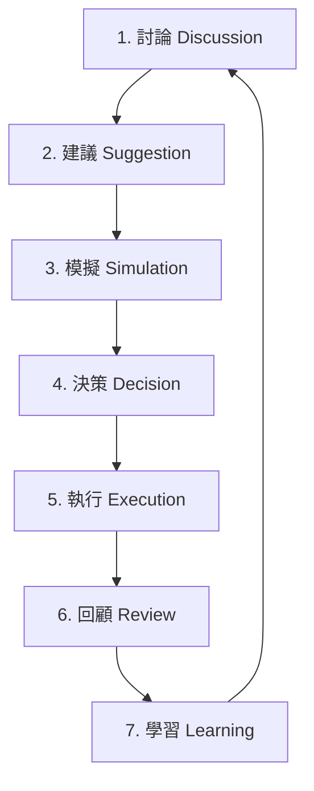

# Seven-Stage Discussion Loop Specification

**Tier**: L1 Platform Architecture & Policy  
**Status**: Canonical Specification & Operational Contract  
**Topic**: Conversation-Plane to Governance-Plane Integration  
**Scope**: Unified Discussion-to-Evolution Spine, Ingestion Schema, and Surface Adapters  

---

## 1. Executive Summary & Architecture

In the Pantheon multi-persona automated trading system, algorithm mutations, portfolio adjustments, and risk policy updates originate from decentralized collaborative surfaces (the **Conversation Plane**). To ensure these decentralized discussions lead to safe, deterministic, and traceable outcomes, they must converge onto a single governance spine (the **Governance Plane**).

This specification formalizes the **Seven-Stage Discussion Loop** and defines the **Surface-Agnostic Proposal Intake Contract**. This contract ensures that any sponsor-approved suggestion from any surface is transformed into a standardized, audited, and back-traceable proposal for downstream review and execution.

```
       +-------------------------------------------------------------+
       |                     CONVERSATION PLANE                      |
       |  +-------------------+  +-----------------+  +------------+ |
       |  | Persona Messaging |  | Agora Workshops |  | Committees | |
       |  +---------+---------+  +--------+--------+  +-----+------+ |
       +------------|---------------------|-----------------|--------+
                    |                     |                 |
                    +---------------------+-----------------+
                                          | (Sponsor Certified)
                                          v
                         +---------------------------------+
                         | Unified Ingestion Contract      |
                         | (Sponsor Decision Bridge)       |
                         +----------------+----------------+
                                          |
                                          v
                         +---------------------------------+
                         | GOVERNANCE BACKBONE             |
                         | [Evolution] [Approval] Services |
                         +---------------------------------+
```

---

## 2. The Seven-Stage Discussion Loop (OODA Spine)

Every mutation of a production or paper trading asset must traverse a durable seven-stage loop. This cycle ensures absolute traceability, preventing unauthorized updates and recurring regressions.



### 2.1. Stage 1: 討論 (Discussion)
*   **Definition**: Personas, operators, and committees converse on specific telemetry events, performance degradation, or market environment shifts.
*   **Action**: Unstructured logs, chat transcripts, or workshop threads compile qualitative rationale.
*   **Status**: Working record (non-governed).

### 2.2. Stage 2: 建議 (Suggestion)
*   **Definition**: Deliberations converge on a concrete proposal.
*   **Action**: A designated **Sponsor Persona** certifies the suggestion, invoking the `SponsorDecisionBridge` to package the decision into a formal proposal structure.
*   **Transition Gate**: Must map to `SponsorDecision` schema. Output state is `proposed`.

### 2.3. Stage 3: 模擬 (Simulation)
*   **Definition**: Automated verification engines, dry-run simulators, or research backtesters evaluate the proposal.
*   **Action**: Run backtests against historical data, check parameter boundaries, and compute risk limits.
*   **Transition Gate**: Simulation outputs are appended to the proposal metadata as evidence reference objects.

### 2.4. Stage 4: 決策 (Decision)
*   **Definition**: Reviewers or governed consensus workflows approve or reject the proposal.
*   **Action**: Verify write-authorization matrix. The proposal status transitions to `approved` or `rejected` inside the `Approval` or `Evolution` service.
*   **Transition Gate**: Explicit signature by authorized roles (operator or reviewer persona).

### 2.5. Stage 5: 執行 (Execution)
*   **Definition**: Gated dispatch workers execute the approved strategy or policy mutation.
*   **Action**: Dispatch worker sends the retrain task to the research plane, registers the new strategy artifact version, and updates the LEAN runtime binding.
*   **Transition Gate**: Successful target state update on the execution plane.

### 2.6. Stage 6: 回顧 (Review)
*   **Definition**: Performance telemetry monitors the mutated asset post-deployment.
*   **Action**: Run continuous rolling PnL and drawdown telemetry checks. If thresholds are breached, an Incident Case is opened.
*   **Transition Gate**: Link the Incident Case and postmortem reports back to the original decision ID.

### 2.7. Stage 7: 學習 (Learning)
*   **Definition**: Feed outcomes and postmortem insights back into persona memory.
*   **Action**: Write summaries into the persona's long-term memory (OpenClaw SOUL) and system baseline configurations.
*   **Transition Gate**: Future Stage 1 discussions cite this learning, closing the loop.

---

## 3. Surface-Agnostic Intake Contract

Regardless of the initiating conversation surface, suggestions must match the `SponsorDecision` bridge contract before entering the governance pipeline.

### 3.1. Unified Input Fields

| Field Name | Type | Required | Description |
|---|---|---|---|
| `decision_id` | `str` | Yes | Stable decision identity used for deterministic proposal mapping. |
| `type` | `str` | Yes | `"approval"` or `"evolution"`. |
| `sponsor_persona_id` | `str` | Yes | Persona ID of the sponsor certifying the proposal. |
| `target_type` | `str` | Yes | Target resource class (e.g., `"strategy_spec"`, `"model_artifact"`, `"allocation_policy"`, `"persona_capital_binding"`). |
| `target_id` | `str` | Yes | Identity of the target asset. |
| `target_version` | `str` | Yes | Immutable target version or snapshot key. |
| `sponsor_decision` | `str` | No | `"approved"`, `"conditional"`, or `"rejected"`. |
| `risk_level` | `str` | No | `"low"`, `"medium"`, `"high"`, or `"critical"`. |
| `rationale` | `str` | No | Human-readable explanation. |
| `evidence_refs` | `list` | No | List of evidence reference objects or ticket strings. |
| `action_type` | `str` | Cond. | Evolution action type (e.g., `"retrain"`, `"freeze"`, `"retire"`) — required if `type="evolution"`. |
| `target_stage` | `str` | Cond. | Expected stage (e.g., `"paper"`, `"canary"`, `"live"`, `"frozen"`) — required if `action_type="freeze"`. |

### 3.2. Evidence Reference Normalization
All inputs to the bridge are normalized into structured governance references:
*   **Manual Review Tickets**: String inputs are converted to `{"ref_type": "manual_review_ticket", "ref_id": <val>}`.
*   **Structured Evidence**: Objects must supply `ref_type` and `ref_id`. Supported types: `evaluator_result`, `critic_finding`, `drift_report`, `telemetry_summary`, `audit_log_entry`, `manual_review_ticket`, `committee_memo`, `service_handoff`.

---

## 4. Conversation Surface Adapters

To decouple conversation interfaces from governance databases, specialized adapters translate native events and pipe them to the `SponsorDecisionBridge`.

### 4.1. Consultation Committee Adapter (Production Baseline)
*   **Trigger**: Operator or service triggers `POST /api/consult/committees/{committee_id}/sponsor-decision`.
*   **Source Data**: Linked `ConsultRequest` and published `ConsultMemo` files.
*   **Adapter Logic**:
    1. Retrieve `ConsultRequest` and all published `ConsultMemo` records.
    2. Convert request metadata and target fields into the `SponsorDecision` payload.
    3. Inject published memos as `committee_memo` evidence references and the generated handoff as a `service_handoff` reference.
    4. Call `bridge()` to construct the proposal (`ApprovalDecisionProposal` or `EvolutionDecisionProposal`).
    5. Perform secure HTTP POST dispatch to the target governance service API.
    6. Record the dispatch status (`sent` or `failed`) in the request metadata.

### 4.2. Agora Workshop Adapter (Future Extension Point)
*   **Trigger**: Dynamic workshop consensus reached and signed off by the workshop coordinator persona.
*   **Source Data**: Workshop debate transcript and voting consensus metrics.
*   **Adapter Logic**:
    1. Parse the consensus artifact.
    2. Map the workshop ID as the `decision_id` and the coordinator persona as `sponsor_persona_id`.
    3. Set `type="evolution"` and map the agreed action (e.g., `"mutate_persona_route_policy"` or `"retrain"`).
    4. Dispatch proposal payload to `/api/evolution/proposals`.

### 4.3. Persona Chat Adapter (Future Extension Point)
*   **Trigger**: Direct operator confirmation of a strategy recommendation during 1-on-1 persona chat.
*   **Source Data**: Structured chat recommendation payload.
*   **Adapter Logic**:
    1. Extract recommendation payload from chat state.
    2. Set `type="approval"` and target fields based on recommended mutations.
    3. Call `bridge()` to obtain an `ApprovalDecisionProposal`.
    4. Dispatch proposal to `/api/governance/approvals`.

---

## 5. Write-Owner, Emergency Semantics, and Document Authority Alignment

### 5.1. Emergency & Safe-Mode Fast-Path Semantics
In accordance with [KILL_SWITCH_AND_SAFE_MODE_EXECUTION_POLICY.md](file:///tmp/pantheon-worker-worktrees/pantheon/evoloop-010/KILL_SWITCH_AND_SAFE_MODE_EXECUTION_POLICY.md), emergency operations (such as `pause`, `risk_off`, `liquidate`, `replace`, and `terminate`) are prioritized for system protection and bypass the multi-stage discussion loop. 
* **Fast-Path Integrity**: Emergency commands must route through the `runtime-manager` high-priority fast path, never bypassing it to contact the LEAN runtime or broker directly.
* **Telemetry Acknowledgement**: An emergency action is complete only when the `runtime-manager` returns a `telemetry_ack` confirming the state change has been successfully registered and persisted.
* **Fail-Closed Default**: In case of a `fail_closed` acknowledgement status, the system remains in the safest possible safe-mode state, and subsequent promotion gates are blocked.

### 5.2. Write-Owner Authority Matrix
State mutations to active assets must respect the write-owner authority matrix defined in [BINDING_AND_DEPLOYMENT_SEMANTICS.md](file:///tmp/pantheon-worker-worktrees/pantheon/evoloop-010/BINDING_AND_DEPLOYMENT_SEMANTICS.md):
* Only the designated write-owners (such as `runtime-manager` or the authorized dispatch worker) may update runtime bindings and active strategy mappings.
* Consultation and conversation plane adapters only generate *proposals* (e.g. `ApprovalDecisionProposal` or `EvolutionDecisionProposal`) and have no direct write authority over production assets or active bindings.

### 5.3. Document Authority & Record Boundary
Under [DOCUMENT_AUTHORITY_AND_RECORD_BOUNDARY.md](file:///tmp/pantheon-worker-worktrees/pantheon/evoloop-010/DOCUMENT_AUTHORITY_AND_RECORD_BOUNDARY.md):
* This specification acts as an L1 platform policy document.
* All discussion transcripts, Agora workshop logs, committee memos, and audit traces generated throughout the Seven-Stage Discussion Loop are categorized as **L2/L3 Working Records** and cannot override or silently rewrite L1 architecture and policy blueprints.

