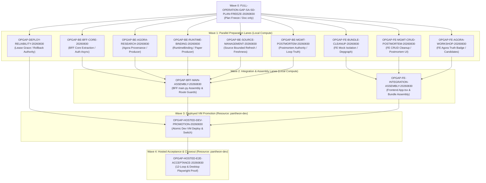

# Pantheon 全產品運作平行執行 DAG — 2026-08-30

| 欄位 | 內容 |
|---|---|
| 文件狀態 | **執行 DAG 規格、波次排程、熱點檔案獨占權限與資源模型** |
| 專案代碼 | `FULL-OPERATION-GAP-CLOSURE-20260830` |
| 規劃基準 | `docs/04/pantheon_full_product_operation_audit_2026-08-29/SA_GAP_REMEDIATION_2026-08-30.md`、`SD_GAP_REMEDIATION_2026-08-30.md` |
| 任務總數 | 1 個凍結審查任務 + 13 個實作/集成任務（共 14 個任務） |

---

## 1. 執行原則與相依圖設計

為達成最大平行化開發並根除衝突，執行 DAG 依循以下關鍵設計：

1. **五波次漸進演進（5-Wave Progressive Execution）**：
   - **Wave 0（規劃凍結）**：獨立審查並合併本規劃文件包，不包含產品代碼修改。
   - **Wave 1（平行準備）**：9 條完全獨立之領域準備任務（5 後端、3 前端、1 部署），檔案集合互不重疊，最大化利用本地計算資源與多 worker 平行運作。
   - **Wave 2（集成匯總）**：2 條匯總任務（BFF Main Assembly 與 Frontend Integration Assembly），由指定之單一整合者負責切換熱點進入點。
    - **Wave 3（原子部署）**：單一任務排他性取得 `pantheon-dev` 資源，在 dev VM 執行原子 promotion 與容器健康驗收。
    - **Wave 4（全量簽收）**：在部署就緒之 VM 上，執行十二循環全量刺激讀回、Source 有界生命週期及桌面端 Playwright 登入態矩陣簽收。
2. **熱點檔案單一所有者（Exclusive Hot-File Ownership）**：
    - 跨任務共用檔案在 Wave 1 僅由所屬領域子模組獨立實作，在 Wave 2/3 由指定任務統籌合併，杜絕 git conflict 與工作樹污染。
3. **容量為 1 之部署資源排隊（Capacity-1 Resource Modeling）**：
    - 將 `pantheon-dev` VM 模型化為 `pantheon-dev` 資源。本地開發與單元測試不受此限制；Wave 3 與 Wave 4 自動依序鎖定此資源。
4. **Supervisor Clone Sessions 多 Worker 平行機制**：
    - 任務擁有者分配於 `Antigravity`（7 任務）與 `Antigravity2`（6 任務），Supervisor 支援透過獨立的 clone sessions 在各自的 git worktree lease 中平行派發多個同型 worker，不受單一進程限制。
    - 審查者採用相異且具備即時審查能力之註冊身分（`Antigravity`、`Antigravity2`、`Codex2`），關鍵審查路徑不依賴外部 Claude/Claude2，並在 materialization 時自動 preflight live capacity。

---

## 2. 完整執行 DAG 圖

---

## 3. 熱點檔案獨占擁有權分配表

| 共享熱點檔案 | 專屬擁有任務 ID | 負責波次 | 處置與協調策略 |
|---|---|:---:|---|
| `services/control-plane/bff/main.py` | `OPGAP-BFF-MAIN-ASSEMBLY-20260830` | Wave 2 | Wave 1 各任務僅在各自 router 檔案編寫代碼；Wave 2 由本任務統一於 `main.py` 執行 `include_router` 並掛載 route guards。 |
| `execute-plans:src/App.tsx` | `OPGAP-FE-INTEGRATION-ASSEMBLY-20260830` | Wave 2 | Wave 1 各前端任務僅修改各自頁面與元件；Wave 2 由本任務統一於 `App.tsx` 與 `ManagementLayout.tsx` 進行最終掛載與清理。 |
| `execute-plans:src/lib/bff-v1/index.ts` | `OPGAP-FE-INTEGRATION-ASSEMBLY-20260830` | Wave 2 | Wave 1 在 `OPGAP-FE-BUNDLE-CLEANUP-20260830` 移除 `writeOverlay` 本體；Wave 2 最終收斂所有 typed domain client 匯出。 |
| `scripts/deploy_nonprod_vm.sh` | `OPGAP-DEPLOY-RELIABILITY-20260830` | Wave 1 | Wave 1 完成 lease 重試、rollback sealed authority 與 exit-code 門禁強化；Wave 3 直接呼叫執行。 |
| `docker-compose.yml` | `OPGAP-HOSTED-DEV-PROMOTION-20260830` | Wave 3 | 由部署推廣任務作為最終單一擁有者，校驗所有容器健康度與環境變數注入。 |

---

## 4. 完整任務清單與契約規格

| 波次 | 任務 ID | 倉庫 | Owner / Reviewer | 主要職責與單一擁有 GAP | 相依前置任務與 Track |
|:---:|---|---|---|---|---|
| **W0** | `FULL-OPERATION-GAP-SA-SD-PLAN-FREEZE-20260830` | Pantheon | Antigravity / Codex2 | 審查並合併本規劃文件套件 (Doc-only) | (無) |
| **W1** | `OPGAP-BE-BFF-CORE-20260830` | Pantheon | Antigravity / Antigravity2 | BFF 核心路由抽取、Auth 探針非同步解耦 (OP-G05)、刪除 dead adapter (OP-G10)、Async ASGI 測試載具 (OP-G13) | W0 (functional) |
| **W1** | `OPGAP-BE-AGORA-RESEARCH-20260830` | Pantheon | Antigravity2 / Antigravity | Agora 偽造 real 修復 (OP-G01)、建議生產者連線 (OP-G02)、私有 import 清理 (OP-G09) | W0 (functional) |
| **W1** | `OPGAP-BE-RUNTIME-BINDING-20260830` | Pantheon | Antigravity / Codex2 | 權威不可變 RuntimeBinding 物理投影生成 (OP-G17)、Paper 生產者訊號閉環單元驗證 | W0 (functional) |
| **W1** | `OPGAP-BE-SOURCE-MANAGEMENT-20260830` | Pantheon | Antigravity2 / Antigravity | Source 常態 reconcile-only 強制、單次有界手動更新契約、台灣時段新鮮度保護 (OP-G12) | W0 (functional) |
| **W1** | `OPGAP-BE-MGMT-POSTMORTEM-20260830` | Pantheon | Antigravity / Antigravity2 | Canonical Postmortem 權威服務與 postmortem_id 綁定 (OP-G18)、十二循環純淨投影驗證 | W0 (functional) |
| **W1** | `OPGAP-FE-BUNDLE-CLEANUP-20260830` | execute-plans | Antigravity2 / Antigravity | 前端 Production 打包隔離、完全切斷 mock/seed 依賴圖譜與構建門禁 (OP-G07) | W0 (functional) |
| **W1** | `OPGAP-FE-MGMT-CRUD-POSTMORTEM-20260830` | execute-plans | Antigravity / Codex2 | 前端淘汰 writeOverlay 假寫入 (OP-G06)、Management 頁面改接 Postmortem 權威端點 | W0 (functional) |
| **W1** | `OPGAP-FE-AGORA-WORKSHOP-20260830` | execute-plans | Antigravity2 / Codex2 | Workshop 顯式呈現 Adapter 真實性 Badge、動態候選池加載、績效建議元件 (OP-G15) | W0 (functional) |
| **W1** | `OPGAP-DEPLOY-RELIABILITY-20260830` | Pantheon | Antigravity / Antigravity2 | 部署租約心跳重試與本地封閉回滾授權 (OP-G16)、消除 CI 假綠燈與 fail-closed 強化 (OP-G04) | W0 (functional) |
| **W2** | `OPGAP-BFF-MAIN-ASSEMBLY-20260830` | Pantheon | Antigravity / Codex2 | 單一擁有者收斂 `main.py` composition root、掛載所有領域 router 並通過 route guard 測試 (OP-G08) | T1..T5 (functional) |
| **W2** | `OPGAP-FE-INTEGRATION-ASSEMBLY-20260830` | execute-plans | Antigravity2 / Antigravity | 單一擁有者收斂 `App.tsx`、`bff-v1/index.ts`，通過全量前端型別與打包檢查 | T6..T8 (functional) |
| **W3** | `OPGAP-HOSTED-DEV-PROMOTION-20260830` | Pantheon | Antigravity / Codex2 | 鎖定 `pantheon-dev` 資源，執行 Dev VM 原子部署、容器健康驗證與 Agora/Paper 閉環 (OP-G03, OP-G19, OP-G20) | T9..T11 (functional) |
| **W4** | `OPGAP-HOSTED-E2E-ACCEPTANCE-20260830` | Pantheon | Antigravity2 / Codex2 | 鎖定 `pantheon-dev` 資源，執行十二循環全量測試 (OP-G11)、Source 有界更新週期、桌面端登入態 Playwright 矩陣 (OP-G14) | T12 (hosted) |

---

## 5. 資源模型化與平行執行規則

1. **本地執行環境（Local Compute Lanes）**：
   - Wave 1（任務 T1~T9）及 Wave 2（任務 T10~T11）不消耗實體 VM 資源。Auto-workers 可在各自獨立的 git worktree 中平行編寫、執行本機 pytest / vitest 測試、產出 PR 並由相異身分之 Reviewer 進行審查。
2. **實體 VM 執行環境（`pantheon-dev`）**：
   - 資源識別碼：`pantheon-dev`（容量 = 1）。
   - 僅 Wave 3（`OPGAP-HOSTED-DEV-PROMOTION-20260830`）與 Wave 4（`OPGAP-HOSTED-E2E-ACCEPTANCE-20260830`）在 `execution_resources` 中宣告。
   - 確保同時只有一個任務操作 Dev VM，防止部署租約爭搶或測試狀態相互污染。
