# Execution DAG and Parallelization Architecture (2026-08-30)

## 1. Execution Dependency Graph (30 Tasks)

```mermaid
graph TD
    classDef bootstrap fill:#e1f5fe,stroke:#0288d1,stroke-width:2px;
    classDef backend fill:#e8f5e9,stroke:#388e3c,stroke-width:2px;
    classDef frontend fill:#fff3e0,stroke:#f57c00,stroke-width:2px;
    classDef assembly fill:#f3e5f5,stroke:#7b1fa2,stroke-width:2px;
    classDef hosted fill:#fce4ec,stroke:#c2185b,stroke-width:2px;

    BOOT[OPGAP-DEVTOOL-TARGET-REPO-BRIDGE-20260830]:::bootstrap

    PORTS[OPGAP-BE-PORT-NAMESPACE-CONSOLIDATION-20260830]:::backend
    CORE[OPGAP-BE-BFF-CORE-20260830]:::backend
    PER[OPGAP-BE-PERSONA-ROUTER-20260830]:::backend
    TRN[OPGAP-BE-TRAINING-ROUTER-20260830]:::backend
    AGR[OPGAP-BE-AGORA-ROUTER-20260830]:::backend
    RES[OPGAP-BE-RESEARCH-ROUTER-20260830]:::backend
    GOV[OPGAP-BE-GOVERNANCE-ROUTER-20260830]:::backend
    EVO[OPGAP-BE-EVOLUTION-ROUTER-20260830]:::backend
    CAP[OPGAP-BE-CAPITAL-ROUTER-20260830]:::backend
    STR[OPGAP-BE-STRATEGY-RANKING-20260830]:::backend
    MGT[OPGAP-BE-MANAGEMENT-ROUTER-20260830]:::backend
    PST[OPGAP-BE-POSTMORTEM-ROUTER-20260830]:::backend
    INC[OPGAP-BE-INCIDENT-ROUTER-20260830]:::backend
    EVT[OPGAP-BE-EVENTS-ROUTER-20260830]:::backend

    TOOL[OPGAP-BE-TOOLS-INTEGRATIONS-20260830]:::frontend
    LOOP[OPGAP-BE-CONTROL-LOOPS-20260830]:::frontend
    CMD[OPGAP-BE-COMMAND-ADAPTERS-20260830]:::frontend
    RUN[OPGAP-BE-RUNTIME-BINDING-20260830]:::frontend
    DEP[OPGAP-DEPLOY-RELIABILITY-20260830]:::frontend
    FE_CLN[OPGAP-FE-BUNDLE-CLEANUP-20260830]:::frontend
    FE_MGT[OPGAP-FE-MGMT-CRUD-POSTMORTEM-20260830]:::frontend
    FE_AGR[OPGAP-FE-AGORA-WORKSHOP-20260830]:::frontend
    FE_ASM[OPGAP-FE-INTEGRATION-ASSEMBLY-20260830]:::frontend

    MAIN_ASM[OPGAP-BFF-MAIN-ASSEMBLY-20260830]:::assembly
    CALLER[OPGAP-BE-COMMAND-CALLER-CUTOVER-20260830]:::assembly
    RETIRE[OPGAP-BE-COMMAND-PLANE-RETIREMENT-20260830]:::assembly

    PROMO[OPGAP-HOSTED-DEV-PROMOTION-20260830]:::hosted
    ACCEPT_BE[OPGAP-HOSTED-BACKEND-ACCEPTANCE-20260830]:::hosted
    ACCEPT_MG[OPGAP-HOSTED-MGMT-ACCEPTANCE-20260830]:::hosted

    BOOT --> PORTS
    BOOT --> CORE
    BOOT --> PER
    BOOT --> TRN
    BOOT --> AGR
    BOOT --> RES
    BOOT --> GOV
    BOOT --> EVO
    BOOT --> CAP
    BOOT --> STR
    BOOT --> MGT
    BOOT --> PST
    BOOT --> INC
    BOOT --> EVT

    BOOT --> TOOL
    BOOT --> LOOP
    BOOT --> CMD
    BOOT --> RUN
    BOOT --> DEP
    BOOT --> FE_CLN
    BOOT --> FE_MGT
    BOOT --> FE_AGR

    FE_CLN --> FE_ASM
    FE_MGT --> FE_ASM
    FE_AGR --> FE_ASM

    PORTS --> MAIN_ASM
    CORE --> MAIN_ASM
    PER --> MAIN_ASM
    TRN --> MAIN_ASM
    AGR --> MAIN_ASM
    RES --> MAIN_ASM
    GOV --> MAIN_ASM
    EVO --> MAIN_ASM
    CAP --> MAIN_ASM
    STR --> MAIN_ASM
    MGT --> MAIN_ASM
    PST --> MAIN_ASM
    INC --> MAIN_ASM
    EVT --> MAIN_ASM
    TOOL --> MAIN_ASM
    LOOP --> MAIN_ASM
    CMD --> MAIN_ASM
    RUN --> MAIN_ASM
    DEP --> MAIN_ASM

    MAIN_ASM --> CALLER
    CALLER --> RETIRE
    MAIN_ASM --> PROMO
    RETIRE --> PROMO
    FE_ASM --> PROMO
    PROMO --> ACCEPT_BE
    PROMO --> ACCEPT_MG
    FE_ASM --> ACCEPT_MG
```



---

## 2. Batch Composition & Parallel Execution Rules

### Batch A: Bootstrap (1 Task)
- `OPGAP-DEVTOOL-TARGET-REPO-BRIDGE-20260830` (Owner: Antigravity, Reviewer: Codex)
- Establishes signed target repository persistence in `.orchestrator/development_bridge/`.

### Batch B: Parallel Domain Preparation (14 Tasks)
- Runs in parallel immediately after Batch A completes.
- Decouples all 18 domain routes and consolidates `ports/`.
- Tasks: `OPGAP-BE-PORT-NAMESPACE-CONSOLIDATION-20260830`, `OPGAP-BE-BFF-CORE-20260830`, `OPGAP-BE-PERSONA-ROUTER-20260830`, `OPGAP-BE-TRAINING-ROUTER-20260830`, `OPGAP-BE-AGORA-ROUTER-20260830`, `OPGAP-BE-RESEARCH-ROUTER-20260830`, `OPGAP-BE-GOVERNANCE-ROUTER-20260830`, `OPGAP-BE-EVOLUTION-ROUTER-20260830`, `OPGAP-BE-CAPITAL-ROUTER-20260830`, `OPGAP-BE-STRATEGY-RANKING-20260830`, `OPGAP-BE-MANAGEMENT-ROUTER-20260830`, `OPGAP-BE-POSTMORTEM-ROUTER-20260830`, `OPGAP-BE-INCIDENT-ROUTER-20260830`, `OPGAP-BE-EVENTS-ROUTER-20260830`.

### Batch C: Support & Frontend (9 Tasks)
- Runs in parallel with Batch B.
- Cleans frontend residuals, fixes generic CRUD, prepares desktop views, and provides support routers.
- Tasks: `OPGAP-BE-TOOLS-INTEGRATIONS-20260830`, `OPGAP-BE-CONTROL-LOOPS-20260830`, `OPGAP-BE-COMMAND-ADAPTERS-20260830`, `OPGAP-BE-RUNTIME-BINDING-20260830`, `OPGAP-DEPLOY-RELIABILITY-20260830`, `OPGAP-FE-BUNDLE-CLEANUP-20260830`, `OPGAP-FE-MGMT-CRUD-POSTMORTEM-20260830`, `OPGAP-FE-AGORA-WORKSHOP-20260830`, `OPGAP-FE-INTEGRATION-ASSEMBLY-20260830`.

### Batch D: Assembly, Retirement & Hosted Promotion/Acceptance (6 Tasks)
- Requires completion of all Batch B and Batch C tasks.
- Executes `main.py` assembly, command plane deletion, and hosted dev deployment / backend acceptance / Management UI acceptance.
- Tasks: `OPGAP-BFF-MAIN-ASSEMBLY-20260830`, `OPGAP-BE-COMMAND-CALLER-CUTOVER-20260830`, `OPGAP-BE-COMMAND-PLANE-RETIREMENT-20260830`, `OPGAP-HOSTED-DEV-PROMOTION-20260830`, `OPGAP-HOSTED-BACKEND-ACCEPTANCE-20260830`, `OPGAP-HOSTED-MGMT-ACCEPTANCE-20260830`.

---

## 3. Predecessor Reconciliation Truth

1. **`AGORA-PERSONA-DURABLE-LIST-READBACK-V2-20260830`**:
   - Canonical status: `done` (terminal done, merged to Pantheon dev `d2bca5bc70bfae897e1ef3ca736ad3680a587679` via PR #5427).
   - Recorded as predecessor truth; not present in `depends_on` or active blockers.
2. **`AGORA-AGC-14-HOSTED-DEMO-AUTHENTIC-V5-20260829`**:
   - Canonical status: `in_progress` (Agora-only authentic hosted demo in `execute-plans`).
   - Reused as the sole owner for `OP-G14` in Agora scope; Management hosted acceptance is separately materialized under `OPGAP-HOSTED-MGMT-ACCEPTANCE-20260830`.

---

## 4. Resource & Agent Capacity Constraints

1. **Host Capacity**: `pantheon-dev` has strict capacity = 1. Only hosted promotion and acceptance tasks (`OPGAP-HOSTED-DEV-PROMOTION-20260830`, `OPGAP-HOSTED-BACKEND-ACCEPTANCE-20260830`, `OPGAP-HOSTED-MGMT-ACCEPTANCE-20260830`, `AGORA-AGC-14-HOSTED-DEMO-AUTHENTIC-V5-20260829`) acquire this resource.
2. **Agent Capability Lanes**: Every child task has distinct owner and reviewer selected from the active auto-worker agents (`Antigravity`, `Antigravity2`, `Codex`, `Codex2`, `Claude`) with live config capacity derived dynamically from `.orchestrator/config.json`.

---

## 5. Reproducible Dynamic Validation Command

```bash
python3 -c "
import ast, json, hashlib, os, sys

source_code = open('services/control-plane/bff/main.py').read()
tree = ast.parse(source_code)
c = json.load(open('docs/04/pantheon_full_product_operation_audit_2026-08-29/EXECUTION_TASK_CATALOG_2026-08-30.json'))
tasks = c['tasks']
nodes = c['main_ast_node_inventory']['nodes']

assert len(nodes) == len(tree.body) == 2271, f'AST count mismatch: catalog {len(nodes)} != live {len(tree.body)}'
assert len(tasks) == 30, f'Task count mismatch: {len(tasks)} != 30'

# 1. Verify AST digests and content parity across all nodes
for i, (cat_node, ast_node) in enumerate(zip(nodes, tree.body)):
    dump_str = ast.dump(ast_node, annotate_fields=True, include_attributes=False)
    exp_digest = hashlib.sha256(dump_str.encode('utf-8')).hexdigest()[:16]
    assert cat_node.get('ast_digest') == exp_digest, f'Node {i} AST digest mismatch'

# 2. Verify Edge-Level Cutover Mapping Parity (100% match between named_consumers and consumer_cutover_mapping)
for n in nodes:
    nc = n.get('named_consumers')
    cm = n.get('consumer_cutover_mapping')
    if nc is not None:
        assert cm is not None, f'Node {n.get("node_index")} has named_consumers but missing consumer_cutover_mapping'
        assert set(nc) == set(cm.keys()), f'Node {n.get("node_index")} cutover mapping keys do not match named_consumers'
        assert all(isinstance(v, str) and len(v) > 0 for v in cm.values()), f'Node {n.get("node_index")} has empty cutover mapping values'
    else:
        assert cm is None, f'Node {n.get("node_index")} has consumer_cutover_mapping but no named_consumers'

# 3. Verify Legacy Action Cluster and os.makedirs disposition
legacy_cluster_nodes = [n for n in nodes if n.get('legacy_action_cluster')]
assert len(legacy_cluster_nodes) == 9, f'Expected 9 legacy action cluster nodes, found {len(legacy_cluster_nodes)}'
for n in legacy_cluster_nodes:
    assert n['owner_task'] == 'OPGAP-BFF-MAIN-ASSEMBLY-20260830', f'Legacy node {n["node_index"]} must be owned by assembly'
    assert n.get('zero_production_caller_evidence'), f'Legacy node {n["node_index"]} missing zero_production_caller_evidence'

n118 = nodes[118]
assert n118['disposition'] == 'composition_keep' and n118['owner_task'] == 'OPGAP-BFF-MAIN-ASSEMBLY-20260830', 'os.makedirs node 118 invalid'

# 4. Verify route migration inventory parity
rmi = c.get('route_migration_inventory', {})
assignments = rmi.get('assignments', [])
handlers = rmi.get('handler_migration_dispositions', [])
assert len(assignments) == 441, f'Assignments count mismatch: {len(assignments)} != 441'
assert len(handlers) == 421, f'Handlers count mismatch: {len(handlers)} != 421'

# 5. Verify batches and set equality
batches = c['materialization_contract']['batches']
batched_tasks = [tid for b in batches for tid in b['tasks']]
assert len(batched_tasks) == len(tasks) == 30, f'Batch equality failed: {len(batched_tasks)} != {len(tasks)}'
assert set(batched_tasks) == set(t['id'] for t in tasks), 'Batch task set does not match task inventory'
assert all(len(b['tasks']) <= 16 for b in batches), 'A batch exceeds fleet limit of 16 tasks'

# 6. Verify exclusive code surfaces (no duplicates, no prefix collisions)
surfaces = {}
for t in tasks:
    for s in t.get('owned_code_surfaces', []):
        surfaces.setdefault(s, []).append(t['id'])
dups = {s: ids for s, ids in surfaces.items() if len(ids) > 1}
assert not dups, f'Duplicate owned surfaces: {dups}'

assert not [n for n in nodes if n.get('disposition') == 'extract_shared_port' and n.get('node_type') in ('Import', 'ImportFrom')], 'Found stdlib extract_shared_port'
assert all(len(t.get('deletion', [])) > 0 for t in tasks), 'All tasks must have non-empty deletion inventory'

# 7. Verify safe rollback semantics
forbidden_rb = ['restores deleted', 'restore domain_ports', 'revert to in-memory', 'revert to local helper', 'preserve legacy']
for t in tasks:
    tid = t['id']
    rb = t.get('rollback', '').lower()
    for w in forbidden_rb:
        assert w not in rb, f'Forbidden rollback in {tid}: {rb}'

# 8. Verify DAG acyclicity
graph = {t['id']: set(t.get('depends_on', [])) for t in tasks}
visited, visiting = set(), set()
def dfs(n):
    if n in visiting: return False
    if n in visited: return True
    visiting.add(n)
    for nbr in graph.get(n, []):
        if nbr in graph and not dfs(nbr): return False
    visiting.remove(n); visited.add(n)
    return True
assert all(dfs(t) for t in graph), 'Cycle detected in DAG'

# 9. Verify Source Proof Contract
sp = c.get('source_proof_contract', {})
assert sp.get('receipt_binding') == 'source_proof_receipt_id', 'source_proof_contract missing receipt_binding'
assert sp.get('max_ticks') == 1 and sp.get('max_records') == 100, 'source_proof_contract bounded limits invalid'
assert sp.get('dev_mode_default') == 'reconcile_only', 'source_proof_contract dev_mode_default must be reconcile_only'

assert all(n.get('rationale') for n in nodes), 'All AST nodes must have non-empty rationale'

# 10. Verify Special node mappings
n37 = nodes[37]
assert n37['target_router'] == 'services/control-plane/bff/ports/param_utils.py' and len(n37['consumer_cutover_mapping']) >= 5, '_resolve_param mapping invalid'
assert 'OPGAP-BE-MANAGEMENT-ROUTER-20260830' in n37['named_consumers'], '_resolve_param named_consumers missing Management'

n39 = nodes[39]
assert n39['target_router'] == 'services/control-plane/bff/ports/config.py' and len(n39['consumer_cutover_mapping']) >= 3, '_REPO_ROOT mapping invalid'

n43 = nodes[43]
assert n43['target_router'] == 'services/control-plane/bff/ports/config.py' and len(n43['consumer_cutover_mapping']) >= 3, '_CRON_SERVICE_DIR mapping invalid'

n76 = nodes[76]
assert n76['disposition'] == 'composition_keep' and n76.get('consumer_cutover_mapping') is not None, 'log node cutover invalid'
assert n76['consumer_cutover_mapping']['OPGAP-BE-BFF-CORE-20260830'] == 'logging.getLogger(__name__)', 'log logger replacement invalid'

# 11. Verify Reverse-Main Symbol Inventory & External Reverse-Main Inventory
rev = c.get('reverse_main_symbol_inventory', [])
assert len(rev) == 1914, f'Expected 1914 reverse main symbols, found {len(rev)}'
for entry in rev:
    sym = entry['symbol']
    for ct, target_str in entry.get('cutover_mapping', {}).items():
        assert target_str.endswith(f".{sym}"), f'Corruption in {sym} -> {target_str}'

rev_inv = c.get('external_reverse_main_symbol_inventory', {})
assert rev_inv.get('total_import_instances', 0) == 269, f'Expected 269 reverse-main instances, found {rev_inv.get("total_import_instances")}'
assert rev_inv.get('unique_caller_files_count', 0) == 214, f'Expected 214 caller files, found {rev_inv.get("unique_caller_files_count")}'

# 12. Verify Domain Ports Caller Inventory
dp_inv = c.get('domain_ports_caller_inventory', {})
assert dp_inv.get('total_imported_symbol_rows') == 191, f'Expected 191 imported-symbol rows, found {dp_inv.get("total_imported_symbol_rows")}'
assert dp_inv.get('total_unique_caller_files') == 22, f'Expected 22 unique caller files, found {dp_inv.get("total_unique_caller_files")}'
assert dp_inv.get('production_caller_files_count') == 7, f'Expected 7 production caller files, found {dp_inv.get("production_caller_files_count")}'
assert dp_inv.get('test_caller_files_count') == 15, f'Expected 15 test caller files, found {dp_inv.get("test_caller_files_count")}'
assert dp_inv.get('production_imported_symbol_rows_count') == 129, f'Expected 129 production rows, found {dp_inv.get("production_imported_symbol_rows_count")}'
assert dp_inv.get('test_imported_symbol_rows_count') == 62, f'Expected 62 test rows, found {dp_inv.get("test_imported_symbol_rows_count")}'

# 13. Verify Planning Agent Capacity & Task Assignment
cap = c.get('planning_agent_capacity', {})
assert cap.get('dynamic_derived') is True, 'Capacity must be dynamically derived'
for t in tasks:
    assert t['owner'] != t['reviewer'], f'Owner equals reviewer in {t["id"]}'
    assert cap['agent_eligibility'][t['owner']]['eligible'], f'Owner {t["owner"]} not eligible'
    assert cap['agent_eligibility'][t['reviewer']]['eligible'], f'Reviewer {t["reviewer"]} not eligible'

# 14. Verify Baseline
pb = c.get('planning_baseline', {})
assert pb.get('hosted_pair_id') == 'c426db52184193a4063e57e6d8f06b14d8743336db7ab50f06b8325165d5902e', 'Stale hosted pair ID'
assert pb.get('hosted_backend') == 'd2bca5bc70bfae897e1ef3ca736ad3680a587679', 'Stale hosted backend'
assert pb.get('hosted_accepted_at') == '2026-08-30T09:28:54Z', 'Stale hosted accepted at'

print('SUCCESS: All comprehensive dynamic validation assertions passed!')
"
```
