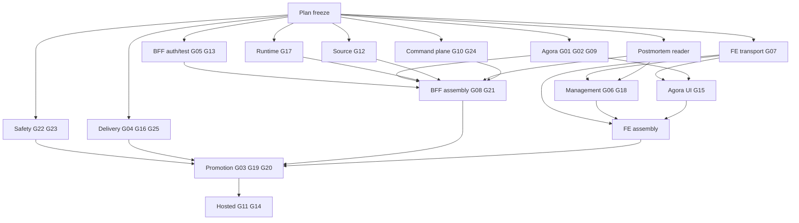

# Pantheon 全產品根因改造執行 DAG — 2026-08-30

| 欄位 | 內容 |
|---|---|
| Status | plan-freeze candidate |
| Tasks | 1 plan-freeze + 15 execution |
| GAP | G01–G25 each one primary owner |
| Catalog | [`EXECUTION_TASK_CATALOG_2026-08-30.json`](EXECUTION_TASK_CATALOG_2026-08-30.json) |

只加fallback/alias/facade/mock/skip/second route的task不得進assembly。

## 1. Rules

1. W0 independent exact-head review後才materialize。
2. Postmortem/Source沿用existing owner/mechanism；BFF不接管writes。
3. Contract、caller cutover、zero-caller proof、legacy deletion為same delivery unit。
4. Assembly tasks獨占main/App/layout/barrel。
5. W3部署exact pair；W4只驗該pair；fail/skip/missing/0-job/wrong SHA非pass。
6. Devtool TaskStore/supervisor由existing package擁有，不建第二truth writer。

## 2. DAG



Consumer tasks必須等owner contracts；assemblies必須等domain cutovers；promotion必須等safety與release。

## 3. Task table

| W | Task | Repo | Owner / reviewer | GAP/role |
|:---:|---|---|---|---|
| 0 | `FULL-OPERATION-GAP-SA-SD-PLAN-FREEZE-20260830` | pantheon | Antigravity / Codex2 | freeze |
| 1 | `OPGAP-SAFETY-PROOF-CONTRACT-20260830` | pantheon | Antigravity / Codex2 | G22、G23 |
| 1 | `OPGAP-DELIVERY-POLICY-20260830` | pantheon | Antigravity2 / Codex2 | G04、G16、G25 |
| 1 | `OPGAP-BE-BFF-CORE-20260830` | pantheon | Antigravity / Antigravity2 | G05、G13 |
| 1 | `OPGAP-BE-AGORA-RESEARCH-20260830` | pantheon | Antigravity2 / Antigravity | G01、G02、G09 |
| 1 | `OPGAP-BE-RUNTIME-BINDING-20260830` | pantheon | Codex2 / Antigravity | G17 |
| 1 | `OPGAP-BE-SOURCE-CLOSURE-20260830` | pantheon | Antigravity / Codex2 | G12 |
| 1 | `OPGAP-BE-POSTMORTEM-READ-CUTOVER-20260830` | pantheon | Antigravity2 / Antigravity | supports G18 |
| 1 | `OPGAP-FE-TRANSPORT-RETIREMENT-20260830` | execute-plans | Antigravity / Antigravity2 | G07 |
| 1 | `OPGAP-COMMAND-PLANE-RETIREMENT-20260830` | pantheon | Antigravity / Codex2 | G10、G24 |
| 2 | `OPGAP-FE-MGMT-BINDING-20260830` | execute-plans | Antigravity2 / Codex2 | G06、G18 |
| 2 | `OPGAP-FE-AGORA-CAPABILITY-20260830` | execute-plans | Codex2 / Antigravity | G15 |
| 2 | `OPGAP-BFF-MAIN-ASSEMBLY-20260830` | pantheon | Antigravity2 / Codex2 | G08、G21 |
| 2 | `OPGAP-FE-INTEGRATION-ASSEMBLY-20260830` | execute-plans | Antigravity / Antigravity2 | FE hot files |
| 3 | `OPGAP-HOSTED-DEV-PROMOTION-20260830` | pantheon | Antigravity2 / Codex2 | G03、G19、G20 |
| 4 | `OPGAP-HOSTED-E2E-ACCEPTANCE-20260830` | pantheon | Codex2 / Antigravity | G11、G14 |

Assignments是candidate；materialization前用canonical live capacity驗證。

## 4. Exclusive hot files

| Path | Owner |
|---|---|
| `services/runtime_manager/service.py` | safety |
| `.github/workflows/publish-promote.yml`、`scripts/deploy_nonprod_vm.sh` | delivery |
| `services/control-plane/bff/main.py` | BFF assembly |
| `docker-compose.yml` | command-plane retirement |
| `execute-plans:src/App.tsx`、`ManagementLayout.tsx`、`bff-v1/index.ts` | FE assembly |

## 5. Retirement owners

| Target | Cutover | Delete owner | Forbidden replacement |
|---|---|---|---|
| action adapter/internal API/mount/env | direct domain owners | command-plane | compat facade |
| router import main | injection | BFF assembly | module shim |
| read-store shell/fallback | named owners | BFF assembly | generic store |
| Postmortem aliases | canonical reads | BFF assembly | second store |
| Source aliases | direct imports | Source | second refresh route |
| overlay/writeFallback/seed | typed clients | FE transport | local-success rename |
| dead NL files | zero callers | FE transport | legacy folder |
| second Workshop store | bootstrap merge | Agora | second adapter |
| superseded workflows | canonical gate | delivery | wrapper workflows |

Every deletion requires caller inventory/parity/zero-caller/tests/forbidden reference proof。

## 6. Wave gates

- W0→W1：six docs對25 GAP/15 tasks一致；JSON/links/review；refetch兩repo。
- W1/W2→W3：task PRs merged；BFF multi-replica/IDs green；formal EP5 proof；frontend graph clean；
  retired paths deleted；exact-SHA release/branch audit green。
- W3→W4：manifest exact FE/BFF、live/strict、安全writes/CORS；pre-switch failure保留old pair；natural
  Source→Agora→paper receipts。
- W4→close：12 loops no skip；authenticated DOM/network/console/readback；exact-pair evidence no secrets；
  canonical TaskStore only。

```bash
CAT=docs/04/pantheon_full_product_operation_audit_2026-08-29/EXECUTION_TASK_CATALOG_2026-08-30.json
jq empty "$CAT"
jq -e '.tasks|length==15' "$CAT"
jq -e '[.tasks[].gaps[]]|length==25 and length==(unique|length)' "$CAT"
jq -e '[.plan_freeze_task.artifacts[],.tasks[].artifacts[]]|length==(unique|length)' "$CAT"
jq -e '[.plan_freeze_task,.tasks[]]|all((.dependency_tracks|keys|sort)==(.depends_on|sort))' "$CAT"
```
