# Execution DAG and Parallelization Architecture (2026-08-30)

## 1. Execution Dependency Graph (30 Tasks)

```mermaid
graph TD
    classDef bootstrap fill:#e1f5fe,stroke:#0288d1,stroke-width:2px;
    classDef backend fill:#e8f5e9,stroke:#388e3c,stroke-width:2px;
    classDef frontend fill:#fff3e0,stroke:#f57c00,stroke-width:2px;
    classDef assembly fill:#f3e5f5,stroke:#7b1fa2,stroke-width:2px;
    classDef hosted fill:#fce4ec,stroke:#c2185b,stroke-width:2px;

    BOOT[OPGAP-DEVTOOL-TARGET-REPO-BRIDGE-20260830]:::bootstrap

    PORTS[OPGAP-BE-PORT-NAMESPACE-CONSOLIDATION-20260830]:::backend
    CORE[OPGAP-BE-BFF-CORE-20260830]:::backend
    PER[OPGAP-BE-PERSONA-ROUTER-20260830]:::backend
    TRN[OPGAP-BE-TRAINING-ROUTER-20260830]:::backend
    AGR[OPGAP-BE-AGORA-ROUTER-20260830]:::backend
    RES[OPGAP-BE-RESEARCH-ROUTER-20260830]:::backend
    GOV[OPGAP-BE-GOVERNANCE-ROUTER-20260830]:::backend
    EVO[OPGAP-BE-EVOLUTION-ROUTER-20260830]:::backend
    CAP[OPGAP-BE-CAPITAL-ROUTER-20260830]:::backend
    STR[OPGAP-BE-STRATEGY-RANKING-20260830]:::backend
    MGT[OPGAP-BE-MANAGEMENT-ROUTER-20260830]:::backend
    PST[OPGAP-BE-POSTMORTEM-ROUTER-20260830]:::backend
    INC[OPGAP-BE-INCIDENT-ROUTER-20260830]:::backend
    EVT[OPGAP-BE-EVENTS-ROUTER-20260830]:::backend

    TOOL[OPGAP-BE-TOOLS-INTEGRATIONS-20260830]:::frontend
    LOOP[OPGAP-BE-CONTROL-LOOPS-20260830]:::frontend
    CMD[OPGAP-BE-COMMAND-ADAPTERS-20260830]:::frontend
    RUN[OPGAP-BE-RUNTIME-BINDING-20260830]:::frontend
    DEP[OPGAP-DEPLOY-RELIABILITY-20260830]:::frontend
    FE_CLN[OPGAP-FE-BUNDLE-CLEANUP-20260830]:::frontend
    FE_MGT[OPGAP-FE-MGMT-CRUD-POSTMORTEM-20260830]:::frontend
    FE_AGR[OPGAP-FE-AGORA-WORKSHOP-20260830]:::frontend
    FE_ASM[OPGAP-FE-INTEGRATION-ASSEMBLY-20260830]:::frontend

    MAIN_ASM[OPGAP-BFF-MAIN-ASSEMBLY-20260830]:::assembly
    CALLER[OPGAP-BE-COMMAND-CALLER-CUTOVER-20260830]:::assembly
    RETIRE[OPGAP-BE-COMMAND-PLANE-RETIREMENT-20260830]:::assembly

    PROMO[OPGAP-HOSTED-DEV-PROMOTION-20260830]:::hosted
    ACCEPT_BE[OPGAP-HOSTED-BACKEND-ACCEPTANCE-20260830]:::hosted
    ACCEPT_MG[OPGAP-HOSTED-MGMT-ACCEPTANCE-20260830]:::hosted

    BOOT --> PORTS
    BOOT --> CORE
    BOOT --> PER
    BOOT --> TRN
    BOOT --> AGR
    BOOT --> RES
    BOOT --> GOV
    BOOT --> EVO
    BOOT --> CAP
    BOOT --> STR
    BOOT --> MGT
    BOOT --> PST
    BOOT --> INC
    BOOT --> EVT

    BOOT --> TOOL
    BOOT --> LOOP
    BOOT --> CMD
    BOOT --> RUN
    BOOT --> DEP
    BOOT --> FE_CLN
    BOOT --> FE_MGT
    BOOT --> FE_AGR

    FE_CLN --> FE_ASM
    FE_MGT --> FE_ASM
    FE_AGR --> FE_ASM

    PORTS --> MAIN_ASM
    CORE --> MAIN_ASM
    PER --> MAIN_ASM
    TRN --> MAIN_ASM
    AGR --> MAIN_ASM
    RES --> MAIN_ASM
    GOV --> MAIN_ASM
    EVO --> MAIN_ASM
    CAP --> MAIN_ASM
    STR --> MAIN_ASM
    MGT --> MAIN_ASM
    PST --> MAIN_ASM
    INC --> MAIN_ASM
    EVT --> MAIN_ASM
    TOOL --> MAIN_ASM
    LOOP --> MAIN_ASM
    CMD --> MAIN_ASM
    RUN --> MAIN_ASM
    DEP --> MAIN_ASM

    MAIN_ASM --> CALLER
    CALLER --> RETIRE
    MAIN_ASM --> PROMO
    RETIRE --> PROMO
    FE_ASM --> PROMO
    PROMO --> ACCEPT_BE
    PROMO --> ACCEPT_MG
    FE_ASM --> ACCEPT_MG
```



---

### 2. Batch Composition & Parallel Execution Rules (Signed DevTaskPacket Inbox Mapping)

All 30 child tasks are mapped to 4 dependency-closed materialization batches satisfying the supervisor fleet constraint (`task_count <= 16` per atomic packet) via the signed local DevTaskPacket bridge (`.orchestrator/assistant-dev-packets/`):

### Batch A: Bootstrap (1 Task)
- `OPGAP-DEVTOOL-TARGET-REPO-BRIDGE-20260830` (Owner: Antigravity, Reviewer: Codex, Repo: `pantheon`, Class: `development_tooling`)
- Status: `materializable_now: true`, `allowed_repos: ["pantheon"]`.
- Establishes signed target repository persistence in `.orchestrator/development_bridge/`.

### Batch B: Parallel Domain Preparation (14 Tasks)
- Status: `materializable_now: false` (gated on Batch A bootstrap merge and command runtime promotion), `allowed_repos: ["pantheon"]`.
- Runs in parallel immediately after Batch A completes.
- Decouples 13 primary domain routers and consolidates `ports/` (with the remaining 5 support and infrastructure domain routers decoupled in Batch C).
- Tasks: `OPGAP-BE-PORT-NAMESPACE-CONSOLIDATION-20260830`, `OPGAP-BE-BFF-CORE-20260830`, `OPGAP-BE-PERSONA-ROUTER-20260830`, `OPGAP-BE-TRAINING-ROUTER-20260830`, `OPGAP-BE-AGORA-ROUTER-20260830`, `OPGAP-BE-RESEARCH-ROUTER-20260830`, `OPGAP-BE-GOVERNANCE-ROUTER-20260830`, `OPGAP-BE-EVOLUTION-ROUTER-20260830`, `OPGAP-BE-CAPITAL-ROUTER-20260830`, `OPGAP-BE-STRATEGY-RANKING-20260830`, `OPGAP-BE-MANAGEMENT-ROUTER-20260830`, `OPGAP-BE-POSTMORTEM-ROUTER-20260830`, `OPGAP-BE-INCIDENT-ROUTER-20260830`, `OPGAP-BE-EVENTS-ROUTER-20260830`.
- All deliver to `pantheon`, class `functional`.

### Batch C: Support & Frontend (9 Tasks)
- Status: `materializable_now: false` (gated on Batch A bootstrap merge, command runtime promotion, and multi-repo allowed-repos config), `allowed_repos: ["pantheon", "execute-plans"]`.
- Runs in parallel with Batch B.
- Cleans frontend residuals (3 deleted mock files, 1 moved to test-only, 16 live cleaned), fixes generic CRUD, prepares desktop views, and decouples the remaining 5 support and infrastructure domain routers (Tools & Integrations, Control Loops, Command Adapters, Runtime Binding, Deployments & Rollback).
- Backend Tasks (Repo: `pantheon`): `OPGAP-BE-TOOLS-INTEGRATIONS-20260830`, `OPGAP-BE-CONTROL-LOOPS-20260830`, `OPGAP-BE-COMMAND-ADAPTERS-20260830`, `OPGAP-BE-RUNTIME-BINDING-20260830`, `OPGAP-DEPLOY-RELIABILITY-20260830`.
- Frontend Tasks (Repo: `execute-plans`): `OPGAP-FE-BUNDLE-CLEANUP-20260830`, `OPGAP-FE-MGMT-CRUD-POSTMORTEM-20260830`, `OPGAP-FE-AGORA-WORKSHOP-20260830`, `OPGAP-FE-INTEGRATION-ASSEMBLY-20260830`.

### Batch D: Assembly, Retirement & Hosted Promotion/Acceptance (6 Tasks)
- Status: `materializable_now: false` (gated on Batch B and Batch C completion and signed readback), `allowed_repos: ["pantheon"]`.
- Requires completion of all Batch B and Batch C tasks.
- Executes `main.py` assembly, command plane deletion, and hosted dev deployment / backend acceptance / Management UI acceptance.
- Tasks: `OPGAP-BFF-MAIN-ASSEMBLY-20260830`, `OPGAP-BE-COMMAND-CALLER-CUTOVER-20260830`, `OPGAP-BE-COMMAND-PLANE-RETIREMENT-20260830`, `OPGAP-HOSTED-DEV-PROMOTION-20260830` (Class: `product`), `OPGAP-HOSTED-BACKEND-ACCEPTANCE-20260830` (Class: `product`), `OPGAP-HOSTED-MGMT-ACCEPTANCE-20260830` (Class: `product`).

---

## 3. Predecessor Reconciliation Truth

1. **`AGORA-PERSONA-DURABLE-LIST-READBACK-V2-20260830`**:
   - Canonical status: `done` (terminal done, merged to Pantheon dev `d2bca5bc70bfae897e1ef3ca736ad3680a587679` via PR #5427).
   - Recorded as predecessor truth; unblocks Batch D assembly.
2. **`AGORA-AGC-14-HOSTED-DEMO-AUTHENTIC-V5-20260829`**:
   - Canonical status: `in_progress` (generation 9, owner `Codex`, reviewer `Antigravity`, supervisor worker `codex1_2`, parent write-proof run `33328350776` dispatched for accepted pair `b9209d6382cf109fda2504d7622fe7d9f137a084b0214988cc5588fffdeabc93` following PR #5442 backend fix and accepted pair restoration).
   - Reused as the sole owner for `OP-G14` in Agora scope; Management desktop hosted acceptance is separately materialized under `OPGAP-HOSTED-MGMT-ACCEPTANCE-20260830`.
3. **Reconciled Board-Drift Tasks**:
   - `PPL-ALLOC-007`: Binding visibility route pruning verified in canonical codebase.
   - `PPL-ALLOC-009`: Sidecar BFF handoff closed in merged PRs.
   - `TJ-E2E-012`: Trade Journey E2E hosted acceptance verified as predecessor truth.
4. **Plan-Execution Errata -- Live Dependency Ids Diverge From The Diagram Above**: the DAG diagram in Section 1 renders the frozen catalog's original Batch B task ids and its `BOOT --> ...` edges from `OPGAP-DEVTOOL-TARGET-REPO-BRIDGE-20260830`, exactly as planned. The live supervisor's actual canonical rows do not match those ids one-for-one:
   - All 14 Batch B ids (`PORTS`, `CORE`, `PER`, `TRN`, `AGR`, `RES`, `GOV`, `EVO`, `CAP`, `STR`, `MGT`, `PST`, `INC`, `EVT` in the diagram) were superseded and now exist as their `-V2-20260830` replacements, depending on `OPGAP-DEVTOOL-TARGET-REPO-BRIDGE-V2-20260830` (not `BOOT`, which is terminal-superseded and satisfies no dependency).
   - All 9 Batch C ids (`TOOL`, `LOOP`, `CMD`, `RUN`, `DEP`, `FE_CLN`, `FE_MGT`, `FE_AGR`, `FE_ASM`) were never superseded and materialized directly under the diagram's original ids, but their live `depends_on` likewise binds `OPGAP-DEVTOOL-TARGET-REPO-BRIDGE-V2-20260830`.
   - When Batch D (`MAIN_ASM`, `CALLER`, `RETIRE`, `PROMO`, `ACCEPT_BE`, `ACCEPT_MG`) materializes, `OPGAP-BFF-MAIN-ASSEMBLY-20260830`'s `depends_on` must be rebound to the 14 V2 ids (the 5 Batch C support ids it depends on pass through unchanged).
   - The exact one-to-one mapping, fail-closed evidence for why this diverged from plan, and the Batch D rebinding table are recorded in [EXECUTION_REPLACEMENT_LEDGER_2026-08-30.json](./EXECUTION_REPLACEMENT_LEDGER_2026-08-30.json), materialized by `OPGAP-PLAN-EXECUTION-ERRATA-V2-20260830`.

---

## 4. Resource & Agent Capacity Constraints

1. **Host Capacity**: `pantheon-dev` has strict capacity = 1. Only hosted promotion and acceptance tasks (`OPGAP-HOSTED-DEV-PROMOTION-20260830`, `OPGAP-HOSTED-BACKEND-ACCEPTANCE-20260830`, `OPGAP-HOSTED-MGMT-ACCEPTANCE-20260830`, and active external `AGORA-AGC-14-HOSTED-DEMO-AUTHENTIC-V5-20260829`) acquire this resource.
2. **Agent Capability Lanes & Authoritative Selectors**:
   - `owner_selector` and `reviewer_selector` defined in every task are the authoritative dispatch rules.
   - Literal `owner` and `reviewer` fields in the catalog are non-authoritative planning snapshots.
   - Live capacity is dynamically derived from `.orchestrator/config.json` with distinct eligibility across active agents (`Antigravity`, `Antigravity2`, `Codex`, `Codex2`, `Claude`, `Claude2`).
3. **Post-Bootstrap Canonical Spec Hash Binding**:
   - Post-bootstrap BridgeTask spec hash explicitly binds 14 canonical fields: `acceptance`, `artifacts`, `delivery_repository`, `dependency_tracks`, `depends_on`, `execution_resources`, `id`, `owner`, `phase`, `reviewer`, `summary`, `target_repo`, `task_class`, and `title`.

---

## 5. Reproducible Dynamic Validation Command

Run this command from repository root to dynamically verify all 17 catalog and architectural invariants:

```bash
python3 docs/04/pantheon_full_product_operation_audit_2026-08-29/validate_catalog.py
```

The script executes 17 comprehensive assertions:
1. AST digests and body parity (2,272 nodes) against live `main.py`
2. Edge-level cutover mappings for 100% of consuming tasks across all AST nodes
3. Legacy action cluster (9 nodes) assembly ownership and node 118 `os.makedirs` lifespan placement
4. Route migration inventory parity (441 route decorators across 421 unique route handlers)
5. Materialization batches (A: 1, B: 14, C: 9, D: 6), fleet limit `<= 16`, and task set equality
6. Exclusive `owned_code_surfaces` with zero collisions across all 30 child tasks
7. Safe forward rollback policies with zero forbidden shim/memory restoration keywords
8. DAG acyclicity and topological sortability across all 30 child tasks
9. Single-stimulus Source proof receipt contract (`source_proof_receipt_id`, 1 tick, 100 records max, `reconcile_only` default)
10. Special AST node mappings (`_resolve_param`, `_REPO_ROOT`, `_CRON_SERVICE_DIR`, `log`)
11. Reverse-main symbol inventory (29 callsite-proven symbols) and external caller files (215 files, 270 instances)
12. `domain_ports` caller inventory (191 rows across 22 files: 129 production across 7 files, 62 test across 15 files)
13. Dynamic planning agent capacity and authoritative capability selector validation
14. Planning baseline provenance across Pantheon, execute-plans, and hosted runtime
15. Bidirectional `pantheon-dev` execution resource invariant
16. Signed DevTaskPacket materialization mapping and post-bootstrap spec hashes (binding `target_repo` + `task_class` + `delivery_repository`) and catalog SHA-256 digest
17. Execution replacement ledger: exact 23-row Batch B/C lineage, one-to-one V2 supersede mapping, unchanged functional scope, and Batch D dependency transformation to the terminal V2 bootstrap id
