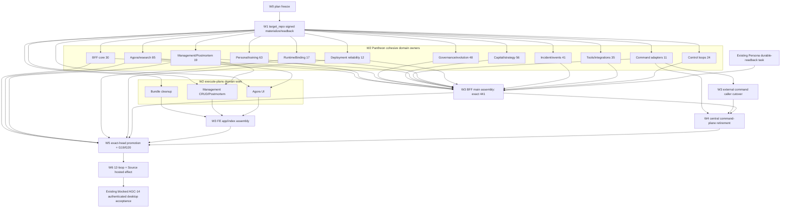

# Pantheon 全產品運作平行執行 DAG — 2026-08-30

| 欄位 | 值 |
|---|---|
| Program | `FULL-OPERATION-GAP-CLOSURE-20260830` |
| Machine truth | [`EXECUTION_TASK_CATALOG_2026-08-30.json`](EXECUTION_TASK_CATALOG_2026-08-30.json) |
| Tasks | 1 plan-freeze + 22 ownership-derived child tasks；另重用 existing AGC-14 |
| Waves | 0..6 |
| Materialization | A=1、B=12、C=9；`MAX_TASKS_PER_PACKET=16` |
| Hosted resource | `pantheon-dev` capacity 1 |

## 1. Scheduling principles

1. Plan approval 與 child materialization 分離。Plan merge + done 前沒有 child row。
2. Current bridge 無法可靠保存 `target_repo`；Wave 1/bootstrap 是 current tooling 唯一可 materialize child。
3. Wave 2 的 current Pantheon tasks 是 semantic review衍生的 cohesive domain owners。既有 feature remediations直接吸收同 domain route extraction；只有無 canonical owner才建立具名 router。沒有 line-band/generic/catch-all route lane。
4. 12 domain tasks 不改 `main.py`，可平行開發；每個 task 以 catalog explicit assignment rows 驗收。
5. Wave 3 只序列化真實 hot-file boundaries：BFF main、execute-plans app/index、external command caller set。
6. Retirement 等 adapters + main + external callers，不能與 caller cutover race。
7. Promotion、backend acceptance與 existing AGC-14 才 consume `pantheon-dev`，依 capacity=1 串行；AGC-14不是新 materialized child。
8. 每個 task 只有一個 target repository；cross-repo composition 只透過 dependency。
9. 28 ACG + 4 PFG terminal deliveries先 current-code reconcile；follow-up只擁有 exact residual，舊 terminal row不重開、不 supersede。

## 2. DAG



Decorator labels是每個 owner 的 explicit assignment row count，總和 441；不是估算或 line span。

`HBE --> AGC14` 表示本 plan 的 resource/completion order，不改寫 AGC-14既有 canonical dependencies。只有其 recorded paper baseline bootstrap HTTP 500 blocker有新證據後，才由原 task resume。

## 3. Full schedule

### Wave 0–1

| Wave | Task | Repo | Owner / Reviewer | Depends | Purpose |
|---:|---|---|---|---|---|
| W0 | `FULL-OPERATION-GAP-SA-SD-PLAN-FREEZE-20260830` | Pantheon | Codex / Codex2 | none | exact-head six-file plan review |
| W1 | `OPGAP-DEVTOOL-TARGET-REPO-READBACK-20260830` | Pantheon | Codex / Antigravity2 | W0 | signed/canonical/readback literal repo preservation |

### Wave 2 — Pantheon cohesive domain owners

| Task | Owner / Reviewer | Decorators | GAPs | Router targets |
|---|---|---:|---|---|
| `OPGAP-BE-BFF-CORE-20260830` | Antigravity / Codex2 | 30 | G05, G13 | assistant、auth、core、settings |
| `OPGAP-ROUTE-PERSONA-TRAINING-20260830` | Codex / Codex2 | 63 | support | personas、training |
| `OPGAP-BE-AGORA-RESEARCH-20260830` | Antigravity2 / Codex | 85 | G01, G02, G09 | existing Agora subrouters + research |
| `OPGAP-ROUTE-GOVERNANCE-EVOLUTION-20260830` | Antigravity2 / Codex | 48 | support | governance + existing evolution |
| `OPGAP-ROUTE-CAPITAL-STRATEGY-20260830` | Codex2 / Antigravity | 56 | support | capital、strategies、existing ranking |
| `OPGAP-BE-MGMT-POSTMORTEM-20260830` | Antigravity / Codex2 | 19 | G18 | management read models、postmortems |
| `OPGAP-BE-COMMAND-ADAPTERS-20260830` | Antigravity2 / Codex | 11 | support | existing command adapter router |
| `OPGAP-BE-RUNTIME-BINDING-20260830` | Antigravity / Codex2 | 17 | G17 | runtime |
| `OPGAP-DEPLOY-RELIABILITY-20260830` | Antigravity2 / Codex | 12 | G04, G16 | deployment |
| `OPGAP-ROUTE-INCIDENT-EVENTS-20260830` | Antigravity / Codex2 | 41 | support | incidents + existing events |
| `OPGAP-ROUTE-TOOLS-INTEGRATIONS-20260830` | Codex / Antigravity | 35 | support | integrations |
| `OPGAP-ROUTE-CONTROL-LOOPS-20260830` | Codex2 / Antigravity | 24 | support | control loops |

全部依賴 W0 + bootstrap；artifact sets mutually exclusive。Route rows逐筆見 catalog。

421 source handlers各有一筆 disposition：420 `move_as_unit`（包含同 target 的 Agora research aliases），1 `decompose_generic`（Governance/Research typed replacements；Main Assembly最後刪 generic）。

### Wave 2 — execute-plans domains

| Task | Owner / Reviewer | GAP | Additional dependency |
|---|---|---|---|
| `OPGAP-FE-BUNDLE-CLEANUP-20260830` | Antigravity / Codex2 | G07 | W0 + bootstrap |
| `OPGAP-FE-MGMT-CRUD-POSTMORTEM-20260830` | Antigravity2 / Codex | G06 | Management/Postmortem |
| `OPGAP-FE-AGORA-WORKSHOP-20260830` | Antigravity / Codex2 | G15 | Agora/research |

### Wave 3–6

| Wave | Task | Repo | Owner / Reviewer | Direct dependencies | GAPs |
|---:|---|---|---|---|---|
| W3 | `OPGAP-BFF-MAIN-ASSEMBLY-20260830` | Pantheon | Codex / Antigravity2 | 12 domain tasks + existing Persona durable-readback terminal fact | G08 |
| W3 | `OPGAP-FE-INTEGRATION-ASSEMBLY-20260830` | execute-plans | Codex2 / Antigravity | 3 FE tasks | support |
| W3 | `OPGAP-BE-COMMAND-CALLER-CUTOVER-20260830` | Pantheon | Antigravity / Codex2 | command adapters | support |
| W4 | `OPGAP-BE-COMMAND-PLANE-RETIREMENT-20260830` | Pantheon | Antigravity2 / Codex2 | adapters + caller cutover + main assembly | G10 |
| W5 | `OPGAP-HOSTED-DEV-PROMOTION-20260830` | Pantheon | Antigravity / Codex2 | backend/domain/main/FE integration/retirement | G19, G20 |
| W6 | `OPGAP-HOSTED-BACKEND-ACCEPTANCE-20260830` | Pantheon | Antigravity2 / Codex2 | promotion | G11, G12 |
| W6 existing | `AGORA-AGC-14-HOSTED-DEMO-AUTHENTIC-V5-20260829` | execute-plans | Codex / Antigravity | existing canonical scope；resume gate是 blocker changed + resource order | G14 |

## 4. Hot-file ownership

| Hot file/surface | Sole task | Consequence |
|---|---|---|
| `services/control-plane/bff/main.py` | Main Assembly | domain tasks不能 edit/import |
| `services/control-plane/bff/evolution/router.py` | Governance/evolution | BFF core不得同時擁有 |
| `services/control-plane/bff/management_read_models/ranking_router.py` | Capital/strategy | Postmortem task不得同時擁有 |
| `services/control-plane/bff/events/router.py` | Incident/events | 其他 domains 透過 ports，不重掛 SSE |
| `execute-plans:src/App.tsx` | FE integration | FE domains只改 catalog listed pages/clients |
| `execute-plans:src/lib/bff-v1/index.ts` | FE integration | bundle task處理 concrete forbidden modules |
| 3 Compose + 2 env examples | external caller cutover | retirement只在 zero caller後刪實作 |
| `.github/pantheon-stage0-matrix.json` | retirement | 同一 PR移除 retired shim/smoke entries |
| `scripts/deploy_nonprod_vm.sh` | deploy reliability | promotion invokes，不競爭 edit |

## 5. Materialization batches

| Batch | Size | Gate | Rows |
|---|---:|---|---|
| A | 1 | plan done | target-repo bootstrap |
| B | 12 | bootstrap merge + done + authoritative two-repo proof | current Pantheon cohesive domain tasks |
| C | 9 | Batch B canonical rows exist | 3 FE domains + main/FE assembly + caller cutover + retirement + promotion + hosted backend acceptance |

Batch C dependencies 可引用 prior canonical rows或同 Batch rows；governed closure 驗證。任一 batch 都必須 atomic materialize 或完全不 mutation。Sizes 1/12/9是 current catalog的衍生結果；gate只固定 first bootstrap、max 16、unique full coverage與dependency closure。AGC-14已存在，不出現在任何 materialization batch。

## 6. Resource scheduling

只有以下 tasks 宣告 `pantheon-dev`：

```text
promotion -> hosted backend acceptance -> existing AGC-14 resume
```

每個 task 獨立 acquire/release lease，dependencies 保證 capacity-one order。Local route/domain/test/PR-review 不 consume VM。Failure 保留舊 pair或令新 pair unaccepted，不 unblock 下一個 hosted task。

Bootstrap後 current initial runnable distribution是 Antigravity=4、Antigravity2=4、Codex=2、Codex2=2，等於 governed non-Claude capacity 12。每個 owner不超過 `max_parallel`；config SHA變更需重新推導。

## 7. Completeness gates

- Plan + all catalog child nodes可 topological traverse；validator不預設 child count。
- Batches exactly cover all child tasks once；bootstrap first；每批 ≤16；validator不預設 batch sizes。
- `dependency_tracks.keys == depends_on`。
- 20 disposition rows exactly once；OP-G03 closed/null owner。
- 18 catalog-owned active/verify GAP IDs在 child task `gaps` exactly once；OP-G14 blocked owner精確指向 reconciled existing AGC-14。
- 441 assignment rows；421 handler dispositions；all derived owner decorator counts sum 441。
- 每個 method+normalized-path只有一個 owner/target；source line不參與 owner。
- Artifact exact/prefix overlaps zero；每個 task single repo。
- No line-band、generic route family、tail/catch-all owner。
- Command retirement涵蓋 executable/import/config/workflow/test、top-level shims、runtime smoke/hardening、stage-0；allowlist non-executable only。
- No Source implementation artifact。
- `pantheon-dev` consumers只有 2 個 catalog hosted tasks + existing AGC-14，capacity-one serialization完整。
- 28 個 ACG與 4 個 relevant PFG terminal dispositions完整；claim/current evidence/reusable delivery/residual/zero-or-one follow-up齊全，沒有 superseded disposition。
- Owner/reviewer皆為 live agents且不同；initial runnable per-owner不超過 governed capacity。
- Exact與path-prefix artifacts（含 reconciled nonterminal tasks）無未處置 overlap。
- Structural pass不構成 semantic approval；Codex2逐 task/edge/repository boundary審查。
