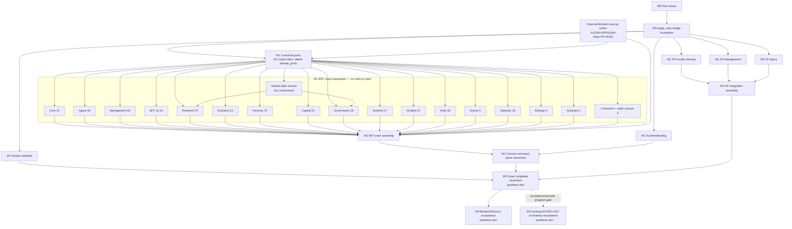

# Pantheon 全系統 GAP 執行 DAG — 2026-08-30

| 欄位 | 值 |
|---|---|
| Program | `FULL-OPERATION-GAP-CLOSURE-20260830` |
| Catalog records | 1 plan-freeze + 30 execution/support tasks；OP-G14 由既有 blocked task 擁有 |
| GAP | 19 active + OP-G03 baseline-closed |
| Waves | W0 plan/foundation、W1 domain/cutover、W2 assembly/retirement、W3 promotion、W4 hosted acceptance |
| External hot-file dependency | `AGORA-PERSONA-DURABLE-LIST-READBACK-V2-20260830`（blocked；clean PR #5432；`main.py` + one port-caller test） |
| Capacity-1 resource | `pantheon-dev`，供 W3 與兩個 W4 tasks |
| Machine truth | [EXECUTION_TASK_CATALOG_2026-08-30.json](EXECUTION_TASK_CATALOG_2026-08-30.json) |

任務數不是工量配額。17 個 BFF preparation tasks 對應 17 個 cohesive route owners；shared-port consolidation、shared handler、bridge、hot-file assembly與不可逆退役各自拆開，是因為它們有不同 artifact owner或必須提供獨立 gate。

## 1. Dependency graph



## 2. 每條 dependency 的理由

| Dependency | 理由 |
|---|---|
| Plan freeze → bridge | 先凍結 schema、artifacts、acceptance，避免 foundation 自己改派工契約。 |
| Bridge → port consolidation 與其他非-route tasks | 在 bridge 修好前，`target_repo` canonical readback 不可信。 |
| External Persona task → port consolidation | 它修改一個 direct `domain_ports` caller test；merge/rebase後只做 namespace migration，不覆蓋 Persona 行為。 |
| Port consolidation → shared service/17 route tasks | 先形成唯一 `ports` namespace並刪除 duplicate tree，避免 router migration 複製雙路徑。 |
| Shared alias service → Governance/Research | 同一 source handler 的 implementation 只能存在一次；route wrappers才可分 domain。 |
| 17 route tasks → BFF main assembly | preparation先建立完整 router contract，main 才能一次 cutover/delete inline handlers。 |
| External Persona task → BFF main assembly | 它是目前活動中的 `main.py` owner；assembly 必須等 merge後 rebase；AST tuple漂移先走 reviewed catalog amendment。 |
| BFF main + RuntimeBinding → command retirement | main/mount/caller未全切完前，刪 central plane會造成斷路。 |
| 三個 FE bounded tasks → FE assembly | `App.tsx`、layout、client barrel只能由一個 owner最後收斂。 |
| Deploy + command retirement + FE assembly → promotion | candidate要同時具備可靠 release path、單一 command plane與完整 FE/BFF source。 |
| Promotion → W4 backend acceptance | hosted proof必須針對同一 accepted exact pair。 |
| Promotion ⇢ 既有 AGC-14 | 這是 resume 前的 program gate，不改寫既有 task dependencies；AGC-14 blocker未改變時仍不得執行。 |

沒有其他 serialization edge。兩個 W4 tasks 功能上可獨立，但共用 `pantheon-dev` capacity=1，由 resource lock序列化；不以假 dependency表達資源限制。

## 3. W0 materialization contract

### Plan freeze

- 只修改本文件包六個檔案。
- exact head 必須通過 20 GAP、167 port imports、441 route、421 handler、artifact、DAG、command inventory checks。
- 需要獨立 Reviewer與 Verified evidence；沒有就不算凍結。

### Bridge bootstrap

現況 `materialization_readback.status=blocked_pending_foundation`。執行順序：

1. plan-freeze merge；
2. 用現行 pantheon default只 materialize bridge foundation task；
3. bridge exact-head review/merge；
4. 重新 materialize/read back全部 29 筆剩餘 records；
5. 每筆驗 exact `targetRepo` + one matching `artifactRepoId`；
6. 才允許 worker dispatch。

Resolver preflight只證明 catalog path可解析，不是 canonical readback。

## 4. W1 shared-port transition contract

`OPGAP-BE-PORT-NAMESPACE-CONSOLIDATION-20260830` 是 route work 的前置 foundation，而非新的 facade：

1. inventory 固定為 167 unique import files（150 `ports`、22 `domain_ports`、5 dual）；
2. 六個 `domain_ports` implementations 搬入同名 `ports` modules並保留 symbols/contracts；
3. 22 direct callers全部遷移，5 dual callers收斂；
4. `ports/read_surface_ports.py` 只允許 composition/delegation/test factory，不得形成第二 store或 mutation owner；
5. zero-caller 後同批刪除六個 `domain_ports` files；boundary gate拒絕第三 namespace；
6. 歷史 ACG-RS maps與 `REVIEW_EVIDENCE.md` 只能留在 non-executable allowlist。

該 task 等外部 Persona task merge後 rebase，並獨佔 namespace migration；所有 17 route tasks與 shared alias service再依賴它。

## 5. W1 route contracts

| Task | Route count | 只能擁有 |
|---|---:|---|
| BFF Core | 14 | core/auth router與 async harness |
| Agora | 40 | existing Agora tree、provenance/suggestion/store remediation |
| Management | 63 | existing management read-model routers |
| BFF v5 | 24 | bounded v5 router/models |
| Research | 37 | existing Research router + SD-01 wrappers |
| Evolution | 10 | existing Evolution/jobs router set |
| Persona | 76 | named Persona router，不含 active external `persona_provisioning.py` |
| Capital | 23 | named Capital router |
| Governance | 28 | named Governance router + SD-01 wrapper |
| Runtime | 27 | existing `runtime_routes.py` |
| Incident | 27 | named Incident router + canonical Postmortem port |
| Tools | 25 | named Tools/MCP/Skills router |
| Events | 5 | generic SSE/channel substrate |
| Operator | 33 | operations presentation router |
| Settings | 4 | settings router/store |
| Assistant | 1 | existing assistant routes |
| Command/caller | 4 | command router + 29 direct/1 indirect caller cutover |

共同規則：

- 不改、不 import `main.py`。
- 不建立 `legacy_api/router.py` 或 broad governance/runtime catch-all。
- 每條 catalog assignment保留 exact contract；新增/刪除必須先改 catalog並重審。
- multi-decorator handler整組一個 implementation owner。
- 只 import canonical `services/control-plane/bff/ports`；不得重建 `domain_ports` 或第三 compat path。
- domain-specific stream留 domain；Events只擁 generic transport。
- route preparation完成不等於 hosted GAP closure。

## 6. Hot-file ownership

| Hot file | Only catalog owner | 衝突處置 |
|---|---|---|
| `services/control-plane/bff/main.py` | `OPGAP-BFF-MAIN-ASSEMBLY-20260830` | 等外部活動 Persona task merge後 rebase |
| `services/control-plane/bff/tests/test_bff_persona_provisioning_baseline_500.py` | `OPGAP-BE-PORT-NAMESPACE-CONSOLIDATION-20260830`（在外部 task merge 後） | 外部 task先完成 Persona行為；port task只遷移 namespace |
| `docker-compose.yml` | `OPGAP-BE-COMMAND-CALLER-CUTOVER-20260830` | retirement不得再次修改 |
| `docker-compose.control.yml` | 同上 | caller先切，之後只驗 zero |
| `docker-compose.staging-full.yml` | 同上 | caller先切，之後只驗 zero |
| `scripts/deploy_nonprod_vm.sh` | `OPGAP-DEPLOY-RELIABILITY-20260830` | W3只執行，不修改 |
| `execute-plans:src/App.tsx` | `OPGAP-FE-INTEGRATION-ASSEMBLY-20260830` | FE bounded tasks只改自己的 pages/libs |
| `execute-plans:src/management/ManagementLayout.tsx` | 同上 | 單一 navigation owner |
| `execute-plans:src/lib/bff-v1/index.ts` | 同上 | 單一 production client barrel |

Catalog artifact uniqueness不包含 external dependency artifacts；external `main.py` 與 port-caller test overlap都透過明列 dependency消解，不假裝沒有 live owner。

## 7. Retirement sequence

```text
SD-18 active caller cutover
  ├─ env / three Compose / CLI / drill / deploy
  ├─ BFF typed adapters / command routes / tests
  └─ keep command_executor.py
        ↓
SD-24 main removes central capability/config and mounts only domain routers
        ↓
SD-25 scans:
  active URL/env/config/import/test caller = 0
  runtime mount = 0
  Stage0 legacy entry = 0
        ↓
delete central implementation + both shim trees + runtime mount
update/delete legacy-only tests/inventory + add resurrection gate
        ↓
W3 promotion
```

禁止先刪後補、留下 alias 下次處理、或新增 replacement facade。歷史 docs只能留在 non-executable allowlist。

## 8. W3/W4 hosted contracts

### W3 promotion

排他取得 `pantheon-dev`，pre-switch 必須有 exact FE/BFF/image、sealed rollback baseline、service health、`connectorId+ingestRunId+sourceId`、producer heartbeat及同 ID paper lifecycle。失敗不 switch；已 switch失敗則使用 local seal rollback。

### W4 backend/Source acceptance

Pantheon task只擁有 12-loop與bounded Source effect scripts/evidence。Source測試結束必須回 reconcile-only，不建立 refresh route。

### W4 existing frontend acceptance

`AGORA-AGC-14-HOSTED-DEMO-AUTHENTIC-V5-20260829` 保持既有 canonical row、dependencies與三個 execute-plans evidence artifacts，是 OP-G14 唯一 owner。它目前 blocked on governed paper-baseline HTTP 500；只有 blocker改變且W3產生accepted exact pair後才resume。不得再 materialize duplicate task，也不得把 evidence放回 FE assembly或 Pantheon task。

## 9. Completion semantics

- W0 merge：只代表 plan可執行。
- W1/W2 merge：只代表 source migration/retirement；不得宣稱 hosted正常。
- W3：只關閉 OP-G19/OP-G20；OP-G03已 baseline-closed。
- W4 backend：關閉 OP-G11/OP-G12。
- W4 existing AGC-14：關閉 OP-G14。
- F22/F23/F25不在此 DAG；F22/F25未關閉前，不能宣稱全系統正常。
