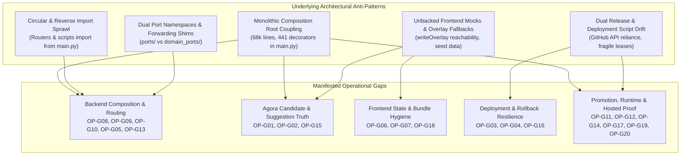
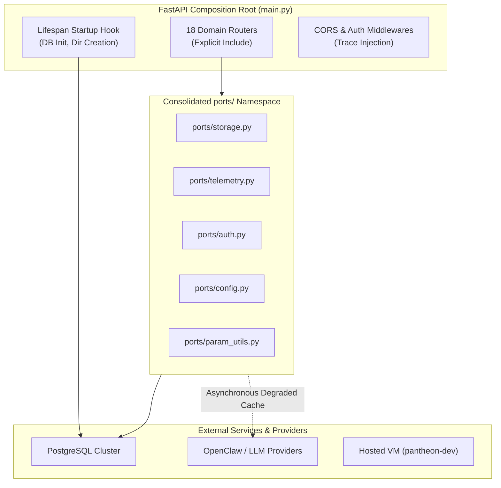
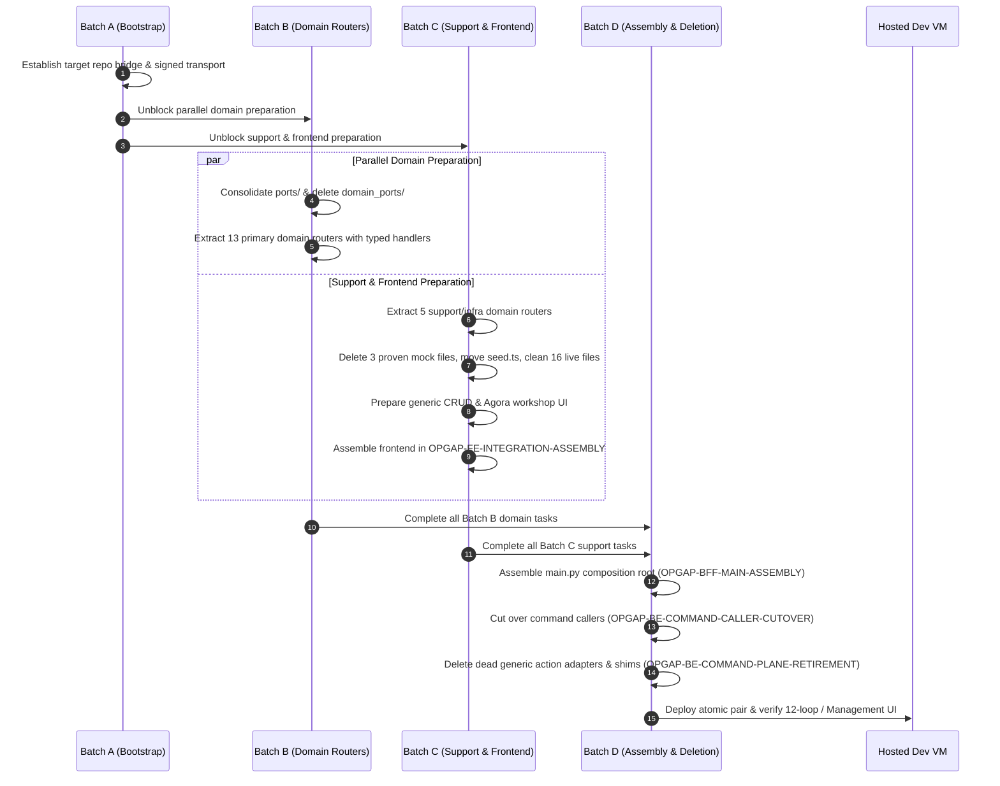

# Target System Architecture for Operation Gap Remediation (2026-08-30)

## 1. Executive Architectural Overview & North-Star Objectives

The Pantheon platform is a multi-persona automated trading and research control plane. This System Architecture (SA) specification preserves the structural transformation for the 20 frozen product operation gaps (**OP-G01** through **OP-G20**) and appends two post-freeze execution gaps (**OP-G21** and **OP-G22**) without mutating the immutable 30-task catalog.

### North-Star Objectives
1. **Single Responsibility Composition Root**: Transform `services/control-plane/bff/main.py` from a 68,000-line monolithic module into a lightweight composition root containing zero inline route handlers, zero direct store instances, zero top-level side effects, and zero reverse dependencies.
2. **Bounded Context Domain Routing**: Decompose all 441 HTTP route decorators across 421 unique handlers into 18 decoupled domain routers under `services/control-plane/bff/`.
3. **Unified Single-Namespace Port Abstraction**: Consolidate all shared capability interfaces into `services/control-plane/bff/ports/`, migrate all 22 legacy `domain_ports` callers, and permanently delete `domain_ports/` without forwarding shims or duplicate authority.
4. **Authoritative Production Command Dispatcher**: Retain `command_executor.py` as the sole production operator command dispatcher, eliminate its circular reverse import on `main.py`, and delete dead generic action adapters (`_execute_bff_action_adapter`).
5. **Single-Stimulus Source Egress Contract**: Maintain `reconcile_only` mode as the fail-closed default for development environments; bind all promotion and live journeys to a single-stimulus receipt contract (`source_proof_receipt_id`) with zero second egress.
6. **Strict Separation of Development Tooling vs. Product Runtime**: Maintain strict physical and logical decoupling between developer workflows (.orchestrator/, TaskStore, supervisor, signed local bridge) and production business runtime (BFF APIs, Agora research, desktop UI).
7. **Read/Mutation Port Separation for Persona Reconciliation**: `ReadSurfacePorts` remains read-only. Persona provisioning reconciliation persists terminal transitions only through one typed mutation/command port backed by the authoritative Persona store.
8. **Bounded OpenClaw Readiness and Side-Effect Safety**: Provider readiness partitions one bounded probe budget across eligible candidates, records sanitized degradation, and carries the selected healthy model into a single-attempt invoke. Source tasks do not mutate credentials, tokens, secrets, or provider priority.

---

## 2. Comprehensive Root-Cause Model (Gaps OP-G01 to OP-G20)

The operational gaps identified during the 2026-08-29 audit stem from five underlying architectural anti-patterns:

### Detailed Root-Cause Analysis by Category

1. **BFF Composition & Routing Anti-Patterns (OP-G08, OP-G09, OP-G10, OP-G05, OP-G13)**:
   - *Monolithic main.py Coupling (OP-G08, F21)*: Route handlers, schema definitions, helper utilities, and database connections were historically placed inline in `main.py`. This caused multi-replica processes to experience circular import deadlocks (`from main import X`), namespace collisions, and bloated process initialization times.
   - *Cross-Router Private Ingestion (OP-G09)*: Domain routers directly imported private database stores and unexported helpers across domain boundaries rather than accepting injected port contracts.
   - *Generic Action Adapter Dead Code (OP-G10, F24)*: Legacy forwarding shims (`_execute_bff_action_adapter`, `_legacy_action_deprecation_notice`) lingered after typed domain endpoints were introduced, creating ambiguous execution paths and false command authority.
   - *Synchronous Provider Coupling (OP-G05)*: Core auth and session endpoints blocked on synchronous upstream OpenClaw provider probes, causing system-wide auth unavailability during provider latency spikes.
   - *ASGI Event Loop Deadlock (OP-G13)*: Synchronous `TestClient` verification suites deadlock against AnyIO async event loops due to pinned incompatible dependencies.

2. **Agora Research & Candidate Truth Anti-Patterns (OP-G01, OP-G02, OP-G15)**:
   - *Simulation Fallback Masking (OP-G01)*: The default Agora research adapter generated synthetic candidate data labelled as `real` candidate truth when backend models were unavailable, concealing execution failures.
   - *Dangling Performance Producer (OP-G02)*: `PerformanceSuggestionProducer` was implemented but lacked natural upstream callers from paper telemetry and evaluation pipelines.
   - *UI Provenance Confusion (OP-G15)*: Frontend research workshop cards did not differentiate between stub, deferred, and real backend outputs, presenting mock data as verified Alpha candidates.

3. **Frontend Mutation & Bundle Integrity Anti-Patterns (OP-G06, OP-G07, OP-G18)**:
   - *Unbacked Generic Mutation (OP-G06)*: `createEntity.ts` routed non-Persona entity writes to in-memory `writeOverlay` or threw unhandled errors in strict live mode due to missing canonical BFF write endpoints.
   - *Production Bundle Mock Reachability (OP-G07)*: 37 legacy seed and mock files remained reachable from the production bundle graph through unguarded helper imports.
   - *String-Parsed Postmortem Read Models (OP-G18)*: Management Postmortem UI parsed incident markdown strings on the client rather than reading from a structured BFF postmortem projection.

4. **Deployment, Rollback & Release Gate Anti-Patterns (OP-G03, OP-G04, OP-G16)**:
   - *Non-Atomic Multi-Repo Deployment (OP-G03)*: Frontend and backend repositories deployed independently without cryptographic pair-binding, risking contract drift.
   - *Release Workflow Masking (OP-G04)*: Deployment bash scripts caught and suppressed step failures, marking failed canary phases as successful releases.
   - *Remote API Dependency for Rollback (OP-G16)*: Rollback workflows relied on live GitHub API availability to retrieve deployment state instead of executing from local sealed authority.

5. **Promotion, Runtime Binding & Hosted Verification (OP-G11, OP-G12, OP-G14, OP-G17, OP-G19, OP-G20)**:
   - *Opt-In 12-Loop Deployed Proof (OP-G11)*: 12-loop cross-plane verification was disabled by default in CI/CD pipelines.
   - *Unbounded Source Ingestion Egress (OP-G12)*: Source management canary validation lacked single-stimulus receipt bounds, risking runaway API quota consumption.
   - *Agora vs. Management Proof Conflation (OP-G14)*: Agora interactive demo and Management desktop acceptance were coupled in a single task, causing cross-repo execution blocks.
   - *Disconnected Runtime Projection (OP-G17)*: Registry changes did not emit immutable loader projections for Runtime Manager execution.
   - *Agora Read Projection Egress on Promotion (OP-G19)*: Promotion deploy gates attempted fresh provider calls instead of reusing the sealed `source_proof_receipt_id`.
   - *Unverified Paper Signal Lifecycle (OP-G20)*: Paper signal producer runtime health lacked end-to-end signal-to-fill durable readback verification.

---

## 3. Authority, Write, and Read Ownership Matrix

To prevent dual write authority and unbacked projections, each domain context is assigned explicit write and read ownership:

| Domain Context | Subsystem / Owner Task | Write Authority | Mutation Mechanism | Primary Persistence / Event Store | Read Model Projection Owner | Durable Readback Guarantee |
|---|---|---|---|---|---|---|
| **Core & Auth** | `OPGAP-BE-BFF-CORE-20260830` | Auth Session Service | JWT Issuance, Token Revoke | In-Memory Token Cache / Redis | BFF Auth Router | Session ID & Token Hash |
| **Persona Registry & Provisioning Reconciliation** | `OPGAP-BE-PERSONA-ROUTER-V2-20260830` + `OPGAP-BE-PERSONA-RECONCILIATION-MUTATION-PORT-20260830` | Persona Domain Store through typed Persona mutation port | REST `POST/PUT /bff/personas`; internal typed terminal-transition command | Postgres `personas` table / authoritative Persona store | Persona Read Router through mutation-free `ReadSurfacePorts` | Canonical Persona ID, version, and durable `provisioning` / `provisioning_failed` terminal state |
| **Training & FinRL** | `OPGAP-BE-TRAINING-ROUTER-20260830` | Training Pipeline Engine | Async Run Trigger | Postgres `training_jobs` | Training Read Router | Run ID & Artifact SHA |
| **Agora Research** | `OPGAP-BE-AGORA-ROUTER-20260830` | Agora Research Core | Suggestion Generation | Postgres `agora_suggestions` | Agora Decision Projection | Suggestion ID & Hash |
| **Research Synthesis** | `OPGAP-BE-RESEARCH-ROUTER-20260830` | Research Synthesis Engine | Multi-Persona Synthesis | Postgres `research_analyses` | Research Read Router | Analysis ID & Dataset Ref |
| **Governance & Approvals** | `OPGAP-BE-GOVERNANCE-ROUTER-20260830` | Governance Journal Store | Operator Signoff / Vote | Postgres `governance_journal` | Governance Read Router | Journal Sequence & Action ID |
| **Evolution Engine** | `OPGAP-BE-EVOLUTION-ROUTER-20260830` | Evolution Controller | Mutation Program Run | Postgres `evolution_programs` | Evolution Read Router | Program ID & Fitness Score |
| **Capital Allocation** | `OPGAP-BE-CAPITAL-ROUTER-20260830` | Capital Allocation Manager | Pool Rebalance / Limit | Postgres `capital_pools` | Capital Read Router | Pool ID & Allocation Digest |
| **Strategy & Ranking** | `OPGAP-BE-STRATEGY-RANKING-20260830` | Strategy Registry Core | Strategy Register / League | Postgres `strategies` | Strategy Ranking Router | Strategy ID & Rank Score |
| **Management System** | `OPGAP-BE-MANAGEMENT-ROUTER-20260830` | Management Business Core | Portfolio / Book Action | Postgres `management_records` | Management Read Router | Record ID & Entity Key |
| **Postmortem System** | `OPGAP-BE-POSTMORTEM-ROUTER-20260830` | Postmortem Engine | Postmortem Creation | Postgres `postmortems` | Postmortem Read Router | Postmortem ID & Incident Ref |
| **Incident Response** | `OPGAP-BE-INCIDENT-ROUTER-20260830` | Incident Alert Core | Severity Transition | Postgres `incidents` | Incident Read Router | Incident ID & Status Hash |
| **Events & Bus** | `OPGAP-BE-EVENTS-ROUTER-20260830` | Event Outbox Publisher | Domain Event Emission | Outbox Store / SSE Bus | Events SSE Router | Stream Event ID & Seq |
| **Tools & Integrations** | `OPGAP-BE-TOOLS-INTEGRATIONS-20260830` | Integrations Gateway | Tool Action Dispatch | Audit Log Store | Tools Integrations Router | Action ID & Result Payload |
| **Control Loops** | `OPGAP-BE-CONTROL-LOOPS-20260830` | Loop Scheduler Core | Loop Trigger / Dispatch | Postgres `control_loops` | Control Loops Router | Loop ID & Run Receipt |
| **Command Adapters** | `OPGAP-BE-COMMAND-ADAPTERS-20260830` | Command Executor Core | Typed Action Command | Postgres `command_journal` | Command Adapters Router | Command ID & Execution Status |
| **Runtime Binding** | `OPGAP-BE-RUNTIME-BINDING-20260830` | Runtime Binding Engine | Deployment Plan Binding | Postgres `runtime_bindings` | Runtime Binding Router | Binding ID & Loader Hash |
| **Deployments & Rollback** | `OPGAP-DEPLOY-RELIABILITY-20260830` | Deployment Engine | Canary / Rollback Trigger | Sealed Local Manifest / Disk | Deployment Read Router | Pair ID & Release Commit SHA |
| **Source Ingestion** | `OPGAP-HOSTED-BACKEND-ACCEPTANCE-20260830` | Source Ingest Engine | Reconcile / Canary Run | Postgres `source_snapshots` | Source Read Router | `source_proof_receipt_id` |
| **OpenClaw Provider Readiness** | `OPGAP-OPENCLAW-PROVIDER-READINESS-FALLBACK-20260830` | No credential write authority; adapter selects from configured eligible candidates | Bounded exact-sentinel probe followed by one single-attempt invoke | Process-local sanitized readiness state / configured OpenClaw routing | Auth readiness envelope | Active model, sanitized primary-unavailable reason, exact sentinel, and no duplicate side-effecting invoke |
| **Frontend Desktop UI** | `OPGAP-FE-INTEGRATION-ASSEMBLY-20260830` | Strict Live BFF Client | REST / SSE Consumption | React Query Cache (Zero Mock) | Desktop UI Views | View Hydration from BFF Readback |

---

## 4. Failure Boundaries, Fault Isolation & Resilience Policies

### Resilience Invariants
1. **Fail-Closed Default**: Any unhandled exception, missing dependency, or invalid token results in an explicit fail-closed HTTP 4xx/5xx response with structured error envelopes. No endpoint may return synthetic "success" or mock payloads upon internal failure.
2. **Provider Decoupling & Asynchronous Degradation (OP-G05)**: OpenClaw provider probes must never block request threads. Session authentication reads from local cache; when providers are unreachable, endpoints transition to explicit `degraded` or `unavailable` state.
3. **ASGI Event Loop Deadlock Prevention (OP-G13)**: All ASGI test harnesses must execute asynchronously via `httpx.AsyncClient` with strict request timeouts (max 5.0s). Synchronous blocking calls in async route handlers are forbidden.
4. **SSE Outbox Replay & Connection Resiliency (OP-G08, OP-G13)**: The Server-Sent Events (SSE) bus guarantees idempotent event replay using monotonically increasing sequence IDs. Client reconnections supply `Last-Event-ID` to replay missed events without state duplication.
5. **Local Sealed Rollback Authority (OP-G16)**: Rollback operations read release manifests and pre-built container images from local sealed disk authority (`/var/pantheon/releases/`). Remote GitHub API availability is never in the critical path of emergency rollbacks.
6. **Persona Port-Direction Invariant (OP-G21)**: Read ports expose projection reads only and cannot be widened with `update_persona` or compatibility delegation. Reconciliation depends on an injected mutation port whose implementation owns the authoritative transaction and same-ID/version readback.
7. **OpenClaw Probe/Invoke Partition (OP-G22)**: Readiness may try multiple configured candidates within one partitioned time budget, but invoke is a single attempt against the already-probed active model (or explicit request). Ambiguous auth, timeout, cancellation, generic invocation, or post-execution failures never trigger an invoke retry.

---

## 5. Cross-Repository Topology & Boundary Invariants

The product architecture spans two distinct repositories and a single hosted dev VM:

1. **`ajoe734/pantheon` (Backend & Control Plane)**:
   - Contains BFF (`services/control-plane/bff/`), domain services, algorithms, deployment scripts, and architecture documentation.
   - Authoritative source for API contracts, database schemas, and business logic.
2. **`ajoe734/execute-plans` (Desktop Frontend)**:
   - Contains Vite/React desktop UI application (`src/`).
   - Connects to Pantheon BFF via `VITE_BFF_BASE_URL` in `strict live` mode. Zero mock/seed reachability permitted.
3. **Hosted Dev VM (`pantheon-dev` external IP `35.201.204.12`)**:
   - Capacity constraint: **Capacity = 1**.
   - Serves hosted frontend bundle (`/var/www/pantheon-dev-fe/`) and hosted BFF container.
   - Deploys only verified, pair-matched commits.

### Transport & Bridge Governance
- Development bridge (`.orchestrator/development_bridge/`) is strictly for signed task packet transport and local auto-worker coordination.
- Product BFF contains zero routes for file writes, git operations, or task manipulation.

---

## 6. Staged Migration, Cutover, and Zero-Shim Deletion Architecture

The transition from monolithic `main.py` to 18 domain routers is structured in 4 strict materialization batches:

### Deletion Rules
- **No Forwarding Shims**: When legacy code is replaced, it is deleted directly in the owning task. Forwarding shims, backwards-compatibility aliases, and dual-routing mounts are strictly prohibited.
- **Rollback Invariant**: Rollbacks restore the previous immutable release container/commit; they never re-introduce deleted shims or in-memory authority.

---

## 7. Definition of Normal Operation & Verification Protocol

A green test suite or large line count does not prove normal operation. A component or system is declared in "Normal Operation" only when all 11 criteria and verification gates are satisfied:

1. **Natural Non-Stub Callers**: All production entrypoints have genuine upstream callers in production workflows. No stubs, mocks, or simulated loops substitute for real runtime execution.
2. **Single Write Authority**: Every entity and mutation type has exactly one authoritative write service. Projections and read models derive strictly from this source of truth.
3. **Same-ID & Version Durable Readback**: Successful mutations provide same-ID and version-matched readback across process restarts and multi-replica deployments.
4. **Fail-Closed Fault Semantics**: Retries, concurrency races, network timeouts, SSE stream interruptions, and rollbacks execute with fail-closed semantics without state pollution.
5. **Authentic Test Topology**: Automated test suites execute in realistic multi-process topologies. Skipped tests, timeouts, or missing service dependencies are strictly classified as `NOT_EXECUTED` or `UNVERIFIED` and cannot be presented as passing verification evidence; assertion failures are classified as `FAIL`.
6. **Formal Governance Validation**: Security, capital, and promotion operations execute through governed journal paths, never bypassing checks via test fixtures.
7. **Exact Immutable Release Binding**: Deployed environments match immutable container image digests and Git commit SHAs recorded in release manifests.
8. **Atomic Caller Cutover & Zero-Shim Deletion**: Replaced code, dead adapters, and obsolete forwarding mounts are permanently removed from the repository without lingering shims.
9. **Explicit Observability & Correlation Receipts**: Every mutation and state transition emits a unique trace ID, correlation receipt ID, and journal sequence for end-to-end auditability.
10. **Governed CI Workflow Verification**: Release workflows and pull-request checks execute all declared jobs; 0-job passes are treated as governance verification gaps and blocked.
11. **Single Truth Reconciliation**: System state across canonical task store, Git repository HEAD, deployed container manifest, and live caller wiring is reconciled to a single consistent truth.

---

## 8. Development-Tooling Boundary: Dev-Bridge Allowlist Derivation (Errata, 2026-08-30)

This is a **development-tooling** architecture note, not a product architecture change; it does not alter the 18-domain-router target state above.

The signed DevTaskPacket dispatcher (`.orchestrator/development_bridge/dev_bridge_dispatcher.py`) admits a packet only if every `target_repo` it names is present in the dispatcher's allowlist. The live supervisor did not derive that allowlist from its own `coordination.repositories` configuration; it required an operator-injected `PANTHEON_ASSISTANT_DEV_BRIDGE_ALLOWED_REPOS` environment override. Batch A (`pantheon`-only) and Batch B materialized before `execute-plans` was added to that override; Batch C's mixed-repository packet was rejected until the operator widened it. Because the resulting Batch B canonical task rows could not be amended in place (Section "Canonical task definitions cannot be amended in place" in [EXECUTION_REPLACEMENT_LEDGER_2026-08-30.json](./EXECUTION_REPLACEMENT_LEDGER_2026-08-30.json)), they were retired via `supersede` and re-created as one-to-one V2 replacements once the corrected allowlist and command-runtime identity bindings were in place.

Delivered target state: PR #5459 implemented derivation from the live supervisor's authoritative `coordination.repositories` registry. Because the V3 task's immutable artifact contract omitted its evidence manifest, V3 was superseded only after `OPGAP-DEVTOOL-BRIDGE-REPO-ALLOWLIST-V4-20260830` preserved the implementation and added review evidence; V4 merged in PR #5473 as `5b0d02196acfc9c3ef956ae4c47865601bc43da6`. Mixed-repository admission remains fail-closed unless the promoted command runtime contains that merge and the live registry names `execute-plans`. This is development-tooling truth, not product BFF authority.

---

## 9. Post-Freeze Architecture Addendum

### Persona Reconciliation Mutation Port (OP-G21)

The deployed warning `ReadSurfacePorts object has no attribute update_persona` exposed a correct architectural refusal: a read port must not silently become a write surface. `OPGAP-BE-PERSONA-RECONCILIATION-MUTATION-PORT-20260830` therefore owns an explicit injected mutation contract in `ports/persona_capital_runtime.py`, with reconciliation orchestration in `personas/reconciliation.py`. The authoritative store implementation persists terminal provisioning state; the read surface only verifies same-ID/version projection. No `ReadSurfaceStore` compatibility delegation or overlay authority may return.

### OpenClaw Provider Readiness Fallback (OP-G22)

Run `33332882810` demonstrated that a primary model timeout could consume the readiness budget before healthy configured fallbacks were evaluated. `OPGAP-OPENCLAW-PROVIDER-READINESS-FALLBACK-20260830` separates two authority domains:

- readiness is a bounded, non-side-effecting exact-sentinel probe that may evaluate all configured eligible candidates and retain the successful active model;
- invoke is one side-effecting attempt and never retries an ambiguous failure.

The adapter records only sanitized availability facts. Credential repair, token rotation, secret mutation, and provider-priority changes remain outside this source task and require separately authorized operations.
