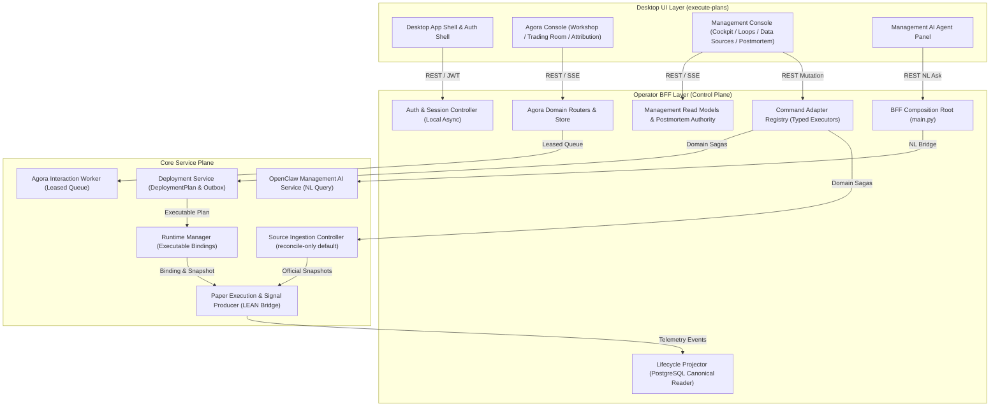
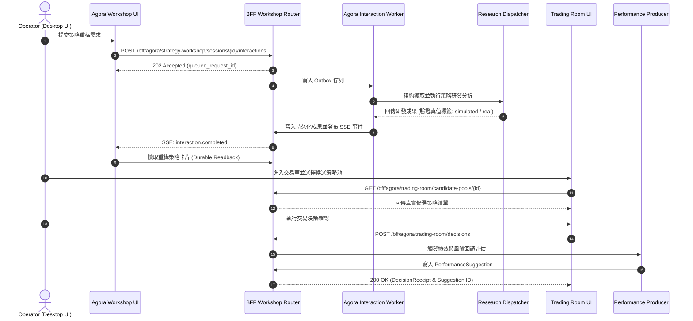

# Pantheon 全產品運作目標系統分析 (SA) — 2026-08-30

| 欄位 | 內容 |
|---|---|
| 文件狀態 | **目標系統架構、領域邊界、資料流與狀態不變量規範** |
| 規劃依據 | `docs/04/pantheon_full_product_operation_audit_2026-08-29/FULL_OPERATION_AUDIT_2026-08-29.md`、`CURRENT_GAP_DISPOSITION_2026-08-30.md`、`TARGET_ARCHITECTURE.md` |
| 適用範圍 | Pantheon 後端服務、BFF 控制面、`execute-plans` 前端、十二循環、Agora 與 Source Ingestion |

---

## 1. 系統分析願景與單一擁有者原則

Pantheon 系統分析之核心目標，是為全產品運作建立**無相容層、無雙重真相、無假完成**之目標架構。每一個領域實體、每一條資料流及每一組 UI 互動，均指派單一權威元件（Canonical Owner）負責其生命週期、持久化儲存與狀態轉移。

---

## 2. 六大核心子系統之目標架構與邊界

### 2.1 產品真相與交付執行子系統 (Product Truth & Runtime Delivery)
- **領域責任**：管理策略構件（Artifact）自 Registry 簽發、DeploymentPlan 生成、RuntimeBinding 構建至 Runtime Manager 執行的全生命週期。
- **單一擁有者**：
  - 策略審查與不可變投影：`Registry Authority`。
  - 部署排程與狀態協調：`Deployment Service`。
  - 運行時綁定與執法：`Runtime Manager` (`services/runtime-manager`)。
- **核心架構規範**：
  - 徹底杜絕 caller 自行傳入任意 `deploy_context.metadata` 來繞過權威檢查。
  - 當部署計畫成立時，`Registry Authority` 根據同一 artifact ID、版本與 SHA256 checksum，自動衍生不可變之 `object_store`、loader projection 與 `market_data_policy`。
  - `Runtime Manager` 驗證權威雜湊後始建立 active `RuntimeBinding`，下發至 Paper 執行環境。

### 2.2 Agora 研發與交易室子系統 (Agora System)
- **領域責任**：提供使用者由 Workshop 策略研發、互動式策略重構、候選策略池篩選，到 Trading Room 即時決策與績效歸因之完整閉環。
- **單一擁有者**：
  - Workshop 與 Session 管理：`services/control-plane/bff/agora/strategy_workshop/`。
  - 互動請求背景租約處理：`agora-interaction-worker`。
  - 研發真值與候選池排程：`services/control-plane/bff/agora/research/dispatcher.py`。
  - 交易室即時決策：`services/control-plane/bff/agora/trading_room/`。
  - 績效建議生產者：`services/control-plane/bff/agora/performance/producer.py`。
- **核心架構規範**：
  - **真值來源規範 (OP-G01, OP-G15)**：`DefaultAllowlistedAdapter` 嚴禁在未獲取真實後端 receipt 時自建 `provenance="real"` 之 artifact；無後端支援時標註為 `simulated` 或 `unavailable`。
  - **生產者連線 (OP-G02)**：`PerformanceSuggestionProducer` 必須由交易遙測（Telemetry）與風險回饋事件驅動，產生之建議存入持久化 store 並提供前端相同 ID 讀回。
  - **領域隔離 (OP-G09)**：所有 Agora 子模組禁止跨模組 import 私有變數與私有 helper，依賴項由 Composition Root 統一注入。

### 2.3 外部數據源與採集子系統 (Source Ingestion & Data Management)
- **領域責任**：管理外部金融市場數據來源之定義、實例、驗證、有界採集、官方行情快照與數據新鮮度門禁。
- **單一擁有者**：`services/source_ingestion/` Controller Worker 與 Pipeline。
- **核心架構規範**：
  - **常態運行模式 (OP-G12)**：在 dev 環境中，Controller 狀態預設為 `reconcile_only`，嚴禁背景常駐對外爬取。
  - **有界手動更新**：手動 refresh 嚴格限制為單次（1 tick）、單並行度（concurrency=1）、最大 100 筆記錄，且操作完成後必須自動回退至 `reconcile_only`。
  - **市場交易日曆新鮮度 (OP-G20)**：採用台灣市場交易日曆（Asia/Taipei）規則，認可週五官方有效收盤價在週末與例假日的合法性，防止非交易日造成虛假過期阻斷。

### 2.4 Management 營運主控台與讀取模型子系統 (Management Console & Read Models)
- **領域責任**：提供全系統 Cockpit 概覽、十二循環真相、Persona 艦隊管理、Data Sources 運維、Postmortem 事故檢討與審計追蹤。
- **單一擁有者**：
  - 唯讀聚合投影：`services/control-plane/bff/management_read_models/`。
  - 十二循環真相：`management_read_models/loop_truth.py`（單一靜態目錄 + 運行時 Controller 事件 join，固定 12 rows）。
  - 事故檢討權威：獨立的 Postmortem 領域服務與儲存（提供具備 `postmortem_id` 之 List/Detail 契約，OP-G18）。
- **核心架構規範**：
  - **消除前端假 CRUD (OP-G06)**：前端 `createEntity.ts` 等通用元件完全移除 `writeOverlay` 本地模擬機制；無 durable owner 之操作在 UI 明確標註為 unavailable 或自介面移除。

### 2.5 管理 AI 代理子系統 (Management AI & OpenClaw Bridge)
- **領域責任**：提供自然語言（NL）系統狀態查詢、智能診斷對話與高風險指令確認操作。
- **單一擁有者**：`services/control-plane/bff/` 路由與 OpenClaw NL Adapter。
- **核心架構規範**：
  - **非阻塞式 Auth (OP-G05)**：用戶登入與 session 判定僅依賴本機加密運算，禁止在 auth 主路徑同步探測 OpenClaw 網路連線；LLM 服務狀態由背景非同步快取提供。
  - **操作審核邊界**：Management AI 僅能觸發經由白名單定義之 domain action，並強制彈出 `HighRiskConfirm` 取得操作者確認，最終產生 durable receipt。

### 2.6 前端應用程式與 BFF 傳輸子系統 (Frontend Shell & Transport)
- **領域責任**：託管於 `execute-plans` 倉庫之 React 18 / Vite 桌面端 UI。
- **單一擁有者**：`execute-plans:src/`。
- **核心架構規範**：
  - **切斷 Mock/Seed 可達性 (OP-G07)**：Production 打包圖譜（Import graph）禁止引用 `@/mocks/seed` 與 `writeOverlay.ts`；建立 CI 依賴循環與 Mock 隔離檢查門禁。
  - **嚴格傳輸模式**：`VITE_BFF_MODE=live`、`VITE_BFF_FALLBACK=strict`、`VITE_BFF_REAL_WRITES=false`。

---

## 3. 全系統架構狀態不變量 (System Architectural Invariants)

為確保系統在任何異常或故障情況下維持一致性，系統必須維持以下五大不變量：

1. **不可變真值讀回不變量 (Durable Readback Invariant)**：
   - 任何變更請求（Command）在回傳成功後，操作者於瀏覽器重新整理（Reload）或透過 API 再次讀取時，必須讀回**完全相同之業務實體 ID、版本號與終態狀態**。
2. **誠實降級不變量 (Honest Degradation Invariant)**：
   - 當後端服務或特定功能模組不可用時，API 回傳明確之 `status="unavailable"` 或 `status="degraded"` 結構體；前端 UI 必須明確呈現其不可用原因，**嚴禁顯示虛假空陣列（`[]`）、虛假成功（Toast Success）或預設成功標記**。
3. **單向依賴不變量 (Acyclic Dependency Invariant)**：
   - 依賴方向嚴格遵循：`UI Components -> Domain Clients -> BFF Transport Layer -> Domain Routers -> Core Services`。同層模組之間禁止循環引用，router 之間禁止互相調用內部函式。
4. **門禁失敗立即中斷不變量 (Fail-Closed Gate Invariant)**：
   - 部署腳本與 CI 工作流中，任何必要的整合測試、健康檢查或讀回驗證步驟若遭遇 failure 或 skipped，整體流程必須立即以非零狀態碼（Exit Code != 0）終止，**嚴禁將關鍵失敗降級為警告或標註為通過**。
5. **沙盒與資金隔離不變量 (Capital & Sandbox Isolation Invariant)**：
   - 本次產品運作全面鎖定於 Paper/Simulation 交易沙盒；所有訂單路由目的地嚴格限制為虛擬帳本，物理上阻斷任何向實體 Broker 提交資金之 API 路徑。

---

## 4. 跨系統資料流與互動序列 (Cross-System Data Flow)

### 4.1 策略研發至交易室決策之端到端流程

---

## 5. 治理邊界與非目標 (Non-Goals)

本系統分析明確排除以下範疇，防止任務範疇蔓延（Scope Creep）：
1. **不引入 Mobile 裝置專屬適配**：專注於桌面瀏覽器操作驗收。
2. **不實作 Real Capital 與 Live Broker 交易**：交易循環以 Paper / Simulation 為唯一目標。
3. **不擴大資安架構改造**：現有 dev-login / JWT 機制足以支援完整功能驗證，不額外新增 SSO、OAuth2 企業代理或複雜金鑰輪替系統。
4. **不建立任何相容過渡層**：既有未經授權之暫存 store、overlay 與 dead code 一律予以清理刪除，不保留歷史相容 alias。
