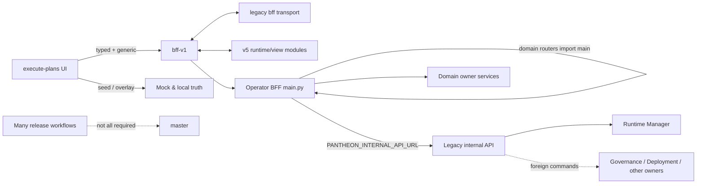
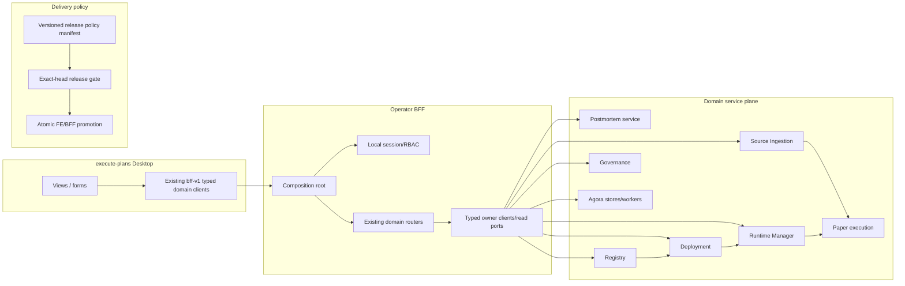

# Pantheon GAP 根因治理目標系統分析（SA）— 2026-08-30

## 1. 架構決策摘要

目標不是把現有大檔案切成更多檔案，而是讓每個狀態轉移只存在一條可證明路徑：

```text
Desktop UI
  -> typed domain client
  -> Operator BFF transport/read projection
  -> owning domain API
  -> canonical store + outbox
  -> read model / same-ID reload
```

任何 `UI -> overlay`、`router -> main`、`BFF -> generic internal API -> runtime-manager
-> foreign domain` 或 `test -> bypass -> safety action` 都是禁止路徑。遷移期可以在原
模組內逐步切 caller，但不建立新的 compatibility façade；最後一個 caller 移走的同一
交付單元必須刪除舊路徑。

## 2. Current architecture 的根因



這些表面上是不同 bug，實際上都源自「過渡機制變成永久機制」：

- frontend overlay 原是 fallback，後來成為 generic CRUD 的成功路徑；
- BFF main 原是 composition root，後來成為 router 可反向 import 的 service locator；
- internal API 原是相容入口，後來由 runtime-manager 代掛所有 command domain；
- workflow 原是不同測試入口，後來 branch protection 只綁其中一小部分；
- safety harness 原是證明工具，治理閘門演進後沒有跟著正式 activation contract 演進。

## 3. Target architecture 與單一 owner



### 3.1 Desktop UI

- UI 擁有顯示、輸入與互動狀態，不擁有業務 entity truth。
- production network/auth/SSE/write transport 收斂在**既有** `src/lib/bff-v1`；不再新增
  `bff-v2` 或 wrapper。
- `src/lib/v5` 只保留 pure DTO、view model 與 transform；不得反向 import network/mutation。
- 沒有 durable command owner 的 control 從 production UI 移除或 disabled。
- mock/seed 只允許 test entrypoint 明示注入；production dependency graph 不可達。

### 3.2 Operator BFF

- BFF 是 operator transport、auth、DTO adaptation 與 read projection，不是 domain write owner。
- `main.py` 只建立 app、middleware、lifespan、dependency objects 並 include **既有領域
  routers**；不建立 catch-all `routers/` façade。
- domain router 只依賴 factory parameter/typed port，不 import `main`、其他 router 的私有
  symbol 或 module-global service locator。
- auth 只做本地 session/tenant/RBAC；OpenClaw/provider readiness 是非阻塞 diagnostics。
- route table 必須同時滿足 normalized path、OpenAPI operation ID 與 static-shadowing 唯一性。

### 3.3 Domain write owners

| Entity / action | 唯一 owner | BFF 責任 |
|---|---|---|
| Postmortem | existing `services/postmortems` + Incident domain store | 呼叫既有 list/detail API並投影 `/bff/management/postmortems*` |
| Source definition/receipt | `services/source_ingestion` | typed management client/read projection；不啟動第二 scheduler |
| Artifact executable projection | Registry | 轉發引用，不接受 caller 自造 metadata |
| DeploymentPlan | Deployment service | typed command client與 receipt adaptation |
| RuntimeBinding/kill/rollback | Runtime Manager | typed runtime client；不代管其他 domain command |
| Approval/governance decision | Governance | typed governance client |
| Workshop/Trading/Performance | existing Agora stores/workers | transport、SSE 與同 ID readback |
| Paper order/fill/position | Paper execution/broker ledger | read projection與 operator status |

`services/control-plane/internal/internal_api.py` 不是 owner。完成 typed-owner cutover 後，整個
legacy internal surface必須退役，不能留作 degraded fallback。

### 3.4 Source 與 Paper 執行邊界

- dev 預設 Source controller 永遠是 `reconcile_only`、external egress deny。
- 唯一 provider egress 是現有 `source-ingest-scheduler` one-shot compose/deploy profile：有限
  ticks、records、concurrency、timeout、exact host allowlist，結束後 process terminal。
- 不新增 `/manual-refresh` 第二入口。產品 UI 只顯示 command/receipt，不直接取得 egress authority。
- official snapshot 必須經 market-calendar/freshness admission，然後自然觸發 signal→paper
  order→fill→position；驗收不可直接呼叫 signal helper。

### 3.5 Safety proof

- canary/live activation 只有一個 governed application service，輸入包含 MFA proof、兩個
  distinct actor、approved plan、capital binding與 loader proof。
- EP5 harness 呼叫同一 service 建立測試 binding，再觸發 kill/rollback；不開 internal bypass。
- rollback 本身可以使用 runtime-owned containment authority，但測試環境建立不得跳過 forward
  activation gate。
- evidence ID、tenant prefix與 conflict sequence由版本化 builder產生，測試不可複製衍生值。

### 3.6 Delivery policy

- 一份 versioned manifest 定義 promotion 必跑 checks、適用 path、required/optional 與輸出 schema。
- 一個 canonical release orchestrator 在 exact candidate SHA 上呼叫 reusable checks，最後只輸出
  `Pantheon release candidate gate`（名稱可在實作凍結時定案）這個 required context。
- required check 的 fail、skip、startup failure、approval pending、missing run、wrong SHA 均為 fail。
- branch protection 由 policy audit 驗證 required contexts、review count與admin enforcement，漂移即阻止
  publish-promote。
- 被 orchestrator 取代的 PR workflows、手動繞行與過期 required contexts在同一遷移完成後刪除。
- atomic deployment採 gate-before-switch；rollback只依賴部署前 sealed local baseline，不重新借用
  forward GitHub lease。

### 3.7 開發工具邊界

TaskStore、supervisor、worker lease與 Human/Ops projection 由
`docs/operations/development-tooling-four-gap-2026-08-30/` 擁有。產品 BFF、release gate 或 hosted
manifest不得成為第二個 task writer。本方案只消費 authoritative task outcome作為 delivery lineage。

## 4. 架構不變量

| ID | 不變量 | 機器門禁 |
|---|---|---|
| SA-I01 | 每個 mutation type 只有一個 canonical owner endpoint | command registry owner map unique |
| SA-I02 | domain/router 不 import composition root或其他 router private symbol | AST import-boundary gate |
| SA-I03 | production UI 不可達 seed/mock/overlay | Rollup module graph + source import gate |
| SA-I04 | 成功 command 可同 ID/version reload readback | contract + restart/integration test |
| SA-I05 | canary/live proof走正式 MFA/two-person activation path | EP5 harness trace asserts same service/contract |
| SA-I06 | normalized route、operation ID、static shadowing皆為 0 | BFF composition test |
| SA-I07 | required release policy結果綁 exact SHA，缺失即阻擋 | policy/branch-protection audit |
| SA-I08 | hosted manifest、FE、BFF、workers與checkpoint同屬 accepted candidate | pre/post-switch evidence validator |
| SA-I09 | dev Source預設無 provider egress；one-shot profile有限且終止 | compose contract + hosted receipt |
| SA-I10 | migration完成後舊路徑與專屬 fallback tests為 0 | retirement ledger gate |

## 5. Migration 與 deletion 原則

每個 migration unit 必須依序完成：

1. 列出 production、test、workflow、Compose、documentation callers；
2. 指定 existing canonical owner 與 typed contract；
3. 建立 parity test與 durable readback；
4. 將 caller切至 owner並觀察 legacy-path telemetry 為 0；
5. 在同一 PR/交付單元刪除舊 handler、env、export、fixture與專屬 legacy test；
6. 加入 forbidden-import/symbol/path gate，防止復活。

不接受「先留 alias 下次再刪」作為完成；若 caller 尚未歸零，該 migration unit 就仍未完成。

## 6. 非目標

- 不開啟 real capital/live broker；本次只處理 Paper/Simulation。
- 不建立 mobile 專屬驗收。
- 不重寫已合入且 source-level 已通過的 Source→Agora projection邏輯，只補 current hosted proof。
- 不以文件任務重複開發已由 devtool package擁有的 TaskStore/supervisor修復。
- 不為了縮短行數機械拆檔；責任與依賴方向正確才是完成條件。
