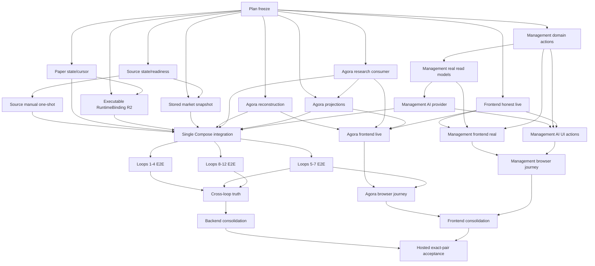

# Pantheon 功能優先實作計畫 — 2026-08-20

## 1. 目標

本計畫的完成狀態不是「所有task merged」，而是：

- dev平時沒有Source provider continuous pull；測試可明確手動拉一次並留下terminal readback；
- 研究、Agora、paper、telemetry/evolution從新stimulus自然流過既有owners；
- Management讀到真資料、對不可用操作誠實disabled，對可用操作等domain terminal state；
- Management AI能回真provider answer並執行已宣告的UI action；
- 重複owner/store/UI path與無caller production code已收斂；
- Pantheon-owned hosted FE/BFF exact pair完成不跳過的authenticated/browser acceptance。

## 2. 優先順序

### Wave 0 — Freeze current truth

先合併本文件與machine-readable catalog，並由獨立worker確認：baseline、task IDs、DAG、跨repo
scope、舊task dedup、Source manual-only policy與code-disposition規則一致。只有plan-freeze完成，
implementation tasks才會ready。

### Wave 1 — 止住runtime自耗，讓UI不再假成功

可平行：

- Source controller state/readiness bounded化；
- paper lifecycle outbox cursor/compaction與invalid binding admission；
- frontend strict-live移除mock completed與silent seed fallback；
- RuntimeBinding正常artifact projection；
- Source canonical stored market snapshot；
- Agora reconstruction、Research consumer、domain producers；
- Management domain action routing。

這一波不做product expansion。先把現在會持續吃CPU/memory、會顯示假成功、或會建立不可執行
active state的地方修掉。

### Wave 2 — 接上正常business path

- Source bounded manual one-shot；
- Management real read models與Management AI provider；
- Agora active frontend改用真pool/drawer/widgets；
- Management四個synthetic surfaces改真read model；
- Management AI actions接既有registry/confirm/action route；
- BFF functional query latency改善。

### Wave 3 — 單一Compose integration

由一個task統一修改`docker-compose.yml`與dev env wiring，避免每個component worker各改一份。
把 raw Compose fallback 收斂為`reconcile_only`（受管dev deploy目前已明確注入此值），並驗證
paper只spawn executable binding、Agora consumers與Management AI health/readback可見。這個task
不得開啟continuous Source pull或live capital。

### Wave 4 — Current deployed journeys

平行執行：

- Loops 1–4：一次手動bounded external pull，後續不得手動建立Distillation/Alpha/Teaching物件；
- Loops 5–7：deployed Agora→policy→Research→Consultation/Governance；
- Loops 8–12：正常approval/deployment產生binding，paper order/fill/telemetry/incident/evolution；
- Agora browser journey；
- Management與Management AI browser journey。

### Wave 5 — Truth、簡化、hosted acceptance

先用同一次stimulus做cross-loop/Management truth，接著進行backend/frontend caller audit與替代後刪除，
再重跑journeys。最後建立exact FE/BFF release，所有required cases不得skip。

## 3. 依賴圖

## 4. Definition of done by domain

### Source

- controller state不隨tick遞迴成長；在260 connectors與現有journals下readiness有固定上限；
- default Compose不做provider egress；
- operator明確選一個允許connector執行一tick，產生SourceRecord/usage/audit/terminal readback；
- 完成或失敗後owner退出/回到`reconcile_only`，不留下長駐外拉；
- 相同SourceRecord自然進既有Distillation queue，idempotent replay不重複。

### Runtime / paper

- active binding帶approved artifact identity/version/checksum/loader descriptor/interpreter/market policy；
- 缺欄位在active之前拒絕，不spawn paper child；
- producer從canonical stored snapshot讀新資料，帶snapshot ID/time；
- lifecycle processing以cursor/ack bounded，不掃全部歷史；
- 9個舊invalid bindings透過API canonical retire/redeploy/migrate；
- 同一次run有signal、order、fill、position、heartbeat、telemetry、incident/evolution readback。

### Agora

- message admission產生durable reconstruction job與result；
- result建立/更新canonical Registry draft；
- Research outbox由唯一consumer完成stages與real/empty-with-reason candidate pool；
- frontend使用真pool ID、共用BFF drawer、真widget projections；
- candidate decision與performance suggestion由production producer寫入；
- policy/Consultation沿用既有durable mechanisms，不建立duplicate owner。

### Management

- strict-live contract mismatch顯示typed unavailable/degraded，不回seed；
- read-only profile不模擬mutation成功；
- enabled action路由到domain owner並readback terminal state；
- Formula、Activity、Paper/Live、Postmortem不再由seed/hash/timer/static rows產生；
- Management AI provider在期限內回真answer或明確degraded，不把gateway reachable當回答成功；
- 7種UI action均有實際route；不存在的能力明確unavailable。

### Simplification

- 每個task附caller/disposition evidence；
- replacement proof後才刪duplicate/legacy normal path；
- strict-live production bundle不importmock seed；
- Source只有一個controller owner、paper只有一個fleet owner、Agora只有一個reconstruction/
  research/consult path、loop truth只有一個store/projector；
- component fixtures仍可保留，但名稱/profile清楚且不能被production選用。

## 5. Validation strategy

每個task依風險至少包含：

1. focused unit/contract tests；
2. restart/readback與idempotent replay；
3. caller search與production profile audit；
4. relevant component health/metrics boundedness；
5. PR exact-head review與merge to correct repo `dev`；
6. 後續deployed journey使用實際hosted identities。

不接受用提高timeout、增加VM資源、刪除所有runtime data、切到smoke strategy、開啟mock fallback或
跳過test取代功能修復。

## 6. Rollback posture

- Source：回到`reconcile_only`且不做provider egress；保留已寫SourceRecords。
- Paper：停止spawn/producer並保留durable cursor與binding readback；不回復full-scan。
- Agora：暫停consumer並保留outbox，UI顯示degraded；不回復fixture candidate或local-only decision。
- Management：action降為disabled/unavailable；不回復mock completed或seed-as-live。
- Delivery：gate-before-switch，失敗時保持上一個可讀release；不得把identity不一致的candidate標accepted。
