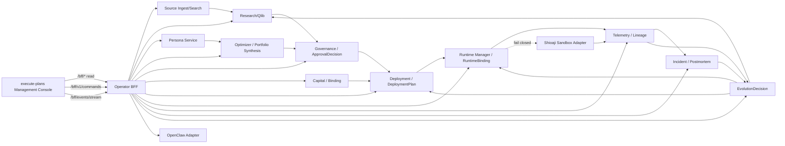
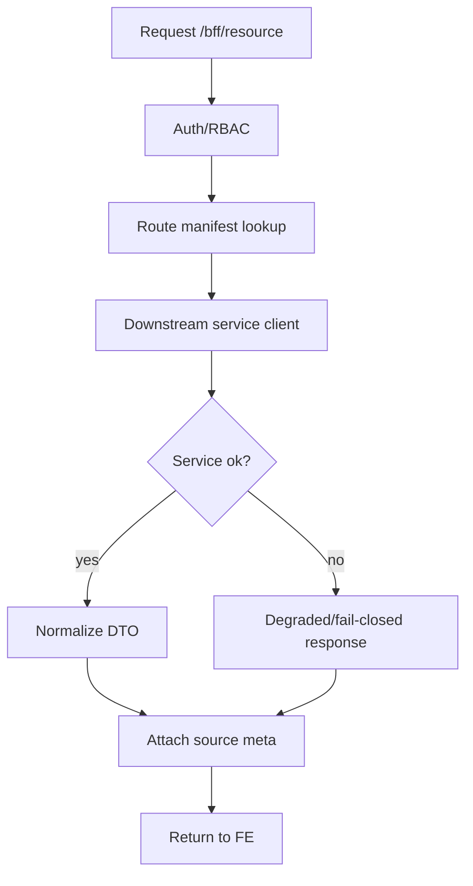

# Pantheon Management Console & Multi-Persona OODA — Supplemental SD

Date: 2026-05-15
Audience: Pantheon / execute-plans implementation team
Scope: Technical System Design for Management Console operationalization and governed OODA paper-loop implementation
Frontend scope: `/management/*` only. Agora frontend is out of scope for this SD.
Backend scope: Pantheon BFF and canonical services required by Management.

---

## 0. Implementation Summary

This SD defines how to move from the accepted Management/BFF consolidation baseline into a verified governed paper-loop / OODA operating system.

Baseline facts:

- BFF consolidation acceptance is complete.
- Management frontend has live BFF / strict runtime cutover evidence.
- Core read surfaces and command receipt evidence exist.
- Live broker and capital-binding side effects remain fail-closed.
- Canary requires human gate.
- Qlib and Shioaji sandbox are active/evidence tracks.

The next implementation must not reopen the entire BFF consolidation unless regression evidence fails. Development should now focus on:

1. OODA packet model.
2. Management control-room OODA visibility.
3. Paper-loop proof.
4. Multi-persona synthesis proof.
5. Qlib alpha admission.
6. Shioaji sandbox evidence.
7. Evolution follow-through proof.
8. Strict fail-closed and no-live-side-effect verification.

---

## 1. Target Architecture



### 1.1 Design Rule

Management Console is the operator-facing OS. It must never become a canonical truth owner.

BFF is a facade. It must not become a canonical domain state owner.

Runtime Manager is the only RuntimeBinding writer.

OpenClaw is a persona/session/tool runtime substrate, not an execution kernel.

---

## 2. Environment and Gate Model

### 2.1 Environments

| Env | Purpose | Writes | Live capital side effects |
|---|---|---|---|
| local mock | UI development | mock only | no |
| dev live strict | BFF/service validation | gated | no |
| paper proof | paper-loop verification | governed | no real broker |
| sandbox broker | Shioaji sandbox smoke | sandbox only | no production |
| canary readiness | human-gated activation proof | governed | limited, explicit gate |
| production live | future activation | governed + risk gate | yes, after activation only |

### 2.2 Required Environment Flags

```env
VITE_BFF_MODE=live
VITE_BFF_FALLBACK=strict
VITE_BFF_REAL_WRITES=false              # default until specific write gates are opened
PANTHEON_BFF_AUTH_MODE=strict
PANTHEON_BFF_ALLOW_LOCAL_SNAPSHOT_FALLBACK=false
OPENCLAW_PRODUCTION_BROKER_ENABLED=false
OPENCLAW_PAPER_ADAPTER_ENABLED=false    # until paper adapter activation
BROKER_PRODUCTION_LIVE_ENABLED=false
CAPITAL_BINDING_LIVE_ENABLED=false
```

### 2.3 Gate States

Use a common gate state enum:

```ts
type GateState =
  | "enabled"
  | "disabled"
  | "fail_closed"
  | "human_gated"
  | "risk_owner_required"
  | "operator_required"
  | "evidence_required"
  | "degraded"
  | "deferred";
```

Every Management page that shows deployment, runtime, broker, capital, or evolution action must display the relevant gate state.

---

## 3. Core Data Contracts

### 3.1 Source Metadata Envelope

Every BFF read surface should include source metadata:

```json
{
  "meta": {
    "source": {
      "kind": "service_backed",
      "service": "runtime-manager",
      "route": "/api/runtime-bindings",
      "snapshot_at": "2026-05-15T12:00:00Z",
      "strict_live": true,
      "degraded": false
    },
    "trace_id": "trace-...",
    "correlation_id": "corr-..."
  }
}
```

Valid `source.kind`:

- `service_backed`
- `derived_read_model`
- `fixture_backed`
- `seed`
- `degraded`
- `unavailable`
- `fail_closed`

Strict mode must never treat `seed` as real.

### 3.2 OodaLoopPacket

Create a new OODA packet schema.

Recommended path:

```text
services/control-plane/ooda/ooda_loop_packet.schema.json
services/control-plane/ooda/ooda_loop_packet.py
services/control-plane/ooda/contract.md
```

Schema:

```json
{
  "packet_id": "ooda-...",
  "loop_type": "paper_strategy | rebalance | evolution | incident_response | persona_synthesis",
  "status": "open | observing | oriented | decided | acted | evolving | closed | failed",
  "environment": "dev | paper | sandbox | canary | live",
  "capital_pool_id": null,
  "strategy_id": null,
  "persona_ids": [],
  "observe": {
    "source_refs": [],
    "telemetry_refs": [],
    "signal_refs": [],
    "market_refs": [],
    "incident_refs": [],
    "human_feedback_refs": []
  },
  "orient": {
    "regime_state_ref": null,
    "universe_selection_ref": null,
    "signal_inference_refs": [],
    "allocation_proposal_refs": [],
    "risk_adjudication_ref": null,
    "persona_proposal_refs": [],
    "evidence_bundle_refs": []
  },
  "decide": {
    "approval_decision_id": null,
    "deployment_plan_id": null,
    "evolution_decision_id": null,
    "sponsor_persona_id": null,
    "decision_rationale_ref": null,
    "policy_decision_refs": []
  },
  "act": {
    "runtime_binding_id": null,
    "command_receipt_refs": [],
    "broker_evidence_refs": [],
    "rollback_refs": [],
    "safe_mode_refs": [],
    "live_capital_side_effects": false
  },
  "learn": {
    "telemetry_refs": [],
    "postmortem_refs": [],
    "evolution_followthrough_refs": [],
    "trainer_refs": [],
    "retrain_refs": [],
    "observation_window": null
  },
  "audit_refs": [],
  "created_at": "",
  "updated_at": "",
  "closed_at": null
}
```

### 3.3 PersonaAllocationProposal

```json
{
  "proposal_id": "pap-...",
  "persona_id": "persona-...",
  "capital_pool_id": "pool-...",
  "scope_ref": "universe-...",
  "target_type": "asset | sleeve | basket | pool",
  "directions": [],
  "target_weights": [],
  "conviction": 0.0,
  "uncertainty": 0.0,
  "rationale_ref": "memo-...",
  "regime_ref": "regime-...",
  "valid_from": "",
  "valid_to": "",
  "evidence_refs": [],
  "created_at": ""
}
```

### 3.4 AllocationPolicyArtifact

```json
{
  "artifact_id": "alloc-...",
  "capital_pool_id": "pool-...",
  "sponsor_persona_id": "persona-...",
  "synthesis_method": "weighted_committee | risk_first | manual_override",
  "target_weights": [],
  "constraints_bundle": {},
  "risk_budget": {},
  "provenance_refs": [],
  "conflict_resolution_log": [],
  "created_at": ""
}
```

### 3.5 PromotionReadinessPacket

```json
{
  "packet_id": "prp-...",
  "target_type": "artifact | strategy | deployment | runtime | broker",
  "target_id": "...",
  "environment": "paper | canary | live",
  "required_evidence": [],
  "provided_evidence": [],
  "missing_evidence": [],
  "gate_results": [],
  "risk_owner_required": true,
  "operator_required": true,
  "can_proceed": false,
  "reason": ""
}
```

---

## 4. BFF Design

### 4.1 BFF Route Classes

| Route class | Purpose | Example |
|---|---|---|
| identity | session bootstrap | `/bff/me` |
| registry list/detail | object browsing | `/bff/strategies`, `/bff/personas` |
| composed view | control-room / runtime / incident | `/bff/v5/control-room` |
| command | governed write | `/bff/v1/commands` |
| legacy action | compatibility only | `/bff/actions/{type}/{id}/{action}` |
| stream | SSE | `/bff/events/stream` |
| gate/readiness | fail-closed visibility | `/bff/v5/execution/persona-health` |

### 4.2 BFF Read Resolution



Rules:

1. No invented canonical truth.
2. No seed in strict mode unless explicitly marked and permitted by route.
3. Degraded response must carry cause and source.
4. BFF route manifest must remain CI-checked.

### 4.3 BFF Command Flow

```mermaid
flowchart TD
  A[FE command] --> B[/bff/v1/commands]
  B --> C[Auth identity]
  C --> D[Idempotency check]
  D --> E[Policy/RBAC check]
  E --> F[Audit action]
  F --> G[Command receipt]
  G --> H[Dispatch to owner service]
  H --> I[Owner service state transition]
  I --> J[SSE / read refresh]
```

Command request:

```json
{
  "command": "DeploymentAction",
  "target": {
    "type": "Deployment",
    "id": "dep-001"
  },
  "action": "approve",
  "params": {},
  "audit_context": {
    "reason": "Operator approved deployment after checks passed",
    "incident_id": null
  }
}
```

Headers:

```http
Authorization: Bearer <token>
Idempotency-Key: <key>
X-Correlation-Id: <id>
X-Request-Id: <id>
X-Confirm-Token: <token-if-needed>
X-MFA-Token: <otp-if-needed>
```

### 4.4 High-Risk Command Policy

High-risk commands include:

- promote live
- apply rebalance
- rollback
- kill-switch
- safe-mode advance
- capital pool freeze
- route policy expansion
- persona activation to paper/live owner
- evolution execute
- live broker enablement

Required controls:

- confirm token
- role check
- optional MFA
- audit reason
- idempotency key
- policy decision
- command receipt

---

## 5. Management Frontend Design

### 5.1 Shared Components

Implement or preserve the following shared components:

| Component | Purpose |
|---|---|
| `SourceStatusBadge` | service-backed / degraded / fail-closed |
| `GateStateBadge` | enabled / fail-closed / human-gated |
| `CommandReceiptPanel` | latest command status |
| `OodaPacketDrawer` | replay OODA loop |
| `EvidenceRefList` | evidence references |
| `LineageMiniGraph` | local object lineage |
| `FailClosedNotice` | explains disabled action |
| `StrictModeBanner` | strict/hybrid/mock state |
| `SseConnectionStatus` | stream connection/replay state |

### 5.2 Control Room

Add OODA status cards:

- Observe: telemetry/source/search health
- Orient: active signal/persona proposal count
- Decide: pending approvals/interventions
- Act: paper runtime / sandbox broker state
- Learn: evolution/postmortem/retrain state

Each card links to a detail page and an OODA packet.

### 5.3 Strategy Detail

Add tabs:

- Overview
- StrategySpec
- Research
- Artifacts
- Approval
- Deployment
- Runtime
- Telemetry
- Evolution
- OODA Packet

### 5.4 Persona Detail

Add tabs:

- Overview
- Route Policy
- Consult Policy
- Capability Snapshot
- Sessions
- Trainer History
- Memory
- Evaluations
- Capital Binding
- Allocation Proposals
- OODA Evidence

### 5.5 Deployment Detail

Add tabs:

- Plan
- Approval
- Binding admissibility
- Loader checks
- RuntimeBinding
- Rollback target
- Command receipts
- Audit
- OODA Packet

### 5.6 Runtime Detail

Add tabs:

- RuntimeBinding
- Telemetry
- Health
- Safe-mode
- Rollback
- Incidents
- Evolution
- Broker sandbox
- OODA Packet

### 5.7 Evolution Detail

Add tabs:

- Decision
- Boundary
- Evidence
- Follow-through
- Cooldown
- Observation
- Telemetry after action
- OODA Packet

---

## 6. Service Design

### 6.1 OODA Service / Module

Add a new service module or BFF-owned read model.

Recommended v1:

- create `services/control-plane/ooda/`
- not necessarily a new deployable service
- expose through BFF read model first
- store packets in append-only JSONL or service-owned store
- future migration to Postgres

API draft:

```http
POST /api/ooda/packets
GET  /api/ooda/packets
GET  /api/ooda/packets/{packet_id}
POST /api/ooda/packets/{packet_id}/observe
POST /api/ooda/packets/{packet_id}/orient
POST /api/ooda/packets/{packet_id}/decide
POST /api/ooda/packets/{packet_id}/act
POST /api/ooda/packets/{packet_id}/learn
POST /api/ooda/packets/{packet_id}/close
```

BFF routes:

```http
GET /bff/ooda/packets
GET /bff/ooda/packets/{packet_id}
GET /bff/strategies/{id}/ooda
GET /bff/runtimes/{id}/ooda
GET /bff/evolution-programs/{id}/ooda
```

### 6.2 Portfolio Synthesis Module

Recommended v1 location:

```text
services/optimizer-svc/allocation_aggregation/
```

Core functions:

```python
def ingest_persona_proposal(proposal: PersonaAllocationProposal) -> None: ...

def synthesize_allocation(
    capital_pool_id: str,
    proposal_ids: list[str],
    method: str,
    risk_policy_ref: str,
    committee_override_ref: str | None = None,
) -> AllocationPolicyArtifact: ...

def explain_conflicts(proposal_ids: list[str]) -> ConflictResolutionLog: ...
```

Required outputs:

- `AllocationPolicyArtifact`
- `conflict_resolution_log`
- `provenance_refs`
- `sponsor_persona_id`
- `risk_policy_ref`

### 6.3 Qlib Admission Adapter

Deliverables:

```text
services/learning/qlib/
  activation/
  dataset_manifest.py
  strategy_spec_builder.py
  production_activation_smoke.py
```

Outputs:

- dataset manifest
- StrategySpec
- model artifact
- evaluation report
- registry admission packet
- OODA observe/orient refs

### 6.4 Shioaji Sandbox Adapter

Deliverables:

```text
services/broker/shioaji/
  adapter.py
  sandbox_smoke.py
  evidence_packet.py
```

Operations:

- connect
- account status
- place test order
- cancel test order
- readback
- reconcile

Output:

```json
{
  "broker": "shioaji",
  "environment": "sandbox",
  "account_status": "ready | missing | unsigned",
  "place_result": {},
  "cancel_result": {},
  "readback_result": {},
  "reconcile_result": {},
  "production_live_enabled": false,
  "capital_binding_enabled": false,
  "human_gate_required": true
}
```

### 6.5 Evolution Follow-Through

Evolution service should create references, but actual operational mutation goes through owners:

| Evolution action | Owner |
|---|---|
| freeze | governance + runtime-manager follow-through |
| rollback | runtime-manager |
| retrain | research/learning plane |
| revalidate | research/learning plane |
| redeploy | deployment service + runtime-manager |
| retire | governance/registry |

---

## 7. OODA Flow Implementation

### 7.1 Observe Implementation

Inputs:

- source/search result
- telemetry summary
- market dataset manifest
- runtime health
- incident/alert
- persona output
- human feedback

Implementation:

```python
packet.observe.source_refs.append(...)
packet.observe.telemetry_refs.append(...)
packet.observe.signal_refs.append(...)
```

Frontend:

- Control Room shows observe completeness.
- Strategy / runtime pages show observe refs.

### 7.2 Orient Implementation

Inputs:

- RegimeState
- UniverseSelection
- SignalInference
- PersonaAllocationProposal
- RiskAdjudication
- evidence bundle

Implementation:

```python
packet.orient.persona_proposal_refs.append(...)
packet.orient.risk_adjudication_ref = ...
```

Frontend:

- show rationale and evidence.
- display missing orientation fields before decision.

### 7.3 Decide Implementation

Inputs:

- ApprovalDecision
- DeploymentPlan
- EvolutionDecision
- sponsor persona
- policy decisions

Implementation:

```python
packet.decide.approval_decision_id = ...
packet.decide.deployment_plan_id = ...
packet.decide.policy_decision_refs.append(...)
```

Frontend:

- approval queue links to OODA packet.
- command receipt links to decision refs.

### 7.4 Act Implementation

Inputs:

- RuntimeBinding
- command receipt
- sandbox broker evidence
- rollback/safe-mode state

Implementation:

```python
packet.act.runtime_binding_id = ...
packet.act.command_receipt_refs.append(...)
packet.act.live_capital_side_effects = False
```

Acceptance:

- paper/sandbox actions only until activation.
- live side effects must remain false in dev/paper/sandbox.

### 7.5 Learn/Evolve Implementation

Inputs:

- telemetry after action
- incident/postmortem
- evolution decision
- trainer/retrain records
- observation window

Implementation:

```python
packet.learn.evolution_followthrough_refs.append(...)
packet.status = "closed"
```

Frontend:

- evolution detail shows whether OODA packet closed.
- control room shows open loop count.

---

## 8. API Mapping

### 8.1 Management Read Routes

| Frontend route | BFF route | Downstream owner |
|---|---|---|
| `/management/control-room` | `/bff/v5/control-room` | BFF composed read |
| `/management/strategies` | `/bff/strategies` | registry/research read model |
| `/management/personas` | `/bff/personas` | persona service |
| `/management/capital` | `/bff/capital-pools` | capital service |
| `/management/rebalance` | `/bff/rebalances` | optimizer/governance |
| `/management/deployments` | `/bff/deployments` | deployment service |
| `/management/runtimes` | `/bff/runtimes` | runtime-manager |
| `/management/approvals` | `/bff/approvals` | governance service |
| `/management/incidents` | `/bff/incidents` | incident service |
| `/management/audit` | `/bff/audit` | audit/read model |
| `/management/evolution` | `/bff/evolution-programs` | evolution service |

### 8.2 Management Command Routes

| Action | BFF final route | Owner |
|---|---|---|
| approval decide | `/bff/v1/commands` or `/bff/approvals/{id}/decide` | governance |
| deployment approve/start | `/bff/v1/commands` | deployment/runtime-manager |
| runtime pause/rollback | `/bff/v1/commands` | runtime-manager |
| incident risk-off | `/bff/v1/commands` | runtime-manager/incident |
| evolution execute | `/bff/v1/commands` | evolution + follow-through owner |
| rebalance apply | `/bff/v1/commands` | optimizer/governance/capital |
| persona restrict | `/bff/v1/commands` | persona/governance |
| mcp import tools | `/bff/mcp-servers/{id}/import-tools` | capability service/BFF |

---

## 9. Data Storage Design

### 9.1 v1 Store

| Object | Store |
|---|---|
| OodaLoopPacket | JSONL append store |
| PersonaAllocationProposal | optimizer-svc store or JSONL |
| AllocationPolicyArtifact | artifact registry or optimizer output store |
| PromotionReadinessPacket | evidence store |
| Shioaji sandbox packet | evidence store |
| Qlib admission packet | evidence store |

### 9.2 v2 Migration

Move to Postgres ownership:

| Table | Owner |
|---|---|
| `ooda.loop_packet` | OODA/control-plane |
| `optimizer.persona_allocation_proposal` | optimizer |
| `optimizer.allocation_policy_artifact` | optimizer/artifact registry |
| `evidence.readiness_packet` | evidence/governance |
| `broker.sandbox_evidence` | broker adapter/evidence |

### 9.3 Append-Only Rule

Critical events must be append-only:

- command receipt
- approval decision
- runtime binding transition
- telemetry event
- incident event
- evolution transition
- OODA packet stage transition

---

## 10. Testing Strategy

### 10.1 Unit Tests

- OodaLoopPacket validation
- state transition validation
- source meta envelope
- gate state rendering
- PersonaAllocationProposal validation
- synthesis conflict resolver
- command receipt parser
- fail-closed gate evaluator

### 10.2 Integration Tests

- `/bff/me`
- Management read routes
- `/bff/events/stream`
- `/bff/v1/commands`
- OODA packet create/read/update
- strategy-to-artifact trace
- deployment review composed surface
- runtime binding read
- evolution follow-through read

### 10.3 E2E Tests

1. Control Room loads in strict mode.
2. Strategy detail loads with OODA packet.
3. Persona detail shows capability/binding.
4. Deployment review blocks missing evidence.
5. Paper deployment emits OODA act ref.
6. Incident creates postmortem/evolution link.
7. Multi-persona synthesis produces single artifact.
8. Strict mode never uses seed silently.
9. Live side effects remain false.

### 10.4 Safety Tests

- live broker disabled
- capital binding live disabled
- OpenClaw broker tool denied
- canary requires approval
- missing confirm token rejected
- idempotency conflict returns 409
- unsafe command lacks MFA -> rejected

### 10.5 Evidence Artifacts

Every milestone must write evidence:

```text
support/evidence/MGMT-OODA-M1-ooda-packet.json
support/evidence/MGMT-OODA-M2-paper-loop.json
support/evidence/MGMT-OODA-M3-shioaji-sandbox.json
support/evidence/MGMT-OODA-M4-qlib-admission.json
support/evidence/MGMT-OODA-M5-persona-synthesis.json
support/evidence/MGMT-OODA-M6-evolution-followthrough.json
```

---

## 11. Work Breakdown

### EPIC-01 OODA Packet Foundation

Tasks:

- `MGMT-OODA-001` define `OodaLoopPacket` schema
- `MGMT-OODA-002` add JSONL store
- `MGMT-OODA-003` add stage transition validation
- `MGMT-OODA-004` add BFF read routes
- `MGMT-OODA-005` add Control Room OODA card
- `MGMT-OODA-006` add OODA drawer component
- `MGMT-OODA-007` add unit/integration tests

### EPIC-02 Management Paper Loop Proof

Tasks:

- `MGMT-PAPER-001` create candidate StrategySpec fixture/service-backed object
- `MGMT-PAPER-002` create ApprovalDecision packet
- `MGMT-PAPER-003` create DeploymentPlan packet
- `MGMT-PAPER-004` create paper RuntimeBinding packet
- `MGMT-PAPER-005` emit telemetry packet
- `MGMT-PAPER-006` create EvolutionDecision review packet
- `MGMT-PAPER-007` generate complete OODA packet

### EPIC-03 Multi-Persona Synthesis

Tasks:

- `MGMT-SYN-001` implement PersonaAllocationProposal schema
- `MGMT-SYN-002` implement proposal store
- `MGMT-SYN-003` implement conflict classifier
- `MGMT-SYN-004` implement synthesis method v1
- `MGMT-SYN-005` output AllocationPolicyArtifact
- `MGMT-SYN-006` add Management UI conflict log
- `MGMT-SYN-007` create synthesis proof evidence

### EPIC-04 Qlib Admission

Tasks:

- `MGMT-QLIB-001` dataset manifest
- `MGMT-QLIB-002` StrategySpec builder
- `MGMT-QLIB-003` LightGBM smoke
- `MGMT-QLIB-004` model/eval artifact refs
- `MGMT-QLIB-005` registry admission packet
- `MGMT-QLIB-006` Management artifact/research linkage

### EPIC-05 Shioaji Sandbox

Tasks:

- `MGMT-BROKER-001` sandbox adapter facade
- `MGMT-BROKER-002` account readiness check
- `MGMT-BROKER-003` place/cancel/readback/reconcile smoke
- `MGMT-BROKER-004` evidence packet
- `MGMT-BROKER-005` fail-closed tests
- `MGMT-BROKER-006` canary readiness packet integration

### EPIC-06 Evolution Follow-Through

Tasks:

- `MGMT-EVO-001` telemetry-to-evolution packet link
- `MGMT-EVO-002` proposal creation from incident/postmortem
- `MGMT-EVO-003` review/approval UI linkage
- `MGMT-EVO-004` retrain/revalidate dispatch
- `MGMT-EVO-005` rollback/freeze follow-through
- `MGMT-EVO-006` observation window report
- `MGMT-EVO-007` OODA loop closure

### EPIC-07 Safety / Fail-Closed Regression

Tasks:

- `MGMT-SAFE-001` live broker disabled smoke
- `MGMT-SAFE-002` capital binding disabled smoke
- `MGMT-SAFE-003` OpenClaw broker tool denial smoke
- `MGMT-SAFE-004` canary human gate smoke
- `MGMT-SAFE-005` no live side effects assertion
- `MGMT-SAFE-006` command idempotency regression

---

## 12. Acceptance Matrix

| Milestone | Required evidence | Exit criteria |
|---|---|---|
| M1 OODA Packet | schema + tests + BFF read | packet readable in Management |
| M2 Paper Loop | full paper packet | observe->learn chain closed |
| M3 Shioaji Sandbox | broker evidence | place/cancel/readback/reconcile proof |
| M4 Qlib Admission | admission packet | candidate artifact ready for governance |
| M5 Persona Synthesis | proposal/artifact/conflict log | one AllocationPolicyArtifact produced |
| M6 Evolution | evolution follow-through packet | retrain/rollback/redeploy path traced |
| M7 Safety | fail-closed smoke | no live side effects |

---

## 13. Deployment Plan

### Phase A — Preserve Accepted Baseline

- Do not rewrite BFF route/strict infrastructure.
- Add regression test to preserve BFF-CONSOL acceptance.
- Keep `REAL_WRITES=false` unless task-specific write path is explicitly gated.

### Phase B — Add OODA Layer

- Implement OODA packet schema/store.
- Add BFF read route.
- Add Management card/drawer.
- Add first paper-loop packet.

### Phase C — Activate Paper Evidence

- Qlib admission packet.
- Shioaji sandbox evidence.
- runtime paper proof.
- telemetry/postmortem/evolution link.

### Phase D — Canary Readiness

- produce readiness packet
- require risk-owner/operator gate
- no automatic enablement

---

## 14. Rollback Plan

If any strict/live regression occurs:

1. disable new OODA routes through feature flag
2. preserve BFF-CONSOL baseline
3. keep Management read routes live
4. fail-closed all commands that rely on new packet types
5. emit audit event for disabled feature
6. restore from last accepted evidence packet

Feature flags:

```env
PANTHEON_OODA_PACKET_ENABLED=false
PANTHEON_PERSONA_SYNTHESIS_ENABLED=false
PANTHEON_QILB_ADMISSION_ENABLED=false
PANTHEON_SHIOAJI_SANDBOX_ENABLED=false
```

---

## 15. Development Rules

1. Do not bypass BFF command facade for frontend actions.
2. Do not write RuntimeBinding outside runtime-manager.
3. Do not treat binding as deployment.
4. Do not enable live broker through OpenClaw.
5. Do not allow short-term telemetry to mutate live behavior.
6. Do not hide degraded or fail-closed states.
7. Do not remove strict mode tests.
8. Do not introduce seed fallback into strict path.
9. Do not claim OODA-complete without replay packet.
10. Do not claim canary/live readiness without risk-owner/operator gate evidence.

---

## 16. Final SD Position

The accepted BFF/Management baseline is now the foundation. The next engineering objective is to implement a replayable, evidence-backed OODA layer over the Management Console and Pantheon services.

The first complete target should be:

```text
Qlib / research candidate
-> ApprovalDecision
-> DeploymentPlan
-> paper RuntimeBinding
-> TelemetryEvent
-> EvolutionDecision
-> OodaLoopPacket closed
```

All live broker and capital-binding side effects remain fail-closed until a separate activation gate explicitly changes policy.
