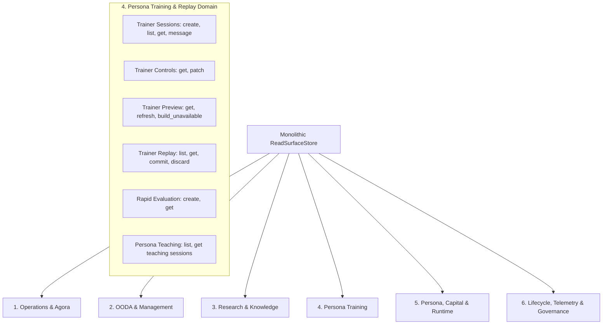

# Read Surface Ownership Partition: Persona Training & Replay

- **Task ID**: `ACG-RS-TRAINING-OWNERSHIP-MAP-20260828`
- **Domain**: Persona Training, Replay, and Rapid Evaluation (`persona_training`)
- **Status**: Canonical Ownership Map
- **Date**: 2026-08-28

---

## 1. Executive Summary & Objective

This document provides the authoritative ownership partition and caller inventory for the **Persona Training & Replay** domain as part of the monolithic `ReadSurfaceStore` deprecation and narrow domain port migration (`ACG-RS-*` series).

The objective is to establish a deterministic, zero-overlap migration baseline for all `read_store` calls in `services/control-plane/bff/main.py` belonging to persona training, interactive trainer sessions, trainer controls, preview evaluation, trainer replay commit/discard, and rapid evaluation.

### Key Governance Principles
1. **Zero Generic Delegation**: Every legacy `read_store` call must map directly to an explicit, typed domain port method or command owner. No generic proxies or dynamic `getattr` fallbacks are permitted.
2. **Zero Production Code Changes in this Task**: Production BFF source (`services/control-plane/bff/main.py` and `read_store.py`) remains untouched during this mapping phase.
3. **Explicit Missing API Identification**: Any helper or fallback constructor currently defined only on `read_store.py` (such as `build_trainer_preview_unavailable`) is explicitly identified as a missing narrow domain API with its intended typed owner, signature, and cutover plan.
4. **Disjoint Partitioning**: The method sets and caller sites allocated to `persona_training` are proven to have zero overlap with the other five domain ownership maps (`operations_agora`, `ooda_management`, `research_knowledge`, `persona_capital_runtime`, `lifecycle_telemetry_governance`).

---

## 2. Complete Inventory of `main.py` Caller Sites

There are **31 direct member calls** in `services/control-plane/bff/main.py` invoking methods belonging to the Persona Training domain across **17 unique domain methods**, plus **4 foreign-key existence guard calls** (`read_store.get_persona`) located inside trainer route handlers.

### 2.1 Tabular Call Inventory

| # | Line | Member Call | Calling Function / Context | HTTP Route / Decorator | Type | Target Domain Port | Destination / Command Owner |
|---|---|---|---|---|---|---|---|
| 1 | `15280` | `list_teaching_sessions_for_persona` | `list_persona_teaching_sessions` | `GET /api/v1/personas/{persona_id}/teaching` | Read | `PersonaRegistryReadsPort.list_persona_teaching_sessions` | Persona Registry Read Surface |
| 2 | `15365` | `create_trainer_session` | `create_trainer_session` | `POST /api/v1/trainer/sessions` | Write | `TrainingSessionTrainerPort.create_trainer_session` | Training Session Service (`POST /api/v1/trainer/sessions`) |
| 3 | `15426` | `list_trainer_sessions` | `list_trainer_sessions` | `GET /api/v1/trainer/sessions` | Read | `TrainingSessionTrainerPort.list_trainer_sessions` | Training Session Service (`GET /api/v1/trainer/sessions`) |
| 4 | `15460` | `get_trainer_session` | `get_trainer_session_detail` | `GET /api/v1/trainer/sessions/{session_id}` | Read | `TrainingSessionTrainerPort.get_trainer_session` | Training Session Service (`GET /api/v1/trainer/sessions/{id}`) |
| 5 | `15488` | `get_trainer_controls` | `get_trainer_controls` | `GET /api/v1/trainer/sessions/{session_id}/controls` | Read | `TrainingSessionTrainerPort.get_trainer_controls` | Training Session Service (`GET /api/v1/trainer/sessions/{id}/controls`) |
| 6 | `15509` | `get_trainer_controls` | `patch_trainer_controls` | `POST /api/v1/trainer/sessions/{session_id}/patch` | Read | `TrainingSessionTrainerPort.get_trainer_controls` | Training Session Service (`GET /api/v1/trainer/sessions/{id}/controls`) |
| 7 | `15534` | `patch_trainer_controls` | `patch_trainer_controls` | `POST /api/v1/trainer/sessions/{session_id}/patch` | Write | `TrainingSessionTrainerPort.patch_trainer_controls` | Training Session Service (`POST /api/v1/trainer/sessions/{id}/patch`) |
| 8 | `15558` | `get_trainer_session` | `append_trainer_message` | `POST /api/v1/trainer/sessions/{session_id}/message` | Read | `TrainingSessionTrainerPort.get_trainer_session` | Training Session Service (`GET /api/v1/trainer/sessions/{id}`) |
| 9 | `15584` | `append_trainer_message` | `append_trainer_message` | `POST /api/v1/trainer/sessions/{session_id}/message` | Write | `TrainingSessionTrainerPort.append_trainer_message` | Training Session Service (`POST /api/v1/trainer/sessions/{id}/message`) |
| 10 | `15618` | `get_trainer_session` | `get_trainer_preview` | `GET /api/v1/trainer/sessions/{session_id}/preview` | Read | `TrainingSessionTrainerPort.get_trainer_session` | Training Session Service (`GET /api/v1/trainer/sessions/{id}`) |
| 11 | `15628` | `get_trainer_preview` | `get_trainer_preview` | `GET /api/v1/trainer/sessions/{session_id}/preview` | Read | `TrainingSessionTrainerPort.get_trainer_preview` | Training Session Service (`GET /api/v1/trainer/sessions/{id}/preview`) |
| 12 | `15642` | `build_trainer_preview_unavailable` | `get_trainer_preview` | `GET /api/v1/trainer/sessions/{session_id}/preview` | Read | *Missing Explicit Narrow API* (Target: `TrainingSessionTrainerPort.build_trainer_preview_unavailable` / Preview Helper) | Domain Preview Fallback Constructor (Currently in `read_store.py` only; see §3.4, §5.1) |
| 13 | `15660` | `get_trainer_session` | `refresh_trainer_preview` | `POST /api/v1/trainer/sessions/{session_id}/preview` | Read | `TrainingSessionTrainerPort.get_trainer_session` | Training Session Service (`GET /api/v1/trainer/sessions/{id}`) |
| 14 | `15669` | `get_trainer_preview` | `refresh_trainer_preview` | `POST /api/v1/trainer/sessions/{session_id}/preview` | Read | `TrainingSessionTrainerPort.get_trainer_preview` | Training Session Service (`GET /api/v1/trainer/sessions/{id}/preview`) |
| 15 | `15673` | `build_trainer_preview_unavailable` | `refresh_trainer_preview` | `POST /api/v1/trainer/sessions/{session_id}/preview` | Read | *Missing Explicit Narrow API* (Target: `TrainingSessionTrainerPort.build_trainer_preview_unavailable` / Preview Helper) | Domain Preview Fallback Constructor (Currently in `read_store.py` only; see §3.4, §5.1) |
| 16 | `15697` | `refresh_trainer_preview` | `refresh_trainer_preview` | `POST /api/v1/trainer/sessions/{session_id}/preview` | Write | `TrainingSessionTrainerPort.refresh_trainer_preview` | Training Session Service (`POST /api/v1/trainer/sessions/{id}/preview`) |
| 17 | `15746` | `list_trainer_replays` | `list_trainer_replays` | `GET /api/v1/trainer/replay` | Read | `TrainingSessionTrainerPort.list_trainer_replays` | Training Session Service (`GET /api/v1/trainer/replay`) |
| 18 | `15777` | `get_trainer_replay` | `get_trainer_replay_detail` | `GET /api/v1/trainer/replay/{session_id}` | Read | `TrainingSessionTrainerPort.get_trainer_replay` | Training Session Service (`GET /api/v1/trainer/replay/{id}`) |
| 19 | `15933` | `get_trainer_replay` | `commit_trainer_replay` | `POST /api/v1/trainer/sessions/{session_id}/commit` | Read | `TrainingSessionTrainerPort.get_trainer_replay` | Training Session Service (`GET /api/v1/trainer/replay/{id}`) |
| 20 | `15970` | `commit_trainer_replay` | `commit_trainer_replay` | `POST /api/v1/trainer/sessions/{session_id}/commit` | Write | `TrainingSessionTrainerPort.commit_trainer_replay` | Training Session Service (`POST /api/v1/trainer/sessions/{id}/commit`) |
| 21 | `16005` | `get_trainer_replay` | `discard_trainer_replay` | `POST /api/v1/trainer/sessions/{session_id}/discard` | Read | `TrainingSessionTrainerPort.get_trainer_replay` | Training Session Service (`GET /api/v1/trainer/replay/{id}`) |
| 22 | `16042` | `discard_trainer_replay` | `discard_trainer_replay` | `POST /api/v1/trainer/sessions/{session_id}/discard` | Write | `TrainingSessionTrainerPort.discard_trainer_replay` | Training Session Service (`POST /api/v1/trainer/sessions/{id}/discard`) |
| 23 | `16107` | `get_trainer_session` | `create_rapid_eval` | `POST /api/v1/trainer/sessions/{session_id}/rapid-eval` | Read | `TrainingSessionTrainerPort.get_trainer_session` | Training Session Service (`GET /api/v1/trainer/sessions/{id}`) |
| 24 | `16125` | `create_rapid_eval` | `create_rapid_eval` | `POST /api/v1/trainer/sessions/{session_id}/rapid-eval` | Write | `RapidEvaluationPort.create_rapid_eval` | `services/training-session/rapid_eval_integration.py` (`run_rapid_eval`) |
| 25 | `16155` | `get_trainer_session` | `get_rapid_eval` | `GET /api/v1/trainer/sessions/{session_id}/rapid-eval/{eval_id}` | Read | `TrainingSessionTrainerPort.get_trainer_session` | Training Session Service (`GET /api/v1/trainer/sessions/{id}`) |
| 26 | `16164` | `get_rapid_eval` | `get_rapid_eval` | `GET /api/v1/trainer/sessions/{session_id}/rapid-eval/{eval_id}` | Read | `RapidEvaluationPort.get_rapid_eval` | `services/training-session/rapid_eval_integration.py` |
| 27 | `21746` | `get_teaching_sessions_for_persona` | `get_persona_management` | `GET /api/v1/operator/persona-management/{persona_id}` | Read | `PersonaRegistryReadsPort.list_persona_teaching_sessions` | Persona Registry Read Surface |
| 28 | `36463` | `get_teaching_sessions_for_persona` | `_project_persona_fleet_item` | *(internal projection helper)* | Read | `PersonaRegistryReadsPort.list_persona_teaching_sessions` | Persona Registry Read Surface |
| 29 | `40209` | `get_teaching_sessions_for_persona` | `_persona_intent_all_items` | *(internal intent helper)* | Read | `PersonaRegistryReadsPort.list_persona_teaching_sessions` | Persona Registry Read Surface |
| 30 | `48478` | `get_teaching_sessions_for_persona` | `bff_get_persona_evaluations` | `GET /bff/personas/{persona_id}/evaluations` | Read | `PersonaRegistryReadsPort.list_persona_teaching_sessions` | Persona Registry Read Surface |
| 31 | `49137` | `get_teaching_sessions_for_persona` | `_pm12_persona_evaluation_summary` | *(internal evaluation summary)* | Read | `PersonaRegistryReadsPort.list_persona_teaching_sessions` | Persona Registry Read Surface |

### 2.2 Foreign-Key Persona Guard Calls Inside Training Endpoints

The following 4 calls check persona existence in route entry points. Their primary domain owner is `persona_capital_runtime` (`PersonaRegistryReadsPort` / `PersonaCapitalRuntimePort`), but their caller sites reside within the training route handlers:

| # | Line | Member Call | Calling Function / Context | HTTP Route | Target Domain Port |
|---|---|---|---|---|---|
| FK-1 | `15270` | `get_persona` | `list_persona_teaching_sessions` | `GET /api/v1/personas/{persona_id}/teaching` | `PersonaRegistryReadsPort.get_persona` |
| FK-2 | `15356` | `get_persona` | `create_trainer_session` | `POST /api/v1/trainer/sessions` | `PersonaRegistryReadsPort.get_persona` |
| FK-3 | `15415` | `get_persona` | `list_trainer_sessions` | `GET /api/v1/trainer/sessions` | `PersonaRegistryReadsPort.get_persona` |
| FK-4 | `15723` | `get_persona` | `list_trainer_replays` | `GET /api/v1/trainer/replay` | `PersonaRegistryReadsPort.get_persona` |

---

## 3. Sub-Capability Breakdown and Classification

### 3.1 Persona Teaching Sessions
- **Methods**: `list_teaching_sessions_for_persona`, `get_teaching_sessions_for_persona`
- **Call Count**: 6 call sites (Lines 15280, 21746, 36463, 40209, 48478, 49137)
- **Classification**: **Read** (Query)
- **Semantics**: Retrieves historical teaching and interactive training session records associated with a given persona ID.
- **Port Mapping**: Handled via `PersonaRegistryReadsPort.list_persona_teaching_sessions(persona_id, status=None)` or `PersonaTrainingDomainPort.list_persona_teaching_sessions(...)`.
- **Destination**: Persona Registry read model backed by Training Session metadata.

### 3.2 Trainer Session Lifecycle & Dialog (TW-01)
- **Methods**: `create_trainer_session`, `list_trainer_sessions`, `get_trainer_session`, `append_trainer_message`
- **Call Count**: 9 call sites:
  - `create_trainer_session`: Line 15365 (**Write**)
  - `list_trainer_sessions`: Line 15426 (**Read**)
  - `get_trainer_session`: Lines 15460, 15558, 15618, 15660, 16107, 16155 (**Read**)
  - `append_trainer_message`: Line 15584 (**Write**)
- **Classification**:
  - `create_trainer_session` & `append_trainer_message` -> **Write** (Command)
  - `list_trainer_sessions` & `get_trainer_session` -> **Read** (Query)
- **Port Mapping**: Handled via `TrainingSessionTrainerPort` / `PersonaTrainingDomainPort.trainer`.
- **Destination**: Training Session HTTP API (`PANTHEON_TRAINING_SESSION_API_URL`).

### 3.3 Trainer Controls (TW-02)
- **Methods**: `get_trainer_controls`, `patch_trainer_controls`
- **Call Count**: 3 call sites:
  - `get_trainer_controls`: Lines 15488, 15509 (**Read**)
  - `patch_trainer_controls`: Line 15534 (**Write**)
- **Classification**:
  - `get_trainer_controls` -> **Read** (Query)
  - `patch_trainer_controls` -> **Write** (Command)
- **Port Mapping**: Handled via `TrainingSessionTrainerPort.get_trainer_controls` and `TrainingSessionTrainerPort.patch_trainer_controls`.
- **Destination**: Training Session service control plane (`/api/v1/trainer/sessions/{id}/controls` and `/patch`).

### 3.4 Trainer Preview (TW-03)
- **Methods**: `get_trainer_preview`, `build_trainer_preview_unavailable`, `refresh_trainer_preview`
- **Call Count**: 7 call sites:
  - `get_trainer_preview`: Lines 15628, 15669 (**Read**)
  - `build_trainer_preview_unavailable`: Lines 15642, 15673 (**Read / Pure Fallback Constructor**)
  - `refresh_trainer_preview`: Line 15697 (**Write / Calculation Trigger**)
- **Classification**:
  - `get_trainer_preview` & `build_trainer_preview_unavailable` -> **Read**
  - `refresh_trainer_preview` -> **Write**
- **Port Mapping & Missing Narrow API Identification**:
  - `get_trainer_preview` and `refresh_trainer_preview` are implemented on `TrainingSessionTrainerPort` and composed into `PersonaTrainingDomainPort`.
  - **`build_trainer_preview_unavailable` is a missing explicit narrow API**: The existing narrow port `PersonaTrainingDomainPort` / `TrainingSessionTrainerPort` in `services/control-plane/bff/domain_ports/persona_training.py` currently exposes no such method (only legacy `read_store.py` defines it).
  - **Intended Typed Owner**: Training Session Domain (`TrainingSessionTrainerPort` / `PersonaTrainingDomainPort` or a dedicated pure domain helper module).
  - **Intended Typed Signature**:
    ```python
    def build_trainer_preview_unavailable(
        self,
        session_id: str,
        *,
        session_status: Optional[str],
        snapshot_at: Optional[str] = None,
        control_diff: Optional[List[Dict[str, Any]]] = None,
    ) -> Dict[str, Any]: ...
    ```
  - **Migration Handling**: During the caller cutover phase (`ACG-RS-CALLER-MIGRATION-20260828`), this constructor will be exposed as an explicit typed method on the domain port or extracted to a pure preview helper in `services/control-plane/bff/` / `services/training-session/`, eliminating reliance on `read_store.py` without introducing generic delegation or runtime regression.
- **Destination**: Training Session service preview calculation engine / fallback constructor.

### 3.5 Trainer Replay (TW-04)
- **Methods**: `list_trainer_replays`, `get_trainer_replay`, `commit_trainer_replay`, `discard_trainer_replay`
- **Call Count**: 6 call sites:
  - `list_trainer_replays`: Line 15746 (**Read**)
  - `get_trainer_replay`: Lines 15777, 15933, 16005 (**Read**)
  - `commit_trainer_replay`: Line 15970 (**Write**)
  - `discard_trainer_replay`: Line 16042 (**Write**)
- **Classification**:
  - `list_trainer_replays` & `get_trainer_replay` -> **Read** (Query)
  - `commit_trainer_replay` & `discard_trainer_replay` -> **Write** (Command)
- **Port Mapping**: Handled via `TrainingSessionTrainerPort` (`list_trainer_replays`, `get_trainer_replay`, `commit_trainer_replay`, `discard_trainer_replay`).
- **Destination**: Training Session service replay store, with `commit_trainer_replay` triggering downstream `TrainerSeedBridge` strategy seed extraction.

### 3.6 Rapid Evaluation (TRN-003 / ACG-02-017)
- **Methods**: `create_rapid_eval`, `get_rapid_eval`
- **Call Count**: 2 direct call sites (plus session validation via `get_trainer_session` at lines 16107, 16155):
  - `create_rapid_eval`: Line 16125 (**Write / Job Creation**)
  - `get_rapid_eval`: Line 16164 (**Read / Evaluation Status**)
- **Classification**:
  - `create_rapid_eval` -> **Write**
  - `get_rapid_eval` -> **Read**
- **Canonical Owner & Evidence**:
  - **Owner**: `training-session`
  - **Implementation Module**: `services/training-session/rapid_eval_integration.py` (`run_rapid_eval`)
  - **Evidence**: `services/training-session/rapid_eval_integration.py` is the sole execution implementation for rapid evaluations with its own test suite `services/training-session/test_rapid_eval_integration.py`. No competing implementation exists under `services/research`.
- **Port Mapping**: Handled via `RapidEvaluationPort` / `PersonaTrainingDomainPort.rapid_eval`.

---

## 4. Method Count Summary & Disjoint Domain Partition Proof

### 4.1 Exact Persona Training Method Set (17 Unique Methods)

The following 17 unique methods in `ReadSurfaceStore` belong strictly to the Persona Training & Replay domain:

1. `append_trainer_message` (1 call site: L15584)
2. `build_trainer_preview_unavailable` (2 call sites: L15642, L15673 - *Missing explicit narrow API in port; see §3.4 & §5.1*)
3. `commit_trainer_replay` (1 call site: L15970)
4. `create_rapid_eval` (1 call site: L16125)
5. `create_trainer_session` (1 call site: L15365)
6. `discard_trainer_replay` (1 call site: L16042)
7. `get_rapid_eval` (1 call site: L16164)
8. `get_teaching_sessions_for_persona` (5 call sites: L21746, L36463, L40209, L48478, L49137)
9. `get_trainer_controls` (2 call sites: L15488, L15509)
10. `get_trainer_preview` (2 call sites: L15628, L15669)
11. `get_trainer_replay` (3 call sites: L15777, L15933, L16005)
12. `get_trainer_session` (6 call sites: L15460, L15558, L15618, L15660, L16107, L16155)
13. `list_teaching_sessions_for_persona` (1 call site: L15280)
14. `list_trainer_replays` (1 call site: L15746)
15. `list_trainer_sessions` (1 call site: L15426)
16. `patch_trainer_controls` (1 call site: L15534)
17. `refresh_trainer_preview` (1 call site: L15697)

- **Total Unique Domain Methods**: **17**
- **Total Direct Call Invocations in `main.py`**: **31** (reconciled across all 17 methods above).

---

### 4.2 Disjoint Partitioning Matrix Across All 6 Tasks

To prove zero overlap across the six read-surface tasks, the following matrix partitions all capabilities and methods:



| Domain Task ID | Task Doc Artifact | Exclusive Method Scope | Boundary Differentiation vs `persona_training` |
|---|---|---|---|
| **ACG-RS-OPS-OWNERSHIP-MAP-20260828** | `operations_agora.md` | Agora sessions, signals, feedback, notes, handoffs, insights, memory, watchlist, committee sessions/memos, consult requests/memos, Agora training examples (`list_agora_training_examples`, `create_agora_training_example`), MCP/tools. | `agora_training_examples` are curated dataset examples for Agora LLM interaction, entirely distinct from interactive persona trainer sessions (`trainer_sessions`). |
| **ACG-RS-OODA-OWNERSHIP-MAP-20260828** | `ooda_management.md` | OODA packets, OpenClaw runtime ops/broker readiness, loop runs, loop health, interventions, decision journals, sponsor decisions, synthesis conflict logs. | OODA and loop execution manage trading runtime loops; they do not handle persona training dialogs or replay commits. |
| **ACG-RS-RESEARCH-OWNERSHIP-MAP-20260828** | `research_knowledge.md` | Research experiments, tickets, analyses, artifacts, strategy specs, ranking formulas, snapshots, search index, inspiration graphs. | Research experiments are offline strategy generation/ranking; rapid evaluation (`run_rapid_eval`) in `persona_training` is bound to the Training Session execution engine. |
| **ACG-RS-TRAINING-OWNERSHIP-MAP-20260828** *(This Task)* | `persona_training.md` | `create_trainer_session`, `list_trainer_sessions`, `get_trainer_session`, `append_trainer_message`, `get_trainer_controls`, `patch_trainer_controls`, `get_trainer_preview`, `refresh_trainer_preview`, `build_trainer_preview_unavailable`, `list_trainer_replays`, `get_trainer_replay`, `commit_trainer_replay`, `discard_trainer_replay`, `create_rapid_eval`, `get_rapid_eval`, `list_teaching_sessions_for_persona`, `get_teaching_sessions_for_persona`. | **100% Owned by this domain.** |
| **ACG-RS-CAPITAL-OWNERSHIP-MAP-20260828** | `persona_capital_runtime.md` | Persona registry (`create_persona`, `get_persona`, `update_persona`, `list_personas`, `list_sessions_for_persona`, `get_capability_snapshot`), capital pools, allocations, rebalances, runtime bindings. | Owns the authoritative Persona profile and capital state. Training endpoints only use `get_persona` as an FK validation guard. |
| **ACG-RS-LIFECYCLE-OWNERSHIP-MAP-20260828** | `lifecycle_telemetry_governance.md` | Incidents, rollbacks, postmortems, evolution programs/decisions, governance review/approval queues, audit events, telemetry summaries/events, drift reports, kill switch, deployment plans. | Manages operational safety, trade journey projection, and governance gating. |

---

## 5. Narrow Domain Port Signatures & Non-Regression

The narrow domain port structure implemented in `services/control-plane/bff/domain_ports/persona_training.py` and `services/control-plane/bff/ports/persona_training.py` provides typed interfaces with zero generic delegation:

```python
class PersonaTrainingDomainPort:
    persona: PersonaRegistryReadsPort
    trainer: TrainingSessionTrainerPort
    rapid_eval: RapidEvaluationPort

    # Direct typed delegation to sub-ports:
    def list_persona_teaching_sessions(self, persona_id: str, *, status: Optional[str] = None) -> List[Dict[str, Any]]: ...
    def create_trainer_session(self, **kwargs: Any) -> Optional[Dict[str, Any]]: ...
    def list_trainer_sessions(self, **kwargs: Any) -> List[Dict[str, Any]]: ...
    def get_trainer_session(self, session_id: Optional[str]) -> Optional[Dict[str, Any]]: ...
    def get_trainer_controls(self, session_id: str) -> Optional[Dict[str, Any]]: ...
    def patch_trainer_controls(self, session_id: str, **kwargs: Any) -> Optional[Dict[str, Any]]: ...
    def append_trainer_message(self, session_id: str, **kwargs: Any) -> Optional[Dict[str, Any]]: ...
    def get_trainer_preview(self, session_id: str, **kwargs: Any) -> Optional[Dict[str, Any]]: ...
    def refresh_trainer_preview(self, session_id: str, **kwargs: Any) -> Optional[Dict[str, Any]]: ...
    def list_trainer_replays(self, **kwargs: Any) -> List[Dict[str, Any]]: ...
    def get_trainer_replay(self, session_id: Optional[str]) -> Optional[Dict[str, Any]]: ...
    def commit_trainer_replay(self, session_id: str, **kwargs: Any) -> Optional[Dict[str, Any]]: ...
    def discard_trainer_replay(self, session_id: str, **kwargs: Any) -> Optional[Dict[str, Any]]: ...
    def create_rapid_eval(self, session_id: str, **kwargs: Any) -> Optional[Dict[str, Any]]: ...
    def get_rapid_eval(self, eval_id: Optional[str], **kwargs: Any) -> Optional[Dict[str, Any]]: ...
```

### 5.1 Missing Explicit Narrow API Analysis

While the implemented `PersonaTrainingDomainPort` covers the 16 interactive and query methods listed above, **`build_trainer_preview_unavailable` is identified as a missing explicit narrow API**:
- **Current State**: Only legacy `services/control-plane/bff/read_store.py` (`ReadSurfaceStore.build_trainer_preview_unavailable`) defines this fallback payload constructor. The implemented narrow port `PersonaTrainingDomainPort` / `TrainingSessionTrainerPort` in `domain_ports/persona_training.py` does not yet declare or implement it.
- **Intended Typed Owner**: Training Session Domain (`TrainingSessionTrainerPort` / `PersonaTrainingDomainPort` or a dedicated pure domain helper module).
- **Target Typed Signature**:
  ```python
  def build_trainer_preview_unavailable(
      self,
      session_id: str,
      *,
      session_status: Optional[str],
      snapshot_at: Optional[str] = None,
      control_diff: Optional[List[Dict[str, Any]]] = None,
  ) -> Dict[str, Any]: ...
  ```
- **Migration & Cutover Plan**: In `ACG-RS-CALLER-MIGRATION-20260828`, this method will be explicitly added to `TrainingSessionTrainerPort` (or moved to a pure domain helper) before caller cutover in `main.py`, preserving type safety and zero generic delegation. In compliance with the boundary constraints of this inventory task, no production code in `services/control-plane/bff` is altered here.

### 5.2 Verification Evidence
- Port unit tests: `services/control-plane/bff/tests/test_persona_training_ports.py` (17 test cases passing).
- Validates strict delegation to injected Training Session backend and Persona Registry store without fallback or dynamic proxying.

---

## 6. Migration Sequence & Acceptance Verification

During caller cutover (`ACG-RS-CALLER-MIGRATION-20260828`):
1. Add `build_trainer_preview_unavailable` to `TrainingSessionTrainerPort` / `PersonaTrainingDomainPort` (or domain helper) with explicit typed signature.
2. Replace `read_store` calls in `main.py` lines 15259–16174 with `ports.persona_training.*` or `ports.persona_capital_runtime.*` for FK checks.
3. In projection helpers (lines 21746, 36463, 40209, 48478, 49137), replace `read_store.get_teaching_sessions_for_persona(persona_id)` with `ports.persona_training.list_persona_teaching_sessions(persona_id)`.
4. In `services/control-plane/bff/read_store.py`, all trainer and teaching methods will be decommissioned and deleted in `ACG-RS-FINAL-DELETE-20260828`.

---
*End of Ownership Partition Map for Persona Training.*
