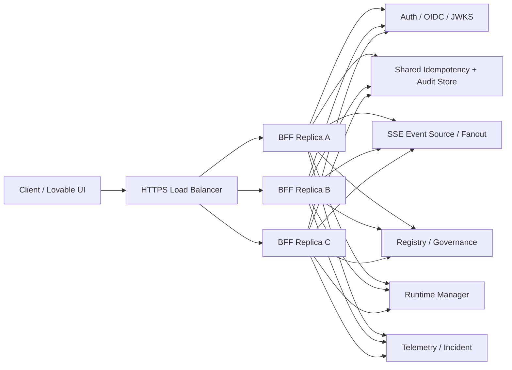

# BFF HA Topology

Status: pre-gate production topology artifact for `HA-001-V2`
Source: 2026-05-19 blueprint supplement Part D2
Scope: production-grade BFF HA/LB topology, component responsibilities, and fail-closed boundaries

This document describes the target BFF HA topology for the production cutover
track. It does not change the current dev or staging baseline: per
`BFF_HA_AND_CONTROL_PLANE_RESILIENCE.md`, current compose deployments may remain
single-replica until the HA PoC, evidence, and `HA-PROD-001-V2` human gate are
approved.

## Baseline Topology

## Component Responsibilities

| Component | Responsibility | Must not own |
|---|---|---|
| Client / Lovable UI | Opens HTTPS requests and SSE streams through the LB. Shows typed degraded states when BFF reports upstream loss. | Backend truth, fallback snapshots, or silent fixture recovery. |
| HTTPS Load Balancer | Terminates public HTTPS, health-checks BFF replicas, and routes requests to healthy replicas. | Command ordering or domain state. |
| BFF replicas | Stateless auth facade, read composition, command envelope validation, source metadata, and typed degradation. | Canonical deployment, runtime, registry, telemetry, audit, or capital state. |
| Auth / OIDC / JWKS | Token validation material and identity claims for BFF policy checks. | Runtime control or command receipts. |
| Shared Idempotency + Audit Store | Cross-replica command dedupe, replay-safe receipts, and audit append handoff for BFF-originated commands. | Domain command effects or downstream service truth. |
| SSE Event Source / Fanout | Shared realtime fanout so clients can reconnect through any BFF replica and resume from `Last-Event-ID`. | Canonical state reconstruction. |
| Registry / Governance | Strategy, persona, capital, approval, policy, and governance read/write authorities behind BFF facades. | BFF-local state. |
| Runtime Manager | Runtime lifecycle authority for deploy, pause, replace, rollback, kill-switch, and runtime status commands. | UI aggregation or frontend fallback state. |
| Telemetry / Incident | Heartbeat, alert, incident, and status projections consumed by BFF reads and SSE events. | Command approval or runtime lifecycle decisions. |

## Request Flow

Reads:

1. The client calls the HTTPS endpoint through the load balancer.
2. Any healthy BFF replica authenticates the request and composes live read
   models from Registry / Governance, Runtime Manager, and Telemetry / Incident.
3. If an upstream is unavailable, BFF returns a typed degraded response. It must
   not invent state from local seed, fixture, or hidden localhost fallback.

Commands:

1. The client sends a command envelope with actor, trace, idempotency key, target,
   and reason.
2. The selected BFF replica validates auth, policy preconditions, and command
   shape before dispatch.
3. The replica reserves or reads the idempotency key in the shared store before
   forwarding the command. A duplicate key returns the stored receipt when the
   request matches, or a conflict when the request differs.
4. The replica writes the audit handoff before dispatching to the owning backend.
5. Registry / Governance or Runtime Manager performs the domain action and
   returns the canonical result.

SSE:

1. BFF replicas subscribe to the shared SSE fanout rather than keeping isolated
   in-memory event streams.
2. Clients reconnect with `Last-Event-ID`; any replica can continue from the
   shared fanout cursor.
3. If replay cannot satisfy the cursor, BFF reports stale or degraded realtime
   state instead of pretending the stream is fresh.

## Fail-Closed Boundaries

| Condition | BFF response | Command posture |
|---|---|---|
| Shared idempotency store unavailable | `503 IDEMPOTENCY_UNAVAILABLE` | No command dispatch. |
| Audit handoff unavailable | `503 AUDIT_UNAVAILABLE` | No command dispatch. |
| Registry / Governance unavailable | `503 REGISTRY_GOVERNANCE_UNAVAILABLE` | No approval, deployment, capital, strategy, or persona command dispatch. |
| Runtime Manager unavailable | `503 RUNTIME_MANAGER_UNAVAILABLE` | No runtime lifecycle command dispatch. |
| Telemetry / Incident unavailable | `503 TELEMETRY_UNAVAILABLE` and stale read metadata | No high-risk command that depends on fresh runtime health. |
| SSE fanout unavailable or cursor expired | Reconnect failure or stale realtime metadata | Read-only or guarded mode until realtime recovers. |

The BFF HA topology is intentionally active-active for stateless reads and
facade validation, but command safety depends on shared idempotency, audit, and
the owning backend services. If those shared dependencies are down, the correct
behavior is typed rejection, not best-effort execution.

## Delivery Boundary

This document is the `HA-001-V2` topology artifact. Follow-up HA tasks own the
adjacent executable pieces:

| Task | Owned surface |
|---|---|
| `HA-002-V2` | SLA JSON for uptime, p99 latency, SSE connection target, RTO, RPO, and cost ceiling. |
| `HA-003-V2` | Degraded mode matrix implementation. |
| `HA-004-V2` | Failover runbook. |
| `HA-005-V2` | Observability spec and dashboard requirements. |
| `HA-006-V2` | Cost ceiling monitor. |
| `HA-007-V2` | Multi-replica dev PoC. |
| `HA-008-V2` | SSE `Last-Event-ID` replay test. |
| `HA-009-V2` | Idempotency under multi-replica test. |
| `HA-010-V2` | Failover demo. |
| `HA-PROD-001-V2` | Human-gated production cutover approval. |

No compose, deployment, L1 canonical policy, or production cutover change is
introduced by this document.
