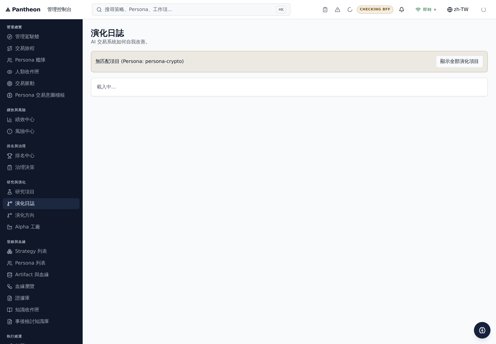

# EVOCHAIN-009: FE Journal Formal-Entry Fields + Fixture Badge

Status: implemented

Task: `docs/bff/execution-tasks/2026-07-13-evolution-journal-producer-gap/INDEX.md`
(Wave 0, owner Claude, reviewer Codex2 — reassigned Antigravity, then back to
Codex2 per `.orchestrator/task-briefs/evochain_009.md`)

Cross-repo task: `ajoe734/execute-plans`, branch `task/EVOCHAIN-009` from `dev`.

## Scope

Render Evolution Journal cards' formal-entry fields in the console
(`src/management/pages/oversight/_core.tsx`, `EvolutionJournalPage`):

- `risk_level`, `action_type`, and `target` (with version) — already rendered
  before this task.
- Approval status — new. Added an explicit "Approval status" `dl` field,
  sourced from the entry's existing `status` value, but only rendered for
  formal entry types (`evolution_decision`, `mutation_review`). Those two
  types carry a real governance lifecycle state (`decision_state`:
  proposed/reviewed/approved/rejected/executed/cancelled) in `status`; other
  entry types (`postmortem`, `freeze_order`, `rollback`,
  `persona_fleet_summary`) reuse the same generic `status` field for
  unrelated meanings, so the label is scoped to formal entries only.
- Fixture badge for `origin: seed` entries — new. Added an optional
  `origin?: string` field to the `EvolutionEntry` interface and render a
  "Fixture" `Badge` (warning tone, matching `statusTone`'s degraded/warning
  styling) next to the existing status badge whenever `entry.origin ===
  "seed"`.

The 2026-07-10 fallback card contract (`persona_fleet_summary` entries
produced by `fallbackEvolutionEntryFromFleet`) is unchanged: that entry never
sets `action_type`, `risk_level`, or `origin`, so it renders exactly as
before (no approval-status field, no fixture badge).

## Dependency gap: `origin: seed` producer — landed

`EVOCHAIN-007` ("Server-side persona/mutation filters + paging on
`/bff/management/evolution-journal`; `origin:seed` marker") was the producer
of the `origin` field this task consumes. At this task's original
implementation time, `EVOCHAIN-007` had not yet landed. **It has since
landed**: `src/management/pages/oversight/_core.tsx` carries the
`EVOCHAIN-007 producer marker` comment on `EvolutionEntry.origin?: string`
(`isFixture = e.origin === "seed"`), and the live hosted dev environment now
serves seed-derived journal entries with `origin: "seed"` set.

This task's FE code was intentionally defensive from the start: `origin` is
optional and the fixture badge simply does not render while the field is
absent. That defensiveness is no longer load-bearing in production — the
fixture badge is now a real, live-observed feature. Hosted Playwright
evidence (see "Review And Delivery" below) confirms both states:
`origin: "seed"` formal entries render the "Fixture" badge and an "Approval
status" field, and `persona_fleet_summary` fallback entries render neither
(no Fixture badge, no Approval status field, no raw i18n keys, no `NaN`).

- Residual risk: none remaining from this dependency. `EVOCHAIN-007` shipped
  `origin: "seed"` on seed-derived items and the FE badge has been
  re-verified against the live hosted environment (see "Review And
  Delivery").

## Implementation

- `src/management/pages/oversight/_core.tsx`:
  - `EvolutionEntry.origin?: string`.
  - `FORMAL_EVOLUTION_ENTRY_TYPES = new Set(["evolution_decision",
    "mutation_review"])`.
  - `isFormalEntry` / `approvalStatus` / `isFixture` derived per row in
    `EvolutionJournalPage`'s render loop.
  - Fixture `Badge` rendered in the card header row next to the existing
    status badge; "Approval status" added as a fourth `dl` field alongside
    action/risk/target.
- `src/i18n/locales/en-US.ts` / `src/i18n/locales/zh-TW.ts`: added
  `mgmt.evolution.action`, `.risk`, `.target` as real locale keys (previously
  only inline `defaultValue` fallbacks in the component), plus new
  `mgmt.evolution.approvalStatus`, `.fixtureBadge`, `.fixtureBadgeHint`.

## Verification

Run from the `execute-plans` worktree on `task/EVOCHAIN-009`:

```sh
npx vitest run src/lib/v5/management/__tests__/i18nParity.test.ts src/management/pages/oversight/_core.test.ts
npx tsc --noEmit -p tsconfig.app.json
npx eslint src/management/pages/oversight/_core.tsx src/i18n/locales/en-US.ts src/i18n/locales/zh-TW.ts
```

Results:

- `i18nParity.test.ts` + `_core.test.ts`: `39 passed` (2 files: 4 + 35).
  Re-run 2026-07-14 against `task/EVOCHAIN-009` (execute-plans HEAD
  `61554b2`, one commit ahead of `dev` at `60461cb6`) to reconcile this
  doc with current truth; count confirmed accurate and unchanged.
- `tsc --noEmit`: 191 pre-existing repo-wide errors, unrelated to this
  change (confirmed identical count with this task's diff stashed vs.
  applied; no error references any line touched by this task).
- `eslint` on the three touched files: clean, no output.

Hosted/live evidence has now been captured for both card states via
Playwright (`e2e/evochain009.spec.ts`, tracked in git as of this reconcile
pass) against the live hosted dev frontend and BFF:

- Formal `origin: "seed"` entries — Fixture badge + Approval status field
  visible (`evolution_journal_hosted_evidence.png`).
- `persona_fleet_summary` fallback entries — no Fixture badge, no Approval
  status field, no raw i18n keys, no `NaN`
  (`evolution_journal_hosted_evidence_fallback.png`).

Both Playwright projects (`chromium`, `mobile-chromium`) pass for the
fallback-state probe: `2 passed`.

## Out of scope / residual

- `EVOCHAIN-007`'s `origin: seed` producer marker has landed (see dependency
  gap above) — no longer a residual for this task. Owner: Codex2. Reviewer:
  Codex.
- Live curl/hosted proof of the fixture badge rendering against a real
  seed-origin item is captured (see "Review And Delivery" below); the
  `EVOCHAIN-011` deferral is resolved for this task's scope.
- Current known residual, unrelated to this task's diff: "Pantheon FE-BFF
  Integration Gate" has been failing broadly across recent unrelated `dev`
  pushes (e.g. PR #338 `task/PINT-010-R2`, PR #331 `task/AG-UIPOL-008`, and
  further back) — a systemic/pre-existing gate issue, not caused by
  Evolution Journal / oversight code. No owner action required from this
  task; tracked separately at the platform level.
- Owner: Antigravity. Reviewer: Codex.

## Review And Delivery

- `execute-plans` initial PR: [#301](https://github.com/ajoe734/execute-plans/pull/301), merged (merge commit `e74b9c8`).
- `execute-plans` first follow-up PR: [#312](https://github.com/ajoe734/execute-plans/pull/312), merged (merge commit `5625ae6`), merges entry_type interface field and EvolutionJournalPage.test.tsx unit tests.
- `execute-plans` recovery PR: [#327](https://github.com/ajoe734/execute-plans/pull/327), merged (merge commit `b5d6485`). This restored the implementation and tests after a regression.
- `execute-plans` evidence-reconcile PR: [#339](https://github.com/ajoe734/execute-plans/pull/339) — tracks `e2e/evochain009.spec.ts` in git (previously untracked) and repoints its fallback-state screenshot to a distinct file so it no longer clobbers the formal-state evidence.
- `pantheon` initial PR: [#3527](https://github.com/ajoe734/pantheon/pull/3527), merged.
- Dev FE deployment verified at commit `936f252e09fa3bb887c88e733e24b6941cac644e` (descendant of `b5d6485`).
- Current `dev` FE deploy identity (as of this reconcile pass, 2026-07-14):
  latest successful "Pantheon Dev FE Deploy" run on `execute-plans` `dev` is
  at commit `60461cb65038c43e427e192e0c857c4772f03ced` (run
  [29307640351](https://github.com/ajoe734/execute-plans/actions/runs/29307640351), success).
- Handoff / history reconciliation:
  - Re-dispatched to Antigravity as owner to address Codex2's review changes (normalize entry_type vs entryType, add focused rendering tests including negative checks and fallback suppression).
  - Later reopened by Codex due to a regression caused by a reconciliation commit in PR #288.
  - Restoration and tests completed in execute-plans PR #327.
  - Reopened again by Codex 2026-07-14: the sole archived screenshot showed
    only the formal/Fixture-badge state, `EVOCHAIN-007`'s landing and live
    Fixture rendering were undocumented, `e2e/evochain009.spec.ts` was
    untracked, and its (at the time single) fallback-only intent
    contradicted the archived formal-state image. Addressed in this pass:
    the spec is now tracked, writes the fallback state to its own file, and
    this doc is reconciled with current truth (EVOCHAIN-007 landed, PR #312
    merged, current deploy identity, integration-gate residual noted).
- Hosted evidence captured via Playwright test `e2e/evochain009.spec.ts` against the live dev frontend:
  - Formal state (Fixture badge + Approval status visible):
    
  - Fallback state (`persona_fleet_summary`; no Fixture badge, no Approval
    status field):
    


