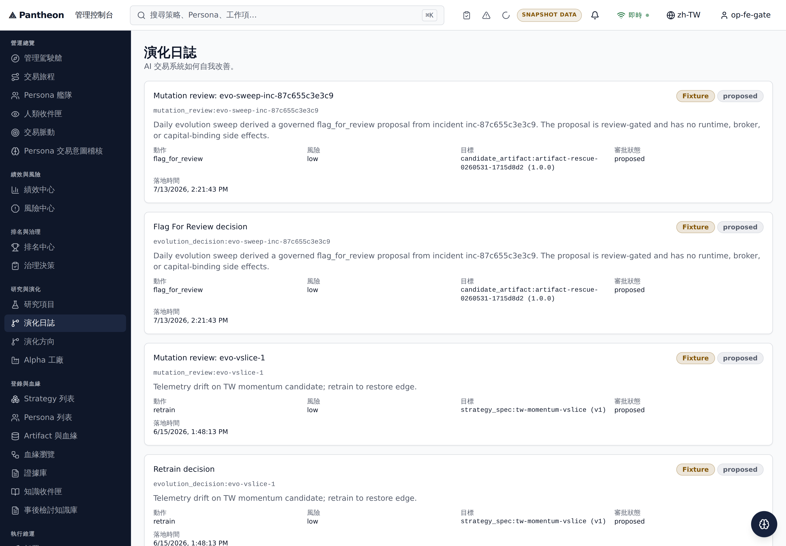

# EVOCHAIN-009: FE Journal Formal-Entry Fields + Fixture Badge

Status: implemented

Task: `docs/bff/execution-tasks/2026-07-13-evolution-journal-producer-gap/INDEX.md`
(Wave 0, owner Claude, reviewer Codex2 — reassigned Antigravity, then back to
Codex2 per `.orchestrator/task-briefs/evochain_009.md`)

Cross-repo task: `ajoe734/execute-plans`, branch `task/EVOCHAIN-009` from `dev`.

## Scope

Render Evolution Journal cards' formal-entry fields in the console
(`src/management/pages/oversight/_core.tsx`, `EvolutionJournalPage`):

- `risk_level`, `action_type`, and `target` (with version) — already rendered
  before this task.
- Approval status — new. Added an explicit "Approval status" `dl` field,
  sourced from the entry's existing `status` value, but only rendered for
  formal entry types (`evolution_decision`, `mutation_review`). Those two
  types carry a real governance lifecycle state (`decision_state`:
  proposed/reviewed/approved/rejected/executed/cancelled) in `status`; other
  entry types (`postmortem`, `freeze_order`, `rollback`,
  `persona_fleet_summary`) reuse the same generic `status` field for
  unrelated meanings, so the label is scoped to formal entries only.
- Fixture badge for `origin: seed` entries — new. Added an optional
  `origin?: string` field to the `EvolutionEntry` interface and render a
  "Fixture" `Badge` (warning tone, matching `statusTone`'s degraded/warning
  styling) next to the existing status badge whenever `entry.origin ===
  "seed"`.

The 2026-07-10 fallback card contract (`persona_fleet_summary` entries
produced by `fallbackEvolutionEntryFromFleet`) is unchanged: that entry never
sets `action_type`, `risk_level`, or `origin`, so it renders exactly as
before (no approval-status field, no fixture badge).

## Dependency gap: `origin: seed` producer not yet landed

`EVOCHAIN-007` ("Server-side persona/mutation filters + paging on
`/bff/management/evolution-journal`; `origin:seed` marker") is the producer
of the `origin` field this task consumes. As of this task's implementation,
`EVOCHAIN-007` has not landed: `services/control-plane/bff/main.py`'s
`_evolution_journal_base_item()` composer does not emit an `origin` field on
any journal item, and no `origin`/seed marker exists anywhere in that file
(verified by direct grep against pantheon `dev` HEAD at implementation time).

This task's FE code is intentionally defensive: `origin` is optional and the
fixture badge simply does not render while the field is absent, which is the
correct behavior today (the seed decision `evo-vslice-1` and other seed-only
decisions have no live way to be distinguished from produced decisions until
EVOCHAIN-007 lands). No entries currently render the fixture badge in
production. Once EVOCHAIN-007 ships `origin: "seed"` on seed-derived items,
the badge activates with no further FE change required.

- Residual risk: fixture badge is currently a no-op in production.
  Owner: `EVOCHAIN-007` (Codex2/Codex). Re-verify FE badge rendering against
  a live seed-origin item after `EVOCHAIN-007` merges.

## Implementation

- `src/management/pages/oversight/_core.tsx`:
  - `EvolutionEntry.origin?: string`.
  - `FORMAL_EVOLUTION_ENTRY_TYPES = new Set(["evolution_decision",
    "mutation_review"])`.
  - `isFormalEntry` / `approvalStatus` / `isFixture` derived per row in
    `EvolutionJournalPage`'s render loop.
  - Fixture `Badge` rendered in the card header row next to the existing
    status badge; "Approval status" added as a fourth `dl` field alongside
    action/risk/target.
- `src/i18n/locales/en-US.ts` / `src/i18n/locales/zh-TW.ts`: added
  `mgmt.evolution.action`, `.risk`, `.target` as real locale keys (previously
  only inline `defaultValue` fallbacks in the component), plus new
  `mgmt.evolution.approvalStatus`, `.fixtureBadge`, `.fixtureBadgeHint`.

## Verification

Run from the `execute-plans` worktree on `task/EVOCHAIN-009`:

```sh
npx vitest run src/lib/v5/management/__tests__/i18nParity.test.ts src/management/pages/oversight/_core.test.ts
npx tsc --noEmit -p tsconfig.app.json
npx eslint src/management/pages/oversight/_core.tsx src/i18n/locales/en-US.ts src/i18n/locales/zh-TW.ts
```

Results:

- `i18nParity.test.ts` + `_core.test.ts`: `39 passed` (2 files).
- `tsc --noEmit`: 191 pre-existing repo-wide errors, unrelated to this
  change (confirmed identical count with this task's diff stashed vs.
  applied; no error references any line touched by this task).
- `eslint` on the three touched files: clean, no output.

No hosted/live evidence was captured for this task: there is no live
`origin: seed` item to observe yet (see dependency gap above), and the
existing formal-entry fields (`action_type`/`risk_level`/`target`) were
already verified live by earlier tasks in this packet. This is a scoped
rendering change to an existing page verified by unit test + typecheck +
lint.

## Out of scope / residual

- `EVOCHAIN-007`'s `origin: seed` producer marker (see dependency gap
  above). Owner: Codex2. Reviewer: Codex.
- Live curl/hosted proof of the fixture badge rendering against a real
  seed-origin item is deferred to `EVOCHAIN-011` (dev deploy + closeout),
  once `EVOCHAIN-007` has landed.
- Owner: Antigravity. Reviewer: Codex.

## Review And Delivery

- `execute-plans` initial PR: [#301](https://github.com/ajoe734/execute-plans/pull/301), merged (merge commit `e74b9c8`).
- `execute-plans` first follow-up PR: [#312](https://github.com/ajoe734/execute-plans/pull/312), merges entry_type interface field and EvolutionJournalPage.test.tsx unit tests. Auto-merge enabled.
- `execute-plans` recovery PR: [#327](https://github.com/ajoe734/execute-plans/pull/327), merged (merge commit `b5d6485`). This restored the implementation and tests after a regression.
- `pantheon` initial PR: [#3527](https://github.com/ajoe734/pantheon/pull/3527), merged.
- Dev FE deployment verified at commit `936f252e09fa3bb887c88e733e24b6941cac644e` (descendant of `b5d6485`).
- Handoff / history reconciliation:
  - Re-dispatched to Antigravity as owner to address Codex2's review changes (normalize entry_type vs entryType, add focused rendering tests including negative checks and fallback suppression).
  - Later reopened by Codex due to a regression caused by a reconciliation commit in PR #288.
  - Restoration and tests completed in execute-plans PR #327.
- Hosted evidence captured via Playwright test `e2e/evochain009.spec.ts` against the live dev frontend:
  


