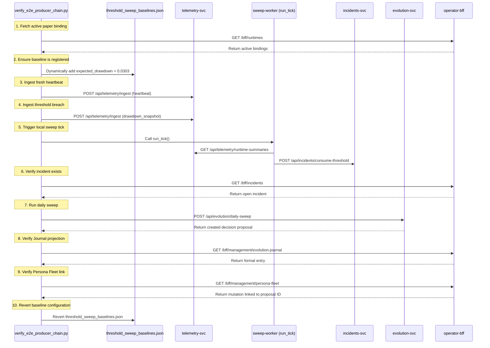

# EVOCHAIN-010: Producer-Chain Live Verifier

## Objective
The `verify_e2e_producer_chain.py` verifier validates the end-to-end integration of the threshold evaluation and evolution decision pipeline. It simulates a performance degradation incident, sweeps it into an evolution proposal, and verifies that the resulting proposal is correctly projected into both the Evolution Journal and the Persona Fleet.

## Architecture



## Trace Stages and Verifications

The verifier executes the following steps in sequence, failing fast with detailed diagnostics if any step encounters a contract or functional violation:

1. **Active Binding Resolution**: Fetches all active paper runtime bindings from the BFF `/bff/runtimes` endpoint, dynamically filtering out any targets that are currently blocked by active evolution proposals to prevent cooldown interference.
2. **Baseline Configuration Registration**: Dynamically writes a baseline `expected_drawdown` threshold of `0.0303` to `services/evolution/config/threshold_sweep_baselines.json` for the selected binding's artifact to guarantee a predictable breach ratio.
3. **Heartbeat Ingestion**: Ingests a telemetry heartbeat event to ensure the runtime summary projection in `RuntimeSummaryProjectionStore` is active, fresh, and not marked as stale.
4. **Breach Telemetry Ingestion**: Ingests a `drawdown_snapshot` telemetry event carrying a `drawdown_pct` value of `0.05`. (Ratio of `0.05 / 0.0303 = 1.65`, which exceeds the configured governance limit of `1.25`).
5. **Threshold Sweep Worker Execution**: Invokes the sweep worker's `run_tick` logic locally using internal HTTP endpoints of the telemetry and incident services. This evaluates the runtime summary against baseline metrics and registers an open threshold incident.
6. **Incident Assertion**: Queries the BFF `/bff/incidents` endpoint to verify that an open drawdown incident has been successfully registered with the correct binding ID.
7. **Daily Sweep Proposal Generation**: Calls the evolution service `POST /api/evolution/daily-sweep` endpoint to sweep the newly created incident, creating a new `EvolutionDecision` proposal.
8. **Evolution Journal Assertion**: Verifies that the created decision has been projected as a formal entry in `/bff/management/evolution-journal` matching the persona ID of the binding.
9. **Persona Fleet Mutation Wire-up Assertion**: Verifies that `/bff/management/persona-fleet` contains a corresponding entry showing the persona's `last_mutation_kind` as `"formal_mutation"` and linking directly to the new `decision_id` as its mutation reference.
10. **Cleanup**: Restores the original content of `threshold_sweep_baselines.json` to keep the repository's workspace clean and prevent git-dirty states.

## Commands

Run the verifier directly:
```bash
BFF_BASE=http://localhost:18001 BFF_TOKEN=op-dev:admin:mfa python3 scripts/verify_e2e_producer_chain.py
```

Run as part of the full verifier suite:
```bash
BFF_BASE=http://localhost:18001 BFF_TOKEN=op-dev:admin:mfa ./scripts/run_e2e_verifiers.sh
```

## References
* Script implementation: [verify_e2e_producer_chain.py](file:///tmp/pantheon-worker-worktrees/pantheon/evochain-010/scripts/verify_e2e_producer_chain.py)
* Integration suite: [run_e2e_verifiers.sh](file:///tmp/pantheon-worker-worktrees/pantheon/evochain-010/scripts/run_e2e_verifiers.sh)
