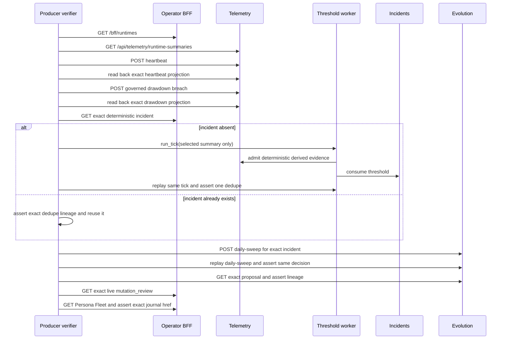

# EVOCHAIN-010: Producer-Chain Live Verifier

## Objective

`scripts/verify_e2e_producer_chain.py` tests the mutating producer verb on a
dev paper runtime:

1. inject a fresh heartbeat and a governed threshold breach;
2. prove the exact deduped `IncidentCase` appeared;
3. sweep that incident into one governed proposal;
4. prove a live formal `mutation_review` journal entry exists; and
5. prove Persona Fleet's latest formal MUTATION links to that entry.

Every failure is emitted as `FAIL [stage_name]: ...`, so the suite can identify
the broken segment without inferring it from a generic non-zero exit.

## Mutating-Probe Safety Contract

This is not a read-only health probe. It requires both:

- `ALLOW_MUTATING_E2E=1`; and
- an explicit `EVOCHAIN_VERIFY_RUNTIME_ID` naming the dev/disposable paper
  runtime to exercise.

The verifier never writes `threshold_sweep_baselines.json`. It only selects a
runtime whose current telemetry summary resolves to an artifact with an
already-governed positive baseline. Missing baseline, missing canonical
identity, stale projection, or unsupported threshold policy fails closed.

One exact incident and one exact decision are durable acceptance evidence and
are intentionally not deleted. Reruns reuse those records. Fresh heartbeat and
drawdown telemetry observations are still admitted on each invocation because
the probe is testing the live write path.

`scripts/run_e2e_verifiers.sh` includes the verifier but skips it unless the
mutating opt-in is present. This keeps the default aggregate command read-only.

## Stable Target and Dedupe Identity

The target does not rotate when a proposal exists. Selection is pinned by
`EVOCHAIN_VERIFY_RUNTIME_ID` and joins:

- BFF `/bff/runtimes` for active paper runtime and persona identity;
- telemetry `/api/telemetry/runtime-summaries` for the canonical binding,
  artifact, plan, pool, and persona-capital-binding identity; and
- the live threshold/baseline configuration for a governed breach value.

For the enabled drawdown-ratio policy, the injected raw drawdown is derived
from the actual baseline and threshold. No fixed `0.05 / 0.0303` assumption is
used.

The expected producer identity mirrors the implementation contract exactly:

```text
window = <configured-window>:<UTC-day>
dedupe_key = JSON([binding_id, metric_name, window])
telemetry_event_id = UUIDv5(NAMESPACE_URL, dedupe_key)
incident_id = "inc-threshold-" + UUIDv5(
  NAMESPACE_URL,
  telemetry_event_id + ":" + metric_name
).hex[:12]
```

The incident assertion requires all of the following, rather than matching an
arbitrary open drawdown incident:

- exact `incident_id`, binding, runtime, artifact, deployment plan, and
  persona-capital binding;
- exact deterministic producer event in `telemetry_event_ids`; and
- exact `dedupe_key=...` marker in `evidence_summary`.

## Chain and Replay Assertions



The worker receives only the selected canonical summary. Its verifier WAL is
durable at `${EVOCHAIN_VERIFY_STATE_PATH}` or, by default,
`/tmp/pantheon/evolution/evochain_010_verifier_state.json`; it is not deleted
after a partial delivery. On a new incident, the verifier immediately repeats
the tick and requires `created/deduped -> deduped` with zero second creation.

The daily sweep is also called twice. The first response may be `created` or
`existing`, but the second must be `existing` with the same `decision_id`.
`cooldown_blocked`, a wrong first item, or an unrelated target is a distinct
`proposal_sweep` failure.

The exact proposal readback must link the incident, artifact/version, threshold
window, incident evidence ref, and producer telemetry evidence ref. The journal
assertion requires one exact `entry_type=mutation_review`, exact `source_id`,
and `origin=live`; substring matches and decision-only rows do not pass.
Persona Fleet must expose `last_mutation_kind=formal_mutation`, formal
confidence, both decision IDs, and an `evolution_href` whose `persona` and
`mutation_review` query values match exactly.

## Failure Stages

The main stage labels are:

- `mutation_opt_in` / `configuration`
- `baseline_policy` / `binding_resolution`
- `heartbeat_ingest` / `heartbeat_readback`
- `breach_ingest` / `breach_readback`
- `threshold_sweep` / `threshold_sweep_replay`
- `incident_dedupe`
- `proposal_sweep` / `proposal_sweep_replay`
- `formal_journal`
- `persona_fleet`

## Commands

Offline decision-logic regression tests:

```bash
python3 -m pytest -q scripts/test_verify_e2e_producer_chain.py
```

Direct live run from the dev VM (the three service ports default to the values
shown):

```bash
ALLOW_MUTATING_E2E=1 \
EVOCHAIN_VERIFY_RUNTIME_ID=runtime-tw-equity-paper \
BFF_BASE=http://localhost:18001 \
TELEMETRY_API_URL=http://localhost:18083 \
INCIDENTS_API_URL=http://localhost:18090 \
EVOLUTION_API_URL=http://localhost:18093 \
python3 scripts/verify_e2e_producer_chain.py
```

Aggregate suite with the mutating verifier enabled:

```bash
ALLOW_MUTATING_E2E=1 \
EVOCHAIN_VERIFY_RUNTIME_ID=runtime-tw-equity-paper \
BFF_BASE=http://localhost:18001 \
scripts/run_e2e_verifiers.sh
```

Without `ALLOW_MUTATING_E2E=1`, the aggregate suite reports the producer-chain
entry as an explicit opt-in skip and continues with the read-only verifiers.

## References

- [Verifier](../../../../scripts/verify_e2e_producer_chain.py)
- [Offline tests](../../../../scripts/test_verify_e2e_producer_chain.py)
- [Aggregate runner](../../../../scripts/run_e2e_verifiers.sh)
- [Threshold producer contract](EVOCHAIN-001-threshold-breach-producer.md)
