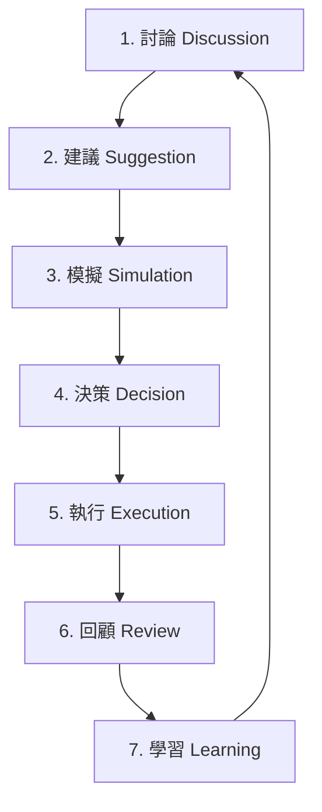

# EVOLOOP-010: Conversation-Plane Proposal Intake & Discussion-Loop Spec

Status: approved specification & design record
Task-ID: EVOLOOP-010
Owner: Antigravity
Reviewer: Claude

---

## 1. Overview & Context

In the Pantheon multi-persona automated trading system, decisions regarding algorithm mutation, persona policy revisions, and capital rebalancing originate from different conversation surfaces (the **Conversation Plane**). 

This specification formalizes the **Seven-Stage Discussion Loop** (討論 → 建議 → 模擬 → 決策 → 執行 → 回顧 → 學習) and defines a unified, surface-agnostic intake contract that maps any sponsor-approved outcomes into formal governance proposals (`EvolutionDecisionProposal` or `ApprovalDecisionProposal`), which are then dispatched to the downstream evolution and approval governance layers.

```text
  +--------------------------------------------------------+
  |                   CONVERSATION PLANE                   |
  |  [Consultation Committee] [Agora Workshop] [Persona]   |
  +---------------------------+----------------------------+
                              | (Sponsor Approved)
                              v
             +----------------------------------+
             | Surface-Agnostic Intake Contract |
             +----------------+-----------------+
                              |
                              v
              +---------------+---------------+
              |   Sponsor Decision Bridge     |
              +---------------+---------------+
                              |
                              v
             +----------------+-----------------+
             |        GOVERNANCE BACKBONE       |
             | [Evolution] [Approval] Services  |
             +----------------------------------+
```

---

## 2. The Seven-Stage Discussion Loop Spec

The OODA-loop governance of Pantheon is structured into a durable seven-stage loop. This ensures that autonomous agent reflections and committee deliberations lead to safe, trace-backed, and verified mutations in production.



### Stage 1: 討論 (Discussion)
- **Action**: Multiple personas, operators, and committees converse on specific telemetry incidents, performance gaps, or market shifts.
- **Surfaces**:
  1. **Management Console Persona Chat**: Direct 1-on-1 or multi-agent messaging inside the control room.
  2. **Agora Workshops**: Structured, topic-specific dynamic workshop sessions where personas debate proposals.
  3. **Consultation Committee**: Formal committee/red-team requests generated automatically or manually to review high-risk changes.

### Stage 2: 建議 (Suggestion)
- **Action**: Deliberations converge on a concrete proposal. Once a designated Sponsor Persona signs off, the suggestion is packaged via the `SponsorDecisionBridge` into a formal proposal structure (`EvolutionDecisionProposal` or `ApprovalDecisionProposal`).
- **Boundary**: Output state is `proposed`. No mutations or state changes have been executed on the target assets.

### Stage 3: 模擬 (Simulation)
- **Action**: Downstream verification engines or research-worker-gateways perform dry-runs, check validation rules, evaluate backtests, and sweep threshold bounds.
- **Boundary**: Output reports are linked back to the proposal as metadata.

### Stage 4: 決策 (Decision)
- **Action**: The proposal goes through the formal Governance/Evolution service lifecycle (`review` → `approved` / `rejected`). Authorized roles review the evidence, check write-authority matrices, and record final consensus.
- **Boundary**: Output state becomes `approved` or `rejected`.

### Stage 5: 執行 (Execution)
- **Action**: Gated dispatch workers pick up approved decisions. In the case of evolution, `dispatch_worker.py` submits a training session or optimization run to the research plane, registers a new strategy artifact v2, and promotes it to the LEAN runtime binding.
- **Boundary**: Target state in production/paper is mutated.

### Stage 6: 回顧 (Review)
- **Action**: Performance telemetry tracking (rolling PnL, drawdowns) monitors the mutated artifact. If a threshold breach occurs, an Incident Case is opened, triggering a postmortem analysis.
- **Boundary**: Incident case and postmortem artifacts are linked to the decision ID for absolute lineage.

### Stage 7: 學習 (Learning)
- **Action**: The postmortem findings and decision outcomes are written back into the persona's long-term memory (OpenClaw SOUL) and system baseline configurations.
- **Boundary**: Future discussions (Stage 1) cite these learnings, preventing repetitive regressions.

---

## 3. Surface-Agnostic Proposal Intake Contract

Regardless of which conversation surface initiates a proposal, the data structure mapped to the governance plane must adhere to the **Sponsor Decision Bridge** input contract.

### Required Ingest Fields

| Field | Type | Description |
|---|---|---|
| `decision_id` | `str` | Unique sponsor decision ID used for deterministic proposal mapping. |
| `type` | `str` | `"approval"` or `"evolution"`. |
| `sponsor_persona_id` | `str` | Persona ID of the sponsor certifying the proposal. |
| `target_type` | `str` | The target resource (e.g., `"strategy_spec"`, `"model_artifact"`, `"allocation_policy"`). |
| `target_id` | `str` | Identity of the target asset. |
| `target_version` | `str` | Snapshot or version of the target asset. |
| `sponsor_decision` | `str` | `"approved"`, `"conditional"`, or `"rejected"`. |

### Optional / Conditional Ingest Fields
- `action_type`: Canonical evolution action (e.g., `"retrain"`, `"freeze"`, `"retire"`) — required if `type="evolution"`.
- `target_stage`: Expected stage (e.g., `"paper"`, `"canary"`, `"live"`) — required if `action_type="freeze"`.
- `evidence_refs`: Array of evidence logs, committee memos, or manual tickets.
- `threshold_snapshots`: Snapshot metrics triggering this decision.
- `linked_incident_id` / `linked_postmortem_id`: Context links for issue-driven actions.

---

## 4. Adapters & Extension Points

To maintain decoupling, conversation plane inputs are piped through specialized adapters to interface with the central `bridge()` function.

### A. Consultation Committee Adapter (Completed in EVOLOOP-010)
- **Trigger**: An operator/service invokes `POST /api/consult/committees/{committee_id}/sponsor-decision`.
- **Implementation**:
  - Automatically queries the linked `ConsultRequest` and all published `ConsultMemo` files.
  - Transforms the database record into the unified `SponsorDecision` bridge payload.
  - Formats memo and handoff records as first-class `committee_memo` and `service_handoff` evidence references.
  - Passes the payload to `bridge()` to obtain the proposal object.
  - Performs a secure HTTP POST dispatch to either `/api/governance/approvals` or `/api/evolution/proposals`.
  - Captures the dispatch status (`sent` or `failed`) and stores it durably in the request metadata and response.

### B. Agora Workshop Adapter (Future Extension Point)
- **Anchor Path**: `services/control-plane/bff/command_executor.py` or a dedicated Agora microservice.
- **Mechanism**:
  - Upon dynamic workshop consensus, the workshop coordinator persona triggers a workshop signoff event.
  - The adapter serializes the workshop debate thread and decision metrics.
  - Call `bridge()` with `type="evolution"` and `action_type` based on consensus.
  - POST to `/api/evolution/proposals`.

### C. Persona Chat Adapter (Future Extension Point)
- **Anchor Path**: `services/openclaw-gateway-adapter/`
- **Mechanism**:
  - A direct chat recommendation by a portfolio manager persona is confirmed by the operator.
  - OpenClaw gateway converts the structured recommendation payload into the intake contract format.
  - Call `bridge()` with `type="approval"` to propose strategy mutations.
  - POST to `/api/governance/approvals`.

---

## 5. Division of Labor (EVOLOOP-010 vs LOOP-PROD-CONS-001)

- **EVOLOOP-010 (This Task)**:
  - Owns the **Intake and Routing Edge**: ensuring any sponsor decision recorded on the consultation plane successfully bridges to the governance/evolution plane, validating schema requirements, and implementing the HTTP dispatch caller.
  - Integrates the bridge into `record_committee_sponsor_decision` and verifies the E2E API dispatch path.
- **LOOP-PROD-CONS-001 (Downstream)**:
  - Owns the **Executor Integrity**: refining the backend committee workflow runtime execution details, ensuring true agent responses in simulated environments, and validating that the target-plane state matches the expected metadata.
