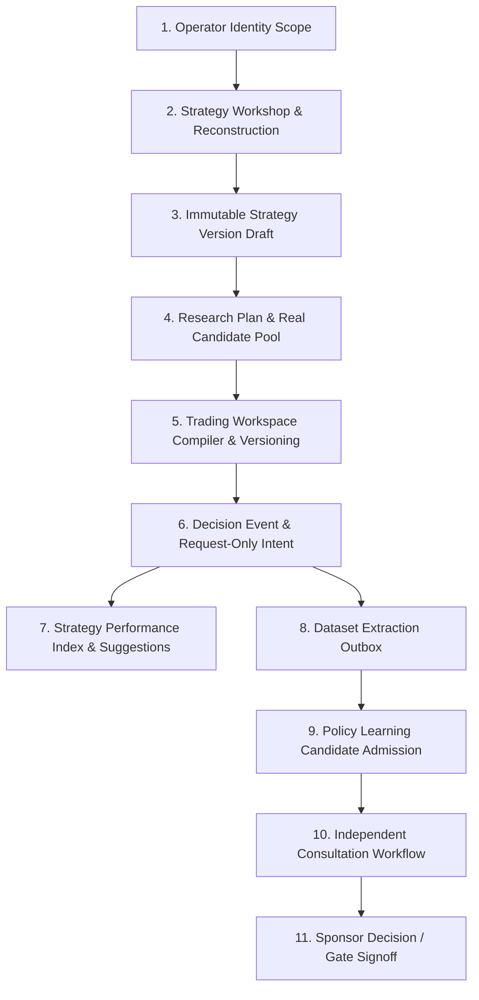

# Agora Product Journey End-to-End Audit Log

- **Task**: `AGORA-BE-INTEGRATION-20260813`
- **Audit Trace**: `trace-agora-audit-20260813`
- **Execution Mode**: `In-Process & Service-Bound Integration`

---

## 1. Identity & Scope Resolution
- **Route**: `GET /bff/agora/me`, `GET /bff/agora/capabilities`
- **Input Identity**: `sub="user-alpha-trader-01"`, `tenant_id="tenant-alpha"`, `roles=["operator", "agora:write", "agora:read"]`
- **Result Scope**: `scope_id="agora-scope-62a265636fd4805e"`, `tenant_id="tenant-alpha"`, `user_id="user-alpha-trader-01"`
- **Governance Invariant**: Requested tenant overrides outside caller allowed tenant set fail closed with 403.

## 2. Strategy Workshop & Reconstruction
- **Route**: `POST /bff/agora/workshops`, `POST /bff/agora/workshops/{id}/messages`
- **Session**: `workshop_id="ws-verify-01"`, `status="open"`
- **Event Stream**: Appended `user_message` with CAS `lock_version` check.
- **Reconstruction Output**: `reconstruction_id="rec-ws-verify-01-1"`, `completeness_grade="draftable"` or `"researchable"`, deterministic next best question generated.

## 3. Strategy Version Draft & Selection
- **Link Action**: `ensure_current_version_link` with SHA-256 spec digest.
- **Immutable Pointer**: `workshop_version_id="wsv-legacy-..."`, `sequence_no=1`, `status="selected"`.
- **Governance Invariant**: Write-once SHA-256 digest binding prevents retroactive spec alteration.

## 4. Research Plan & Real Candidate Pool
- **Plan Lifecycle**: Proposed $\rightarrow$ Approved by tenant user $\rightarrow$ Executed by leased runner.
- **Run Artifact**: Checksum-verified artifact reference (`pantheon://artifacts/research/...`).
- **Candidate Pool**: `source_mode="real"`, candidate linked to `run_id` with verified score.
- **Governance Invariant**: Rejects synthetic candidate fixtures in production/canary mode.

## 5. Trading Workspace Compiler & Atomicity
- **Compiler**: `WorkspaceIntent` compiled into typed views (`candidate_ranking`, `decision_queue`, `risk_monitor`).
- **Transaction**: Atomic creation of workspace with `dashboardVersion=1` and version record `trdv_...`.

## 6. Decision Event & Request-Only TradingIntent
- **Event**: `event_kind="entry"`, `no_order_route_proof="agora_decision_support_only"`.
- **Trader Decision**: Approved with rationale and actor identity.
- **Intent**: `has_broker_order_authority=False`, `no_order_route_proof="agora_intent_record_only"`.
- **Governance Invariant**: Zero broker execution or capital order authority exists in Agora BFF.

## 7. Strategy Performance Index & Governed Suggestions
- **Ledger**: SQLite-backed `PerformanceSuggestionStore`.
- **Suggestion**: Source-owned provenance (`gov-perf-v2.1`), `status="proposed"`.
- **Action**: Applied with CAS `expected_version=1` and idempotency key.

## 8. Dataset Extraction Outbox
- **Model**: `AgoraInteractionEvidenceRequest` with `consent_granted=True` and `learning_eligible=True`.
- **Admit-Only**: Added atomically to inbox without inline worker execution.
- **Handoff**: Produces immutable `DatasetVersion` record.

## 9. Policy Learning Candidate Admission
- **State**: Admitted in `status="proposed"`.
- **Lease**: Claimed exclusively by worker for `lease_seconds=30`.
- **Processing**: Offline model evaluation and artifact checksum recording before settlement.

## 10. Independent Consultation Workflow
- **Intake**: Submitted-only (`status="submitted"`).
- **Evaluator**: Independent reviewer persona ($\text{evaluator\_id} \ne \text{producer\_id}$).
- **Memo**: Published with evaluated confidence and findings.
- **Sponsor Decision**: Separate governance decision write.
