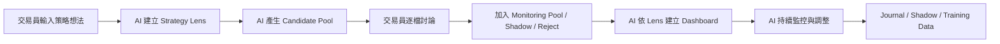

# Pathreon Agora — Claude Design UI Requirement V2

> 文件目的：交付 Claude Design 產出 Agora 前端 UI 設計稿。
> 版本：V2 / Strategy-Lens + Personalized Trading Desk 版
> 日期：2026-05-20
> 範圍：只設計 Agora，不設計 Pathreon Management。
> 重要原則：Agora 是交易員的個人 AI 交易桌，不是 Management 後台，也不是散戶聊天工具。

---

## 0. 一句話定位

Agora 是給高階交易員、股票大戶、分析師使用的 **個人 AI 交易桌**。

它的核心不是功能頁，而是三個交易員每天真正在用的工作區：

```text
1. 盯盤 Radar
2. 策略 Lab
3. 部位 Cockpit
```

所有 AI 問答、Shadow Book、Journal、Replay、Train My AI、Expert Review、Dashboard Personalization，都必須圍繞這三個工作區運作。

---

## 1. 產品基準與禁止事項

### 1.1 Agora 使用者是誰

Agora 的使用者是：

```text
高階交易員
主觀操盤者
股票大戶
研究型分析師
策略型投資人
```

他們不是散戶，不會只問「今天某股票怎麼看」。他們常見的操作是：

```text
我有一個交易假說，請完整拆產業、同族群、相對漲幅、籌碼、分點、風險。

我覺得某一批股票因某個產業原因可能會漲，請找出相似但還沒漲的股票。

請追蹤某檔股票最近是否有特定分點連續買進，並檢查同券商或關聯分點是否在其他股票出貨。

我現在持有某檔，請檢查原本 thesis 是否還成立，有沒有該減碼或換股的訊號。
```

### 1.2 Agora 使用者不能看到的東西

Agora 不能出現下列詞彙或概念：

```text
Pathreon Management
Management
central governance
runtime binding
capital binding
artifact_state
deployment_stage
operator gate
risk-owner gate
BFF
registry
broker live
human gate
```

對使用者應呈現為：

```text
Request Review
Safety Check
Paper Test
Expert Review
Strategy Validation
Simulation
Shadow Tracking
```

### 1.3 Agora 不提供的能力

Agora 不做：

```text
真實下單
live deploy
capital binding
runtime 操作
broker credential 操作
其他使用者資料瀏覽
Management queue 顯示
```

Agora 做：

```text
研究任務
盯盤監控
策略假說拆解
候選股篩選
影子模式
部位複盤
個人化 dashboard
AI 人格訓練
```

---

## 2. 最終資訊架構

Agora 不是多頁 app，而是一張交易桌。

```text
Agora
└── My AI Trading Desk
    ├── 盯盤 Radar
    ├── 策略 Lab
    └── 部位 Cockpit

橫切工具：
  - AI Command Bar
  - Shadow Book
  - Journal / Replay
  - Train My AI
  - Persona Progress
  - Expert Review
  - Dashboard Personalization
```

### 2.1 主頁路由

```text
/agora
```

### 2.2 主要 UI 結構

```text
┌───────────────────────────────────────────────────────────────┐
│ AI Command Bar                                                 │
│ 「輸入盯盤任務、交易假說、部位問題或研究需求...」                 │
├───────────────────────────────────────────────────────────────┤
│ [盯盤 Radar] [策略 Lab] [部位 Cockpit]                           │
├───────────────┬───────────────────────────────┬───────────────┤
│ 左側清單       │ 中央策略化 Dashboard           │ 右側 AI Drawer │
│ Lens / Pool    │ Candidate / Monitoring / Chart │ 解讀/證據/操作 │
└───────────────┴───────────────────────────────┴───────────────┘
```

---

## 3. 核心概念：Strategy Lens

### 3.1 定義

交易員不是盯單一股票，而是用某個策略視角盯一批股票。

`Strategy Lens` 是交易員看市場的一套策略框架，例如：

```text
籌碼大戶部位建立
分點連續吸貨
AI server 供應鏈落後補漲
事件交易
技術突破
財報預期差
大額資金可承接量
族群輪動
均值回歸
```

每個 Strategy Lens 決定：

```text
AI 要找哪些股票
候選股怎麼排序
要看哪些資料
哪些訊號算有效
哪些訊號是風險
dashboard 要出現哪些 widget
警示條件是什麼
哪些股票應剔除
哪些股票應進 Shadow
```

### 3.2 Strategy Lens 工作流



---

## 4. 主頁籤一：盯盤 Radar

### 4.1 目的

盯盤 Radar 不是普通 watchlist，而是 **Strategy Lens 驅動的候選池與監控池**。

### 4.2 頁面結構

```text
┌──────────────────────────────────────────────────────────────┐
│ AI Command Bar                                                │
├──────────────────────────────────────────────────────────────┤
│ Strategy Lens Tabs                                            │
│ [籌碼大戶部位建立] [AI server 落後補漲] [技術突破] [+ 新 Lens]  │
├───────────────┬──────────────────────────────┬───────────────┤
│ Lens Sidebar  │ Candidate / Monitoring Board │ AI Review     │
│               │                              │ Drawer        │
│ 候選池 38      │ Rank / Symbol / Score / Risk │ 為什麼選它     │
│ 待討論 12      │                              │ 疑慮           │
│ 監控中 9       │                              │ 下一步         │
│ Shadow 中 4    │                              │ Evidence       │
│ 已剔除 13      │                              │ Actions        │
└───────────────┴──────────────────────────────┴───────────────┘
```

### 4.3 Lens Sidebar

每個 Lens 顯示：

```text
Lens name
Lens thesis
候選池數量
待討論數量
監控中數量
Shadow 中數量
已剔除數量
最新 AI 更新時間
是否有高風險提醒
```

### 4.4 Candidate Pool Board

同一個 Lens 下有內部狀態頁籤：

```text
[候選池] [待討論] [監控中] [Shadow] [已剔除] [Parked]
```

欄位依 Lens 不同而不同。以「籌碼大戶部位建立」為例：

```text
Rank
Symbol
Company
AI 選出理由
籌碼分數
連續買超天數
買盤集中度
價格位置
流動性
出貨風險
關聯分點風險
AI Confidence
Status
Action
```

### 4.5 Candidate Row Actions

每列要有：

```text
Discuss
加入監控池
需要更多研究
送 Shadow
剔除
暫放 Parking Lot
```

### 4.6 Candidate Review Drawer

點 `Discuss` 後開右側 drawer。

Drawer 必須包含：

```text
股票名稱 / Symbol
AI 為什麼選它
核心證據
主要疑慮
AI 建議
交易員可以做的決定
```

範例：

```text
AI 為什麼選 8086：
- 最近 10 日分點淨買集中
- 買盤不是追高，而是在區間內吸收
- 同族群已有 3 檔先漲
- 此檔相對漲幅仍落後
- 流動性足夠

AI 疑慮：
- 同券商另一分點在同族群某檔賣超
- 今日量增但價格未有效突破
- 若明日跌破 XX，thesis 弱化

AI 建議：
- 加入監控池
- 設定分點買盤是否延續為主要條件
- 先觀察 2 日，不急著進 Shadow
```

Actions：

```text
加入監控池
送 Shadow
需要更深入研究
剔除
暫放 Parking Lot
問 AI 反方論點
寫入我的規則
```

### 4.7 刪除不是刪除

使用者按「剔除」時，資料不可真的刪掉。狀態設為 `rejected`，並保留原因。

此資料用於：

```text
negative examples
preference data
candidate ranking correction
strategy lens adjustment
```

---

## 5. Strategy Lens Dashboard 差異

同樣是盯盤，不同 Lens 要有不同 dashboard。

### 5.1 Lens：籌碼大戶部位建立

Panels：

```text
Candidate Ranking
Branch Accumulation Heatmap
Consecutive Net Buy Days
Price vs Branch Accumulation
Related Branch Sell Risk
Liquidity / Capacity
Sector Rotation
Distribution Warning
AI Watch Conditions
```

### 5.2 Lens：產業落後補漲

Panels：

```text
Industry Position Map
Peer Universe
Relative Return Gap
Catalyst Coverage
News / Revenue / Event Signals
Chip Support
Liquidity Filter
Laggard Candidate Ranking
Counter-thesis
```

### 5.3 Lens：技術突破

Panels：

```text
Breakout Level
Volume Confirmation
ATR / Volatility
False Breakout Risk
Support / Stop Level
Historical Setup Similarity
Entry Timing
Invalid Condition
```

### 5.4 Lens：大戶部位建立 / 流動性

Panels：

```text
Average Daily Value
Capacity Estimate
Volume Participation
Slippage Estimate
Entry Schedule Simulation
Market Impact Risk
Detection Risk
Alternative Names
```

---

## 6. 主頁籤二：策略 Lab

### 6.1 目的

策略 Lab 是交易員把模糊交易想法轉成研究任務的地方。

### 6.2 頁面結構

```text
策略 Lab
├── 進行中
├── 已完成
├── Shadow 中
├── 已轉成盯盤
└── 已歸檔
```

### 6.3 Mission Card

每張 Mission card 顯示：

```text
Mission title
Mission type
Seed symbols
Thesis
Status
AI progress
Candidates found
Needs user decision?
Last update
```

### 6.4 Mission Detail

```text
1. User Thesis
2. AI Mission Plan
3. Research Progress
4. Evidence Board
5. Candidate Results
6. Risk / Counter Thesis
7. Suggested Actions
8. Shadow Tracking
9. Journal
```

### 6.5 Mission Types

```text
industry_peer_laggard
broker_branch_flow
event_research
multi_stock_comparison
chip_technical_confirmation
position_review
counter_thesis
liquidity_execution_study
sector_rotation
earnings_revision
```

### 6.6 專業輸入範例

請在 UI placeholder / examples 中使用這類，而不是散戶式問題：

```text
我覺得 ABC 這些股票因為 AI server 供應鏈可能會漲，幫我找出同產業還沒反應的標的，並排序。
```

```text
幫我追蹤 8086 最近 10 天是否有特定分點連續買進，並檢查同券商其他分點是否在同族群出貨。
```

```text
幫我比較 A/B/C 三檔誰比較像主升段前的籌碼結構。
```

### 6.7 Candidate Table for Industry Laggard

```text
Rank
Symbol
Company
Industry Role
Similarity Score
Price Lag Score
Catalyst Relevance
Liquidity
Chip Support
Recent Return
Why Similar
Why Not Moved Yet
Confirm Signal
Risk
Action
```

### 6.8 Branch Flow Mission Dashboard

```text
Top Net Buyers / Sellers
Branch Accumulation Timeline
Price vs Branch Net Buy
Related Branch Cross Flow
Same Broker Other Stock Flow
Sector Rotation View
Potential Distribution Signals
AI Interpretation
Watch Conditions
```

---

## 7. 主頁籤三：部位 Cockpit

### 7.1 目的

部位 Cockpit 監控目前持倉，檢查原始 thesis 是否仍成立。

### 7.2 主畫面

內部 sub-tabs：

```text
全部部位
需要注意
Thesis 弱化
風險升高
Shadow 替代方案
已平倉 / 歷史
```

### 7.3 主表欄位

```text
Symbol
Position Size
Avg Cost
Current Price
PnL
Drawdown
Holding Days
Original Thesis
Thesis Status
AI Current Read
Risk Level
Next Action
```

### 7.4 Thesis Status

```text
intact
improved
weakening
invalidated
needs_review
```

### 7.5 Position Detail

```text
1. 原始 Thesis
2. 目前發生什麼變化
3. PnL / Drawdown
4. 產業 / 同族群
5. 籌碼 / 分點
6. 技術狀態
7. 新聞 / 事件
8. Invalidation Checklist
9. AI Scenarios
10. Shadow Alternative
11. Journal / Replay
```

### 7.6 部位按 Strategy Lens 分組

部位可依策略分組：

```text
By Strategy Lens
  - 籌碼大戶部位建立
      - 8086
      - 3227
  - AI server 落後補漲
      - ABC
      - DEF

By Risk
  - Thesis weakening
  - High drawdown
  - Needs review
```

---

## 8. AI Command Bar

### 8.1 全域位置

所有主頁籤上方都有同一個 AI Command Bar。它必須知道目前 context：

```text
目前在哪個頁籤
目前選的是哪個 Strategy Lens
目前選的是哪檔股票 / mission / position
```

### 8.2 Placeholder by Tab

Radar：

```text
輸入你想建立的盯盤策略，例如：找可能有大戶建立部位的股票...
```

Strategy Lab：

```text
輸入交易假說，例如：我覺得 ABC 因為 AI server 需求可能會漲，幫我找落後補漲股...
```

Position Cockpit：

```text
輸入部位問題，例如：幫我檢查 XYZ 原本 thesis 是否還成立...
```

### 8.3 Quick Actions

Radar：

```text
新增盯盤
分點檢查
找同族群
設定異常提醒
```

Strategy Lab：

```text
產業落後補漲
分點籌碼研究
事件交易
多標的比較
反方論點
```

Position Cockpit：

```text
檢查 thesis
檢查風險
找替代標的
建立減碼計畫
送 Shadow
```

---

## 9. Agent-generated Dashboard / Widget

### 9.1 核心要求

AI 可以為每個 Strategy Lens 產生新的 dashboard widget 或 chart，但不能直接產生任意 React/JS code。

AI 只能產生：

```text
WidgetSpec
ChartSpec
DashboardRecipe
```

前端用安全 renderer 渲染。

### 9.2 Widget 能力等級

```text
Level 1：重組既有 widget
Level 2：用既有 template 產生新 widget instance
Level 3：產生受控 ChartSpec
Level 4：提出新 WidgetPluginProposal，由開發審查後實作
```

### 9.3 Widget Registry

前端必須有 WidgetRegistry：

```ts
WidgetRegistryEntry = {
  widgetType: string;
  displayName: string;
  description: string;
  allowedDataSources: string[];
  requiredFields: string[];
  optionalFields: string[];
  supportedEncodings: string[];
  allowedInteractions: string[];
  riskLevel: "low" | "medium" | "high";
  renderer: "builtin" | "chart_grammar" | "plugin";
}
```

### 9.4 Example widgets

```text
分點 × 日期 Heatmap
Same Broker Cross-Branch Network
Similarity × Price Lag Scatter
Thesis Decay Gauge
Shadow Outcome Matrix
Workflow Bottleneck Map
```

### 9.5 Widget Spec Validator

AI 產生的 widget 要驗證：

```text
widgetType exists
dataSource allowed
fields exist
aggregation allowed
dataSensitivity allowed
interaction allowed
no raw prompt
no cross-user data
no live order action
```

---

## 10. Personalization System

### 10.1 核心要求

每個交易員看到的 Agora 必須不同。

個人化層級：

```text
Trader Profile Personalization
Strategy Lens Personalization
Workspace Phase Personalization
Widget / Chart Personalization
```

### 10.2 Dashboard Recipe

每個 dashboard 是 recipe 驅動，不是硬寫固定畫面。

```ts
DashboardRecipe = {
  id: string;
  userId: string;
  strategyLensId?: string;
  workspace: "radar" | "strategy_lab" | "position_cockpit" | "shadow_book" | "journal_replay";
  phase: "candidate_generation" | "candidate_discussion" | "monitoring" | "position_monitoring" | "post_trade_review" | "training";
  layout: object;
  widgets: AgentGeneratedWidgetSpec[];
  generatedBy: "system_default" | "ai_agent" | "user_customized" | "learned_from_feedback";
  changeReason: string;
  version: number;
  previousVersionId?: string;
  status: "active" | "draft" | "archived" | "rolled_back";
}
```

### 10.3 WidgetPreference

```ts
WidgetPreference = {
  id: string;
  userId: string;
  strategyLensId?: string;
  widgetType: string;
  preference:
    | "pinned"
    | "hidden"
    | "moved_up"
    | "moved_down"
    | "very_useful"
    | "not_useful"
    | "needs_more_detail"
    | "too_noisy";
  reason?: string;
  source: "explicit_user_feedback" | "implicit_usage" | "ai_inferred" | "system_default";
  confidence: number;
}
```

### 10.4 Dashboard Change Log

每個 dashboard 右上角要有：

```text
Dashboard Changes
```

顯示：

```text
AI 最近調整了什麼
為什麼調整
依據哪些行為
是否改善結果
可否回滾
```

例子：

```text
AI 把「出貨風險」移到第一排。
原因：你最近 5 次候選討論中，有 3 次因關聯分點賣超剔除標的。
```

操作：

```text
Accept
Undo
Never do this again
Tell AI why
```

---

## 11. Shadow Book / Journal / Training as cross-cutting tools

### 11.1 Shadow Book

每個 WatchTarget / StrategyMission / Position 都可以送 Shadow。

ShadowRecord 要記錄：

```text
來源：盯盤 / 策略 / 部位
AI 建議
人類決策
實際結果
AI shadow 結果
誰比較好
learning note
```

### 11.2 Journal / Replay

每個流程自動生成 journal draft。

```text
盯盤 note
mission report
position review
shadow result
AI correction
```

### 11.3 Train My AI

使用者可以在任何 context 糾正 AI：

```text
這不是我的風格
我通常不追這種突破
這種分點買法我不信
下次你要先檢查流動性
```

---

## 12. Core Data Models

### 12.1 StrategyLens

```ts
type StrategyLens = {
  id: string;
  userId: string;
  personaId: string;
  name: string;
  thesis: string;
  lensType:
    | "large_holder_position_building"
    | "broker_branch_accumulation"
    | "industry_peer_laggard"
    | "sector_rotation"
    | "technical_breakout"
    | "event_trade"
    | "earnings_revision"
    | "liquidity_execution"
    | "mean_reversion"
    | "pair_trade"
    | "custom";
  status: "draft" | "candidate_generating" | "reviewing" | "monitoring" | "paused" | "archived";
};
```

### 12.2 CandidateStock

```ts
type CandidateStock = {
  id: string;
  strategyLensId: string;
  symbol: string;
  companyName: string;
  aiReason: string;
  scores: Record<string, number>;
  riskNotes: string[];
  evidenceRefs: string[];
  status:
    | "new"
    | "needs_discussion"
    | "approved_for_monitoring"
    | "needs_more_research"
    | "shadowing"
    | "rejected"
    | "parked"
    | "archived";
};
```

### 12.3 CandidateDiscussion

```ts
type CandidateDiscussion = {
  id: string;
  candidateId: string;
  strategyLensId: string;
  userFeedback:
    | "approve_monitoring"
    | "reject"
    | "park"
    | "need_more_research"
    | "send_shadow"
    | "modify_condition";
  userReason: string;
  aiInterpretation: string;
  resultingChange:
    | "added_to_monitoring_pool"
    | "rejected"
    | "parked"
    | "research_task_created"
    | "alert_rule_modified"
    | "strategy_lens_updated";
};
```

### 12.4 PositionMonitor

```ts
type PositionMonitor = {
  id: string;
  symbol: string;
  positionSize: number;
  averageCost: number;
  currentPrice: number;
  pnlPct: number;
  maxDrawdownPct: number;
  holdingDays: number;
  originalThesis: string;
  thesisStatus: "intact" | "improved" | "weakening" | "invalidated" | "needs_review";
  aiCurrentRead: string;
  riskLevel: "low" | "medium" | "high" | "critical";
};
```

---

## 13. BFF Endpoint Requirements

Phase 1 可以 mock，但 contract 要先固定。

```text
GET  /bff/agora/trading-desk
GET  /bff/agora/strategy-lenses
POST /bff/agora/strategy-lenses
GET  /bff/agora/strategy-lenses/:id
PATCH /bff/agora/strategy-lenses/:id

POST /bff/agora/strategy-lenses/:id/generate-candidates
GET  /bff/agora/strategy-lenses/:id/candidates
POST /bff/agora/candidates/:id/discuss
POST /bff/agora/candidates/:id/monitor
POST /bff/agora/candidates/:id/reject
POST /bff/agora/candidates/:id/shadow

GET  /bff/agora/strategy-lenses/:id/dashboard-recipe
POST /bff/agora/strategy-lenses/:id/dashboard-recipe/propose
POST /bff/agora/dashboard-recipes/:id/accept
POST /bff/agora/dashboard-recipes/:id/rollback
POST /bff/agora/widgets/:id/feedback

GET  /bff/agora/positions
GET  /bff/agora/positions/:id
POST /bff/agora/positions/:id/review
POST /bff/agora/positions/:id/shadow

GET  /bff/agora/shadow-book
GET  /bff/agora/journal
POST /bff/agora/training-corrections
```

所有 response 只回目前 user scope。

---

## 14. UI Phases for Design / Implementation

### Phase A：Trading Desk Shell

要做：

```text
一頁三頁籤
AI Command Bar
Radar / Strategy Lab / Position Cockpit 基本版
```

### Phase B：Strategy Lens + Candidate Pool

要做：

```text
Lens tabs
Candidate Pool
Candidate Review Drawer
Monitoring Pool
Rejected / Parked 狀態
```

### Phase C：Dynamic Dashboard + Widgets

要做：

```text
DashboardRecipeRenderer
WidgetRegistry
WidgetRenderer
ChartSpecRenderer
Widget feedback controls
```

### Phase D：Personalization

要做：

```text
Dashboard Change Log
WidgetPreference
PersonalizationEvents
Dashboard versioning / rollback
```

### Phase E：Shadow / Journal / Training

要做：

```text
ShadowBook integration
Journal draft
TrainingCorrection
Persona progress
```

---

## 15. Claude Design Deliverables

Claude Design 請產出以下高保真畫面：

1. Agora Trading Desk — three-tab shell
2. Radar tab — strategy lens sidebar + candidate pool
3. Radar candidate review drawer
4. Radar lens dashboard — branch accumulation strategy
5. Radar lens dashboard — industry peer laggard strategy
6. Strategy Lab — mission list
7. Strategy Lab — industry peer laggard mission detail
8. Strategy Lab — broker branch flow mission detail
9. Position Cockpit — position overview grouped by strategy lens
10. Position detail — thesis status and review
11. Dashboard Change Log modal
12. Widget feedback menu
13. Dashboard Switcher
14. Shadow Book summary for one Strategy Lens
15. Journal / Replay drawer connected to a candidate/position
16. Train My AI correction drawer

---

## 16. Do / Do Not Do

### Do

```text
Use tabs, not many disconnected pages.
Make strategy lens the center of Radar.
Show candidate pool as batch, not one stock.
Let user discuss each candidate with AI.
Keep rejected candidates as learning data.
Make dashboard dynamic per strategy lens.
Show why AI generated each widget.
Allow user to pin/hide/reorder widgets.
Record personalization events.
Make Shadow / Journal / Training cross-cutting.
Use professional trader examples.
```

### Do Not

```text
Do not design retail stock Q&A.
Do not make watchlist a flat list.
Do not hardcode one dashboard for all users.
Do not expose Management / governance / runtime terms.
Do not let AI inject arbitrary code.
Do not delete rejected candidates.
Do not make Shadow Book isolated from Radar/Strategy/Position.
Do not make Trainer a separate settings-only experience.
```

---

## 17. Final Acceptance Checklist

Design is accepted only if:

```text
Agora is one trading desk with 3 main tabs.
Radar is strategy-lens driven.
Candidate pool supports batch review.
Candidate review drawer exists.
Monitoring pool differs by strategy lens.
Strategy Lab creates missions from professional trading hypotheses.
Position Cockpit monitors thesis validity.
Agent-generated widgets use safe WidgetSpec / ChartSpec.
Dashboard personalization is visible and reversible.
Widget preferences are recorded.
Shadow Book connects to candidate/mission/position.
Journal/Replay connects to the full decision chain.
Train My AI can be invoked contextually.
No Management/internal terms appear in Agora UI.
Every rejected / accepted / edited candidate becomes training data.
```

---

## 18. Final Product Statement

Agora 是交易員的一張 AI 交易桌。

它不是一堆功能頁，也不是散戶聊天工具。它的核心是：

```text
盯盤 Radar：根據策略 lens 管理一批候選與監控標的。
策略 Lab：把高階交易假說轉成研究任務與候選池。
部位 Cockpit：持續檢查持倉 thesis 是否成立。
```

AI 會根據每個交易員、每個策略 lens、每個工作階段，生成不同 dashboard、不同 widget、不同監控邏輯。交易員調整它，AI 記住它，並用 Shadow / Journal / Training 產生高價值訓練資料。

