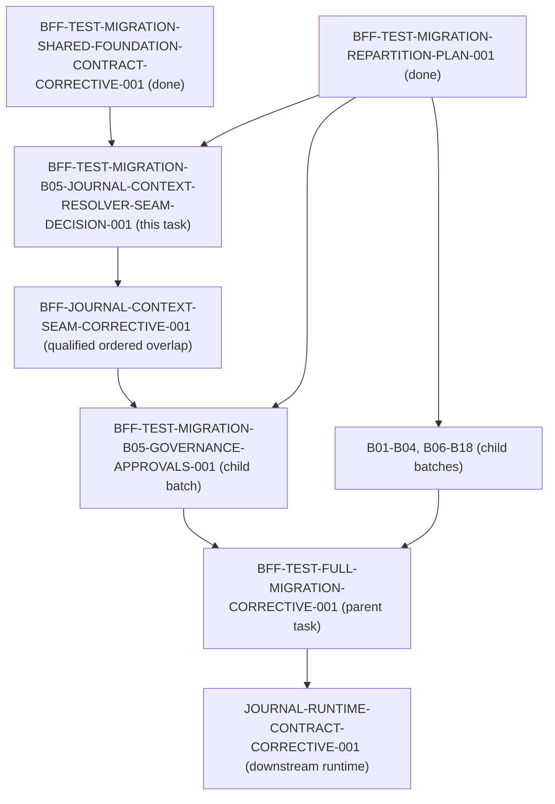

# BFF Test Migration B05 Journal Context-Resolver Seam Decision

Status: canonical architectural decision for batch B05 and journal context resolution  
Task ID: `BFF-TEST-MIGRATION-B05-JOURNAL-CONTEXT-RESOLVER-SEAM-DECISION-001`  
Owner: Antigravity2  
Reviewer: Codex  
Base Commit: `d85a7117c10e25d34625ef9b0978c31f5be68bb7` (origin/dev)  
Related Tasks:
- `BFF-TEST-MIGRATION-REPARTITION-PLAN-001` (predecessor plan, done)
- `BFF-TEST-MIGRATION-SHARED-FOUNDATION-CONTRACT-CORRECTIVE-001` (predecessor fixture correction, done)
- `BFF-TEST-MIGRATION-B05-GOVERNANCE-APPROVALS-001` (blocked child batch)
- `BFF-TEST-FULL-MIGRATION-CORRECTIVE-001` (parent test migration task)
- `JOURNAL-RUNTIME-CONTRACT-CORRECTIVE-001` (downstream journal runtime task)
- `BFF-RESEARCH-COMPOSITION-SEAM-CORRECTIVE-001` (precedent qualified ordered overlap task for B09)

---

## 1. Executive Summary & Problem Context

In the 18-batch BFF test migration repartition (`BFF-TEST-MIGRATION-REPARTITION-PLAN-001`), batch **B05** (`BFF-TEST-MIGRATION-B05-GOVERNANCE-APPROVALS-001`) was assigned seven governance test and support files:
1. `services/control-plane/bff/governance/test_decision_journal_write_owner.py`
2. `services/control-plane/bff/test_bff_approvals_decide_contract.py`
3. `services/control-plane/bff/test_bff_promotion_review_governance.py`
4. `services/control-plane/bff/test_governance_command_submission.py`
5. `services/control-plane/bff/test_pkt004_deployment_approval_drilldowns_contract.py`
6. `services/control-plane/bff/tests/test_bff_approvals_surface_contract.py`
7. `services/control-plane/bff/tests/test_bff_governance_subrules_contract.py`

During initial execution of B05 (PR #5746, anchor commit `5f26c3c9`), Codex identified an architectural seam blocker in `services/control-plane/bff/governance/test_decision_journal_write_owner.py`:
- Test method `test_main_bff_journal_context_ref_resolution_parity` (lines 1650–1694) directly imports `_resolve_agora_interaction_context_ref` from `services.control_plane.bff.main` and monkeypatches `services.control_plane.bff.main.read_store` and `services.control_plane.bff.main._extract_identity`.
- This test was introduced during corrective task `JOURNAL-CONSUMER-ISOLATION-CORRECTIVE-001` (commit `2b54973f3`) to verify parity between `AgoraService` canonical scope resolution and the BFF composition-root interaction context reference resolver when resolving `kind="journal_entry"`.
- Under the architectural invariants enforced by `services/control-plane/bff/tests/test_bff_test_architecture.py` (`BFF-TEST-ARCH-001`):
  1. Migrated suites must **not** import `main` composition root (`test_migrated_suites_do_not_import_main`).
  2. Migrated suites must **not** monkeypatch global `read_store` (`test_no_global_monkeypatching_in_migrated_suites`).

### The Seam Dilemma
B05's declared artifact contract covers strictly the seven test files above. B05 possesses **no grant** on production code (`main.py`, `dependencies.py`, or `agora/`). Therefore, B05 cannot extract or decouple `_resolve_agora_interaction_context_ref` locally within its own task boundary.

Furthermore, B05 cannot simply wait for or depend on the downstream task `JOURNAL-RUNTIME-CONTRACT-CORRECTIVE-001`, because that task is serialized **after** the parent test migration task `BFF-TEST-FULL-MIGRATION-CORRECTIVE-001`. Introducing a dependency edge from B05 to `JOURNAL-RUNTIME-CONTRACT-CORRECTIVE-001` creates an unresolvable cycle:
$$\text{B05} \longrightarrow \text{JOURNAL-RUNTIME-CONTRACT-CORRECTIVE-001} \longrightarrow \text{BFF-TEST-FULL-MIGRATION-CORRECTIVE-001} \longrightarrow \text{B05}$$

This document resolves this blocker by establishing the canonical upstream injectable seam and detailing the qualified ordered overlap execution sequence.

---

## 2. Deep Analysis of the Current Implementation

### 2.1 The Resolver in `main.py`
In `services/control-plane/bff/main.py` (lines 22289–22449), `_resolve_agora_interaction_context_ref` is defined at the top level of the composition root:
```python
def _resolve_agora_interaction_context_ref(
    *,
    kind: str,
    ref_id: str,
    ref_version: Optional[str],
    resolved: Any,
    session: Dict[str, Any],
    context_refs: List[Dict[str, Any]],
    authorization: Optional[str],
    source_route: Optional[str],
    focused_object: Dict[str, Any],
) -> Dict[str, Any]:
```
When `kind == "journal_entry"` (lines 22348–22441):
1. It attempts to load trade journal episodes from `PANTHEON_BFF_TRADE_EPISODES_STORE` via `trade_journal._load`.
2. If no episode matches, it falls through to the Decision Journal:
   - Resolves canonical Agora scope via `resolve_canonical_agora_scope(identity, tenant_id, user_id)`.
   - Queries `read_store.list_decision_journal_entries(...)`.
   - Filters private records via `_agora_filter_private_records(...)`.
   - Locates the matching entry by `id` or `entry_id`.
   - Returns `{"row": journal, "audience_verified": False}`.

Notice that this implementation accesses several module-level globals in `main.py`:
- `read_store` (the global read surface store)
- `_extract_identity`
- `_require_read_role`
- `_bff_error`
- `_get_persona_directory_snapshot`
- `_persona_record_tenant_id`
- `_agora_filter_private_records`

At line 22639, `main.py` passes this function into the Agora router factory:
```python
_agora_router = create_agora_router(
    ...
    canonical_context_ref_resolver=_resolve_agora_interaction_context_ref,
    ...
)
```

### 2.2 The Test in `test_decision_journal_write_owner.py`
In `services/control-plane/bff/governance/test_decision_journal_write_owner.py:1650-1694`:
```python
def test_main_bff_journal_context_ref_resolution_parity(self) -> None:
    from unittest.mock import patch
    from services.control_plane.bff.agora.identity.scope import resolve_agora_user_scope
    from services.control_plane.bff.main import _resolve_agora_interaction_context_ref

    with tempfile.TemporaryDirectory() as tmp:
        with patch.dict(os.environ, {}, clear=True):
            stores = build_decision_journal_stores(tmp)
            reader = DomainDecisionJournalReaderPort(data_dir=tmp)

            identity = OperatorIdentity(
                operator_id="alice",
                roles=["operator"],
                mfa_verified=True,
                claims={"tid": "tenant-a", "sub": "alice"},
            )
            scope = resolve_agora_user_scope(identity, utc_now=lambda: "2026-09-08T00:00:00Z")

            create_entry(
                stores,
                entry_id="ctx-ref-1",
                ...
            )

            with patch("services.control_plane.bff.main.read_store", reader):
                with patch("services.control_plane.bff.main._extract_identity", return_value=identity):
                    ref_res = _resolve_agora_interaction_context_ref(
                        kind="journal_entry",
                        ref_id="ctx-ref-1",
                        ...
                    )
                    self.assertIsNotNone(ref_res["row"])
                    self.assertEqual(ref_res["row"]["id"], "ctx-ref-1")
```

### 2.3 Findings of the AST & Inventory Audit
1. **Isolated Leak**: In `test_decision_journal_write_owner.py` (38 test methods total), exactly **one** test method (`test_main_bff_journal_context_ref_resolution_parity`) imports `services.control_plane.bff.main`. All other 37 tests exercise the domain write owner, reader port, and adapter directly without composition imports.
2. **Global Patching**: The test patches `services.control_plane.bff.main.read_store` and `services.control_plane.bff.main._extract_identity`.
3. **Architectural Role**: The test validates that the interaction context resolver adheres to canonical Agora tenant/user scoping rules when retrieving decision journal entries. This regression protection must be preserved; it cannot simply be deleted or replaced with an unverified test double.

---

## 3. Evaluation of Candidate Seam Architectures

We evaluate three candidate approaches for resolving this seam:

| Evaluation Dimension | Candidate 1: Upstream Seam Extraction via Qualified Ordered Overlap (`BFF-JOURNAL-CONTEXT-SEAM-CORRECTIVE-001`) | Candidate 2: Test Relocation to Existing Allowlist Suite (`test_read_surface_caller_migration.py`) | Candidate 3: In-Batch Router Mock Injection in B05 |
|---|---|---|---|
| **Root Cause Fix** | **High**: Extracts monolithic resolver into modular domain port/module with explicit dependency injection. | **Medium**: Moves test out of B05 to allowlist; `main.py` remains monolithic. | **Low**: Merely stubs the callback in tests; production seam remains unchanged. |
| **Regression Preservation** | **Full**: Preserves exact end-to-end scoping assertions against the real resolver logic. | **Full**: Test continues to run against `main.py` in allowlisted composition suite. | **None / Fake**: Replaces real resolution with test mock; drops regression guarantee. |
| **Dependency Graph Impact** | **Strictly Acyclic**: Upstream task precedes B05; downstream tasks remain serialized after parent. | **Requires Grant Amendment**: B05 cannot write `test_read_surface_caller_migration.py` without contract change. | **No DAG Change**: Contained in B05, but violates test fidelity. |
| **Architectural Gate Compliance** | **100% Compliant**: B05 eliminates `main` import; `test_bff_test_architecture.py` passes. | **100% Compliant**: `test_decision_journal_write_owner.py` becomes 100% decoupled. | **Fails Quality Gate**: Replaces audited behavior with mock. |
| **Precedence & Governance** | **Identical to B09 Precedent**: Matches `BFF-RESEARCH-COMPOSITION-SEAM-CORRECTIVE-001`. | **Ad-hoc**: Moves test across domain boundaries. | **Anti-pattern**: Avoids real decoupling. |

### Decision
**Candidate 1 is selected.**  
Extracting the interaction context resolver into an upstream, injectable module via a qualified ordered overlap task (`BFF-JOURNAL-CONTEXT-SEAM-CORRECTIVE-001`) eliminates the monolithic global-dependent code in `main.py`, provides clean dependency injection, allows B05 to migrate without importing `main.py`, and maintains a strictly acyclic task graph.

---

## 4. Target Seam Specification

### 4.1 Modular Seam Location & Signature
The resolver logic will be extracted to:
`services/control-plane/bff/agora/interaction/context_resolver.py`

#### Interface Contract
```python
"""Agora interaction context reference resolver.

Decoupled from composition root globals. Accepts explicit read_store,
identity extractors, and role verifiers.
"""
from __future__ import annotations

import json
from pathlib import Path
from typing import Any, Callable, Dict, List, Optional
from urllib.parse import parse_qs, unquote, urlsplit

from jsonschema import Draft7Validator


def resolve_agora_interaction_context_ref(
    *,
    kind: str,
    ref_id: str,
    ref_version: Optional[str] = None,
    resolved: Any,
    session: Dict[str, Any],
    context_refs: List[Dict[str, Any]],
    authorization: Optional[str] = None,
    source_route: Optional[str] = None,
    focused_object: Optional[Dict[str, Any]] = None,
    # Injected dependencies:
    read_store: Optional[Any] = None,
    extract_identity: Optional[Callable[[Optional[str]], Any]] = None,
    require_read_role: Optional[Callable[[Any], None]] = None,
    bff_error: Optional[Callable[..., Exception]] = None,
    trade_journal_store_name: str = "PANTHEON_BFF_TRADE_EPISODES_STORE",
    persona_directory_snapshot_fn: Optional[Callable[[str], Any]] = None,
) -> Dict[str, Any]:
    """Resolve context refs with audience verification and fail-closed tenant isolation.

    Pure domain/service function with zero direct reliance on bff.main module globals.
    """
    if focused_object is None:
        focused_object = {}

    identity = extract_identity(authorization) if callable(extract_identity) else None
    if callable(require_read_role):
        require_read_role(identity)

    # 1. Unavailable sources
    if kind in {"position", "performance_window", "human_inbox_item"}:
        if callable(bff_error):
            raise bff_error(
                503,
                "DEPENDENCY_UNAVAILABLE",
                f"Canonical {kind} interaction scope is unavailable",
                f"{kind} does not yet expose a tenant-and-user-scoped ownership receipt",
                precondition_failed=f"{kind}_scope_unavailable",
            )
        raise RuntimeError(f"Canonical {kind} interaction scope is unavailable")

    # 2. Decision Event
    if kind == "decision_event":
        from ..trading_room.router import _get_store as _get_trading_room_store
        event = _get_trading_room_store().get_decision_event(ref_id)
        if not isinstance(event, dict):
            return {"row": None, "audience_verified": False}
        event_strategy = str(event.get("strategy_id") or "")
        event_version = str(event.get("strategy_spec_registry_id") or "")
        scoped_strategy = str(session.get("strategy_id") or "")
        scoped_version = str(session.get("active_strategy_spec_registry_id") or "")
        audience_verified = bool(
            event_strategy
            and event_strategy == scoped_strategy
            and (not event_version or event_version == scoped_version)
        )
        return {"row": event, "audience_verified": audience_verified}

    # 3. Journal Entry (Trade Journal Episode or Governance Decision Journal)
    if kind == "journal_entry":
        from services.control_plane.bff.trade_journal import _allowed as _trade_journal_allowed
        from services.control_plane.bff.trade_journal import _load as _load_trade_journal

        episodes = _load_trade_journal(trade_journal_store_name)
        matches = [
            row for row in (episodes or [])
            if str(row.get("trade_episode_id") or "") == ref_id
        ]
        if len(matches) == 1:
            episode = matches[0]
            # Validate trade episode projection schema
            schema_path = (
                Path(__file__).resolve().parents[3]
                / "telemetry"
                / "trade_episode_projection.schema.json"
            )
            try:
                projection_schema = json.loads(schema_path.read_text(encoding="utf-8"))
                projection_valid = Draft7Validator(projection_schema).is_valid(episode)
            except (OSError, TypeError, ValueError):
                projection_valid = False

            # Audience and scope verification
            persona_id = str(episode.get("persona_id") or "")
            referenced_personas = {
                str(item.get("id") or "")
                for item in context_refs
                if item.get("kind") == "persona"
            }
            persona = None
            if callable(persona_directory_snapshot_fn):
                snapshot = persona_directory_snapshot_fn(str(resolved.tenant_id or "").strip())
                persona = getattr(snapshot, "records_by_id", {}).get(persona_id)

            source = urlsplit(str(source_route or ""))
            source_path = unquote(source.path).rstrip("/")
            source_query = parse_qs(source.query, keep_blank_values=True)
            focused_is_episode = (
                focused_object.get("kind") == "journal_entry"
                and str(focused_object.get("id") or "") == ref_id
            )
            canonical_persona_journal_route = bool(
                source_path == f"/management/personas/{persona_id}"
                and source_query.get("tab") == ["tradeJournal"]
                and not source.fragment
            )
            canonical_workshop_route = bool(
                not focused_is_episode
                and source_path == f"/agora/strategy-workshop/{session.get('workshop_id')}"
                and not source.fragment
            )
            audience_verified = bool(
                projection_valid
                and persona_id
                and episode.get("strategy_id")
                and episode.get("strategy_id") == session.get("strategy_id")
                and (canonical_persona_journal_route or canonical_workshop_route)
            )
            return {"row": episode, "audience_verified": audience_verified}

        # Fallback to Decision Journal in Governance domain
        from ..identity.scope import resolve_canonical_agora_scope
        from ..service import AgoraService

        scoped_tenant, scoped_user = resolve_canonical_agora_scope(
            identity,
            tenant_id=getattr(resolved, "tenant_id", None),
            user_id=getattr(resolved, "user_id", None),
        )
        if read_store is None:
            return {"row": None, "audience_verified": False}

        try:
            journal_entries = read_store.list_decision_journal_entries(
                tenant_id=scoped_tenant, user_id=scoped_user
            )
        except TypeError:
            journal_entries = read_store.list_decision_journal_entries()

        # Scope filtering using AgoraService helper or standard filter
        journal_rows = [
            r for r in journal_entries
            if AgoraService._private_record_visible(r, identity, tenant_id=scoped_tenant, user_id=scoped_user)
        ]
        journal = next(
            (row for row in journal_rows if str(row.get("id") or row.get("entry_id") or "") == ref_id),
            None,
        )
        return {"row": journal, "audience_verified": False}

    if callable(bff_error):
        raise bff_error(
            503,
            "DEPENDENCY_UNAVAILABLE",
            f"Canonical {kind} readback is unavailable",
            f"{kind}_store_unavailable",
            precondition_failed=f"{kind}_store_unavailable",
        )
    raise RuntimeError(f"Canonical {kind} readback is unavailable")
```

### 4.2 Composition Root Binding in `main.py`
In `main.py`, `_resolve_agora_interaction_context_ref` delegates directly to the new seam:
```python
from .agora.interaction.context_resolver import resolve_agora_interaction_context_ref

def _resolve_agora_interaction_context_ref(*args, **kwargs):
    return resolve_agora_interaction_context_ref(
        *args,
        read_store=read_store,
        extract_identity=_extract_identity,
        require_read_role=_require_read_role,
        bff_error=_bff_error,
        persona_directory_snapshot_fn=_get_persona_directory_snapshot,
        **kwargs,
    )
```

### 4.3 Decoupled Test Invocation in `test_decision_journal_write_owner.py`
In B05's test suite, the test method is updated to call the seam directly with explicit arguments:
```python
def test_main_bff_journal_context_ref_resolution_parity(self) -> None:
    from services.control_plane.bff.agora.identity.scope import resolve_agora_user_scope
    from services.control_plane.bff.agora.interaction.context_resolver import (
        resolve_agora_interaction_context_ref,
    )

    with tempfile.TemporaryDirectory() as tmp:
        with patch.dict(os.environ, {}, clear=True):
            stores = build_decision_journal_stores(tmp)
            reader = DomainDecisionJournalReaderPort(data_dir=tmp)

            identity = OperatorIdentity(
                operator_id="alice",
                roles=["operator"],
                mfa_verified=True,
                claims={"tid": "tenant-a", "sub": "alice"},
            )
            scope = resolve_agora_user_scope(identity, utc_now=lambda: "2026-09-08T00:00:00Z")

            create_entry(
                stores,
                entry_id="ctx-ref-1",
                title="Context Ref Entry",
                body="Context body",
                actor_id="alice",
                tenant_id="tenant-a",
                user_id="alice",
                created_at="2026-09-08T00:00:00Z",
            )

            ref_res = resolve_agora_interaction_context_ref(
                kind="journal_entry",
                ref_id="ctx-ref-1",
                ref_version=None,
                resolved=scope,
                session={"workshop_id": "ws-1"},
                context_refs=[],
                authorization="Bearer token",
                source_route="/agora/workshop",
                focused_object={"kind": "other", "id": "other-1"},
                read_store=reader,
                extract_identity=lambda auth: identity,
                require_read_role=lambda ident: None,
            )
            self.assertIsNotNone(ref_res["row"])
            self.assertEqual(ref_res["row"]["id"], "ctx-ref-1")
```
**Benefits**:
- Zero imports of `main` or `bff_main`.
- Zero monkeypatching of global `read_store`.
- Exact test parity and full regression coverage maintained.
- `test_bff_test_architecture.py` validates `test_decision_journal_write_owner.py` as fully compliant (`DECOUPLED` / `MIGRATED`).

---

## 5. Governance Sequence & DAG Acyclicity Proof

### 5.1 Topological Proof of Acyclicity
The dependency graph between tasks is strictly a Directed Acyclic Graph (DAG):



- Every directed edge goes strictly from left to right / upstream to downstream.
- There are no back-edges:
  - `JOURNAL-RUNTIME-CONTRACT-CORRECTIVE-001` depends on `PARENT`.
  - `PARENT` depends on `B05`.
  - `B05` depends on `CORRECTIVE`.
  - `CORRECTIVE` depends on `DECISION` and `PLAN`.
  - Neither `CORRECTIVE` nor `B05` depends on `JOURNAL-RUNTIME-CONTRACT-CORRECTIVE-001`.
- Cycle check:
  $$\text{Cycles} = \emptyset$$

### 5.2 Qualified Ordered Overlap Protocol for Seam Task
Like `BFF-RESEARCH-COMPOSITION-SEAM-CORRECTIVE-001` (for B09), the new task `BFF-JOURNAL-CONTEXT-SEAM-CORRECTIVE-001`:
1. **Artifact Grants**:
   - `services/control-plane/bff/agora/interaction/context_resolver.py` (new source)
   - `services/control-plane/bff/main.py` (extraction & composition root delegation)
   - `services/control-plane/bff/governance/test_decision_journal_write_owner.py` (decouple parity test)
   - `docs/deployment/evidence/BFF-JOURNAL-CONTEXT-SEAM-CORRECTIVE-001/evidence.json`
2. **Exclusivity**: It is the sole pre-parent writer of these source files while B05 remains blocked.
3. **Execution**:
   - Implements the new context resolver module.
   - Updates `main.py` composition root.
   - Updates `test_decision_journal_write_owner.py` to use explicit dependency injection.
   - Validates that all 38 tests pass and `test_decision_journal_write_owner.py` contains 0 `main` imports.
   - PR merges to `dev`.

### 5.3 Human/Ops Step-by-Step Runbook

#### Step 1: Complete and Merge this Decision Task
- Deliver and merge PR for `task/BFF-TEST-MIGRATION-B05-JOURNAL-CONTEXT-RESOLVER-SEAM-DECISION-001`.

#### Step 2: Materialize `BFF-JOURNAL-CONTEXT-SEAM-CORRECTIVE-001`
- Operator assistant (`codex-chatbox`) issues signed `DevTaskPacket` materializing `BFF-JOURNAL-CONTEXT-SEAM-CORRECTIVE-001` into `.orchestrator/assistant-dev-packets/`.
- Supervisor admits the task into canonical `ai-status.json`.

#### Step 3: Implement & Merge `BFF-JOURNAL-CONTEXT-SEAM-CORRECTIVE-001`
- Auto-worker executes the seam extraction, runs verification (`test_bff_test_architecture.py` 8 passed, `test_decision_journal_write_owner.py` 38 passed).
- Reviewer approves; PR auto-merges into `dev`.

#### Step 4: Update B05 Dependency Contract & Reopen B05
Human/Ops runs a fresh-CAS dependency update for B05 to depend on the corrective task:
```bash
python3 -c "
import json, os, hashlib
status_root = os.environ.get('PANTHEON_STATUS_ROOT', '.')
state = json.load(open(os.path.join(status_root, 'ai-status.json')))
task = next(t for t in state['tasks'] if t['id'] == 'BFF-TEST-MIGRATION-B05-GOVERNANCE-APPROVALS-001')
fresh_sha = hashlib.sha256(json.dumps(task, sort_keys=True, separators=(',', ':'), ensure_ascii=False).encode('utf-8')).hexdigest()
req = {
    'reason': 'Serialize B05 after upstream journal context-resolver seam task',
    'tasks': [{
        'task_id': 'BFF-TEST-MIGRATION-B05-GOVERNANCE-APPROVALS-001',
        'expected_sha256': fresh_sha,
        'depends_on': [
            'BFF-TEST-MIGRATION-REPARTITION-PLAN-001',
            'BFF-JOURNAL-CONTEXT-SEAM-CORRECTIVE-001'
        ]
    }]
}
open('/tmp/b05-dep-req.json', 'w').write(json.dumps(req, indent=2))
"
AI_NAME=Human/Ops "$PANTHEON_COMMAND_ROOT/scripts/ai-status.sh" dependency-contract /tmp/b05-dep-req.json
AI_NAME=Human/Ops "$PANTHEON_COMMAND_ROOT/scripts/ai-status.sh" reopen BFF-TEST-MIGRATION-B05-GOVERNANCE-APPROVALS-001 "Unblocked by upstream seam resolution"
```

#### Step 5: Complete Migration of B05
The assigned worker for B05:
1. Re-rebases onto `dev` (which contains the decoupled `test_decision_journal_write_owner.py`).
2. Migrates the remaining 6 test suites (fixes bare `command_queue` imports, removes `sys.path.insert`, switches to modular routers/ports).
3. Verifies all 7 suites collect and pass.
4. Finalizes and closes B05 via PR and review approval.

---

## 6. Verification and Local Proof Matrix

### 6.1 Baseline Verification Commands
```bash
# 1. Verify provisioned test environment
python3 scripts/dev/provision_python_distribution.py --dependency-python /home/chloe_ong_dev_cctech_support_com/code/pantheon/.venv/bin/python3

# 2. Verify architectural invariants gate
.venv-pantheon/bin/python3 -m pytest -q services/control-plane/bff/tests/test_bff_test_architecture.py
# Result: 8 passed in 2.04s

# 3. Verify current test_decision_journal_write_owner.py suite
.venv-pantheon/bin/python3 -m pytest -q services/control-plane/bff/governance/test_decision_journal_write_owner.py
# Result: 38 passed in 42.10s
```

### 6.2 Static AST Verification of B05 Sources
| File | Current `main` Importer | Seam Action Required | Post-Seam Disposition |
|---|:---:|---|---|
| `governance/test_decision_journal_write_owner.py` | Yes (line 1653) | Switch line 1653 to import extracted seam; pass explicit `reader` and `identity`. | `MIGRATED` |
| `test_bff_approvals_decide_contract.py` | Yes (line 20) | Replace bare `from command_queue` with fully qualified package import; migrate from `main` to `create_governance_router`. | `MIGRATED` |
| `test_bff_promotion_review_governance.py` | Yes (line 18) | Replace bare `from command_queue` with fully qualified package import; migrate from `main` to `create_governance_router`. | `MIGRATED` |
| `test_governance_command_submission.py` | Yes (line 16) | Replace bare `from command_queue` with fully qualified package import; migrate to command store / router. | `MIGRATED` |
| `test_pkt004_deployment_approval_drilldowns_contract.py` | Yes (line 11) | Migrate from `main` to `create_governance_router`. | `MIGRATED` |
| `tests/test_bff_approvals_surface_contract.py` | Yes (line 22) | Migrate from `main` to `create_governance_router`. | `MIGRATED` |
| `tests/test_bff_governance_subrules_contract.py` | Yes (line 25) | Migrate from `main` to `create_governance_router`. | `MIGRATED` |

### 6.3 Conclusion
This operational decision eliminates the B05 deadlock, prevents any dependency cycle with `JOURNAL-RUNTIME-CONTRACT-CORRECTIVE-001`, enforces clean dependency injection for interaction context resolution, and provides a clear, governed execution path for the remaining test migration batches.
