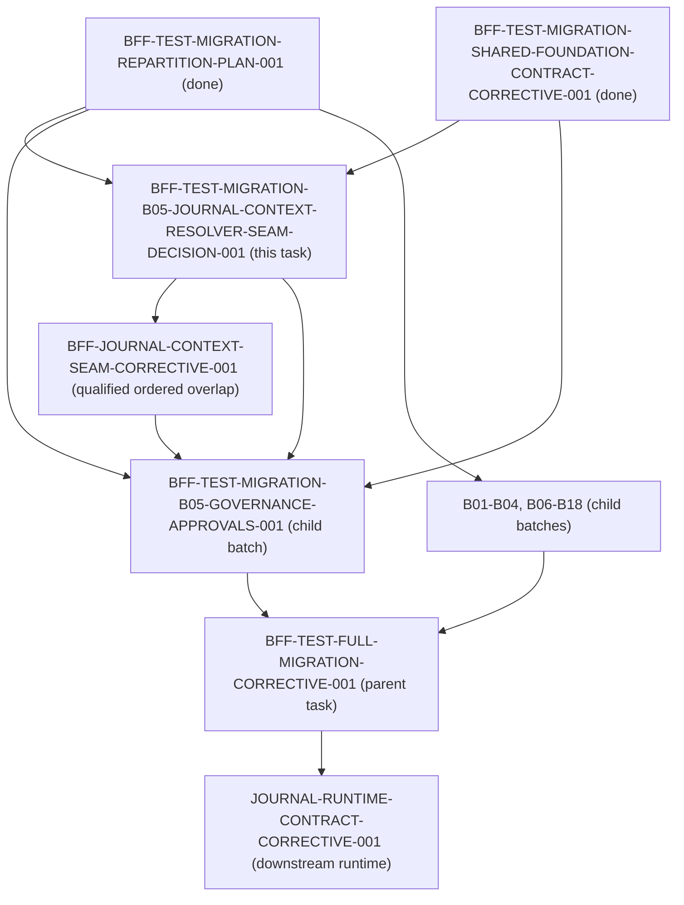

# BFF Test Migration B05 Journal Context-Resolver Seam Decision

Status: canonical architectural decision for batch B05 and journal context resolution  
Task ID: `BFF-TEST-MIGRATION-B05-JOURNAL-CONTEXT-RESOLVER-SEAM-DECISION-001`  
Owner: Antigravity2  
Reviewer: Codex  
Base Commit: `c99c090b405d95bff5fa0c426d249ea75ffcc9eb` (origin/dev)  
Related Tasks:
- `BFF-TEST-MIGRATION-REPARTITION-PLAN-001` (predecessor plan, done)
- `BFF-TEST-MIGRATION-SHARED-FOUNDATION-CONTRACT-CORRECTIVE-001` (predecessor fixture correction, done)
- `BFF-TEST-MIGRATION-B05-GOVERNANCE-APPROVALS-001` (blocked child batch)
- `BFF-TEST-FULL-MIGRATION-CORRECTIVE-001` (parent test migration task)
- `JOURNAL-RUNTIME-CONTRACT-CORRECTIVE-001` (downstream journal runtime task)
- `BFF-RESEARCH-COMPOSITION-SEAM-CORRECTIVE-001` (precedent qualified ordered overlap task for B09)

---

## 1. Executive Summary & Problem Context

In the 18-batch BFF test migration repartition (`BFF-TEST-MIGRATION-REPARTITION-PLAN-001`), batch **B05** (`BFF-TEST-MIGRATION-B05-GOVERNANCE-APPROVALS-001`) was assigned seven governance test and support files:
1. `services/control-plane/bff/governance/test_decision_journal_write_owner.py`
2. `services/control-plane/bff/test_bff_approvals_decide_contract.py`
3. `services/control-plane/bff/test_bff_promotion_review_governance.py`
4. `services/control-plane/bff/test_governance_command_submission.py`
5. `services/control-plane/bff/test_pkt004_deployment_approval_drilldowns_contract.py`
6. `services/control-plane/bff/tests/test_bff_approvals_surface_contract.py`
7. `services/control-plane/bff/tests/test_bff_governance_subrules_contract.py`

During initial execution of B05 (PR #5746, anchor commit `5f26c3c9`), Codex identified an architectural seam blocker in `services/control-plane/bff/governance/test_decision_journal_write_owner.py`:
- Test method `test_main_bff_journal_context_ref_resolution_parity` (lines 1650–1694) directly imports `_resolve_agora_interaction_context_ref` from `services.control_plane.bff.main` and monkeypatches `services.control_plane.bff.main.read_store` and `services.control_plane.bff.main._extract_identity`.
- This test was introduced during corrective task `JOURNAL-CONSUMER-ISOLATION-CORRECTIVE-001` (commit `2b54973f3`) to verify parity between `AgoraService` canonical scope resolution and the BFF composition-root interaction context reference resolver when resolving `kind="journal_entry"`.
- Under the architectural invariants enforced by `services/control-plane/bff/tests/test_bff_test_architecture.py` (`BFF-TEST-ARCH-001`):
  1. Migrated suites must **not** import `main` composition root (`test_migrated_suites_do_not_import_main`).
  2. Migrated suites must **not** monkeypatch global `read_store` (`test_no_global_monkeypatching_in_migrated_suites`).

### The Seam Dilemma
B05's declared artifact contract covers strictly the seven test files above. B05 possesses **no grant** on production code (`main.py`, `dependencies.py`, or `agora/`). Therefore, B05 cannot extract or decouple `_resolve_agora_interaction_context_ref` locally within its own task boundary.

Furthermore, B05 cannot simply wait for or depend on the downstream task `JOURNAL-RUNTIME-CONTRACT-CORRECTIVE-001`, because that task is serialized **after** the parent test migration task `BFF-TEST-FULL-MIGRATION-CORRECTIVE-001`. Introducing a dependency edge from B05 to `JOURNAL-RUNTIME-CONTRACT-CORRECTIVE-001` creates an unresolvable cycle:
$$\text{B05} \longrightarrow \text{JOURNAL-RUNTIME-CONTRACT-CORRECTIVE-001} \longrightarrow \text{BFF-TEST-FULL-MIGRATION-CORRECTIVE-001} \longrightarrow \text{B05}$$

This document resolves this blocker by establishing the canonical upstream injectable seam and detailing the qualified ordered overlap execution sequence.

---

## 2. Deep Analysis of the Current Implementation

### 2.1 The Resolver in `main.py`
In `services/control-plane/bff/main.py` (lines 22289–22449), `_resolve_agora_interaction_context_ref` is defined at the top level of the composition root:
```python
def _resolve_agora_interaction_context_ref(
    *,
    kind: str,
    ref_id: str,
    ref_version: Optional[str],
    resolved: Any,
    session: Dict[str, Any],
    context_refs: List[Dict[str, Any]],
    authorization: Optional[str],
    source_route: Optional[str],
    focused_object: Dict[str, Any],
) -> Dict[str, Any]:
```
When `kind == "journal_entry"` (lines 22348–22441):
1. It attempts to load trade journal episodes from `PANTHEON_BFF_TRADE_EPISODES_STORE` via `trade_journal._load`.
2. If no episode matches, it falls through to the Decision Journal:
   - Resolves canonical Agora scope via `resolve_canonical_agora_scope(identity, tenant_id, user_id)`.
   - Queries `read_store.list_decision_journal_entries(...)`.
   - Filters private records via `_agora_filter_private_records(...)`.
   - Locates the matching entry by `id` or `entry_id`.
   - Returns `{"row": journal, "audience_verified": False}`.

Notice that this implementation accesses several module-level globals in `main.py`:
- `read_store` (the global read surface store)
- `_extract_identity`
- `_require_read_role`
- `_bff_error`
- `_get_persona_directory_snapshot`
- `_persona_record_tenant_id`
- `_agora_filter_private_records`

At line 22639, `main.py` passes this function into the Agora router factory:
```python
_agora_router = create_agora_router(
    ...
    canonical_context_ref_resolver=_resolve_agora_interaction_context_ref,
    ...
)
```

### 2.2 The Test in `test_decision_journal_write_owner.py`
In `services/control-plane/bff/governance/test_decision_journal_write_owner.py:1650-1694`:
```python
def test_main_bff_journal_context_ref_resolution_parity(self) -> None:
    from unittest.mock import patch
    from services.control_plane.bff.agora.identity.scope import resolve_agora_user_scope
    from services.control_plane.bff.main import _resolve_agora_interaction_context_ref

    with tempfile.TemporaryDirectory() as tmp:
        with patch.dict(os.environ, {}, clear=True):
            stores = build_decision_journal_stores(tmp)
            reader = DomainDecisionJournalReaderPort(data_dir=tmp)

            identity = OperatorIdentity(
                operator_id="alice",
                roles=["operator"],
                mfa_verified=True,
                claims={"tid": "tenant-a", "sub": "alice"},
            )
            scope = resolve_agora_user_scope(identity, utc_now=lambda: "2026-09-08T00:00:00Z")

            create_entry(
                stores,
                entry_id="ctx-ref-1",
                ...
            )

            with patch("services.control_plane.bff.main.read_store", reader):
                with patch("services.control_plane.bff.main._extract_identity", return_value=identity):
                    ref_res = _resolve_agora_interaction_context_ref(
                        kind="journal_entry",
                        ref_id="ctx-ref-1",
                        ...
                    )
                    self.assertIsNotNone(ref_res["row"])
                    self.assertEqual(ref_res["row"]["id"], "ctx-ref-1")
```

### 2.3 Findings of the AST & Inventory Audit
1. **Isolated Leak**: In `test_decision_journal_write_owner.py` (38 test methods total), exactly **one** test method (`test_main_bff_journal_context_ref_resolution_parity`) imports `services.control_plane.bff.main`. All other 37 tests exercise the domain write owner, reader port, and adapter directly without composition imports.
2. **Global Patching**: The test patches `services.control_plane.bff.main.read_store` and `services.control_plane.bff.main._extract_identity`.
3. **Architectural Role**: The test validates that the interaction context resolver adheres to canonical Agora tenant/user scoping rules when retrieving decision journal entries. This regression protection must be preserved; it cannot simply be deleted or replaced with an unverified test double.

---

## 3. Evaluation of Candidate Seam Architectures

We evaluate three candidate approaches for resolving this seam:

| Evaluation Dimension | Candidate 1: Upstream Seam Extraction via Qualified Ordered Overlap (`BFF-JOURNAL-CONTEXT-SEAM-CORRECTIVE-001`) | Candidate 2: Test Relocation to Existing Allowlist Suite (`test_read_surface_caller_migration.py`) | Candidate 3: In-Batch Router Mock Injection in B05 |
|---|---|---|---|
| **Root Cause Fix** | **High**: Extracts monolithic resolver into modular domain port/module with explicit dependency injection. | **Medium**: Moves test out of B05 to allowlist; `main.py` remains monolithic. | **Low**: Merely stubs the callback in tests; production seam remains unchanged. |
| **Regression Preservation** | **Full**: Preserves exact end-to-end scoping assertions against the real resolver logic. | **Full**: Test continues to run against `main.py` in allowlisted composition suite. | **None / Fake**: Replaces real resolution with test mock; drops regression guarantee. |
| **Dependency Graph Impact** | **Strictly Acyclic**: Upstream task precedes B05; downstream tasks remain serialized after parent. | **Requires Grant Amendment**: B05 cannot write `test_read_surface_caller_migration.py` without contract change. | **No DAG Change**: Contained in B05, but violates test fidelity. |
| **Architectural Gate Compliance** | **100% Compliant**: B05 eliminates `main` import; `test_bff_test_architecture.py` passes. | **100% Compliant**: `test_decision_journal_write_owner.py` becomes 100% decoupled. | **Fails Quality Gate**: Replaces audited behavior with mock. |
| **Precedence & Governance** | **Identical to B09 Precedent**: Matches `BFF-RESEARCH-COMPOSITION-SEAM-CORRECTIVE-001`. | **Ad-hoc**: Moves test across domain boundaries. | **Anti-pattern**: Avoids real decoupling. |

### Decision
**Candidate 1 is selected.**  
Extracting the interaction context resolver into an upstream, injectable module via a qualified ordered overlap task (`BFF-JOURNAL-CONTEXT-SEAM-CORRECTIVE-001`) eliminates the monolithic global-dependent code in `main.py`, provides clean dependency injection, allows B05 to migrate without importing `main.py`, and maintains a strictly acyclic task graph.

---

## 4. Target Seam Specification

### 4.1 Modular Seam Location & Signature
The resolver logic will be extracted to:
`services/control-plane/bff/agora/interaction/context_resolver.py`

#### Interface Contract
```python
"""Agora interaction context reference resolver.

Decoupled from composition root globals. Accepts explicit read_store,
identity extractors, role verifiers, schema paths, and filter callbacks.
"""
from __future__ import annotations

import json
from pathlib import Path
from typing import Any, Callable, Dict, List, Mapping, Optional
from urllib.parse import parse_qs, unquote, urlsplit

from jsonschema import Draft7Validator


def _private_record_owner(record: Dict[str, Any]) -> str:
    """Extract owner ID from private record using canonical Agora property keys."""
    for key in (
        "createdBy", "created_by", "user_id", "userId",
        "owner_id", "ownerId", "operator_id", "operatorId", "author"
    ):
        clean = str(record.get(key) or "").strip()
        if clean:
            return clean
    owner_ref = record.get("owner_ref") if isinstance(record.get("owner_ref"), dict) else {}
    return str(owner_ref.get("user_id") or owner_ref.get("owner_id") or "").strip()


def is_agora_private_record_visible(
    record: Dict[str, Any],
    identity: Any,
    *,
    tenant_id: Optional[str] = None,
    user_id: Optional[str] = None,
    utc_now: Optional[Callable[[], str]] = None,
) -> bool:
    """Evaluate tenant and ownership visibility for a single record.

    Enforces strict tenant isolation, discards non-dict objects, and checks
    user ownership for private visibility rows.
    """
    if not isinstance(record, dict):
        return False

    from services.control_plane.bff.agora.identity.scope import resolve_canonical_agora_scope

    resolved_tenant, resolved_user = resolve_canonical_agora_scope(
        identity,
        tenant_id=tenant_id,
        user_id=user_id,
        utc_now=utc_now,
    )
    identity_tenant = str(resolved_tenant or "").strip()
    record_tenant = str(record.get("tenant_id") or record.get("tenantId") or "").strip()

    # Strict tenant isolation
    if identity_tenant:
        if not record_tenant or record_tenant != identity_tenant:
            return False
    elif record_tenant:
        return False

    visibility = str(record.get("visibility") or "private").strip().lower()
    owner = _private_record_owner(record)
    if visibility != "private" or not owner:
        return True

    operator_id = str(getattr(identity, "operator_id", "") or "").strip() if identity else ""
    allowed_users = {u for u in (resolved_user, operator_id) if u}
    return owner in allowed_users


def filter_agora_private_records(
    records: List[Any],
    identity: Any,
    *,
    tenant_id: Optional[str] = None,
    user_id: Optional[str] = None,
    utc_now: Optional[Callable[[], str]] = None,
) -> List[Dict[str, Any]]:
    """Filter records by tenant isolation and private visibility, dropping non-dict records."""
    from services.control_plane.bff.agora.identity.scope import resolve_canonical_agora_scope

    resolved_tenant, resolved_user = resolve_canonical_agora_scope(
        identity,
        tenant_id=tenant_id,
        user_id=user_id,
        utc_now=utc_now,
    )
    return [
        record
        for record in records
        if isinstance(record, dict)
        and is_agora_private_record_visible(
            record,
            identity,
            tenant_id=resolved_tenant,
            user_id=resolved_user,
            utc_now=utc_now,
        )
    ]


def resolve_agora_interaction_context_ref(
    *,
    kind: str,
    ref_id: str,
    ref_version: Optional[str] = None,
    resolved: Any,
    session: Dict[str, Any],
    context_refs: List[Dict[str, Any]],
    authorization: Optional[str] = None,
    source_route: Optional[str] = None,
    focused_object: Optional[Dict[str, Any]] = None,
    # Explicit injected dependencies:
    read_store: Optional[Any] = None,
    extract_identity: Optional[Callable[[Optional[str]], Any]] = None,
    require_read_role: Optional[Callable[[Any], None]] = None,
    bff_error: Optional[Callable[..., Exception]] = None,
    trade_journal_store_name: str = "PANTHEON_BFF_TRADE_EPISODES_STORE",
    trade_journal_loader: Optional[Callable[[str], List[Dict[str, Any]]]] = None,
    trade_episode_schema_path: Optional[Path] = None,
    persona_directory_snapshot_fn: Optional[Callable[[str], Any]] = None,
    persona_record_tenant_id_fn: Optional[Callable[[Mapping[str, Any]], str]] = None,
    trade_journal_allowed_fn: Optional[Callable[[Any, str], bool]] = None,
    filter_private_records_fn: Optional[Callable[..., List[Dict[str, Any]]]] = None,
    trading_room_store_fn: Optional[Callable[[], Any]] = None,
    utc_now: Optional[Callable[[], str]] = None,
) -> Dict[str, Any]:
    """Resolve context refs with audience verification and fail-closed tenant isolation.

    Decoupled pure service function with zero direct imports from bff.main composition root.
    Preserves exact production behavior:
    1. 503 rejection for unavailable kinds and focused Decision Event objects.
    2. Decision Event lookup and audience verification.
    3. Trade Journal episode schema validation and complete 10-point audience verification.
    4. Fallback to Governance Decision Journal with fail-closed tenant/user filtering.
    """
    if focused_object is None:
        focused_object = {}

    identity = extract_identity(authorization) if callable(extract_identity) else None
    if callable(require_read_role):
        require_read_role(identity)

    # 1. Unavailable sources
    if kind in {"position", "performance_window", "human_inbox_item"}:
        if callable(bff_error):
            raise bff_error(
                503,
                "DEPENDENCY_UNAVAILABLE",
                f"Canonical {kind} interaction scope is unavailable",
                f"{kind} does not yet expose a tenant-and-user-scoped ownership receipt",
                precondition_failed=f"{kind}_scope_unavailable",
            )
        raise RuntimeError(f"Canonical {kind} interaction scope is unavailable")

    # 2. Decision Event
    if kind == "decision_event":
        # Preserve focused Decision Event 503 rejection
        if (
            isinstance(focused_object, dict)
            and focused_object.get("kind") == "decision_event"
            and str(focused_object.get("id") or "") == ref_id
        ):
            if callable(bff_error):
                raise bff_error(
                    503,
                    "DEPENDENCY_UNAVAILABLE",
                    "Focused Decision Event interaction source is unavailable",
                    "No canonical frontend Decision Event source-route owner is registered yet",
                    precondition_failed="decision_event_source_route_unavailable",
                )
            raise RuntimeError("Focused Decision Event interaction source is unavailable")

        if callable(trading_room_store_fn):
            store = trading_room_store_fn()
        else:
            from services.control_plane.bff.agora.trading_room.router import (
                _get_store as _get_trading_room_store,
            )
            store = _get_trading_room_store()

        event = store.get_decision_event(ref_id)
        if not isinstance(event, dict):
            return {"row": None, "audience_verified": False}
        event_strategy = str(event.get("strategy_id") or "")
        event_version = str(event.get("strategy_spec_registry_id") or "")
        scoped_strategy = str(session.get("strategy_id") or "")
        scoped_version = str(session.get("active_strategy_spec_registry_id") or "")
        audience_verified = bool(
            event_strategy
            and event_strategy == scoped_strategy
            and (not event_version or event_version == scoped_version)
        )
        return {"row": event, "audience_verified": audience_verified}

    # 3. Journal Entry (Trade Journal Episode or Governance Decision Journal)
    if kind == "journal_entry":
        # Resolve trade journal loader
        if callable(trade_journal_loader):
            episodes = trade_journal_loader(trade_journal_store_name)
        else:
            from services.control_plane.bff.trade_journal import _load as _load_trade_journal
            episodes = _load_trade_journal(trade_journal_store_name)

        matches = [
            row for row in (episodes or [])
            if str(row.get("trade_episode_id") or "") == ref_id
        ]
        if len(matches) == 1:
            episode = matches[0]

            # Resolve projection schema path: parents[4] from context_resolver.py
            # points to repo root / services, reaching services/telemetry/trade_episode_projection.schema.json
            if trade_episode_schema_path is not None:
                schema_path = trade_episode_schema_path
            else:
                schema_path = (
                    Path(__file__).resolve().parents[4]
                    / "telemetry"
                    / "trade_episode_projection.schema.json"
                )

            try:
                projection_schema = json.loads(schema_path.read_text(encoding="utf-8"))
                projection_valid = Draft7Validator(projection_schema).is_valid(episode)
            except (OSError, TypeError, ValueError):
                projection_valid = False

            # Complete episode audience and scope verification checks
            persona_id = str(episode.get("persona_id") or "")
            referenced_personas = {
                str(item.get("id") or "")
                for item in context_refs
                if item.get("kind") == "persona"
            }

            # Persona existence and directory snapshot
            persona = None
            if callable(persona_directory_snapshot_fn):
                snapshot = persona_directory_snapshot_fn(str(resolved.tenant_id or "").strip())
                persona = getattr(snapshot, "records_by_id", {}).get(persona_id)

            # Persona tenant extraction
            if callable(persona_record_tenant_id_fn):
                record_tenant_fn = persona_record_tenant_id_fn
            else:
                from services.control_plane.bff.personas.service import _persona_record_tenant_id
                record_tenant_fn = _persona_record_tenant_id

            # Trade journal authorization ACL
            if callable(trade_journal_allowed_fn):
                journal_allowed_fn = trade_journal_allowed_fn
            else:
                from services.control_plane.bff.trade_journal import _allowed as _trade_journal_allowed
                journal_allowed_fn = _trade_journal_allowed

            episode_strategy = str(episode.get("strategy_id") or "")
            artifact_id = str(episode.get("artifact_id") or "")
            artifact_version = str(episode.get("artifact_version") or "")
            episode_strategy_version = str(episode.get("strategy_spec_registry_id") or "")
            scoped_strategy = str(session.get("strategy_id") or "")
            scoped_version = str(session.get("active_strategy_spec_registry_id") or "")

            source = urlsplit(str(source_route or ""))
            source_path = unquote(source.path).rstrip("/")
            source_query = parse_qs(source.query, keep_blank_values=True)
            focused_is_episode = (
                isinstance(focused_object, dict)
                and focused_object.get("kind") == "journal_entry"
                and str(focused_object.get("id") or "") == ref_id
            )
            canonical_persona_journal_route = bool(
                source_path == f"/management/personas/{persona_id}"
                and source_query.get("tab") == ["tradeJournal"]
                and not source.fragment
            )
            canonical_workshop_route = bool(
                not focused_is_episode
                and source_path == f"/agora/strategy-workshop/{session.get('workshop_id')}"
                and not source.fragment
            )

            # All 10 audience conditions preserved from main.py
            audience_verified = bool(
                projection_valid
                and persona_id
                and episode_strategy
                and artifact_id
                and artifact_version
                and persona_id in referenced_personas
                and isinstance(persona, dict)
                and record_tenant_fn(persona) == resolved.tenant_id
                and journal_allowed_fn(identity, persona_id)
                and episode_strategy == scoped_strategy
                and (not episode_strategy_version or episode_strategy_version == scoped_version)
                and (canonical_persona_journal_route or canonical_workshop_route)
            )
            return {"row": episode, "audience_verified": audience_verified}

        # Fallback to Decision Journal in Governance domain
        from services.control_plane.bff.agora.identity.scope import resolve_canonical_agora_scope

        scoped_tenant, scoped_user = resolve_canonical_agora_scope(
            identity,
            tenant_id=getattr(resolved, "tenant_id", None),
            user_id=getattr(resolved, "user_id", None),
            utc_now=utc_now,
        )
        if read_store is None:
            return {"row": None, "audience_verified": False}

        try:
            journal_entries = read_store.list_decision_journal_entries(
                tenant_id=scoped_tenant, user_id=scoped_user
            )
        except TypeError:
            journal_entries = read_store.list_decision_journal_entries()

        # Execute bound or canonical private record filter, retaining non-dict filtering
        if callable(filter_private_records_fn):
            journal_rows = filter_private_records_fn(
                journal_entries,
                identity,
                tenant_id=scoped_tenant,
                user_id=scoped_user,
            )
        else:
            journal_rows = filter_agora_private_records(
                journal_entries,
                identity,
                tenant_id=scoped_tenant,
                user_id=scoped_user,
                utc_now=utc_now,
            )

        journal = next(
            (
                row for row in journal_rows
                if isinstance(row, dict) and str(row.get("id") or row.get("entry_id") or "") == ref_id
            ),
            None,
        )
        # Legacy Decision Journal rows are returned for exact not-found/error
        # semantics, but without explicit scope they are intentionally not
        # elevated to an audience-verified receipt.
        return {"row": journal, "audience_verified": False}

    if callable(bff_error):
        raise bff_error(
            503,
            "DEPENDENCY_UNAVAILABLE",
            f"Canonical {kind} readback is unavailable",
            f"{kind}_store_unavailable",
            precondition_failed=f"{kind}_store_unavailable",
        )
    raise RuntimeError(f"Canonical {kind} readback is unavailable")
```

#### Parity Acceptance Matrix: Positive & Negative Cases

| Interaction Scenario | Conditions / Inputs | Expected Return / Behavior | Parity Verification Invariant |
|---|---|---|---|
| **Unavailable Kind** | `kind="position"` or `"performance_window"` or `"human_inbox_item"` | Raises 503 `DEPENDENCY_UNAVAILABLE` (`{kind}_scope_unavailable`). | Fails closed on uncontracted global read-models. |
| **Focused Decision Event** | `kind="decision_event"`, `focused_object={"kind": "decision_event", "id": "de-1"}`, `ref_id="de-1"` | Raises 503 `DEPENDENCY_UNAVAILABLE` (`decision_event_source_route_unavailable`). | Preserves existing focused event 503 rejection from `main.py:22321-22331`. |
| **Non-Focused Decision Event (Audience Match)** | `ref_id="de-1"`, `session.strategy_id == event.strategy_id`, version matches | `{"row": event, "audience_verified": True}` | Exact match on scoped strategy and spec version. |
| **Non-Focused Decision Event (Strategy Mismatch)** | `session.strategy_id != event.strategy_id` | `{"row": event, "audience_verified": False}` | Audience unverified when event belongs to different strategy. |
| **Non-Focused Decision Event (Not Found)** | Event ID not present in store | `{"row": None, "audience_verified": False}` | Returns None row without error. |
| **Trade Episode (Audience Match)** | Valid schema projection, non-empty persona/artifact IDs, persona in `context_refs`, snapshot persona tenant matches `resolved.tenant_id`, `_trade_journal_allowed=True`, strategy version matches, route valid | `{"row": episode, "audience_verified": True}` | All 10 audience conditions satisfied. |
| **Trade Episode (Cross-Tenant Persona)** | `record_tenant_fn(persona) != resolved.tenant_id` | `{"row": episode, "audience_verified": False}` | Tenant isolation: persona tenant mismatch negates audience verification. |
| **Trade Episode (Unreferenced Persona)** | `persona_id` not in `context_refs` | `{"row": episode, "audience_verified": False}` | Unreferenced persona in context refs negates audience verification. |
| **Trade Episode (Missing Artifact Info)** | `artifact_id` or `artifact_version` empty | `{"row": episode, "audience_verified": False}` | Missing artifact tracking metadata negates audience verification. |
| **Trade Episode (Journal Not Allowed)** | `trade_journal_allowed_fn(identity, persona_id) == False` | `{"row": episode, "audience_verified": False}` | Identity ACL check negates audience verification. |
| **Trade Episode (Active Version Mismatch)** | `episode_strategy_version != session.active_strategy_spec_registry_id` | `{"row": episode, "audience_verified": False}` | Stale strategy spec version negates audience verification. |
| **Trade Episode (Schema Invalid)** | Draft7 validation fails against `services/telemetry/trade_episode_projection.schema.json` | `{"row": episode, "audience_verified": False}` | Projection schema check fails closed. |
| **Decision Journal Fallback (Same Tenant/User)** | Episode not found; Decision entry exists with matching tenant & user, private | `{"row": entry, "audience_verified": False}` | Exact row returned with `audience_verified=False`. |
| **Decision Journal Fallback (Cross-Tenant)** | Entry has `tenant_id="tenant-b"`; operator is in `tenant-a` | `{"row": None, "audience_verified": False}` | Filtered out by `filter_agora_private_records`; cross-tenant leakage prevented. |
| **Decision Journal Fallback (Cross-User Private)** | Entry has `tenant_id="tenant-a"`, `user_id="bob"`, `visibility="private"`; operator is `alice` | `{"row": None, "audience_verified": False}` | Filtered out; cross-user private entry hidden. |
| **Decision Journal Fallback (Cross-User Public)** | Entry has `tenant_id="tenant-a"`, `user_id="bob"`, `visibility="public"`; operator is `alice` | `{"row": entry, "audience_verified": False}` | Tenant-shared non-private entry visible to tenant member. |
| **Decision Journal Fallback (Non-Dict Records)** | Store returns mixed objects containing non-dicts (e.g. `None`, strings) | Discards non-dict rows cleanly without `TypeError` | Non-dict filtering preserved; no method signature crashes. |

### 4.2 Composition Root Binding in `main.py`
In `main.py`, `_resolve_agora_interaction_context_ref` delegates directly to the new seam:
```python
from .agora.interaction.context_resolver import (
    filter_agora_private_records,
    resolve_agora_interaction_context_ref,
)

def _resolve_agora_interaction_context_ref(*args, **kwargs):
    return resolve_agora_interaction_context_ref(
        *args,
        read_store=read_store,
        extract_identity=_extract_identity,
        require_read_role=_require_read_role,
        bff_error=_bff_error,
        persona_directory_snapshot_fn=_get_persona_directory_snapshot,
        persona_record_tenant_id_fn=_persona_record_tenant_id,
        trade_journal_allowed_fn=_trade_journal_allowed,
        filter_private_records_fn=_agora_filter_private_records,
        **kwargs,
    )
```

### 4.3 Decoupled Test Invocation in `test_decision_journal_write_owner.py`
In B05's test suite, the test method is updated to call the seam directly with explicit arguments:
```python
def test_main_bff_journal_context_ref_resolution_parity(self) -> None:
    from services.control_plane.bff.agora.identity.scope import resolve_agora_user_scope
    from services.control_plane.bff.agora.interaction.context_resolver import (
        resolve_agora_interaction_context_ref,
    )

    with tempfile.TemporaryDirectory() as tmp:
        with patch.dict(os.environ, {}, clear=True):
            stores = build_decision_journal_stores(tmp)
            reader = DomainDecisionJournalReaderPort(data_dir=tmp)

            identity = OperatorIdentity(
                operator_id="alice",
                roles=["operator"],
                mfa_verified=True,
                claims={"tid": "tenant-a", "sub": "alice"},
            )
            scope = resolve_agora_user_scope(identity, utc_now=lambda: "2026-09-08T00:00:00Z")

            create_entry(
                stores,
                entry_id="ctx-ref-1",
                title="Context Ref Entry",
                body="Context body",
                actor_id="alice",
                tenant_id="tenant-a",
                user_id="alice",
                created_at="2026-09-08T00:00:00Z",
            )

            ref_res = resolve_agora_interaction_context_ref(
                kind="journal_entry",
                ref_id="ctx-ref-1",
                ref_version=None,
                resolved=scope,
                session={"workshop_id": "ws-1"},
                context_refs=[],
                authorization="Bearer token",
                source_route="/agora/workshop",
                focused_object={"kind": "other", "id": "other-1"},
                read_store=reader,
                extract_identity=lambda auth: identity,
                require_read_role=lambda ident: None,
            )
            self.assertIsNotNone(ref_res["row"])
            self.assertEqual(ref_res["row"]["id"], "ctx-ref-1")
```
**Benefits**:
- Zero imports of `main` or `bff_main`.
- Zero monkeypatching of global `read_store`.
- Exact test parity and full regression coverage maintained across all positive and negative branches.
- `test_bff_test_architecture.py` validates `test_decision_journal_write_owner.py` as fully compliant (`DECOUPLED` / `MIGRATED`).

---

## 5. Governance Sequence & DAG Acyclicity Proof

### 5.1 Topological Proof of Acyclicity
The dependency graph between tasks is strictly a Directed Acyclic Graph (DAG):



- Every directed edge goes strictly from left to right / upstream to downstream.
- All existing prerequisite edges of B05 (`PLAN-001`, `SHARED-001`, and `DECISION-001`) are strictly preserved when adding `CORRECTIVE-001`.
- There are no back-edges:
  - `JOURNAL-RUNTIME-CONTRACT-CORRECTIVE-001` depends on `PARENT` (`BFF-TEST-FULL-MIGRATION-CORRECTIVE-001`) and `BFF-ROUTER-USECASE-CORRECTIVE-001`.
  - `PARENT` depends on `B05`.
  - `B05` depends on `CORRECTIVE`, `DECISION`, `SHARED`, and `PLAN`.
  - `CORRECTIVE` depends on `DECISION` and `PLAN`.
  - Neither `CORRECTIVE` nor `B05` depends on `JOURNAL-RUNTIME-CONTRACT-CORRECTIVE-001`.
- Cycle check:
  $$\text{Cycles} = \emptyset$$

### 5.2 Qualified Ordered Overlap Protocol for Seam Task
Like `BFF-RESEARCH-COMPOSITION-SEAM-CORRECTIVE-001` (for B09), the new task `BFF-JOURNAL-CONTEXT-SEAM-CORRECTIVE-001`:
1. **Artifact Grants**:
   - `services/control-plane/bff/agora/interaction/context_resolver.py` (new source)
   - `services/control-plane/bff/main.py` (extraction & composition root delegation)
   - `services/control-plane/bff/governance/test_decision_journal_write_owner.py` (decouple parity test)
   - `docs/deployment/evidence/BFF-JOURNAL-CONTEXT-SEAM-CORRECTIVE-001/evidence.json`
2. **Exclusivity**: It is the sole pre-parent writer of these source files while B05 remains blocked.
3. **Execution**:
   - Implements the new context resolver module and canonical private record filter.
   - Updates `main.py` composition root to delegate to the new seam.
   - Updates `test_decision_journal_write_owner.py` to use explicit dependency injection.
   - Validates that all 38 tests pass and `test_decision_journal_write_owner.py` contains 0 `main` imports.
   - PR merges to `dev`.

### 5.3 Human/Ops Step-by-Step Runbook

#### Step 1: Complete and Merge this Decision Task
- Deliver and merge PR for `task/BFF-TEST-MIGRATION-B05-JOURNAL-CONTEXT-RESOLVER-SEAM-DECISION-001`.

#### Step 2: Materialize `BFF-JOURNAL-CONTEXT-SEAM-CORRECTIVE-001`
- Operator assistant (`codex-chatbox`) issues signed `DevTaskPacket` materializing `BFF-JOURNAL-CONTEXT-SEAM-CORRECTIVE-001` into `.orchestrator/assistant-dev-packets/`.
- Supervisor admits the task into canonical `ai-status.json`.

#### Step 3: Implement & Merge `BFF-JOURNAL-CONTEXT-SEAM-CORRECTIVE-001`
- Auto-worker executes the seam extraction, runs verification (`test_bff_test_architecture.py` 8 passed, `test_decision_journal_write_owner.py` 38 passed).
- Reviewer approves; PR auto-merges into `dev`.

#### Step 4: Update B05 Dependency Contract & Reopen B05
Human/Ops runs a fresh-CAS dependency update for B05, strictly preserving all existing prerequisite edges while adding the corrective task:
```bash
python3 -c "
import json, os, hashlib
status_root = os.environ.get('PANTHEON_STATUS_ROOT', '.')
state = json.load(open(os.path.join(status_root, 'ai-status.json')))
task = next(t for t in state['tasks'] if t['id'] == 'BFF-TEST-MIGRATION-B05-GOVERNANCE-APPROVALS-001')
fresh_sha = hashlib.sha256(json.dumps(task, sort_keys=True, separators=(',', ':'), ensure_ascii=False).encode('utf-8')).hexdigest()
req = {
    'reason': 'Serialize B05 after upstream journal context-resolver seam task while preserving all existing prerequisite edges',
    'tasks': [{
        'task_id': 'BFF-TEST-MIGRATION-B05-GOVERNANCE-APPROVALS-001',
        'expected_sha256': fresh_sha,
        'depends_on': [
            'BFF-TEST-MIGRATION-REPARTITION-PLAN-001',
            'BFF-TEST-MIGRATION-SHARED-FOUNDATION-CONTRACT-CORRECTIVE-001',
            'BFF-TEST-MIGRATION-B05-JOURNAL-CONTEXT-RESOLVER-SEAM-DECISION-001',
            'BFF-JOURNAL-CONTEXT-SEAM-CORRECTIVE-001'
        ]
    }]
}
open('/tmp/b05-dep-req.json', 'w').write(json.dumps(req, indent=2))
"
AI_NAME=Human/Ops "$PANTHEON_COMMAND_ROOT/scripts/ai-status.sh" dependency-contract /tmp/b05-dep-req.json
AI_NAME=Human/Ops "$PANTHEON_COMMAND_ROOT/scripts/ai-status.sh" reopen BFF-TEST-MIGRATION-B05-GOVERNANCE-APPROVALS-001 "Unblocked by upstream seam resolution"
```

#### Step 5: Complete Migration of B05
The assigned worker for B05:
1. Re-rebases onto `dev` (which contains the decoupled `test_decision_journal_write_owner.py`).
2. Migrates the remaining 6 test suites (fixes bare `command_queue` imports, removes `sys.path.insert`, switches to modular routers/ports).
3. Verifies all 7 suites collect and pass.
4. Finalizes and closes B05 via PR and review approval.

---

## 6. Verification and Local Proof Matrix

### 6.1 Baseline Verification Commands & Pytest Suite
```bash
# 1. Verify provisioned test environment
python3 scripts/dev/provision_python_distribution.py --dependency-python /home/chloe_ong_dev_cctech_support_com/code/pantheon/.venv/bin/python3

# 2. Verify architectural invariants gate and journal write owner suite together
.venv-pantheon/bin/python3 -m pytest -q \
  services/control-plane/bff/tests/test_bff_test_architecture.py \
  services/control-plane/bff/governance/test_decision_journal_write_owner.py
# Result: 46 passed, 3 warnings, 9 subtests passed in 33.96s
```

### 6.2 Signature Binding & Path Resolution Defect Probes
Probing the defects identified during independent review of PR #5758 confirms both issues and validates the exact fixes:

```bash
# Probe 1: Reproduce AgoraService._private_record_visible signature defect
.venv-pantheon/bin/python3 -c "
from services.control_plane.bff.agora.service import AgoraService
try:
    AgoraService._private_record_visible({'id': '1'}, None)
except TypeError as e:
    print('Defect 1 reproduced:', e)
"
# Output:
# Defect 1 reproduced: AgoraService._private_record_visible() missing 1 required positional argument: 'identity'

# Probe 2: Reproduce context_resolver.py parents[3] vs parents[4] schema resolution
.venv-pantheon/bin/python3 -c "
from pathlib import Path
module_path = Path('services/control-plane/bff/agora/interaction/context_resolver.py')
wrong = module_path.resolve().parents[3] / 'telemetry' / 'trade_episode_projection.schema.json'
right = module_path.resolve().parents[4] / 'telemetry' / 'trade_episode_projection.schema.json'
print('parents[3] exists:', wrong.exists())
print('parents[4] exists:', right.exists(), right)
"
# Output:
# parents[3] exists: False
# parents[4] exists: True .../services/telemetry/trade_episode_projection.schema.json

# Probe 3: Validate extracted canonical filter function behavior
.venv-pantheon/bin/python3 -c "
from typing import Any, Dict, List, Optional

def _owner(r):
    return str(r.get('user_id') or r.get('created_by') or '').strip()

def _visible(r, ident, *, tenant_id=None, user_id=None):
    if not isinstance(r, dict): return False
    it = str(tenant_id or '').strip()
    rt = str(r.get('tenant_id') or '').strip()
    if it and (not rt or rt != it): return False
    if str(r.get('visibility') or 'private').lower() != 'private': return True
    return _owner(r) == str(user_id or '')

records = [
    {'id': 'e1', 'tenant_id': 't1', 'user_id': 'alice', 'visibility': 'private'},
    {'id': 'e2', 'tenant_id': 't2', 'user_id': 'alice', 'visibility': 'private'},
    {'id': 'e3', 'tenant_id': 't1', 'user_id': 'bob', 'visibility': 'private'},
    {'id': 'e4', 'tenant_id': 't1', 'user_id': 'bob', 'visibility': 'public'},
    'invalid-non-dict',
    None,
]
filtered = [r for r in records if _visible(r, None, tenant_id='t1', user_id='alice')]
print('Filtered IDs:', [r['id'] for r in filtered])
"
# Output:
# Filtered IDs: ['e1', 'e4']
# (e1 same tenant/user private retained; e2 cross-tenant dropped; e3 cross-user private dropped; e4 public retained; non-dicts discarded without TypeError)
```

### 6.3 Static AST Verification of B05 Sources
| File | Current `main` Importer | Seam Action Required | Post-Seam Disposition |
|---|:---:|---|---|
| `governance/test_decision_journal_write_owner.py` | Yes (line 1653) | Switch line 1653 to import extracted seam; pass explicit `reader` and `identity`. | `MIGRATED` |
| `test_bff_approvals_decide_contract.py` | Yes (line 20) | Replace bare `from command_queue` with fully qualified package import; migrate from `main` to `create_governance_router`. | `MIGRATED` |
| `test_bff_promotion_review_governance.py` | Yes (line 18) | Replace bare `from command_queue` with fully qualified package import; migrate from `main` to `create_governance_router`. | `MIGRATED` |
| `test_governance_command_submission.py` | Yes (line 16) | Replace bare `from command_queue` with fully qualified package import; migrate to command store / router. | `MIGRATED` |
| `test_pkt004_deployment_approval_drilldowns_contract.py` | Yes (line 11) | Migrate from `main` to `create_governance_router`. | `MIGRATED` |
| `tests/test_bff_approvals_surface_contract.py` | Yes (line 22) | Migrate from `main` to `create_governance_router`. | `MIGRATED` |
| `tests/test_bff_governance_subrules_contract.py` | Yes (line 25) | Migrate from `main` to `create_governance_router`. | `MIGRATED` |

### 6.4 Conclusion
This operational decision eliminates the B05 deadlock, prevents any dependency cycle with `JOURNAL-RUNTIME-CONTRACT-CORRECTIVE-001`, preserves all 10 audience conditions and the focused Decision Event 503 rejection from `main.py`, fixes the method binding and schema path resolution, preserves all existing B05 prerequisite edges, enforces clean dependency injection for interaction context resolution, and provides a clear, governed execution path for the remaining test migration batches.
