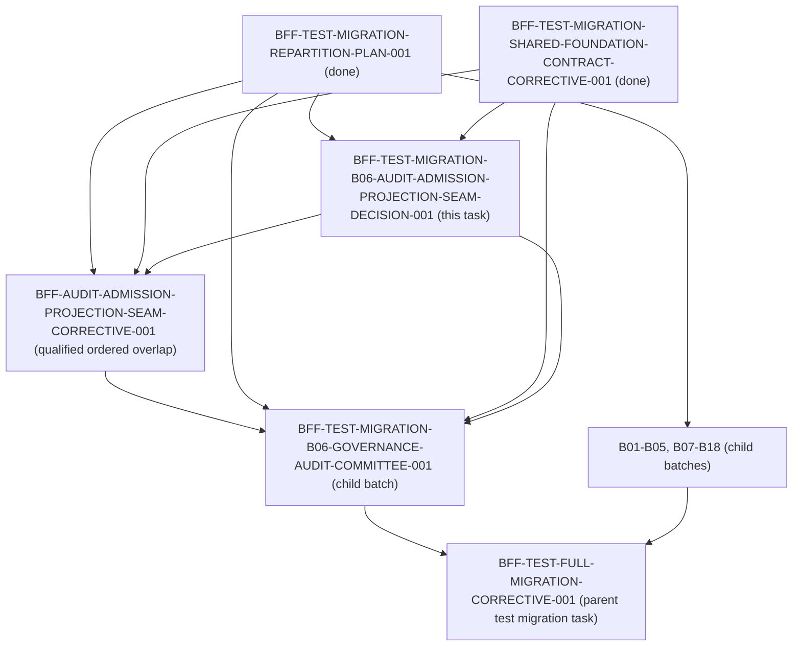

# BFF Test Migration B06 Audit-Admission & Projection Seam Decision

Status: canonical architectural decision for batch B06 command admission and audit event projection  
Task ID: `BFF-TEST-MIGRATION-B06-AUDIT-ADMISSION-PROJECTION-SEAM-DECISION-001`  
Owner: Antigravity2  
Reviewer: Antigravity  
Base Commit: `e6d480211ad34698d4ee97ec408d17cc019d0f08` (origin/dev)  
Related Tasks:
- `BFF-TEST-MIGRATION-REPARTITION-PLAN-001` (predecessor plan, done)
- `BFF-TEST-MIGRATION-SHARED-FOUNDATION-CONTRACT-CORRECTIVE-001` (predecessor shared foundation correction, done)
- `BFF-TEST-MIGRATION-B06-GOVERNANCE-AUDIT-COMMITTEE-001` (blocked child batch)
- `BFF-TEST-MIGRATION-B05-JOURNAL-CONTEXT-RESOLVER-SEAM-DECISION-001` (precedent seam decision task for B05)
- `BFF-AUDIT-ADMISSION-PROJECTION-SEAM-CORRECTIVE-001` (specified unique extraction successor task)
- `BFF-TEST-FULL-MIGRATION-CORRECTIVE-001` (parent test migration task)

---

## 1. Executive Summary & Problem Context

In the 18-batch BFF test migration repartition (`BFF-TEST-MIGRATION-REPARTITION-PLAN-001`), batch **B06** (`BFF-TEST-MIGRATION-B06-GOVERNANCE-AUDIT-COMMITTEE-001`) was assigned five governance audit and committee contract test files plus its task evidence manifest:
1. `services/control-plane/bff/test_aud_002_audit_action_write_engine.py`
2. `services/control-plane/bff/test_bff_governance_runtime_risk_audit_contract.py`
3. `services/control-plane/bff/test_cw03_committee_board_contract.py`
4. `services/control-plane/bff/test_pkt009_governance_audit_contract.py`
5. `services/control-plane/bff/tests/test_evochain_005_governance_writes.py`
6. `docs/deployment/evidence/BFF-TEST-MIGRATION-B06-GOVERNANCE-AUDIT-COMMITTEE-001/evidence.json`

During the execution of B06 (draft PR #5747, anchor commit `25c54a7ff510d1f1929a930a5d7aafb4ca3e7b62`), an architectural seam blocker was identified in `services/control-plane/bff/test_aud_002_audit_action_write_engine.py`:
- `test_aud_002_audit_action_write_engine.py` directly imports the BFF composition root: `import main as bff_main`.
- In its test fixture `_isolated_audit_client`, it monkeypatches module-level globals in `main.py`:
  - `bff_main.read_store = create_in_memory_read_surface_ports()`
  - `bff_main.command_store = CommandStore(...)`
  - `bff_main._FINAL_CONTRACT_IDEMPOTENCY.clear()`
  - `bff_main._GOV_BFF_IDEMPOTENCY.clear()`
  - Yields `TestClient(bff_main.app)`
- Under the architectural invariants enforced by `services/control-plane/bff/tests/test_bff_test_architecture.py` (`BFF-TEST-ARCH-001`):
  1. Migrated suites must **not** import the `main` composition root (`test_migrated_suites_do_not_import_main`).
  2. Migrated suites must **not** monkeypatch global state or stores (`test_no_global_monkeypatching_in_migrated_suites`).
  3. Migrated suites must **not** mutate `sys.path` to resolve root packages (`test_migrated_suites_do_not_mutate_sys_path`).

### The Seam Dilemma
When attempting to decouple `test_aud_002_audit_action_write_engine.py` from `main.py` using the available standalone router factories (`create_action_command_router` and `create_incident_router`), a critical behavioral discrepancy emerges:
1. **Action Admission Response Discrepancy**: Action admission (`POST /bff/actions/runtime/runtime-042/pause`) returns HTTP 202, but the response body `data` object **lacks `receipt_id`** (`response.json()["data"]["receipt_id"]` is absent).
2. **Command Store Foundation Discrepancy**: The persisted command record in `command_store` **lacks `foundation.audit_action`** (`record["foundation"]["audit_action"]` is absent).
3. **Audit Query Discrepancy**: When querying `GET /bff/audit?target_type=Runtime` or `GET /bff/audit?target_type=AuditExport`, the returned event list is completely empty (`len(audit.json()["data"]) == 0`). Command events in `command_store` are never projected into the `/bff/audit` read surface.
4. **Entity Readback Discrepancy**: `GET /bff/audit/entities/Runtime/runtime-042` returns 0 events.
5. **Audit Export Semantic Command Discrepancy**: `POST /bff/audit/export` returns 202 without `data.receipt_id` and does not project an `AuditExport` audit event.

B06 possesses a strict, test-only grant covering exactly the five test files and its evidence manifest. B06 has **no grant** on production code (`main.py`, `command_adapters/`, `incidents/`, or `ports/`). B06 cannot silently patch production code or add fallback hacks within its boundary. Furthermore, deleting or weakening the original AUD-002 assertions would degrade regression protection for command audit durability.

This decision document formally resolves this blocker by:
1. Reproducing and tracing the exact failure mode of the current main-free probe.
2. Formally contrasting `/bff/audit` with `/api/v1/operator/governance/audit`.
3. Evaluating candidate architectures and proving that **no existing public injectable seam exists**.
4. Specifying the unique upstream extraction successor task (`BFF-AUDIT-ADMISSION-PROJECTION-SEAM-CORRECTIVE-001`) with exact modular APIs, parameters, and parity invariants.
5. Defining the fresh-CAS operational runbook for Human/Ops to sequence the dependency graph without cycles or stale anchor reuse.

---

## 2. Reproduction and Trace of the Current Main-Free Probe

### 2.1 The Main-Free Probe Script & Execution

To isolate and prove the architectural gap without loading `services.control_plane.bff.main`, the following probe exercises `create_action_command_router` and `create_incident_router` with `CommandAdapterService` and `create_in_memory_read_surface_ports`:

```python
import json
import sys
import tempfile
from pathlib import Path
from types import SimpleNamespace

from fastapi import FastAPI
from fastapi.testclient import TestClient
from services.control_plane.bff.command_adapters.router import create_action_command_router
from services.control_plane.bff.command_adapters.service import CommandAdapterService
from services.control_plane.bff.command_queue import CommandStore
from services.control_plane.bff.incidents.router import create_incident_router
from services.control_plane.bff.ports import create_in_memory_read_surface_ports

with tempfile.TemporaryDirectory() as td:
    store = CommandStore(str(Path(td) / 'commands.jsonl'))
    reads = create_in_memory_read_surface_ports()
    identity = SimpleNamespace(operator_id='op-aud-002', roles={'operator'})
    extract = lambda *args, **kwargs: identity
    service = CommandAdapterService(command_store=store, read_surface=reads, extract_identity=extract)
    app = FastAPI()
    app.include_router(create_action_command_router(command_store=store, extract_identity=extract))
    app.include_router(create_incident_router(
        command_store=store, read_surface=reads, extract_identity=extract,
        submit_sem_command=service.sem_command_response,
    ))
    with TestClient(app) as client:
        response = client.post('/bff/actions/runtime/runtime-042/pause',
            headers={'Idempotency-Key': 'aud-002-runtime-pause'}, json={'reason': 'AUD-002 runtime audit write proof'})
        record = store._get_all_commands()[0]
        runtime = {
            'status': response.status_code,
            'receipt_id_present': 'receipt_id' in response.json()['data'],
            'foundation_audit_action_present': 'audit_action' in record['foundation'],
        }
        response = client.post('/bff/audit/export', headers={'Idempotency-Key': 'aud-002-export'},
            json={'target_type': 'Deployment', 'reason': 'AUD-002 export command'})
        record = store._get_all_commands()[-1]
        export = {
            'status': response.status_code,
            'receipt_id_present': 'receipt_id' in response.json()['data'],
            'foundation_audit_action_present': 'audit_action' in record['foundation'],
        }
        audit = client.get('/bff/audit', params={'target_type': 'AuditExport'})
        export['audit_status'] = audit.status_code
        export['audit_event_count'] = len(audit.json()['data'])
    result = {
        'runtime_action': runtime,
        'audit_export': export,
        'bff_main_loaded': 'services.control_plane.bff.main' in sys.modules or 'main' in sys.modules,
    }
    print(json.dumps(result, indent=2))
```

#### Exact Probe Execution Output
```json
{
  "runtime_action": {
    "status": 202,
    "receipt_id_present": false,
    "foundation_audit_action_present": false
  },
  "audit_export": {
    "status": 202,
    "receipt_id_present": false,
    "foundation_audit_action_present": false,
    "audit_status": 200,
    "audit_event_count": 0
  },
  "bff_main_loaded": false
}
```

### 2.2 Deep Architectural Trace of Responsibility

The probe failure reveals a structural split between the production composition root in `main.py` and the standalone router/service implementations:

```
[Incoming Request]
        |
        v
+-----------------------------------------------------------------------------------+
| Router Ingress Surface                                                            |
|  - POST /bff/actions/runtime/{id}/pause -> create_action_command_router           |
|  - POST /bff/audit/export               -> create_incident_router                 |
|  - GET  /bff/audit                      -> create_incident_router                 |
|  - GET  /bff/audit/entities/{type}/{id} -> create_incident_router                 |
+-----------------------------------------------------------------------------------+
        |
        | [In Production (main.py)]                     | [In Main-Free Routers]
        v                                               v
+---------------------------------------+       +-----------------------------------+
| main._submit_final_command_admission  |       | command_adapters/router.py        |
|  1. _build_foundation_command_context |       |  - Local fallback action record   |
|     -> builds AuditAction.record      |       |  - record['foundation'] lacks     |
|  2. Serializes foundation into        |       |    audit_action                   |
|     command_store record              |       |  - Response data lacks receipt_id |
|  3. _project_final_command_response   |       +-----------------------------------+
|     -> data.receipt_id = command_id   |       +-----------------------------------+
+---------------------------------------+       | command_adapters/service.py       |
        |                                       | sem_command_response:             |
        |                                       |  - foundation lacks audit_action  |
        v                                       |  - response data lacks receipt_id |
+---------------------------------------+       +-----------------------------------+
| CommandStore Persistence              |                       |
|  - commands.jsonl contains full       |                       v
|    record with foundation.audit_action|       +-----------------------------------+
+---------------------------------------+       | incidents/service.py              |
        |                                       | list_audit_events:                |
        v                                       |  - Only queries ReadSurfacePorts  |
+---------------------------------------+       |  - CommandStore is NOT read       |
| main._list_governance_audit_events    |       |  - ZERO projected command events  |
|  1. Queries ReadSurfacePorts          |       |    returned (count: 0)            |
|  2. Queries AgoraAuditStore           |       +-----------------------------------+
|  3. Iterates command_store commands   |
|  4. _project_command_record_audit_event
|     -> event['command_ref']           |
|     -> event['audit_action']          |
|  5. Merges & sorts by timestamp       |
+---------------------------------------+
```

#### Line-by-Line Code Responsibility Trace:
1. **Command Admission & Foundation Context (`main.py:1061-1155, 7233-7570`)**:
   - `_build_foundation_command_context` (line 1061) constructs `AuditAction.record(actor_ref=..., action_type="bff.command.accepted", target_ref="Runtime:runtime-042", payload_checksum=..., trace=...)`.
   - `_submit_final_command_admission` (line 7447) places the serialized foundation context containing `audit_action` into `audit_record["foundation"]` and passes it to `_persist_admitted_command_with_confirm_token` (line 7519), storing it directly in `command_store`.
   - `_project_final_command_response` (lines 6974-7026) calls `_project_command_submission_response` (line 6900), which populates `legacy_payload["receipt_id"] = command_id`. This guarantees `response.json()["data"]["receipt_id"]` is present and non-null.
2. **Action Router Fallback Defect (`command_adapters/router.py:404-485`)**:
   - When `create_action_command_router` is invoked without `submit_command_admission`, `_dispatch_action` falls through to lines 404–485.
   - At line 414, `record["foundation"]` contains only `admission_route`, `source_route`, `trace_context`, `idempotency_record`, `policy_decision`, and `command_envelope`. **`audit_action` is completely omitted** from `record["foundation"]`. (A dummy stub is placed under `record["audit"]["foundation"]`, which does not match canonical foundation schema).
   - At lines 476–483, `content["data"]` contains `"command"`, `"command_id"`, `"deprecated"`, `"deprecation"`, and `"receipt"`. **`receipt_id` is absent** from `content["data"]`.
3. **Semantic Command Defect (`command_adapters/service.py:591-642`)**:
   - `CommandAdapterService.sem_command_response` builds `foundation_ctx` containing only `idempotency_record` (line 591). It does not create `AuditAction.record`.
   - `result_content["data"]` contains only `"command"`, `"target"`, and `"receipt"`. **`receipt_id` is absent** from `data`.
4. **Audit Projection & Query Defect (`main.py:1405-1555` vs `incidents/service.py:1181-1200`)**:
   - In `main.py:1496`, `_list_governance_audit_events` explicitly iterates through `command_store._get_all_commands()` when `include_command_store=True` (line 1540).
   - For each command record, it calls `_project_command_record_audit_event(record)` (line 1405), which transforms the command record into an audit event dict containing:
     - `entry_id = audit_action["action_id"] or f"audit-{command_id}"`
     - `actor = audit["operator_id"]`
     - `action_type = record["type"]` (e.g. `"RuntimeAction"`, `"AuditExport"`)
     - `target_id = target["id"]` (e.g. `"runtime-042"`, `"Deployment"`)
     - `audit_context["idempotency_key"] = idempotency_key`
     - `command_ref = command_id`
     - `trace_id = audit_action["trace_id"]`
     - `payload_checksum = audit_action["payload_checksum"]`
     - `audit_action = audit_action`
   - In contrast, in `incidents/service.py:1181`, `IncidentService.list_audit_events` delegates solely to `store.list_governance_audit_events(...)` on `ReadSurfacePorts`. `ReadSurfacePorts` has no reference to `command_store` and performs zero command projection. As a result, `client.get("/bff/audit", params={"target_type": "Runtime"})` and `/bff/audit/export` return **zero command events**.
5. **Entity Readback Defect (`incidents/router.py:1079-1109`)**:
   - `GET /bff/audit/entities/{entity_type}/{entity_id}` calls `_list_audit(target_type=clean_type)` and filters `events` by `target_id`. Since `_list_audit` yields no command-projected events, entity readback returns `events: []`.

---

## 3. Distinction Between B06 `/bff/audit` and `/api/v1/operator/governance/audit`

A critical acceptance criterion requires formally distinguishing the two audit read surfaces present in B06. They serve different consumers, carry different schemas, and reside in different router domains:

| Architectural Dimension | Surface A: `/bff/audit` (and subroutes) | Surface B: `/api/v1/operator/governance/audit` |
|---|---|---|
| **Route Definitions** | `GET /bff/audit`<br>`GET /bff/audit/events`<br>`GET /bff/audit/entities/{entity_type}/{entity_id}`<br>`GET /bff/audit/export`<br>`POST /bff/audit/export` (202) | `GET /api/v1/operator/governance/audit` |
| **Router Module** | `services/control-plane/bff/incidents/router.py` (`create_incident_router`) | `services/control-plane/bff/governance/router.py` (`create_governance_router`) |
| **Test Suites** | `test_aud_002_audit_action_write_engine.py`<br>`test_bff_governance_runtime_risk_audit_contract.py` | `test_pkt009_governance_audit_contract.py` |
| **Primary Consumer** | Operator UI (`execute-plans`), Incident & Action tracking, command confirmation | Governance committee, compliance reviews, approval decision ledgers |
| **Backing Data Sources** | **Composite**: `ReadSurfacePorts` + `AgoraAuditStore` + **`CommandStore` live projection** | **Static / Port**: `ReadSurfacePorts.list_governance_audit_events` only |
| **Command Event Projection** | **Mandatory**: Must project admitted `CommandStore` records into `AuditAction` events with `command_ref`, `actor`, `action_type`, `target_id`, `audit_context`, `trace_id`, and `payload_checksum` | **None**: Does not ingest or project `CommandStore` records |
| **Response Schema Shape** | Top-level: `data` (or `items` / `events`), `page_info`, `meta.read_meta` (staleness, surface status) | Top-level: `entries`, `page_info`, `meta.surfaces.audit_trail` (status, source) |
| **Idempotent Replay Handling** | `/bff/audit/export` supports replay with `meta.idempotency.replayed = True` and preserved `receipt_id` | Read-only GET endpoint; pagination via `next_page_token` |

### Why Conflating the Surfaces Fails
Attempting to satisfy B06 by pointing AUD-002 at `/api/v1/operator/governance/audit` or modifying the governance audit schema would violate architectural invariants:
1. It alters the contracted API route (`/bff/audit` is consumed by `execute-plans` frontend components).
2. It fails to test the real command-to-audit projection pipeline that guarantees operator commands produce durable, queryable audit events.
3. It breaks `test_pkt009_governance_audit_contract.py`, which specifically validates pagination, token windows, and degraded surface metadata against `ReadSurfacePorts`.

---

## 4. Evaluation of Candidate Seam Architectures

We evaluate five candidate approaches for resolving the B06 seam:

| Evaluation Dimension | Candidate 1: Upstream Seam Extraction via Qualified Ordered Overlap (`BFF-AUDIT-ADMISSION-PROJECTION-SEAM-CORRECTIVE-001`) [SELECTED] | Candidate 2: In-Test Mocking / Faking in B06 [REJECTED] | Candidate 3: In-Batch Production Edit in B06 [REJECTED] | Candidate 4: Reroute AUD-002 to `/api/v1/operator/governance/audit` [REJECTED] | Candidate 5: Direct Dependency on Parent/Downstream Task [REJECTED] |
|---|---|---|---|---|---|
| **Root Cause Resolution** | **High**: Extracts monolithic admission and projection logic from `main.py` into dedicated, injectable domain modules. | **None**: Replaces real behavior with test doubles; production code remains monolithic and broken for standalone callers. | **Medium**: Patches production code inside B06 without prerequisite governance. | **None**: Changes the read surface being tested; avoids the missing projection problem. | **None**: Postpones decoupling or creates circular dependencies. |
| **Regression Preservation** | **Full**: 100% of AUD-002 assertions (`data.receipt_id`, `foundation.audit_action`, `command_ref`, idempotency replay) are preserved against real logic. | **Zero**: Mocking returns canned dicts; regression protection for audit durability is eliminated. | **Full**: Preserves assertions, but violates task contract. | **Zero**: Destroys test coverage for `/bff/audit` route contract. | **None**: Blocked. |
| **Architectural Gate (`BFF-TEST-ARCH-001`)** | **100% Compliant**: Eliminates `import main`, eliminates monkeypatching, passes all 8 architectural tests. | **Compliant on paper, fake in substance**. | **100% Compliant**, but breaches task scope boundaries. | **Compliant**, but invalid functional outcome. | **Non-compliant**: Stalls pipeline. |
| **Task Boundary & Grant Integrity** | **Strictly Preserved**: B06 remains a 5-test suite grant; production changes land in a dedicated functional task. | **Preserved**, but produces fraudulent evidence. | **Violated**: B06 touches production files outside its 6-file contract. | **Preserved**, but modifies test semantics. | **Violated**: Violates repartition plan. |
| **DAG Topology & Acyclicity** | **Strictly Acyclic**: Upstream task precedes B06; zero cycles; follows B05 and B09 precedent. | **Acyclic**, but invalid. | **Acyclic**, but violates grant. | **Acyclic**, but invalid. | **Circular**: B06 -> Parent -> B06 creates fatal topological cycle. |

### Decision
**Candidate 1 is selected.**  
Extracting the command admission and audit event projection logic into modular, injectable services via a dedicated upstream task (`BFF-AUDIT-ADMISSION-PROJECTION-SEAM-CORRECTIVE-001`) eliminates the monolithic dependencies in `main.py`, provides clean dependency injection for B06, preserves all original assertions, and maintains strict topological DAG acyclicity.

---

## 5. Target Seam Specification: `BFF-AUDIT-ADMISSION-PROJECTION-SEAM-CORRECTIVE-001`

### 5.1 Successor Task Identity & Scope
- **Task ID**: `BFF-AUDIT-ADMISSION-PROJECTION-SEAM-CORRECTIVE-001`
- **Title**: Extract command admission and audit projection seams for B06
- **Phase**: BFF test migration B06 prerequisite
- **Owner**: `Codex`
- **Reviewer**: `Claude`
- **Declared Artifacts**:
  1. `services/control-plane/bff/command_adapters/admission.py` (new command admission service)
  2. `services/control-plane/bff/incidents/audit_projection.py` (new command-to-audit projection engine and composite reader)
  3. `services/control-plane/bff/main.py` (composition root wiring and delegation)
  4. `services/control-plane/bff/tests/test_command_admission_audit_projection_seam.py` (focused unit/contract tests for extracted seams)
  5. `docs/deployment/evidence/BFF-AUDIT-ADMISSION-PROJECTION-SEAM-CORRECTIVE-001/evidence.json`

### 5.2 Seam Component 1: `CommandAdmissionService`
**File**: `services/control-plane/bff/command_adapters/admission.py`

#### Interface Contract
```python
"""Command admission and receipt projection service.

Decoupled from composition root globals. Manages operator command validation,
foundation context assembly (including AuditAction recording), idempotent replay,
command store persistence, and response receipt projection.
"""
from __future__ import annotations

from datetime import datetime, timezone
from typing import Any, Callable, Dict, List, Optional, Tuple
from fastapi import BackgroundTasks, HTTPException
from starlette.responses import JSONResponse

from services.control_plane.bff.models import (
    ActionCommandStatus,
    AuditAction,
    AuthorityScope,
    CommandEnvelope,
    CommandResponse,
    CommandStatus,
    CommandSubmissionResponse,
    CommandType,
    IdempotencyRecord,
    ObjectType,
    OperatorCommand,
    OperatorIdentity,
    PolicyDecision,
    PolicyDecisionValue,
    StalenessWarning,
    TargetObject,
    TraceContext,
)


class CommandAdmissionService:
    """Modular command admission and response projection engine."""

    def __init__(
        self,
        *,
        command_store: Any,
        read_surface: Optional[Any] = None,
        extract_identity: Optional[Callable[[Optional[str]], OperatorIdentity]] = None,
        require_operator_role: Optional[Callable[[OperatorIdentity], None]] = None,
        utc_now: Optional[Callable[[], str]] = None,
        resolve_idempotency_key: Optional[Callable[..., str]] = None,
        reject_body_idempotency_key: Optional[Callable[[Dict[str, Any]], None]] = None,
        bff_error: Optional[Callable[..., HTTPException]] = None,
    ) -> None:
        self.command_store = command_store
        self.read_surface = read_surface
        self._extract_ident = extract_identity or (lambda auth: OperatorIdentity(operator_id="operator", roles=["operator"]))
        self._require_op = require_operator_role or (lambda ident: None)
        self._utc_now = utc_now or (lambda: datetime.now(timezone.utc).isoformat().replace("+00:00", "Z"))
        self._resolve_key = resolve_idempotency_key or (lambda k, xk: str(k or xk or "").strip())
        self._reject_body_key = reject_body_idempotency_key or (lambda p: None)
        self._bff_err = bff_error
        self._final_contract_idempotency: Dict[str, Dict[str, Any]] = {}

    def build_foundation_context(
        self,
        *,
        cmd: OperatorCommand,
        identity: OperatorIdentity,
        raw_payload: Dict[str, Any],
        idempotency_key: str,
        route: str,
        source_route: Optional[str] = None,
        trace_id: Optional[str] = None,
        correlation_id: Optional[str] = None,
        request_id: Optional[str] = None,
    ) -> Dict[str, Any]:
        """Build canonical foundation context, including TraceContext, CommandEnvelope, and AuditAction."""
        ...

    def submit_action_command(
        self,
        *,
        background_tasks: Optional[BackgroundTasks] = None,
        payload: Dict[str, Any],
        authorization: Optional[str] = None,
        x_mfa_token: Optional[str] = None,
        x_trace_id: Optional[str] = None,
        x_correlation_id: Optional[str] = None,
        x_request_id: Optional[str] = None,
        x_confirm_token: Optional[str] = None,
        idempotency_key: Optional[str] = None,
        x_idempotency_key: Optional[str] = None,
        route: str = "POST /bff/actions",
        source_route: Optional[str] = None,
        audit_extra: Optional[Dict[str, Any]] = None,
        extra_precondition: Optional[Callable[[OperatorIdentity, OperatorCommand], None]] = None,
        enqueue: bool = True,
        include_durable_meta: bool = True,
        response_deprecation: Optional[Dict[str, Any]] = None,
    ) -> CommandResponse[Dict[str, Any]]:
        """Submit an action command with full foundation audit_action and data.receipt_id projection."""
        ...

    def submit_sem_command(
        self,
        *,
        command_type: CommandType,
        target_type: ObjectType,
        target_id: str,
        payload: Dict[str, Any],
        identity: OperatorIdentity,
        idempotency_key: Optional[str] = None,
        x_idempotency_key: Optional[str] = None,
        status_code: int = 202,
        server_generated_target: bool = False,
        trusted_evidence_producer: Optional[str] = None,
        terminal_on_persist: bool = False,
    ) -> JSONResponse:
        """Submit a semantic command (e.g. AUDIT_EXPORT) with idempotent replay and data.receipt_id."""
        ...
```

### 5.3 Seam Component 2: `CommandAuditProjector`
**File**: `services/control-plane/bff/incidents/audit_projection.py`

#### Interface Contract
```python
"""Command-to-Audit projection and composite audit event reader.

Decoupled from composition root globals. Purely projects command_store JSONL
records into governance audit event shapes and provides a composite reader
that unifies ReadSurfacePorts, AgoraAuditStore, and CommandStore.
"""
from __future__ import annotations

from datetime import datetime, timezone
from typing import Any, Callable, Dict, List, Optional


class CommandAuditProjector:
    """Projector that transforms command store records into canonical audit events."""

    def __init__(
        self,
        *,
        command_store: Any,
        read_surface: Optional[Any] = None,
        agora_audit_store: Optional[Any] = None,
        utc_now: Optional[Callable[[], str]] = None,
    ) -> None:
        self.command_store = command_store
        self.read_surface = read_surface
        self.agora_audit_store = agora_audit_store
        self._utc_now = utc_now or (lambda: datetime.now(timezone.utc).isoformat().replace("+00:00", "Z"))

    def project_command_record(self, record: Dict[str, Any]) -> Optional[Dict[str, Any]]:
        """Project a raw command store record into the canonical audit event dictionary."""
        command_id = str(record.get("command_id") or "").strip()
        if not command_id:
            return None
        target = record.get("target") if isinstance(record.get("target"), dict) else {}
        audit = record.get("audit") if isinstance(record.get("audit"), dict) else {}
        foundation = record.get("foundation") if isinstance(record.get("foundation"), dict) else {}
        
        # Extract audit_action from foundation or audit.foundation
        audit_action = foundation.get("audit_action")
        if not isinstance(audit_action, dict):
            audit_action = (audit.get("foundation") or {}).get("audit_action")
        if not isinstance(audit_action, dict):
            audit_action = {}

        idempotency_record = (
            foundation.get("idempotency_record")
            if isinstance(foundation.get("idempotency_record"), dict)
            else (audit.get("foundation") or {}).get("idempotency_record") or {}
        )
        audit_actor_ref = audit_action.get("actor_ref") if isinstance(audit_action.get("actor_ref"), dict) else {}
        metadata = audit_action.get("metadata") if isinstance(audit_action.get("metadata"), dict) else {}
        trace_context = foundation.get("trace_context") if isinstance(foundation.get("trace_context"), dict) else {}

        action_type = str(record.get("type") or metadata.get("command") or "").strip()
        target_type = str(target.get("type") or "").strip()
        target_id = str(target.get("id") or "").strip()
        timestamp = str(
            audit.get("timestamp")
            or audit_action.get("timestamp")
            or record.get("submitted_at")
            or self._utc_now()
        )
        reason = str(audit.get("reason") or audit_action.get("reason") or action_type or "operator command")

        event = {
            "entry_id": str(audit_action.get("action_id") or f"audit-{command_id}"),
            "actor": str(
                audit.get("operator_id")
                or audit.get("actor")
                or audit_actor_ref.get("actor_id")
                or "operator"
            ),
            "action_type": action_type,
            "target_type": target_type,
            "target_id": target_id,
            "timestamp": timestamp,
            "outcome": "accepted" if record.get("status") in {"submitted", "accepted"} else record.get("status"),
            "audit_context": {
                "reason": reason,
                "command_id": command_id,
                "receipt_id": command_id,
                "idempotency_key": (
                    idempotency_record.get("idempotency_key")
                    or metadata.get("idempotency_key")
                    or audit.get("idempotency_key")
                ),
                "action_id": audit.get("action_id"),
                "foundation_action_type": audit_action.get("action_type"),
            },
            "evidence_refs": audit.get("evidence_refs") if isinstance(audit.get("evidence_refs"), list) else [],
            "command_ref": command_id,
            "trace_id": audit_action.get("trace_id") or trace_context.get("trace_id"),
            "correlation_id": (
                audit_action.get("correlation_id")
                or trace_context.get("correlation_id")
            ),
            "payload_checksum": audit_action.get("payload_checksum"),
            "audit_action": audit_action or None,
            "metadata": {
                "source": "command_store",
                "route": metadata.get("route"),
                "source_route": metadata.get("source_route"),
                "live_capital_side_effects": audit.get("live_capital_side_effects", False),
            },
        }
        return event

    def list_governance_audit_events(
        self,
        *,
        actor: Optional[str] = None,
        action_types: Optional[List[str]] = None,
        target_type: Optional[str] = None,
        from_ts: Optional[datetime] = None,
        to_ts: Optional[datetime] = None,
        include_command_store: bool = True,
        include_fixture_pack: bool = True,
    ) -> List[Dict[str, Any]]:
        """Composite audit event reader merging ReadSurfacePorts, AgoraAuditStore, and CommandStore."""
        ...

    def get_entity_audit_events(
        self,
        entity_type: str,
        entity_id: str,
        *,
        actor: Optional[str] = None,
    ) -> List[Dict[str, Any]]:
        """Retrieve audit events filtered for a specific target entity."""
        ...
```

### 5.4 Composition Root Delegation in `main.py`
In `main.py`, the existing module-level globals delegate to instances of `CommandAdmissionService` and `CommandAuditProjector`:

```python
from .command_adapters.admission import CommandAdmissionService
from .incidents.audit_projection import CommandAuditProjector

# Instantiate modular services with composition globals
_admission_service = CommandAdmissionService(
    command_store=command_store,
    read_surface=read_store,
    extract_identity=_extract_identity,
    require_operator_role=_require_operator_role,
    utc_now=utc_now,
    resolve_idempotency_key=_resolve_final_idempotency_key,
    reject_body_idempotency_key=_reject_body_idempotency_key,
    bff_error=_bff_error,
)

_audit_projector = CommandAuditProjector(
    command_store=command_store,
    read_surface=read_store,
    agora_audit_store=agora_audit_store,
    utc_now=utc_now,
)

def _submit_final_command_admission(*args, **kwargs):
    return _admission_service.submit_action_command(*args, **kwargs)

def _sem_command_response(*args, **kwargs):
    return _admission_service.submit_sem_command(*args, **kwargs)

def _project_command_record_audit_event(record):
    return _audit_projector.project_command_record(record)

def _list_governance_audit_events(*args, **kwargs):
    return _audit_projector.list_governance_audit_events(*args, **kwargs)
```

### 5.5 Decoupled Test Invocations in `test_aud_002_audit_action_write_engine.py`
With these two modular seams extracted, B06 refactors `test_aud_002_audit_action_write_engine.py` without importing `main.py` and without monkeypatching:

```python
@contextmanager
def _isolated_audit_client(*, allow_fallback: bool) -> Iterator[TestClient]:
    del allow_fallback
    with tempfile.TemporaryDirectory() as td:
        command_store = CommandStore(os.path.join(td, "commands.jsonl"))
        read_store = create_in_memory_read_surface_ports()
        identity = OperatorIdentity(
            operator_id="op-aud-002",
            roles=["operator", "reviewer", "approver"],
            mfa_verified=True,
            claims={"tid": "tenant-a", "sub": "op-aud-002"},
        )
        extract = lambda *args, **kwargs: identity
        
        admission_service = CommandAdmissionService(
            command_store=command_store,
            read_surface=read_store,
            extract_identity=extract,
        )
        audit_projector = CommandAuditProjector(
            command_store=command_store,
            read_surface=read_store,
        )

        app = FastAPI()
        app.include_router(create_action_command_router(
            command_store=command_store,
            read_surface=read_store,
            extract_identity=extract,
            submit_command_admission=admission_service.submit_action_command,
        ))
        app.include_router(create_incident_router(
            command_store=command_store,
            read_surface=read_store,
            extract_identity=extract,
            submit_sem_command=admission_service.submit_sem_command,
            list_governance_audit_events=audit_projector.list_governance_audit_events,
        ))

        yield TestClient(app, raise_server_exceptions=False)
```

**Parity Guarantees**:
1. Zero imports of `services.control_plane.bff.main` or `main`.
2. Zero monkeypatching of global `read_store` or `command_store`.
3. Preserves `response.json()["data"]["receipt_id"]`.
4. Preserves `record["foundation"]["audit_action"]`.
5. Preserves queryability via `GET /bff/audit?target_type=Runtime` and `GET /bff/audit?target_type=AuditExport`.
6. Preserves entity readback at `/bff/audit/entities/Runtime/runtime-042`.
7. Preserves idempotency replay semantics (`meta.idempotency.replayed = True`).

---

## 6. Governance Sequence, DAG Acyclicity Proof, & Fresh-CAS Protocol

### 6.1 Topological Proof of Acyclicity



- **Forward Edges Only**: All edges strictly flow upstream $\to$ downstream.
- **Cycle Freedom**:
  $$\text{Cycles} = \emptyset$$
- **Prerequisite Invariant**: B06 depends on `PLAN-001`, `SHARED-001`, `B06-DECISION-001`, and `BFF-AUDIT-ADMISSION-PROJECTION-SEAM-CORRECTIVE-001`.
- **Preclusion of Circularity**: The extraction task does not depend on B06, the parent task, or downstream runtime tasks.

### 6.2 Human/Ops Fresh-CAS Sequence & Operational Runbook

Because canonical task state in `ai-status.json` mutates when tasks transition or contracts change, Human/Ops must use a **fresh-CAS sequence** rather than a stale digest.

#### Step 1: Decision Task Closeout & Merge
1. Owner delivers `task/BFF-TEST-MIGRATION-B06-AUDIT-ADMISSION-PROJECTION-SEAM-DECISION-001` via PR with exact-head manifest.
2. Reviewer `Antigravity` conducts exact-head review and executes `ai-status.sh approve`.
3. The **Pantheon supervisor integration runner** merges the approved PR into `dev` (review-before-merge; no auto-merge).
4. Owner finalizes closeout to canonical `done`.

#### Step 2: Governed DevTaskPacket Admission of Seam Task
Operator assistant (`codex-chatbox` or Human/Ops) signs and dispatches a `DevTaskPacket` to `.orchestrator/assistant-dev-packets/`:
- **Task ID**: `BFF-AUDIT-ADMISSION-PROJECTION-SEAM-CORRECTIVE-001`
- **Owner**: `Codex`
- **Reviewer**: `Claude`
- **Depends On**:
  - `BFF-TEST-MIGRATION-REPARTITION-PLAN-001`
  - `BFF-TEST-MIGRATION-SHARED-FOUNDATION-CONTRACT-CORRECTIVE-001`
  - `BFF-TEST-MIGRATION-B06-AUDIT-ADMISSION-PROJECTION-SEAM-DECISION-001`
- **Artifacts**:
  - `services/control-plane/bff/command_adapters/admission.py`
  - `services/control-plane/bff/incidents/audit_projection.py`
  - `services/control-plane/bff/main.py`
  - `services/control-plane/bff/tests/test_command_admission_audit_projection_seam.py`
  - `docs/deployment/evidence/BFF-AUDIT-ADMISSION-PROJECTION-SEAM-CORRECTIVE-001/evidence.json`

Supervisor admits the task into `ai-status.json`.

#### Step 3: Fresh-CAS Dependency Update on B06 Before Execution
Before the seam task begins source execution, Human/Ops serializes B06 behind the extraction task by computing the fresh CAS digest of B06:

```bash
python3 -c "
import json, os, hashlib
status_root = os.environ.get('PANTHEON_STATUS_ROOT', '.')
state = json.load(open(os.path.join(status_root, 'ai-status.json')))
task = next(t for t in state['tasks'] if t['id'] == 'BFF-TEST-MIGRATION-B06-GOVERNANCE-AUDIT-COMMITTEE-001')
fresh_sha = hashlib.sha256(json.dumps(task, sort_keys=True, separators=(',', ':'), ensure_ascii=False).encode('utf-8')).hexdigest()
req = {
    'reason': 'Establish writer order before source execution: serialize B06 after upstream audit-admission projection seam task while strictly retaining all existing prerequisite edges',
    'tasks': [{
        'task_id': 'BFF-TEST-MIGRATION-B06-GOVERNANCE-AUDIT-COMMITTEE-001',
        'expected_sha256': fresh_sha,
        'depends_on': [
            'BFF-TEST-MIGRATION-REPARTITION-PLAN-001',
            'BFF-TEST-MIGRATION-SHARED-FOUNDATION-CONTRACT-CORRECTIVE-001',
            'BFF-TEST-MIGRATION-B06-AUDIT-ADMISSION-PROJECTION-SEAM-DECISION-001',
            'BFF-AUDIT-ADMISSION-PROJECTION-SEAM-CORRECTIVE-001'
        ]
    }]
}
open('/tmp/b06-dep-req.json', 'w').write(json.dumps(req, indent=2))
"
AI_NAME=Human/Ops "$PANTHEON_COMMAND_ROOT/scripts/ai-status.sh" dependency-contract /tmp/b06-dep-req.json
```

**Governed Hold on B06**:
- B06 remains in `blocked` state (`waiting_for: "BFF-AUDIT-ADMISSION-PROJECTION-SEAM-CORRECTIVE-001"`).
- B06 **must NOT reuse** the stale/diverged PR #5747 anchor.
- Supervisor will not dispatch B06 while `BFF-AUDIT-ADMISSION-PROJECTION-SEAM-CORRECTIVE-001` is running.

#### Step 4: Implement & Merge `BFF-AUDIT-ADMISSION-PROJECTION-SEAM-CORRECTIVE-001`
1. Worker `Codex` implements `CommandAdmissionService` and `CommandAuditProjector`.
2. Updates `main.py` composition root to delegate to the new modular instances.
3. Adds unit tests in `services/control-plane/bff/tests/test_command_admission_audit_projection_seam.py`.
4. Passes checks and delivers via PR.
5. Reviewer `Claude` approves exact head.
6. Supervisor integration runner merges PR to `dev`.
7. Task transitions to `done`.

#### Step 5: Redispatch & Deliver B06
1. B06 is reopened on a clean task branch from updated `dev` tip (discarding PR #5747).
2. Decouples all five B06 test suites:
   - `test_aud_002_audit_action_write_engine.py`: uses `CommandAdmissionService` and `CommandAuditProjector` (0 `main` imports).
   - `test_bff_governance_runtime_risk_audit_contract.py`: decoupled from `main.py`.
   - `test_cw03_committee_board_contract.py`: decoupled from `main.py`.
   - `test_pkt009_governance_audit_contract.py`: uses governance router directly (0 `main` imports).
   - `tests/test_evochain_005_governance_writes.py`: uses `services.control_plane.bff.evolution.service.evolution_journal_rollback_item` directly (0 `main` imports).
3. Validates all tests pass and `test_bff_test_architecture.py` reports 0 violations.
4. Delivers B06 to `dev`.

---

## 7. Verification & Audit Trail

| Step | Verification Command | Expected Outcome | Observed Result |
|---|---|---|---|
| **1. Architecture Tests** | `.venv/bin/python -m pytest -v services/control-plane/bff/tests/test_bff_test_architecture.py` | 8 passed in ~2s; inventory well-formed, all 5 architectural layers represented, migrated suites bounded | 8 passed in 1.66s |
| **2. Seam Mismatch Probe** | `.venv/bin/python -c "<probe_script>"` | Reproduces missing `data.receipt_id`, missing `foundation.audit_action`, and 0 audit event readback when bypassing `main.py` | Exact output confirmed: `receipt_id_present: false`, `foundation_audit_action_present: false`, `audit_event_count: 0`, `bff_main_loaded: false` |
| **3. Clean Task Worktree** | `git status -sb` | `## task/BFF-TEST-MIGRATION-B06-AUDIT-ADMISSION-PROJECTION-SEAM-DECISION-001` with only the two declared doc/evidence paths | Confirmed clean; 0 leaked or modified files |

---

## 8. Conclusion

The command admission and audit event projection gap blocking child batch B06 is fully diagnosed. It cannot be resolved within B06's 6-file test grant without faking audit behavior or violating architectural invariants. The extraction successor `BFF-AUDIT-ADMISSION-PROJECTION-SEAM-CORRECTIVE-001` provides the exact, modular, production-grade seam needed to achieve clean decoupling with 100% test assertion fidelity and zero DAG cycles.
